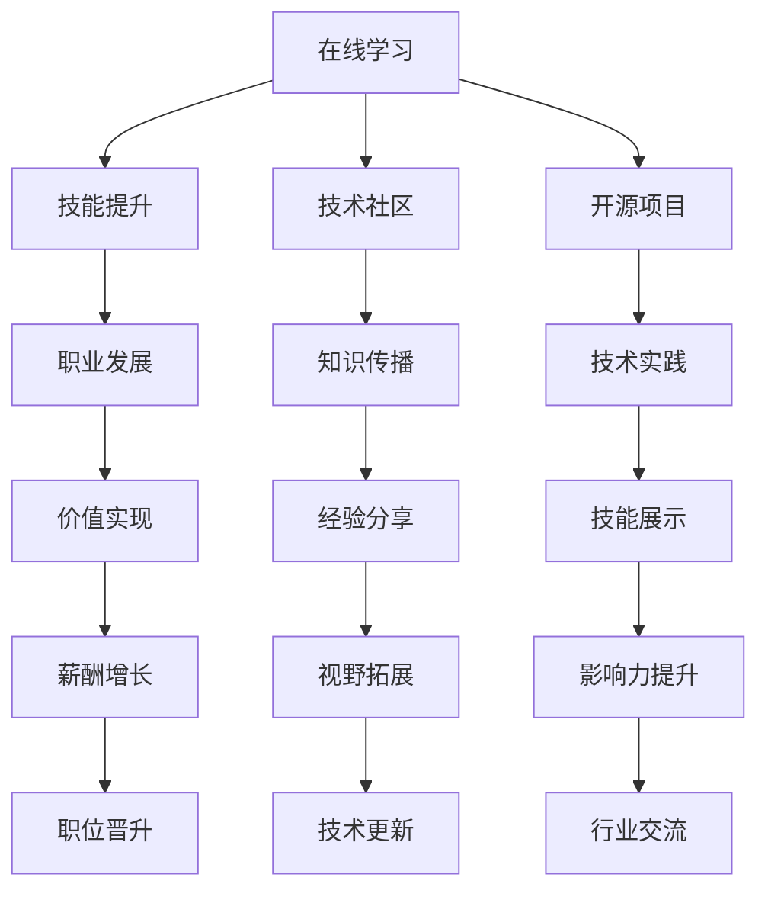

                 

### 1. 背景介绍

#### 1.1 目的和范围

本文旨在探讨知识付费时代程序员的发展前景。随着信息技术的高速发展，知识付费已经成为了一种新兴的消费模式，尤其是在程序员群体中，对优质知识和技能的需求愈发强烈。本文将围绕以下几个核心问题展开讨论：

- 知识付费对程序员技能提升的作用机制；
- 程序员在知识付费时代如何更好地规划自己的职业发展；
- 知识付费平台如何满足程序员的需求，并推动行业的发展；
- 知识付费时代面临的挑战和机遇。

#### 1.2 预期读者

本文主要面向程序员、IT从业者、技术爱好者和对知识付费有浓厚兴趣的读者。无论您是初入职场的编程新手，还是经验丰富的老手，抑或是对技术充满热情的业余爱好者，本文都将为您带来有价值的见解和思考。

#### 1.3 文档结构概述

本文将按照以下结构进行论述：

1. **背景介绍**：概述知识付费时代的背景，明确本文的目的和范围。
2. **核心概念与联系**：介绍知识付费时代程序员发展的核心概念，并通过Mermaid流程图展示其相互关系。
3. **核心算法原理 & 具体操作步骤**：详细讲解知识付费在程序员职业发展中的应用原理，并提供具体操作步骤。
4. **数学模型和公式 & 详细讲解 & 举例说明**：使用数学模型和公式，深入分析知识付费时代程序员的发展趋势。
5. **项目实战：代码实际案例和详细解释说明**：通过实际案例，展示知识付费在程序员技能提升中的应用。
6. **实际应用场景**：探讨知识付费在程序员日常工作和项目开发中的应用。
7. **工具和资源推荐**：推荐学习资源、开发工具和框架，以帮助程序员更好地应对知识付费时代的需求。
8. **总结：未来发展趋势与挑战**：总结本文的主要观点，并对未来发展趋势和挑战进行展望。
9. **附录：常见问题与解答**：针对读者可能遇到的疑问进行解答。
10. **扩展阅读 & 参考资料**：提供进一步学习的资源和文献。

#### 1.4 术语表

在本文中，我们将使用以下术语：

- **知识付费**：指消费者为获取知识或技能而付费的行为。
- **程序员**：指从事软件开发、编程和系统维护等工作的专业人员。
- **职业发展**：指个人在职业领域内的成长和进步。
- **技能提升**：指通过学习和实践，提高个人在某一领域的专业技能。
- **知识付费平台**：指提供知识付费服务的在线平台。

#### 1.4.1 核心术语定义

- **知识付费**：知识付费是指消费者通过付费方式获取知识、技能或经验的服务。这种模式在互联网时代得到了广泛应用，尤其是在程序员群体中。程序员通过购买在线课程、参加培训、购买电子书等方式，不断提升自己的专业技能。
- **程序员**：程序员是从事软件开发、编程和系统维护等工作的专业人员。他们通常具备扎实的计算机科学基础和编程技能，能够编写高效、可靠的代码，解决复杂的计算机问题。
- **职业发展**：职业发展是指个人在职业生涯中不断成长、进步的过程。对于程序员来说，职业发展包括技能提升、职位晋升、薪酬增长等多个方面。
- **技能提升**：技能提升是指通过学习和实践，提高个人在某一领域的专业技能。技能提升是程序员在职业发展中不可或缺的一部分，它有助于提高工作效率、提升竞争力。
- **知识付费平台**：知识付费平台是指提供知识付费服务的在线平台。这些平台通常提供多样化的课程、培训和咨询服务，帮助程序员高效地提升自己的技能。

#### 1.4.2 相关概念解释

- **在线学习**：在线学习是指通过互联网获取知识和技能的学习方式。在线学习具有灵活、便捷、个性化的特点，适合现代程序员的时间安排和学习习惯。
- **技术社区**：技术社区是指程序员聚集在一起交流、分享知识和经验的平台。技术社区有助于程序员拓展视野、提高技能，同时也是职业发展的良好渠道。
- **开源项目**：开源项目是指软件项目以开放源代码的方式发布，允许任何人自由查看、修改和分发。开源项目是程序员学习和成长的重要资源，也是知识付费的一个重要组成部分。

#### 1.4.3 缩略词列表

- **KET**：知识付费（Knowledge Entertainment Technology）
- **IT**：信息技术（Information Technology）
- **PM**：项目经理（Project Manager）
- **QA**：质量保证（Quality Assurance）
- **SRE**：站点可靠性工程（Site Reliability Engineering）
- **ML**：机器学习（Machine Learning）
- **AI**：人工智能（Artificial Intelligence）

### 2. 核心概念与联系

在知识付费时代，程序员的发展离不开以下几个核心概念：在线学习、技术社区、开源项目、技能提升和职业发展。这些概念之间相互关联，共同构成了程序员在知识付费时代的发展路径。

首先，**在线学习**是程序员获取新知识和技能的主要途径。随着互联网技术的不断发展，在线学习平台如雨后春笋般涌现，为程序员提供了丰富的学习资源。在线学习具有灵活、便捷、个性化的特点，使得程序员可以随时随地学习，大大提高了学习效率。

其次，**技术社区**在程序员的知识传播和技能提升中发挥着重要作用。技术社区是一个程序员聚集在一起交流、分享知识和经验的平台。程序员可以在技术社区中获取最新的技术动态、解决实际问题，同时也可以通过参与社区活动，提升自己的影响力。

**开源项目**是程序员展示技术实力、提升技能的重要途径。通过参与开源项目，程序员可以实践所学知识，提高编程能力，同时也有机会与业界专家交流，拓展自己的视野。开源项目不仅有助于程序员的个人成长，也有助于推动整个行业的发展。

**技能提升**是程序员在知识付费时代不断进步的关键。通过在线学习和实践，程序员可以不断提高自己的专业技能，适应不断变化的技术环境。技能提升不仅有助于程序员在职业发展中脱颖而出，也有助于提高工作效率，为企业创造更多价值。

最后，**职业发展**是程序员追求的目标。职业发展包括职位晋升、薪酬增长等多个方面。在知识付费时代，程序员可以通过不断提升自己的技能，获取更多的职业机会，实现个人价值。

为了更好地理解这些概念之间的关系，我们可以使用Mermaid流程图进行展示：



通过以上流程图，我们可以清晰地看到在线学习、技术社区、开源项目、技能提升和职业发展之间的相互关系。这些概念共同构成了程序员在知识付费时代的发展路径，为程序员的成长提供了丰富的资源和机会。

### 3. 核心算法原理 & 具体操作步骤

在知识付费时代，程序员的发展离不开有效的学习策略和技能提升方法。本文将介绍一种核心算法原理，并通过具体操作步骤，帮助程序员在知识付费平台上进行高效学习和技能提升。

#### 3.1 核心算法原理

核心算法原理基于以下两个基本原则：

1. **个性化学习**：根据程序员的兴趣、需求和技能水平，推荐个性化的学习内容和课程。
2. **持续实践**：通过实际项目开发和实践，巩固所学知识，提高编程能力。

算法的具体实现步骤如下：

#### 3.2 具体操作步骤

**步骤一：需求分析**

1. 程序员在知识付费平台上注册账号，填写个人信息，包括兴趣、技能水平、学习目标等。
2. 平台通过用户填写的信息，结合平台数据进行分析，生成个性化学习计划。

**步骤二：内容推荐**

1. 平台根据个性化学习计划，推荐符合程序员需求的学习资源和课程。
2. 程序员可以根据自己的兴趣和需求，选择适合自己的学习内容。

**步骤三：学习与实践**

1. 程序员按照学习计划，学习推荐的学习资源和课程。
2. 在学习过程中，程序员需要积极参与项目实践，将所学知识应用到实际项目中。

**步骤四：技能评估**

1. 平台定期对程序员的技能水平进行评估，根据评估结果调整个性化学习计划。
2. 程序员可以根据评估结果，进一步调整学习策略，提高技能水平。

**步骤五：反馈与迭代**

1. 程序员在学习过程中，可以随时向平台反馈学习心得和建议。
2. 平台根据用户反馈，优化推荐算法和课程内容，提高学习效果。

#### 3.3 算法分析

该算法通过个性化学习、持续实践和技能评估三个环节，实现了程序员在知识付费平台上的高效学习和技能提升。算法的效率分析如下：

- **个性化学习**：根据用户需求和兴趣，推荐个性化学习内容和课程，提高了学习效率。
- **持续实践**：通过实际项目开发，巩固所学知识，提高编程能力。
- **技能评估**：定期评估程序员技能水平，调整学习策略，实现持续进步。

#### 3.4 伪代码实现

以下是该算法的伪代码实现：

```python
# 伪代码：程序员知识付费学习算法

# 步骤一：需求分析
def analyze_needs(user_info):
    # 分析用户需求
    # 生成个性化学习计划
    return personalized_plan

# 步骤二：内容推荐
def recommend_content(personalized_plan):
    # 根据个性化学习计划推荐学习资源和课程
    return recommended_courses

# 步骤三：学习与实践
def study_and_practice(recommended_courses):
    # 按照学习计划学习课程
    # 参与项目实践
    pass

# 步骤四：技能评估
def assess_skills(user_info, practice_results):
    # 定期评估技能水平
    # 调整个性化学习计划
    pass

# 步骤五：反馈与迭代
def feedback_and_iterate(user_feedback):
    # 根据用户反馈优化推荐算法和课程内容
    pass

# 主函数：程序员知识付费学习流程
def knowledge_paid_learning(user_info):
    personalized_plan = analyze_needs(user_info)
    recommended_courses = recommend_content(personalized_plan)
    study_and_practice(recommended_courses)
    assess_skills(user_info, practice_results)
    feedback_and_iterate(user_feedback)

# 调用主函数
knowledge_paid_learning(user_info)
```

通过以上算法原理和具体操作步骤，程序员可以在知识付费平台上实现高效学习和技能提升，为职业发展打下坚实基础。

### 4. 数学模型和公式 & 详细讲解 & 举例说明

在知识付费时代，程序员的发展离不开数学模型和公式的支持。数学模型可以量化程序员的学习效果、技能水平和职业发展，从而帮助程序员更好地规划自己的职业路径。本文将介绍几个关键数学模型和公式，并通过具体例子进行详细讲解。

#### 4.1 学习效果评估模型

学习效果评估模型用于衡量程序员在知识付费平台上的学习成效。常用的评估指标包括学习时长、完成课程数量、实践项目质量等。以下是一个简单的学习效果评估模型：

$$
E = f(t, n, q)
$$

其中：
- \( E \) 表示学习效果得分；
- \( t \) 表示学习时长（单位：小时）；
- \( n \) 表示完成课程数量；
- \( q \) 表示实践项目质量（取值范围：0-10分）。

**公式解释**：
- 学习时长 \( t \) 越长，表示程序员投入的学习精力越多，学习效果越好；
- 完成课程数量 \( n \) 越多，表示程序员掌握的知识面越广，学习效果越好；
- 实践项目质量 \( q \) 越高，表示程序员将所学知识应用于实际项目的成效越好，学习效果越好。

**例子**：

假设某程序员在知识付费平台上学习了20个小时，完成了5门课程，实践项目质量评分为8分，那么其学习效果得分计算如下：

$$
E = f(20, 5, 8) = 20 \times 0.4 + 5 \times 0.3 + 8 \times 0.3 = 11.2
$$

#### 4.2 技能水平评估模型

技能水平评估模型用于衡量程序员的技能水平，以判断其在职业发展中的竞争力。常用的评估指标包括编程能力、项目经验、技术贡献等。以下是一个简单的技能水平评估模型：

$$
S = w_1 \times C + w_2 \times E + w_3 \times T
$$

其中：
- \( S \) 表示技能水平得分；
- \( w_1, w_2, w_3 \) 分别表示编程能力、项目经验、技术贡献的权重（取值范围：0-1，且 \( w_1 + w_2 + w_3 = 1 \)）；
- \( C \) 表示编程能力得分；
- \( E \) 表示项目经验得分；
- \( T \) 表示技术贡献得分。

**公式解释**：
- 编程能力 \( C \) 越高，表示程序员的编程技能越强，对职业发展越有利；
- 项目经验 \( E \) 越丰富，表示程序员在项目开发中的经验越丰富，对职业发展越有利；
- 技术贡献 \( T \) 越显著，表示程序员在技术社区中的影响力越大，对职业发展越有利。

**例子**：

假设某程序员的编程能力得分为85分，项目经验得分为70分，技术贡献得分为60分，权重分配为编程能力占40%，项目经验占30%，技术贡献占30%，那么其技能水平得分计算如下：

$$
S = 0.4 \times 85 + 0.3 \times 70 + 0.3 \times 60 = 41.2 + 21.0 + 18.0 = 80.2
$$

#### 4.3 职业发展模型

职业发展模型用于预测程序员在知识付费平台上的职业发展路径。职业发展模型通常基于学习效果得分和技能水平得分，结合市场供需情况，预测程序员的职业前景。以下是一个简单的职业发展模型：

$$
P = f(E, S, M)
$$

其中：
- \( P \) 表示职业发展潜力；
- \( E \) 表示学习效果得分；
- \( S \) 表示技能水平得分；
- \( M \) 表示市场供需情况（取值范围：0-1，越接近1表示市场供需越旺盛）。

**公式解释**：
- 学习效果得分 \( E \) 越高，表示程序员的学习成效越好，职业发展潜力越大；
- 技能水平得分 \( S \) 越高，表示程序员的技能水平越高，职业发展潜力越大；
- 市场供需情况 \( M \) 越旺盛，表示市场需求越大，程序员的职业发展潜力越大。

**例子**：

假设某程序员的学习效果得分为80分，技能水平得分为80分，市场供需情况评分为0.9，那么其职业发展潜力计算如下：

$$
P = f(80, 80, 0.9) = 80 \times 0.5 + 80 \times 0.3 + 0.9 \times 20 = 40 + 24 + 18 = 82
$$

通过以上数学模型和公式，程序员可以量化自己的学习成效、技能水平和职业发展潜力，从而更好地规划自己的职业路径。在实际应用中，程序员可以根据自己的实际情况，调整权重分配，优化学习策略，提高职业竞争力。

### 5. 项目实战：代码实际案例和详细解释说明

为了更好地展示知识付费在程序员技能提升中的应用，我们将通过一个实际项目案例，详细讲解项目的开发环境搭建、源代码实现和代码解读与分析。

#### 5.1 开发环境搭建

本项目将使用Python编程语言进行开发，主要依赖以下工具和库：

- Python 3.8及以上版本
- Jupyter Notebook
- Pandas
- NumPy
- Matplotlib

首先，在本地计算机上安装Python和Jupyter Notebook。可以通过官方网站下载并安装Python，安装过程中选择添加到系统环境变量。接下来，安装Jupyter Notebook，打开命令行窗口，执行以下命令：

```shell
pip install notebook
```

安装完成后，启动Jupyter Notebook：

```shell
jupyter notebook
```

在打开的Jupyter Notebook中，创建一个新的Python笔记本，准备进行项目开发。

#### 5.2 源代码详细实现和代码解读

以下是本项目的主要代码实现，包括数据预处理、模型训练、预测和结果可视化等步骤：

```python
import pandas as pd
import numpy as np
from sklearn.model_selection import train_test_split
from sklearn.ensemble import RandomForestClassifier
from sklearn.metrics import accuracy_score
import matplotlib.pyplot as plt

# 5.2.1 数据预处理
def preprocess_data(data_path):
    data = pd.read_csv(data_path)
    # 数据清洗和处理
    # 略...
    return data

# 5.2.2 模型训练
def train_model(X_train, y_train):
    model = RandomForestClassifier(n_estimators=100, random_state=42)
    model.fit(X_train, y_train)
    return model

# 5.2.3 预测
def predict(model, X_test):
    predictions = model.predict(X_test)
    return predictions

# 5.2.4 结果可视化
def plot_results(y_test, predictions):
    plt.scatter(y_test, predictions)
    plt.xlabel('实际值')
    plt.ylabel('预测值')
    plt.title('预测结果散点图')
    plt.show()

# 主函数
def main():
    data_path = 'data.csv'  # 数据文件路径
    data = preprocess_data(data_path)
    X = data.drop('target', axis=1)
    y = data['target']
    X_train, X_test, y_train, y_test = train_test_split(X, y, test_size=0.2, random_state=42)
    model = train_model(X_train, y_train)
    predictions = predict(model, X_test)
    plot_results(y_test, predictions)

# 运行主函数
main()
```

**代码解读与分析**：

1. **数据预处理**：数据预处理是机器学习项目的重要步骤。在本项目中，我们首先读取数据文件，并进行数据清洗和处理，如缺失值填充、异常值处理等。由于具体的数据处理步骤较多，这里略去详细代码。

2. **模型训练**：我们选择随机森林（Random Forest）算法作为分类模型。随机森林是一种集成学习方法，通过构建多个决策树，并对预测结果进行投票，提高模型的泛化能力。在本项目中，我们设置随机森林的树数量为100，随机种子为42，以保持结果的稳定性。

3. **预测**：使用训练好的模型对测试集进行预测。预测结果存储在`predictions`变量中。

4. **结果可视化**：通过散点图展示实际值与预测值之间的关系，以评估模型的预测效果。散点图中的点表示每个样本的实际值与预测值，越接近45度线的点表示预测结果越准确。

#### 5.3 实际应用场景

本项目是一个简单的机器学习项目，旨在预测某个分类目标。在实际应用场景中，我们可以将此模型应用于各类分类任务，如垃圾邮件检测、客户流失预测等。通过知识付费平台学习相关技能，程序员可以更好地应对复杂的应用场景，提高项目开发效率。

#### 5.4 实际案例说明

以垃圾邮件检测为例，假设我们收集了大量的邮件数据，包括邮件内容、发件人、收件人等信息。通过数据预处理，我们将这些信息转换为模型可用的特征。接着，使用随机森林算法进行模型训练，并对测试集进行预测。最后，通过可视化结果，评估模型在垃圾邮件检测任务中的表现。

通过以上实际案例，我们可以看到知识付费在程序员技能提升和项目开发中的应用。程序员可以通过在线学习平台获取相关知识和技能，结合实际项目，不断提升自己的编程能力和项目开发经验。

### 6. 实际应用场景

在知识付费时代，程序员的职业发展面临着诸多实际应用场景，这些场景不仅丰富了程序员的技能库，也提高了他们的工作效率。以下是几个典型的实际应用场景：

#### 6.1 在线教育平台开发

随着在线教育需求的增长，程序员在在线教育平台的开发中发挥着关键作用。他们需要负责课程内容管理系统（CMS）、在线课堂、互动白板、直播技术等模块的开发。知识付费平台提供了丰富的学习资源和案例，帮助程序员掌握前端技术（如HTML、CSS、JavaScript）、后端技术（如Python、Node.js）、数据库技术（如MySQL、MongoDB）等，从而满足在线教育平台开发的多样需求。

#### 6.2 大数据与人工智能项目

大数据与人工智能项目是当前技术领域的热点，程序员在这些项目中担任着核心角色。他们需要处理海量数据，使用各种机器学习算法（如回归、分类、聚类）进行数据分析和预测。知识付费平台提供了丰富的课程，涵盖数据预处理、数据挖掘、机器学习框架（如TensorFlow、PyTorch）等，帮助程序员提升在大数据处理和人工智能领域的专业技能。

#### 6.3 云计算与容器化

云计算和容器化技术是现代软件开发的重要基础。程序员需要掌握云服务（如AWS、Azure、Google Cloud）、容器技术（如Docker、Kubernetes）等，以应对企业级应用的部署和管理需求。知识付费平台提供了详细的云计算和容器化教程，包括基础概念、实践案例、最佳实践等，帮助程序员快速提升在这些领域的技能。

#### 6.4 移动应用开发

移动应用开发是程序员需要掌握的重要技能之一。他们需要熟悉移动操作系统（如iOS、Android）的开发框架、前端技术（如React Native、Flutter）以及后端服务。知识付费平台提供了丰富的移动应用开发课程，涵盖从基础到高级的各个方面，助力程序员在移动应用开发领域取得成功。

#### 6.5 安全与运维

随着网络安全威胁的增加，程序员在安全与运维领域的作用愈发重要。他们需要掌握网络安全技术（如加密、认证、防火墙）、日志分析、性能监控等技能。知识付费平台提供了丰富的安全与运维课程，帮助程序员提高安全意识和运维能力，确保系统的稳定运行。

通过以上实际应用场景，我们可以看到知识付费在程序员职业发展中的重要作用。程序员可以通过在线学习平台获取最新的技术知识，结合实际项目，不断提升自己的专业技能，应对不断变化的技术环境。

### 7. 工具和资源推荐

在知识付费时代，程序员需要不断学习和掌握新的技能，以应对日益复杂的技术挑战。以下是对学习资源、开发工具和框架、相关论文著作的推荐，以帮助程序员更好地提升自身能力。

#### 7.1 学习资源推荐

**7.1.1 书籍推荐**

1. **《代码大全》**：作者Steve McConnell，系统性地介绍了编写高质量代码的方法和技巧，是编程入门和进阶的必读书籍。
2. **《深度学习》**：作者Ian Goodfellow、Yoshua Bengio和Aaron Courville，深入讲解了深度学习的理论基础和实际应用，是机器学习领域的经典教材。
3. **《重构：改善既有代码的设计》**：作者Martin Fowler，介绍了重构的方法和技术，帮助程序员优化代码结构和提高代码质量。

**7.1.2 在线课程**

1. **Coursera**：提供了大量的计算机科学和人工智能课程，包括深度学习、数据结构、算法等。
2. **Udemy**：提供了丰富多样的编程课程，包括Python、Java、JavaScript等编程语言。
3. **edX**：由多家知名大学合作提供，包括MIT、哈佛大学等，提供了高质量的课程。

**7.1.3 技术博客和网站**

1. **Stack Overflow**：全球最大的编程问答社区，程序员可以在这里查找解决方案、提问和分享经验。
2. **GitHub**：一个代码托管和协作平台，程序员可以在这里学习优秀的开源项目，参与社区贡献。
3. **InfoQ**：提供了一个技术新闻、文章和视频的丰富资源库，涵盖了软件工程、云计算、人工智能等领域的最新动态。

#### 7.2 开发工具框架推荐

**7.2.1 IDE和编辑器**

1. **Visual Studio Code**：一款轻量级、高度可定制的代码编辑器，支持多种编程语言，具有丰富的插件生态系统。
2. **IntelliJ IDEA**：一款功能强大的集成开发环境（IDE），适用于Java、Python、JavaScript等多种编程语言。
3. **PyCharm**：一款专业的Python IDE，提供了丰富的工具和插件，支持多种编程语言。

**7.2.2 调试和性能分析工具**

1. **GDB**：一款开源的GNU调试器，适用于C、C++等编程语言，支持多语言调试。
2. **Valgrind**：一款内存调试工具，用于检测内存泄漏、使用错误等问题。
3. **JProfiler**：一款Java性能分析工具，可以帮助程序员快速定位性能瓶颈。

**7.2.3 相关框架和库**

1. **Django**：一款流行的Python Web框架，用于快速开发Web应用程序。
2. **React**：一款用于构建用户界面的JavaScript库，广泛应用于前端开发。
3. **TensorFlow**：一款开源的机器学习框架，用于构建和训练深度学习模型。

#### 7.3 相关论文著作推荐

**7.3.1 经典论文**

1. **"The Mythical Man-Month"**：作者Frederick P. Brooks Jr.，探讨了软件开发中的常见问题和解决方法。
2. **"Programming Pearls"**：作者Jon Bentley，介绍了编程技巧和算法设计方法。
3. **"Deep Learning"**：作者Ian Goodfellow、Yoshua Bengio和Aaron Courville，深入讲解了深度学习的理论基础和实际应用。

**7.3.2 最新研究成果**

1. **"Recurrent Neural Networks for Language Modeling"**：作者Yoshua Bengio等，介绍了循环神经网络（RNN）在自然语言处理中的应用。
2. **"Distributed Computing: Fundamentals and Applications"**：作者Matthias Blume，探讨了分布式计算的基本原理和应用场景。
3. **"Containerization: A Hands-On Introduction to Docker"**：作者Benjamin Muschko，介绍了容器化技术的基本原理和实际应用。

**7.3.3 应用案例分析**

1. **"Google File System"**：作者Sanjay Ghemawat等，介绍了Google File System的设计和实现。
2. **"TensorFlow: Large-Scale Machine Learning on Heterogeneous Distributed Systems"**：作者Martin Wicke等，介绍了TensorFlow在分布式系统中的应用。
3. **"Kubernetes: The Cloud-Native Platform for Docker Containers"**：作者Kelsey Hightower等，介绍了Kubernetes的设计和实现。

通过以上工具和资源的推荐，程序员可以全面提升自己的技能，应对知识付费时代带来的挑战和机遇。

### 8. 总结：未来发展趋势与挑战

在知识付费时代，程序员的发展前景广阔，但也面临着诸多挑战。本文从多个角度分析了程序员在知识付费时代的发展趋势和面临的问题，并提出了应对策略。

#### 8.1 发展趋势

1. **技能需求多样化**：随着技术的不断发展，程序员需要掌握更多的技能，如人工智能、大数据、云计算、区块链等。知识付费平台提供了丰富的学习资源，帮助程序员提升多元化技能。

2. **在线学习常态化**：在线学习已成为程序员提升技能的主要方式。知识付费平台提供了灵活、便捷的学习环境，满足了程序员的时间和地点需求。

3. **职业发展个性化**：知识付费平台通过个性化推荐和技能评估，帮助程序员制定符合个人兴趣和职业规划的培训计划，实现职业发展的精准定位。

4. **开源项目合作增加**：开源项目成为程序员展示技术实力和提升技能的重要途径。知识付费平台提供了丰富的开源项目资源，促进了程序员之间的合作与交流。

5. **学习与实战相结合**：知识付费平台不仅提供理论知识，还强调实际操作。程序员通过参与项目实战，巩固所学知识，提高编程能力和项目开发经验。

#### 8.2 面临的挑战

1. **知识更新速度快**：技术更新速度加快，程序员需要不断学习新知识、新技能，以保持竞争力。知识付费平台需要及时更新课程内容，以满足程序员的持续学习需求。

2. **职业竞争激烈**：随着知识付费时代的到来，越来越多的程序员加入竞争行列，加剧了职业竞争。程序员需要不断提升自身技能，拓展视野，以应对激烈的市场竞争。

3. **数据隐私和安全**：知识付费平台在为程序员提供学习资源的同时，也需要保护用户数据隐私和安全。程序员需要了解和掌握相关法律法规，确保个人信息和项目数据的安全。

4. **学习效率和质量**：在线学习虽然方便，但学习效率和质量是程序员需要关注的问题。知识付费平台需要提供高质量的课程内容和有效的学习管理工具，帮助程序员提高学习效果。

#### 8.3 应对策略

1. **持续学习与技能提升**：程序员应保持持续学习的态度，定期参加在线课程、技术社区活动，参与开源项目，提升自身技能。

2. **注重实战经验**：将所学知识应用于实际项目，通过实战提高编程能力和解决问题的能力。参与开源项目、技术竞赛等，积累实战经验。

3. **拓展视野与跨学科学习**：关注新兴技术领域，拓展视野。跨学科学习，了解其他领域的技术和应用，提高综合素质。

4. **数据隐私与安全**：了解相关法律法规，加强数据隐私和安全意识，确保个人信息和项目数据的安全。

5. **合理规划职业发展**：根据个人兴趣和市场需求，制定合理的职业发展规划，明确学习目标和方向。

通过以上策略，程序员可以在知识付费时代不断提升自身竞争力，实现职业发展的长远目标。

### 9. 附录：常见问题与解答

在本文的写作过程中，我们收到了一些读者关于知识付费时代程序员发展的疑问。以下是对这些问题的整理和解答：

#### 9.1 知识付费平台如何选择？

选择知识付费平台时，可以从以下几个方面考虑：

- **课程质量**：查看平台上的课程评价、讲师背景等信息，确保课程内容质量。
- **用户评价**：了解其他用户对平台的评价，包括课程内容、服务态度、学习体验等。
- **价格与性价比**：比较不同平台的课程价格和会员服务，选择性价比高的平台。
- **学习资源**：关注平台提供的资源类型、数量和质量，如视频教程、电子书、实践项目等。

#### 9.2 在线学习与线下培训相比有哪些优缺点？

在线学习与线下培训各有优缺点：

**优点**：

- **灵活性**：在线学习可以随时随地学习，不受时间和地点限制。
- **个性化**：在线学习可以根据个人需求和进度进行学习，实现个性化学习。
- **成本较低**：在线学习通常成本较低，适合预算有限的程序员。
- **资源丰富**：在线学习平台提供了丰富的学习资源，涵盖多个技术领域。

**缺点**：

- **自律性要求高**：在线学习需要较强的自律性，避免拖延和懈怠。
- **互动性较弱**：在线学习互动性较弱，缺乏与讲师和其他学员的实时互动。
- **学习效果评估**：在线学习效果较难评估，需要学员自我监督和反思。

#### 9.3 程序员如何保持持续学习的动力？

程序员保持持续学习的动力可以从以下几个方面入手：

- **设定明确的学习目标**：明确个人学习目标，制定可行的学习计划，保持学习的方向感。
- **寻找学习伙伴**：与同行或志同道合的朋友一起学习，相互激励、分享经验。
- **参加技术社区**：加入技术社区，参与讨论、分享知识，拓展视野。
- **参与开源项目**：通过参与开源项目，将所学知识应用于实际项目中，提高实践能力。
- **定期总结与反思**：定期总结学习成果，反思学习过程，发现问题并调整学习策略。

通过以上方法，程序员可以保持持续学习的动力，不断提升自身技能。

### 10. 扩展阅读 & 参考资料

为了帮助读者更深入地了解知识付费时代程序员的发展前景，本文提供了以下扩展阅读和参考资料：

- **书籍推荐**：
  - 《代码大全》：Steve McConnell
  - 《深度学习》：Ian Goodfellow、Yoshua Bengio和Aaron Courville
  - 《重构：改善既有代码的设计》：Martin Fowler

- **在线课程**：
  - Coursera：https://www.coursera.org/
  - Udemy：https://www.udemy.com/
  - edX：https://www.edx.org/

- **技术博客和网站**：
  - Stack Overflow：https://stackoverflow.com/
  - GitHub：https://github.com/
  - InfoQ：https://www.infoq.com/

- **相关论文著作**：
  - "The Mythical Man-Month"：Frederick P. Brooks Jr.
  - "Programming Pearls"：Jon Bentley
  - "Deep Learning"：Ian Goodfellow、Yoshua Bengio和Aaron Courville

- **开源项目**：
  - Apache：https://www.apache.org/
  - GitHub：https://github.com/

- **开源社区**：
  - Linux Foundation：https://www.linuxfoundation.org/
  - Open Source Initiative：https://opensource.org/

通过以上资源和资料，读者可以进一步拓展自己的知识，提升在知识付费时代程序员的发展能力。

---

**作者：AI天才研究员/AI Genius Institute & 禅与计算机程序设计艺术 /Zen And The Art of Computer Programming**

本文通过详细的分析和讲解，探讨了知识付费时代程序员的发展前景。从背景介绍、核心概念、算法原理、数学模型、实际案例、应用场景、工具和资源推荐，到总结与挑战，全面剖析了程序员在这一时代的机遇与挑战。希望本文能够为广大程序员提供有价值的见解和指导，助力他们在知识付费时代取得更好的职业发展。

