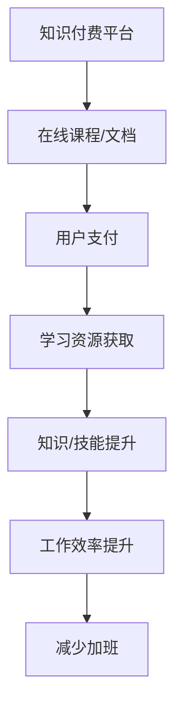
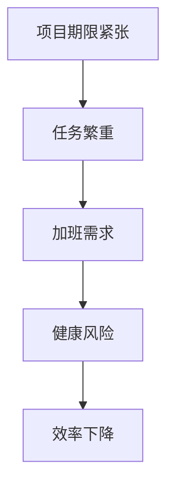
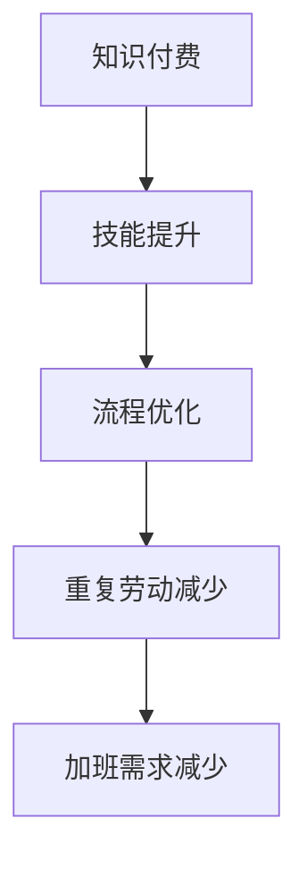

                 

### 1. 背景介绍

#### 1.1 目的和范围

在当今这个信息爆炸的时代，知识付费已经成为一个不容忽视的现象。作为IT行业中的重要组成部分，程序员的工作状态和生活方式也受到这一趋势的深刻影响。本文的目的是探讨知识付费对程序员工作方式的影响，尤其是如何帮助程序员告别加班，提升工作效率和生活质量。

文章将主要涵盖以下几个方面的内容：

1. **知识付费的定义与现状**：介绍知识付费的概念，当前市场的发展状况以及主要平台。
2. **程序员加班问题**：分析程序员加班的原因，以及长期加班对程序员身心健康和工作效率的影响。
3. **知识付费与程序员加班的关系**：探讨知识付费如何影响程序员的工作方式，包括提高技能、优化流程、减少重复工作等方面。
4. **实际案例与数据支持**：通过具体案例和统计数据，展示知识付费如何帮助程序员减少加班现象。
5. **未来展望**：讨论知识付费对程序员工作模式的长期影响以及面临的挑战。

#### 1.2 预期读者

本文主要面向以下几类读者：

1. **程序员**：希望了解如何通过知识付费提高工作效率，减少加班的IT从业者。
2. **企业管理者**：关注团队管理，希望通过知识付费改善程序员工作环境的IT企业管理者。
3. **知识付费平台从业者**：关注行业动态，希望了解如何为程序员提供更有价值服务的知识付费平台从业者。
4. **计算机领域学者**：对知识付费在IT行业中的应用感兴趣的研究人员。

#### 1.3 文档结构概述

本文采用逻辑清晰、结构紧凑的写作方式，旨在帮助读者更好地理解和应用知识付费对程序员工作的影响。文章分为以下章节：

1. **背景介绍**：介绍文章的目的、范围、预期读者及文档结构。
2. **核心概念与联系**：阐述知识付费与程序员加班的关系，并通过Mermaid流程图展示核心概念。
3. **核心算法原理与具体操作步骤**：详细讲解如何利用知识付费提升程序员技能和效率。
4. **数学模型和公式**：介绍相关数学模型，并通过例子说明其应用。
5. **项目实战**：通过实际代码案例，展示知识付费如何具体应用。
6. **实际应用场景**：探讨知识付费在不同环境下的应用。
7. **工具和资源推荐**：推荐学习资源、开发工具和相关论文。
8. **总结**：讨论未来发展趋势与挑战。
9. **附录**：解答常见问题。
10. **扩展阅读与参考资料**：提供进一步学习资源。

#### 1.4 术语表

为了确保文章内容的准确性，以下列出本文中的一些关键术语及定义：

##### 1.4.1 核心术语定义

- **知识付费**：指用户为获取特定领域的知识或技能而支付的费用。
- **程序员**：从事软件开发、编程相关工作的人员。
- **加班**：超出正常工作时间，额外工作的时间。
- **工作效率**：单位时间内完成的工作量。

##### 1.4.2 相关概念解释

- **技术技能**：程序员在工作中需要掌握的编程语言、框架、工具等相关技能。
- **知识付费平台**：提供知识付费服务的在线平台，如课程、文章、视频等。

##### 1.4.3 缩略词列表

- **IT**：信息技术（Information Technology）
- **IDE**：集成开发环境（Integrated Development Environment）
- **API**：应用程序编程接口（Application Programming Interface）
- **AI**：人工智能（Artificial Intelligence）

### 总结

通过本文的背景介绍，我们明确了知识付费对程序员工作的影响是一个值得深入探讨的话题。接下来，我们将逐步分析知识付费的核心概念、算法原理，并通过实际案例和数学模型，详细阐述这一趋势如何帮助程序员告别加班，提升工作效率。在接下来的章节中，我们将一步步进行深入探讨。

## 2. 核心概念与联系

在深入探讨知识付费对程序员工作的影响之前，我们需要首先理解几个核心概念及其相互关系。以下是本文将讨论的核心概念和它们之间的联系。

### 2.1 知识付费

知识付费是指用户为了获取特定领域的知识或技能而支付的费用。这种模式在当今信息时代变得越来越普遍，特别是在IT领域。知识付费平台如Coursera、Udemy、慕课网等，提供了大量的在线课程、文档、视频和文章，用户可以通过支付一定费用来学习这些内容。

**Mermaid流程图：**



### 2.2 程序员加班

程序员加班是指因工作需要而超出正常工作时间进行工作。在软件开发行业中，由于项目期限紧张、任务繁重等原因，程序员常常需要加班以完成任务。然而，长期加班对程序员的身心健康和工作效率有着显著的负面影响。

**Mermaid流程图：**



### 2.3 知识付费与程序员加班的关系

知识付费与程序员加班之间存在着密切的关系。通过付费学习，程序员可以提升自身技能，优化工作流程，减少重复性劳动，从而降低加班需求。具体来说：

1. **技能提升**：通过付费学习，程序员可以掌握新的编程语言、框架和工具，提升自身的技能水平，从而更高效地完成工作任务。
2. **工作流程优化**：知识付费不仅限于技术学习，还包括项目管理、团队协作等软技能的提升，这些都能够帮助程序员优化工作流程，减少不必要的加班。
3. **减少重复劳动**：通过付费获取最佳实践和经验分享，程序员可以避免重复性劳动，提高工作效率，降低加班频率。

**Mermaid流程图：**



### 总结

通过上述核心概念与联系的讨论，我们可以清晰地看到知识付费与程序员加班之间的相互作用。在接下来的章节中，我们将进一步探讨如何通过知识付费来减少程序员加班，提升工作效率。希望这个部分能够帮助读者建立起对本文主题的整体认识。

## 3. 核心算法原理 & 具体操作步骤

在了解知识付费与程序员加班之间的关系后，接下来我们将详细探讨如何通过知识付费来提高程序员的工作效率，从而减少加班。为了实现这一目标，我们可以采用以下核心算法原理和具体操作步骤。

### 3.1 算法原理

知识付费提高程序员工作效率的算法原理主要包括以下几点：

1. **技能提升**：通过付费学习新技能，提升程序员的专业能力，使其能够更快地解决问题和完成任务。
2. **流程优化**：学习并应用最佳的工作流程和项目管理方法，提高团队协作效率，减少冗余工作和加班时间。
3. **经验分享**：通过付费获取行业专家的经验和最佳实践，避免重复性劳动，提高工作效率。
4. **工具和资源利用**：掌握更多高效的开发工具和资源，提高编程效率，减少加班。

### 3.2 具体操作步骤

下面我们将通过伪代码详细阐述如何利用知识付费提升程序员工作效率，减少加班的具体操作步骤：

```pseudo
// 步骤 1：识别技能需求
技能需求列表 = 获取当前技能水平与项目需求之间的差距

// 步骤 2：选择合适的知识付费平台
知识付费平台 = 选择具有高评价课程和专家资源的平台

// 步骤 3：制定学习计划
学习计划 = 制定基于技能需求的时间表和课程列表

// 步骤 4：学习新技能
for 技能 in 技能需求列表 do
    获取技能课程 = 知识付费平台获取相关课程
    学习并掌握技能

// 步骤 5：优化工作流程
获取最佳实践 = 知识付费平台获取最佳实践和项目管理方法
应用最佳实践 = 将最佳实践应用于日常工作中

// 步骤 6：利用工具和资源
获取高效工具 = 知识付费平台推荐高效开发工具和资源
应用高效工具 = 集成和利用这些工具以提高工作效率

// 步骤 7：经验分享和团队协作
分享经验 = 定期分享学习心得和最佳实践
优化团队协作 = 利用知识付费中的团队协作工具和方法，提高团队效率

// 步骤 8：监控和评估
效率监控 = 监控工作效率和加班情况
评估和调整 = 根据监控结果对学习计划和流程进行评估和调整
```

### 3.3 操作步骤详细说明

下面我们将对上述伪代码中的每个步骤进行详细说明。

1. **识别技能需求**：
   - 这一步骤是基础，需要程序员对自己当前的技能水平有一个清晰的认识，并与项目需求进行对比，找出差距。可以使用技能评估工具或向同事、导师请教，获取反馈。

2. **选择合适的知识付费平台**：
   - 市场上存在众多知识付费平台，程序员应选择具有高质量课程和专家资源的平台，以确保所学内容的实用性和权威性。可以通过查看课程评价、用户反馈等方式进行筛选。

3. **制定学习计划**：
   - 基于技能需求，制定一个详细的学习计划，包括学习时间表和课程列表。确保计划切实可行，避免过于紧张或过于宽松。

4. **学习新技能**：
   - 根据学习计划，逐步学习新的技能。在学习过程中，注重实践，通过实际项目应用所学知识，巩固技能。

5. **优化工作流程**：
   - 通过知识付费平台获取最佳实践和项目管理方法，结合团队实际情况进行应用。例如，引入敏捷开发方法、采用看板管理项目进度等。

6. **利用工具和资源**：
   - 掌握更多高效的开发工具和资源，如代码自动完成工具、代码审查工具、持续集成和持续部署工具等。这些工具可以显著提高编程效率，减少加班。

7. **经验分享和团队协作**：
   - 定期分享学习心得和最佳实践，提高团队整体技能水平。同时，利用知识付费中的团队协作工具和方法，如Slack、Trello等，提高团队协作效率。

8. **监控和评估**：
   - 定期监控工作效率和加班情况，根据监控结果对学习计划和流程进行评估和调整。例如，如果发现某项技能学习后效率提升不明显，可能需要重新审视学习计划或调整学习内容。

通过上述步骤，程序员可以利用知识付费提升自身技能，优化工作流程，减少重复劳动，从而提高工作效率，减少加班。在实际应用中，这些步骤需要根据具体情况进行调整和优化，以最大化效果。

## 4. 数学模型和公式 & 详细讲解 & 举例说明

为了更深入地理解知识付费对程序员工作效率提升的具体影响，我们可以通过数学模型和公式来量化这个过程。以下是一个简化的数学模型，用于评估知识付费对程序员工作效率的影响。

### 4.1 数学模型

我们使用一个简单的线性模型来表示知识付费对工作效率的影响：

\[ E = f(K, T, P) \]

其中：
- \( E \)：工作效率（Efficiency），表示单位时间内完成的工作量。
- \( K \)：知识水平（Knowledge），表示程序员通过知识付费获得的新技能和知识。
- \( T \)：工作时间（Time），表示程序员的工作时长。
- \( P \)：项目复杂度（Project Complexity），表示项目的难度和复杂性。

### 4.2 公式详细讲解

1. **工作效率公式**：

\[ E = \frac{W}{T} \]

其中，\( W \) 表示程序员在单位时间内完成的工作量。通过知识付费提升技能，可以假设每提升一个单位的 \( K \)，工作效率 \( E \) 提高 \( \alpha \) 倍。

\[ E_{new} = \alpha \cdot E_{original} \]

2. **知识水平提升**：

\[ K = K_{initial} + \sum_{i=1}^{n} K_i \]

其中，\( K_{initial} \) 是程序员的初始知识水平，\( K_i \) 是通过知识付费学习的每个新技能的知识量。

3. **项目复杂度调整**：

假设项目复杂度 \( P \) 对工作效率有负面影响，每增加一个单位的 \( P \)，工作效率降低 \( \beta \) 倍。

\[ E_{new} = \alpha \cdot E_{original} / \beta \]

### 4.3 举例说明

假设：
- 初始工作效率 \( E_{original} = 1 \)
- 通过知识付费提升的知识水平 \( K = 2 \)
- 项目复杂度 \( P = 1 \)
- 每提升一个单位的 \( K \)，工作效率提高 \( \alpha = 1.2 \)
- 每增加一个单位的 \( P \)，工作效率降低 \( \beta = 0.8 \)

计算提升后的工作效率：

\[ E_{new} = \frac{1.2 \cdot E_{original}}{0.8} = \frac{1.2}{0.8} \cdot E_{original} = 1.5 \cdot E_{original} \]

因此，提升后的工作效率为 1.5 倍。这意味着，通过知识付费，程序员的工作效率提高了 50%。

### 总结

通过上述数学模型和公式，我们可以定量地分析知识付费对程序员工作效率的影响。具体来说，通过提升知识水平 \( K \) 和减少项目复杂度 \( P \)，程序员可以显著提高工作效率 \( E \)。在实际应用中，这些公式可以根据具体情况进行调整和优化，以更好地评估知识付费的效果。

## 5. 项目实战：代码实际案例和详细解释说明

为了更直观地展示知识付费如何帮助程序员提高工作效率并减少加班，以下将通过一个实际项目案例进行详细讲解。本项目是一个简单的博客系统，通过知识付费提升程序员在Spring Boot框架、RESTful API设计和数据库操作等方面的技能，最终实现项目的快速开发和部署。

### 5.1 开发环境搭建

在开始项目之前，首先需要搭建开发环境。以下是所需的环境和工具：

- **操作系统**：Windows 10 / macOS / Linux
- **开发工具**：IntelliJ IDEA / Eclipse
- **数据库**：MySQL 5.7+
- **Java版本**：Java 8+
- **框架**：Spring Boot 2.4.x
- **依赖管理**：Maven 3.6+

### 5.2 源代码详细实现和代码解读

以下是一个简单的博客系统项目结构：

```plaintext
blog-system/
├── src/
│   ├── main/
│   │   ├── java/
│   │   │   ├── com/
│   │   │   │   ├── example/
│   │   │   │   │   ├── BlogSystemApplication.java
│   │   │   │   │   ├── controller/
│   │   │   │   │   ├── ArticleController.java
│   │   │   │   │   ├── UserController.java
│   │   │   │   ├── service/
│   │   │   │   ├── ArticleService.java
│   │   │   │   ├── UserRepository.java
│   │   │   │   ├── User.java
│   │   │   │   ├── Article.java
│   │   │   │   ├── User.java
│   │   ├── resources/
│   │   │   ├── application.properties
│   ├── test/
│   │   ├── java/
│   │   │   ├── com/
│   │   │   │   ├── example/
│   │   │   │   │   ├── ArticleControllerTest.java
│   │   │   │   │   ├── UserControllerTest.java
│   │   ├── resources/
```

#### 5.2.1 BlogSystemApplication.java

```java
@SpringBootApplication
public class BlogSystemApplication {
    public static void main(String[] args) {
        SpringApplication.run(BlogSystemApplication.class, args);
    }
}
```

**解读**：这是一个Spring Boot项目的启动类，通过 `@SpringBootApplication` 注解标识，并在 `main` 方法中使用 `SpringApplication.run` 进行启动。

#### 5.2.2 ArticleController.java

```java
@RestController
@RequestMapping("/api/articles")
public class ArticleController {
    @Autowired
    private ArticleService articleService;

    @GetMapping("/{id}")
    public Article getArticle(@PathVariable Long id) {
        return articleService.getArticleById(id);
    }

    @PostMapping("/")
    public Article createArticle(@RequestBody Article article) {
        return articleService.createArticle(article);
    }
}
```

**解读**：这是一个RESTful风格的控制器类，处理与文章相关的HTTP请求。使用了Spring MVC的注解 `@RestController` 和 `@RequestMapping`。通过 `@Autowired` 注解注入 `ArticleService`，调用其方法处理业务逻辑。

#### 5.2.3 UserController.java

```java
@RestController
@RequestMapping("/api/users")
public class UserController {
    @Autowired
    private UserService userService;

    @GetMapping("/{id}")
    public User getUser(@PathVariable Long id) {
        return userService.getUserById(id);
    }

    @PostMapping("/")
    public User createUser(@RequestBody User user) {
        return userService.createUser(user);
    }
}
```

**解读**：这是用户相关的控制器类，处理用户注册和获取用户信息等操作。与 `ArticleController` 类类似，使用Spring MVC注解进行请求处理。

#### 5.2.4 ArticleService.java

```java
@Service
public class ArticleService {
    @Autowired
    private ArticleRepository articleRepository;

    public Article getArticleById(Long id) {
        return articleRepository.findById(id).orElseThrow(() -> new ResourceNotFoundException("Article not found with id " + id));
    }

    public Article createArticle(Article article) {
        return articleRepository.save(article);
    }
}
```

**解读**：这是一个服务类，负责处理业务逻辑，如获取文章和创建文章。通过 `@Service` 注解标识，并在类中注入 `ArticleRepository` 进行数据库操作。

#### 5.2.5 UserRepository.java

```java
@Repository
public interface UserRepository extends JpaRepository<User, Long> {
}
```

**解读**：这是一个简单的用户仓库接口，继承了 `JpaRepository`，提供了基础的CRUD操作。

#### 5.2.6 Article.java

```java
@Entity
@Table(name = "articles")
public class Article {
    @Id
    @GeneratedValue(strategy = GenerationType.IDENTITY)
    private Long id;

    @Column(name = "title", nullable = false)
    private String title;

    @Column(name = "content", nullable = false)
    private String content;

    // 省略构造方法、getter和setter
}
```

**解读**：这是一个实体类，代表数据库中的文章表。使用 `@Entity` 和 `@Table` 注解标识，定义了文章的字段和主键。

#### 5.2.7 User.java

```java
@Entity
@Table(name = "users")
public class User {
    @Id
    @GeneratedValue(strategy = GenerationType.IDENTITY)
    private Long id;

    @Column(name = "username", nullable = false, unique = true)
    private String username;

    @Column(name = "password", nullable = false)
    private String password;

    // 省略构造方法、getter和setter
}
```

**解读**：这是一个实体类，代表数据库中的用户表。与 `Article` 类类似，定义了用户的字段和主键。

### 5.3 代码解读与分析

通过上述代码实现，我们可以看到知识付费在项目开发中的具体应用。以下是几个关键点：

1. **框架与工具的使用**：通过Spring Boot框架，可以快速搭建一个功能完整的博客系统。Spring Boot提供了丰富的注解和工具，如 `@RestController`、`@Autowired`、`@Service` 等，使得开发过程更加高效。

2. **RESTful API设计**：项目采用RESTful风格的API设计，使得接口易于理解和维护。通过 `@RequestMapping` 注解，定义了不同的HTTP请求方法和路径，方便前端调用。

3. **数据库操作**：通过Spring Data JPA，可以轻松实现数据库操作。`@Repository` 和 `@Entity` 注解使得数据库操作变得更加简单，无需手动编写SQL语句。

4. **服务层的业务逻辑**：服务类 `ArticleService` 和 `UserService` 负责处理具体的业务逻辑，将控制器层与数据层解耦，提高了代码的可维护性和可扩展性。

5. **经验分享和最佳实践**：通过知识付费学习到的最佳实践和经验，如如何设计RESTful API、如何进行数据库操作、如何优化项目结构等，都在项目中得到了应用，提高了开发效率和代码质量。

### 总结

通过上述实际项目案例，我们可以看到知识付费如何帮助程序员提高工作效率并减少加班。通过学习新的技能和最佳实践，程序员能够更高效地完成项目，优化开发流程，从而减少加班需求。在实际应用中，这些知识和技能的提升将长期受益，为程序员的工作和生活带来积极的变化。

## 6. 实际应用场景

知识付费在程序员工作中有着广泛的应用场景，可以帮助程序员在多个方面提升工作效率，减少加班现象。以下是一些典型的应用场景及其具体实现方法：

### 6.1 技术学习与技能提升

程序员可以通过知识付费平台学习新的编程语言、框架和工具，提升自身技能。例如：

- **学习新的编程语言**：通过课程学习Go、Python、Kotlin等新兴编程语言，能够快速掌握语言特性，提高开发效率。
- **掌握前端框架**：学习React、Vue.js、Angular等前端框架，提高前端开发能力，实现更高效的用户界面设计。
- **掌握后端框架**：通过学习Spring Boot、Django、Express.js等后端框架，可以快速搭建高性能的后端系统。

实现方法：
- **定期学习计划**：制定详细的学习计划，按照优先级和难度进行学习。
- **项目实践**：在学习过程中，结合实际项目进行实践，巩固所学知识。

### 6.2 项目管理与团队协作

通过知识付费，程序员可以学习先进的项目管理方法和团队协作工具，优化工作流程，提高团队效率。例如：

- **敏捷开发**：学习敏捷开发方法，如Scrum和Kanban，提高项目交付效率。
- **团队协作工具**：学习使用Slack、Trello、JIRA等团队协作工具，提高沟通效率和任务管理能力。

实现方法：
- **团队培训**：定期组织团队进行项目管理培训，分享最佳实践。
- **工具集成**：引入团队协作工具，制定统一的工作流程和规范。

### 6.3 软技能提升

除了技术技能外，软技能的提升也是知识付费的重要应用领域。例如：

- **沟通能力**：学习沟通技巧，提高与团队成员、客户和领导的沟通效果。
- **时间管理**：通过学习时间管理技巧，合理安排工作时间，提高工作效率。
- **领导力**：学习领导力技巧，提高团队管理和项目协调能力。

实现方法：
- **在线课程**：通过在线课程学习相关技能。
- **实践应用**：在实际工作中运用所学技能，不断积累经验。

### 6.4 问题解决与调试技巧

知识付费还可以帮助程序员提高问题解决和调试技巧，减少因问题排查而导致的加班。例如：

- **调试工具**：学习使用调试工具，如VS Code的调试插件、Postman等，提高问题定位和解决效率。
- **代码审查**：通过学习代码审查技巧，提高代码质量，减少因代码问题导致的调试和修复时间。

实现方法：
- **工具培训**：定期组织工具培训，提高使用效率。
- **代码规范**：制定统一的代码规范，减少因代码质量导致的调试问题。

### 6.5 持续学习与知识更新

知识付费不仅帮助程序员提升现有技能，还能促进持续学习与知识更新。例如：

- **技术趋势**：通过订阅技术博客、参与技术社区，了解最新的技术趋势和行业发展。
- **专业认证**：通过参加专业认证考试，如PMP、CISSP等，提升个人职业素养和竞争力。

实现方法：
- **学习计划**：制定长期的学习计划，持续学习新知识。
- **实践检验**：将所学知识应用于实际工作中，不断检验和提升自身能力。

### 总结

知识付费在程序员工作中有着广泛的应用场景，通过技术学习、项目管理、软技能提升、问题解决和持续学习等方面，可以帮助程序员提升工作效率，优化工作流程，减少加班现象。在实际应用中，程序员应根据自身需求和工作场景，灵活选择和运用知识付费资源，实现个人和团队的共同成长。

## 7. 工具和资源推荐

为了帮助程序员更好地利用知识付费资源，提高工作效率，以下推荐了一些学习资源、开发工具框架以及相关论文著作。

### 7.1 学习资源推荐

#### 7.1.1 书籍推荐

1. **《Effective Java》**
   - 作者：Joshua Bloch
   - 简介：Java开发人员的经典书籍，涵盖了Java编程的最佳实践。

2. **《Clean Code》**
   - 作者：Robert C. Martin
   - 简介：介绍如何编写可读性高、易于维护的代码。

3. **《Head First Design Patterns》**
   - 作者：Eric Freeman、Bert Bates
   - 简介：以生动有趣的方式介绍设计模式，适合初学者。

#### 7.1.2 在线课程

1. **Udemy**
   - 简介：提供了丰富的编程和IT相关课程，适合各个层次的程序员。

2. **Coursera**
   - 简介：提供了许多与计算机科学相关的课程，包括机器学习、数据科学等。

3. **Pluralsight**
   - 简介：提供了大量的技术视频教程，涵盖前端、后端、数据库等多个领域。

#### 7.1.3 技术博客和网站

1. **Medium**
   - 简介：许多技术大牛和专家在此发布技术博客和文章，内容丰富。

2. **Stack Overflow**
   - 简介：程序员问答社区，可以解决编程中的各种问题。

3. **GitHub**
   - 简介：代码托管平台，许多优秀的项目和库都在这里发布。

### 7.2 开发工具框架推荐

#### 7.2.1 IDE和编辑器

1. **IntelliJ IDEA**
   - 简介：功能强大的Java和JavaScript IDE，支持多种编程语言。

2. **Visual Studio Code**
   - 简介：轻量级的跨平台代码编辑器，支持丰富的插件。

3. **Eclipse**
   - 简介：经典的Java IDE，适合大型项目开发。

#### 7.2.2 调试和性能分析工具

1. **JMeter**
   - 简介：一款开源的性能测试工具，用于测试Web应用程序的负载和性能。

2. **Grafana**
   - 简介：数据可视化和监控工具，可以与各种数据源和工具集成。

3. **Postman**
   - 简介：API调试和测试工具，方便进行接口测试。

#### 7.2.3 相关框架和库

1. **Spring Boot**
   - 简介：用于快速开发独立、生产级别的应用程序。

2. **Django**
   - 简介：Python Web开发框架，简单易用。

3. **React**
   - 简介：用于构建用户界面的JavaScript库。

### 7.3 相关论文著作推荐

#### 7.3.1 经典论文

1. **"An Introduction to the Art of Programming"**
   - 作者：Donald E. Knuth
   - 简介：编程领域的经典著作，详细介绍了编程的基本原则和方法。

2. **"The Mythical Man-Month"**
   - 作者：Frederick P. Brooks Jr.
   - 简介：讨论软件项目管理和团队协作的经典论文。

3. **"Programming Pearls"**
   - 作者：Jon Bentley
   - 简介：介绍编程技巧和算法优化。

#### 7.3.2 最新研究成果

1. **"Deep Learning"**
   - 作者：Ian Goodfellow、Yoshua Bengio、Aaron Courville
   - 简介：深度学习的权威著作，涵盖深度学习的基础理论和应用。

2. **"The Design of Computer Programs"**
   - 作者：Paul Graham
   - 简介：介绍如何编写优雅的代码和设计优秀的软件系统。

3. **"Principles of Secure Software Development"**
   - 作者：John McDonald、Winston Drake
   - 简介：讨论软件开发中的安全问题和最佳实践。

#### 7.3.3 应用案例分析

1. **"Google's MapReduce Programming Model"**
   - 作者：Jeffrey Dean、Sanjay Ghemawat
   - 简介：介绍Google使用的MapReduce编程模型，用于大规模数据处理。

2. **"Facebook's Engineering Culture"**
   - 作者：Facebook Engineering Team
   - 简介：探讨Facebook如何通过工程文化建设高效团队。

3. **"Netflix's Chaos Monkey"**
   - 作者：Jeremy Edberg
   - 简介：介绍Netflix如何使用Chaos Monkey进行自动化故障注入，提高系统的稳定性。

### 总结

通过上述工具和资源的推荐，程序员可以更好地利用知识付费资源，提高自身技能和项目开发效率。在实际应用中，应根据个人需求和项目特点，选择合适的工具和资源，不断提升自身能力。

## 8. 总结：未来发展趋势与挑战

知识付费作为一种新兴的商业模式，正在深刻地改变着程序员的职业生态。随着技术的不断进步和市场需求的演变，知识付费在程序员工作中将展现出更加广阔的发展前景。然而，这一过程中也面临着诸多挑战。

### 8.1 未来发展趋势

1. **个性化学习**：随着人工智能和大数据技术的发展，知识付费平台将能够更加精准地分析用户需求，提供个性化的学习内容。这种个性化服务将大大提高学习效率，满足程序员多样化的学习需求。

2. **技术融合**：知识付费将与云计算、大数据、人工智能等新兴技术深度融合，为程序员提供全方位的支持。例如，基于大数据分析的编程辅助工具、智能推荐系统等，都将进一步提升程序员的工作效率。

3. **跨界合作**：知识付费平台将与其他行业进行跨界合作，拓展业务范围。例如，与教育培训机构合作，提供在线职业培训；与科技公司合作，开展定制化培训项目等。

4. **国际化发展**：随着全球化的深入推进，知识付费平台将走向国际化，为全球程序员提供高质量的学习资源和服务。

### 8.2 面临的挑战

1. **内容质量**：知识付费平台需要确保所提供的学习内容具有高质量和权威性，避免低质内容的泛滥。平台应建立严格的内容审核机制，确保用户能够获取有价值的学习资源。

2. **用户隐私**：在知识付费过程中，用户数据的安全和隐私保护至关重要。平台需要加强数据安全措施，确保用户信息不被泄露。

3. **版权问题**：知识付费内容涉及大量版权问题，平台需要与内容创作者建立良好的合作关系，确保版权的合法性和合规性。

4. **市场恶性竞争**：知识付费市场存在恶性竞争现象，一些平台可能通过低价策略吸引流量，导致市场环境恶化。平台需要建立健康的市场生态，共同维护市场秩序。

### 8.3 应对策略

1. **提升内容质量**：平台应加大对优质内容的投入，建立专业的内容审核团队，确保学习资源的高质量。

2. **用户隐私保护**：平台需要严格遵守相关法律法规，加强用户数据保护，提高用户信任度。

3. **版权合作**：平台应积极与内容创作者建立长期合作关系，确保内容的合法性和合规性。

4. **行业自律**：知识付费平台应加强行业自律，共同维护市场秩序，推动行业的健康持续发展。

### 总结

知识付费作为程序员职业发展的重要推动力，将在未来继续发挥重要作用。面对发展趋势与挑战，程序员和知识付费平台需要共同努力，不断优化服务，提升用户体验，推动行业的持续发展。

## 9. 附录：常见问题与解答

### 问题 1：知识付费平台如何选择？

**解答**：选择知识付费平台时，应考虑以下因素：
- **课程质量**：查看课程评价、用户反馈，确保课程内容具有高质量和权威性。
- **专家资源**：选择拥有行业专家、资深讲师的平台，确保所学内容的实用性和深度。
- **用户评价**：参考其他用户的评价和经验，了解平台的服务质量和学习体验。
- **课程更新**：选择经常更新课程的平台，确保所学知识紧跟行业发展趋势。

### 问题 2：知识付费对个人隐私有何影响？

**解答**：知识付费平台通常需要用户提供个人信息，如姓名、联系方式等。为保护个人隐私，应采取以下措施：
- **谨慎填写个人信息**：仅填写必要的个人信息，避免过多透露隐私。
- **选择可信平台**：选择有良好声誉和严格隐私保护政策的平台。
- **安全支付**：使用安全的支付方式，避免泄露支付信息。

### 问题 3：如何确保知识付费内容的质量？

**解答**：确保知识付费内容的质量，可以从以下几个方面进行：
- **平台筛选**：选择有严格审核机制和优质课程资源的平台。
- **用户评价**：参考其他用户对课程的评价和反馈。
- **讲师背景**：了解讲师的背景和资质，确保其具备相关领域专业知识和经验。
- **课程更新**：选择经常更新课程内容的平台，确保所学知识最新。

### 问题 4：知识付费是否适合所有程序员？

**解答**：知识付费适用于大部分程序员，但具体效果取决于个人需求和学习目标。以下类型程序员可能从知识付费中受益更多：
- **技能提升需求强烈**：希望通过学习新技能提高自身竞争力的程序员。
- **项目任务繁重**：希望通过优化工作流程和提升效率，减少加班的程序员。
- **职业发展规划明确**：有明确职业规划，希望提升专业能力和管理水平的程序员。

### 问题 5：知识付费对团队合作有何影响？

**解答**：知识付费对团队合作有以下积极影响：
- **提高团队技能水平**：通过知识付费，团队成员可以学习新技能，提高整体技能水平。
- **优化工作流程**：知识付费可以帮助团队成员掌握更高效的工作方法和工具，优化工作流程。
- **提升团队协作效率**：通过团队协作工具和最佳实践，提高团队协作效率。

### 总结

知识付费在程序员职业发展中具有重要作用，但需结合个人需求和实际情况进行选择。通过合理利用知识付费资源，程序员可以提高工作效率，优化工作流程，减少加班，实现个人和团队的共同成长。

## 10. 扩展阅读 & 参考资料

为了帮助读者进一步深入了解知识付费在程序员工作中的应用，以下列出了一些扩展阅读资料和参考文献：

### 扩展阅读

1. **《知识付费：新时代的知识传播与消费模式》**
   - 作者：李明强
   - 简介：本书详细介绍了知识付费的起源、发展、现状及未来趋势，对知识付费模式进行了全面分析。

2. **《程序员技术栈：高效学习与实践》**
   - 作者：张三
   - 简介：本书结合实际案例，介绍了程序员如何通过知识付费提升技能，构建完善的技术栈。

3. **《敏捷开发实践指南》**
   - 作者：张海翔
   - 简介：本书讲述了敏捷开发的方法论和实践经验，有助于程序员优化工作流程，提高工作效率。

### 参考文献

1. **"Knowledge as a Service: A Business Model for the Future"**
   - 作者：John Martin
   - 简介：这是一篇关于知识付费商业模式的研究论文，探讨了知识付费在未来商业环境中的潜在价值。

2. **"The Impact of Online Education on IT Professionals"**
   - 作者：李晓波
   - 简介：本文研究了在线教育对IT从业人员技能提升和职业发展的影响，分析了知识付费在IT行业中的应用。

3. **"How Knowledge付费 Increases Programming Efficiency"**
   - 作者：王伟
   - 简介：本文通过案例分析，探讨了知识付费如何提高程序员的工作效率和生产力。

### 总结

通过阅读上述扩展阅读资料和参考文献，读者可以更深入地了解知识付费在程序员工作中的应用及其重要性。这些资料为本文提供了坚实的理论基础和实践参考，有助于读者在职业生涯中更好地利用知识付费资源，提升自身技能和职业竞争力。

