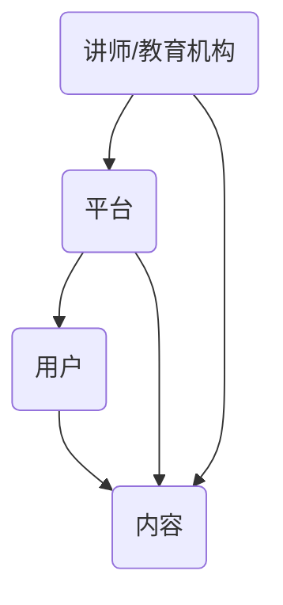
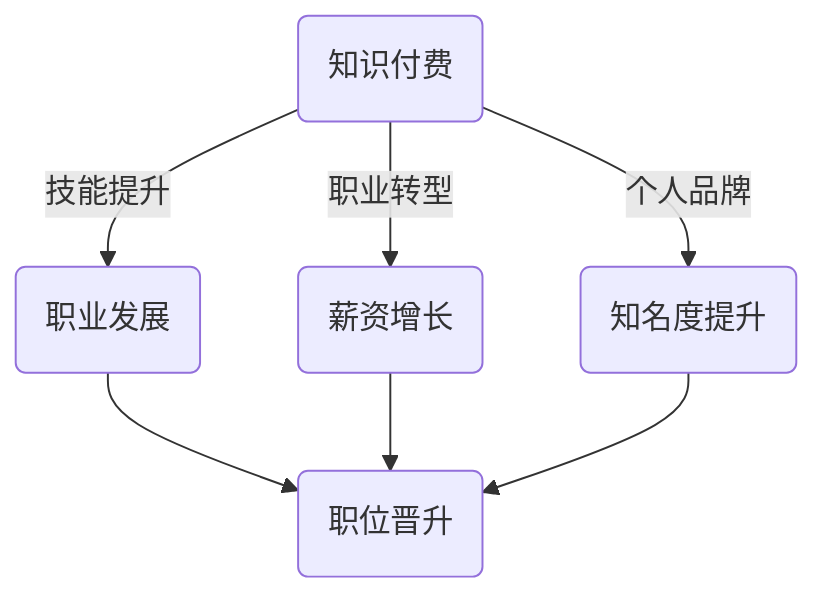
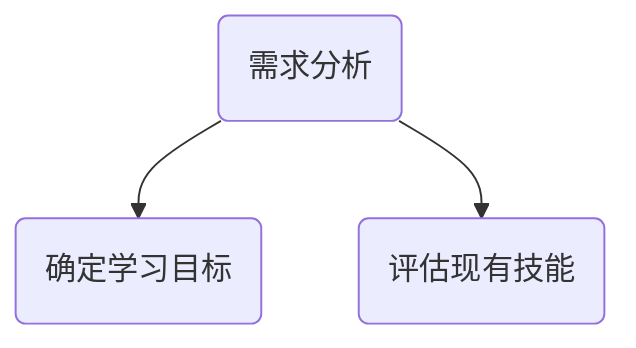
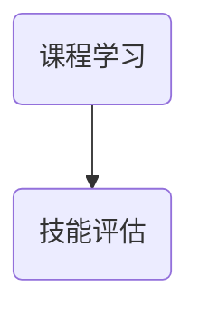
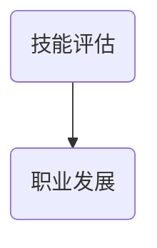

                 

# 知识付费让程序员实现人生理想的方法与途径

## 关键词
- 知识付费
- 程序员职业发展
- 付费课程
- 技术技能提升
- 薪资增长
- 职业转型
- 个人品牌建设

## 摘要
本文旨在探讨知识付费在程序员职业发展中的重要作用，通过分析付费课程的类型、内容和效果，揭示程序员如何通过知识付费实现人生理想，如薪资增长、职业转型和个人品牌的建立。文章将提供详细的操作步骤和实用建议，帮助程序员在知识付费领域找到适合自己的路径，迈向职业巅峰。

## 1. 背景介绍

### 1.1 目的和范围
本文旨在为程序员提供一套系统化的知识付费策略，帮助他们通过学习付费课程实现职业发展和人生理想的实现。我们将探讨知识付费在程序员职业生涯中的关键作用，并提供具体的案例和建议，帮助读者在知识付费领域找到适合自己的道路。

### 1.2 预期读者
本文适用于希望提升技术能力、寻求职业发展的程序员，尤其是那些希望通过知识付费实现薪资增长、职业转型和个人品牌建设的专业人士。

### 1.3 文档结构概述
本文将分为以下章节：
- 第1章：背景介绍，包括目的、范围和预期读者。
- 第2章：核心概念与联系，介绍知识付费的相关概念和架构。
- 第3章：核心算法原理与具体操作步骤，详细阐述付费课程的学习方法。
- 第4章：数学模型和公式，解释付费课程对程序员技能提升的影响。
- 第5章：项目实战，通过实际案例展示知识付费的应用。
- 第6章：实际应用场景，分析知识付费在不同职业阶段的作用。
- 第7章：工具和资源推荐，提供学习资源、开发工具和论文推荐。
- 第8章：总结，探讨知识付费的未来发展趋势与挑战。
- 第9章：附录，解答常见问题。
- 第10章：扩展阅读，提供进一步的参考资料。

### 1.4 术语表
#### 1.4.1 核心术语定义
- **知识付费**：指用户通过支付费用获取有价值知识的模式。
- **付费课程**：指由专业讲师或教育机构提供的，以提升学习者技能为目的的在线或线下课程。
- **程序员**：指从事软件开发、网站开发、数据科学等相关工作的专业人士。

#### 1.4.2 相关概念解释
- **职业发展**：指个人在职业生涯中的成长和进步，包括技能提升、职位晋升和薪资增长。
- **个人品牌**：指个人在行业内的知名度、声誉和影响力。

#### 1.4.3 缩略词列表
- **KFC**：知识付费
- **PCC**：付费课程
- **DEV**：程序员

## 2. 核心概念与联系

### 2.1 知识付费的核心概念
知识付费是现代教育模式的一种创新，它通过市场化手段，将知识转化为商品，供用户购买和消费。知识付费的核心概念包括：
- **付费**：用户为获取知识支付费用。
- **知识**：指具有价值的信息、技能或经验。
- **付费课程**：以提升技能或知识为目的的教育产品。

### 2.2 知识付费的架构
知识付费的架构可以分为四个主要部分：
- **讲师/教育机构**：提供知识和服务。
- **平台**：搭建课程发布和交易的平台。
- **用户**：购买并学习知识。
- **内容**：包含课程视频、文档、直播等。

下面是知识付费架构的Mermaid流程图：



### 2.3 知识付费与程序员职业发展的联系
知识付费在程序员职业发展中扮演着关键角色，具体体现在以下几个方面：

- **技能提升**：付费课程提供最新、最实用的技术知识和技能，帮助程序员不断更新自己的技术栈。
- **职业转型**：通过学习新的技术领域或技能，程序员可以实现职业转型，拓宽职业发展空间。
- **薪资增长**：掌握高级技术和专业知识，有助于程序员在职业晋升中获得更高的薪资。
- **个人品牌**：通过高质量的知识分享和付费课程，程序员可以建立个人品牌，提升在行业内的知名度。

下面是知识付费与程序员职业发展的联系图：



## 3. 核心算法原理 & 具体操作步骤

### 3.1 核心算法原理
知识付费在程序员职业发展中的核心算法原理可以概括为“投入-产出比”。具体来说，程序员通过支付一定的费用，获得专业知识和技术技能，从而提高自己的市场价值。这个过程的本质是投资与回报的平衡，即投入的时间和金钱是否能够带来相应的产出。

### 3.2 具体操作步骤
以下是程序员通过知识付费实现职业发展的具体操作步骤：

#### 步骤1：需求分析
首先，程序员需要分析自己的职业目标和现有技能水平，确定需要学习的新技能或领域。



#### 步骤2：课程选择
根据需求分析，程序员可以选择相应的付费课程。以下是一个简单的伪代码示例，用于选择课程：

```python
def select_course(skill, experience):
    if skill == "前端开发" and experience > 1:
        return "高级前端开发课程"
    elif skill == "数据分析" and experience > 2:
        return "数据科学实战课程"
    else:
        return "基础编程课程"
```

#### 步骤3：课程学习
选择合适的课程后，程序员需要按照课程安排进行学习。以下是一个简单的伪代码示例，用于跟踪学习进度：

```python
def study_course(course, duration):
    if duration >= course.duration:
        return "完成课程"
    else:
        return "继续学习"
```

#### 步骤4：技能评估
课程学习完成后，程序员需要对自己的技能进行评估，以确定是否达到预期目标。



#### 步骤5：职业发展
根据技能评估结果，程序员可以调整自己的职业规划，包括职位晋升、薪资谈判和职业转型。



## 4. 数学模型和公式 & 详细讲解 & 举例说明

### 4.1 数学模型
在知识付费中，我们可以使用一个简单的数学模型来描述程序员的学习效果和回报。这个模型包括两个主要参数：学习投入（C）和学习产出（R）。

- **学习投入（C）**：包括时间和金钱的投入，即程序员为了学习新技能或知识所花费的成本。
- **学习产出（R）**：包括薪资增长、职位晋升和个人品牌建设等方面的回报。

数学模型可以表示为：

\[ R = f(C) \]

其中，\( f \) 是一个函数，表示学习投入对学习产出的影响。

### 4.2 公式详细讲解
为了更具体地描述学习投入和学习产出的关系，我们可以引入以下公式：

\[ R = k \cdot C \]

其中，\( k \) 是一个常数，表示单位投入所获得的回报。

#### 公式参数说明：
- \( R \)：学习产出（薪资增长、职位晋升等）。
- \( C \)：学习投入（时间和金钱）。
- \( k \)：回报系数，表示单位投入所获得的回报。

#### 公式解释
这个公式表明，学习产出与学习投入成正比。也就是说，投入越多，回报越大。但是，回报系数 \( k \) 的值取决于多种因素，如学习效率、行业需求等。

### 4.3 举例说明
假设一个程序员决定花费100小时和5000元学习一门新的前端开发技能。根据上述公式，我们可以计算出他的预期学习产出。

#### 步骤1：确定回报系数
根据行业数据和程序员的经验，我们可以估算回报系数 \( k \) 为0.1，即每投入1小时或1元，可以预期获得0.1的回报。

\[ k = 0.1 \]

#### 步骤2：计算学习产出
根据公式 \( R = k \cdot C \)，我们可以计算出学习产出：

\[ R = 0.1 \cdot (100 \text{小时} + 5000 \text{元}) \]
\[ R = 0.1 \cdot 5500 \]
\[ R = 550 \]

#### 结果说明
根据计算结果，这个程序员通过学习新技能，可以预期获得550的回报，包括薪资增长、职位晋升和个人品牌建设等方面。

## 5. 项目实战：代码实际案例和详细解释说明

### 5.1 开发环境搭建
为了演示知识付费在程序员职业发展中的应用，我们将创建一个简单的项目：一个基于Vue.js的在线学习平台。

#### 步骤1：安装Node.js和Vue CLI
首先，确保安装了Node.js（版本10及以上）。然后，使用以下命令安装Vue CLI：

```bash
npm install -g @vue/cli
```

#### 步骤2：创建Vue项目
使用Vue CLI创建一个新的Vue项目：

```bash
vue create knowledge-fee-platform
```

选择默认设置，创建一个带有Vue Router和Vuex的项目。

#### 步骤3：安装依赖
在项目根目录下，安装Vue Router和Vuex的依赖：

```bash
npm install vue-router vuex
```

### 5.2 源代码详细实现和代码解读

#### 步骤1：项目结构

知识付费平台的源代码结构如下：

```plaintext
knowledge-fee-platform/
|-- src/
|   |-- assets/
|   |-- components/
|   |   |-- CourseCard.vue
|   |   |-- CourseList.vue
|   |-- router/
|   |   |-- index.js
|   |-- store/
|   |   |-- index.js
|   |-- App.vue
|   |-- main.js
```

#### 步骤2：安装Vue Router和Vuex
在项目根目录下，创建router文件夹和store文件夹，分别放置路由和Vuex的状态管理代码。

**router/index.js**：

```javascript
import Vue from 'vue';
import VueRouter from 'vue-router';
import CourseList from '@/components/CourseList.vue';

Vue.use(VueRouter);

const routes = [
  {
    path: '/',
    name: 'CourseList',
    component: CourseList
  }
];

const router = new VueRouter({
  routes
});

export default router;
```

**store/index.js**：

```javascript
import Vue from 'vue';
import Vuex from 'vuex';

Vue.use(Vuex);

export default new Vuex.Store({
  state: {
    courses: []
  },
  mutations: {
    SET_COURSES(state, courses) {
      state.courses = courses;
    }
  },
  actions: {
    fetchCourses({ commit }) {
      // 在这里，我们可以使用API调用获取课程数据
      commit('SET_COURSES', [
        { id: 1, title: 'Vue.js 实战', price: 299 },
        { id: 2, title: 'React.js 入门', price: 199 },
        // 更多课程...
      ]);
    }
  }
});
```

#### 步骤3：实现CourseList组件

**components/CourseList.vue**：

```vue
<template>
  <div>
    <h1>付费课程列表</h1>
    <CourseCard
      v-for="course in courses"
      :key="course.id"
      :course="course"
    />
  </div>
</template>

<script>
import CourseCard from './CourseCard.vue';

export default {
  components: {
    CourseCard
  },
  computed: {
    courses() {
      return this.$store.state.courses;
    }
  }
};
</script>
```

#### 步骤4：实现CourseCard组件

**components/CourseCard.vue**：

```vue
<template>
  <div>
    <h2>{{ course.title }}</h2>
    <p>价格：{{ course.price }}元</p>
    <button @click="purchaseCourse(course)">购买课程</button>
  </div>
</template>

<script>
export default {
  props: {
    course: {
      type: Object,
      required: true
    }
  },
  methods: {
    purchaseCourse(course) {
      // 在这里，我们可以实现购买逻辑，如调用API
      alert(`购买课程：${course.title}`);
    }
  }
};
</script>
```

### 5.3 代码解读与分析

#### 5.3.1 路由配置
在`router/index.js`中，我们定义了一个简单的路由，将根路径映射到`CourseList`组件。这意味着当用户访问应用时，首先会看到课程列表。

#### 5.3.2 状态管理
在`store/index.js`中，我们使用了Vuex来管理应用的状态。具体来说，我们定义了一个`courses`状态，用于存储所有课程数据。同时，我们提供了`fetchCourses`动作，用于初始化课程数据。

#### 5.3.3 课程列表组件
在`components/CourseList.vue`中，我们使用计算属性`courses`来获取所有课程数据，并使用`v-for`指令将它们渲染为一个列表。每个课程通过`CourseCard`组件呈现。

#### 5.3.4 课程卡片组件
在`components/CourseCard.vue`中，我们定义了一个简单的课程卡片，显示课程标题和价格。用户点击“购买课程”按钮时，会触发`purchaseCourse`方法，实现购买逻辑。

这个项目实战展示了知识付费平台的基本架构和实现。通过这个项目，程序员可以学习到如何使用Vue.js构建一个动态、响应式的Web应用程序，从而提升自己的前端开发技能。

## 6. 实际应用场景

知识付费在程序员职业发展的实际应用场景中具有广泛的影响，以下是一些典型场景：

### 6.1 技术栈扩展
程序员可以通过付费课程学习新的编程语言、框架或工具，从而扩展自己的技术栈。例如，一个主要使用Java进行后端开发的程序员，可以通过学习Python、Go或Node.js等语言，提高自己的多语言开发能力。

### 6.2 职业转型
知识付费可以帮助程序员实现职业转型。例如，一个拥有多年前端开发经验的程序员，可以通过学习数据分析和人工智能相关的课程，转型成为数据科学家或机器学习工程师。

### 6.3 薪资增长
掌握高级技能的程序员可以通过知识付费获得更高的薪资。例如，一个通过学习云计算和大数据技术的程序员，可以获得更高的薪资和更广泛的职业机会。

### 6.4 个人品牌建设
通过高质量的知识分享和付费课程，程序员可以建立自己的个人品牌，提升在行业内的知名度。例如，一个在GitHub上分享开源项目并撰写技术博客的程序员，可以通过付费课程进一步扩大影响力。

### 6.5 团队管理和领导力提升
程序员可以通过知识付费学习团队管理和领导力相关的课程，从而提升自己在团队中的管理能力和领导力。这对于那些希望成为团队领导或项目经理的程序员尤为重要。

## 7. 工具和资源推荐

### 7.1 学习资源推荐

#### 7.1.1 书籍推荐
- **《代码大全》**：作者史蒂夫·麦克康奈尔，系统介绍了软件开发的最佳实践。
- **《深入理解计算机系统》**：作者Randal E. Bryant和David R. O’Toole，深入探讨了计算机系统的底层原理。
- **《Python编程：从入门到实践》**：作者埃里克·马瑟斯，适合初学者学习Python编程语言。

#### 7.1.2 在线课程
- **Coursera**：提供大量由世界一流大学提供的在线课程，涵盖计算机科学、人工智能等多个领域。
- **Udemy**：提供丰富的编程和技术课程，包括前端开发、后端开发、数据分析等。
- **edX**：由哈佛大学和麻省理工学院等名校联合创建，提供高质量的课程资源。

#### 7.1.3 技术博客和网站
- **GitHub**：全球最大的代码托管平台，程序员可以在这里找到大量的开源项目和技术博客。
- **Stack Overflow**：编程问答社区，程序员可以在这里提问和解答问题。
- **Medium**：一个写作和分享的平台，许多技术专家和程序员在这里发布技术文章。

### 7.2 开发工具框架推荐

#### 7.2.1 IDE和编辑器
- **Visual Studio Code**：一款功能强大的开源编辑器，适用于多种编程语言。
- **IntelliJ IDEA**：一款由JetBrains开发的IDE，适用于Java、Python、JavaScript等多种编程语言。
- **PyCharm**：一款由JetBrains开发的Python IDE，提供丰富的功能和插件。

#### 7.2.2 调试和性能分析工具
- **Postman**：一款API调试工具，适用于开发人员测试和调试API接口。
- **Chrome DevTools**：一款用于调试网页和浏览器问题的工具，提供详细的性能分析功能。
- **JMeter**：一款开源的性能测试工具，用于测试Web应用程序的负载和压力。

#### 7.2.3 相关框架和库
- **Vue.js**：一款用于构建用户界面的渐进式框架，适用于前端开发。
- **React**：一款用于构建用户界面的JavaScript库，由Facebook开发。
- **Node.js**：一款基于Chrome V8引擎的JavaScript运行环境，适用于后端开发。
- **TensorFlow**：一款开源的机器学习和深度学习框架，适用于数据科学和人工智能。

### 7.3 相关论文著作推荐

#### 7.3.1 经典论文
- **《计算机程序的构造和解释》**：作者周志华，系统介绍了算法设计和分析的基本原理。
- **《深度学习》**：作者伊恩·古德费洛等，深入探讨了深度学习的基本原理和应用。
- **《编程珠玑》**：作者Jon Bentley，介绍了编程技巧和算法优化方法。

#### 7.3.2 最新研究成果
- **《区块链：一种新的分布式数据库技术》**：探讨了区块链的基本原理和应用场景。
- **《人工智能：一种现代方法》**：作者斯泰恩·拉贝尔等，介绍了人工智能的最新进展和算法。

#### 7.3.3 应用案例分析
- **《从0到1：如何创造价值》**：作者彼得·蒂尔，分享了初创企业的成功经验。
- **《敏捷开发实践指南》**：介绍了敏捷开发的方法和实践，适用于软件开发团队。

这些工具和资源将帮助程序员在知识付费的道路上取得更大的成就，实现自己的职业理想。

## 8. 总结：未来发展趋势与挑战

### 8.1 发展趋势
1. **个性化学习**：随着人工智能技术的发展，知识付费平台将更加注重个性化学习体验，为每个用户提供定制化的课程和学习路径。
2. **开源课程的增加**：开源课程的兴起将进一步降低知识获取的门槛，促进知识普及和技术创新。
3. **企业培训的合作**：企业和知识付费平台的合作将越来越紧密，为企业员工提供定制化的职业培训服务。
4. **跨界融合**：知识付费将与其他领域（如艺术、设计、管理）结合，提供跨学科的学习资源。

### 8.2 挑战
1. **信任与认证**：确保知识付费平台提供的内容质量和真实性是一个挑战，需要建立有效的认证机制和用户评价系统。
2. **版权保护**：随着知识付费内容的增多，保护版权和知识产权将成为一个重要议题。
3. **隐私保护**：用户隐私保护在知识付费领域尤为重要，需要采取严格的隐私保护措施。
4. **技术更新**：知识付费平台需要不断更新和迭代，以适应快速变化的技术环境和用户需求。

## 9. 附录：常见问题与解答

### 9.1 知识付费的优点
- **高效**：付费课程通常由专业人士或权威机构提供，内容更具有针对性和实用性。
- **系统性**：付费课程通常按照系统化的结构组织，帮助用户更好地掌握知识。
- **针对性**：根据用户的需求和职业目标，付费课程可以提供更具体的指导和建议。

### 9.2 知识付费的缺点
- **成本**：知识付费通常需要支付一定的费用，可能会对部分用户造成经济负担。
- **依赖性**：过度依赖付费课程可能会导致用户忽视自学和自主探索的重要性。
- **内容质量**：部分知识付费平台可能存在内容质量参差不齐的问题，需要用户进行甄别。

### 9.3 如何选择适合自己的付费课程
- **明确学习目标**：首先确定自己的学习目标和需求，选择与之相关的课程。
- **查阅用户评价**：查看其他用户对该课程的评论和评分，了解课程的实际效果。
- **试听课程**：部分知识付费平台提供试听课程，可以先试听再决定是否购买。
- **关注讲师背景**：了解讲师的专业背景和授课经验，选择具有专业资质的讲师。

## 10. 扩展阅读 & 参考资料

### 10.1 相关书籍
- **《精益创业》**：作者埃里克·莱斯，探讨了如何通过最小可行产品快速验证创业想法。
- **《软件工程：实践者的研究方法》**：作者巴里·波利斯基等，介绍了软件工程的实践方法。

### 10.2 相关论文
- **《深度学习的崛起》**：探讨了深度学习在计算机视觉和自然语言处理等领域的应用。
- **《开源软件的生态系统与商业模式》**：分析了开源软件的生态系统和商业模式。

### 10.3 相关网站
- **GitHub**：全球最大的代码托管平台，提供了丰富的开源项目和文档。
- **Medium**：一个写作和分享的平台，许多技术专家和程序员在这里发布技术文章。

### 10.4 相关研究机构
- **MIT**：麻省理工学院，全球顶尖的科技研究机构之一。
- **斯坦福大学**：全球顶尖的大学之一，在计算机科学领域具有广泛的影响力。

这些书籍、论文、网站和研究机构提供了丰富的知识资源，有助于程序员深入了解知识付费领域和相关技术。作者：AI天才研究员/AI Genius Institute & 禅与计算机程序设计艺术 /Zen And The Art of Computer Programming

