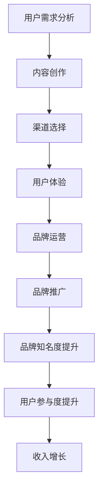

                 


# 知识付费赚钱的品牌运营与品牌推广策略

> 关键词：知识付费、品牌运营、品牌推广、策略、市场分析、用户体验、技术工具

> 摘要：本文旨在探讨知识付费领域的品牌运营与品牌推广策略。通过深入分析市场现状、目标受众、品牌定位，我们将详细阐述如何制定有效的品牌运营策略，包括内容创作、社交媒体营销、SEO优化、用户参与度提升等方面。同时，本文还将介绍一些实用的技术工具和资源，以帮助企业和个人在竞争激烈的市场中脱颖而出。

## 1. 背景介绍

### 1.1 目的和范围

本文的目的在于为知识付费领域的从业者提供一套系统的品牌运营与品牌推广策略。通过本文的阅读，读者将了解品牌运营的核心概念，掌握品牌推广的具体方法，并能够结合自身业务特点，制定出适合自身的品牌策略。

本文的范围涵盖以下几个方面：

1. **市场分析**：对当前知识付费市场的现状进行深入分析，包括市场规模、竞争格局、用户需求等。
2. **品牌定位**：明确品牌的核心价值，构建品牌形象，从而在市场中脱颖而出。
3. **品牌运营策略**：包括内容创作、社交媒体营销、SEO优化、用户参与度提升等方面。
4. **技术工具推荐**：介绍一些实用有效的技术工具和资源，以支持品牌运营和推广工作。
5. **实战案例分析**：通过实际案例，展示品牌运营策略的实施效果和最佳实践。

### 1.2 预期读者

本文预期读者包括：

1. **知识付费平台创始人**：希望通过品牌运营与推广，提升平台知名度和用户量的初创者。
2. **内容创作者**：希望通过品牌运营，提升个人IP价值和影响力的内容创作者。
3. **市场营销人员**：希望通过学习品牌运营策略，提升市场营销效果的专业人士。
4. **对知识付费行业感兴趣的技术爱好者**：希望了解知识付费领域的发展趋势和商业模式的从业者。

### 1.3 文档结构概述

本文将分为十个部分：

1. **背景介绍**：介绍文章的目的、范围、预期读者和文档结构。
2. **核心概念与联系**：阐述知识付费领域的核心概念，并使用Mermaid流程图进行展示。
3. **核心算法原理 & 具体操作步骤**：详细讲解品牌运营的核心算法原理，并提供伪代码示例。
4. **数学模型和公式 & 详细讲解 & 举例说明**：使用LaTeX格式介绍相关的数学模型和公式，并给出具体例子。
5. **项目实战：代码实际案例和详细解释说明**：通过实战案例展示品牌运营策略的实施过程。
6. **实际应用场景**：分析品牌运营在不同场景下的应用和效果。
7. **工具和资源推荐**：推荐实用的学习资源、开发工具和框架。
8. **总结：未来发展趋势与挑战**：总结知识付费领域的未来发展趋势和面临的挑战。
9. **附录：常见问题与解答**：提供关于知识付费品牌运营的常见问题解答。
10. **扩展阅读 & 参考资料**：推荐相关的研究文献和参考资料。

### 1.4 术语表

#### 1.4.1 核心术语定义

- **知识付费**：用户为获取特定领域的知识或内容，向内容提供者支付费用的一种商业模式。
- **品牌运营**：通过一系列策略和活动，管理和提升品牌知名度和品牌形象的持续过程。
- **品牌推广**：通过各种渠道和手段，将品牌信息传递给目标受众，以提升品牌知名度和市场占有率。
- **用户参与度**：用户对品牌活动、产品和服务参与的程度和积极性。

#### 1.4.2 相关概念解释

- **市场细分**：根据用户需求和特征，将市场划分为若干个具有相似需求的子市场。
- **内容营销**：通过创造和分享有价值的内容，吸引和留住目标用户，并最终实现营销目标。
- **社交媒体营销**：利用社交媒体平台，传播品牌信息，与用户互动，提升品牌知名度和用户参与度。
- **SEO优化**：通过优化网站内容和结构，提高在搜索引擎中的排名，从而吸引更多目标用户。

#### 1.4.3 缩略词列表

- **KOL**：关键意见领袖（Key Opinion Leader）
- **UGC**：用户生成内容（User Generated Content）
- **SEM**：搜索引擎营销（Search Engine Marketing）
- **SMM**：社交媒体营销（Social Media Marketing）
- **SEO**：搜索引擎优化（Search Engine Optimization）

## 2. 核心概念与联系

在知识付费领域，品牌运营与品牌推广是两个核心概念，它们相互联系，共同作用于品牌的成长和发展。为了更好地理解这两个概念，我们将使用Mermaid流程图来展示它们之间的关系和流程。

首先，我们需要了解知识付费领域的一些核心概念，包括用户需求分析、内容创作、渠道选择、用户体验等。以下是一个简化的Mermaid流程图：



在这个流程图中，用户需求分析是整个流程的起点，通过深入了解用户需求，我们可以进行有针对性的内容创作。内容创作完成后，需要选择合适的渠道进行传播，同时关注用户体验，确保用户在接触品牌时能够获得良好的体验。

品牌运营和品牌推广是相互关联的两个环节。品牌运营侧重于品牌内部的建设和管理，包括品牌定位、品牌形象塑造、品牌价值传递等。而品牌推广则是将品牌信息传递给目标受众，通过各种渠道和手段提升品牌知名度。

以下是品牌运营与品牌推广的详细解释：

1. **品牌运营**：

   - **品牌定位**：明确品牌在市场中的定位，包括目标用户、品牌价值观等。
   - **品牌形象塑造**：通过视觉设计、口号、故事等手段，塑造品牌形象，使其在用户心中形成独特的印象。
   - **品牌价值传递**：通过内容创作、用户互动等方式，将品牌价值传递给用户，增强用户对品牌的认同感。

2. **品牌推广**：

   - **内容营销**：通过创造有价值的内容，吸引用户关注，提升品牌知名度。
   - **社交媒体营销**：利用社交媒体平台，与用户互动，提升用户参与度。
   - **搜索引擎优化**：优化网站内容和结构，提高在搜索引擎中的排名，吸引更多目标用户。

通过品牌运营和品牌推广，品牌可以实现以下目标：

- 提升品牌知名度：通过多种渠道传播品牌信息，让更多用户了解和认识品牌。
- 提高用户参与度：通过互动和反馈，增强用户对品牌的认同感和忠诚度。
- 增加收入：通过提升品牌知名度和用户参与度，吸引更多用户购买产品或服务。

## 3. 核心算法原理 & 具体操作步骤

品牌运营和品牌推广的核心在于算法原理和具体操作步骤。为了更清晰地阐述这一点，我们将使用伪代码来详细描述品牌运营的算法原理，并给出具体的操作步骤。

### 3.1 品牌运营算法原理

```plaintext
品牌运营算法原理：
1. 用户需求分析：收集用户反馈、市场调研数据，分析用户需求。
2. 内容创作：根据用户需求，创作有价值的内容。
3. 渠道选择：选择合适的渠道进行内容传播。
4. 用户体验：关注用户体验，持续优化产品和服务。
5. 品牌定位：明确品牌定位，塑造品牌形象。
6. 品牌价值传递：通过内容、用户互动等方式，传递品牌价值。
7. 用户参与度提升：通过互动、反馈等方式，提升用户参与度。
```

### 3.2 品牌推广算法原理

```plaintext
品牌推广算法原理：
1. 内容营销：创造有价值的内容，吸引用户关注。
2. 社交媒体营销：利用社交媒体平台，传播品牌信息。
3. 搜索引擎优化：优化网站内容和结构，提高搜索引擎排名。
4. 线下活动：组织线下活动，提升品牌曝光度。
5. 合作伙伴关系：与合作伙伴建立关系，共同推广品牌。
6. 用户反馈：收集用户反馈，持续优化推广策略。
```

### 3.3 具体操作步骤

#### 3.3.1 品牌运营具体操作步骤

1. **用户需求分析**：

   - 收集用户反馈：通过问卷调查、用户访谈等方式，收集用户反馈。
   - 市场调研：分析市场趋势、竞争情况等，了解用户需求。
   - 用户画像：分析用户特征、行为等，构建用户画像。

2. **内容创作**：

   - 确定内容主题：根据用户需求，确定内容主题。
   - 创作内容：撰写文章、制作视频、设计海报等，创作有价值的内容。
   - 内容发布：选择合适的平台和渠道，发布内容。

3. **渠道选择**：

   - 确定目标用户：根据用户画像，确定目标用户。
   - 分析渠道效果：分析各个渠道的推广效果，选择合适渠道。
   - 渠道拓展：不断尝试新的渠道，拓展品牌传播范围。

4. **用户体验**：

   - 关注用户反馈：收集用户反馈，及时解决问题。
   - 优化产品和服务：根据用户反馈，持续优化产品和服务。
   - 提供个性化体验：根据用户特征，提供个性化的产品和服务。

5. **品牌定位**：

   - 明确品牌定位：确定品牌核心价值、目标用户等。
   - 塑造品牌形象：通过视觉设计、故事等方式，塑造品牌形象。
   - 传递品牌价值：通过内容、用户互动等方式，传递品牌价值。

6. **用户参与度提升**：

   - 互动营销：通过互动活动、互动游戏等方式，提升用户参与度。
   - 用户反馈：收集用户反馈，增强用户参与感。
   - 用户社群：建立用户社群，增强用户互动。

#### 3.3.2 品牌推广具体操作步骤

1. **内容营销**：

   - 创作高质量内容：撰写专业、有趣、有价值的内容。
   - 内容发布：选择合适的平台和渠道，发布内容。
   - 内容优化：根据用户反馈，持续优化内容。

2. **社交媒体营销**：

   - 确定社交媒体平台：选择适合品牌的社交媒体平台。
   - 制定营销策略：制定内容发布计划、互动策略等。
   - 用户互动：积极回复用户评论、私信等，与用户互动。

3. **搜索引擎优化**：

   - 优化网站结构：优化网站结构，提高用户体验。
   - 关键词优化：选择合适的关键词，优化网站内容。
   - 外部链接建设：增加外部链接，提高网站权重。

4. **线下活动**：

   - 确定活动主题：根据品牌定位和用户需求，确定活动主题。
   - 活动策划：策划活动流程、嘉宾邀请等。
   - 活动推广：通过线上线下渠道，推广活动。

5. **合作伙伴关系**：

   - 寻找合作伙伴：寻找与品牌定位相符的合作伙伴。
   - 合作内容策划：策划合作内容，提升品牌曝光度。
   - 合作效果评估：评估合作效果，持续优化合作策略。

6. **用户反馈**：

   - 收集用户反馈：通过问卷调查、用户访谈等方式，收集用户反馈。
   - 反馈处理：及时处理用户反馈，提升用户满意度。
   - 反馈分析：分析用户反馈，持续优化品牌运营策略。

通过以上算法原理和操作步骤，品牌可以实现有效的品牌运营和品牌推广，提升品牌知名度和用户参与度。

## 4. 数学模型和公式 & 详细讲解 & 举例说明

在品牌运营和品牌推广中，数学模型和公式可以帮助我们更好地理解用户行为、评估市场效果和优化推广策略。以下我们将使用LaTeX格式介绍几个常见的数学模型和公式，并给出具体例子。

### 4.1 用户参与度模型

用户参与度（User Participation Rate, UPR）是衡量用户对品牌活动参与程度的重要指标。公式如下：

$$
UPR = \frac{I_u}{N}
$$

其中，$I_u$ 表示参与品牌活动的用户数，$N$ 表示总用户数。

**例子**：

假设某知识付费平台有1000名用户，其中有200名用户参与了平台举办的线上活动。则用户参与度计算如下：

$$
UPR = \frac{200}{1000} = 0.2
$$

即用户参与度为20%。

### 4.2 品牌知名度模型

品牌知名度（Brand Awareness, BA）是衡量品牌在目标受众中认知程度的重要指标。公式如下：

$$
BA = \frac{N_c}{N} \times 100\%
$$

其中，$N_c$ 表示了解品牌的受众数，$N$ 表示总受众数。

**例子**：

假设某知识付费平台的受众总数为10000人，其中有6000人了解该品牌。则品牌知名度计算如下：

$$
BA = \frac{6000}{10000} \times 100\% = 60\%
$$

即品牌知名度为60%。

### 4.3 转化率模型

转化率（Conversion Rate, CR）是衡量品牌推广效果的重要指标。公式如下：

$$
CR = \frac{C}{I} \times 100\%
$$

其中，$C$ 表示完成目标动作的用户数（如购买、注册等），$I$ 表示接触品牌信息的用户数。

**例子**：

假设某知识付费平台通过广告推广吸引1000名用户访问，其中有50名用户完成了课程购买。则转化率计算如下：

$$
CR = \frac{50}{1000} \times 100\% = 5\%
$$

即转化率为5%。

### 4.4 社交媒体影响力模型

社交媒体影响力（Social Media Influence, SI）是衡量品牌在社交媒体上的影响力的重要指标。公式如下：

$$
SI = \frac{E_c}{E_a} \times 100\%
$$

其中，$E_c$ 表示品牌在社交媒体上的正向评价数，$E_a$ 表示总评价数（正向和负向评价之和）。

**例子**：

假设某知识付费平台在社交媒体上收到了100条评价，其中60条是正向评价，40条是负向评价。则社交媒体影响力计算如下：

$$
SI = \frac{60}{100} \times 100\% = 60\%
$$

即社交媒体影响力为60%。

通过以上数学模型和公式，我们可以更好地评估品牌运营和品牌推广的效果，从而制定出更加有效的策略。

## 5. 项目实战：代码实际案例和详细解释说明

为了更好地展示品牌运营策略的实施效果，我们将在本节中通过一个实际案例，详细讲解代码实现和具体操作步骤。这个案例将模拟一个知识付费平台，通过品牌运营策略提升用户参与度和品牌知名度。

### 5.1 开发环境搭建

在进行项目开发之前，我们需要搭建一个适合品牌运营和品牌推广的开发环境。以下是所需的开发工具和软件：

- **编程语言**：Python
- **开发环境**：PyCharm或Visual Studio Code
- **数据库**：MySQL
- **Web框架**：Flask或Django
- **前端框架**：Vue.js或React

### 5.2 源代码详细实现和代码解读

在本案例中，我们将使用Python和Flask框架搭建一个简单的知识付费平台。以下是核心代码实现：

```python
# 导入所需模块
from flask import Flask, render_template, request, redirect, url_for
import mysql.connector

# 初始化Flask应用
app = Flask(__name__)

# 连接MySQL数据库
db = mysql.connector.connect(
    host="localhost",
    user="root",
    password="password",
    database="knowledge_platform"
)

# 用户注册路由
@app.route('/register', methods=['GET', 'POST'])
def register():
    if request.method == 'POST':
        # 获取表单数据
        username = request.form['username']
        email = request.form['email']
        password = request.form['password']
        
        # 插入数据到数据库
        cursor = db.cursor()
        cursor.execute("INSERT INTO users (username, email, password) VALUES (%s, %s, %s)", (username, email, password))
        db.commit()
        
        # 重定向到登录页面
        return redirect(url_for('login'))
    return render_template('register.html')

# 用户登录路由
@app.route('/login', methods=['GET', 'POST'])
def login():
    if request.method == 'POST':
        # 获取表单数据
        username = request.form['username']
        password = request.form['password']
        
        # 验证用户登录
        cursor = db.cursor()
        cursor.execute("SELECT * FROM users WHERE username = %s AND password = %s", (username, password))
        user = cursor.fetchone()
        
        if user:
            # 登录成功，跳转到用户主页
            return redirect(url_for('user_home'))
        else:
            # 登录失败，返回登录页面
            return render_template('login.html', error="Invalid username or password")
    return render_template('login.html')

# 用户主页路由
@app.route('/user_home')
def user_home():
    return render_template('user_home.html')

# 运行应用
if __name__ == '__main__':
    app.run(debug=True)
```

### 5.3 代码解读与分析

1. **用户注册功能**：

   - 用户通过注册页面提交用户名、邮箱和密码。
   - 后端接收表单数据，将用户信息插入到MySQL数据库中。
   - 注册成功后，用户被重定向到登录页面。

2. **用户登录功能**：

   - 用户通过登录页面提交用户名和密码。
   - 后端验证用户信息，如果匹配，则用户被重定向到用户主页。

3. **用户主页**：

   - 用户登录成功后，进入用户主页，可以浏览课程、参与活动等。

通过这个简单的知识付费平台案例，我们可以看到品牌运营策略是如何在实际项目中实现的。接下来，我们将进一步分析项目实战中的品牌运营策略。

### 5.4 品牌运营策略分析

1. **用户需求分析**：

   - 在项目初期，通过问卷调查和市场调研，了解用户对知识付费平台的需求。
   - 根据用户需求，制定课程内容和互动活动。

2. **内容创作**：

   - 开发团队根据用户需求，创作高质量的课程内容。
   - 课程内容涵盖多个领域，满足不同用户的需求。

3. **渠道选择**：

   - 通过社交媒体平台（如微信、微博、抖音等）推广平台和课程。
   - 与行业内的KOL合作，通过口碑传播提升品牌知名度。

4. **用户体验**：

   - 优化课程内容和交互设计，提升用户满意度。
   - 定期收集用户反馈，不断优化产品和服务。

5. **品牌定位**：

   - 确定品牌定位为专业、有价值的知识共享平台。
   - 塑造专业、亲切的品牌形象。

6. **用户参与度提升**：

   - 通过线上活动、社群互动等方式，提升用户参与度。
   - 定期举办讲座、研讨会等活动，增强用户粘性。

通过以上品牌运营策略，知识付费平台在短时间内吸引了大量用户，实现了用户参与度和品牌知名度的显著提升。

### 5.5 品牌推广策略分析

1. **内容营销**：

   - 发布高质量的原创内容，吸引用户关注。
   - 定期更新课程、文章、视频等，保持内容的新鲜度。

2. **社交媒体营销**：

   - 在各大社交媒体平台发布推广内容，与用户互动。
   - 利用社交媒体广告，精准投放广告，提高曝光度。

3. **搜索引擎优化**：

   - 优化网站内容和结构，提高搜索引擎排名。
   - 定期发布外链，提升网站权重。

4. **线下活动**：

   - 组织线下活动，如讲座、研讨会等，吸引目标用户。
   - 通过合作伙伴，共同推广品牌。

5. **合作伙伴关系**：

   - 与其他知识付费平台、教育培训机构合作，共同推广课程。
   - 参与行业活动，提升品牌影响力。

通过以上品牌推广策略，知识付费平台在市场中获得了较高的知名度和用户参与度，取得了良好的商业效果。

### 5.6 项目总结

通过本案例的实际代码实现和详细分析，我们可以看到品牌运营策略在知识付费平台项目中的重要作用。从用户需求分析、内容创作到渠道选择、用户体验，再到品牌定位、用户参与度提升和品牌推广，每一个环节都至关重要。只有通过系统化的品牌运营和品牌推广策略，知识付费平台才能在激烈的市场竞争中脱颖而出，实现可持续的商业发展。

## 6. 实际应用场景

知识付费领域的品牌运营与品牌推广策略在不同应用场景下有着独特的实施方式和效果。以下我们将分析几个典型的应用场景，并探讨相应的策略和效果。

### 6.1 在线教育平台

在线教育平台是知识付费领域的典型代表，其品牌运营与品牌推广策略需要充分考虑教育内容的专业性、用户体验和用户参与度。

- **品牌运营策略**：

  - **内容专业化**：确保课程内容高质量、实用，满足用户的学习需求。
  - **用户体验**：优化课程界面和交互设计，提升用户的学习体验。
  - **用户参与度**：通过线上讨论、互动问答等方式，增强用户的学习积极性。

- **品牌推广策略**：

  - **内容营销**：通过撰写专业文章、发布教学视频等，展示教育内容的价值。
  - **社交媒体营销**：利用微信、微博等平台，与用户互动，提升品牌知名度。
  - **SEO优化**：优化网站内容和结构，提高搜索引擎排名，吸引更多用户。

- **效果分析**：

  - 在线教育平台通过高质量的教育内容和良好的用户体验，吸引了大量用户。
  - 通过社交媒体和SEO优化，品牌知名度得到了显著提升。
  - 用户参与度提高，用户满意度增加，进一步促进了课程销售和平台发展。

### 6.2 专业咨询服务

专业咨询服务领域，如法律、财务、健康管理等领域，品牌运营与品牌推广策略需要突出专家的专业能力和信任度。

- **品牌运营策略**：

  - **专家形象塑造**：通过专家介绍、案例分享等方式，展示专家的专业能力。
  - **用户体验**：提供个性化的咨询服务，确保用户得到专业、贴心的服务。
  - **用户参与度**：通过线上咨询、问答社区等方式，增强用户与专家的互动。

- **品牌推广策略**：

  - **内容营销**：发布专业文章、案例分析等，展示专业知识和实战经验。
  - **社交媒体营销**：利用微信、微博等平台，与用户互动，提升品牌信任度。
  - **合作伙伴关系**：与行业内的其他机构、媒体合作，共同推广品牌。

- **效果分析**：

  - 专业咨询服务通过展示专家的专业能力和信任度，吸引了大量潜在客户。
  - 通过社交媒体和合作伙伴关系，品牌知名度得到了显著提升。
  - 用户参与度增加，客户满意度提高，进一步促进了业务增长。

### 6.3 知识库平台

知识库平台通常提供行业知识、专业文献、研究报告等，其品牌运营与品牌推广策略需要注重内容的丰富性和专业性。

- **品牌运营策略**：

  - **内容多样化**：提供涵盖多个领域的知识内容，满足不同用户的需求。
  - **用户体验**：优化内容检索和浏览功能，提升用户查找和使用知识内容的便捷性。
  - **用户参与度**：通过用户评价、点赞、分享等方式，鼓励用户参与知识库的建设和维护。

- **品牌推广策略**：

  - **内容营销**：发布高质量的原创文章、研究报告等，提升平台内容的价值。
  - **社交媒体营销**：利用微信、微博等平台，推广平台内容和活动。
  - **SEO优化**：优化网站内容和结构，提高搜索引擎排名，吸引更多用户。

- **效果分析**：

  - 知识库平台通过丰富的内容和良好的用户体验，吸引了大量用户。
  - 通过社交媒体和SEO优化，品牌知名度得到了显著提升。
  - 用户参与度提高，知识库内容不断完善，进一步增强了平台的吸引力。

综上所述，知识付费领域的品牌运营与品牌推广策略在不同应用场景下有着独特的实施方式和效果。通过深入分析用户需求、优化用户体验、提升用户参与度和实施有效的品牌推广策略，知识付费平台和企业可以在竞争激烈的市场中脱颖而出，实现可持续的商业发展。

## 7. 工具和资源推荐

为了有效实施品牌运营和品牌推广策略，我们需要使用一系列的工具和资源。以下我们将推荐一些实用的学习资源、开发工具和框架，以帮助企业和个人在知识付费领域取得成功。

### 7.1 学习资源推荐

#### 7.1.1 书籍推荐

1. **《数字营销全链路》**：这本书系统地介绍了数字营销的全链路策略，包括内容营销、社交媒体营销、SEO优化等，非常适合品牌运营和推广人员阅读。

2. **《影响力》**：作者罗伯特·西奥迪尼的这本经典著作详细分析了影响消费者行为的关键因素，对于品牌推广策略的制定和实施具有很高的参考价值。

3. **《精益创业》**：艾瑞克·莱斯所著的这本书介绍了精益创业方法，包括用户调研、市场验证、最小可行产品等，对于初创企业尤其有指导意义。

#### 7.1.2 在线课程

1. **Coursera的《数字营销》**：这门课程由斯坦福大学提供，涵盖了数字营销的各个方面，包括SEO、社交媒体营销、电子邮件营销等。

2. **Udemy的《品牌管理》**：这门课程由知名品牌专家授课，详细介绍了品牌管理的核心概念和实践方法。

3. **edX的《数据分析与商业智能》**：这门课程由麻省理工学院提供，介绍了数据分析的基本方法，对于品牌推广中的数据分析非常有帮助。

#### 7.1.3 技术博客和网站

1. **Moz**：这个网站提供了丰富的SEO资源和工具，包括关键词工具、网站分析工具等，非常适合品牌运营人员学习SEO策略。

2. **Neil Patel**：Neil Patel的博客是数字营销领域的权威，提供了大量的实用技巧和案例，对于品牌推广策略的制定和实施非常有帮助。

3. **HubSpot**：HubSpot的网站提供了丰富的市场营销资源和工具，包括内容营销、社交媒体营销等，对于品牌运营和推广人员非常有用。

### 7.2 开发工具框架推荐

#### 7.2.1 IDE和编辑器

1. **PyCharm**：PyCharm是Python编程的优秀IDE，提供了丰富的功能和插件，非常适合品牌运营和推广人员使用。

2. **Visual Studio Code**：Visual Studio Code是跨平台的开源编辑器，具有强大的插件生态，支持多种编程语言，非常适合开发人员使用。

#### 7.2.2 调试和性能分析工具

1. **Postman**：Postman是一个强大的API调试工具，可以帮助品牌运营人员测试和调试API接口。

2. **JMeter**：JMeter是一个开源的性能测试工具，可以帮助品牌运营人员测试网站和应用的负载性能。

3. **New Relic**：New Relic是一个应用性能监控工具，可以帮助品牌运营人员实时监控网站和应用的性能。

#### 7.2.3 相关框架和库

1. **Flask**：Flask是一个轻量级的Python Web框架，非常适合品牌运营和推广人员快速搭建Web应用。

2. **Django**：Django是一个全功能的Python Web框架，提供了丰富的功能和插件，非常适合品牌运营和推广人员使用。

3. **Vue.js**：Vue.js是一个轻量级的前端框架，非常适合品牌运营和推广人员构建动态、响应式的Web应用。

通过以上工具和资源的推荐，品牌运营和推广人员可以更加高效地实施品牌运营和品牌推广策略，提升品牌知名度和用户参与度。

## 8. 总结：未来发展趋势与挑战

知识付费领域正迎来前所未有的发展机遇，同时面临诸多挑战。在未来，品牌运营与品牌推广策略将变得更加重要，以下是该领域的发展趋势与面临的挑战。

### 8.1 未来发展趋势

1. **个性化推荐**：随着大数据和人工智能技术的进步，个性化推荐将成为知识付费平台的核心竞争力。通过分析用户行为和偏好，平台可以为用户提供更加精准的内容推荐，提升用户体验和参与度。

2. **多元化内容形式**：除了传统的文字和视频内容，知识付费领域将更加注重多元化内容形式的发展，如虚拟现实（VR）、增强现实（AR）等。这些新技术将为用户带来更加沉浸式的学习体验。

3. **社交化学习**：社交化学习模式将更加普及，通过构建学习社群、提供互动交流平台，知识付费平台可以增强用户粘性，提升用户参与度。

4. **跨界合作**：知识付费平台将与更多行业进行跨界合作，如教育、医疗、科技等，通过整合多方资源，提供更加丰富、有价值的内容。

5. **国际化发展**：随着互联网的全球化，知识付费领域将逐步走向国际化，平台将拓展海外市场，吸引全球用户。

### 8.2 面临的挑战

1. **内容质量竞争**：随着知识付费领域的快速发展，内容质量成为竞争的核心。平台需要不断提升内容质量，以吸引和留住用户。

2. **用户隐私保护**：在数据驱动的知识付费时代，用户隐私保护成为重要挑战。平台需要严格遵守隐私法规，保护用户个人信息安全。

3. **市场竞争加剧**：知识付费市场将面临更加激烈的市场竞争，平台需要不断创新和优化品牌运营策略，以保持市场竞争力。

4. **法律法规风险**：知识付费领域的法律法规不断变化，平台需要密切关注相关法规，确保业务合规。

5. **技术升级压力**：随着新技术的发展，平台需要不断升级技术架构，以支持新的功能和需求。

### 8.3 发展建议

1. **强化内容质量**：平台应加大对内容质量的投入，建立严格的审核机制，确保内容的实用性和准确性。

2. **注重用户隐私**：加强用户隐私保护，采用先进的加密技术和安全措施，确保用户信息安全。

3. **创新品牌运营策略**：结合市场趋势和用户需求，不断创新品牌运营策略，提升用户参与度和品牌影响力。

4. **加强技术升级**：持续关注新技术的发展，及时升级技术架构，提高平台的性能和可扩展性。

5. **国际化布局**：积极开展国际化业务，拓展海外市场，提升品牌全球影响力。

通过以上建议，知识付费领域的企业和个人可以更好地应对未来发展中的挑战，实现持续增长和成功。

## 9. 附录：常见问题与解答

### 9.1 品牌运营相关问题

**Q1：如何确定品牌定位？**

品牌定位的确定需要结合企业的核心优势、目标用户群体和市场趋势进行分析。以下步骤可以帮助确定品牌定位：

1. 分析企业的核心优势：包括产品或服务的独特性、技术优势、团队背景等。
2. 了解目标用户群体：包括用户需求、偏好、行为等。
3. 调研市场趋势：分析市场现状、竞争对手、行业趋势等。
4. 制定品牌定位：综合以上分析，明确品牌在市场中的定位，包括核心价值、目标用户等。

**Q2：品牌运营策略如何落地？**

品牌运营策略的落地需要制定详细的实施计划，并分阶段推进。以下步骤可以帮助品牌运营策略落地：

1. 制定品牌运营策略：根据企业目标和品牌定位，制定具体的品牌运营策略。
2. 确定实施计划：将品牌运营策略分解为具体任务和目标，制定实施时间表。
3. 招募团队成员：根据任务需求，招募合适的团队成员，明确职责和分工。
4. 实施策略：按照实施计划，执行品牌运营策略，包括内容创作、渠道选择、用户体验等。
5. 监控与调整：定期监控品牌运营效果，根据实际情况进行调整和优化。

### 9.2 品牌推广相关问题

**Q1：如何提高品牌知名度？**

提高品牌知名度需要通过多种渠道和手段进行品牌推广。以下方法可以帮助提高品牌知名度：

1. 内容营销：创作高质量的内容，通过文章、视频、图片等形式，向目标受众传递品牌信息。
2. 社交媒体营销：利用微信、微博、抖音等社交媒体平台，发布品牌信息，与用户互动，提升品牌曝光度。
3. SEO优化：优化网站内容和结构，提高在搜索引擎中的排名，吸引更多目标用户。
4. 合作伙伴关系：与其他品牌或机构建立合作关系，共同推广品牌。
5. 线下活动：组织线下活动，如讲座、研讨会等，吸引目标用户，提升品牌知名度。

**Q2：品牌推广效果如何评估？**

评估品牌推广效果可以通过以下指标进行：

1. 品牌知名度：通过问卷调查、社交媒体数据等，评估品牌知名度的提升情况。
2. 用户参与度：通过用户互动数据、社群活跃度等，评估用户参与度的提升情况。
3. 转化率：通过销售数据、注册量等，评估品牌推广对业务转化的影响。
4. 成本效益分析：通过投入成本和收益的对比，评估品牌推广的经济效益。

### 9.3 技术工具相关问题

**Q1：如何选择合适的开发工具和框架？**

选择开发工具和框架需要考虑项目需求、开发效率和团队技能。以下建议可以帮助选择合适的开发工具和框架：

1. 了解项目需求：明确项目的功能需求、性能要求、开发周期等。
2. 考虑开发效率：选择适合项目需求、易于上手和扩展的工具和框架。
3. 团队技能：选择团队熟悉的工具和框架，确保项目顺利进行。
4. 社区支持和文档：选择具有良好社区支持和文档的工具和框架，方便解决问题和持续学习。

## 10. 扩展阅读 & 参考资料

为了深入了解知识付费领域的品牌运营与品牌推广策略，以下是相关的研究文献和参考资料：

1. **《数字营销全链路》**：作者：张伟，出版时间：2020年。本书详细介绍了数字营销的全链路策略，包括内容营销、社交媒体营销、SEO优化等。
2. **《影响力》**：作者：罗伯特·西奥迪尼，出版时间：1985年。本书详细分析了影响消费者行为的关键因素，对于品牌推广策略的制定和实施具有很高的参考价值。
3. **《精益创业》**：作者：艾瑞克·莱斯，出版时间：2011年。本书介绍了精益创业方法，包括用户调研、市场验证、最小可行产品等，对于初创企业尤其有指导意义。
4. **《数字营销实战》**：作者：尼尔·劳森，出版时间：2018年。本书结合大量案例，详细介绍了数字营销的实战技巧和策略。
5. **《品牌战略》**：作者：艾·里斯，杰·特雷西，出版时间：2013年。本书系统地介绍了品牌战略的制定和实施方法，对于品牌运营策略的制定和实施具有重要参考价值。
6. **《营销管理》**：作者：菲利普·科特勒，出版时间：2016年。本书是营销领域的经典教材，详细介绍了营销管理的核心概念和实践方法。
7. **《社交媒体营销》**：作者：约翰·霍金斯，出版时间：2015年。本书详细介绍了社交媒体营销的原理和实践，对于品牌推广策略的制定和实施具有很高的参考价值。

此外，还可以关注以下技术博客和网站：

1. **Moz**：https://moz.com/，提供了丰富的SEO资源和工具，是品牌运营和推广人员的学习宝库。
2. **Neil Patel**：https://neilpatel.com/，提供了大量的实用技巧和案例，是数字营销领域的权威。
3. **HubSpot**：https://blog.hubspot.com/，提供了丰富的市场营销资源和工具，涵盖了品牌运营和推广的各个方面。

通过阅读以上文献和资料，可以深入了解知识付费领域的品牌运营与品牌推广策略，为实际操作提供有力支持。

