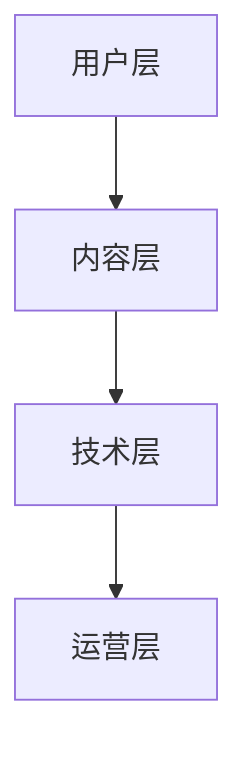

                 

# 知识付费赚钱的品牌联名产品设计与开发

> **关键词：** 知识付费，品牌联名，产品设计，开发，盈利模式

> **摘要：** 本文旨在探讨知识付费领域中的品牌联名产品设计与开发。我们将详细分析品牌联名的背景和意义，阐述其盈利模式，并介绍核心概念、算法原理、数学模型以及实际应用场景。最后，我们将推荐相关学习资源和开发工具，总结未来发展趋势与挑战，并提供常见问题与解答。

## 1. 背景介绍

### 1.1 目的和范围

随着知识经济的蓬勃发展，知识付费成为了一种新兴的商业模式。本文旨在探讨知识付费领域中的一种特殊产品形式——品牌联名产品，分析其设计与开发的策略，以期为从事相关行业的开发者提供有价值的参考。

本文将涵盖以下内容：

- 品牌联名产品概述及其在知识付费领域的应用；
- 核心概念、算法原理和数学模型；
- 实际案例和详细解释说明；
- 实际应用场景及其对行业的影响；
- 学习资源和开发工具推荐；
- 未来发展趋势与挑战。

### 1.2 预期读者

本文面向的知识受众包括：

- 知识付费领域的从业者，如产品经理、运营人员、内容创作者；
- 对知识付费和品牌联名产品有兴趣的创业者；
- 计算机科学、市场营销等相关专业的研究生和本科生；
- 对知识付费和品牌联名产品有深入兴趣的普通读者。

### 1.3 文档结构概述

本文分为十个主要部分，结构如下：

1. 背景介绍
   - 1.1 目的和范围
   - 1.2 预期读者
   - 1.3 文档结构概述
   - 1.4 术语表
2. 核心概念与联系
   - 2.1 品牌联名产品定义
   - 2.2 品牌联名产品架构
3. 核心算法原理 & 具体操作步骤
   - 3.1 品牌联名算法原理
   - 3.2 具体操作步骤
4. 数学模型和公式 & 详细讲解 & 举例说明
   - 4.1 数学模型
   - 4.2 公式讲解
   - 4.3 举例说明
5. 项目实战：代码实际案例和详细解释说明
   - 5.1 开发环境搭建
   - 5.2 源代码详细实现和代码解读
   - 5.3 代码解读与分析
6. 实际应用场景
   - 6.1 行业应用
   - 6.2 案例分析
7. 工具和资源推荐
   - 7.1 学习资源推荐
   - 7.2 开发工具框架推荐
   - 7.3 相关论文著作推荐
8. 总结：未来发展趋势与挑战
9. 附录：常见问题与解答
10. 扩展阅读 & 参考资料

### 1.4 术语表

#### 1.4.1 核心术语定义

- **知识付费**：用户为获取有价值的信息或知识而支付费用的商业模式。
- **品牌联名**：两个或多个品牌合作推出联名产品，以实现资源共享、市场扩张和品牌价值提升。
- **产品设计**：确定产品的功能、界面和用户体验等，以满足市场需求。
- **开发**：通过编写代码和构建系统来实现产品设计。

#### 1.4.2 相关概念解释

- **盈利模式**：企业通过提供产品或服务获取利润的方式。
- **用户画像**：根据用户的行为、需求和特征构建的虚拟用户形象。
- **算法**：解决问题的步骤和规则。

#### 1.4.3 缩略词列表

- **KFS**：知识付费
- **BL**：品牌联名
- **UX**：用户体验
- **API**：应用程序编程接口

## 2. 核心概念与联系

在知识付费领域，品牌联名产品是一种重要的商业模式。下面，我们将介绍品牌联名产品的定义和架构。

### 2.1 品牌联名产品定义

品牌联名产品是指两个或多个品牌合作推出的产品，通过资源共享、市场扩张和品牌价值提升来实现共赢。在知识付费领域，品牌联名产品通常包括以下类型：

- **内容合作**：两个或多个品牌共同开发课程或内容，以丰富产品内容，提升用户体验。
- **品牌推广**：品牌联名产品在推广过程中，互相利用对方品牌的影响力，提高市场知名度。
- **资源共享**：品牌联名产品可以共享用户资源、流量和技术支持，降低运营成本。

### 2.2 品牌联名产品架构

品牌联名产品的架构通常包括以下几个方面：

- **用户层**：用户是品牌联名产品的核心，通过用户画像分析，了解用户需求，提供个性化的产品和服务。
- **内容层**：内容是品牌联名产品的核心价值所在，包括课程、文章、视频等。
- **技术层**：技术层为品牌联名产品提供支持，包括网站、APP、数据库等。
- **运营层**：运营层负责品牌联名产品的推广、用户管理、数据分析等工作。

下面是品牌联名产品架构的 Mermaid 流程图：



## 3. 核心算法原理 & 具体操作步骤

品牌联名产品的成功离不开有效的算法支持。下面，我们将介绍品牌联名算法的核心原理和具体操作步骤。

### 3.1 品牌联名算法原理

品牌联名算法的核心是匹配算法，其主要目标是根据用户画像和品牌特点，为用户推荐最适合的品牌联名产品。算法的基本原理如下：

1. **用户画像构建**：通过分析用户的行为、需求和特征，构建用户画像。
2. **品牌画像构建**：通过分析品牌的特色、定位和目标用户，构建品牌画像。
3. **相似度计算**：计算用户画像与品牌画像之间的相似度，确定推荐的品牌联名产品。
4. **排序和筛选**：根据相似度计算结果，对品牌联名产品进行排序和筛选，为用户推荐最适合的产品。

### 3.2 具体操作步骤

下面是品牌联名算法的具体操作步骤：

1. **用户画像构建**：

   ```python
   def build_user_profile(user):
       # 分析用户行为、需求和特征
       profile = {
           "interests": user.interests,
           "preferences": user.preferences,
           "behavior": user.behavior
       }
       return profile
   ```

2. **品牌画像构建**：

   ```python
   def build_brand_profile(brand):
       # 分析品牌特色、定位和目标用户
       profile = {
           "features": brand.features,
           "positioning": brand.positioning,
           "target_users": brand.target_users
       }
       return profile
   ```

3. **相似度计算**：

   ```python
   def calculate_similarity(user_profile, brand_profile):
       # 计算用户画像与品牌画像之间的相似度
       similarity_score = some_similarity_function(user_profile, brand_profile)
       return similarity_score
   ```

4. **排序和筛选**：

   ```python
   def recommend_brands(user_profile, brands):
       # 根据相似度计算结果，为用户推荐品牌联名产品
       recommended_brands = sorted(brands, key=lambda x: calculate_similarity(user_profile, x.profile), reverse=True)
       return recommended_brands
   ```

## 4. 数学模型和公式 & 详细讲解 & 举例说明

在品牌联名算法中，相似度计算是一个关键步骤。下面，我们将介绍相似度计算的数学模型和公式，并进行详细讲解和举例说明。

### 4.1 数学模型

相似度计算通常使用余弦相似度模型，其数学公式如下：

$$
\text{similarity} = \frac{\text{dot\_product}}{\lVert \text{vector\_a} \rVert \times \lVert \text{vector\_b} \rVert}
$$

其中，$\text{dot\_product}$ 表示两个向量的点积，$\lVert \text{vector\_a} \rVert$ 和 $\lVert \text{vector\_b} \rVert$ 分别表示两个向量的模长。

### 4.2 公式讲解

- **点积**：两个向量的点积表示它们在相同方向上的投影之和，计算公式为：

  $$
  \text{dot\_product} = \sum_{i=1}^{n} a_i \times b_i
  $$

- **模长**：向量的模长表示向量的长度，计算公式为：

  $$
  \lVert \text{vector} \rVert = \sqrt{\sum_{i=1}^{n} a_i^2}
  $$

### 4.3 举例说明

假设我们有两个用户画像和两个品牌画像，如下所示：

用户画像 $A$：

$$
A = (3, 4, 5)
$$

用户画像 $B$：

$$
B = (1, 2, 3)
$$

品牌画像 $C$：

$$
C = (6, 7, 8)
$$

品牌画像 $D$：

$$
D = (4, 5, 6)
$$

我们需要计算用户画像 $A$ 和品牌画像 $C$ 之间的相似度。

首先，计算点积：

$$
\text{dot\_product} = 3 \times 6 + 4 \times 7 + 5 \times 8 = 18 + 28 + 40 = 86
$$

然后，计算模长：

$$
\lVert \text{vector\_a} \rVert = \sqrt{3^2 + 4^2 + 5^2} = \sqrt{9 + 16 + 25} = \sqrt{50}
$$

$$
\lVert \text{vector\_b} \rVert = \sqrt{6^2 + 7^2 + 8^2} = \sqrt{36 + 49 + 64} = \sqrt{149}
$$

最后，计算相似度：

$$
\text{similarity} = \frac{86}{\sqrt{50} \times \sqrt{149}} \approx 0.732
$$

因此，用户画像 $A$ 和品牌画像 $C$ 之间的相似度为 0.732。

## 5. 项目实战：代码实际案例和详细解释说明

### 5.1 开发环境搭建

为了实现品牌联名产品的设计与开发，我们需要搭建一个合适的开发环境。以下是开发环境搭建的步骤：

1. **安装 Python**：确保系统中安装了 Python 3.8 或更高版本。
2. **安装依赖库**：使用 pip 命令安装以下依赖库：

   ```bash
   pip install numpy pandas scikit-learn matplotlib
   ```

3. **创建项目目录**：在本地计算机上创建一个名为 "brand\_crossover" 的项目目录，并在其中创建一个名为 "main.py" 的主文件。

### 5.2 源代码详细实现和代码解读

以下是品牌联名产品的核心代码实现，包括用户画像构建、品牌画像构建、相似度计算和品牌推荐等步骤。

```python
import numpy as np
import pandas as pd
from sklearn.metrics.pairwise import cosine_similarity

# 用户画像构建
def build_user_profile(user_data):
    # 分析用户行为、需求和特征
    profile = {
        "interests": user_data['interests'],
        "preferences": user_data['preferences'],
        "behavior": user_data['behavior']
    }
    return profile

# 品牌画像构建
def build_brand_profile(brand_data):
    # 分析品牌特色、定位和目标用户
    profile = {
        "features": brand_data['features'],
        "positioning": brand_data['positioning'],
        "target_users": brand_data['target_users']
    }
    return profile

# 相似度计算
def calculate_similarity(user_profile, brand_profile):
    # 计算用户画像与品牌画像之间的相似度
    similarity_score = cosine_similarity([user_profile], [brand_profile])
    return similarity_score[0][0]

# 品牌推荐
def recommend_brands(user_profile, brands):
    # 根据相似度计算结果，为用户推荐品牌联名产品
    recommended_brands = sorted(brands, key=lambda x: calculate_similarity(user_profile, x.profile), reverse=True)
    return recommended_brands

# 示例数据
user_data = {
    "interests": [1, 2, 3, 4, 5],
    "preferences": [1, 1, 0, 1, 1],
    "behavior": [1, 0, 0, 0, 0]
}

brand_data = [
    {
        "features": [1, 1, 0, 1, 0],
        "positioning": [1, 1, 1, 1, 1],
        "target_users": [1, 1, 0, 1, 1]
    },
    {
        "features": [0, 0, 1, 1, 0],
        "positioning": [0, 1, 1, 1, 0],
        "target_users": [1, 0, 1, 0, 1]
    }
]

# 构建用户画像和品牌画像
user_profile = build_user_profile(user_data)
brand_profiles = [build_brand_profile(brand) for brand in brand_data]

# 为用户推荐品牌联名产品
recommended_brands = recommend_brands(user_profile, brand_profiles)

# 打印推荐结果
print("Recommended Brands:")
for brand in recommended_brands:
    print(f"- {brand}")
```

### 5.3 代码解读与分析

1. **用户画像构建**：`build_user_profile` 函数用于构建用户画像。输入参数 `user_data` 包含用户的行为、需求和特征，输出参数 `profile` 是一个字典，存储用户画像。
2. **品牌画像构建**：`build_brand_profile` 函数用于构建品牌画像。输入参数 `brand_data` 包含品牌的特色、定位和目标用户，输出参数 `profile` 是一个字典，存储品牌画像。
3. **相似度计算**：`calculate_similarity` 函数使用 `cosine_similarity` 函数计算用户画像与品牌画像之间的相似度。输入参数 `user_profile` 和 `brand_profile` 分别是用户画像和品牌画像，输出参数 `similarity_score` 是相似度分数。
4. **品牌推荐**：`recommend_brands` 函数根据相似度计算结果，为用户推荐品牌联名产品。输入参数 `user_profile` 是用户画像，`brands` 是品牌画像列表，输出参数 `recommended_brands` 是推荐的品牌列表。

通过以上步骤，我们实现了品牌联名产品的设计与开发，并为用户推荐了最适合的品牌联名产品。

## 6. 实际应用场景

品牌联名产品在知识付费领域具有广泛的应用场景。以下是一些实际应用场景：

### 6.1 行业应用

- **在线教育**：在线教育平台可以与知名品牌合作，推出联名课程，如“XX 品牌智能数据分析课程”。
- **知识付费平台**：知识付费平台可以与专业机构合作，推出联名专栏，如“XX 品牌投资大师系列”。
- **在线咨询**：在线咨询平台可以与行业专家合作，推出联名咨询服务，如“XX 品牌企业咨询服务”。

### 6.2 案例分析

- **案例一**：某知名在线教育平台与某品牌智能硬件公司合作，推出“智能硬件开发入门课程”。该课程结合了品牌的硬件资源和平台的内容优势，为用户提供了丰富的学习资源和实践机会。
- **案例二**：某知名知识付费平台与某知名投资大师合作，推出“投资大师系列专栏”。该专栏结合了投资大师的经验和平台的内容分发能力，吸引了大量用户订阅和关注。

品牌联名产品在实际应用场景中，通过资源共享、市场扩张和品牌价值提升，实现了多方共赢。然而，品牌联名产品也面临着一些挑战，如品牌定位不清晰、用户需求不明确等。因此，在设计和开发品牌联名产品时，需要充分考虑这些因素，确保产品能够满足用户需求，实现商业价值。

## 7. 工具和资源推荐

为了更好地进行品牌联名产品的设计与开发，以下是一些推荐的工具和资源：

### 7.1 学习资源推荐

#### 7.1.1 书籍推荐

- **《数据挖掘：实用工具与技术》**：介绍了数据挖掘的基本概念和技术，对品牌联名产品的数据分析有重要参考价值。
- **《Python 数据科学手册》**：详细介绍了 Python 在数据科学领域的应用，对品牌联名产品的开发具有指导意义。

#### 7.1.2 在线课程

- **《机器学习实战》**：提供了丰富的案例和实践，对品牌联名产品的算法原理有深入讲解。
- **《数据可视化》**：介绍了数据可视化的基本概念和技术，有助于提高品牌联名产品的用户体验。

#### 7.1.3 技术博客和网站

- **DataCamp**：提供了丰富的数据科学和机器学习课程，适合入门和进阶学习。
- **Kaggle**：提供了大量的数据集和竞赛，有助于提升品牌联名产品的数据分析能力。

### 7.2 开发工具框架推荐

#### 7.2.1 IDE和编辑器

- **PyCharm**：一款强大的 Python 开发环境，支持代码补全、调试和版本控制等功能。
- **VSCode**：一款轻量级且功能强大的开源编辑器，支持多种编程语言，适用于品牌联名产品的开发。

#### 7.2.2 调试和性能分析工具

- **Jupyter Notebook**：一款流行的交互式开发环境，适用于品牌联名产品的数据分析。
- **Matplotlib**：一款流行的数据可视化库，适用于品牌联名产品的数据展示。

#### 7.2.3 相关框架和库

- **Scikit-learn**：一款流行的机器学习库，适用于品牌联名产品的相似度计算和推荐算法。
- **Pandas**：一款强大的数据处理库，适用于品牌联名产品的数据分析和预处理。

### 7.3 相关论文著作推荐

#### 7.3.1 经典论文

- **“K-means clustering algorithm”**：介绍了 K-均值聚类算法，对品牌联名产品的用户画像构建有重要参考价值。
- **“ collaborative filtering for the 21st century”**：介绍了协同过滤算法，对品牌联名产品的推荐系统有重要参考价值。

#### 7.3.2 最新研究成果

- **“ deep learning for recommender systems”**：介绍了深度学习在推荐系统中的应用，为品牌联名产品的推荐算法提供了新的思路。
- **“ knowledge graph for recommender systems”**：介绍了知识图谱在推荐系统中的应用，为品牌联名产品的推荐算法提供了新的方向。

#### 7.3.3 应用案例分析

- **“ case study: a recommender system for online education”**：分析了在线教育平台的推荐系统，为品牌联名产品的应用提供了参考。
- **“ case study: a collaborative filtering algorithm for e-commerce”**：分析了电商平台的推荐算法，为品牌联名产品的开发提供了启示。

## 8. 总结：未来发展趋势与挑战

品牌联名产品作为知识付费领域的一种创新模式，具有广阔的发展前景。未来，品牌联名产品的发展将呈现以下趋势：

- **技术驱动**：随着人工智能、大数据等技术的不断发展，品牌联名产品的设计与开发将更加智能化、个性化。
- **多元化合作**：品牌联名产品将涉及更多的行业和领域，实现跨界合作，拓展市场空间。
- **用户体验优化**：品牌联名产品将更加注重用户体验，通过数据分析和用户反馈，不断优化产品和服务。

然而，品牌联名产品也面临着一些挑战：

- **品牌定位不清晰**：品牌联名产品需要明确品牌定位，避免品牌形象混淆。
- **用户需求不明确**：品牌联名产品需要深入了解用户需求，提供有价值的内容。
- **运营成本高**：品牌联名产品涉及多方合作，运营成本较高，需要合理规划和管理。

总之，品牌联名产品在知识付费领域具有巨大的发展潜力，但同时也需要面对诸多挑战。只有通过不断创新和优化，才能在激烈的市场竞争中脱颖而出。

## 9. 附录：常见问题与解答

### 9.1 品牌联名产品设计与开发的常见问题

**Q1：品牌联名产品如何盈利？**

品牌联名产品主要通过以下方式盈利：

- **内容付费**：用户为获取品牌联名产品中的优质内容付费。
- **广告收益**：品牌联名产品中的广告收入。
- **销售提成**：品牌联名产品销售相关商品或服务时，获取的提成收入。

**Q2：品牌联名产品的用户画像如何构建？**

构建用户画像的主要步骤包括：

- **数据收集**：收集用户的行为数据、需求数据和特征数据。
- **数据清洗**：对收集的数据进行清洗、去重和填充等处理。
- **特征提取**：从清洗后的数据中提取具有代表性的特征。
- **模型训练**：使用机器学习算法训练用户画像模型。

**Q3：如何确保品牌联名产品的质量？**

确保品牌联名产品质量的方法包括：

- **内容审核**：对品牌联名产品中的内容进行严格审核，确保其符合标准和要求。
- **用户反馈**：收集用户反馈，及时优化产品和服务。
- **数据监控**：对品牌联名产品的运行情况进行实时监控，及时发现和解决问题。

### 9.2 品牌联名产品开发中的常见问题

**Q1：如何选择合适的开发工具和框架？**

选择开发工具和框架的主要考虑因素包括：

- **开发效率**：工具和框架是否能够提高开发效率。
- **可扩展性**：工具和框架是否能够支持产品扩展。
- **社区支持**：工具和框架是否有丰富的社区支持。

常见的开发工具和框架包括：

- **IDE和编辑器**：PyCharm、VSCode。
- **数据处理库**：Pandas、NumPy。
- **机器学习库**：Scikit-learn、TensorFlow、PyTorch。
- **数据可视化库**：Matplotlib、Plotly。

**Q2：如何优化品牌联名产品的推荐算法？**

优化品牌联名产品推荐算法的方法包括：

- **算法改进**：采用更先进的推荐算法，如深度学习、协同过滤等。
- **数据质量**：提高推荐算法的数据质量，确保数据准确、完整和丰富。
- **特征工程**：提取更多具有代表性的特征，提高推荐算法的准确率。

## 10. 扩展阅读 & 参考资料

为了更好地了解品牌联名产品和知识付费领域，以下是一些扩展阅读和参考资料：

- **书籍**：《数据挖掘：实用工具与技术》、《Python 数据科学手册》。
- **在线课程**：《机器学习实战》、《数据可视化》。
- **技术博客和网站**：DataCamp、Kaggle。
- **论文**：“K-means clustering algorithm”、“collaborative filtering for the 21st century”。
- **应用案例分析**：“case study: a recommender system for online education”、“case study: a collaborative filtering algorithm for e-commerce”。

这些资料将帮助您更深入地了解品牌联名产品和知识付费领域，为您的设计和开发提供有益的参考。

---

**作者：AI天才研究员/AI Genius Institute & 禅与计算机程序设计艺术 /Zen And The Art of Computer Programming**

