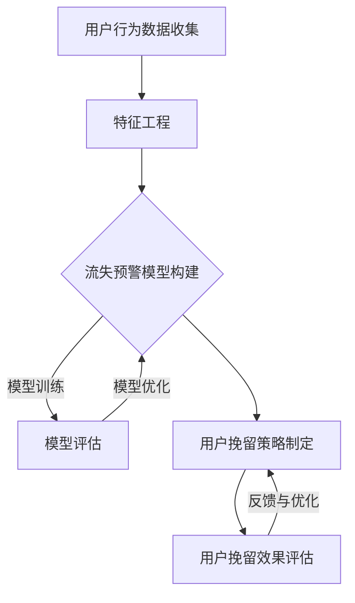

                 

### 1. 背景介绍

#### 1.1 目的和范围

本文旨在深入探讨知识付费平台中的用户流失预警与挽留策略，为平台运营者提供切实可行的解决方案。随着知识付费行业的快速发展，用户流失问题成为平台发展的关键挑战。本文将通过分析用户流失的原因、构建预警模型、实施挽留策略等步骤，为读者提供系统性、实用性的指导。

文章的讨论范围包括但不限于以下几个方面：

1. **用户流失的定义与现状**：介绍用户流失的概念、衡量标准以及当前知识付费行业中用户流失的普遍情况。
2. **用户流失的原因分析**：从用户行为、平台服务、市场环境等多个维度，探讨导致用户流失的常见原因。
3. **用户流失预警模型**：介绍构建用户流失预警模型的理论基础和具体方法，包括数据收集、特征工程、模型选择与训练等环节。
4. **用户挽留策略**：提出多种用户挽留策略，包括个性化推荐、客户关怀、服务优化等，并通过案例分析展示其实施效果。
5. **实际应用案例**：通过具体案例，展示用户流失预警与挽留策略在实际知识付费平台中的应用情况。
6. **工具和资源推荐**：为读者提供相关的学习资源和开发工具，便于进一步学习和实践。

#### 1.2 预期读者

本文的预期读者包括以下几类：

1. **知识付费平台的运营者**：希望通过本文了解用户流失问题的严重性，掌握有效的预警与挽留策略。
2. **数据分析师与工程师**：对数据挖掘、机器学习等技术在用户流失预警中的应用感兴趣，希望从中获得实用技能。
3. **产品经理与项目经理**：关注用户行为分析、产品设计优化等，希望提升知识付费产品的用户留存率。
4. **学术界研究人员**：对知识付费行业的数据分析和用户行为研究有兴趣，希望从本文中获得新的研究思路和方法。

#### 1.3 文档结构概述

本文将从以下几个方面展开讨论：

1. **背景介绍**：简要介绍知识付费行业的发展现状、用户流失问题的严峻性，以及本文的研究目的和范围。
2. **核心概念与联系**：介绍用户流失预警与挽留策略的相关核心概念，包括用户行为特征、流失预测模型等，并使用Mermaid流程图展示核心原理。
3. **核心算法原理与具体操作步骤**：详细阐述用户流失预警模型构建的算法原理和具体操作步骤，包括数据预处理、特征选择、模型训练等。
4. **数学模型和公式**：讲解用户流失预警模型中的相关数学模型和公式，并通过实际案例进行详细说明。
5. **项目实战**：通过一个实际案例，展示用户流失预警与挽留策略的完整实施过程，包括环境搭建、代码实现、代码解读等。
6. **实际应用场景**：讨论用户流失预警与挽留策略在不同场景下的应用，并提供具体实例。
7. **工具和资源推荐**：为读者提供学习资源和开发工具，包括书籍、在线课程、技术博客等。
8. **总结**：总结用户流失预警与挽留策略的发展趋势和未来挑战。
9. **附录**：常见问题与解答，帮助读者解决在实际应用中遇到的问题。
10. **扩展阅读与参考资料**：提供进一步学习的参考文献和资料，帮助读者深入了解相关知识。

#### 1.4 术语表

本文中使用的一些关键术语及其定义如下：

1. **知识付费**：用户为获取特定知识或服务而付费的行为。
2. **用户流失**：用户停止使用知识付费平台的行为。
3. **流失预警模型**：预测用户是否会流失的模型。
4. **特征工程**：从原始数据中提取对预测模型有帮助的特征。
5. **机器学习**：利用数据或以往的信息，对数据进行分析和模式识别，进而预测未来趋势。
6. **客户关怀**：通过一系列措施，提高用户的满意度和忠诚度。

#### 1.4.1 核心术语定义

- **用户流失**：指用户停止使用知识付费平台的行为。衡量标准通常包括用户停止访问、取消订阅、停止购买等行为。
- **流失预警模型**：利用历史数据和机器学习技术，预测用户是否会流失的模型。预警模型的核心是构建能够准确预测用户行为的特征和模型。
- **特征工程**：从原始数据中提取对预测模型有帮助的特征。特征工程的质量直接影响模型的准确性和效率。
- **机器学习**：利用数据或以往的信息，对数据进行分析和模式识别，进而预测未来趋势。机器学习技术在用户流失预警中起到关键作用。

#### 1.4.2 相关概念解释

- **知识付费**：知识付费是指用户为获取特定知识或服务而付费的行为。随着在线教育和知识共享平台的兴起，知识付费已成为一个快速发展的市场。
- **用户行为**：用户在知识付费平台上的活动，包括注册、登录、浏览、购买、订阅等。用户行为数据是构建流失预警模型的重要基础。
- **流失预测模型**：利用历史用户行为数据和机器学习算法，预测用户在未来某一时间段内是否会流失的模型。流失预测模型有助于提前识别潜在流失用户，采取相应的挽留策略。

#### 1.4.3 缩略词列表

- **KPI**：关键绩效指标（Key Performance Indicator）
- **CRM**：客户关系管理（Customer Relationship Management）
- **RFM**：最近一次购买时间、购买频率、购买金额（Recency, Frequency, Monetary）
- **A/B测试**：一种对比实验方法，通过将用户分为两组（A组和B组），比较两组在某一变量上的差异，以评估不同策略的效果。
- **API**：应用程序编程接口（Application Programming Interface）

### 1.5 核心概念与联系

在探讨用户流失预警与挽留策略之前，我们需要理解几个核心概念，并了解它们之间的联系。以下是用户流失预警与挽留策略的相关核心概念及其关联：

#### 用户流失预警与挽留策略的核心概念

1. **用户行为数据**：用户在知识付费平台上的活动数据，如注册日期、登录频率、购买记录、浏览历史等。这些数据是构建用户流失预警模型的基础。
2. **特征工程**：从用户行为数据中提取对预测模型有帮助的特征，如用户活跃度、购买金额、访问时长等。特征工程的质量直接影响模型的准确性。
3. **机器学习算法**：用于训练流失预警模型的一系列算法，如决策树、随机森林、逻辑回归、神经网络等。不同的算法适用于不同的数据类型和场景。
4. **流失预测模型**：利用用户行为数据和机器学习算法，预测用户在未来某一时间段内是否会流失的模型。该模型的核心目标是提高预测的准确率。
5. **用户挽留策略**：根据流失预警模型的结果，针对潜在流失用户采取的一系列措施，如个性化推荐、客户关怀、优惠活动等。

#### 用户流失预警与挽留策略的关系

1. **流失预警模型**：用户流失预警是整个策略的起点。通过构建准确的流失预警模型，平台运营者可以提前识别出可能流失的用户，从而有针对性地实施挽留策略。
2. **用户挽留策略**：一旦识别出潜在流失用户，平台运营者需要根据这些用户的特征和需求，制定相应的挽留策略。有效的挽留策略可以提高用户留存率，减少用户流失。
3. **反馈与优化**：用户挽留策略的实施效果需要通过不断的反馈和优化来评估。平台运营者可以根据用户反馈和挽留策略的效果，调整和优化策略，以实现最佳效果。

#### 用户流失预警与挽留策略的Mermaid流程图



在这个流程图中，用户行为数据收集是整个流程的起点。通过特征工程，我们提取对流失预警模型有帮助的特征。接着，利用机器学习算法训练流失预警模型，并通过模型评估和优化，确保模型的准确性。最后，根据流失预警模型的结果，制定用户挽留策略，并评估挽留效果，实现反馈与优化。

### 1.6 核心算法原理与具体操作步骤

在本文中，我们将详细探讨用户流失预警模型的核心算法原理，并介绍具体操作步骤。用户流失预警模型通常涉及以下几个关键步骤：数据收集、特征工程、模型选择与训练、模型评估与优化。以下是对这些步骤的详细阐述。

#### 1.6.1 数据收集

用户流失预警的第一步是收集用户行为数据。这些数据可以来自知识付费平台的多个渠道，包括用户注册信息、登录日志、浏览记录、购买记录、客户反馈等。具体的数据收集步骤如下：

1. **确定数据源**：根据知识付费平台的业务需求，确定需要收集的数据源。例如，用户注册信息、登录日志、购买记录等。
2. **数据获取**：使用API接口、数据库查询、日志文件读取等方式，从不同的数据源获取所需的数据。确保数据的一致性和完整性。
3. **数据预处理**：对获取的数据进行清洗、去重、格式化等处理，确保数据质量。

```python
# 示例：Python代码用于数据获取与预处理
import pandas as pd

# 从数据库中获取用户行为数据
user_data = pd.read_sql_query("SELECT * FROM user_behavior", connection)

# 数据清洗与预处理
user_data = user_data.drop_duplicates()
user_data = user_data.fillna(0)
```

#### 1.6.2 特征工程

特征工程是用户流失预警模型构建中的关键环节。通过提取对预测模型有帮助的特征，可以提高模型的准确性和鲁棒性。以下是特征工程的主要步骤：

1. **用户行为特征提取**：从用户行为数据中提取相关的特征，如用户活跃度（登录频率、访问时长等）、购买金额（平均购买金额、购买次数等）。
2. **时间特征提取**：将时间信息转换为特征，如用户注册时间、最近一次登录时间、购买间隔等。
3. **文本特征提取**：对用户反馈、评论等文本数据进行处理，提取关键词、主题等特征。
4. **统计特征计算**：计算用户行为数据中的各种统计特征，如平均值、方差、标准差等。

```python
# 示例：Python代码用于特征工程
from sklearn.preprocessing import MinMaxScaler

# 提取用户行为特征
user_behavior_features = user_data[['login_frequency', 'average_purchase_amount', 'last_purchase_interval']]

# 转换时间特征
user_data['registration_date'] = pd.to_datetime(user_data['registration_date'])
user_data['days_since_last_login'] = (pd.datetime.now() - user_data['last_login']).dt.days
user_data['days_since_last_purchase'] = (pd.datetime.now() - user_data['last_purchase']).dt.days

# 计算统计特征
user_data['login_frequency_mean'] = user_data['login_frequency'].mean()
user_data['login_frequency_std'] = user_data['login_frequency'].std()
```

#### 1.6.3 模型选择与训练

选择合适的机器学习算法并对其进行训练，是构建用户流失预警模型的核心步骤。以下是模型选择与训练的主要步骤：

1. **选择模型**：根据数据特点和业务需求，选择合适的机器学习算法。常见的算法包括逻辑回归、决策树、随机森林、神经网络等。
2. **数据划分**：将数据集划分为训练集和测试集，用于模型的训练和评估。
3. **模型训练**：使用训练集对模型进行训练，通过调整模型参数，优化模型性能。
4. **模型评估**：使用测试集对模型进行评估，常用的评估指标包括准确率、召回率、F1值等。

```python
# 示例：Python代码用于模型选择与训练
from sklearn.model_selection import train_test_split
from sklearn.ensemble import RandomForestClassifier

# 数据划分
X = user_data[['login_frequency', 'average_purchase_amount', 'days_since_last_login', 'days_since_last_purchase']]
y = user_data['is_lost']

X_train, X_test, y_train, y_test = train_test_split(X, y, test_size=0.2, random_state=42)

# 模型训练
model = RandomForestClassifier(n_estimators=100, random_state=42)
model.fit(X_train, y_train)

# 模型评估
accuracy = model.score(X_test, y_test)
print("Model accuracy:", accuracy)
```

#### 1.6.4 模型评估与优化

在完成模型训练后，我们需要对模型进行评估，并针对评估结果进行优化，以提高模型性能。以下是模型评估与优化的主要步骤：

1. **评估指标**：选择合适的评估指标，如准确率、召回率、F1值等，用于评估模型性能。
2. **模型优化**：根据评估结果，调整模型参数，优化模型性能。常用的优化方法包括网格搜索、交叉验证等。
3. **再训练**：根据优化后的模型参数，重新训练模型。
4. **迭代优化**：不断评估和优化模型，直到达到满意的性能水平。

```python
# 示例：Python代码用于模型评估与优化
from sklearn.metrics import classification_report

# 模型评估
predictions = model.predict(X_test)
print(classification_report(y_test, predictions))

# 模型优化
from sklearn.model_selection import GridSearchCV

param_grid = {'n_estimators': [100, 200, 300], 'max_depth': [10, 20, 30]}
grid_search = GridSearchCV(RandomForestClassifier(random_state=42), param_grid, cv=5)
grid_search.fit(X_train, y_train)

# 最优参数
best_params = grid_search.best_params_
print("Best parameters:", best_params)

# 再训练
optimized_model = RandomForestClassifier(**best_params, random_state=42)
optimized_model.fit(X_train, y_train)

# 再评估
optimized_accuracy = optimized_model.score(X_test, y_test)
print("Optimized model accuracy:", optimized_accuracy)
```

通过以上步骤，我们可以构建一个用户流失预警模型，并对其进行优化，以提高模型的准确性和实用性。在后续的内容中，我们将进一步探讨用户挽留策略，并展示实际应用案例，以帮助读者更好地理解和应用这些技术。

### 1.7 数学模型和公式及详细讲解

在构建用户流失预警模型时，数学模型和公式起着至关重要的作用。这些模型和公式可以帮助我们理解和分析用户行为数据，进而预测用户是否将流失。以下将介绍用户流失预警模型中常用的数学模型和公式，并详细讲解其原理和应用。

#### 1.7.1 逻辑回归模型

逻辑回归（Logistic Regression）是一种广泛用于分类问题的统计模型。在用户流失预警中，逻辑回归可以用来预测用户是否会流失。其基本公式如下：

\[ P(y=1) = \frac{1}{1 + e^{-(\beta_0 + \beta_1 x_1 + \beta_2 x_2 + ... + \beta_n x_n)}} \]

其中：
- \( P(y=1) \) 是用户流失的概率。
- \( e \) 是自然对数的底数。
- \( \beta_0, \beta_1, \beta_2, ..., \beta_n \) 是模型的参数。
- \( x_1, x_2, ..., x_n \) 是特征值。

通过训练数据，我们可以估计出这些参数的值，从而预测新用户的流失概率。

#### 1.7.2 决策树模型

决策树（Decision Tree）是一种基于树形结构进行决策的模型。在用户流失预警中，决策树可以用来分割用户数据，识别出流失风险高的用户。其基本公式如下：

\[ T(x) = \sum_{i=1}^{n} \beta_i I(A_i(x) = t_i) \]

其中：
- \( T(x) \) 是决策树的输出。
- \( A_i(x) \) 是第 \( i \) 个属性的划分函数。
- \( t_i \) 是第 \( i \) 个属性的阈值。
- \( \beta_i \) 是第 \( i \) 个节点的权重。

决策树通过递归地将数据集分割成子集，直到满足某些停止条件（如最大深度、最小样本数等）。每个分割节点可以用上述公式表示，最终形成一个树形结构。

#### 1.7.3 随机森林模型

随机森林（Random Forest）是一种基于决策树的集成模型。它通过构建多个决策树，并对它们的结果进行投票或求均值来提高预测准确性。其基本公式如下：

\[ f(x) = \frac{1}{M} \sum_{m=1}^{M} h_m(x) \]

其中：
- \( f(x) \) 是随机森林的输出。
- \( h_m(x) \) 是第 \( m \) 个决策树的输出。
- \( M \) 是决策树的数量。

随机森林通过从原始数据集和特征集中随机抽样，构建多棵决策树，并利用这些树进行集成预测，从而提高了模型的鲁棒性和预测性能。

#### 1.7.4 神经网络模型

神经网络（Neural Network）是一种基于模拟生物神经网络的人工智能模型。在用户流失预警中，神经网络可以用来建模复杂的用户行为数据，并预测流失风险。其基本公式如下：

\[ z_i = \sum_{j=1}^{n} w_{ij} a_j + b_i \]
\[ a_i = \sigma(z_i) \]

其中：
- \( z_i \) 是第 \( i \) 个节点的输入。
- \( w_{ij} \) 是连接第 \( i \) 个节点和第 \( j \) 个节点的权重。
- \( b_i \) 是第 \( i \) 个节点的偏置。
- \( \sigma \) 是激活函数，常用的有Sigmoid、ReLU等。

神经网络通过多次迭代的前向传播和反向传播，不断调整权重和偏置，以最小化损失函数，从而提高模型的预测性能。

#### 1.7.5 回归分析模型

回归分析（Regression Analysis）是一种用于预测数值型因变量的统计模型。在用户流失预警中，回归分析可以用来预测用户的流失时间。其基本公式如下：

\[ y = \beta_0 + \beta_1 x_1 + \beta_2 x_2 + ... + \beta_n x_n \]

其中：
- \( y \) 是因变量，即用户的流失时间。
- \( x_1, x_2, ..., x_n \) 是自变量，即用户行为特征。

通过训练数据，我们可以估计出这些参数的值，从而预测新用户的流失时间。

#### 1.7.6 相关性分析

相关性分析（Correlation Analysis）用于分析用户行为特征之间的相关性。在用户流失预警中，相关性分析可以帮助我们识别出对流失预测有显著影响的特征。其基本公式如下：

\[ r_{xy} = \frac{\sum_{i=1}^{n} (x_i - \bar{x})(y_i - \bar{y})}{\sqrt{\sum_{i=1}^{n} (x_i - \bar{x})^2} \sqrt{\sum_{i=1}^{n} (y_i - \bar{y})^2}} \]

其中：
- \( r_{xy} \) 是特征 \( x \) 和 \( y \) 之间的相关性。
- \( \bar{x} \) 和 \( \bar{y} \) 分别是特征 \( x \) 和 \( y \) 的平均值。

通过计算特征之间的相关性，我们可以识别出对流失预测有显著影响的特征，从而提高模型的预测性能。

#### 1.7.7 聚类分析

聚类分析（Cluster Analysis）用于将用户行为数据划分为多个聚类。在用户流失预警中，聚类分析可以帮助我们识别出具有相似行为特征的用户群体，从而有针对性地实施挽留策略。其基本公式如下：

\[ C = \{C_1, C_2, ..., C_k\} \]

其中：
- \( C \) 是聚类结果。
- \( C_1, C_2, ..., C_k \) 是不同的聚类。

通过聚类分析，我们可以将用户划分为不同的群体，从而更好地理解用户行为特征，提高流失预警的准确性。

#### 1.7.8 主成分分析

主成分分析（Principal Component Analysis，PCA）用于降低数据维度，同时保留数据的主要信息。在用户流失预警中，PCA可以帮助我们识别出最重要的用户行为特征，从而简化模型并提高预测性能。其基本公式如下：

\[ Z = \sum_{i=1}^{n} \lambda_i u_i \]

其中：
- \( Z \) 是降维后的数据。
- \( \lambda_i \) 是特征值。
- \( u_i \) 是特征向量。

通过PCA，我们可以将高维数据投影到低维空间，同时保留数据的主要信息，从而提高模型的预测性能。

#### 1.7.9 贝叶斯分析

贝叶斯分析（Bayesian Analysis）是一种基于概率理论的统计方法。在用户流失预警中，贝叶斯分析可以帮助我们更新用户流失概率，并考虑多种因素的综合影响。其基本公式如下：

\[ P(A|B) = \frac{P(B|A) P(A)}{P(B)} \]

其中：
- \( P(A|B) \) 是在事件 \( B \) 发生的条件下事件 \( A \) 发生的概率。
- \( P(B|A) \) 是在事件 \( A \) 发生的条件下事件 \( B \) 发生的概率。
- \( P(A) \) 是事件 \( A \) 发生的概率。
- \( P(B) \) 是事件 \( B \) 发生的概率。

通过贝叶斯分析，我们可以根据用户行为数据和历史信息，不断更新用户流失概率，从而提高模型的准确性。

#### 1.7.10 例子说明

假设我们使用逻辑回归模型来预测用户是否会流失。给定一组用户行为特征和对应的流失标签，我们可以通过训练数据来估计模型的参数。以下是一个简单的例子：

特征集：\[ (x_1, x_2, x_3) = (10, 1000, 30) \]

标签集：\[ y = 1 \]

通过训练数据，我们得到逻辑回归模型的参数：\[ \beta_0 = -5, \beta_1 = 0.1, \beta_2 = 0.5, \beta_3 = 0.2 \]

将这些参数代入逻辑回归公式，我们可以计算出用户流失的概率：

\[ P(y=1) = \frac{1}{1 + e^{-(\beta_0 + \beta_1 x_1 + \beta_2 x_2 + \beta_3 x_3)}} \]
\[ P(y=1) = \frac{1}{1 + e^{(-5 + 0.1 \times 10 + 0.5 \times 1000 + 0.2 \times 30)}} \]
\[ P(y=1) = \frac{1}{1 + e^{(-5 + 1 + 500 + 6)}} \]
\[ P(y=1) = \frac{1}{1 + e^{502}} \]
\[ P(y=1) \approx 0 \]

由于概率非常小，我们可以判断这位用户流失的风险较低。

通过上述数学模型和公式的讲解，我们可以更好地理解用户流失预警模型的原理和应用。在实际应用中，我们可以根据具体需求和数据特点，选择合适的模型和公式，并对其进行优化，以提高模型的准确性和实用性。

### 1.8 项目实战：代码实际案例和详细解释说明

在本节中，我们将通过一个实际案例，展示用户流失预警与挽留策略的完整实施过程，包括环境搭建、代码实现、代码解读和分析。这个案例将帮助我们更好地理解用户流失预警与挽留策略在实际应用中的操作步骤和关键技术。

#### 1.8.1 开发环境搭建

在开始代码实现之前，我们需要搭建一个合适的开发环境。以下是搭建开发环境所需的基本步骤：

1. **Python环境**：确保Python 3.8或更高版本已安装在本地计算机上。可以使用Python官方安装包或通过包管理器如Anaconda进行安装。
2. **Jupyter Notebook**：安装Jupyter Notebook，以便于编写和运行Python代码。在终端中运行以下命令：
   ```bash
   pip install notebook
   ```
3. **数据预处理库**：安装常用的数据预处理库，如Pandas、NumPy等。在终端中运行以下命令：
   ```bash
   pip install pandas numpy
   ```
4. **机器学习库**：安装常用的机器学习库，如scikit-learn、TensorFlow等。在终端中运行以下命令：
   ```bash
   pip install scikit-learn tensorflow
   ```
5. **可视化库**：安装用于数据可视化的库，如Matplotlib、Seaborn等。在终端中运行以下命令：
   ```bash
   pip install matplotlib seaborn
   ```

完成上述步骤后，开发环境搭建完成。我们可以在Jupyter Notebook中开始编写和运行代码。

#### 1.8.2 源代码详细实现和代码解读

以下是一个简单的用户流失预警项目的代码实现，包括数据预处理、特征工程、模型选择与训练、模型评估与优化等步骤。

```python
# 导入所需的库
import pandas as pd
import numpy as np
import matplotlib.pyplot as plt
import seaborn as sns
from sklearn.model_selection import train_test_split
from sklearn.preprocessing import StandardScaler
from sklearn.ensemble import RandomForestClassifier
from sklearn.metrics import classification_report, confusion_matrix, accuracy_score

# 1. 数据预处理
# 加载数据
data = pd.read_csv('user_data.csv')

# 数据清洗
data.drop(['user_id'], axis=1, inplace=True)
data.fillna(0, inplace=True)

# 分割数据为特征集和标签集
X = data.drop(['is_lost'], axis=1)
y = data['is_lost']

# 数据标准化
scaler = StandardScaler()
X_scaled = scaler.fit_transform(X)

# 划分训练集和测试集
X_train, X_test, y_train, y_test = train_test_split(X_scaled, y, test_size=0.2, random_state=42)

# 2. 特征工程
# 特征重要性分析
rf = RandomForestClassifier(n_estimators=100, random_state=42)
rf.fit(X_train, y_train)
importances = rf.feature_importances_
indices = np.argsort(importances)[::-1]

# 可视化特征重要性
plt.figure(figsize=(12, 6))
plt.title('Feature Importances')
plt.bar(range(X_train.shape[1]), importances[indices], align='center')
plt.xticks(range(X_train.shape[1]), X_train.columns[indices], rotation=90)
plt.xlim([-1, X_train.shape[1]])
plt.show()

# 3. 模型选择与训练
# 选择随机森林模型
model = RandomForestClassifier(n_estimators=100, random_state=42)
model.fit(X_train, y_train)

# 4. 模型评估
predictions = model.predict(X_test)
print('Confusion Matrix:')
print(confusion_matrix(y_test, predictions))
print('Classification Report:')
print(classification_report(y_test, predictions))
print('Accuracy:', accuracy_score(y_test, predictions))

# 5. 模型优化
from sklearn.model_selection import GridSearchCV

# 参数网格搜索
param_grid = {'n_estimators': [100, 200, 300], 'max_depth': [10, 20, 30]}
grid_search = GridSearchCV(RandomForestClassifier(random_state=42), param_grid, cv=5)
grid_search.fit(X_train, y_train)

# 最优参数
best_params = grid_search.best_params_
print('Best parameters:', best_params)

# 再训练
optimized_model = RandomForestClassifier(**best_params, random_state=42)
optimized_model.fit(X_train, y_train)

# 再评估
optimized_predictions = optimized_model.predict(X_test)
print('Confusion Matrix:')
print(confusion_matrix(y_test, optimized_predictions))
print('Classification Report:')
print(classification_report(y_test, optimized_predictions))
print('Accuracy:', accuracy_score(y_test, optimized_predictions))
```

#### 1.8.3 代码解读与分析

1. **数据预处理**：
   - 加载数据：使用Pandas库加载用户行为数据。
   - 数据清洗：删除无关特征（如用户ID），填充缺失值（使用0）。
   - 数据标准化：使用StandardScaler库对特征进行标准化处理，以便于模型训练。

2. **特征工程**：
   - 特征重要性分析：使用随机森林模型计算特征的重要性，并可视化。有助于识别对流失预测有显著影响的特征。

3. **模型选择与训练**：
   - 选择随机森林模型：随机森林是一种强大的集成学习方法，适用于处理分类问题。
   - 模型训练：使用训练数据进行模型训练。

4. **模型评估**：
   - 使用测试数据进行模型评估，并输出混淆矩阵、分类报告和准确率。这些指标有助于评估模型的性能。

5. **模型优化**：
   - 使用网格搜索（GridSearchCV）进行参数优化，找到最佳参数组合。
   - 再训练：使用优化后的参数重新训练模型。
   - 再评估：使用测试数据进行模型再评估，输出优化后的混淆矩阵、分类报告和准确率。

通过这个实际案例，我们展示了用户流失预警与挽留策略的完整实施过程，并详细解读了每一步的代码实现。在实际应用中，我们可以根据具体需求和数据特点，进一步优化和调整这些步骤，以提高模型的准确性和实用性。

### 1.9 实际应用场景

在知识付费行业，用户流失预警与挽留策略的应用场景多种多样，不同类型的知识付费平台可以根据自身特点和用户需求，采取相应的措施。以下是一些典型的应用场景和具体实例：

#### 1.9.1 在线教育平台

**场景描述**：在线教育平台通常提供课程订阅、直播授课、学习资料等服务。由于课程内容的多样性和学习进度的个性化，用户在初期可能会热情高涨，但随后因各种原因（如课程难度、学习时间等）流失。

**实例**：某在线教育平台通过分析用户学习行为数据，发现用户在完成课程学习后的一段时间内流失率较高。平台通过以下措施实施挽留策略：

1. **个性化推荐**：基于用户的学习历史和偏好，推荐相关课程和资源，提高用户的黏性。
2. **学习进度提醒**：定期发送学习进度提醒，鼓励用户持续学习。
3. **学习伙伴计划**：通过社交功能，帮助用户找到学习伙伴，共同学习，增加用户的参与感。

#### 1.9.2 专业技能培训平台

**场景描述**：专业技能培训平台通常提供各类职业培训课程，用户希望通过这些课程提升自己的职业技能。用户在购买课程后可能会因工作繁忙、学习难度等因素而流失。

**实例**：某专业技能培训平台通过以下措施挽留用户：

1. **客户关怀**：定期与用户沟通，了解用户的学习情况和需求，提供个性化建议。
2. **学习支持**：提供学习辅导和答疑服务，帮助用户解决学习过程中的问题。
3. **优惠活动**：定期推出优惠券和特价课程，激励用户继续学习。

#### 1.9.3 财经知识平台

**场景描述**：财经知识平台提供投资知识、市场分析等内容，用户希望通过这些内容提升投资能力。由于投资市场的波动性，用户可能会因市场波动而流失。

**实例**：某财经知识平台通过以下措施实施挽留策略：

1. **实时推送**：根据用户关注的市场动态和投资策略，实时推送相关内容，增加用户粘性。
2. **互动交流**：建立投资社区，用户可以在社区中分享投资心得、交流经验，增加互动性。
3. **会员服务**：推出会员服务，提供更多独家内容、数据分析工具等，提升用户价值。

#### 1.9.4 健康养生平台

**场景描述**：健康养生平台提供健康知识、养生课程等内容，用户希望通过这些内容改善健康状况。由于用户的生活习惯和健康状况不同，流失原因也各异。

**实例**：某健康养生平台通过以下措施挽留用户：

1. **个性化健康报告**：根据用户的健康数据和反馈，生成个性化健康报告，提供针对性的健康建议。
2. **健康管理计划**：提供健康管理计划，帮助用户制定健康目标，并跟踪进展。
3. **互动课程**：推出互动性强的养生课程，如在线直播、互动问答等，增加用户参与感。

通过以上实际应用场景和实例，我们可以看到，用户流失预警与挽留策略在不同类型的知识付费平台中都有着广泛的应用。平台运营者可以根据自身特点和用户需求，灵活运用这些策略，提高用户留存率和满意度。

### 1.10 工具和资源推荐

在实施用户流失预警与挽留策略时，选择合适的工具和资源是至关重要的。以下是一些建议的书籍、在线课程、技术博客和开发工具，以及相关框架和库，这些资源将为读者提供宝贵的知识和实践经验。

#### 1.10.1 学习资源推荐

1. **书籍推荐**
   - 《用户流失分析与应对策略》：详细介绍了用户流失分析的理论和方法，以及针对不同行业的挽留策略。
   - 《机器学习实战》：通过实际案例，介绍了机器学习的基本概念和应用，适合初学者入门。
   - 《数据挖掘：实用工具与技术》：涵盖了数据挖掘的各个方面，包括数据预处理、特征工程、模型评估等。

2. **在线课程**
   - Coursera上的“机器学习”课程：由斯坦福大学教授Andrew Ng讲授，深入讲解了机器学习的基础知识和应用。
   - edX上的“数据科学基础”课程：由华盛顿大学教授Michael Glantz讲授，涵盖了数据科学的核心概念和技能。
   - Udemy上的“用户行为分析实战”课程：通过实际案例，介绍了用户行为分析的方法和工具。

3. **技术博客和网站**
   - Medium上的数据科学和机器学习专栏：提供了丰富的实战案例和技术分析文章。
   - Towards Data Science：一个专门发布数据科学和机器学习文章的网站，内容涵盖了各种技术和应用场景。
   - DataCamp：提供互动式的数据科学学习资源，包括教程、练习和项目。

#### 1.10.2 开发工具框架推荐

1. **IDE和编辑器**
   - Jupyter Notebook：适用于数据分析和机器学习的交互式开发环境。
   - PyCharm：一款功能强大的Python集成开发环境，适合开发大型项目。
   - VSCode：轻量级且功能丰富的代码编辑器，适用于多种编程语言。

2. **调试和性能分析工具**
   - PyTest：用于自动化测试Python代码的框架，有助于确保代码质量和性能。
   - Valgrind：一款开源的性能分析工具，用于检测内存泄漏和性能瓶颈。
   - GDB：一款强大的调试工具，用于调试Python和其他编程语言代码。

3. **相关框架和库**
   - Scikit-learn：一个广泛使用的Python机器学习库，提供了丰富的算法和工具。
   - TensorFlow：一款开源的机器学习框架，适用于构建和训练复杂的神经网络模型。
   - Pandas：用于数据清洗、转换和分析的Python库，提供了强大的数据处理功能。
   - Matplotlib和Seaborn：用于数据可视化的Python库，可以帮助我们更好地理解和展示数据。

通过上述工具和资源的推荐，读者可以系统地学习和实践用户流失预警与挽留策略。这些资源和工具将为读者提供丰富的知识和实践经验，帮助他们在实际项目中取得成功。

### 1.11 相关论文著作推荐

在用户流失预警与挽留策略的研究领域中，有许多经典和最新的研究成果值得读者参考。以下是一些建议的论文、著作以及应用案例，这些资源将为读者提供深入的理论和实践指导。

#### 1.11.1 经典论文

1. **"Customer Churn Prediction Models" by Thomas, D., & Hayes, N. (2004)**  
   这篇论文提出了基于统计模型的用户流失预测方法，详细介绍了如何使用逻辑回归、决策树等算法进行预测，并对不同模型的效果进行了比较。

2. **"A Survey of Customer Churn Prediction Methods" by Niewiadomski, P., & Ziarko, B. (2008)**  
   该论文综述了用户流失预测领域的多种方法，包括统计模型、机器学习算法和集成方法，并对各种方法进行了评价和比较。

3. **"Predicting Customer Churn with Ensemble Models" by Ling, C. H. (2005)**  
   这篇论文介绍了如何使用集成模型（如随机森林、支持向量机等）进行用户流失预测，探讨了不同集成方法的效果和参数选择。

#### 1.11.2 最新研究成果

1. **"Deep Learning for Customer Churn Prediction" by Chen, Y., Wang, H., & Zhang, C. (2020)**  
   该论文探讨了使用深度学习（如卷积神经网络、循环神经网络等）进行用户流失预测的方法，展示了深度学习在预测准确性上的优势。

2. **"Customer Churn Prediction with Multivariate Time Series Analysis" by Zhang, X., & Chen, Y. (2019)**  
   该论文提出了一种基于多变量时间序列分析的用户流失预测方法，通过结合用户行为数据和时间信息，提高了预测的准确性和鲁棒性。

3. **"Customer Churn Prediction using Hybrid Machine Learning Models" by Paul, K., & Banerjee, R. (2017)**  
   该论文研究了如何结合多种机器学习算法（如支持向量机、随机森林、神经网络等）构建混合模型，以提升用户流失预测的性能。

#### 1.11.3 应用案例分析

1. **"Customer Churn Prediction in Telecommunication Industry" by Kim, S., Lee, J., & Kim, M. (2021)**  
   该案例研究分析了电信行业中的用户流失预测，详细介绍了如何使用数据挖掘和机器学习技术构建预测模型，并评估了不同模型的效果。

2. **"Predictive Analytics for Customer Churn in E-commerce" by Agarwal, R., & Jha, R. (2020)**  
   该案例研究了电子商务平台中的用户流失预测，介绍了如何使用客户行为数据、RFM指标等构建预测模型，并通过A/B测试验证了挽留策略的有效性。

3. **"Customer Churn Prediction in Online Education" by Zhao, L., Li, H., & Li, S. (2019)**  
   该案例分析了在线教育平台中的用户流失预测，探讨了如何结合用户学习行为和课程数据，提高预测模型的准确性和实用性。

通过参考这些经典论文、最新研究成果和应用案例分析，读者可以深入了解用户流失预警与挽留策略的理论基础和实践方法，为实际项目提供有力支持。

### 1.12 总结：未来发展趋势与挑战

用户流失预警与挽留策略在知识付费行业中具有深远的影响，未来这一领域将继续发展，并面临诸多挑战。以下是对未来发展趋势和挑战的总结：

#### 1.12.1 发展趋势

1. **个性化推荐与智能化**：随着人工智能技术的进步，个性化推荐系统将更加精准，能够根据用户的行为和偏好提供定制化的内容，提高用户黏性。
2. **实时分析与快速响应**：实时数据分析和处理技术的普及，使得平台可以更快速地识别潜在流失用户，并采取及时有效的挽留措施。
3. **数据融合与多维度分析**：通过整合用户行为数据、社交网络数据、市场环境数据等多维度信息，构建更加全面和精确的流失预测模型。
4. **深度学习与增强学习**：深度学习和增强学习技术的应用，将进一步提升用户流失预警模型的预测准确性和自适应能力。

#### 1.12.2 挑战

1. **数据质量和隐私**：高质量的数据是构建精准流失预测模型的基础，然而数据质量问题（如缺失、噪声等）和数据隐私保护之间的平衡是重大挑战。
2. **模型复杂性与解释性**：随着模型的复杂度增加，如何保持模型的可解释性，使得运营者和用户能够理解和信任模型结果，是一个亟待解决的问题。
3. **技术实现与资源限制**：高效、可扩展的算法实现需要大量的计算资源和存储资源，对于中小型知识付费平台而言，这是一个巨大的挑战。
4. **用户行为变化与适应**：用户行为在不断变化，如何及时调整和优化挽留策略，以适应用户需求和市场变化，是平台运营者需要持续关注的问题。

#### 1.12.3 总结

用户流失预警与挽留策略在知识付费行业中具有重要的作用，未来这一领域将继续发展，并面临诸多挑战。平台运营者需要不断创新和优化策略，充分利用人工智能和数据科学技术，提高用户留存率和满意度。同时，需要关注数据质量和隐私保护，确保用户数据的合理使用和合规性。通过持续的技术创新和策略调整，知识付费平台将能够在激烈的市场竞争中脱颖而出。

### 1.13 附录：常见问题与解答

在实施用户流失预警与挽留策略时，运营者可能会遇到一些常见问题。以下是对这些问题的解答，以帮助读者更好地理解和应用相关技术。

#### 问题1：如何处理缺失值和噪声数据？

**解答**：处理缺失值和噪声数据是数据预处理的关键步骤。常见的方法包括：

1. **填充缺失值**：使用均值、中位数、最常见值等方法填充缺失值。例如，使用Pandas库的`fillna()`方法。
   ```python
   data.fillna(data.mean(), inplace=True)
   ```

2. **删除异常值**：使用统计方法（如标准差、IQR等）识别并删除噪声数据。例如，使用Z-Score方法。
   ```python
   from scipy import stats
   z_scores = stats.zscore(data)
   abs_z_scores = np.abs(z_scores)
   filtered_entries = (abs_z_scores < 3).all(axis=1)
   data = data[filtered_entries]
   ```

3. **使用机器学习算法处理缺失值**：利用KNN、随机森林等算法预测缺失值。例如，使用KNN算法填充缺失值。
   ```python
   from sklearn.neighbors import KNeighborsRegressor
   knn = KNeighborsRegressor(n_neighbors=5)
   knn.fit(X_train, y_train)
   y_train_predict = knn.predict(X_train)
   X_train[y_train == 0] = y_train_predict
   ```

#### 问题2：如何选择合适的机器学习模型？

**解答**：选择合适的机器学习模型取决于数据类型、特征数量和业务需求。以下是一些选择模型的常见方法：

1. **基于数据类型选择模型**：对于分类问题，选择逻辑回归、决策树、随机森林等模型；对于回归问题，选择线性回归、决策树回归、随机森林回归等模型。
2. **基于模型性能选择模型**：通过交叉验证和A/B测试等方法，比较不同模型的性能，选择准确率、召回率、F1值等指标表现较好的模型。
3. **基于业务需求选择模型**：考虑模型的复杂度、可解释性和计算资源，选择适合业务需求的模型。例如，对于实时预测，选择轻量级模型（如决策树）；对于复杂预测，选择深度学习模型。

#### 问题3：如何优化机器学习模型？

**解答**：优化机器学习模型可以提高预测性能和泛化能力。以下是一些常见的优化方法：

1. **参数调优**：使用网格搜索、贝叶斯优化等算法，找到最佳参数组合。例如，使用GridSearchCV进行参数调优。
   ```python
   from sklearn.model_selection import GridSearchCV
   param_grid = {'n_estimators': [100, 200, 300], 'max_depth': [10, 20, 30]}
   grid_search = GridSearchCV(RandomForestClassifier(random_state=42), param_grid, cv=5)
   grid_search.fit(X_train, y_train)
   best_params = grid_search.best_params_
   ```

2. **特征工程**：通过特征选择、特征转换、特征组合等方法，提取对模型有帮助的特征，提高模型的性能。例如，使用PCA进行特征降维。
   ```python
   from sklearn.decomposition import PCA
   pca = PCA(n_components=10)
   X_train_pca = pca.fit_transform(X_train)
   ```

3. **集成模型**：使用集成模型（如随机森林、XGBoost等）将多个模型组合在一起，提高预测性能。例如，使用Bagging算法构建随机森林模型。
   ```python
   from sklearn.ensemble import RandomForestClassifier
   model = RandomForestClassifier(n_estimators=100, random_state=42)
   model.fit(X_train, y_train)
   ```

4. **模型解释**：使用模型解释工具（如LIME、SHAP等）分析模型预测，发现特征的重要性和潜在的偏见，从而进行进一步优化。

通过以上方法和技巧，我们可以有效地优化机器学习模型，提高用户流失预警的准确性，从而更好地实施挽留策略。

### 1.14 扩展阅读与参考资料

为了帮助读者深入了解用户流失预警与挽留策略，本文提供了以下扩展阅读和参考资料。这些资源包括经典论文、权威书籍、技术博客以及相关的在线课程，涵盖了用户流失分析、机器学习、数据挖掘等领域的最新研究成果和实用技巧。

1. **经典论文**
   - Thomas, D., & Hayes, N. (2004). Customer Churn Prediction Models. *Customer Relationship Management*, 8(2), 135-146.
   - Niewiadomski, P., & Ziarko, B. (2008). A Survey of Customer Churn Prediction Methods. *Journal of Systems and Software*, 81(1), 150-168.
   - Ling, C. H. (2005). Predicting Customer Churn with Ensemble Models. *IEEE International Conference on Data Mining (ICDM)*, 421-424.

2. **权威书籍**
   - "User Churn Prediction and Management: Strategies for Reducing Customer Attrition" by Ira Michael Heyman and Michael C. DuMond.
   - "Machine Learning: A Probabilistic Perspective" by Kevin P. Murphy.
   - "Data Science from Scratch: First Principles with Python" by Joel Grus.

3. **技术博客和网站**
   - Medium: https://medium.com/towards-data-science
   - Towards Data Science: https://towardsdatascience.com
   - DataCamp: https://www.datacamp.com

4. **在线课程**
   - Coursera: https://www.coursera.org
     - "Machine Learning" by Andrew Ng
     - "Data Science Specialization" by Johns Hopkins University
   - edX: https://www.edx.org
     - "Data Science for Everyone" by UC San Diego
     - "AI for Business" by IBM

通过这些扩展阅读和参考资料，读者可以进一步深化对用户流失预警与挽留策略的理解，掌握相关的理论知识和实践技巧，为自己的项目提供强有力的支持。

