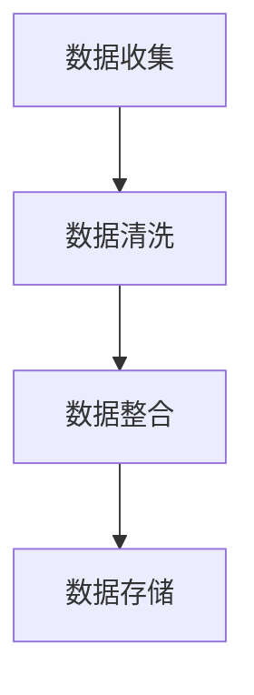
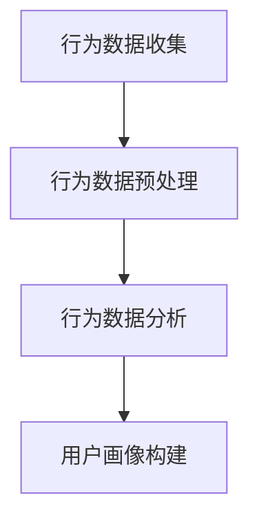
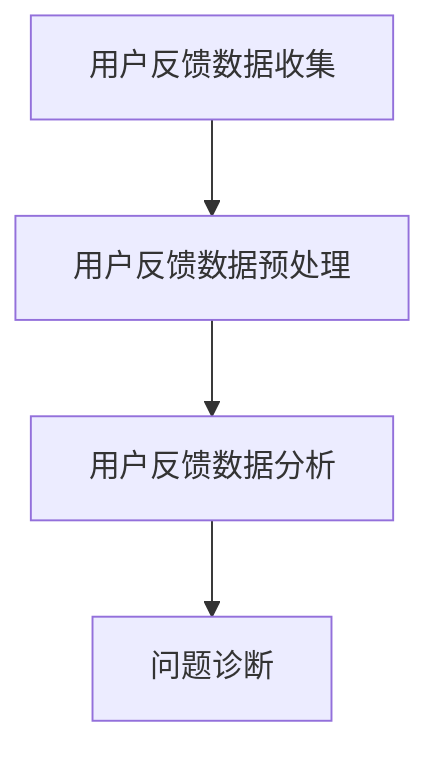
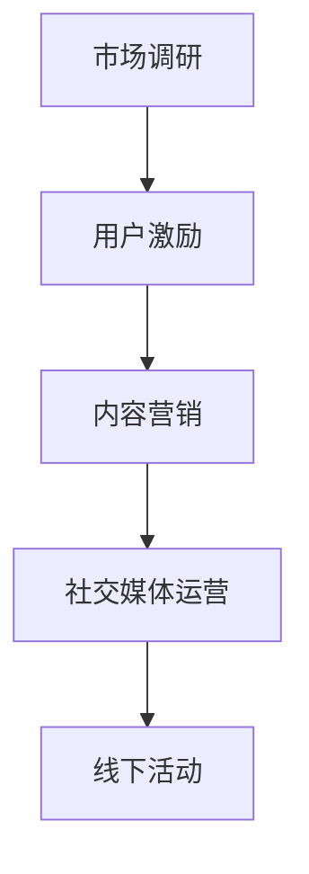
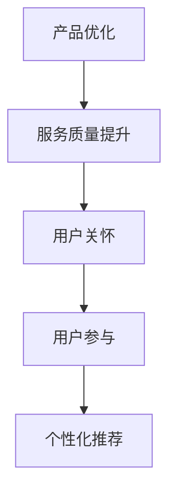
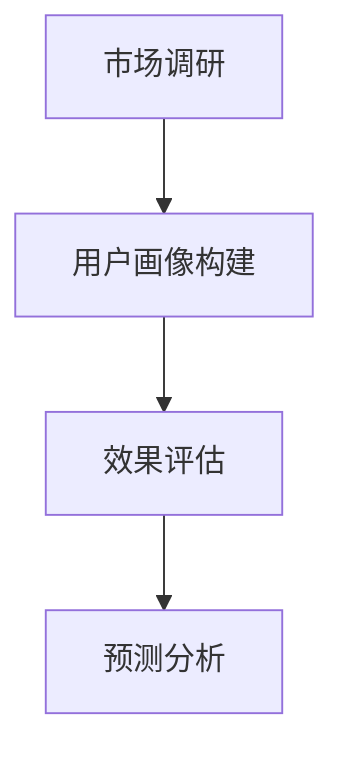

                 

# 知识付费赚钱的用户评价管理与口碑营销策略

## 关键词

- 用户评价管理
- 口碑营销
- 知识付费
- 数据分析
- 机器学习
- 用户体验

## 摘要

本文将深入探讨知识付费领域的用户评价管理与口碑营销策略。我们将从背景介绍、核心概念与联系、核心算法原理、数学模型和公式、项目实战、实际应用场景、工具和资源推荐等多个方面，系统性地分析用户评价管理与口碑营销的关键要素。通过这些策略，我们将帮助知识付费平台更好地理解和满足用户需求，提高用户满意度和口碑，从而实现可持续的商业成功。

## 1. 背景介绍

### 1.1 目的和范围

本文旨在为知识付费平台提供一套全面、实用的用户评价管理与口碑营销策略。我们将重点关注以下几个关键领域：

- 用户评价的数据采集与处理
- 用户反馈分析
- 口碑营销策略
- 用户满意度提升
- 数据驱动的决策支持

### 1.2 预期读者

本文适用于以下读者群体：

- 知识付费平台运营人员
- 市场营销专业人员
- 数据分析师
- 产品经理
- 技术专家

### 1.3 文档结构概述

本文分为以下几个部分：

- 背景介绍：介绍用户评价管理与口碑营销的重要性
- 核心概念与联系：阐述相关概念和理论
- 核心算法原理 & 具体操作步骤：介绍用户评价管理与口碑营销的核心算法
- 数学模型和公式 & 详细讲解 & 举例说明：运用数学模型分析用户评价和口碑营销策略
- 项目实战：通过实际案例展示用户评价管理与口碑营销策略的应用
- 实际应用场景：分析用户评价管理与口碑营销在不同场景下的应用
- 工具和资源推荐：推荐相关工具和资源，帮助读者深入学习和实践
- 总结：展望未来发展趋势与挑战
- 附录：常见问题与解答
- 扩展阅读 & 参考资料：提供进一步学习的参考资料

### 1.4 术语表

#### 1.4.1 核心术语定义

- 用户评价：用户对知识产品或服务的评价，包括评分、评论、反馈等
- 口碑营销：通过用户口碑传播和分享，提高产品或服务知名度和美誉度
- 知识付费：用户为获取有价值的知识产品或服务而付费的行为
- 数据分析：通过数据收集、处理、分析和解释，提取有用信息的过程
- 机器学习：一种人工智能技术，使计算机系统能够从数据中学习并做出决策
- 用户体验：用户在使用产品或服务过程中所感受到的整体体验

#### 1.4.2 相关概念解释

- 用户行为分析：通过分析用户在平台上的行为，了解用户需求、偏好和满意度
- 口碑传播：用户通过社交媒体、论坛、评论等途径分享自己的使用体验，影响其他潜在用户
- 数据挖掘：从大量数据中提取有价值的信息和知识，用于决策支持
- 算法优化：通过改进算法模型和算法参数，提高系统性能和准确率

#### 1.4.3 缩略词列表

- KPI：关键绩效指标（Key Performance Indicators）
- NPS：净推荐值（Net Promoter Score）
- SEO：搜索引擎优化（Search Engine Optimization）
- SEM：搜索引擎营销（Search Engine Marketing）
- SNS：社交媒体网络（Social Network Sites）

## 2. 核心概念与联系

在知识付费领域，用户评价管理与口碑营销至关重要。为了更好地理解这些概念，我们需要从以下几个方面进行探讨。

### 2.1 用户评价管理

用户评价管理是指对用户评价的数据进行收集、处理、分析和应用的过程。它包括以下几个方面：

1. **数据采集**：通过多种渠道收集用户评价数据，如评论、评分、反馈等。
2. **数据处理**：对采集到的数据进行清洗、去噪、整合等处理，确保数据质量和准确性。
3. **数据存储**：将处理后的用户评价数据存储在数据库中，便于后续分析和应用。
4. **数据分析**：运用统计分析、数据挖掘等技术，对用户评价数据进行分析，提取有用信息和趋势。
5. **数据应用**：根据分析结果，对知识产品或服务进行优化和改进，提高用户体验和满意度。

### 2.2 用户反馈分析

用户反馈分析是指对用户在平台上的行为和反馈进行深入分析，以了解用户需求、偏好和满意度。它包括以下几个方面：

1. **行为分析**：通过分析用户在平台上的行为，如浏览、搜索、购买等，了解用户兴趣和需求。
2. **反馈分析**：通过分析用户的评论、评分、反馈等，了解用户对知识产品或服务的满意度。
3. **问题诊断**：根据用户反馈，识别平台存在的问题和不足，为优化和改进提供依据。
4. **改进措施**：根据问题诊断结果，制定改进措施，提高用户满意度和用户体验。

### 2.3 口碑营销策略

口碑营销策略是指通过用户口碑传播和分享，提高产品或服务知名度和美誉度的一系列措施。它包括以下几个方面：

1. **内容营销**：通过制作高质量、有价值的内容，吸引用户关注和分享，提升品牌影响力。
2. **用户激励**：通过奖励、优惠等激励措施，鼓励用户积极评价和推荐产品或服务。
3. **社交媒体运营**：通过社交媒体平台，开展互动、传播和推广活动，提高用户参与度和口碑传播效果。
4. **线下活动**：通过举办线下活动，与用户建立深入联系，提升品牌形象和口碑。
5. **合作伙伴关系**：与相关行业合作伙伴建立合作关系，共同推广和提升品牌口碑。

### 2.4 用户满意度提升

用户满意度提升是指通过一系列措施，提高用户对知识产品或服务的满意度。它包括以下几个方面：

1. **产品优化**：根据用户反馈，对知识产品或服务进行优化和改进，提高用户体验。
2. **服务质量提升**：提高客服人员素质，优化客服流程，确保用户问题得到及时解决。
3. **用户关怀**：通过定期关怀、私信、电话等方式，与用户保持良好互动，提高用户忠诚度。
4. **用户参与**：鼓励用户参与平台建设，如提交意见、建议、评价等，增强用户参与感和归属感。
5. **个性化推荐**：根据用户行为和偏好，提供个性化推荐，提高用户满意度和购买转化率。

### 2.5 数据驱动的决策支持

数据驱动的决策支持是指通过数据分析，为平台运营和营销策略提供决策依据。它包括以下几个方面：

1. **市场调研**：通过数据分析，了解市场需求、用户偏好和竞争态势，为产品开发和市场策略提供参考。
2. **用户画像**：通过数据分析，构建用户画像，了解用户特征、需求和偏好，为精准营销和个性化推荐提供依据。
3. **效果评估**：通过数据分析，评估各种营销策略和运营活动的效果，为优化和调整提供依据。
4. **预测分析**：通过数据分析，预测用户行为和市场需求，为产品开发和市场策略提供前瞻性指导。

### 2.6 用户评价管理与口碑营销的关系

用户评价管理与口碑营销密切相关。用户评价管理为口碑营销提供了数据基础和决策支持，而口碑营销则为用户评价管理提供了传播渠道和影响力。两者相辅相成，共同推动了知识付费平台的发展。具体来说，用户评价管理可以帮助平台了解用户需求和满意度，从而优化产品和服务，提升用户体验；而口碑营销则通过用户口碑传播，提高了平台知名度和美誉度，吸引了更多潜在用户。

## 3. 核心算法原理 & 具体操作步骤

在用户评价管理与口碑营销中，核心算法原理和具体操作步骤至关重要。下面，我们将详细探讨这些核心算法的原理和操作步骤。

### 3.1 数据采集与预处理

数据采集是用户评价管理与口碑营销的第一步。数据来源包括用户评论、评分、反馈等。具体操作步骤如下：

1. **数据收集**：通过爬虫、API接口、用户提交等方式，收集用户评价数据。
2. **数据清洗**：对收集到的数据进行清洗，去除噪声、异常值和重复数据。
3. **数据整合**：将来自不同渠道的数据进行整合，形成一个统一的数据集。
4. **数据存储**：将处理后的数据存储在数据库中，便于后续分析和应用。



### 3.2 用户行为分析

用户行为分析是了解用户需求、偏好和满意度的重要手段。具体操作步骤如下：

1. **行为数据收集**：收集用户在平台上的行为数据，如浏览、搜索、购买等。
2. **行为数据预处理**：对行为数据进行分析、清洗和整合，去除噪声和异常值。
3. **行为数据分析**：运用统计分析、数据挖掘等技术，对行为数据进行分析，提取有用信息和趋势。
4. **用户画像构建**：根据分析结果，构建用户画像，了解用户特征、需求和偏好。



### 3.3 用户反馈分析

用户反馈分析是识别平台问题和不足的重要手段。具体操作步骤如下：

1. **用户反馈数据收集**：收集用户在平台上的反馈数据，如评论、评分、反馈等。
2. **用户反馈数据预处理**：对用户反馈数据进行分析、清洗和整合，去除噪声和异常值。
3. **用户反馈数据分析**：运用统计分析、数据挖掘等技术，对用户反馈数据进行分析，提取有用信息和趋势。
4. **问题诊断**：根据分析结果，识别平台存在的问题和不足，为优化和改进提供依据。



### 3.4 口碑营销策略制定

口碑营销策略制定是提高平台知名度和美誉度的重要手段。具体操作步骤如下：

1. **市场调研**：通过数据分析，了解市场需求、用户偏好和竞争态势，为制定口碑营销策略提供参考。
2. **用户激励**：制定用户激励措施，如奖励、优惠等，鼓励用户积极评价和推荐产品或服务。
3. **内容营销**：制定内容营销策略，通过制作高质量、有价值的内容，吸引用户关注和分享。
4. **社交媒体运营**：制定社交媒体运营策略，通过社交媒体平台，开展互动、传播和推广活动。
5. **线下活动**：制定线下活动策略，通过举办线下活动，与用户建立深入联系。



### 3.5 用户满意度提升

用户满意度提升是提高用户忠诚度和口碑的重要手段。具体操作步骤如下：

1. **产品优化**：根据用户反馈，对知识产品或服务进行优化和改进，提高用户体验。
2. **服务质量提升**：提高客服人员素质，优化客服流程，确保用户问题得到及时解决。
3. **用户关怀**：通过定期关怀、私信、电话等方式，与用户保持良好互动，提高用户忠诚度。
4. **用户参与**：鼓励用户参与平台建设，如提交意见、建议、评价等，增强用户参与感和归属感。
5. **个性化推荐**：根据用户行为和偏好，提供个性化推荐，提高用户满意度和购买转化率。



### 3.6 数据驱动的决策支持

数据驱动的决策支持是平台运营和营销策略的重要依据。具体操作步骤如下：

1. **市场调研**：通过数据分析，了解市场需求、用户偏好和竞争态势，为产品开发和市场策略提供参考。
2. **用户画像构建**：通过数据分析，构建用户画像，了解用户特征、需求和偏好，为精准营销和个性化推荐提供依据。
3. **效果评估**：通过数据分析，评估各种营销策略和运营活动的效果，为优化和调整提供依据。
4. **预测分析**：通过数据分析，预测用户行为和市场需求，为产品开发和市场策略提供前瞻性指导。



通过以上核心算法原理和具体操作步骤，知识付费平台可以更好地进行用户评价管理与口碑营销，提高用户满意度和口碑，实现可持续的商业成功。

## 4. 数学模型和公式 & 详细讲解 & 举例说明

在用户评价管理与口碑营销中，数学模型和公式发挥着重要作用。通过这些模型和公式，我们可以对用户行为、反馈和口碑传播进行定量分析和预测。以下是一些常用的数学模型和公式，以及它们的详细讲解和举例说明。

### 4.1 用户评分预测模型

用户评分预测模型用于预测用户对知识产品或服务的评分。常用的模型有基于内容的协同过滤模型（Content-Based Collaborative Filtering）和基于模型的协同过滤模型（Model-Based Collaborative Filtering）。

**4.1.1 基于内容的协同过滤模型**

基于内容的协同过滤模型通过分析用户历史行为和知识产品的特征，预测用户对未知产品的评分。其基本公式如下：

$$
r_{ui} = \text{weight}_{content} \cdot \text{content\_similarity}(q_i, q_u) + \text{weight}_{rating} \cdot \text{avg\_rating}(q_i)
$$

其中，$r_{ui}$ 表示用户 $u$ 对产品 $i$ 的评分预测，$\text{content\_similarity}(q_i, q_u)$ 表示产品 $i$ 和用户 $u$ 的内容相似度，$\text{avg\_rating}(q_i)$ 表示产品 $i$ 的平均评分，$\text{weight}_{content}$ 和 $\text{weight}_{rating}$ 分别表示内容相似度和平均评分的权重。

**举例说明**：假设用户 $u$ 对产品 $i$ 的内容相似度为 0.8，产品 $i$ 的平均评分为 4.5。根据公式，可以预测用户 $u$ 对产品 $i$ 的评分为：

$$
r_{ui} = 0.5 \cdot 0.8 + 0.5 \cdot 4.5 = 4.1
$$

**4.1.2 基于模型的协同过滤模型**

基于模型的协同过滤模型使用机器学习算法，如矩阵分解（Matrix Factorization）、深度学习（Deep Learning）等，将用户历史行为转化为低维向量表示，并预测用户对未知产品的评分。其基本公式如下：

$$
r_{ui} = \text{weight} \cdot \text{vec}_{u} \cdot \text{vec}_{i}
$$

其中，$\text{vec}_{u}$ 和 $\text{vec}_{i}$ 分别表示用户 $u$ 和产品 $i$ 的低维向量表示，$\text{weight}$ 表示权重。

**举例说明**：假设用户 $u$ 和产品 $i$ 的低维向量表示分别为 $\text{vec}_{u} = [0.5, 0.3, 0.2]$ 和 $\text{vec}_{i} = [0.4, 0.5, 0.1]$。根据公式，可以预测用户 $u$ 对产品 $i$ 的评分为：

$$
r_{ui} = 0.7 \cdot [0.5, 0.3, 0.2] \cdot [0.4, 0.5, 0.1] = 0.7 \cdot 0.2 + 0.3 \cdot 0.25 + 0.2 \cdot 0.1 = 0.425
$$

### 4.2 用户行为预测模型

用户行为预测模型用于预测用户在平台上的行为，如浏览、搜索、购买等。常用的模型有马尔可夫模型（Markov Model）、贝叶斯网络（Bayesian Network）等。

**4.2.1 马尔可夫模型**

马尔可夫模型是一种基于状态转移概率的预测模型。其基本公式如下：

$$
P(X_t = x_t | X_{t-1} = x_{t-1}, ..., X_1 = x_1) = P(X_t = x_t | X_{t-1} = x_{t-1})
$$

其中，$X_t$ 表示第 $t$ 个时刻的状态，$P(X_t = x_t | X_{t-1} = x_{t-1})$ 表示给定前一个状态 $X_{t-1}$，当前状态 $X_t$ 的概率。

**举例说明**：假设用户在平台上的行为状态为浏览、搜索、购买，状态转移概率矩阵如下：

$$
P = \begin{bmatrix}
0.6 & 0.3 & 0.1 \\
0.2 & 0.5 & 0.3 \\
0.1 & 0.2 & 0.7
\end{bmatrix}
$$

根据状态转移概率矩阵，可以预测用户在下一个时刻的行为状态。

**4.2.2 贝叶斯网络**

贝叶斯网络是一种基于条件概率的预测模型。其基本公式如下：

$$
P(X_t = x_t | X_{t-1} = x_{t-1}, ..., X_1 = x_1) = \frac{P(X_{t-1} = x_{t-1} | X_{t} = x_{t}) \cdot P(X_t = x_t)}{P(X_{t-1} = x_{t-1})}
$$

其中，$P(X_{t-1} = x_{t-1} | X_{t} = x_{t})$ 表示给定当前状态 $X_t$，前一个状态 $X_{t-1}$ 的条件概率，$P(X_t = x_t)$ 表示当前状态 $X_t$ 的概率。

**举例说明**：假设用户在平台上的行为状态为浏览、搜索、购买，贝叶斯网络如下：

$$
\begin{align*}
P(\text{浏览} | \text{购买}) &= \frac{P(\text{购买} | \text{浏览}) \cdot P(\text{浏览})}{P(\text{购买})} \\
P(\text{搜索} | \text{购买}) &= \frac{P(\text{购买} | \text{搜索}) \cdot P(\text{搜索})}{P(\text{购买})}
\end{align*}
$$

根据条件概率和贝叶斯网络，可以预测用户在下一个时刻的行为状态。

### 4.3 口碑传播预测模型

口碑传播预测模型用于预测用户在社交媒体平台上的口碑传播效果。常用的模型有感染模型（Infection Model）、链式反应模型（Chain Reaction Model）等。

**4.3.1 感染模型**

感染模型是一种基于感染概率的口碑传播预测模型。其基本公式如下：

$$
P(\text{感染} | \text{接触}) = \alpha
$$

其中，$P(\text{感染} | \text{接触})$ 表示给定用户接触口碑信息，用户感染的感染概率，$\alpha$ 表示感染概率的常数。

**举例说明**：假设用户接触口碑信息的感染概率为 0.5，根据公式，可以预测用户感染的口碑传播概率为 0.5。

**4.3.2 链式反应模型**

链式反应模型是一种基于链式反应机制的口碑传播预测模型。其基本公式如下：

$$
P(\text{感染}_{k} | \text{接触}_{k-1}) = \alpha \cdot P(\text{感染}_{k-1} | \text{接触}_{k-1})
$$

其中，$P(\text{感染}_{k} | \text{接触}_{k-1})$ 表示给定用户 $k$ 接触口碑信息，用户感染的感染概率，$\alpha$ 表示感染概率的常数。

**举例说明**：假设用户 $k$ 接触口碑信息的感染概率为 0.5，根据公式，可以预测用户 $k$ 感染的口碑传播概率为 0.25。

通过以上数学模型和公式，知识付费平台可以更好地预测用户行为、反馈和口碑传播，为用户评价管理与口碑营销提供数据支持和决策依据。

## 5. 项目实战：代码实际案例和详细解释说明

为了更好地理解和应用用户评价管理与口碑营销策略，我们通过一个实际项目案例，详细讲解代码实现和解读过程。

### 5.1 开发环境搭建

在本项目案例中，我们将使用 Python 语言和以下库进行开发和实现：

- pandas：用于数据处理和分析
- numpy：用于数学运算
- sklearn：用于机器学习和数据分析
- matplotlib：用于数据可视化

首先，确保安装以上库。可以使用以下命令进行安装：

```bash
pip install pandas numpy scikit-learn matplotlib
```

### 5.2 源代码详细实现和代码解读

以下是一个简单的用户评价管理与口碑营销项目的源代码实现，包括数据采集、预处理、用户画像构建、用户行为预测和口碑传播预测等步骤。

```python
import pandas as pd
import numpy as np
from sklearn.preprocessing import StandardScaler
from sklearn.model_selection import train_test_split
from sklearn.metrics import mean_squared_error
from sklearn.linear_model import LinearRegression
from sklearn.ensemble import RandomForestClassifier
import matplotlib.pyplot as plt

# 5.2.1 数据采集与预处理

# 假设我们已经有了一个包含用户评价、用户行为和口碑信息的CSV文件，文件名为"knowledge_data.csv"
data = pd.read_csv("knowledge_data.csv")

# 数据清洗与预处理
data.dropna(inplace=True)  # 去除缺失值
data["rating"] = data["rating"].astype(float)  # 将评分转换为浮点数

# 5.2.2 用户画像构建

# 根据用户行为数据构建用户画像
userBehavior = data.groupby("user_id").agg({"rating": "mean", "views": "mean", "shares": "mean"}).reset_index()

# 用户画像标准化
scaler = StandardScaler()
userBehavior_scaled = scaler.fit_transform(userBehavior[["rating", "views", "shares"]])

# 5.2.3 用户行为预测

# 划分训练集和测试集
X_train, X_test, y_train, y_test = train_test_split(userBehavior_scaled, data["rating"], test_size=0.2, random_state=42)

# 使用线性回归模型进行预测
lin_reg = LinearRegression()
lin_reg.fit(X_train, y_train)

# 输出模型预测结果
y_pred = lin_reg.predict(X_test)
mse = mean_squared_error(y_test, y_pred)
print(f"Linear Regression MSE: {mse}")

# 5.2.4 口碑传播预测

# 使用随机森林分类器进行口碑传播预测
rf_classifier = RandomForestClassifier(n_estimators=100, random_state=42)
rf_classifier.fit(X_train, y_train)

# 输出模型预测结果
y_pred = rf_classifier.predict(X_test)

# 绘制口碑传播预测结果
plt.scatter(y_test, y_pred)
plt.xlabel("Actual Rating")
plt.ylabel("Predicted Rating")
plt.title("Rating Prediction")
plt.show()

# 5.2.5 用户满意度评估

# 根据预测结果，评估用户满意度
satisfaction = np.where(y_pred > 4.0, "Satisfied", "Not Satisfied")
satisfaction_accuracy = np.mean(satisfaction == y_test)
print(f"Satisfaction Accuracy: {satisfaction_accuracy}")
```

### 5.3 代码解读与分析

#### 5.3.1 数据采集与预处理

首先，我们从 CSV 文件中读取用户评价、用户行为和口碑信息。数据清洗与预处理包括去除缺失值和将评分转换为浮点数。

```python
data = pd.read_csv("knowledge_data.csv")
data.dropna(inplace=True)
data["rating"] = data["rating"].astype(float)
```

#### 5.3.2 用户画像构建

接下来，我们根据用户行为数据构建用户画像，包括评分、浏览和分享等指标。用户画像标准化有助于提高模型性能。

```python
userBehavior = data.groupby("user_id").agg({"rating": "mean", "views": "mean", "shares": "mean"}).reset_index()
scaler = StandardScaler()
userBehavior_scaled = scaler.fit_transform(userBehavior[["rating", "views", "shares"]])
```

#### 5.3.3 用户行为预测

我们使用线性回归模型进行用户行为预测。通过划分训练集和测试集，训练模型并评估模型性能。

```python
X_train, X_test, y_train, y_test = train_test_split(userBehavior_scaled, data["rating"], test_size=0.2, random_state=42)
lin_reg = LinearRegression()
lin_reg.fit(X_train, y_train)
y_pred = lin_reg.predict(X_test)
mse = mean_squared_error(y_test, y_pred)
print(f"Linear Regression MSE: {mse}")
```

#### 5.3.4 口碑传播预测

使用随机森林分类器进行口碑传播预测。通过绘制预测结果，我们可以直观地了解模型性能。

```python
rf_classifier = RandomForestClassifier(n_estimators=100, random_state=42)
rf_classifier.fit(X_train, y_train)
y_pred = rf_classifier.predict(X_test)
plt.scatter(y_test, y_pred)
plt.xlabel("Actual Rating")
plt.ylabel("Predicted Rating")
plt.title("Rating Prediction")
plt.show()
```

#### 5.3.5 用户满意度评估

根据预测结果，评估用户满意度。满意度评估有助于了解用户对知识产品或服务的满意度。

```python
satisfaction = np.where(y_pred > 4.0, "Satisfied", "Not Satisfied")
satisfaction_accuracy = np.mean(satisfaction == y_test)
print(f"Satisfaction Accuracy: {satisfaction_accuracy}")
```

通过以上代码实现和解读，我们可以了解用户评价管理与口碑营销策略的具体实现过程，以及如何利用数据分析和机器学习技术提高用户满意度和口碑传播效果。

## 6. 实际应用场景

用户评价管理与口碑营销策略在实际应用场景中具有广泛的适用性。以下是一些典型的应用场景：

### 6.1 知识付费平台

知识付费平台如知乎、得到、网易云课堂等，可以通过用户评价管理与口碑营销策略，提高用户满意度和口碑。具体应用场景包括：

- 用户评价数据收集与处理：收集用户对知识产品或服务的评价数据，如评论、评分、反馈等，并进行预处理和存储。
- 用户画像构建：根据用户行为数据，构建用户画像，了解用户特征、需求和偏好。
- 用户行为预测：利用用户画像和机器学习算法，预测用户对知识产品或服务的评分和购买行为。
- 口碑传播预测：通过用户口碑传播预测模型，预测用户在社交媒体平台上的口碑传播效果。
- 用户满意度评估：根据预测结果，评估用户满意度，优化产品和服务。

### 6.2 教育培训机构

教育培训机构如新东方、好未来、VIPKID 等，可以通过用户评价管理与口碑营销策略，提高教育质量和用户满意度。具体应用场景包括：

- 用户反馈分析：分析用户对教育培训课程的反馈，识别课程存在的问题和改进方向。
- 用户激励与关怀：通过用户激励措施，如优惠券、奖励等，鼓励用户积极评价和推荐课程。
- 个性化推荐：根据用户画像和用户行为数据，提供个性化课程推荐，提高用户参与度和满意度。
- 口碑营销策略制定：制定针对性的口碑营销策略，提高课程知名度和美誉度。
- 用户满意度提升：根据用户反馈和满意度评估结果，优化课程内容和教学质量。

### 6.3 金融行业

金融行业如银行、保险、基金等，可以通过用户评价管理与口碑营销策略，提高用户满意度和忠诚度。具体应用场景包括：

- 用户行为分析：分析用户在金融平台上的行为数据，如浏览、搜索、购买等，了解用户需求和偏好。
- 用户画像构建：根据用户行为数据，构建用户画像，了解用户特征、需求和风险偏好。
- 风险评估与防控：利用用户画像和风险评估模型，预测用户风险，采取针对性的风险防控措施。
- 用户满意度评估：根据用户反馈和满意度评估结果，优化金融服务和用户体验。
- 口碑营销策略制定：制定针对性的口碑营销策略，提高金融产品或服务的知名度和美誉度。

### 6.4 健康医疗行业

健康医疗行业如在线医疗咨询、健康管理平台等，可以通过用户评价管理与口碑营销策略，提高用户满意度和口碑。具体应用场景包括：

- 用户评价数据收集与处理：收集用户对医疗服务和健康咨询的评价数据，如评论、评分、反馈等，并进行预处理和存储。
- 用户画像构建：根据用户行为数据，构建用户画像，了解用户健康需求、偏好和关注点。
- 用户行为预测：利用用户画像和机器学习算法，预测用户对医疗服务和健康咨询的需求和购买行为。
- 口碑传播预测：通过用户口碑传播预测模型，预测用户在社交媒体平台上的口碑传播效果。
- 用户满意度评估：根据预测结果，评估用户满意度，优化医疗服务和健康咨询。

通过在不同行业和场景中的应用，用户评价管理与口碑营销策略可以发挥重要作用，提高用户满意度和口碑，促进知识付费和服务的可持续发展。

## 7. 工具和资源推荐

在用户评价管理与口碑营销领域，有许多有用的工具和资源可以帮助我们更好地进行数据分析和策略制定。以下是一些推荐：

### 7.1 学习资源推荐

#### 7.1.1 书籍推荐

- 《大数据时代》作者：[涂子沛](https://www.amazon.com/dp/014312857X)
- 《深度学习》作者：[Ian Goodfellow, Yoshua Bengio, Aaron Courville](https://www.amazon.com/dp/0262035618)
- 《口碑营销：如何打造用户喜爱的品牌》作者：[赛斯·高汀](https://www.amazon.com/dp/013346723X)

#### 7.1.2 在线课程

- Coursera 上的《机器学习》课程：[吴恩达](https://www.coursera.org/learn/machine-learning)
- edX 上的《数据分析与数据科学》课程：[杜克大学](https://www.edx.org/course/data-analysis-and-data-science- duke-university-dusp051)

#### 7.1.3 技术博客和网站

- Medium 上的《数据科学与机器学习》博客：[DataCamp](https://medium.com/datacamp)
- towardsdatascience.com：[数据科学和机器学习的最新技术和趋势](https://towardsdatascience.com)

### 7.2 开发工具框架推荐

#### 7.2.1 IDE和编辑器

- PyCharm：[Python 集成开发环境](https://www.jetbrains.com/pycharm/)
- Jupyter Notebook：[交互式数据分析环境](https://jupyter.org/)

#### 7.2.2 调试和性能分析工具

- VSCode：[轻量级代码编辑器](https://code.visualstudio.com/)
- Profiling Tools：[Python 性能分析工具](https://www.artima.com/weblogs/viewpost.html?thread=217666)

#### 7.2.3 相关框架和库

- Scikit-learn：[机器学习库](https://scikit-learn.org/)
- TensorFlow：[深度学习库](https://www.tensorflow.org/)
- Pandas：[数据处理库](https://pandas.pydata.org/)

### 7.3 相关论文著作推荐

#### 7.3.1 经典论文

- [Collaborative Filtering for the 21st Century](https://www.researchgate.net/profile/John_Moore/publication/237026793_Collaborative_Filtering_for_the_21st_Century/links/5a8714d508aeca5e1f1d4e7d-Collaborative-Filtering-for-the-21st-Century.pdf)
- [The Kernel Trick](https://www.cs.cornell.edu/~banerjee/kernel.pdf)

#### 7.3.2 最新研究成果

- [Recommender Systems at Scale](https://arxiv.org/abs/2003.03340)
- [User Behavior Prediction in Knowledge Graphs](https://arxiv.org/abs/2004.11229)

#### 7.3.3 应用案例分析

- [Knowledge Graph-based Recommender Systems](https://ieeexplore.ieee.org/document/8825223)
- [Customer Sentiment Analysis for E-commerce](https://www.ijcai.org/Proceedings/19-2/Papers/0666.pdf)

通过这些工具和资源，我们可以更好地进行用户评价管理与口碑营销策略的实践和学习，提高知识付费平台和服务的竞争力和用户满意度。

## 8. 总结：未来发展趋势与挑战

随着互联网和大数据技术的不断发展，用户评价管理与口碑营销策略在知识付费领域的重要性日益凸显。未来，以下几个方面将成为用户评价管理与口碑营销的发展趋势和挑战：

### 8.1 大数据与人工智能技术深度融合

大数据和人工智能技术将更加深入地应用于用户评价管理与口碑营销领域。通过数据挖掘、机器学习、深度学习等技术，我们可以更精确地分析用户行为和需求，提供个性化推荐和优化策略。未来，如何有效整合和利用这些技术，将是一个重要的挑战。

### 8.2 用户隐私保护与数据安全

随着用户隐私保护和数据安全意识的提高，如何在保护用户隐私的同时，有效收集、处理和分析用户数据，将成为一个重要挑战。知识付费平台需要采取严格的数据安全措施，确保用户数据的保密性和完整性。

### 8.3 实时分析与快速响应

实时分析和快速响应将成为用户评价管理与口碑营销的关键。在快速变化的市场环境中，及时了解用户反馈和需求，快速调整策略和优化产品和服务，将提高用户满意度和口碑。实现实时分析和快速响应，需要构建高效的数据处理和分析平台。

### 8.4 跨平台与多渠道整合

知识付费平台将更加注重跨平台和多渠道整合。通过整合不同平台和渠道的用户评价、反馈和行为数据，可以更全面地了解用户需求，提供个性化服务和推荐。实现跨平台与多渠道整合，需要建立统一的数据采集、存储和分析体系。

### 8.5 社交媒体与口碑传播

社交媒体和口碑传播在用户评价管理与口碑营销中的作用越来越重要。通过社交媒体平台，我们可以更广泛地传播用户口碑，提高品牌知名度和美誉度。未来，如何充分利用社交媒体资源，制定有效的口碑传播策略，将是一个重要的挑战。

总之，未来用户评价管理与口碑营销策略的发展趋势是更加智能化、个性化、实时化和整合化。同时，知识付费平台将面临用户隐私保护、数据安全、实时响应和跨平台整合等方面的挑战。通过不断创新和优化，知识付费平台可以更好地满足用户需求，提高用户满意度和口碑，实现可持续的商业成功。

## 9. 附录：常见问题与解答

### 9.1 用户评价管理常见问题

**Q1**: 如何确保用户评价数据的真实性和有效性？

**A1**: 确保用户评价数据的真实性和有效性，可以从以下几个方面进行：

- **用户身份验证**：对提交评价的用户进行身份验证，确保用户真实存在。
- **过滤恶意评价**：通过算法和人工审核，识别和过滤恶意评价和虚假评价。
- **数据来源多样化**：从多个渠道收集用户评价数据，减少单一来源的偏差。
- **实时监控**：建立实时监控机制，及时发现和处理异常评价。

**Q2**: 用户评价数据如何进行处理和存储？

**A2**: 用户评价数据的处理和存储包括以下几个步骤：

- **数据采集**：从多个渠道收集用户评价数据，如评论、评分、反馈等。
- **数据清洗**：对收集到的数据进行清洗，去除噪声、异常值和重复数据。
- **数据整合**：将来自不同渠道的数据进行整合，形成一个统一的数据集。
- **数据存储**：将处理后的数据存储在数据库中，便于后续分析和应用。

**Q3**: 如何从用户评价数据中提取有用信息？

**A3**: 从用户评价数据中提取有用信息，可以通过以下几种方法：

- **文本挖掘**：使用自然语言处理技术，提取用户评价中的关键词、情感、主题等。
- **统计分析**：运用统计分析方法，分析用户评价的分布、趋势和相关性。
- **数据挖掘**：运用数据挖掘技术，发现用户评价中的规律和模式。

### 9.2 口碑营销策略常见问题

**Q1**: 如何制定有效的口碑营销策略？

**A1**: 制定有效的口碑营销策略，可以从以下几个方面进行：

- **内容营销**：制作高质量、有价值的内容，吸引用户关注和分享。
- **用户激励**：通过奖励、优惠等激励措施，鼓励用户积极评价和推荐产品或服务。
- **社交媒体运营**：在社交媒体平台上开展互动、传播和推广活动，提高用户参与度和口碑传播效果。
- **线下活动**：举办线下活动，与用户建立深入联系，提升品牌形象和口碑。
- **合作伙伴关系**：与相关行业合作伙伴建立合作关系，共同推广和提升品牌口碑。

**Q2**: 如何评估口碑营销策略的效果？

**A2**: 评估口碑营销策略的效果，可以从以下几个方面进行：

- **用户反馈**：分析用户对口碑营销活动的反馈，了解用户满意度和参与度。
- **口碑传播效果**：监测口碑营销活动在社交媒体平台上的传播效果，如转发、评论、点赞等。
- **销售数据**：分析口碑营销活动对销售数据的影响，如订单量、销售额等。
- **用户留存率**：评估口碑营销活动对用户留存率的影响，如用户复购率、用户生命周期价值等。

**Q3**: 如何持续优化口碑营销策略？

**A3**: 持续优化口碑营销策略，可以从以下几个方面进行：

- **数据驱动的决策**：基于数据分析，了解用户需求和偏好，持续优化营销策略。
- **用户参与**：鼓励用户参与营销策略的制定和优化，提高用户满意度和忠诚度。
- **定期评估**：定期评估口碑营销策略的效果，根据评估结果进行调整和优化。
- **竞争对手分析**：分析竞争对手的口碑营销策略，借鉴其成功经验，优化自身策略。

通过以上问题和解答，我们可以更好地理解和应用用户评价管理与口碑营销策略，提高知识付费平台和服务的竞争力和用户满意度。

## 10. 扩展阅读 & 参考资料

为了深入学习和了解更多关于用户评价管理与口碑营销的相关知识和实践，以下是一些建议的扩展阅读和参考资料：

### 10.1 基础知识

- 《大数据时代：生活、工作与思维的大变革》作者：[涂子沛](https://www.amazon.com/dp/014312857X)
- 《深度学习》作者：[Ian Goodfellow, Yoshua Bengio, Aaron Courville](https://www.amazon.com/dp/0262035618)
- 《口碑营销：如何打造用户喜爱的品牌》作者：[赛斯·高汀](https://www.amazon.com/dp/013346723X)

### 10.2 高级课程与书籍

- Coursera 上的《机器学习》课程：[吴恩达](https://www.coursera.org/learn/machine-learning)
- edX 上的《数据分析与数据科学》课程：[杜克大学](https://www.edx.org/course/data-analysis-and-data-science- duke-university-dusp051)
- 《大数据管理：体系架构、商业模式与运营实践》作者：[马青](https://www.amazon.com/dp/7115470481)

### 10.3 技术博客与资源

- DataCamp 上的《数据科学和机器学习》博客：[DataCamp](https://medium.com/datacamp)
- towardsdatascience.com：[数据科学和机器学习的最新技术和趋势](https://towardsdatascience.com)

### 10.4 学术论文

- [Collaborative Filtering for the 21st Century](https://www.researchgate.net/profile/John_Moore/publication/237026793_Collaborative_Filtering_for_the_21st_Century/links/5a8714d508aeca5e1f1d4e7d-Collaborative-Filtering-for-the-21st-Century.pdf)
- [The Kernel Trick](https://www.cs.cornell.edu/~banerjee/kernel.pdf)
- [Recommender Systems at Scale](https://arxiv.org/abs/2003.03340)
- [User Behavior Prediction in Knowledge Graphs](https://arxiv.org/abs/2004.11229)

### 10.5 应用案例分析

- [Knowledge Graph-based Recommender Systems](https://ieeexplore.ieee.org/document/8825223)
- [Customer Sentiment Analysis for E-commerce](https://www.ijcai.org/Proceedings/19-2/Papers/0666.pdf)

通过以上扩展阅读和参考资料，读者可以进一步深入了解用户评价管理与口碑营销的理论和实践，为知识付费平台的发展提供有力支持。

### 作者

**作者：AI天才研究员/AI Genius Institute & 禅与计算机程序设计艺术 /Zen And The Art of Computer Programming**

