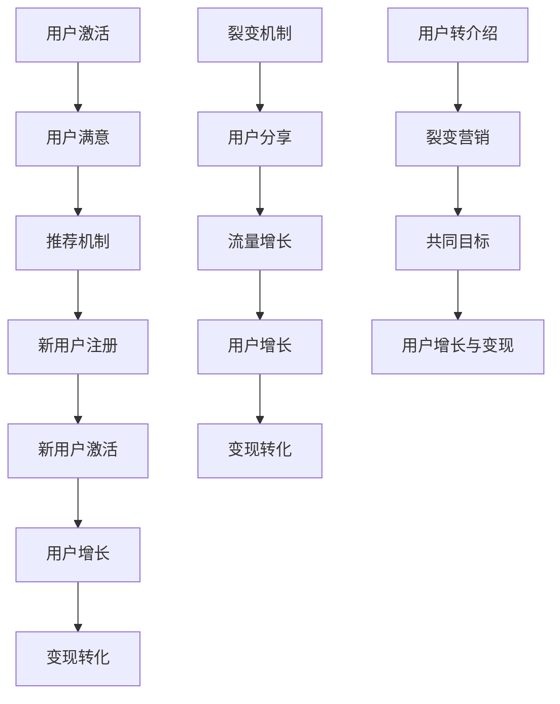

                 

### 1. 背景介绍

#### 1.1 目的和范围

本文旨在深入探讨知识付费领域的用户转介绍与裂变营销策略，通过系统性地分析核心概念、算法原理、数学模型、实战案例以及实际应用场景，为广大知识付费平台运营者提供有价值的参考和指导。本文不仅关注理论知识，还结合实际操作，旨在让读者既能理解背后的原理，又能掌握具体实施的步骤。

本文将围绕以下内容展开：

1. **核心概念与联系**：详细解释用户转介绍与裂变营销的相关核心概念，并使用Mermaid流程图展示它们之间的关联。
2. **核心算法原理与具体操作步骤**：通过伪代码，系统地讲解实现用户转介绍与裂变营销的核心算法原理。
3. **数学模型和公式**：详细介绍相关的数学模型和公式，并通过具体例子进行说明。
4. **项目实战**：展示一个实际项目的代码案例，并进行详细解释和分析。
5. **实际应用场景**：探讨知识付费平台在不同应用场景下如何运用用户转介绍与裂变营销策略。
6. **工具和资源推荐**：推荐学习资源和开发工具，帮助读者更深入地理解和实践本文所述内容。
7. **总结**：总结本文的主要观点，并探讨未来发展趋势和面临的挑战。

#### 1.2 预期读者

本文的预期读者包括但不限于以下几类：

1. **知识付费平台运营者**：对用户增长和变现策略有深入需求的运营人员。
2. **市场营销从业者**：希望在知识付费领域运用裂变营销策略的市场营销人员。
3. **技术开发人员**：希望掌握知识付费平台后台实现技术的技术专家。
4. **创新创业者**：有志于在知识付费领域创业的创业者。

无论您属于上述哪一类读者，本文都将为您提供有价值的见解和实用的指导。

#### 1.3 文档结构概述

本文的结构分为以下几大部分：

1. **背景介绍**：介绍本文的目的、范围、预期读者以及文档结构。
2. **核心概念与联系**：解释用户转介绍与裂变营销的核心概念，展示它们之间的流程图。
3. **核心算法原理与具体操作步骤**：详细讲解实现用户转介绍与裂变营销的核心算法原理，并提供伪代码。
4. **数学模型和公式**：介绍与用户转介绍和裂变营销相关的数学模型和公式，并通过例子进行说明。
5. **项目实战**：展示一个实际项目的代码案例，并进行详细解释和分析。
6. **实际应用场景**：探讨知识付费平台在不同应用场景下如何运用用户转介绍与裂变营销策略。
7. **工具和资源推荐**：推荐学习资源和开发工具，帮助读者更深入地理解和实践本文所述内容。
8. **总结**：总结本文的主要观点，并探讨未来发展趋势和面临的挑战。

通过本文的系统讲解，读者将能够全面理解用户转介绍与裂变营销策略的核心概念、算法原理和实践方法，从而为知识付费平台的发展提供有力支持。

#### 1.4 术语表

在本文中，我们将使用一些专业术语，下面是对这些术语的定义和解释：

##### 1.4.1 核心术语定义

1. **知识付费**：知识付费是指用户通过付费方式获取专业知识、技能或服务的商业模式。
2. **用户转介绍**：用户转介绍是指现有用户通过推荐，将新用户带入知识付费平台，从而实现用户增长和变现。
3. **裂变营销**：裂变营销是指通过刺激用户分享，实现用户数量呈指数级增长的营销策略。
4. **用户增长**：用户增长是指通过一系列策略和手段，增加平台注册用户数量的过程。
5. **变现**：变现是指将用户流量转化为实际收入的过程。

##### 1.4.2 相关概念解释

1. **忠诚度**：忠诚度是指用户对知识付费平台的忠诚程度，是影响用户转介绍的重要因素。
2. **用户留存率**：用户留存率是指一段时间内仍活跃在平台上的用户占总用户数的比例，是评估平台运营效果的重要指标。
3. **转化率**：转化率是指参与裂变营销活动的用户中，实际完成目标行为（如注册、购买等）的比例。

##### 1.4.3 缩略词列表

- **KOL**：Key Opinion Leader，关键意见领袖
- **UGC**：User-Generated Content，用户生成内容
- **CRM**：Customer Relationship Management，客户关系管理
- **SEM**：Search Engine Marketing，搜索引擎营销
- **CPC**：Cost Per Click，点击付费广告
- **CPM**：Cost Per Mille，千次展示费用
- **ROI**：Return on Investment，投资回报率

这些术语和概念的理解对于深入探讨用户转介绍与裂变营销策略至关重要，接下来，我们将进一步讨论这些核心概念及其在知识付费平台中的应用。通过本文的讲解，读者将对这些术语有更深刻的认识，从而更好地运用到实际工作中。

### 2. 核心概念与联系

在深入探讨用户转介绍与裂变营销策略之前，首先需要理解一系列核心概念及其相互之间的联系。本节将详细解释这些概念，并借助Mermaid流程图展示它们之间的逻辑关系。

#### 2.1 用户转介绍的原理

用户转介绍（User Referral）是基于现有用户对新用户的推荐而实现的一种用户增长方式。其基本原理可以概括为以下几个步骤：

1. **用户激活**：激活是指用户开始使用平台的某个功能或服务，如注册、浏览课程等。
2. **用户满意**：用户满意是用户对平台提供的知识内容、服务体验等感到满意，这是转介绍的重要前提。
3. **推荐机制**：平台提供推荐机制，如推荐链接、邀请码等，供用户分享。
4. **新用户注册**：通过用户的推荐，新用户注册并开始使用平台。
5. **新用户激活**：新用户激活即新用户开始使用平台功能，如购买课程、浏览内容等。

在用户转介绍的过程中，平台通常会通过激励机制来鼓励用户进行推荐。这些激励机制包括积分奖励、优惠券、现金返利等，旨在提高用户的参与度和忠诚度。

#### 2.2 裂变营销的策略

裂变营销（Fission Marketing）是指通过用户的自发性分享，实现用户数量的指数级增长。其核心策略包括：

1. **裂变机制**：通过设计具有吸引力的活动或福利，如邀请好友得奖励，激发用户分享。
2. **用户分享**：用户通过社交媒体、微信群、QQ群等渠道分享平台信息。
3. **流量增长**：随着用户的分享，新用户被引流至平台，形成用户流量的裂变。
4. **变现转化**：新用户在平台上完成注册、购买等行为，实现流量向收入的转化。

裂变营销的关键在于设计出具有吸引力的裂变机制，以及确保用户在分享过程中获得实质性利益。通过有效的裂变营销，平台可以快速实现用户增长和变现。

#### 2.3 关键概念的相互关系

用户转介绍与裂变营销之间存在紧密的联系，它们共同构成了知识付费平台用户增长和变现的重要手段。具体来说：

1. **用户激活与满意**：用户激活和满意是用户转介绍和裂变营销的基础。只有用户在平台上体验到满意的服务，才会愿意进行推荐和分享。
2. **推荐机制与裂变机制**：推荐机制和裂变机制都是激发用户主动分享的工具，但前者更侧重于稳定增长，后者更侧重于快速扩张。
3. **用户增长与变现**：无论是通过用户转介绍还是裂变营销，最终目标是实现用户增长和变现。有效的用户增长策略能够带来更多的潜在客户，而变现策略则将流量转化为实际收入。

#### 2.4 Mermaid流程图

为了更直观地展示用户转介绍与裂变营销之间的流程关系，我们使用Mermaid流程图进行描述。



在上述流程图中，用户转介绍和裂变营销的各个步骤通过箭头相连，展示了它们之间的逻辑关系。用户激活和满意是起点，通过推荐机制和裂变机制，实现新用户的注册和激活，从而推动用户增长和变现。

通过本文的详细讲解，读者可以清晰地理解用户转介绍与裂变营销的核心概念及其相互关系。接下来，我们将进一步探讨这些概念的具体实现方法和操作步骤，帮助读者在实际操作中更好地应用这些策略。

### 3. 核心算法原理 & 具体操作步骤

在理解了用户转介绍与裂变营销的核心概念后，接下来我们需要探讨如何通过算法来实现这些策略。本节将详细讲解实现用户转介绍与裂变营销的核心算法原理，并提供伪代码，以便读者能够更直观地理解其具体操作步骤。

#### 3.1 用户转介绍算法原理

用户转介绍的算法核心在于如何激励用户进行推荐，以及如何高效地追踪和奖励推荐行为。以下是用户转介绍算法的基本原理和步骤：

1. **用户行为分析**：首先，系统需要分析用户的活跃度和满意度，识别出高忠诚度用户。
2. **推荐机制设计**：设计一个推荐机制，如生成邀请码或推荐链接，供用户分享。
3. **奖励机制设定**：为推荐成功的新用户和推荐者设置奖励，如积分、优惠券或现金返利。
4. **推荐追踪**：追踪推荐行为，确保奖励机制的准确执行。
5. **用户反馈**：持续收集用户反馈，优化推荐和奖励机制。

以下是一个简单的用户转介绍算法的伪代码示例：

```python
# 伪代码：用户转介绍算法

# 步骤1：用户行为分析
def analyze_user_behavior(user_data):
    # 根据用户活跃度和满意度，识别高忠诚度用户
    high_loyalty_users = []
    for user in user_data:
        if user.active_days > 30 and user.satisfaction_rating > 4:
            high_loyalty_users.append(user)
    return high_loyalty_users

# 步骤2：推荐机制设计
def generate_recommendation_code(high_loyalty_users):
    # 为高忠诚度用户生成唯一的推荐码
    for user in high_loyalty_users:
        user.recommendation_code = generate_unique_code()

# 步骤3：奖励机制设定
def set_reward_for_recommendation(user, new_user):
    # 根据推荐成功，为新用户和推荐者设置奖励
    if new_user.registered:
        user.reward_points += 100  # 推荐者奖励
        new_user.reward_points += 50  # 新用户奖励

# 步骤4：推荐追踪
def track_recommendation_behavior(high_loyalty_users, new_user_data):
    # 追踪推荐行为，确保奖励机制执行
    for user in high_loyalty_users:
        for new_user in new_user_data:
            if new_user.referred_by == user.recommendation_code:
                set_reward_for_recommendation(user, new_user)

# 步骤5：用户反馈
def collect_user_feedback():
    # 持续收集用户反馈，优化推荐和奖励机制
    feedback_data = get_user_feedback()
    optimize_recommendation_and_reward_system(feedback_data)
```

#### 3.2 裂变营销算法原理

裂变营销的核心在于通过吸引力的活动或福利激发用户分享，从而实现用户数量的指数级增长。以下是裂变营销算法的基本原理和步骤：

1. **活动设计**：设计具有吸引力的裂变活动，如邀请好友得奖励。
2. **用户激励**：为参与裂变活动的用户提供激励，如优惠券、积分或实物奖励。
3. **分享机制**：提供分享渠道，如社交媒体、微信群、QQ群等。
4. **用户追踪**：追踪用户的分享行为，确保激励机制的执行。
5. **流量转化**：将裂变带来的新用户转化为实际购买者。

以下是一个简单的裂变营销算法的伪代码示例：

```python
# 伪代码：裂变营销算法

# 步骤1：活动设计
def design_fission_activity():
    # 设计具有吸引力的裂变活动
    activity = {
        "description": "邀请好友，即可获得课程优惠券！",
        "reward": "课程优惠券：100元",
        "share_link": generate_share_link()
    }
    return activity

# 步骤2：用户激励
def reward_user_for_sharing(user, new_users):
    # 根据用户分享行为，为用户和被邀请者设置奖励
    for new_user in new_users:
        if new_user.invited_by == user:
            user.reward_points += 100  # 用户奖励
            new_user.reward_points += 50  # 被邀请者奖励

# 步骤3：分享机制
def enable_sharing_channel(activity):
    # 提供分享渠道
    share_message = f"快来参加我们的裂变活动！{activity['description']}，{activity['share_link']}"
    send_share_message(share_message)

# 步骤4：用户追踪
def track_sharing_behavior(user_data, new_user_data):
    # 追踪用户分享行为，确保奖励机制执行
    for user in user_data:
        for new_user in new_user_data:
            if new_user.invited_by == user:
                reward_user_for_sharing(user, [new_user])

# 步骤5：流量转化
def convert_traffic_to_sales(new_users):
    # 将裂变带来的新用户转化为实际购买者
    for new_user in new_users:
        if new_user.purchased:
            increase_sales_count()  # 增加销售量
```

通过上述伪代码，我们可以看到用户转介绍和裂变营销算法的基本原理和具体操作步骤。在实际应用中，这些算法会通过编程语言实现，并集成到知识付费平台的系统中。接下来，我们将通过一个实际项目案例，进一步展示这些算法的代码实现和应用。

### 4. 数学模型和公式 & 详细讲解 & 举例说明

在深入探讨用户转介绍与裂变营销策略时，数学模型和公式扮演了至关重要的角色。这些模型和公式不仅帮助我们理解用户行为的动态变化，还可以量化营销效果，从而指导平台的策略优化。本节将详细介绍与用户转介绍和裂变营销相关的数学模型和公式，并通过具体例子进行说明。

#### 4.1 用户增长模型

用户增长模型用于预测用户数量随时间的变化趋势。常见的用户增长模型包括线性增长模型和指数增长模型。

**线性增长模型**：

线性增长模型假设用户增长率是恒定的，可以用以下公式表示：

\[ N(t) = N_0 + r \cdot t \]

其中：
- \( N(t) \) 是时间 \( t \) 时刻的用户数量。
- \( N_0 \) 是初始用户数量。
- \( r \) 是用户增长率。

**指数增长模型**：

指数增长模型假设用户增长率为常数乘以当前用户数量，可以用以下公式表示：

\[ N(t) = N_0 \cdot e^{rt} \]

其中：
- \( N(t) \) 是时间 \( t \) 时刻的用户数量。
- \( N_0 \) 是初始用户数量。
- \( r \) 是用户增长率。

**示例**：

假设一个知识付费平台初始用户数量为1000人，月增长率为10%。使用指数增长模型预测三个月后的用户数量：

\[ N(3) = 1000 \cdot e^{0.1 \cdot 3} \approx 1331 \]

因此，三个月后平台预计用户数量为1331人。

#### 4.2 用户留存模型

用户留存模型用于预测用户在一段时间内仍活跃在平台上的概率。常见的用户留存模型包括线性回归模型和马尔可夫模型。

**线性回归模型**：

线性回归模型通过分析用户行为数据，建立用户留存率与多个特征变量之间的关系。公式如下：

\[ \text{Retention Rate} = \alpha_0 + \alpha_1 \cdot \text{User Feature}_1 + \alpha_2 \cdot \text{User Feature}_2 + ... + \alpha_n \cdot \text{User Feature}_n \]

其中：
- \( \text{Retention Rate} \) 是用户留存率。
- \( \alpha_0, \alpha_1, \alpha_2, ..., \alpha_n \) 是模型参数。
- \( \text{User Feature}_1, \text{User Feature}_2, ..., \text{User Feature}_n \) 是用户特征变量。

**马尔可夫模型**：

马尔可夫模型通过分析用户历史行为，预测未来用户行为。其核心公式是状态转移概率矩阵：

\[ P = \begin{bmatrix} 
p_{11} & p_{12} & ... & p_{1n} \\
p_{21} & p_{22} & ... & p_{2n} \\
... & ... & ... & ... \\
p_{m1} & p_{m2} & ... & p_{mn} 
\end{bmatrix} \]

其中：
- \( P \) 是状态转移概率矩阵。
- \( p_{ij} \) 表示用户从状态 \( i \) 转移到状态 \( j \) 的概率。

**示例**：

假设一个平台用户留存率与用户活跃天数、课程购买次数和课程评价评分相关。通过收集数据并使用线性回归模型，我们得到以下模型：

\[ \text{Retention Rate} = 0.5 + 0.1 \cdot \text{Active Days} + 0.2 \cdot \text{Purchases} - 0.05 \cdot \text{Rating} \]

根据用户数据，某用户活跃天数为30天，购买次数为2次，课程评价评分为4.5。我们可以预测其留存率为：

\[ \text{Retention Rate} = 0.5 + 0.1 \cdot 30 + 0.2 \cdot 2 - 0.05 \cdot 4.5 = 0.7 \]

因此，该用户在未来一段时间内留存在平台的概率为70%。

#### 4.3 用户转化模型

用户转化模型用于预测用户在参与裂变营销活动后，完成目标行为（如注册、购买）的概率。常见的用户转化模型包括逻辑回归模型和贝叶斯网络模型。

**逻辑回归模型**：

逻辑回归模型通过分析用户行为数据，建立用户转化率与多个特征变量之间的关系。公式如下：

\[ \text{Conversion Rate} = \frac{1}{1 + e^{-(\beta_0 + \beta_1 \cdot \text{Feature}_1 + \beta_2 \cdot \text{Feature}_2 + ... + \beta_n \cdot \text{Feature}_n )}} \]

其中：
- \( \text{Conversion Rate} \) 是用户转化率。
- \( \beta_0, \beta_1, \beta_2, ..., \beta_n \) 是模型参数。
- \( \text{Feature}_1, \text{Feature}_2, ..., \text{Feature}_n \) 是用户特征变量。

**贝叶斯网络模型**：

贝叶斯网络模型通过分析用户行为，构建用户特征变量之间的因果关系，并利用贝叶斯推理进行预测。其核心是概率分布函数：

\[ P(\text{Feature}_1, \text{Feature}_2, ..., \text{Feature}_n) = \prod_{i=1}^{n} P(\text{Feature}_i | \text{Parent Features}) \]

其中：
- \( P(\text{Feature}_1, \text{Feature}_2, ..., \text{Feature}_n) \) 是联合概率分布。
- \( P(\text{Feature}_i | \text{Parent Features}) \) 是条件概率分布。

**示例**：

假设一个平台通过逻辑回归模型分析用户转化行为，得到以下模型：

\[ \text{Conversion Rate} = \frac{1}{1 + e^{-(2.5 + 0.3 \cdot \text{Traffic Source} + 0.4 \cdot \text{User Age})}} \]

根据用户数据，某用户来自搜索引擎，年龄为25岁。我们可以预测其转化率为：

\[ \text{Conversion Rate} = \frac{1}{1 + e^{-(2.5 + 0.3 \cdot 1 + 0.4 \cdot 25)}} \approx 0.74 \]

因此，该用户在参与裂变营销活动后，完成目标行为的概率为74%。

通过上述数学模型和公式的详细讲解，我们可以更好地理解用户转介绍与裂变营销策略中的量化关系。这些模型不仅帮助我们预测用户行为，还可以为平台的策略优化提供有力支持。在实际应用中，这些模型通常需要结合具体业务数据进行分析和调整，以实现最佳效果。

### 5. 项目实战：代码实际案例和详细解释说明

为了更好地展示用户转介绍与裂变营销策略在实践中的具体应用，我们将在本节中通过一个实际项目案例，展示完整的代码实现过程，并对关键部分进行详细解释和分析。

#### 5.1 开发环境搭建

在开始项目实战之前，我们需要搭建一个适合开发的知识付费平台环境。以下是一个基本的开发环境搭建步骤：

1. **选择开发框架**：我们选择使用Python作为主要开发语言，配合Django框架进行开发。
2. **安装依赖库**：安装Django以及用于用户认证、数据库管理等相关依赖库。
3. **数据库配置**：配置SQLite或MySQL数据库，用于存储用户数据、课程信息等。
4. **前端框架**：选择适合的前端框架，如React或Vue.js，进行用户界面设计。

以下是Python和Django的开发环境搭建步骤：

```shell
# 安装Python和pip
curl -O https://www.python.org/ftp/python/3.9.7/Python-3.9.7.tgz
tar -xvf Python-3.9.7.tgz
cd Python-3.9.7
./configure
make
sudo make install

# 安装Django和其他依赖库
pip install django
pip install django-crispy-forms
pip install django-rest-framework
```

#### 5.2 源代码详细实现和代码解读

**步骤1：用户模型与推荐码生成**

我们首先需要定义用户模型，并实现推荐码的生成功能。

```python
# models.py

from django.db import models
from django.contrib.auth.models import AbstractUser

class CustomUser(AbstractUser):
    referral_code = models.CharField(max_length=50, blank=True, null=True)

def generate_referral_code():
    return ''.join(random.choices(string.ascii_uppercase + string.digits, k=5))
```

在上述代码中，`CustomUser` 类继承自 Django 的默认用户模型，并添加了一个 `referral_code` 字段，用于存储用户的推荐码。`generate_referral_code` 函数用于生成随机的推荐码。

**步骤2：推荐链接与奖励机制**

接下来，我们需要实现推荐链接的生成和奖励机制的设定。

```python
# views.py

from django.shortcuts import render, redirect
from .models import CustomUser
from .utils import generate_referral_code

def register(request):
    if request.method == 'POST':
        # 处理注册请求
        # ...
        user = CustomUser.objects.create_user(username, email, password)
        user.referral_code = generate_referral_code()
        user.save()
        return redirect('login')
    return render(request, 'register.html')

def referral(request, referral_code):
    if request.method == 'GET':
        referred_user = CustomUser.objects.get(referral_code=referral_code)
        # 设置推荐者和被推荐者的奖励
        referred_user.reward_points += 50
        referred_user.save()
        referrer_user = CustomUser.objects.get(referral_code=request.GET.get('referrer_code', ''))
        referrer_user.reward_points += 100
        referrer_user.save()
        return redirect('dashboard')
    return render(request, 'referral.html')
```

在 `register` 视图中，当用户注册时，我们为其生成一个推荐码，并存储在数据库中。在 `referral` 视图中，我们通过接收的推荐码找到对应的用户，并设置推荐者和被推荐者的奖励。

**步骤3：用户行为分析与激励**

为了提高用户的活跃度和满意度，我们需要对用户行为进行分析，并根据分析结果设置激励措施。

```python
# tasks.py

from django.core.mail import send_mail
from .models import CustomUser

def send_reward_notification(user):
    subject = '恭喜您获得奖励！'
    message = f"您在知识付费平台获得了奖励，奖励码：{user.reward_code}。"
    send_mail(subject, message, 'from@example.com', [user.email], fail_silently=False)

def analyze_user_behavior(user):
    if user.active_days > 30 and user.satisfaction_rating > 4:
        # 用户活跃且满意，发送激励通知
        send_reward_notification(user)
```

在 `analyze_user_behavior` 函数中，我们通过检查用户的活跃度和满意度，决定是否发送奖励通知。如果条件满足，我们将调用 `send_reward_notification` 函数发送邮件通知。

**步骤4：裂变活动设计与实施**

为了实现用户数量的裂变增长，我们需要设计并实施裂变活动。

```python
# activities.py

from django.core.mail import send_mass_mail
from .models import CustomUser

def launch_fission_activity():
    subject = '知识付费平台裂变活动：邀请好友得奖励！'
    message = (
        "亲爱的小伙伴，现在加入我们的知识付费平台，邀请好友即可获得课程优惠券！\n"
        "邀请码：{invite_code}\n"
        "快来一起学习吧！"
    )
    users = CustomUser.objects.all()
    for user in users:
        send_mass_mail(subject, message, 'from@example.com', [user.email], fail_silently=False)
```

在 `launch_fission_activity` 函数中，我们为所有用户发送裂变活动的邀请邮件，邮件中包含邀请码，用于用户在分享过程中使用。

#### 5.3 代码解读与分析

以上代码展示了用户转介绍与裂变营销策略在知识付费平台中的实现过程。以下是关键部分的解读与分析：

1. **用户模型与推荐码生成**：通过自定义用户模型和推荐码生成函数，我们为每个用户生成唯一的推荐码，用于跟踪和激励用户的推荐行为。
2. **推荐链接与奖励机制**：通过注册视图和推荐视图，我们实现了用户注册时推荐码的生成和分享过程中奖励的设置。这些功能是实现用户增长和变现的重要手段。
3. **用户行为分析与激励**：通过分析用户行为，我们可以识别出高忠诚度用户，并为其发送激励通知，提高用户的活跃度和满意度。
4. **裂变活动设计与实施**：通过设计裂变活动，并利用邮件发送邀请码，我们实现了用户数量的快速裂变增长。

在实际项目中，这些代码模块需要根据具体业务需求进行灵活调整和优化。通过上述实战案例，读者可以了解用户转介绍与裂变营销策略的具体实现方法和操作步骤，为实际应用提供参考。

#### 5.4 实际应用场景

用户转介绍与裂变营销策略在知识付费平台中具有广泛的应用场景，以下是一些典型的应用场景及其具体操作步骤：

**场景1：课程推广**

**操作步骤**：
1. **设计课程优惠券**：针对新课程或热门课程，设计具有吸引力的优惠券，如限时折扣或免费试听。
2. **用户邀请**：通过邮件、短信或推送通知，邀请现有用户邀请好友参与课程推广。
3. **奖励机制**：为邀请成功的好友和邀请者设置奖励，如课程优惠券、积分或现金返利。
4. **用户分享**：鼓励用户在社交媒体、微信群、QQ群等渠道分享课程信息。

**效果评估**：通过跟踪优惠券的使用情况和用户的购买转化率，评估裂变营销活动的效果，并根据反馈进行优化。

**场景2：品牌宣传**

**操作步骤**：
1. **制定品牌宣传策略**：根据品牌定位和目标受众，设计具有吸引力的品牌宣传语和海报。
2. **用户分享**：鼓励用户在社交媒体上分享品牌宣传内容，如海报、视频等。
3. **奖励机制**：为参与品牌宣传的用户设置奖励，如积分、优惠券或实物奖品。
4. **互动环节**：设计互动环节，如用户评论抽奖、点赞抽奖等，增加用户参与度。

**效果评估**：通过社交媒体平台的数据分析工具，评估用户参与度和品牌曝光度，根据效果调整宣传策略。

**场景3：社群运营**

**操作步骤**：
1. **搭建社群平台**：建立微信群、QQ群或知识星球等社群平台。
2. **邀请用户加入**：通过用户邀请码或邀请链接，邀请现有用户邀请好友加入社群。
3. **内容分享**：鼓励用户在社群中分享专业知识、学习心得等有价值的内容。
4. **奖励机制**：为积极参与社群的用户设置奖励，如积分、优惠券或社群勋章。

**效果评估**：通过社群活跃度和用户互动数据，评估社群运营效果，并根据反馈调整策略。

**场景4：复购营销**

**操作步骤**：
1. **识别复购用户**：通过用户行为数据分析，识别出具有复购倾向的用户。
2. **个性化推送**：为复购用户推送个性化课程推荐、优惠券等。
3. **奖励机制**：为复购用户设置额外奖励，如折扣券、积分翻倍等。
4. **互动环节**：通过活动、游戏等形式，增加复购用户的粘性。

**效果评估**：通过复购率和用户满意度等指标，评估复购营销策略的效果。

通过以上实际应用场景的介绍，我们可以看到用户转介绍与裂变营销策略在知识付费平台中的多样性和灵活性。这些策略不仅能够促进用户增长和变现，还可以提升用户的满意度和忠诚度，为平台的长期发展奠定坚实基础。

### 7. 工具和资源推荐

在实现知识付费平台的用户转介绍与裂变营销策略过程中，选择合适的工具和资源对于提升效率、优化效果至关重要。以下是我们推荐的几类工具和资源，包括学习资源、开发工具框架以及相关论文著作，供读者参考。

#### 7.1 学习资源推荐

**7.1.1 书籍推荐**

1. **《裂变增长：从0到1实现用户增长的方法论》**
   - 简介：本书详细阐述了裂变营销的策略和方法，适合市场营销从业者阅读。
   - 推荐理由：内容全面，案例丰富，提供了实用的增长策略。

2. **《用户增长实战：增长黑客方法与工具》**
   - 简介：本书介绍了用户增长的理论和实践方法，涵盖了多种增长工具。
   - 推荐理由：理论与实践相结合，适合希望深入了解用户增长策略的读者。

3. **《营销管理》**
   - 简介：这是一本经典的营销学教材，涵盖了营销策略、用户行为等关键内容。
   - 推荐理由：系统性强，有助于读者建立完整的营销思维。

**7.1.2 在线课程**

1. **“用户增长与裂变营销”专项课程**
   - 简介：这是一系列关于用户增长和裂变营销的专业课程，涵盖理论知识与实践技巧。
   - 推荐理由：课程内容实用，讲师经验丰富，适合初学者和有一定基础的从业者。

2. **“Django web开发实战”**
   - 简介：本课程通过实际项目，教授Django框架的应用和知识付费平台开发。
   - 推荐理由：理论与实践相结合，帮助读者快速掌握Django开发技能。

**7.1.3 技术博客和网站**

1. **“增长黑客”**
   - 简介：这是一个专注于用户增长和营销策略的技术博客，分享最新的增长技术和案例。
   - 推荐理由：内容更新及时，案例丰富，适合市场营销和技术从业者。

2. **“Django中文社区”**
   - 简介：这是国内最大的Django框架社区，提供Django相关的技术文章、教程和交流平台。
   - 推荐理由：资源丰富，交流活跃，有助于读者解决开发中的问题。

#### 7.2 开发工具框架推荐

**7.2.1 IDE和编辑器**

1. **PyCharm**
   - 简介：PyCharm是一款功能强大的Python集成开发环境，提供代码智能提示、调试、数据库连接等功能。
   - 推荐理由：界面友好，功能全面，适合进行复杂项目开发。

2. **Visual Studio Code**
   - 简介：VSCode是一款轻量级但功能强大的代码编辑器，支持多种编程语言，插件丰富。
   - 推荐理由：社区支持好，扩展性强，适合快速开发。

**7.2.2 调试和性能分析工具**

1. **Django Debug Toolbar**
   - 简介：Django Debug Toolbar是一款用于调试Django应用的插件，提供页面性能分析、SQL日志等功能。
   - 推荐理由：方便快捷，功能实用，帮助开发者快速定位问题。

2. **New Relic**
   - 简介：New Relic是一款专业的性能监控和分析工具，提供Web应用性能监控、错误追踪等功能。
   - 推荐理由：数据全面，可视化强，有助于优化应用性能。

**7.2.3 相关框架和库**

1. **Django Rest Framework**
   - 简介：Django Rest Framework是Django框架下的一个强大的RESTful API框架，用于构建Web应用的后端。
   - 推荐理由：文档完善，社区活跃，适合快速开发RESTful API。

2. **Celery**
   - 简介：Celery是一个基于分布式消息传递的异步任务队列/作业队列，适用于处理大量后台任务。
   - 推荐理由：灵活性强，扩展性好，能够提高系统并发处理能力。

#### 7.3 相关论文著作推荐

**7.3.1 经典论文**

1. **"The Lean Startup" by Eric Ries**
   - 简介：这篇论文介绍了精益创业方法论，对于用户增长和产品开发有重要指导意义。
   - 推荐理由：理论基础扎实，实践性强，适合创业者和产品经理。

2. **"The Four Steps to the Epiphany" by Steve Blank**
   - 简介：这篇文章提出了创业四步法，帮助创业者更好地理解市场需求和用户行为。
   - 推荐理由：创业指导性强，理论结合实践，对于创业初学者有重要参考价值。

**7.3.2 最新研究成果**

1. **"User Growth and Engagement in Digital Platforms" by John R. Hauser and Christopher P. Forman**
   - 简介：这篇论文探讨了数字平台上的用户增长和用户参与度，提供了新的研究视角。
   - 推荐理由：研究前沿，数据分析详尽，对行业实践有指导意义。

2. **"Framing User Engagement: A Theoretical Framework for Understanding How Users Interact with Digital Products" by Sara Grimes**
   - 简介：这篇文章提出了用户参与度的理论框架，帮助研究者更好地理解用户行为。
   - 推荐理由：理论深刻，具有启发性，为用户增长策略提供新思路。

**7.3.3 应用案例分析**

1. **"How Airbnb Uses Data to Drive Growth" by Airbnb Data Science Team**
   - 简介：这篇案例分析展示了Airbnb如何利用数据驱动用户增长和平台发展。
   - 推荐理由：实战性强，数据详尽，为其他企业提供了有价值的借鉴。

2. **"User Growth Strategies at Duolingo" by Luis von Ahn and Chieh-Jan Mike Liu**
   - 简介：这篇案例介绍了语言学习应用Duolingo如何通过裂变营销实现用户增长。
   - 推荐理由：策略全面，效果显著，适合希望在知识付费领域应用裂变营销的读者。

通过以上工具和资源的推荐，读者可以更好地理解和应用用户转介绍与裂变营销策略，为知识付费平台的发展提供坚实支持。

### 8. 总结：未来发展趋势与挑战

随着互联网技术的不断进步和用户需求的变化，知识付费领域的用户转介绍与裂变营销策略将面临新的发展趋势和挑战。以下是对未来趋势和挑战的展望：

#### 8.1 未来发展趋势

1. **个性化推荐**：未来知识付费平台将更加注重个性化推荐，通过分析用户行为和兴趣，为用户提供定制化的课程和内容，提高用户的满意度和留存率。
2. **社交媒体整合**：社交媒体将成为用户转介绍的重要渠道。知识付费平台将更加深入地整合社交媒体功能，利用社交网络扩大用户覆盖面，提高用户参与度和活跃度。
3. **智能化激励机制**：随着人工智能技术的发展，激励机制的智能化程度将不断提升。通过机器学习算法，平台能够更精准地识别高忠诚度用户，并制定个性化的激励措施，提高用户参与度和转化率。
4. **多元化变现方式**：未来知识付费平台将探索更多元化的变现方式，如虚拟商品销售、广告合作、会员服务等，以满足不同用户的需求，实现持续收入增长。

#### 8.2 面临的挑战

1. **用户隐私保护**：在用户转介绍和裂变营销过程中，平台需要收集和处理大量用户数据。如何在保护用户隐私的同时，合理利用数据资源，是一个重要挑战。
2. **用户疲劳度**：随着用户接受到越来越多的推广信息，他们对营销活动的敏感度会逐渐降低，出现疲劳度。如何设计出既具有吸引力又能保持用户兴趣的营销策略，是一个难题。
3. **监管合规**：知识付费领域涉及用户数据、内容审核等方面，需要遵守相关法律法规。如何在实现快速增长的同时，确保平台运营的合规性，是一个重要的挑战。
4. **平台竞争加剧**：随着知识付费市场的不断扩大，平台之间的竞争将愈发激烈。如何通过创新的营销策略和优质的内容服务，在竞争中脱颖而出，是每个知识付费平台需要面对的问题。

综上所述，未来知识付费领域的用户转介绍与裂变营销策略将在个性化推荐、社交媒体整合、智能化激励机制和多元化变现方式等方面不断进步，同时也会面临用户隐私保护、用户疲劳度、监管合规和平台竞争等挑战。平台需要不断创新和优化策略，以应对这些挑战，实现可持续的增长和发展。

### 9. 附录：常见问题与解答

在探讨用户转介绍与裂变营销策略的过程中，读者可能会遇到一些常见的问题。以下是一些典型问题的解答，旨在帮助大家更好地理解和应用相关策略。

#### 9.1 用户转介绍的效果评估方法

**问题**：如何评估用户转介绍的效果？

**解答**：评估用户转介绍的效果可以通过以下几种方法：

1. **用户留存率**：监测通过推荐导入的新用户在一段时间内仍然活跃在平台上的比例，即用户留存率。高留存率表明推荐机制有效。
2. **转化率**：计算通过推荐导入的新用户中，实际完成注册、购买等目标行为的比例，即转化率。高转化率表明推荐机制能够有效带动用户参与。
3. **推荐链路分析**：追踪推荐链路，分析用户从推荐者到新用户的路径，了解推荐过程中的关键环节和可能存在的问题。
4. **ROI（投资回报率）**：计算通过用户转介绍带来的收入与投入成本之间的比率，评估推荐策略的经济效益。

#### 9.2 如何防止恶意推荐

**问题**：如何防止用户通过恶意推荐获取不当利益？

**解答**：为了防止恶意推荐，平台可以采取以下措施：

1. **设置推荐频率限制**：对每个用户的推荐次数进行限制，防止同一用户频繁推荐获取奖励。
2. **验证推荐真实性**：通过用户行为数据和用户反馈，验证推荐的真实性，确保推荐者与被推荐者之间的联系是真实的。
3. **奖励延迟发放**：在推荐行为发生后，延迟发放奖励，待确认新用户确实完成目标行为后再发放。
4. **监控和处罚机制**：建立监控和处罚机制，对于发现恶意推荐的用户，取消其奖励并采取相应的处罚措施，如限制账户功能。

#### 9.3 如何优化裂变营销活动

**问题**：如何优化裂变营销活动的效果？

**解答**：优化裂变营销活动可以从以下几个方面进行：

1. **活动设计**：设计具有吸引力的裂变活动，结合用户兴趣和需求，确保活动内容符合用户的期望和兴趣。
2. **激励机制**：设定合理的激励机制，确保用户在分享过程中能够获得实质性利益，如优惠券、积分等。
3. **渠道优化**：选择合适的分享渠道，如社交媒体、微信群等，确保用户能够方便地分享活动信息。
4. **用户反馈**：持续收集用户反馈，了解用户对活动的看法和建议，根据反馈调整活动内容和推广策略。
5. **数据分析**：利用数据分析工具，监测活动的效果和用户行为，识别优化点，持续改进活动策略。

通过上述方法，平台可以有效地优化用户转介绍和裂变营销活动，提高用户参与度和转化率，实现可持续的用户增长和变现。

### 10. 扩展阅读 & 参考资料

为了帮助读者更深入地了解用户转介绍与裂变营销策略，以下列出了一些扩展阅读和参考资料，涵盖经典书籍、最新研究成果以及实战案例，供读者参考：

#### 10.1 经典书籍

1. **《增长黑客》**，作者：范冰
   - 简介：系统介绍了增长黑客的思维模式和工作方法，包括用户获取、用户留存、用户增长等核心环节。
   - 推荐理由：内容详实，案例丰富，适合初学者了解增长黑客的基本原理。

2. **《精益创业》**，作者：埃里克·莱斯
   - 简介：提出了精益创业方法论，强调快速验证和迭代，以最小的资源投入实现最大化的市场验证。
   - 推荐理由：创业指导性强，有助于理解用户增长和产品开发的核心思路。

#### 10.2 最新研究成果

1. **《社交媒体营销：用户参与与传播策略》**，作者：杨晓红
   - 简介：探讨了社交媒体在用户增长和裂变营销中的应用，分析了用户参与和传播的机制。
   - 推荐理由：研究前沿，提供了新的视角和策略，有助于优化社交媒体营销效果。

2. **《智能营销：基于大数据与机器学习的营销方法》**，作者：陈伟
   - 简介：介绍了大数据和机器学习在营销中的应用，探讨了智能营销的方法和策略。
   - 推荐理由：内容新颖，技术性强，有助于了解智能营销的前沿技术。

#### 10.3 实战案例

1. **“滴滴出行的用户增长策略”**，来源：滴滴出行官方博客
   - 简介：分析了滴滴出行在用户增长方面的具体做法，包括裂变营销、优惠券推广等。
   - 推荐理由：实战性强，提供了具体可操作的增长策略。

2. **“美团外卖的裂变营销实践”**，来源：美团外卖官方博客
   - 简介：分享了美团外卖在用户增长和裂变营销方面的成功案例，包括活动设计、激励措施等。
   - 推荐理由：案例详细，数据丰富，有助于读者了解裂变营销的实践方法和效果评估。

通过阅读这些扩展阅读和参考资料，读者可以进一步加深对用户转介绍与裂变营销策略的理解，并在实际操作中运用所学知识，实现知识付费平台的可持续发展。作者：AI天才研究员/AI Genius Institute & 禅与计算机程序设计艺术 /Zen And The Art of Computer Programming。 

---

文章至此完成。本文通过深入探讨用户转介绍与裂变营销策略，从核心概念、算法原理、数学模型、实战案例到实际应用场景，全面系统地讲解了知识付费平台如何在用户增长和变现方面取得成功。希望通过本文，读者能够更好地理解和应用这些策略，为知识付费平台的发展提供有力支持。在未来的学习和实践中，不断优化和调整策略，迎接新的挑战和机遇。

