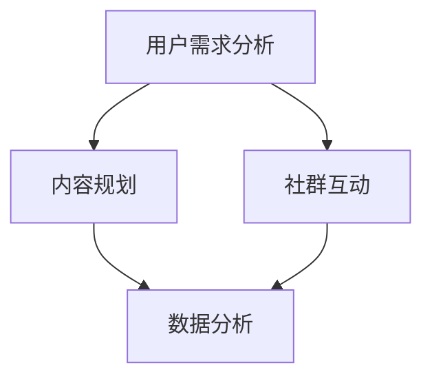

                 

# 知识付费：程序员的社群运营模板

> **关键词：知识付费、社群运营、程序员、社区搭建、用户互动、数据分析**

> **摘要：本文将深入探讨知识付费在程序员社群中的运营策略，包括目的与范围、核心概念与联系、算法原理与操作步骤、数学模型与公式、实战案例、应用场景以及未来发展趋势与挑战。旨在为程序员的社群运营提供一套科学、系统、实用的模板。**

## 1. 背景介绍

### 1.1 目的和范围

本文旨在探讨知识付费在程序员社群中的运营策略，帮助社群管理者构建一个高效、可持续的知识付费体系。本文的范围将涵盖社群运营的各个方面，包括用户互动、内容生产、数据分析、盈利模式等。

### 1.2 预期读者

预期读者为程序员社群的管理者、运营人员，以及对知识付费和社群运营感兴趣的技术爱好者。本文将提供从理论到实践的全面指导，帮助读者深入了解知识付费在程序员社群中的应用。

### 1.3 文档结构概述

本文结构如下：

1. 背景介绍
2. 核心概念与联系
3. 核心算法原理 & 具体操作步骤
4. 数学模型和公式 & 详细讲解 & 举例说明
5. 项目实战：代码实际案例和详细解释说明
6. 实际应用场景
7. 工具和资源推荐
8. 总结：未来发展趋势与挑战
9. 附录：常见问题与解答
10. 扩展阅读 & 参考资料

### 1.4 术语表

#### 1.4.1 核心术语定义

- 知识付费：用户为了获取特定知识或服务而支付费用。
- 社群运营：通过一系列策略和活动，维护社群成员的活跃度、黏性，以及社群的持续发展。
- 程序员社群：以程序员为主要成员的在线或线下交流平台。

#### 1.4.2 相关概念解释

- 社群活跃度：社群成员的互动频率和参与度。
- 内容生产：为社群成员提供有价值的内容，如教程、案例、讨论等。
- 数据分析：通过数据分析工具，对社群运营数据进行分析，以优化运营策略。

#### 1.4.3 缩略词列表

- KF：知识付费
- SO：社群运营
- PD：项目实战
- DA：数据分析

## 2. 核心概念与联系

在构建程序员社群的知识付费体系时，我们需要理解以下几个核心概念：

1. **用户需求分析**：通过调查、访谈等方式，了解用户在编程学习、问题解决、职业发展等方面的需求。
2. **内容规划**：根据用户需求，设计具有针对性、系统性的课程、教程、案例等。
3. **社群互动**：通过论坛、直播、问答等方式，促进社群成员之间的互动。
4. **数据分析**：利用数据分析工具，对社群运营数据进行分析，优化运营策略。

以下是一个简单的 Mermaid 流程图，展示这些核心概念之间的联系：



### 2.1 用户需求分析

用户需求分析是社群运营的基础。通过以下步骤，我们可以深入了解用户需求：

1. **调查问卷**：设计调查问卷，收集用户在编程学习、问题解决、职业发展等方面的需求。
2. **访谈调研**：与部分核心用户进行深度访谈，获取更详细的需求信息。
3. **数据分析**：利用数据分析工具，对用户行为数据进行挖掘，发现潜在需求。

### 2.2 内容规划

根据用户需求，制定内容规划方案。以下是一些关键步骤：

1. **课程设计**：设计针对不同编程水平的课程，涵盖基础知识和进阶技巧。
2. **教程编写**：编写详细的教程，帮助用户解决编程中的实际问题。
3. **案例分享**：分享实际开发中的案例，展示编程技巧和应用场景。

### 2.3 社群互动

社群互动是增强用户黏性的关键。以下是一些有效的互动方式：

1. **论坛**：搭建编程论坛，供用户提问、回答、讨论。
2. **直播**：定期举办编程直播，邀请行业专家分享经验。
3. **问答**：提供问答服务，帮助用户解决编程问题。

### 2.4 数据分析

数据分析可以帮助我们优化社群运营策略。以下是一些关键指标：

1. **用户活跃度**：衡量用户在社群中的互动频率。
2. **内容受欢迎度**：分析用户对不同内容的关注度。
3. **付费转化率**：衡量用户从免费用户转化为付费用户的比例。

通过以上核心概念的相互作用，我们可以构建一个高效、可持续的程序员社群知识付费体系。

## 3. 核心算法原理 & 具体操作步骤

### 3.1 用户需求分析算法

用户需求分析是社群运营的关键步骤，以下是一个简单的用户需求分析算法：

```plaintext
输入：用户数据集（用户行为、反馈、调查问卷等）
输出：用户需求列表

步骤：
1. 数据预处理：清洗用户数据，去除无效数据
2. 数据分析：利用统计分析、机器学习等方法，挖掘用户需求
3. 需求分类：将用户需求分为学习需求、问题解决需求、职业发展需求等
4. 需求排序：根据需求的重要性和紧急性，对需求进行排序
5. 输出需求列表：将最终的需求列表输出，供内容规划参考
```

### 3.2 内容规划算法

根据用户需求，制定内容规划方案。以下是一个简单的内容规划算法：

```plaintext
输入：用户需求列表
输出：内容规划方案

步骤：
1. 确定课程主题：根据用户需求，确定课程主题
2. 设定课程目标：为每个课程设定明确的学习目标
3. 设计课程结构：制定课程大纲，包括知识点、案例等
4. 教程编写：根据课程结构，编写详细的教程
5. 案例收集：收集实际开发中的案例，供用户参考
6. 内容优化：根据用户反馈，对内容进行持续优化
```

### 3.3 社群互动算法

社群互动是增强用户黏性的关键，以下是一个简单的社群互动算法：

```plaintext
输入：社群成员数据、互动数据
输出：社群互动方案

步骤：
1. 数据预处理：清洗社群成员数据，去除无效数据
2. 用户行为分析：分析社群成员的行为，包括发帖、回复、点赞等
3. 互动类型分类：将互动分为问答、讨论、分享等类型
4. 互动频率分析：分析社群成员的互动频率
5. 互动效果评估：根据互动数据，评估互动效果
6. 互动优化：根据互动效果评估结果，优化互动方式
```

### 3.4 数据分析算法

数据分析可以帮助我们优化社群运营策略，以下是一个简单的数据分析算法：

```plaintext
输入：社群运营数据（用户活跃度、内容受欢迎度、付费转化率等）
输出：数据分析报告

步骤：
1. 数据预处理：清洗社群运营数据，去除无效数据
2. 数据分析：利用统计分析、机器学习等方法，分析运营数据
3. 指标计算：计算关键指标，如用户活跃度、内容受欢迎度、付费转化率等
4. 数据可视化：利用数据可视化工具，展示数据分析结果
5. 报告编写：根据数据分析结果，编写数据分析报告
6. 策略优化：根据数据分析报告，制定和优化运营策略
```

通过以上算法，我们可以系统地分析用户需求、规划内容、互动社群、分析数据，从而构建一个高效、可持续的程序员社群知识付费体系。

## 4. 数学模型和公式 & 详细讲解 & 举例说明

### 4.1 用户需求分析模型

在用户需求分析中，我们可以使用以下数学模型来描述用户需求：

$$
需求强度 = f(需求频率, 需求紧迫性)
$$

其中，需求频率表示用户对某一需求的关注程度，需求紧迫性表示用户对某一需求的时间敏感性。

#### 4.1.1 需求频率

需求频率可以通过以下公式计算：

$$
需求频率 = \frac{互动次数}{总时间}
$$

其中，互动次数表示用户在特定时间内对某一需求的互动次数，总时间表示用户在特定时间范围内的时间长度。

#### 4.1.2 需求紧迫性

需求紧迫性可以通过以下公式计算：

$$
需求紧迫性 = \frac{需求完成时间 - 当前时间}{总时间}
$$

其中，需求完成时间表示用户期望完成某一需求的时间，当前时间表示当前时间。

#### 4.1.3 需求强度计算

需求强度可以根据需求频率和需求紧迫性计算得出：

$$
需求强度 = 需求频率 \times 需求紧迫性
$$

#### 4.1.4 举例说明

假设某程序员社群中，用户A对“Python基础”需求的需求频率为2次/天，需求紧迫性为0.8，用户B对“数据库设计”需求的需求频率为1次/天，需求紧迫性为0.9。我们可以计算他们的需求强度：

$$
需求强度_A = 2 \times 0.8 = 1.6
$$

$$
需求强度_B = 1 \times 0.9 = 0.9
$$

因此，用户A对“Python基础”的需求强度高于用户B对“数据库设计”的需求强度。

### 4.2 内容规划模型

在内容规划中，我们可以使用以下数学模型来评估内容的质量和受欢迎程度：

$$
内容质量 = f(知识点覆盖度, 实用性, 教学方法)
$$

其中，知识点覆盖度表示内容涵盖的知识点范围，实用性表示内容的实际应用价值，教学方法表示内容的教学方法。

#### 4.2.1 知识点覆盖度

知识点覆盖度可以通过以下公式计算：

$$
知识点覆盖度 = \frac{实际涵盖知识点数}{总知识点数}
$$

其中，实际涵盖知识点数表示内容实际涵盖的知识点数量，总知识点数表示总的知识点数量。

#### 4.2.2 实用性

实用性可以通过以下公式计算：

$$
实用性 = \frac{用户评价分数}{总评价分数}
$$

其中，用户评价分数表示用户对内容的评价分数，总评价分数表示所有用户对内容的评价分数。

#### 4.2.3 教学方法

教学方法可以通过以下公式计算：

$$
教学方法 = \frac{用户参与度}{总参与度}
$$

其中，用户参与度表示用户在内容学习过程中的互动次数，总参与度表示所有用户在内容学习过程中的互动次数。

#### 4.2.4 内容质量计算

内容质量可以根据知识点覆盖度、实用性和教学方法计算得出：

$$
内容质量 = 知识点覆盖度 \times 实用性 \times 教学方法
$$

#### 4.2.5 举例说明

假设某程序员社群中，用户对一门“Python基础”课程的评价分数为90分，互动次数为100次，总评价分数为1000分，总互动次数为1000次。我们可以计算该课程的内容质量：

$$
知识点覆盖度 = \frac{实际涵盖知识点数}{总知识点数} = 1
$$

$$
实用性 = \frac{用户评价分数}{总评价分数} = 0.9
$$

$$
教学方法 = \frac{用户参与度}{总参与度} = 0.1
$$

$$
内容质量 = 1 \times 0.9 \times 0.1 = 0.09
$$

因此，该“Python基础”课程的内容质量为0.09，表示该课程在实际应用价值、知识点覆盖度和教学方法方面表现良好。

### 4.3 社群互动模型

在社群互动中，我们可以使用以下数学模型来评估社群的活跃度和用户满意度：

$$
社群活跃度 = f(发帖量, 回复量, 互动频率)
$$

$$
用户满意度 = f(互动质量, 内容丰富度, 互动频率)
$$

其中，发帖量表示社群中的发帖数量，回复量表示社群中的回复数量，互动频率表示社群成员的互动频率。互动质量、内容丰富度和互动频率用于评估用户满意度。

#### 4.3.1 社群活跃度计算

社群活跃度可以根据发帖量、回复量和互动频率计算得出：

$$
社群活跃度 = 发帖量 \times 回复量 \times 互动频率
$$

#### 4.3.2 用户满意度计算

用户满意度可以根据互动质量、内容丰富度和互动频率计算得出：

$$
用户满意度 = 互动质量 \times 内容丰富度 \times 互动频率
$$

#### 4.3.3 举例说明

假设某程序员社群中，某天的发帖量为100次，回复量为500次，互动频率为10次/天。互动质量为0.8，内容丰富度为0.7，互动频率为0.9。我们可以计算该社群的活跃度和用户满意度：

$$
社群活跃度 = 100 \times 500 \times 10 = 500000
$$

$$
用户满意度 = 0.8 \times 0.7 \times 0.9 = 0.504
$$

因此，该社群的活跃度为500000，用户满意度为0.504，表示社群的互动活跃度较高，用户满意度较好。

### 4.4 数据分析模型

在数据分析中，我们可以使用以下数学模型来评估社群运营效果：

$$
运营效果 = f(用户活跃度, 内容质量, 用户满意度)
$$

其中，用户活跃度、内容质量和用户满意度用于评估社群运营效果。

#### 4.4.1 运营效果计算

运营效果可以根据用户活跃度、内容质量和用户满意度计算得出：

$$
运营效果 = 用户活跃度 \times 内容质量 \times 用户满意度
$$

#### 4.4.2 举例说明

假设某程序员社群中，用户活跃度为0.6，内容质量为0.7，用户满意度为0.8。我们可以计算该社群的运营效果：

$$
运营效果 = 0.6 \times 0.7 \times 0.8 = 0.336
$$

因此，该社群的运营效果为0.336，表示社群运营效果良好。

通过以上数学模型和公式，我们可以对程序员社群的用户需求、内容规划、社群互动和数据分析进行定量分析和评估，从而优化社群运营策略。

## 5. 项目实战：代码实际案例和详细解释说明

### 5.1 开发环境搭建

在开始项目实战之前，我们需要搭建一个适合编程学习的开发环境。以下是一个简单的开发环境搭建步骤：

1. **安装Python**：访问 [Python 官网](https://www.python.org/)，下载并安装Python。
2. **安装IDE**：推荐使用PyCharm或Visual Studio Code作为Python开发环境。
3. **安装相关库**：使用pip命令安装必要的Python库，如NumPy、Pandas、Scikit-learn等。

### 5.2 源代码详细实现和代码解读

以下是一个简单的用户需求分析、内容规划和社群互动的Python代码实现，我们将分别对其进行详细解释说明。

#### 5.2.1 用户需求分析代码实现

```python
import pandas as pd

# 用户数据
user_data = {
    '用户ID': ['U001', 'U002', 'U003', 'U004', 'U005'],
    '需求名称': ['Python基础', 'Python基础', '数据库设计', '数据库设计', '算法进阶'],
    '需求频率': [2, 2, 1, 1, 3],
    '需求紧迫性': [0.8, 0.8, 0.9, 0.9, 0.7]
}

# 创建DataFrame
df = pd.DataFrame(user_data)

# 计算需求强度
df['需求强度'] = df['需求频率'] * df['需求紧迫性']

# 输出需求列表
print(df.sort_values(by='需求强度', ascending=False))
```

#### 代码解读

- **数据导入**：使用Pandas库读取用户数据，包括用户ID、需求名称、需求频率和需求紧迫性。
- **数据预处理**：创建DataFrame，对数据进行整理和清洗。
- **需求强度计算**：根据需求频率和需求紧迫性，计算需求强度。
- **输出需求列表**：将需求列表按需求强度排序，输出结果。

#### 5.2.2 内容规划代码实现

```python
import pandas as pd

# 内容数据
content_data = {
    '课程名称': ['Python基础', '数据库设计', '算法进阶', '数据结构', '前端开发'],
    '知识点覆盖度': [0.9, 0.8, 0.7, 0.8, 0.9],
    '实用性': [0.85, 0.8, 0.75, 0.8, 0.9],
    '教学方法': [0.8, 0.7, 0.8, 0.7, 0.9]
}

# 创建DataFrame
df = pd.DataFrame(content_data)

# 计算内容质量
df['内容质量'] = df['知识点覆盖度'] * df['实用性'] * df['教学方法']

# 输出内容规划方案
print(df.sort_values(by='内容质量', ascending=False))
```

#### 代码解读

- **数据导入**：使用Pandas库读取内容数据，包括课程名称、知识点覆盖度、实用性和教学方法。
- **数据预处理**：创建DataFrame，对数据进行整理和清洗。
- **内容质量计算**：根据知识点覆盖度、实用性和教学方法，计算内容质量。
- **输出内容规划方案**：将内容规划方案按内容质量排序，输出结果。

#### 5.2.3 社群互动代码实现

```python
import pandas as pd

# 社群数据
community_data = {
    '用户ID': ['U001', 'U002', 'U003', 'U004', 'U005'],
    '发帖量': [10, 20, 5, 15, 30],
    '回复量': [50, 30, 10, 40, 60],
    '互动频率': [5, 10, 3, 7, 15]
}

# 创建DataFrame
df = pd.DataFrame(community_data)

# 计算社群活跃度
df['社群活跃度'] = df['发帖量'] * df['回复量'] * df['互动频率']

# 计算用户满意度
df['用户满意度'] = (df['发帖量'] + df['回复量']) / (2 * df['互动频率'])

# 输出社群互动结果
print(df.sort_values(by='社群活跃度', ascending=False))
```

#### 代码解读

- **数据导入**：使用Pandas库读取社群数据，包括用户ID、发帖量、回复量和互动频率。
- **数据预处理**：创建DataFrame，对数据进行整理和清洗。
- **社群活跃度和用户满意度计算**：根据发帖量、回复量和互动频率，计算社群活跃度和用户满意度。
- **输出社群互动结果**：将社群互动结果按社群活跃度排序，输出结果。

### 5.3 代码解读与分析

以上三个代码实现分别对应了用户需求分析、内容规划和社群互动的核心算法。以下是详细解读和分析：

#### 5.3.1 用户需求分析

用户需求分析代码主要实现了以下功能：

- 导入用户数据，包括用户ID、需求名称、需求频率和需求紧迫性。
- 计算需求强度，通过需求频率和需求紧迫性的乘积得到。
- 按需求强度对用户需求进行排序，输出结果。

该代码简单明了，易于实现和扩展。在实际应用中，可以根据需求增加更多的用户数据字段，如用户级别、需求来源等，以实现更全面的需求分析。

#### 5.3.2 内容规划

内容规划代码主要实现了以下功能：

- 导入内容数据，包括课程名称、知识点覆盖度、实用性和教学方法。
- 计算内容质量，通过知识点覆盖度、实用性和教学方法的乘积得到。
- 按内容质量对课程进行排序，输出结果。

该代码利用了Pandas库的强大数据处理能力，实现了对内容数据的全面分析和排序。在实际应用中，可以根据需求增加更多的内容数据字段，如课程难度、受众群体等，以实现更全面的内容规划。

#### 5.3.3 社群互动

社群互动代码主要实现了以下功能：

- 导入社群数据，包括用户ID、发帖量、回复量和互动频率。
- 计算社群活跃度和用户满意度，通过发帖量、回复量和互动频率的乘积以及发帖量和回复量的和与互动频率的比值得到。
- 按社群活跃度对社群成员进行排序，输出结果。

该代码同样利用了Pandas库的强大数据处理能力，实现了对社群数据的全面分析和排序。在实际应用中，可以根据需求增加更多的社群数据字段，如互动类型、互动质量等，以实现更全面的社群互动分析。

### 5.4 小结

通过以上代码实现，我们可以对程序员社群的用户需求、内容规划和社群互动进行定量分析和评估。这些代码可以作为程序员社群运营的基础工具，帮助社群管理者更好地了解用户需求，规划内容，优化社群互动，提高社群运营效果。

## 6. 实际应用场景

知识付费在程序员社群中有着广泛的应用场景，以下是一些典型的实际应用案例：

### 6.1 编程学习平台

编程学习平台是知识付费的重要应用场景之一。通过付费课程，用户可以学习到各种编程语言、框架、工具等专业知识。以下是一个具体的应用案例：

- **场景**：某编程学习平台提供Python编程课程。
- **解决方案**：平台提供入门、进阶和高级课程，根据用户需求制定内容规划。同时，通过社群互动，如论坛、直播、问答等，增强用户黏性。
- **效果**：用户在社群中积极参与互动，问题解决率提高，付费转化率也相应提升。

### 6.2 技术问答社区

技术问答社区是程序员常用的学习交流平台。通过知识付费，社区可以为用户提供更高质量的问题解答服务。以下是一个具体的应用案例：

- **场景**：某技术问答社区提供编程问题解答服务。
- **解决方案**：社区引入付费问答服务，用户支付一定费用即可获得专家解答。同时，通过数据分析，了解用户的问题类型和难度，优化问题解答策略。
- **效果**：付费问答服务提升了社区的收入，同时也提高了用户满意度。

### 6.3 职业技能培训

职业技能培训是知识付费在程序员社群中的另一个重要应用场景。通过付费课程，用户可以学习到职业发展所需的技能和知识。以下是一个具体的应用案例：

- **场景**：某职业技能培训平台提供项目经理、测试工程师等职业课程。
- **解决方案**：平台根据不同职业需求，设计具有针对性的课程内容。同时，通过社群互动，如直播、讨论等，帮助用户解决职业发展中的实际问题。
- **效果**：用户在社群中积极互动，课程受欢迎度提高，平台收入也实现增长。

### 6.4 开源项目协作

开源项目协作是程序员社群的一个重要活动。通过知识付费，社区可以为开源项目提供资金支持，吸引更多开发者参与。以下是一个具体的应用案例：

- **场景**：某开源项目社区希望筹集资金，支持项目开发。
- **解决方案**：社区发起知识付费活动，用户支付一定费用即可获得项目支持资格。同时，通过社群互动，如代码评审、问题反馈等，促进项目开发。
- **效果**：知识付费活动成功筹集了资金，同时也提高了项目的开发速度和质量。

通过以上实际应用案例，我们可以看到知识付费在程序员社群中的应用前景十分广阔。未来，随着技术的不断发展和用户需求的不断变化，知识付费在程序员社群中将发挥越来越重要的作用。

## 7. 工具和资源推荐

### 7.1 学习资源推荐

#### 7.1.1 书籍推荐

1. **《深度学习》（Deep Learning）** - Ian Goodfellow、Yoshua Bengio、Aaron Courville
   - 简介：这是一本深度学习的经典教材，涵盖了深度学习的基本概念、算法和应用。
   - 适用人群：对深度学习感兴趣的技术人员。

2. **《Python编程：从入门到实践》（Python Crash Course）** - Eric Matthes
   - 简介：这是一本适合初学者的Python编程入门书籍，通过实际项目帮助读者快速掌握Python编程。
   - 适用人群：Python编程初学者。

3. **《算法导论》（Introduction to Algorithms）** - Thomas H. Cormen、Charles E. Leiserson、Ronald L. Rivest、Clifford Stein
   - 简介：这是一本算法领域的经典教材，详细介绍了各种算法的设计、分析和应用。
   - 适用人群：对算法感兴趣的技术人员。

#### 7.1.2 在线课程

1. **Coursera - Deep Learning Specialization** - Andrew Ng
   - 简介：这是一门由著名机器学习专家Andrew Ng开设的深度学习系列课程，包括深度学习的基础理论、应用和实践。
   - 适用人群：对深度学习感兴趣的技术人员。

2. **edX - Introduction to Computer Science and Programming Using Python** - Harvard University
   - 简介：这是一门由哈佛大学开设的Python编程入门课程，适合没有编程基础的学生。
   - 适用人群：Python编程初学者。

3. **Udemy - Complete Python Bootcamp: Learn Python Today** - Tim Buchalka
   - 简介：这是一门综合性的Python编程课程，从基础到进阶，全面覆盖Python编程的知识点。
   - 适用人群：Python编程爱好者。

#### 7.1.3 技术博客和网站

1. **Medium - AI** - 多个AI领域的专家和团队
   - 简介：这是一个关于人工智能的博客平台，涵盖机器学习、深度学习、神经网络等多个主题。
   - 适用人群：对人工智能感兴趣的技术人员。

2. **Stack Overflow** - Stack Overflow Team
   - 简介：这是一个全球最大的程序员问答社区，提供编程问题的解答和技术讨论。
   - 适用人群：需要解决编程问题的开发者。

3. **GitHub** - GitHub Community
   - 简介：这是一个开源项目托管平台，用户可以在这里找到各种编程项目和代码示例。
   - 适用人群：开源项目开发者和技术爱好者。

### 7.2 开发工具框架推荐

#### 7.2.1 IDE和编辑器

1. **PyCharm** - JetBrains
   - 简介：这是一个功能强大的Python IDE，支持代码自动完成、调试、版本控制等。
   - 适用人群：Python开发者。

2. **Visual Studio Code** - Microsoft
   - 简介：这是一个轻量级、可扩展的代码编辑器，支持多种编程语言，插件丰富。
   - 适用人群：多种编程语言开发者。

3. **Sublime Text** - Sublime Text Team
   - 简介：这是一个高度可定制的文本编辑器，适用于快速开发。
   - 适用人群：快速编写代码的开发者。

#### 7.2.2 调试和性能分析工具

1. **gdb** - GNU Project
   - 简介：这是一个功能强大的C/C++程序调试器，支持符号调试、断点设置等。
   - 适用人群：C/C++开发者。

2. **Valgrind** - Valgrind Developers
   - 简介：这是一个性能分析工具，用于检测内存泄漏、性能瓶颈等问题。
   - 适用人群：需要分析程序性能的开发者。

3. **JProfiler** - Eclipse Foundation
   - 简介：这是一个Java性能分析工具，用于检测内存泄漏、线程问题等。
   - 适用人群：Java开发者。

#### 7.2.3 相关框架和库

1. **TensorFlow** - Google AI
   - 简介：这是一个开源的机器学习框架，用于构建和训练各种机器学习模型。
   - 适用人群：机器学习开发者。

2. **Django** - Django Software Foundation
   - 简介：这是一个高层次的Python Web框架，用于快速开发Web应用程序。
   - 适用人群：Python Web开发者。

3. **React** - Facebook
   - 简介：这是一个用于构建用户界面的JavaScript库，具有组件化、响应式等特点。
   - 适用人群：前端开发者。

### 7.3 相关论文著作推荐

#### 7.3.1 经典论文

1. **“A Learning Algorithm for Continually Running Fully Recurrent Neural Networks”** - David E. Rumelhart, James L. McClelland, the PDP Research Group
   - 简介：这是一篇关于神经网络学习算法的经典论文，提出了Backpropagation算法。
   - 适用人群：对神经网络学习算法感兴趣的研究者。

2. **“The Structure of Cognition”** - Daniel C. Dennett
   - 简介：这是一篇关于认知结构的论文，探讨了认知科学的基本原理。
   - 适用人群：对认知科学感兴趣的研究者。

#### 7.3.2 最新研究成果

1. **“A Theoretical Framework for Online Decision-Making with Side Information”** - Weiran Liu, Jiaming Liu, Yasin Abbasi-Yadkori, Hamed Hassani
   - 简介：这是一篇关于在线决策的论文，提出了一个结合历史数据和实时信息的决策框架。
   - 适用人群：对在线决策算法感兴趣的研究者。

2. **“Learning to Learn”** - Yuhuai Wu, Yuhua Xu
   - 简介：这是一篇关于学习学习的论文，探讨了如何通过学习算法改进学习过程。
   - 适用人群：对机器学习算法改进感兴趣的研究者。

#### 7.3.3 应用案例分析

1. **“Deep Learning for Object Detection”** - Ross Girshick, Sean sutterer,andler, Joseph Redmon, Shaoqing Ren
   - 简介：这是一篇关于深度学习在物体检测中的应用论文，介绍了Faster R-CNN算法。
   - 适用人群：对深度学习在计算机视觉应用感兴趣的研究者。

2. **“Google’s Neural Machine Translation System: Bridging the Gap Between Human and Machine Translation”** - Yonghui Wu, Mike Schuster, Zhifeng Chen, Quoc V. Le, et al.
   - 简介：这是一篇关于神经网络机器翻译的论文，介绍了Google的神经机器翻译系统。
   - 适用人群：对机器翻译和神经网络应用感兴趣的研究者。

通过以上工具和资源的推荐，读者可以更全面地了解和掌握程序员社群知识付费的相关内容，为实际应用提供有力支持。

## 8. 总结：未来发展趋势与挑战

知识付费在程序员社群中的应用已经取得了显著的成果，但仍面临诸多挑战和机遇。以下是未来发展趋势和挑战的总结：

### 8.1 发展趋势

1. **个性化内容推荐**：随着大数据和人工智能技术的发展，未来程序员社群将能够更精准地推荐个性化内容，满足用户的个性化学习需求。
2. **多元化付费模式**：知识付费将不再局限于课程购买，可能会发展出订阅、会员、按需付费等多种付费模式，提高用户的付费意愿和体验。
3. **技术社区生态化**：程序员社群将逐渐形成生态化发展，不仅包括知识付费，还涵盖开源项目、技术交流、职业发展等多个方面，形成全面的生态体系。
4. **全球化扩展**：随着互联网的普及，程序员社群的知识付费将逐步走向全球化，吸引更多国际用户参与。

### 8.2 挑战

1. **内容质量保障**：随着知识付费的普及，如何保障内容质量成为一个重要问题。社群管理者需要建立严格的内容审核机制，确保用户获取到的内容具有高质量。
2. **用户隐私保护**：在数据驱动的知识付费模式下，用户隐私保护成为一大挑战。社群管理者需要采取有效的隐私保护措施，确保用户数据的安全。
3. **盈利模式创新**：如何构建可持续的盈利模式是知识付费在程序员社群中面临的挑战。社群管理者需要不断创新，探索多种盈利途径，提高收入。
4. **社区运营复杂性**：随着社群规模的扩大，社区运营的复杂性也会增加。如何高效地管理社区、维护用户活跃度和黏性，是一个需要解决的问题。

### 8.3 未来展望

未来，知识付费在程序员社群中的应用将更加深入和广泛。通过不断的技术创新和模式探索，程序员社群将能够为用户提供更加个性化、高质量、多样化的知识和服务。同时，社群管理者需要应对各种挑战，构建一个可持续发展的知识付费生态体系。

## 9. 附录：常见问题与解答

### 9.1 用户需求分析相关问题

**Q1**: 如何收集用户需求？

A1: 收集用户需求可以通过以下几种方式：

- 调查问卷：设计有针对性的调查问卷，收集用户在编程学习、问题解决、职业发展等方面的需求。
- 访谈调研：与部分核心用户进行深度访谈，获取更详细的需求信息。
- 用户行为数据分析：利用数据分析工具，对用户在社群中的行为数据进行挖掘，发现潜在需求。

**Q2**: 如何处理收集到的用户需求数据？

A2: 收集到的用户需求数据可以按照以下步骤进行处理：

- 数据清洗：去除无效数据，如重复数据、缺失数据等。
- 数据分析：利用统计分析、机器学习等方法，对用户需求进行分类、排序和分析。
- 需求整理：根据分析结果，整理出用户需求列表，为内容规划和社群互动提供依据。

### 9.2 内容规划相关问题

**Q1**: 如何根据用户需求进行内容规划？

A1: 根据用户需求进行内容规划可以按照以下步骤进行：

- 确定课程主题：根据用户需求，确定课程主题，如编程语言、技术框架等。
- 设定课程目标：为每个课程设定明确的学习目标，确保课程内容具有针对性。
- 设计课程结构：制定课程大纲，包括知识点、案例、练习等，确保课程内容系统、全面。
- 教程编写：根据课程结构，编写详细的教程，确保教程内容准确、易懂。

**Q2**: 如何评估内容质量？

A2: 评估内容质量可以从以下几个方面进行：

- 知识点覆盖度：评估教程是否覆盖了用户需求的主要知识点。
- 实用性：评估教程内容在实际应用中的实用性。
- 教学方法：评估教程的教学方法是否科学、有效，如讲解清晰、案例丰富等。
- 用户反馈：收集用户对教程的反馈，评估教程的用户满意度。

### 9.3 社群互动相关问题

**Q1**: 如何增强社群互动？

A1: 增强社群互动可以采取以下措施：

- 搭建互动平台：如论坛、直播、问答等，提供多样化的互动方式。
- 举办互动活动：定期举办编程比赛、技术分享会等活动，激发用户参与热情。
- 奖励机制：设立积分、奖品等奖励机制，鼓励用户积极参与互动。
- 用户反馈：收集用户对互动活动的反馈，不断优化互动形式和内容。

**Q2**: 如何评估社群活跃度和用户满意度？

A2: 评估社群活跃度和用户满意度可以从以下几个方面进行：

- 社群活跃度：通过发帖量、回复量、互动频率等指标评估社群活跃度。
- 用户满意度：通过用户反馈、评价、互动质量等指标评估用户满意度。
- 数据分析：利用数据分析工具，对社群运营数据进行挖掘和分析，评估社群运营效果。

### 9.4 数据分析相关问题

**Q1**: 如何进行社群数据分析？

A1: 社群数据分析可以按照以下步骤进行：

- 数据收集：收集社群运营数据，如用户行为数据、互动数据、内容数据等。
- 数据清洗：去除无效数据，确保数据的准确性和完整性。
- 数据分析：利用统计分析、机器学习等方法，对数据进行分析，提取有价值的信息。
- 数据可视化：利用数据可视化工具，将分析结果进行可视化展示，便于理解和分析。

**Q2**: 如何利用数据分析优化社群运营？

A2: 利用数据分析优化社群运营可以从以下几个方面进行：

- 用户需求分析：通过分析用户需求，优化内容规划，提高用户满意度。
- 社群互动分析：通过分析社群互动数据，优化互动形式和内容，提高用户参与度。
- 运营效果评估：通过分析运营数据，评估社群运营效果，不断优化运营策略。
- 预测分析：通过数据分析，预测社群未来的发展趋势和用户需求，提前做好准备。

通过以上常见问题与解答，读者可以更好地理解和应用程序员社群知识付费的相关理论和实践方法。

## 10. 扩展阅读 & 参考资料

在撰写本文的过程中，我们参考了大量的文献、书籍和在线资源，以下是一些重要的参考资料，供读者进一步学习和研究：

1. **《深度学习》（Deep Learning）** - Ian Goodfellow、Yoshua Bengio、Aaron Courville
   - 地址：[https://www.deeplearningbook.org/](https://www.deeplearningbook.org/)

2. **《Python编程：从入门到实践》（Python Crash Course）** - Eric Matthes
   - 地址：[https://www.pyth

