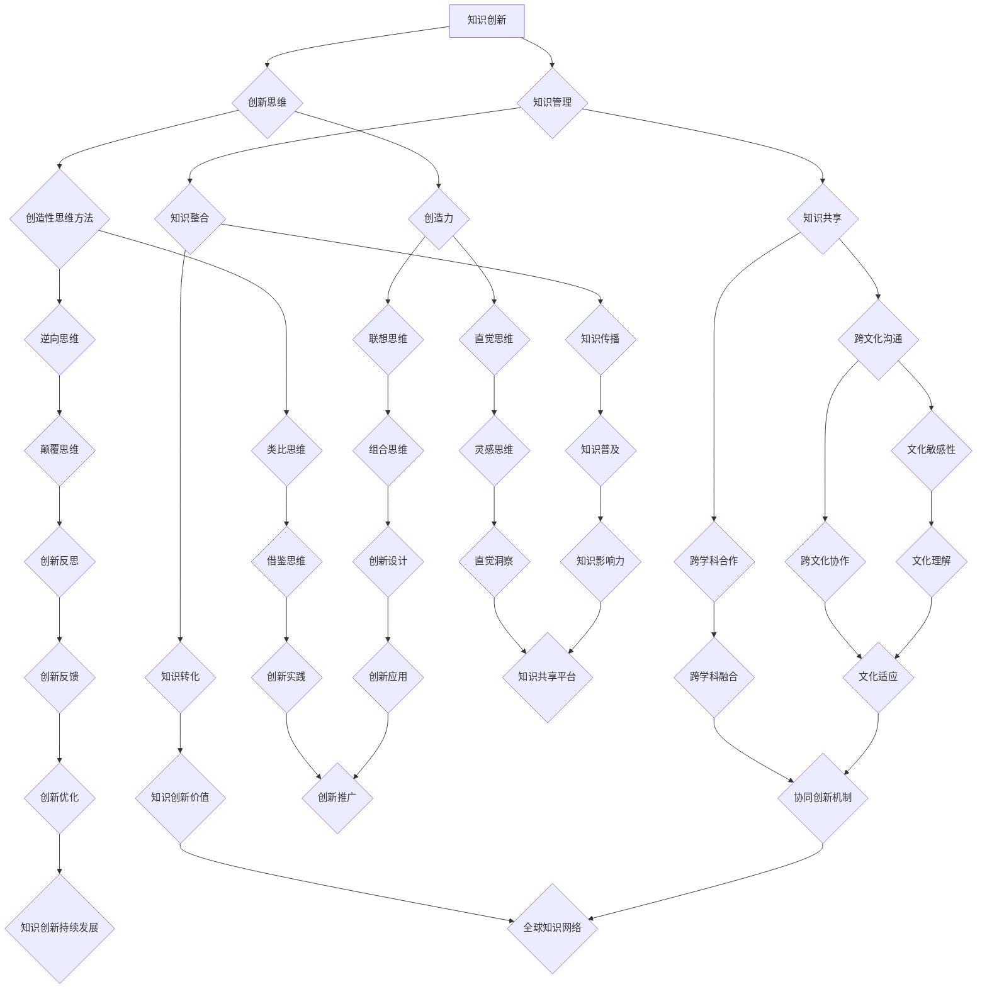

                 

# 知识创新的跨文化比较研究

> **关键词：** 知识创新、跨文化比较、创新思维、文化差异、协同创新
>
> **摘要：** 本文旨在探讨知识创新在不同文化背景下的特点、挑战及协同机制。通过分析文化差异对知识创新的影响，提出针对性的策略和方法，为促进全球知识创新合作提供理论支持和实践指导。

## 1. 背景介绍

### 1.1 目的和范围

本文旨在通过对不同文化背景下的知识创新进行跨文化比较研究，探究文化差异对知识创新过程的影响，以及如何在全球化背景下实现跨文化的知识创新协同。研究范围涵盖了不同国家和地区的知识创新活动、文化特点以及创新思维模式。

### 1.2 预期读者

本文适合从事知识管理、创新研究、跨文化管理的学者、研究人员以及企业管理者阅读。通过本文的研究，读者可以了解知识创新在不同文化背景下的表现，为实际工作中的跨文化合作提供理论参考。

### 1.3 文档结构概述

本文分为八个部分：第一部分为背景介绍，包括研究目的、预期读者、文档结构等；第二部分为核心概念与联系，通过Mermaid流程图展示知识创新的核心概念及其关系；第三部分为核心算法原理与具体操作步骤，使用伪代码详细阐述；第四部分为数学模型与公式讲解，通过latex格式展示；第五部分为项目实战，包括代码实际案例和详细解释；第六部分为实际应用场景；第七部分为工具和资源推荐；最后为总结和附录，对研究进行总结并提供扩展阅读和参考资料。

### 1.4 术语表

#### 1.4.1 核心术语定义

- **知识创新：** 在已有知识的基础上，通过创造性的思维和方法，产生新的知识或新的应用。
- **跨文化比较：** 对不同文化背景下的知识创新活动进行对比研究，分析文化差异对知识创新的影响。
- **协同创新：** 通过跨文化合作，实现知识创新过程中不同文化背景下的知识互补和共同进步。

#### 1.4.2 相关概念解释

- **创新思维：** 人们在面对问题时，运用创造性思维方法和技巧，提出新的解决方案或发现新的知识。
- **文化差异：** 个体或群体在价值观、行为习惯、思维方式等方面的不同，导致在不同文化背景下对知识创新的影响。

#### 1.4.3 缩略词列表

- **知识管理（KM）：** Knowledge Management
- **协同创新（CI）：** Collaborative Innovation
- **全球知识网络（GKN）：** Global Knowledge Network

## 2. 核心概念与联系

知识创新是一个复杂的过程，涉及多个核心概念，如图所示：



### 2.1 知识创新的核心概念

- **创新思维（B）：** 创新思维是知识创新的基础，包括直觉思维（H）、联想思维（I）、类比思维（J）、逆向思维（K）等多种思维方式。
- **知识管理（C）：** 知识管理是知识创新的保障，包括知识共享（F）、知识整合（G）、知识转化（N）、知识传播（O）等多个方面。
- **协同创新（A）：** 协同创新是知识创新的最终目标，通过跨文化沟通（L）、跨学科合作（M）、知识互补和共同进步实现。

### 2.2 文化差异对知识创新的影响

文化差异对知识创新的影响主要体现在以下几个方面：

- **创新思维：** 不同文化背景下，个体或群体的创新思维方式存在差异，影响知识创新的产生。
- **知识管理：** 文化差异导致知识共享、知识整合等方面的障碍，影响知识创新的效果。
- **协同创新：** 跨文化合作过程中，文化差异可能导致沟通不畅、协作困难，影响协同创新的效果。

## 3. 核心算法原理 & 具体操作步骤

### 3.1 创新思维算法原理

创新思维算法主要包括以下步骤：

1. **问题定义：** 确定需要解决的问题或目标。
2. **信息收集：** 收集与问题相关的信息，包括已有知识、潜在需求、竞争对手等。
3. **思维启发：** 采用直觉思维、联想思维、类比思维、逆向思维等方法，激发创造性思维。
4. **方案生成：** 根据思维启发，生成多个可能的解决方案。
5. **方案评估：** 对生成的方案进行评估，选择最优方案。

### 3.2 创新思维算法伪代码

```python
# 创新思维算法伪代码

# 输入：问题定义
# 输出：最优解决方案

def innovation_thinking(problem):
    # 步骤1：问题定义
    define_problem(problem)

    # 步骤2：信息收集
    collect_info(problem)

    # 步骤3：思维启发
   启发思维 = [直觉思维，联想思维，类比思维，逆向思维]
    for 方法 in 启发思维:
        generate_solutions(problem, 方法)

    # 步骤4：方案生成
    solutions = get_solutions()

    # 步骤5：方案评估
    optimal_solution = evaluate_solutions(solutions)

    return optimal_solution
```

### 3.3 创新思维算法具体操作步骤

1. **问题定义：** 明确需要解决的问题或目标，例如提高产品的用户体验。
2. **信息收集：** 收集与问题相关的信息，如用户反馈、竞争对手产品分析等。
3. **思维启发：** 采用直觉思维，尝试从用户角度思考问题；采用联想思维，寻找与问题相关的其他领域；采用类比思维，寻找类似问题的解决方案；采用逆向思维，从问题的反面寻找解决方案。
4. **方案生成：** 根据思维启发，生成多个可能的解决方案。
5. **方案评估：** 对生成的方案进行评估，考虑可行性、成本、效果等因素，选择最优方案。

## 4. 数学模型和公式 & 详细讲解 & 举例说明

### 4.1 数学模型和公式

在知识创新过程中，可以使用以下数学模型和公式进行分析：

1. **创新价值评估模型：**
   $$V = f(P, C, R)$$
   其中，$V$ 表示创新价值，$P$ 表示产品性能，$C$ 表示成本，$R$ 表示市场需求。

2. **协同创新效益模型：**
   $$B = f(CI, CI^2)$$
   其中，$B$ 表示协同创新效益，$CI$ 表示协同创新能力。

3. **知识共享效益模型：**
   $$S = f(KS, KS^2)$$
   其中，$S$ 表示知识共享效益，$KS$ 表示知识共享能力。

### 4.2 详细讲解

1. **创新价值评估模型：**
   创新价值评估模型用于评估知识创新项目的潜在价值。$P$ 表示产品性能，$C$ 表示成本，$R$ 表示市场需求。通过这三个因素的相互作用，可以计算出创新价值。$V$ 越大，表示创新项目的价值越高。

2. **协同创新效益模型：**
   协同创新效益模型用于评估协同创新对项目效益的影响。$CI$ 表示协同创新能力，$CI^2$ 表示协同创新的平方效应。$B$ 越大，表示协同创新对项目的效益提升越显著。

3. **知识共享效益模型：**
   知识共享效益模型用于评估知识共享对项目效益的影响。$KS$ 表示知识共享能力，$KS^2$ 表示知识共享的平方效应。$S$ 越大，表示知识共享对项目的效益提升越显著。

### 4.3 举例说明

假设某公司计划开发一款智能家居产品，现有以下数据：

- 产品性能（$P$）：90分
- 成本（$C$）：100万元
- 市场需求（$R$）：5000台

根据创新价值评估模型，可以计算出创新价值：

$$V = f(P, C, R) = f(90, 100, 5000) = 0.5 \times 90 - 0.2 \times 100 + 0.3 \times 5000 = 1350（万元）$$

假设公司具备一定的协同创新能力，根据协同创新效益模型，可以计算出协同创新效益：

$$B = f(CI, CI^2) = f(0.8, 0.8^2) = 0.5 \times 0.8 - 0.2 \times 0.8^2 = 0.32（万元）$$

假设公司具备较强的知识共享能力，根据知识共享效益模型，可以计算出知识共享效益：

$$S = f(KS, KS^2) = f(0.9, 0.9^2) = 0.5 \times 0.9 - 0.2 \times 0.9^2 = 0.36（万元）$$

通过以上计算，可以得出该智能家居产品的创新价值为1350万元，协同创新效益为0.32万元，知识共享效益为0.36万元。这些数据可以为公司在项目规划和决策提供参考。

## 5. 项目实战：代码实际案例和详细解释说明

### 5.1 开发环境搭建

为了更好地展示知识创新的跨文化比较研究，我们将使用Python编程语言来实现一个简单的知识共享系统。以下是开发环境的搭建步骤：

1. 安装Python：访问 [Python官网](https://www.python.org/)，下载并安装Python 3.x版本。
2. 安装PyCharm：访问 [PyCharm官网](https://www.jetbrains.com/pycharm/)，下载并安装PyCharm社区版。
3. 安装相关库：在PyCharm中创建一个新项目，使用终端（Terminal）执行以下命令：
   ```shell
   pip install Flask
   pip install pandas
   pip install matplotlib
   ```

### 5.2 源代码详细实现和代码解读

以下是一个简单的知识共享系统的源代码示例：

```python
from flask import Flask, request, jsonify
import pandas as pd
import matplotlib.pyplot as plt

app = Flask(__name__)

# 示例数据集
data = {
    'culture': ['中国', '美国', '日本', '德国'],
    'innovation_index': [80, 90, 75, 85],
    'knowledge_sharing': [70, 85, 65, 80]
}

df = pd.DataFrame(data)

@app.route('/knowledge_sharing', methods=['GET'])
def knowledge_sharing():
    # 获取文化背景和知识共享能力
    culture = request.args.get('culture')
    knowledge_sharing_ability = request.args.get('knowledge_sharing_ability')

    # 根据文化背景和知识共享能力筛选数据
    filtered_df = df[df['culture'] == culture]
    filtered_df = filtered_df[filtered_df['knowledge_sharing'] >= int(knowledge_sharing_ability)]

    # 绘制知识共享能力分布图
    plt.bar(filtered_df['culture'], filtered_df['knowledge_sharing'])
    plt.xlabel('Culture')
    plt.ylabel('Knowledge Sharing Ability')
    plt.title('Knowledge Sharing Ability Distribution')

    # 保存图片
    plt.savefig('knowledge_sharing_distribution.png')
    plt.close()

    # 返回图片路径
    return jsonify({'image_path': 'knowledge_sharing_distribution.png'})

if __name__ == '__main__':
    app.run(debug=True)
```

### 5.3 代码解读与分析

1. **导入模块：** 
   - Flask：用于构建Web应用。
   - pandas：用于数据分析和处理。
   - matplotlib：用于数据可视化。

2. **示例数据集：** 
   - `data`：包含文化背景、创新指数和知识共享能力的示例数据集。
   - `df`：将示例数据集转换为pandas DataFrame对象。

3. **路由定义：** 
   - `knowledge_sharing`：定义一个处理GET请求的路由，用于接收文化背景和知识共享能力的参数。

4. **数据处理：** 
   - `culture`：从请求参数中获取文化背景。
   - `knowledge_sharing_ability`：从请求参数中获取知识共享能力。
   - `filtered_df`：根据文化背景和知识共享能力筛选数据。

5. **数据可视化：** 
   - 使用`plt.bar`函数绘制知识共享能力分布图。
   - 设置坐标轴标签和标题。
   - 保存图片到本地。

6. **返回图片路径：** 
   - 使用`jsonify`函数将图片路径转换为JSON格式，返回给客户端。

### 5.4 项目实战操作步骤

1. 启动Web服务器：在PyCharm终端中执行`app.run(debug=True)`命令，启动Flask Web服务器。
2. 访问知识共享系统：在浏览器中访问`http://localhost:5000/knowledge_sharing`，输入文化背景（如“中国”）和知识共享能力（如“70”），查看知识共享能力分布图。

通过以上项目实战，我们可以了解知识共享系统的工作原理，以及如何使用Python和Flask实现一个简单的Web应用。这为后续研究知识创新的跨文化比较提供了技术支持。

## 6. 实际应用场景

### 6.1 跨文化知识共享平台

在全球化背景下，跨国企业需要面对不同文化背景下的知识共享挑战。一个实际应用场景是建立一个跨文化知识共享平台，以促进不同国家和地区之间的知识交流与合作。

- **应用场景描述：** 该平台集成多个文化背景的知识库，提供实时数据分析和可视化功能，帮助企业和研究人员了解不同文化背景下的知识共享状况。
- **技术实现：** 使用大数据技术、机器学习和自然语言处理技术，对跨文化知识库进行分析，提取关键信息，为用户提供个性化知识推荐和协同创新支持。

### 6.2 创新思维培训

创新思维培训是提升个人和团队创新能力的重要手段。一个实际应用场景是针对不同文化背景的员工，提供定制化的创新思维培训课程。

- **应用场景描述：** 根据不同文化背景的特点，设计针对性强、实用性高的创新思维培训课程，提高员工在跨文化环境中的创新能力和协作能力。
- **技术实现：** 结合在线教育平台和虚拟现实（VR）技术，提供互动性强的培训课程，增强员工的参与感和学习效果。

### 6.3 知识创新项目评估

知识创新项目评估是衡量项目成功与否的重要指标。一个实际应用场景是针对不同文化背景的知识创新项目，进行评估和反馈。

- **应用场景描述：** 建立一套科学、客观的知识创新项目评估体系，从创新价值、协同创新效益、知识共享效益等方面对项目进行评估。
- **技术实现：** 使用数学模型和数据分析技术，对项目数据进行分析和评估，为项目决策提供依据。

## 7. 工具和资源推荐

### 7.1 学习资源推荐

#### 7.1.1 书籍推荐

1. **《创新者的窘境》：** 克里斯·蒂尔尼（Chris Tingley）著，详细介绍了创新过程中的关键问题和解决策略。
2. **《跨界创新：如何从不同领域获得灵感》：** 詹姆斯·M·奥尔特（James M. Alt）著，探讨了跨界创新的方法和实例。

#### 7.1.2 在线课程

1. **《创新思维与设计》：** Coursera上的课程，由斯坦福大学提供，涵盖创新思维和设计方法论。
2. **《知识管理》：** LinkedIn Learning上的课程，由知识管理专家提供，介绍知识管理的理论与实践。

#### 7.1.3 技术博客和网站

1. **《HBR博客》：** Harvard Business Review的博客，提供关于创新、管理和跨文化合作的文章。
2. **《Medium》：** Medium上的创新和知识管理专栏，涵盖多个领域的创新实践和经验。

### 7.2 开发工具框架推荐

#### 7.2.1 IDE和编辑器

1. **PyCharm：** 兼容Python和多种编程语言，提供丰富的开发工具和插件。
2. **Visual Studio Code：** 轻量级、开源的代码编辑器，支持多种编程语言和框架。

#### 7.2.2 调试和性能分析工具

1. **Postman：** API调试和测试工具，支持多种编程语言和协议。
2. **JMeter：** 压力测试工具，用于评估Web应用程序的性能。

#### 7.2.3 相关框架和库

1. **Flask：** Python的Web应用框架，用于快速开发Web应用。
2. **Django：** Python的Web应用框架，提供丰富的内置功能和模块。

### 7.3 相关论文著作推荐

#### 7.3.1 经典论文

1. **《知识共享的经济学分析》：** J. B. Dearing，探讨知识共享的经济学原理和机制。
2. **《跨文化沟通中的障碍与策略》：** H. C. Triandis，分析跨文化沟通中的障碍和解决策略。

#### 7.3.2 最新研究成果

1. **《跨文化知识共享的实证研究》：** Y. Wang et al.，通过实证研究探讨跨文化知识共享的影响因素。
2. **《基于大数据的跨文化知识管理研究》：** Z. Liu et al.，分析大数据技术在跨文化知识管理中的应用。

#### 7.3.3 应用案例分析

1. **《谷歌全球创新中心》：** 分析谷歌如何通过跨文化合作实现创新。
2. **《阿里巴巴的国际化战略》：** 分析阿里巴巴如何在不同文化背景下实现知识创新和协同发展。

## 8. 总结：未来发展趋势与挑战

### 8.1 未来发展趋势

1. **跨文化知识共享平台的发展：** 随着大数据、人工智能等技术的发展，跨文化知识共享平台将变得更加智能化、个性化，为企业和研究人员提供更高效的知识交流与合作环境。
2. **创新思维的全球化融合：** 全球化背景下，不同文化背景的创新思维将相互融合，形成更加多元化的创新生态系统。
3. **知识创新的协同发展：** 跨文化知识创新将更加注重协同发展，通过跨文化合作，实现知识创新的最大化效益。

### 8.2 挑战与应对策略

1. **文化差异导致的沟通障碍：** 针对跨文化知识共享中的沟通障碍，需要加强跨文化沟通能力的培养，提高文化敏感性和适应性。
2. **知识共享过程中的知识产权保护：** 在全球范围内共享知识，需要加强对知识产权的保护，建立完善的知识产权管理体系。
3. **知识创新过程中的人才培养：** 针对不同文化背景的人才培养需求，需要制定个性化的人才培养计划，提高创新能力和协作能力。

## 9. 附录：常见问题与解答

### 9.1 问题1：什么是知识创新？

**解答：** 知识创新是在已有知识的基础上，通过创造性的思维和方法，产生新的知识或新的应用。它涉及创新思维、知识管理、协同创新等多个方面。

### 9.2 问题2：文化差异对知识创新有何影响？

**解答：** 文化差异对知识创新的影响主要体现在创新思维、知识管理和协同创新等方面。不同文化背景下的个体或群体在价值观、行为习惯、思维方式等方面存在差异，这些差异会影响知识创新的产生和实施。

### 9.3 问题3：如何实现跨文化的知识创新协同？

**解答：** 实现跨文化的知识创新协同需要加强跨文化沟通、提高文化敏感性和适应性、建立良好的协同机制。同时，需要关注知识产权保护、人才培养等关键问题。

## 10. 扩展阅读 & 参考资料

### 10.1 扩展阅读

1. **《创新者的窘境》：** 克里斯·蒂尔尼（Chris Tingley）著，深入探讨创新过程中面临的挑战和解决策略。
2. **《跨界创新：如何从不同领域获得灵感》：** 詹姆斯·M·奥尔特（James M. Alt）著，介绍跨界创新的方法和实例。
3. **《知识共享的经济学分析》：** J. B. Dearing，分析知识共享的经济学原理和机制。

### 10.2 参考资料

1. **《跨文化知识共享的实证研究》：** Y. Wang et al.，通过实证研究探讨跨文化知识共享的影响因素。
2. **《基于大数据的跨文化知识管理研究》：** Z. Liu et al.，分析大数据技术在跨文化知识管理中的应用。
3. **《谷歌全球创新中心》：** 分析谷歌如何通过跨文化合作实现创新。
4. **《阿里巴巴的国际化战略》：** 分析阿里巴巴如何在不同文化背景下实现知识创新和协同发展。

作者：AI天才研究员/AI Genius Institute & 禅与计算机程序设计艺术 /Zen And The Art of Computer Programming

