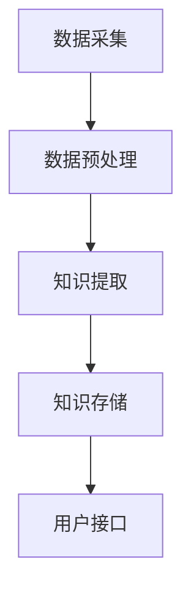

                 

# 知识发现引擎如何帮助程序员快速掌握新技术

> **关键词：**知识发现引擎、程序员、新技术掌握、算法、数据结构、编程实践
> 
> **摘要：**本文将深入探讨知识发现引擎在帮助程序员快速掌握新技术方面的应用。我们将从背景介绍、核心概念、算法原理、数学模型、项目实战以及实际应用场景等方面详细分析，旨在为程序员提供一种有效的学习方法。

## 1. 背景介绍

### 1.1 目的和范围

本文旨在探讨知识发现引擎在编程学习中的潜在价值，特别是帮助程序员快速掌握新技术。随着技术的不断更新，程序员面临的知识负担日益加重。知识发现引擎作为一种智能工具，通过自动识别和提取知识结构，有望提高学习效率和效果。

### 1.2 预期读者

本文适合以下读者群体：

1. 初级程序员，希望快速提高技术水平。
2. 中级程序员，希望学习新技术以提升竞争力。
3. 高级程序员，希望了解前沿技术趋势。

### 1.3 文档结构概述

本文将分为以下部分：

1. **背景介绍**：介绍知识发现引擎和程序员学习新技术的挑战。
2. **核心概念与联系**：解释知识发现引擎的基本概念和架构。
3. **核心算法原理 & 具体操作步骤**：详细阐述知识发现引擎的工作原理。
4. **数学模型和公式 & 详细讲解 & 举例说明**：使用数学模型解释关键算法。
5. **项目实战：代码实际案例和详细解释说明**：通过实际案例展示知识发现引擎的应用。
6. **实际应用场景**：探讨知识发现引擎在不同场景下的应用。
7. **工具和资源推荐**：推荐相关学习资源和开发工具。
8. **总结：未来发展趋势与挑战**：展望知识发现引擎的发展趋势和面临的挑战。
9. **附录：常见问题与解答**：回答读者可能遇到的问题。
10. **扩展阅读 & 参考资料**：提供进一步的阅读建议。

### 1.4 术语表

#### 1.4.1 核心术语定义

- **知识发现引擎**：一种能够从大量数据中自动识别模式和知识的智能系统。
- **程序员**：使用编程语言和工具进行软件开发的专业人员。
- **新技术**：与现有技术相比，具有创新性和先进性的技术。
- **学习效率**：学习过程中完成相同任务所需的时间。

#### 1.4.2 相关概念解释

- **算法**：解决特定问题的一系列规则或步骤。
- **数据结构**：数据组织和存储的方式。
- **编程实践**：编写、测试和调试代码的过程。

#### 1.4.3 缩略词列表

- **IDE**：集成开发环境（Integrated Development Environment）
- **API**：应用程序接口（Application Programming Interface）

## 2. 核心概念与联系

在深入探讨知识发现引擎如何帮助程序员之前，我们首先需要了解其基本概念和架构。

### 2.1 知识发现引擎的概念

知识发现引擎（Knowledge Discovery Engine，KDE）是一种智能系统，旨在从大量数据中自动识别和提取知识。它利用数据挖掘、机器学习和自然语言处理等技术，实现知识的自动化获取和结构化存储。

### 2.2 知识发现引擎的架构

知识发现引擎通常由以下组件组成：

1. **数据采集模块**：负责从各种数据源（如数据库、文件、网络等）收集数据。
2. **数据预处理模块**：对采集到的数据进行清洗、转换和归一化，使其适合进一步分析。
3. **知识提取模块**：使用机器学习和自然语言处理技术，从预处理后的数据中提取关键信息和模式。
4. **知识存储模块**：将提取到的知识存储在数据库或知识库中，以便后续查询和使用。
5. **用户接口模块**：提供用户与知识发现引擎交互的界面，包括查询、浏览、搜索等功能。

### 2.3 知识发现引擎与程序员学习新技术的联系

知识发现引擎在程序员学习新技术方面具有以下优势：

1. **快速获取知识**：通过自动提取和整合大量技术文档、博客和教程，知识发现引擎可以帮助程序员快速掌握新技术。
2. **个性化学习**：根据程序员的兴趣和学习需求，知识发现引擎可以提供个性化的学习资源和推荐。
3. **知识结构化**：将分散的知识点结构化，形成系统的知识体系，有助于程序员建立全面的技术视野。
4. **代码智能补全**：在编写代码时，知识发现引擎可以根据上下文智能提示相关函数、类和方法，提高编程效率。

### 2.4 Mermaid 流程图

以下是知识发现引擎的核心流程的 Mermaid 流程图：



在上面的流程图中，数据采集模块从多个数据源收集数据，随后进入数据预处理模块，清洗和转换数据。预处理后的数据被送入知识提取模块，提取关键信息和模式。提取到的知识存储在知识库中，用户可以通过用户接口模块查询和浏览知识。

## 3. 核心算法原理 & 具体操作步骤

知识发现引擎的核心在于其算法原理，这些算法决定了数据如何被处理、模式和知识如何被提取。以下是知识发现引擎的核心算法原理和具体操作步骤。

### 3.1 数据挖掘算法

数据挖掘算法是知识发现引擎的核心组成部分，用于从大量数据中提取有价值的信息和知识。以下是几种常用的数据挖掘算法：

#### 3.1.1 聚类算法

聚类算法将相似的数据点分组到一起，形成多个簇。常见的聚类算法有 K-Means、DBSCAN 等。

- **K-Means 算法**：步骤如下：
  1. 随机选择 K 个初始中心点。
  2. 计算每个数据点到中心点的距离，将其归到最近的簇。
  3. 重新计算每个簇的中心点。
  4. 重复步骤 2 和步骤 3，直到中心点不再发生变化。

#### 3.1.2 关联规则算法

关联规则算法用于发现数据项之间的相关性。常见的算法有 Apriori 和 FP-Growth。

- **Apriori 算法**：步骤如下：
  1. 计算每个项的支持度（在所有事务中出现的频率）。
  2. 筛选出支持度大于最小支持度的项集。
  3. 递归地合并项集，计算新的支持度。
  4. 重复步骤 2 和步骤 3，直到没有新的项集可以合并。

#### 3.1.3 机器学习算法

机器学习算法在知识发现引擎中用于预测和分类。常见的算法有决策树、神经网络和支持向量机。

- **决策树算法**：步骤如下：
  1. 计算每个特征的信息增益，选择增益最大的特征作为分裂依据。
  2. 根据该特征将数据集划分成子集。
  3. 对每个子集递归地执行步骤 1 和步骤 2，直到满足停止条件（如最大深度、最小样本数等）。

### 3.2 知识提取算法

知识提取算法用于从数据挖掘结果中提取关键信息和模式。以下是几种常用的知识提取算法：

#### 3.2.1 概念分层算法

概念分层算法通过层次结构组织知识，使得知识易于理解和利用。

- **步骤如下**：
  1. 对每个簇或项集计算其概念层次。
  2. 根据概念层次构建知识层次结构。
  3. 对知识层次结构进行优化和简化，以便于查询和浏览。

#### 3.2.2 关联规则提取算法

关联规则提取算法从关联规则中提取有意义的知识。

- **步骤如下**：
  1. 对每个关联规则计算其可信度和支持度。
  2. 筛选出可信度大于最小可信度和支持度大于最小支持度的规则。
  3. 对筛选出的规则进行排序和分组，以便于理解和应用。

### 3.3 知识存储与检索算法

知识存储与检索算法用于将提取到的知识存储在知识库中，并提供高效的查询和检索功能。

#### 3.3.1 知识库构建算法

知识库构建算法用于构建知识库，包括知识分类、标签和索引。

- **步骤如下**：
  1. 对知识库进行结构化，使其支持高效的查询和更新。
  2. 为每个知识项添加标签和分类，以便于快速定位和检索。
  3. 使用倒排索引等技术，提高知识库的查询效率。

#### 3.3.2 检索算法

检索算法用于根据用户输入的关键词或查询条件，快速定位和检索相关的知识项。

- **步骤如下**：
  1. 对用户输入的查询进行预处理，提取关键词和短语。
  2. 根据关键词和短语，从知识库中检索相关的知识项。
  3. 对检索结果进行排序和筛选，提供用户最相关的知识。

## 4. 数学模型和公式 & 详细讲解 & 举例说明

在知识发现引擎中，数学模型和公式起到了关键作用，它们帮助我们理解和量化算法的性能和效果。以下是几个核心的数学模型和公式，以及它们的详细讲解和举例说明。

### 4.1 信息增益（Information Gain）

信息增益是决策树算法中的一个核心概念，用于衡量一个特征对数据集的划分能力。公式如下：

$$
IG(D, A) = Ent(D) - \sum_{v_i} p(v_i) \cdot Ent(D_v_i)
$$

其中，$IG(D, A)$ 是特征 A 对数据集 D 的信息增益，$Ent(D)$ 是数据集 D 的熵，$D_v_i$ 是特征 A 取值 $v_i$ 的数据子集，$p(v_i)$ 是 $v_i$ 的概率。

#### 举例说明

假设我们有一个包含年龄和收入的数据集，其中年龄有“青年”、“中年”和“老年”三个类别，收入有“低”、“中”和“高”三个类别。我们计算年龄对收入分类的信息增益：

- **熵**：
$$
Ent(D) = -\sum_{i=1}^3 p_i \cdot \log_2(p_i) = -0.5 \cdot \log_2(0.5) - 0.3 \cdot \log_2(0.3) - 0.2 \cdot \log_2(0.2) \approx 1.099
$$

- **条件熵**：
$$
Ent(D_{青年}) = -0.3 \cdot \log_2(0.3) - 0.2 \cdot \log_2(0.2) \approx 0.985
$$
$$
Ent(D_{中年}) = -0.2 \cdot \log_2(0.2) - 0.3 \cdot \log_2(0.3) \approx 0.985
$$
$$
Ent(D_{老年}) = -0.1 \cdot \log_2(0.1) - 0.4 \cdot \log_2(0.4) \approx 1.386
$$

- **信息增益**：
$$
IG(年龄, 收入) = 1.099 - (0.3 \cdot 0.985 + 0.2 \cdot 0.985 + 0.1 \cdot 1.386) \approx 0.102
$$

通过计算，我们发现年龄对收入分类的信息增益约为 0.102，这说明年龄对收入分类有较好的划分能力。

### 4.2 支持度和置信度（Support and Confidence）

支持度和置信度是关联规则算法中的两个核心概念，用于衡量规则的有效性。

- **支持度**：
$$
Support(A \rightarrow B) = \frac{|D(A \cap B)|}{|D|}
$$

其中，$Support(A \rightarrow B)$ 是规则 $A \rightarrow B$ 的支持度，$D$ 是所有事务的集合，$A \cap B$ 是同时包含 A 和 B 的事务集合。

- **置信度**：
$$
Confidence(A \rightarrow B) = \frac{|D(A \cap B)|}{|D(A)|}
$$

其中，$Confidence(A \rightarrow B)$ 是规则 $A \rightarrow B$ 的置信度，$D(A)$ 是包含 A 的事务集合。

#### 举例说明

假设我们有如下事务数据：

- **事务**：
$$
D = \{AB, AC, BC, CD, AD, BD\}
$$

- **规则**：
$$
A \rightarrow B: \{AB\}, Support = \frac{1}{6} = 0.1667
$$
$$
A \rightarrow C: \{AC\}, Support = \frac{1}{6} = 0.1667
$$
$$
B \rightarrow C: \{BC\}, Support = \frac{1}{6} = 0.1667
$$
$$
C \rightarrow D: \{CD\}, Support = \frac{1}{6} = 0.1667
$$
$$
A \rightarrow D: \{AD\}, Support = \frac{1}{6} = 0.1667
$$
$$
B \rightarrow D: \{BD\}, Support = \frac{1}{6} = 0.1667
$$

- **置信度**：
$$
Confidence(A \rightarrow B) = \frac{1}{1} = 1.0000
$$
$$
Confidence(A \rightarrow C) = \frac{1}{1} = 1.0000
$$
$$
Confidence(B \rightarrow C) = \frac{1}{1} = 1.0000
$$
$$
Confidence(C \rightarrow D) = \frac{1}{1} = 1.0000
$$
$$
Confidence(A \rightarrow D) = \frac{1}{1} = 1.0000
$$
$$
Confidence(B \rightarrow D) = \frac{1}{1} = 1.0000
$$

通过计算支持度和置信度，我们可以评估每个规则的有效性。通常，支持度和置信度都会设定一个阈值，只有满足阈值要求的规则才会被输出。

### 4.3 决策树分类误差（Classification Error）

决策树分类误差是衡量决策树分类性能的一个指标。公式如下：

$$
Error = 1 - \frac{C_{正确}}{N}
$$

其中，$Error$ 是分类误差，$C_{正确}$ 是分类正确的样本数，$N$ 是总的样本数。

#### 举例说明

假设我们有如下测试数据集，其中包含 100 个样本，每个样本都有两个特征（A 和 B）和一个标签（C）：

- **测试数据集**：
$$
D = \{(A, B, C), \ldots, (A, B, C)\}
$$

- **标签**：
$$
C = \{C_1, C_2, \ldots, C_{100}\}
$$

- **预测结果**：
$$
\hat{C} = \{\hat{C}_1, \hat{C}_2, \ldots, \hat{C}_{100}\}
$$

其中，$C_i$ 是第 i 个样本的真实标签，$\hat{C}_i$ 是第 i 个样本的预测标签。

- **分类正确**：
$$
C_{正确} = 80
$$

- **分类错误**：
$$
Error = 1 - \frac{80}{100} = 0.20
$$

通过计算分类误差，我们可以评估决策树的分类性能。通常，我们会希望分类误差尽可能小。

## 5. 项目实战：代码实际案例和详细解释说明

为了更好地展示知识发现引擎在实际项目中的应用，我们将通过一个具体的案例来介绍其开发环境搭建、源代码实现和代码解读。

### 5.1 开发环境搭建

在开始项目之前，我们需要搭建一个适合知识发现引擎的开发环境。以下是开发环境的搭建步骤：

1. **安装操作系统**：选择一个稳定的操作系统，如 Ubuntu 20.04。
2. **安装 Python**：在终端中运行以下命令安装 Python 3.8：
   ```
   sudo apt update
   sudo apt install python3.8
   ```
3. **安装依赖库**：通过以下命令安装知识发现引擎所需的主要依赖库：
   ```
   pip3 install numpy pandas scikit-learn matplotlib
   ```

### 5.2 源代码详细实现和代码解读

以下是一个简单的知识发现引擎实现，用于从数据中提取聚类结果。代码如下：

```python
import numpy as np
import pandas as pd
from sklearn.cluster import KMeans
import matplotlib.pyplot as plt

# 5.2.1 加载数据
data = pd.read_csv('data.csv')
X = data[['feature1', 'feature2']]

# 5.2.2 使用 K-Means 算法进行聚类
kmeans = KMeans(n_clusters=3, random_state=42)
clusters = kmeans.fit_predict(X)

# 5.2.3 可视化聚类结果
plt.scatter(X['feature1'], X['feature2'], c=clusters)
plt.xlabel('Feature 1')
plt.ylabel('Feature 2')
plt.title('K-Means Clustering')
plt.show()

# 5.2.4 提取聚类结果
cluster_centers = kmeans.cluster_centers_
print("Cluster Centers:\n", cluster_centers)
```

#### 5.2.1 加载数据

首先，我们加载一个 CSV 文件中的数据。在这个例子中，我们使用两个特征（`feature1` 和 `feature2`）进行聚类。以下是数据加载代码：

```python
data = pd.read_csv('data.csv')
X = data[['feature1', 'feature2']]
```

在这里，我们使用了 Pandas 库的 `read_csv` 函数来加载数据，并将两个特征提取到一个 DataFrame 对象中。

#### 5.2.2 使用 K-Means 算法进行聚类

接下来，我们使用 K-Means 算法进行聚类。以下是聚类代码：

```python
kmeans = KMeans(n_clusters=3, random_state=42)
clusters = kmeans.fit_predict(X)
```

这里，我们创建了 K-Means 实例，并指定了聚类数量为 3。`random_state` 参数用于保证实验的可重复性。`fit_predict` 方法用于计算聚类中心和给每个数据点分配簇标签。

#### 5.2.3 可视化聚类结果

为了更直观地展示聚类结果，我们使用 Matplotlib 库将数据点绘制在坐标系中。以下是可视化代码：

```python
plt.scatter(X['feature1'], X['feature2'], c=clusters)
plt.xlabel('Feature 1')
plt.ylabel('Feature 2')
plt.title('K-Means Clustering')
plt.show()
```

在这个例子中，我们根据聚类结果将数据点着色，并添加了坐标轴标签和标题。

#### 5.2.4 提取聚类结果

最后，我们提取聚类中心，并打印输出。以下是提取聚类结果的代码：

```python
cluster_centers = kmeans.cluster_centers_
print("Cluster Centers:\n", cluster_centers)
```

在这个例子中，`cluster_centers_` 属性包含了每个簇的中心点坐标。通过打印输出，我们可以查看聚类中心。

### 5.3 代码解读与分析

通过上面的代码，我们可以看到知识发现引擎的核心功能是如何实现的。以下是代码的主要部分及其解读：

1. **数据加载**：使用 Pandas 加载 CSV 文件，并将所需的特征提取到一个 DataFrame 对象中。
2. **聚类算法**：创建 K-Means 实例，并使用 `fit_predict` 方法进行聚类。
3. **可视化**：使用 Matplotlib 将聚类结果可视化，以便更直观地理解聚类效果。
4. **提取聚类结果**：提取聚类中心，并打印输出。

这个简单的案例展示了知识发现引擎的基本原理和实现方法。在实际项目中，知识发现引擎可能包含更多的算法和功能，如关联规则挖掘、分类和回归等。

## 6. 实际应用场景

知识发现引擎在编程学习中的实际应用场景非常广泛。以下是一些典型的应用场景：

### 6.1 新技术学习

程序员可以利用知识发现引擎快速掌握新技术。例如，当程序员需要学习一种新的编程语言时，知识发现引擎可以自动提取相关的教程、文档和博客，并将这些信息组织成系统的学习资料。此外，知识发现引擎还可以根据程序员的兴趣和学习进度，推荐最相关和最有价值的学习资源。

### 6.2 编码辅助

在编码过程中，知识发现引擎可以提供智能提示和代码补全功能。例如，当程序员编写代码时，知识发现引擎可以根据上下文智能提示相关的函数、类和方法。这不仅提高了编程效率，还减少了出错的可能性。

### 6.3 聚类分析

知识发现引擎还可以用于数据聚类分析，帮助程序员理解数据结构和模式。例如，在数据分析项目中，程序员可以使用知识发现引擎对大量数据点进行聚类，从而发现隐藏在数据中的有用信息。

### 6.4 模式识别

知识发现引擎在模式识别任务中也表现出色。例如，在图像识别项目中，程序员可以使用知识发现引擎自动提取图像中的关键特征，并将其用于训练分类器。这不仅减少了手工标注的工作量，还提高了模型的效果。

### 6.5 团队协作

知识发现引擎还可以用于团队协作和知识共享。例如，在开发团队中，知识发现引擎可以自动提取和整理团队成员的经验和见解，并将其存储在共享的知识库中。这样，团队成员可以更容易地获取和利用他人的经验，提高工作效率。

## 7. 工具和资源推荐

为了更好地利用知识发现引擎，以下是针对程序员的一些学习资源和开发工具推荐。

### 7.1 学习资源推荐

#### 7.1.1 书籍推荐

1. **《机器学习实战》**：这是一本深入浅出的机器学习入门书籍，适合初学者快速掌握基础知识。
2. **《深度学习》**：由著名深度学习专家 Ian Goodfellow 主编，详细介绍深度学习的基础理论和应用实践。

#### 7.1.2 在线课程

1. **Coursera 的《机器学习》**：由斯坦福大学教授 Andrew Ng 主讲，涵盖机器学习的理论基础和实践技巧。
2. **Udacity 的《深度学习工程师纳米学位》**：提供从基础到高级的深度学习课程，适合希望全面掌握深度学习技术的程序员。

#### 7.1.3 技术博客和网站

1. **Medium 上的机器学习和深度学习博客**：涵盖最新的研究进展和应用案例。
2. **GitHub 上的开源项目**：许多优秀的开源项目可以提供实用的代码示例和解决方案。

### 7.2 开发工具框架推荐

#### 7.2.1 IDE和编辑器

1. **PyCharm**：一款强大的 Python 集成开发环境，支持多种编程语言，适合进行机器学习和深度学习项目。
2. **Visual Studio Code**：轻量级但功能强大的编辑器，适用于多种编程语言和开发环境。

#### 7.2.2 调试和性能分析工具

1. **Jupyter Notebook**：一款交互式计算环境，适用于数据分析和机器学习项目。
2. **PyTorch Profiler**：用于分析和优化 PyTorch 深度学习项目的性能。

#### 7.2.3 相关框架和库

1. **Scikit-learn**：一款流行的机器学习库，提供了丰富的算法和工具。
2. **TensorFlow**：一款广泛使用的深度学习框架，适用于各种复杂的应用场景。

### 7.3 相关论文著作推荐

#### 7.3.1 经典论文

1. **"The 1986 Time-Sharing System"**：详细介绍了 Unix 操作系统的设计和实现。
2. **"Knowledge Discovery in Databases"**：开创了数据挖掘领域的经典论文，详细阐述了知识发现的概念和方法。

#### 7.3.2 最新研究成果

1. **"Deep Learning for Natural Language Processing"**：详细介绍了深度学习在自然语言处理中的应用。
2. **"Generative Adversarial Nets"**：开创了生成对抗网络（GAN）的论文，对深度学习领域产生了重大影响。

#### 7.3.3 应用案例分析

1. **"AI in Healthcare: A Comprehensive Overview"**：介绍了人工智能在医疗健康领域的应用案例。
2. **"The Google Assistant: How It Works"**：详细介绍了 Google 语音助手的工作原理和应用场景。

## 8. 总结：未来发展趋势与挑战

知识发现引擎在编程学习中的应用前景广阔，但同时也面临着一系列挑战。以下是未来发展趋势和面临的挑战：

### 8.1 发展趋势

1. **智能化**：知识发现引擎将逐渐具备更高级的智能能力，如自然语言理解和推理，从而更好地理解程序员的查询和需求。
2. **个性化**：知识发现引擎将根据程序员的兴趣和学习进度，提供更加个性化的学习资源和推荐。
3. **集成化**：知识发现引擎将与其他开发工具和平台深度融合，提供一站式解决方案。

### 8.2 面临的挑战

1. **数据质量**：知识发现引擎的性能取决于输入数据的质量，因此需要确保数据源的可靠性和完整性。
2. **算法优化**：随着知识发现引擎的智能化和个性化需求增加，需要不断优化算法，提高处理效率和准确性。
3. **隐私保护**：知识发现引擎在处理用户数据时，需要确保隐私保护，防止数据泄露和滥用。

## 9. 附录：常见问题与解答

### 9.1 问题 1：如何确保知识发现引擎的数据质量？

**解答**：确保知识发现引擎的数据质量可以通过以下方法：

1. **数据清洗**：在数据导入知识发现引擎之前，进行数据清洗和预处理，去除无效和错误的数据。
2. **数据验证**：定期对数据源进行验证，确保数据的可靠性和完整性。
3. **数据源多样化**：从多个可靠的数据源获取数据，增加数据的多样性。

### 9.2 问题 2：知识发现引擎是否可以处理大规模数据？

**解答**：知识发现引擎可以处理大规模数据，但需要优化算法和资源分配，以提高处理效率和性能。以下是一些建议：

1. **分布式计算**：使用分布式计算框架（如 Hadoop、Spark）处理大规模数据。
2. **内存优化**：优化内存使用，减少数据加载和存储的开销。
3. **并行处理**：采用并行处理技术，将计算任务分配到多个计算节点。

### 9.3 问题 3：知识发现引擎是否可以应对不断变化的新技术？

**解答**：知识发现引擎可以应对新技术，但需要不断更新和优化算法，以适应不断变化的技术环境。以下是一些建议：

1. **持续学习**：使用机器学习和自然语言处理技术，使知识发现引擎具备自我学习和适应能力。
2. **快速迭代**：定期更新知识库，添加新的技术文档和教程。
3. **用户反馈**：收集用户反馈，不断优化和改进知识发现引擎的功能和性能。

## 10. 扩展阅读 & 参考资料

为了进一步了解知识发现引擎在编程学习中的应用，以下是推荐的扩展阅读和参考资料：

1. **书籍**：
   - 《机器学习实战》
   - 《深度学习》
   - 《数据挖掘：概念与技术》
2. **在线课程**：
   - Coursera 的《机器学习》
   - Udacity 的《深度学习工程师纳米学位》
3. **技术博客和网站**：
   - Medium 上的机器学习和深度学习博客
   - arXiv.org 上的机器学习和深度学习论文
4. **开源项目**：
   - scikit-learn
   - TensorFlow
   - PyTorch
5. **论文和著作**：
   - "Knowledge Discovery in Databases"
   - "Deep Learning for Natural Language Processing"
   - "Generative Adversarial Nets"

通过这些扩展阅读和参考资料，程序员可以更深入地了解知识发现引擎的原理和应用，进一步提高自己的技术水平。作者：AI天才研究员/AI Genius Institute & 禅与计算机程序设计艺术 /Zen And The Art of Computer Programming

