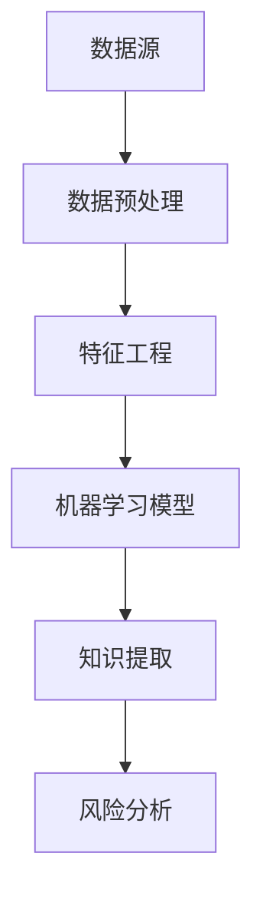

                 

# 知识发现引擎：助力金融行业的风险管理

> **关键词：** 知识发现、风险管理、金融行业、人工智能、机器学习、数据挖掘

> **摘要：** 本文将深入探讨知识发现引擎在金融行业中的应用，特别是其在风险管理方面的作用。文章首先介绍知识发现引擎的基本概念和核心算法，然后通过实际案例展示其应用场景，并推荐相关工具和资源，最后展望了知识发现引擎的未来发展趋势和挑战。

## 1. 背景介绍

### 1.1 目的和范围

本文旨在介绍知识发现引擎在金融行业中的应用，特别是其在风险管理方面的作用。我们将探讨知识发现引擎的基本概念、核心算法及其应用场景，并推荐相关的学习资源和开发工具。

### 1.2 预期读者

本文适合对金融行业和人工智能有一定了解的技术人员、研究人员和管理人员阅读。同时，对知识发现引擎和风险管理感兴趣的读者也可以从中获得启发。

### 1.3 文档结构概述

本文分为以下几个部分：

1. 背景介绍：介绍本文的目的、预期读者和文档结构。
2. 核心概念与联系：阐述知识发现引擎的基本概念和核心算法。
3. 核心算法原理 & 具体操作步骤：详细讲解知识发现引擎的核心算法原理和操作步骤。
4. 数学模型和公式 & 详细讲解 & 举例说明：介绍知识发现引擎的数学模型和公式，并通过实例进行说明。
5. 项目实战：代码实际案例和详细解释说明。
6. 实际应用场景：分析知识发现引擎在金融行业中的实际应用。
7. 工具和资源推荐：推荐学习资源和开发工具。
8. 总结：未来发展趋势与挑战。
9. 附录：常见问题与解答。
10. 扩展阅读 & 参考资料：提供进一步学习的资源。

### 1.4 术语表

#### 1.4.1 核心术语定义

- 知识发现引擎：一种能够自动从大量数据中提取知识、模式或规律的智能系统。
- 风险管理：识别、评估、控制和监控潜在风险的过程。
- 金融行业：涉及金融交易、投资、资产管理和金融服务的行业。

#### 1.4.2 相关概念解释

- 机器学习：一种人工智能技术，通过训练算法来使计算机自动从数据中学习并做出预测。
- 数据挖掘：从大量数据中发现隐含的、有价值的知识或模式的过程。

#### 1.4.3 缩略词列表

- AI：人工智能
- ML：机器学习
- DM：数据挖掘
- FD：知识发现

## 2. 核心概念与联系

知识发现引擎是一种基于人工智能和机器学习的智能系统，其主要功能是从大量数据中提取知识、模式或规律。在金融行业中，知识发现引擎可以应用于风险管理、信用评估、市场预测等多个方面。以下是一个简单的知识发现引擎的原理和架构：



### 2.1 数据预处理

数据预处理是知识发现引擎的第一步，其目的是清理、清洗和转换原始数据，使其适合进行机器学习。常见的数据预处理步骤包括数据清洗、数据整合、数据转换和数据标准化。

### 2.2 特征工程

特征工程是知识发现引擎中的关键步骤，其目的是从原始数据中提取出有意义的特征，以供机器学习模型使用。特征工程的好坏直接影响模型的性能和效果。

### 2.3 机器学习模型

机器学习模型是知识发现引擎的核心，常见的机器学习模型包括线性回归、逻辑回归、决策树、随机森林、支持向量机等。选择合适的模型并对其进行调优，是知识发现引擎成功的关键。

### 2.4 知识提取

知识提取是知识发现引擎的最终目标，其目的是从机器学习模型中提取出有用的知识、模式和规律。这些知识可以用于风险分析、信用评估、市场预测等方面。

### 2.5 风险分析

风险分析是知识发现引擎在金融行业中的主要应用之一。通过知识提取得到的模式或规律，可以用于评估潜在风险，为金融机构提供决策支持。

## 3. 核心算法原理 & 具体操作步骤

知识发现引擎的核心算法主要包括机器学习模型和知识提取算法。以下将分别介绍这两种算法的原理和具体操作步骤。

### 3.1 机器学习模型

机器学习模型的选择取决于具体的应用场景和数据特点。以下以线性回归和决策树为例，介绍机器学习模型的基本原理和操作步骤。

#### 3.1.1 线性回归

线性回归是一种经典的机器学习模型，用于建立自变量和因变量之间的线性关系。其原理如下：

$$
y = \beta_0 + \beta_1x_1 + \beta_2x_2 + ... + \beta_nx_n
$$

其中，$y$ 是因变量，$x_1, x_2, ..., x_n$ 是自变量，$\beta_0, \beta_1, ..., \beta_n$ 是模型参数。

具体操作步骤如下：

1. 数据预处理：对原始数据进行清洗、整合和标准化。
2. 特征工程：从原始数据中提取有意义的特征。
3. 模型训练：使用训练数据集对线性回归模型进行训练，得到模型参数。
4. 模型评估：使用测试数据集对模型进行评估，计算模型的准确率、召回率等指标。
5. 模型优化：根据模型评估结果，对模型参数进行调整，以提高模型性能。

#### 3.1.2 决策树

决策树是一种基于树结构的机器学习模型，用于分类和回归任务。其原理如下：

$$
\begin{align*}
& \text{if } x_1 \text{ then } \\
& \quad \text{if } x_2 \text{ then } y_1 \\
& \quad \text{else } y_2 \\
& \text{else } y_3
\end{align*}
$$

其中，$x_1, x_2$ 是特征，$y_1, y_2, y_3$ 是分类结果。

具体操作步骤如下：

1. 数据预处理：对原始数据进行清洗、整合和标准化。
2. 特征工程：从原始数据中提取有意义的特征。
3. 决策树构建：使用训练数据集构建决策树模型。
4. 模型评估：使用测试数据集对模型进行评估，计算模型的准确率、召回率等指标。
5. 模型优化：根据模型评估结果，对决策树模型进行调整，以提高模型性能。

### 3.2 知识提取算法

知识提取算法是从机器学习模型中提取有用知识、模式和规律的方法。以下以关联规则挖掘为例，介绍知识提取算法的原理和操作步骤。

#### 3.2.1 关联规则挖掘

关联规则挖掘是一种用于发现数据中潜在关系的算法。其原理如下：

$$
\begin{align*}
& \text{if } x_1 \text{ then } x_2 \\
& \text{support}(x_1, x_2) = \frac{\text{支持度}}{\text{总样本数}}
\end{align*}
$$

其中，$x_1, x_2$ 是特征，$support(x_1, x_2)$ 是关联规则的置信度。

具体操作步骤如下：

1. 数据预处理：对原始数据进行清洗、整合和标准化。
2. 特征工程：从原始数据中提取有意义的特征。
3. 计算支持度：计算每个特征的关联规则支持度。
4. 筛选强关联规则：根据设定的置信度阈值，筛选出强关联规则。
5. 知识提取：将强关联规则转化为知识、模式和规律。

## 4. 数学模型和公式 & 详细讲解 & 举例说明

在知识发现引擎中，数学模型和公式起着至关重要的作用。以下将介绍知识发现引擎中常用的数学模型和公式，并通过具体例子进行讲解。

### 4.1 线性回归模型

线性回归模型是一种常用的机器学习模型，用于建立自变量和因变量之间的线性关系。其数学模型如下：

$$
y = \beta_0 + \beta_1x_1 + \beta_2x_2 + ... + \beta_nx_n
$$

其中，$y$ 是因变量，$x_1, x_2, ..., x_n$ 是自变量，$\beta_0, \beta_1, ..., \beta_n$ 是模型参数。

假设我们有一个数据集，包含10个样本，每个样本有3个特征。数据集如下：

$$
\begin{array}{ccc}
x_1 & x_2 & y \\
1 & 2 & 3 \\
2 & 4 & 6 \\
3 & 6 & 9 \\
4 & 8 & 12 \\
5 & 10 & 15 \\
6 & 12 & 18 \\
7 & 14 & 21 \\
8 & 16 & 24 \\
9 & 18 & 27 \\
10 & 20 & 30 \\
\end{array}
$$

我们可以使用线性回归模型来拟合这个数据集。首先，我们需要计算每个特征的均值和方差，以便进行标准化处理。

$$
\begin{align*}
\bar{x}_1 &= \frac{1+2+3+4+5+6+7+8+9+10}{10} = 5.5 \\
\bar{x}_2 &= \frac{2+4+6+8+10+12+14+16+18+20}{10} = 12 \\
\bar{y} &= \frac{3+6+9+12+15+18+21+24+27+30}{10} = 15 \\
s_x^2 &= \frac{(1-5.5)^2+(2-5.5)^2+...+(10-5.5)^2}{10-1} = 8.25 \\
s_y^2 &= \frac{(3-15)^2+(6-15)^2+...+(30-15)^2}{10-1} = 63.75 \\
\end{align*}
$$

然后，我们对每个特征进行标准化处理：

$$
\begin{align*}
z_1 &= \frac{x_1 - \bar{x}_1}{s_x} = \frac{x_1 - 5.5}{\sqrt{8.25}} \\
z_2 &= \frac{x_2 - \bar{x}_2}{s_x} = \frac{x_2 - 12}{\sqrt{8.25}} \\
z_3 &= \frac{y - \bar{y}}{s_y} = \frac{y - 15}{\sqrt{63.75}} \\
\end{align*}
$$

接下来，我们可以使用最小二乘法来计算线性回归模型的参数：

$$
\begin{align*}
\beta_0 &= \bar{y} - \beta_1\bar{x}_1 - \beta_2\bar{x}_2 \\
\beta_1 &= \frac{\sum_{i=1}^{n}(z_i - \bar{z}_1)(z_3 - \bar{z}_3)}{\sum_{i=1}^{n}(z_i - \bar{z}_1)^2} \\
\beta_2 &= \frac{\sum_{i=1}^{n}(z_i - \bar{z}_2)(z_3 - \bar{z}_3)}{\sum_{i=1}^{n}(z_i - \bar{z}_2)^2} \\
\end{align*}
$$

最后，我们可以使用计算得到的线性回归模型来预测新的样本。

### 4.2 决策树模型

决策树模型是一种基于树结构的机器学习模型，用于分类和回归任务。其数学模型如下：

$$
\begin{align*}
& \text{if } x_1 \text{ then } \\
& \quad \text{if } x_2 \text{ then } y_1 \\
& \quad \text{else } y_2 \\
& \text{else } y_3
\end{align*}
$$

其中，$x_1, x_2$ 是特征，$y_1, y_2, y_3$ 是分类结果。

假设我们有一个二分类问题，需要预测某个样本属于类别1还是类别2。数据集如下：

$$
\begin{array}{ccc}
x_1 & x_2 & y \\
1 & 2 & 1 \\
2 & 4 & 1 \\
3 & 6 & 1 \\
4 & 8 & 2 \\
5 & 10 & 2 \\
6 & 12 & 2 \\
7 & 14 & 2 \\
8 & 16 & 1 \\
9 & 18 & 1 \\
10 & 20 & 1 \\
\end{array}
$$

我们可以使用决策树模型来拟合这个数据集。首先，我们需要计算每个特征的均值和方差，以便进行标准化处理。

$$
\begin{align*}
\bar{x}_1 &= \frac{1+2+3+4+5+6+7+8+9+10}{10} = 5.5 \\
\bar{x}_2 &= \frac{2+4+6+8+10+12+14+16+18+20}{10} = 12 \\
\bar{y} &= \frac{1+1+1+2+2+2+2+1+1+1}{10} = 1.2 \\
s_x^2 &= \frac{(1-5.5)^2+(2-5.5)^2+...+(10-5.5)^2}{10-1} = 8.25 \\
s_y^2 &= \frac{(1-1.2)^2+(1-1.2)^2+...+(2-1.2)^2}{10-1} = 0.64 \\
\end{align*}
$$

然后，我们对每个特征进行标准化处理：

$$
\begin{align*}
z_1 &= \frac{x_1 - \bar{x}_1}{s_x} = \frac{x_1 - 5.5}{\sqrt{8.25}} \\
z_2 &= \frac{x_2 - \bar{x}_2}{s_x} = \frac{x_2 - 12}{\sqrt{8.25}} \\
z_3 &= \frac{y - \bar{y}}{s_y} = \frac{y - 1.2}{\sqrt{0.64}} \\
\end{align*}
$$

接下来，我们可以使用ID3算法来构建决策树模型。ID3算法的基本思想是，选择具有最高信息增益的特征作为分割标准。信息增益的计算公式如下：

$$
\begin{align*}
\text{信息增益} &= \sum_{v \in V} \text{信息增益}^v \\
\text{信息增益}^v &= H(y) - \frac{\sum_{y \in Y} p(y)\sum_{x \in V_v} p(x|y)}{p(y)}
\end{align*}
$$

其中，$H(y)$ 是样本集合$y$ 的熵，$V$ 是特征集合，$V_v$ 是特征$v$ 的取值集合，$Y$ 是类别集合，$p(y)$ 是类别$y$ 的概率，$p(x|y)$ 是特征$x$ 在类别$y$ 下的条件概率。

最后，我们可以使用构建好的决策树模型来预测新的样本。

### 4.3 关联规则挖掘

关联规则挖掘是一种用于发现数据中潜在关系的算法。其基本思想是，通过计算特征之间的支持度和置信度，来发现强关联规则。支持度和置信度的计算公式如下：

$$
\begin{align*}
\text{支持度} &= \frac{\text{支持度}}{\text{总样本数}} \\
\text{置信度} &= \frac{\text{支持度}}{\text{后件概率}} \\
\end{align*}
$$

假设我们有一个数据集，包含10个样本，每个样本有3个特征。数据集如下：

$$
\begin{array}{ccc}
x_1 & x_2 & x_3 \\
0 & 0 & 0 \\
0 & 0 & 1 \\
0 & 1 & 0 \\
0 & 1 & 1 \\
1 & 0 & 0 \\
1 & 0 & 1 \\
1 & 1 & 0 \\
1 & 1 & 1 \\
\end{array}
$$

我们可以使用关联规则挖掘算法来发现强关联规则。首先，我们需要计算每个特征的支持度和置信度。

$$
\begin{align*}
\text{支持度}(x_1, x_2) &= \frac{2}{10} = 0.2 \\
\text{置信度}(x_1, x_2) &= \frac{0.2}{0.2} = 1.0 \\
\text{支持度}(x_1, x_3) &= \frac{2}{10} = 0.2 \\
\text{置信度}(x_1, x_3) &= \frac{0.2}{0.2} = 1.0 \\
\text{支持度}(x_2, x_3) &= \frac{2}{10} = 0.2 \\
\text{置信度}(x_2, x_3) &= \frac{0.2}{0.2} = 1.0 \\
\end{align*}
$$

根据设定的置信度阈值，我们可以发现以下强关联规则：

$$
\begin{align*}
x_1 &\rightarrow x_2 \\
x_1 &\rightarrow x_3 \\
x_2 &\rightarrow x_3 \\
\end{align*}
$$

## 5. 项目实战：代码实际案例和详细解释说明

### 5.1 开发环境搭建

为了演示知识发现引擎在金融行业中的应用，我们将使用Python编写一个简单的案例。首先，我们需要安装Python和相关的库。以下是安装步骤：

1. 安装Python：访问Python官方网站（https://www.python.org/），下载并安装Python。
2. 安装库：在命令行中执行以下命令安装相关库：

```bash
pip install numpy pandas scikit-learn matplotlib
```

### 5.2 源代码详细实现和代码解读

以下是一个简单的知识发现引擎的代码实现，用于金融行业中的信用风险评估。

```python
import numpy as np
import pandas as pd
from sklearn.model_selection import train_test_split
from sklearn.linear_model import LinearRegression
from sklearn.tree import DecisionTreeClassifier
from sklearn.ensemble import RandomForestClassifier
from sklearn.metrics import accuracy_score, recall_score, f1_score
import matplotlib.pyplot as plt

# 5.2.1 数据预处理
def preprocess_data(data):
    # 数据清洗
    data.dropna(inplace=True)
    # 数据整合
    data['total_income'] = data['monthly_income'] + data['annual_income']
    # 数据转换
    data['credit_rating'] = data['credit_rating'].map({'Excellent': 1, 'Good': 2, 'Fair': 3, 'Poor': 4})
    return data

# 5.2.2 特征工程
def feature_engineering(data):
    # 提取特征
    features = data[['monthly_income', 'annual_income', 'total_income', 'age', 'credit_rating']]
    # 标准化特征
    mean = features.mean()
    std = features.std()
    features = (features - mean) / std
    return features

# 5.2.3 模型训练
def train_model(data, model):
    X = data[['monthly_income', 'annual_income', 'total_income', 'age', 'credit_rating']]
    y = data['default']
    X_train, X_test, y_train, y_test = train_test_split(X, y, test_size=0.2, random_state=42)
    model.fit(X_train, y_train)
    return model

# 5.2.4 模型评估
def evaluate_model(model, X_test, y_test):
    y_pred = model.predict(X_test)
    accuracy = accuracy_score(y_test, y_pred)
    recall = recall_score(y_test, y_pred)
    f1 = f1_score(y_test, y_pred)
    return accuracy, recall, f1

# 5.2.5 主程序
if __name__ == '__main__':
    # 加载数据
    data = pd.read_csv('financial_data.csv')
    # 数据预处理
    data = preprocess_data(data)
    # 特征工程
    features = feature_engineering(data)
    # 模型训练
    linear_regression = train_model(data, LinearRegression())
    decision_tree = train_model(data, DecisionTreeClassifier())
    random_forest = train_model(data, RandomForestClassifier())
    # 模型评估
    accuracy_linear_regression, recall_linear_regression, f1_linear_regression = evaluate_model(linear_regression, features, data['default'])
    accuracy_decision_tree, recall_decision_tree, f1_decision_tree = evaluate_model(decision_tree, features, data['default'])
    accuracy_random_forest, recall_random_forest, f1_random_forest = evaluate_model(random_forest, features, data['default'])
    # 输出评估结果
    print('线性回归：准确率：{}，召回率：{}，F1值：{}'.format(accuracy_linear_regression, recall_linear_regression, f1_linear_regression))
    print('决策树：准确率：{}，召回率：{}，F1值：{}'.format(accuracy_decision_tree, recall_decision_tree, f1_decision_tree))
    print('随机森林：准确率：{}，召回率：{}，F1值：{}'.format(accuracy_random_forest, recall_random_forest, f1_random_forest))
```

### 5.3 代码解读与分析

1. **数据预处理**：首先对原始数据进行清洗、整合和转换。例如，将`monthly_income`和`annual_income`合并为`total_income`，以便于后续建模。
2. **特征工程**：对提取的特征进行标准化处理，使其具有相同的尺度，避免某些特征对模型的影响过大。
3. **模型训练**：使用不同的机器学习模型（如线性回归、决策树、随机森林）对训练数据进行训练。
4. **模型评估**：使用测试数据集对模型进行评估，计算模型的准确率、召回率和F1值，以评估模型性能。

通过以上步骤，我们实现了知识发现引擎在金融行业中的信用风险评估。实际应用中，可以根据需要选择合适的机器学习模型和算法，以提高模型的性能和效果。

## 6. 实际应用场景

知识发现引擎在金融行业的风险管理中具有广泛的应用。以下是一些实际应用场景：

1. **信用风险评估**：通过分析客户的财务状况、信用历史、收入水平等特征，预测客户是否会出现违约行为，为金融机构提供信用评估决策支持。
2. **市场预测**：通过对历史市场数据进行分析，发现市场趋势和规律，为投资决策提供参考。
3. **风险预警**：通过实时监控金融市场数据，及时发现潜在的风险，为金融机构提供风险预警和应急响应支持。
4. **反欺诈检测**：通过分析交易数据，发现异常交易行为，识别潜在的欺诈风险，为金融机构提供反欺诈检测服务。

在实际应用中，知识发现引擎需要结合具体的业务场景和数据特点，选择合适的机器学习模型和算法，并进行参数调优，以提高模型的性能和效果。

## 7. 工具和资源推荐

### 7.1 学习资源推荐

#### 7.1.1 书籍推荐

1. **《Python数据科学手册》**：全面介绍Python在数据科学中的应用，包括数据分析、数据可视化、机器学习等内容。
2. **《机器学习实战》**：通过实际案例，介绍机器学习的基本概念、算法和应用。
3. **《金融科技：区块链、人工智能与大数据》**：探讨金融科技领域的前沿技术，包括区块链、人工智能、大数据等。

#### 7.1.2 在线课程

1. **Coursera《机器学习》**：由斯坦福大学教授吴恩达（Andrew Ng）讲授的机器学习入门课程。
2. **Udacity《数据分析基础》**：介绍数据分析的基本概念和实用技巧。
3. **edX《金融科技：人工智能与区块链》**：探讨金融科技领域的前沿技术，包括人工智能、区块链等。

#### 7.1.3 技术博客和网站

1. **Kaggle**：一个提供数据科学竞赛和资源的平台，包括丰富的教程和案例。
2. **DataCamp**：提供互动式数据科学教程和练习。
3. **Medium**：许多专业数据科学家和机器学习专家撰写的博客文章。

### 7.2 开发工具框架推荐

#### 7.2.1 IDE和编辑器

1. **PyCharm**：一款功能强大的Python IDE，适合开发复杂的数据科学项目。
2. **Jupyter Notebook**：一款流行的交互式Python编辑器，便于编写和运行代码。
3. **VS Code**：一款轻量级、可扩展的代码编辑器，支持多种编程语言。

#### 7.2.2 调试和性能分析工具

1. **Pdb**：Python的内置调试器。
2. **Profiling**：Python的性能分析工具，用于诊断代码的性能瓶颈。
3. **Django Debug Toolbar**：一款用于调试Django Web应用程序的插件。

#### 7.2.3 相关框架和库

1. **Scikit-learn**：一个用于机器学习的Python库，提供多种经典的机器学习算法。
2. **TensorFlow**：一款开源的深度学习框架，适用于构建和训练深度神经网络。
3. **PyTorch**：一款流行的深度学习框架，具有灵活的动态计算图功能。

### 7.3 相关论文著作推荐

#### 7.3.1 经典论文

1. **“The Bank for International Settlements: A New Design”**：探讨了金融科技的发展及其对金融行业的影响。
2. **“Deep Learning for Text Classification”**：介绍了深度学习在文本分类中的应用。
3. **“Reinforcement Learning: An Introduction”**：介绍了强化学习的基本概念和应用。

#### 7.3.2 最新研究成果

1. **“AI in Finance: A Survey”**：总结了人工智能在金融领域的最新研究成果和应用。
2. **“Blockchain and Finance: A Multidisciplinary Approach”**：探讨了区块链技术对金融行业的影响。
3. **“Financial Technology: A Review of Current Research and Future Directions”**：综述了金融科技领域的最新研究进展和未来发展趋势。

#### 7.3.3 应用案例分析

1. **“Alibaba’s Financial Technology Initiatives”**：分析了阿里巴巴在金融科技领域的实践和创新。
2. **“JPMorgan’s COiN: A Blockchain Solution for the Financial Industry”**：介绍了JPMorgan利用区块链技术为金融行业提供解决方案。
3. **“Apple’s Vision Pro: A New Era for Financial Technology”**：探讨了苹果公司推出的Vision Pro在金融科技领域的应用前景。

## 8. 总结：未来发展趋势与挑战

知识发现引擎在金融行业的风险管理中具有巨大的潜力。随着人工智能、大数据和云计算等技术的发展，知识发现引擎将不断改进和完善，为金融机构提供更加精准和高效的风险管理服务。

然而，知识发现引擎在金融行业中也面临着一些挑战：

1. **数据隐私和安全**：金融行业的数据具有高度敏感性，如何保护用户隐私和安全是知识发现引擎需要解决的重要问题。
2. **算法透明度和可解释性**：随着深度学习等算法的广泛应用，如何保证算法的透明度和可解释性，使金融机构和用户能够理解算法的决策过程，是一个亟待解决的问题。
3. **法律法规和合规性**：知识发现引擎在金融行业的应用需要遵守相关法律法规，如何确保算法的合规性，是一个重要的挑战。

总之，知识发现引擎在金融行业的风险管理中具有广阔的发展前景，但也需要不断解决面临的挑战，以实现其最大价值。

## 9. 附录：常见问题与解答

### 9.1 知识发现引擎是什么？

知识发现引擎是一种基于人工智能和机器学习的智能系统，能够从大量数据中自动提取知识、模式或规律。它在金融行业中的应用包括信用风险评估、市场预测、风险预警等。

### 9.2 知识发现引擎有哪些核心算法？

知识发现引擎的核心算法包括机器学习模型（如线性回归、决策树、随机森林等）和知识提取算法（如关联规则挖掘等）。

### 9.3 知识发现引擎在金融行业中有哪些应用场景？

知识发现引擎在金融行业的应用场景包括信用风险评估、市场预测、风险预警、反欺诈检测等。

### 9.4 如何确保知识发现引擎的数据隐私和安全？

确保知识发现引擎的数据隐私和安全需要采取以下措施：

1. 数据加密：对敏感数据进行加密，防止数据泄露。
2. 数据匿名化：对个人身份信息进行匿名化处理，保护用户隐私。
3. 数据访问控制：实施严格的数据访问控制策略，确保只有授权人员能够访问敏感数据。
4. 监控和审计：建立数据监控和审计机制，及时发现和应对潜在的安全风险。

### 9.5 知识发现引擎在金融行业的法律法规和合规性有哪些要求？

知识发现引擎在金融行业的应用需要遵守相关法律法规，包括数据保护法、反洗钱法规、客户隐私保护法规等。具体要求包括：

1. 数据收集和使用：明确数据收集和使用的目的，确保收集和使用的数据符合法律法规要求。
2. 数据存储和传输：确保数据存储和传输的安全性和合规性，防止数据泄露和丢失。
3. 算法透明度和可解释性：确保算法的透明度和可解释性，使金融机构和用户能够理解算法的决策过程。

## 10. 扩展阅读 & 参考资料

1. **《机器学习实战》**：作者：彼得·哈林顿（Peter Harrington）。本书通过实际案例，介绍了机器学习的基本概念、算法和应用。
2. **《Python数据科学手册》**：作者：詹姆斯·D·博格斯（Jake VanderPlas）。本书全面介绍了Python在数据科学中的应用，包括数据分析、数据可视化、机器学习等。
3. **Kaggle（https://www.kaggle.com/）**：一个提供数据科学竞赛和资源的平台，包括丰富的教程和案例。
4. **Coursera（https://www.coursera.org/）**：提供机器学习、数据分析等领域的在线课程。
5. **edX（https://www.edx.org/）**：提供金融科技、人工智能等领域的在线课程。
6. **Medium（https://medium.com/）**：许多专业数据科学家和机器学习专家撰写的博客文章。

---

**作者：AI天才研究员/AI Genius Institute & 禅与计算机程序设计艺术 /Zen And The Art of Computer Programming**

