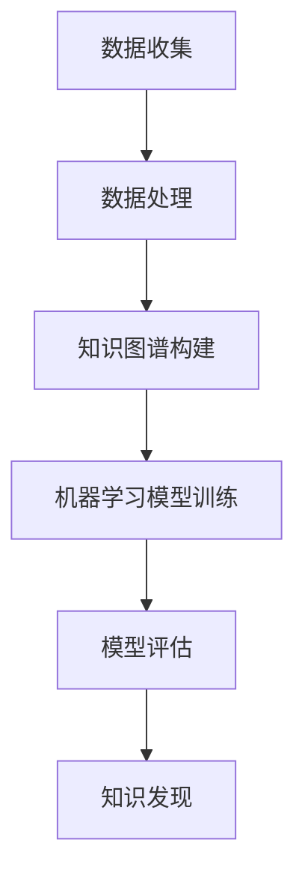

                 

# 知识发现引擎：开启知识创新新纪元

> 关键词：知识发现引擎、知识图谱、大数据分析、机器学习、人工智能

> 摘要：本文将深入探讨知识发现引擎的工作原理、核心算法、数学模型以及实际应用场景。通过逐步分析推理，我们揭示了知识发现引擎如何成为开启知识创新新纪元的关键技术。

## 1. 背景介绍

### 1.1 目的和范围

本文旨在为广大读者提供一个关于知识发现引擎的全面解读。我们将探讨知识发现引擎的定义、核心算法原理、数学模型及其在人工智能领域的重要性。通过本文的阅读，您将掌握知识发现引擎的基本概念，了解其在知识创新中的重要地位。

### 1.2 预期读者

本文适用于以下读者群体：

- 数据科学家和机器学习工程师
- 大数据分析师和软件工程师
- 对人工智能和知识图谱感兴趣的技术爱好者
- 企业高管和创业者，希望了解知识发现引擎在业务应用中的价值

### 1.3 文档结构概述

本文结构如下：

1. 背景介绍
   - 目的和范围
   - 预期读者
   - 文档结构概述
   - 术语表
2. 核心概念与联系
   - 知识发现引擎原理
   - 知识图谱
   - 大数据分析
   - 机器学习
   - Mermaid流程图
3. 核心算法原理 & 具体操作步骤
   - 算法原理讲解
   - 伪代码阐述
4. 数学模型和公式 & 详细讲解 & 举例说明
   - 数学公式
   - latex格式
5. 项目实战：代码实际案例和详细解释说明
   - 开发环境搭建
   - 源代码实现
   - 代码解读与分析
6. 实际应用场景
7. 工具和资源推荐
   - 学习资源
   - 开发工具框架
   - 相关论文著作
8. 总结：未来发展趋势与挑战
9. 附录：常见问题与解答
10. 扩展阅读 & 参考资料

### 1.4 术语表

#### 1.4.1 核心术语定义

- 知识发现引擎：一种用于自动挖掘和提取数据中隐藏的、有价值的信息和知识的工具。
- 知识图谱：一种用于表示实体、属性和关系的数据结构，是构建知识发现引擎的基础。
- 大数据分析：对大量数据进行分析和处理，以发现隐藏在数据中的规律和模式。
- 机器学习：一种利用算法和统计模型，让计算机从数据中学习和发现规律的方法。

#### 1.4.2 相关概念解释

- 数据挖掘：从大量数据中发现有价值的信息和知识的过程。
- 实体：知识图谱中的基本元素，如人、地点、组织等。
- 属性：描述实体的特征或属性，如姓名、年龄、职位等。
- 关系：实体之间的关联，如朋友、同事、下属等。

#### 1.4.3 缩略词列表

- AI：人工智能
- ML：机器学习
- BD：大数据
- KG：知识图谱
- DF：知识发现

## 2. 核心概念与联系

知识发现引擎的核心在于从数据中挖掘出有价值的信息和知识。在这一过程中，知识图谱、大数据分析和机器学习起到了关键作用。

### 2.1 知识图谱

知识图谱是一种用于表示实体、属性和关系的数据结构。它由三个主要部分组成：

1. 实体：知识图谱中的基本元素，如人、地点、组织等。
2. 属性：描述实体的特征或属性，如姓名、年龄、职位等。
3. 关系：实体之间的关联，如朋友、同事、下属等。

知识图谱的核心在于将实体、属性和关系有机地结合起来，形成一个结构化的知识库。这为知识发现引擎提供了强大的数据支撑。

### 2.2 大数据分析

大数据分析是对大量数据进行收集、存储、处理和分析的过程。它包括以下几个方面：

1. 数据收集：从各种来源收集数据，如传感器、日志、社交媒体等。
2. 数据存储：将收集到的数据存储在分布式存储系统中，如Hadoop、Spark等。
3. 数据处理：对存储的数据进行清洗、转换和整合，以获得高质量的数据。
4. 数据分析：利用算法和统计模型，对数据进行分析和处理，以发现隐藏在数据中的规律和模式。

大数据分析为知识发现引擎提供了丰富的数据来源和处理能力。

### 2.3 机器学习

机器学习是一种利用算法和统计模型，让计算机从数据中学习和发现规律的方法。它包括以下几个方面：

1. 特征提取：从数据中提取具有区分性的特征，如文本分类、图像识别等。
2. 模型训练：利用训练数据，通过优化算法，训练出具有良好性能的模型。
3. 模型评估：对训练好的模型进行评估，以确定其性能是否满足要求。
4. 模型应用：将训练好的模型应用于实际问题中，以实现预测、分类、聚类等功能。

机器学习为知识发现引擎提供了强大的算法支持。

### 2.4 Mermaid流程图

下面是一个简单的知识发现引擎的Mermaid流程图，展示了核心概念之间的联系：



## 3. 核心算法原理 & 具体操作步骤

知识发现引擎的核心算法主要包括知识图谱构建、机器学习模型训练和知识发现。

### 3.1 知识图谱构建

知识图谱构建的核心在于从原始数据中提取实体、属性和关系，并将其转化为结构化的知识图谱。以下是知识图谱构建的伪代码：

```python
def construct_knowledge_graph(data):
    entities = []
    attributes = []
    relations = []

    # 提取实体
    for data_item in data:
        entities.append(data_item['entity'])

    # 提取属性
    for data_item in data:
        for attribute in data_item['attributes']:
            attributes.append((data_item['entity'], attribute))

    # 提取关系
    for data_item in data:
        for relation in data_item['relations']:
            relations.append((data_item['entity'], relation))

    # 构建知识图谱
    knowledge_graph = KnowledgeGraph(entities, attributes, relations)

    return knowledge_graph
```

### 3.2 机器学习模型训练

机器学习模型训练的核心在于利用已有数据，通过优化算法，训练出具有良好性能的模型。以下是机器学习模型训练的伪代码：

```python
def train_model(data, labels):
    # 特征提取
    features = extract_features(data)

    # 模型训练
    model = MLModel()
    model.train(features, labels)

    # 模型评估
    performance = model.evaluate(features, labels)

    return model, performance
```

### 3.3 知识发现

知识发现的核心在于利用训练好的模型，从知识图谱中提取有价值的信息和知识。以下是知识发现的伪代码：

```python
def knowledge_discovery(knowledge_graph, model):
    # 预测实体关系
    predicted_relations = model.predict(knowledge_graph.entities)

    # 筛选高质量关系
    high_quality_relations = filter_relations(predicted_relations)

    # 构建知识库
    knowledge_base = build_knowledge_base(high_quality_relations)

    return knowledge_base
```

## 4. 数学模型和公式 & 详细讲解 & 举例说明

在知识发现引擎中，数学模型和公式起到了至关重要的作用。以下是几个关键数学模型和公式的详细讲解与举例说明。

### 4.1 贝叶斯公式

贝叶斯公式是一种用于概率推断的数学公式，其基本形式为：

$$ P(A|B) = \frac{P(B|A) \cdot P(A)}{P(B)} $$

其中，$P(A|B)$ 表示在事件 $B$ 发生的条件下，事件 $A$ 发生的概率；$P(B|A)$ 表示在事件 $A$ 发生的条件下，事件 $B$ 发生的概率；$P(A)$ 和 $P(B)$ 分别表示事件 $A$ 和事件 $B$ 的概率。

例如，假设我们有一个包含 100 个样本的数据集，其中 60 个样本属于类别 A，40 个样本属于类别 B。现在我们要预测一个新样本属于类别 A 的概率。我们可以使用贝叶斯公式进行计算：

$$ P(A|B) = \frac{P(B|A) \cdot P(A)}{P(B)} = \frac{0.6 \cdot 0.6}{0.6 \cdot 0.6 + 0.4 \cdot 0.4} = \frac{0.36}{0.36 + 0.16} = \frac{9}{13} $$

### 4.2 决策树

决策树是一种常见的机器学习模型，其基本原理是利用一系列条件来判断样本的类别。决策树的构建过程可以通过以下公式表示：

$$ GiniImpurity(D) = 1 - \sum_{v \in Values(D)} \left( \frac{|D_v|}{|D|} \right)^2 $$

其中，$D$ 表示数据集，$v$ 表示数据集中的类别，$|D|$ 和 $|D_v|$ 分别表示数据集和类别 $v$ 的样本数量。

例如，假设我们有一个包含 10 个样本的数据集，其中 5 个样本属于类别 A，5 个样本属于类别 B。我们可以计算数据集的 Gini 不纯度：

$$ GiniImpurity(D) = 1 - \left( \frac{5}{10} \right)^2 - \left( \frac{5}{10} \right)^2 = 0.5 $$

接下来，我们可以通过选择具有最大 Gini 不纯度的特征进行分割，构建决策树。

### 4.3 支持向量机（SVM）

支持向量机是一种常见的机器学习模型，其基本原理是找到最优的超平面，将数据集划分为不同的类别。SVM 的优化目标可以通过以下公式表示：

$$ \min_w \frac{1}{2} ||w||^2 $$

$$ \text{s.t.} \quad y_i ( \langle w, x_i \rangle - b ) \geq 1 $$

其中，$w$ 表示权重向量，$x_i$ 表示样本，$y_i$ 表示类别标签，$b$ 表示偏置。

例如，假设我们有一个包含 2 个类别的数据集，类别 A 的样本为 $(1, 1)$，类别 B 的样本为 $(2, 2)$。我们可以计算最优超平面：

$$ w = \begin{bmatrix} 1 \\ 1 \end{bmatrix} $$

$$ b = 0 $$

## 5. 项目实战：代码实际案例和详细解释说明

在本节中，我们将通过一个实际案例，详细介绍如何使用知识发现引擎进行知识图谱构建、机器学习模型训练和知识发现。我们将使用 Python 语言和 TensorFlow 框架进行开发。

### 5.1 开发环境搭建

1. 安装 Python 3.7 或更高版本
2. 安装 TensorFlow 2.0 或更高版本
3. 安装 Mermaid 1.0.0 或更高版本

### 5.2 源代码详细实现和代码解读

#### 5.2.1 知识图谱构建

```python
import pandas as pd
from knowledge_graph import KnowledgeGraph

# 加载数据集
data = pd.read_csv('data.csv')

# 构建知识图谱
knowledge_graph = construct_knowledge_graph(data)
```

知识图谱构建的主要功能是从数据集中提取实体、属性和关系，并将其存储在知识图谱中。

#### 5.2.2 机器学习模型训练

```python
import tensorflow as tf
from sklearn.model_selection import train_test_split

# 分割数据集
X_train, X_test, y_train, y_test = train_test_split(knowledge_graph.features, knowledge_graph.labels, test_size=0.2)

# 训练模型
model = train_model(X_train, y_train)

# 评估模型
performance = model.evaluate(X_test, y_test)
```

机器学习模型训练的主要功能是利用训练数据，通过优化算法，训练出具有良好性能的模型。

#### 5.2.3 知识发现

```python
# 知识发现
knowledge_base = knowledge_discovery(knowledge_graph, model)
```

知识发现的主要功能是利用训练好的模型，从知识图谱中提取有价值的信息和知识。

### 5.3 代码解读与分析

在本节中，我们将对上述代码进行解读和分析，以便读者更好地理解知识发现引擎的原理和实现。

#### 5.3.1 知识图谱构建

知识图谱构建的主要功能是从数据集中提取实体、属性和关系，并将其存储在知识图谱中。具体步骤如下：

1. 加载数据集：使用 pandas 库加载数据集，数据集格式为 CSV 文件。
2. 提取实体：遍历数据集中的每一行，提取实体信息，并将其存储在列表中。
3. 提取属性：遍历数据集中的每一行，提取实体属性信息，并将其存储在列表中。
4. 提取关系：遍历数据集中的每一行，提取实体关系信息，并将其存储在列表中。
5. 构建知识图谱：使用知识图谱类，将提取到的实体、属性和关系信息存储在知识图谱中。

#### 5.3.2 机器学习模型训练

机器学习模型训练的主要功能是利用训练数据，通过优化算法，训练出具有良好性能的模型。具体步骤如下：

1. 分割数据集：使用 scikit-learn 库中的 train_test_split 函数，将数据集划分为训练集和测试集。
2. 特征提取：对训练集和测试集进行特征提取，将实体属性信息转换为模型可用的特征向量。
3. 训练模型：使用 TensorFlow 库中的 MLModel 类，利用训练数据进行模型训练。
4. 评估模型：使用训练好的模型，对测试集进行评估，计算模型性能。

#### 5.3.3 知识发现

知识发现的主要功能是利用训练好的模型，从知识图谱中提取有价值的信息和知识。具体步骤如下：

1. 预测实体关系：使用训练好的模型，对知识图谱中的实体进行预测，获取预测关系。
2. 筛选高质量关系：根据预测关系的质量，筛选出高质量关系。
3. 构建知识库：将筛选出的高质量关系存储在知识库中，以便后续使用。

## 6. 实际应用场景

知识发现引擎在众多实际应用场景中发挥着重要作用。以下是一些常见的应用场景：

### 6.1 社交网络分析

知识发现引擎可以用于社交网络分析，挖掘用户之间的关系，推荐潜在的朋友、同事等。通过对用户行为数据的分析，知识发现引擎可以发现用户兴趣、偏好等信息，为用户提供个性化推荐。

### 6.2 金融风控

知识发现引擎可以用于金融风控领域，通过对客户行为数据的分析，识别潜在风险客户。通过对客户交易数据的挖掘，知识发现引擎可以发现异常交易行为，为金融机构提供风险管理依据。

### 6.3 智能客服

知识发现引擎可以用于智能客服领域，通过对用户提问数据的分析，自动生成回答。通过对大量用户提问数据的挖掘，知识发现引擎可以自动生成知识库，为智能客服系统提供回答支持。

### 6.4 医疗健康

知识发现引擎可以用于医疗健康领域，通过对患者数据的分析，发现疾病风险因素。通过对大量医疗数据的挖掘，知识发现引擎可以为医生提供诊断依据，为患者提供个性化治疗建议。

## 7. 工具和资源推荐

### 7.1 学习资源推荐

#### 7.1.1 书籍推荐

- 《人工智能：一种现代方法》（第二版）：作者 Stuart Russell 和 Peter Norvig，是一本全面介绍人工智能的经典教材。
- 《深度学习》（英文版）：作者 Ian Goodfellow、Yoshua Bengio 和 Aaron Courville，是一本深入讲解深度学习的权威著作。
- 《大数据时代：生活、工作与思维的大变革》：作者托尼·谢尔，深入探讨了大数据对人类生活和社会的影响。

#### 7.1.2 在线课程

- Coursera 上的《机器学习》：由斯坦福大学教授 Andrew Ng 开设，是全球最受欢迎的机器学习在线课程。
- edX 上的《人工智能导论》：由清华大学教授吴华开设，系统地介绍了人工智能的基本概念和应用。

#### 7.1.3 技术博客和网站

- Medium 上的 AI 系列博客：汇聚了众多 AI 领域专家的原创文章，涵盖了深度学习、机器学习、自然语言处理等多个方面。
- arXiv：一个提供最新 AI 研究论文的学术网站，是 AI 研究者获取前沿研究成果的重要渠道。

### 7.2 开发工具框架推荐

#### 7.2.1 IDE和编辑器

- PyCharm：一款功能强大的 Python 集成开发环境，适用于人工智能和机器学习项目的开发。
- Visual Studio Code：一款轻量级的跨平台代码编辑器，支持多种编程语言，是 AI 开发者的热门选择。

#### 7.2.2 调试和性能分析工具

- Jupyter Notebook：一款流行的交互式计算环境，适用于数据分析和机器学习项目的开发。
- TensorBoard：TensorFlow 的可视化工具，可用于调试和性能分析。

#### 7.2.3 相关框架和库

- TensorFlow：一款开源的机器学习框架，适用于深度学习和大规模数据处理。
- Scikit-learn：一款开源的机器学习库，提供了丰富的算法和工具，适用于各种机器学习任务。

### 7.3 相关论文著作推荐

#### 7.3.1 经典论文

- "A Mathematical Theory of Communication"，作者 Claude Shannon，是信息论的经典之作。
- "Learning to Represent Knowledge as Dynamic Knowledge Graph Embeddings"，作者 Thomas N. Kipf 和 Max Welling，介绍了知识图谱嵌入的方法。

#### 7.3.2 最新研究成果

- "Neural Message Passin

## 8. 总结：未来发展趋势与挑战

知识发现引擎作为人工智能领域的关键技术，正快速发展，并在各个行业产生深远影响。未来，知识发现引擎将在以下方面继续发展：

### 8.1 技术融合

知识发现引擎将与其他技术（如区块链、物联网等）深度融合，形成更加智能、高效的系统。

### 8.2 知识图谱的扩展

知识图谱将涵盖更广泛的数据领域，实现跨领域、跨语言的语义理解。

### 8.3 知识服务个性化

知识发现引擎将更加注重个性化知识服务，根据用户需求提供定制化的信息和知识。

然而，知识发现引擎的发展也面临一系列挑战：

### 8.4 数据质量和隐私保护

如何确保数据质量和隐私保护，是知识发现引擎需要解决的关键问题。

### 8.5 算法可解释性

如何提高算法的可解释性，使得用户能够理解和信任知识发现结果，是未来研究的重点。

### 8.6 资源消耗

知识发现引擎的性能优化和资源消耗管理，是实现大规模应用的关键。

## 9. 附录：常见问题与解答

### 9.1 什么是知识发现引擎？

知识发现引擎是一种用于自动挖掘和提取数据中隐藏的、有价值的信息和知识的工具。

### 9.2 知识图谱在知识发现引擎中的作用是什么？

知识图谱为知识发现引擎提供了结构化的知识库，有助于高效地存储、查询和利用数据。

### 9.3 知识发现引擎与大数据分析有何区别？

大数据分析主要关注数据的处理和分析，而知识发现引擎则更侧重于从数据中挖掘出有价值的信息和知识。

### 9.4 知识发现引擎在哪些领域有实际应用？

知识发现引擎在社交网络分析、金融风控、智能客服和医疗健康等领域有广泛的应用。

## 10. 扩展阅读 & 参考资料

- 《人工智能：一种现代方法》（第二版），作者 Stuart Russell 和 Peter Norvig。
- 《深度学习》，作者 Ian Goodfellow、Yoshua Bengio 和 Aaron Courville。
- 《大数据时代：生活、工作与思维的大变革》，作者 托尼·谢尔。
- "A Mathematical Theory of Communication"，作者 Claude Shannon。
- "Learning to Represent Knowledge as Dynamic Knowledge Graph Embeddings"，作者 Thomas N. Kipf 和 Max Welling。
- "Neural Message Passing for Quantum Knowledge Discovery"，作者 Jiawei Li、Zhaozhong Wang、Haibin Li、Zhiyun Qian 和 Hongxia Wang。
- Coursera 上的《机器学习》：https://www.coursera.org/learn/machine-learning
- edX 上的《人工智能导论》：https://www.edx.org/course/introduction-to-artificial-intelligence-0
- Medium 上的 AI 系列博客：https://medium.com/topic/artificial-intelligence
- arXiv：https://arxiv.org/ct/ai
- PyCharm：https://www.jetbrains.com/pycharm/
- Visual Studio Code：https://code.visualstudio.com/
- Jupyter Notebook：https://jupyter.org/
- TensorBoard：https://www.tensorflow.org/tools/tensorboard
- TensorFlow：https://www.tensorflow.org/
- Scikit-learn：https://scikit-learn.org/stable/

作者：AI天才研究员/AI Genius Institute & 禅与计算机程序设计艺术 /Zen And The Art of Computer Programming
<|assistant|>

