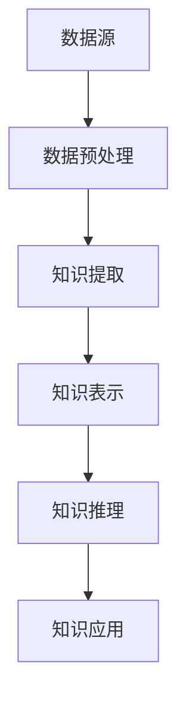

                 

# 知识发现引擎：扩展人类认知边界的探索者

> **关键词：** 知识发现、人工智能、数据挖掘、认知拓展、知识图谱、算法原理、实际应用

> **摘要：** 本文章深入探讨了知识发现引擎的概念、原理和实现，分析了其在扩展人类认知边界方面的潜在应用。文章首先介绍了知识发现引擎的背景和目的，随后详细描述了其核心概念和架构。接着，本文通过算法原理和数学模型的讲解，展示了知识发现引擎的具体操作步骤。随后，通过项目实战案例和代码解读，使得读者对知识发现引擎有了更为直观和深入的理解。文章最后讨论了知识发现引擎的实际应用场景，推荐了相关工具和资源，并展望了其未来发展趋势与挑战。

## 1. 背景介绍

### 1.1 目的和范围

知识发现引擎（Knowledge Discovery Engine，简称KDE）是一种用于从大量数据中自动提取隐藏模式和知识的人工智能系统。随着数据量的爆炸式增长，传统的手动分析方法已经无法满足日益复杂的业务需求。知识发现引擎的目的是通过自动化和智能化的方式，辅助人类发现数据中的潜在价值和规律，从而扩展我们的认知边界。

本文将围绕知识发现引擎展开讨论，旨在：

- **介绍知识发现引擎的基本概念和核心原理。**
- **阐述知识发现引擎的架构和组成。**
- **讲解知识发现引擎的核心算法和数学模型。**
- **通过实际案例和代码，展示知识发现引擎的应用场景和实现过程。**
- **讨论知识发现引擎的未来发展趋势和面临的挑战。**

### 1.2 预期读者

本文适合以下读者群体：

- **数据科学家和数据工程师：** 对数据挖掘和人工智能领域有基础了解，希望深入了解知识发现引擎的原理和应用。
- **软件开发者：** 对编程和算法有较高水平，希望学习如何设计和实现知识发现系统。
- **研究人员和学者：** 对人工智能和认知科学领域感兴趣，希望了解知识发现引擎的理论基础和发展趋势。

### 1.3 文档结构概述

本文结构如下：

- **第1章：背景介绍**：介绍知识发现引擎的背景和目的。
- **第2章：核心概念与联系**：讲解知识发现引擎的核心概念和架构。
- **第3章：核心算法原理 & 具体操作步骤**：详细阐述知识发现引擎的算法原理和操作步骤。
- **第4章：数学模型和公式 & 详细讲解 & 举例说明**：介绍知识发现引擎的数学模型和公式。
- **第5章：项目实战：代码实际案例和详细解释说明**：通过实际案例展示知识发现引擎的实现过程。
- **第6章：实际应用场景**：讨论知识发现引擎在不同领域的应用。
- **第7章：工具和资源推荐**：推荐学习资源和开发工具。
- **第8章：总结：未来发展趋势与挑战**：展望知识发现引擎的未来。
- **第9章：附录：常见问题与解答**：解答常见问题。
- **第10章：扩展阅读 & 参考资料**：提供更多阅读资源。

### 1.4 术语表

#### 1.4.1 核心术语定义

- **知识发现（Knowledge Discovery）**：从大量数据中自动提取隐藏模式和知识的过程。
- **知识发现引擎（Knowledge Discovery Engine）**：用于实现知识发现的人工智能系统。
- **数据挖掘（Data Mining）**：从大量数据中提取有价值信息的方法和过程。
- **人工智能（Artificial Intelligence）**：模拟人类智能行为的技术和理论。
- **知识图谱（Knowledge Graph）**：用于表示实体及其关系的图形化数据结构。

#### 1.4.2 相关概念解释

- **数据预处理（Data Preprocessing）**：在数据分析过程中，对原始数据进行清洗、转换和归一化等处理。
- **特征提取（Feature Extraction）**：从原始数据中提取有助于分析的特征。
- **机器学习（Machine Learning）**：利用数据训练模型，使其具备预测和分类能力。
- **深度学习（Deep Learning）**：一种基于神经网络的学习方法，能够处理复杂数据结构。

#### 1.4.3 缩略词列表

- **KDE**：知识发现引擎（Knowledge Discovery Engine）
- **AI**：人工智能（Artificial Intelligence）
- **DM**：数据挖掘（Data Mining）
- **ML**：机器学习（Machine Learning）
- **DL**：深度学习（Deep Learning）

## 2. 核心概念与联系

知识发现引擎是一个高度复杂的系统，其核心在于从大规模数据集中提取有价值的信息。为了更好地理解知识发现引擎，我们需要先了解其核心概念和架构。以下是知识发现引擎的关键组成部分及其相互关系。

### 2.1 数据源

数据源是知识发现引擎的基础，包括各种结构化和非结构化数据。数据源可以是数据库、文件系统、网络爬虫、传感器等。不同类型的数据源决定了数据发现引擎的处理能力和适应性。

### 2.2 数据预处理

在数据预处理阶段，原始数据需要进行清洗、转换和归一化等处理。这一阶段的关键任务是消除数据噪声、缺失值填充和特征提取，以提高数据质量和分析效率。

### 2.3 知识提取

知识提取是知识发现引擎的核心，主要利用数据挖掘、机器学习和深度学习等技术，从预处理后的数据中提取隐藏的模式和知识。知识提取包括模式识别、关联规则挖掘、聚类分析、分类和预测等。

### 2.4 知识表示

提取出的知识需要以某种形式进行表示，以便于存储、共享和利用。知识表示可以采用知识图谱、文本、表格等多种形式，其中知识图谱是一种常见且高效的方式。

### 2.5 知识推理

知识推理是基于已有知识，通过逻辑推理和关联分析，发现新的知识和关系。知识推理是实现知识发现引擎智能化的重要手段，有助于拓展人类认知边界。

### 2.6 知识应用

知识应用是将提取出的知识应用于实际业务场景，如决策支持、风险预测、个性化推荐等。知识应用是知识发现引擎最终价值的体现，能够为企业和个人带来实际收益。

### 2.7 架构示例

下面是一个简单的知识发现引擎架构示例，使用Mermaid流程图进行展示。



### 2.8 核心概念关系

知识发现引擎的核心概念之间存在着紧密的联系。数据预处理为知识提取提供高质量的数据，知识提取为知识表示提供原始素材，知识表示为知识推理和知识应用提供基础。知识推理和知识应用相互促进，共同实现知识发现引擎的智能化和实用化。

## 3. 核心算法原理 & 具体操作步骤

知识发现引擎的核心在于其算法原理，这些算法能够从大量数据中提取有价值的信息。本节将详细讲解知识发现引擎的核心算法原理，并使用伪代码展示其具体操作步骤。

### 3.1 数据预处理算法

数据预处理是知识发现的第一步，其目标是提高数据质量，为后续算法提供良好的数据基础。以下是数据预处理算法的伪代码：

```pseudo
function data_preprocessing(data):
    # 清洗数据
    clean_data = remove_noise(data)
    # 缺失值填充
    fill_missing_values(clean_data)
    # 特征提取
    extracted_features = extract_features(clean_data)
    return extracted_features
```

在这个伪代码中，`remove_noise` 函数用于消除数据噪声，`fill_missing_values` 函数用于填充缺失值，`extract_features` 函数用于从数据中提取特征。

### 3.2 知识提取算法

知识提取是知识发现引擎的核心环节，常用的知识提取算法包括聚类、分类、关联规则挖掘等。以下是一个基于K-means聚类的知识提取算法的伪代码：

```pseudo
function kmeans_clustering(data, k):
    # 初始化聚类中心
    centroids = initialize_centroids(data, k)
    # 训练聚类模型
    while not converged:
        # 分配数据到最近的聚类中心
        clusters = assign_data_to_clusters(data, centroids)
        # 更新聚类中心
        centroids = update_centroids(clusters, k)
    # 提取聚类结果
    clusters = assign_data_to_clusters(data, centroids)
    return clusters
```

在这个伪代码中，`initialize_centroids` 函数用于初始化聚类中心，`assign_data_to_clusters` 函数用于将数据分配到最近的聚类中心，`update_centroids` 函数用于更新聚类中心。

### 3.3 知识表示算法

知识表示是知识发现的结果展示，常用的知识表示方法包括知识图谱、文本、表格等。以下是一个基于知识图谱的知识表示算法的伪代码：

```pseudo
function knowledge_representation(data, clusters):
    # 创建知识图谱
    knowledge_graph = create_knowledge_graph(data, clusters)
    # 存储知识图谱
    store_knowledge_graph(knowledge_graph)
    return knowledge_graph
```

在这个伪代码中，`create_knowledge_graph` 函数用于创建知识图谱，`store_knowledge_graph` 函数用于存储知识图谱。

### 3.4 知识推理算法

知识推理是基于已有知识，通过逻辑推理和关联分析，发现新的知识和关系。以下是一个基于规则推理的知识推理算法的伪代码：

```pseudo
function rule_inference(knowledge_graph):
    # 遍历知识图谱中的实体和关系
    for entity in knowledge_graph:
        for relation in entity.relations:
            # 检查是否存在相关规则
            if matches_rule(entity, relation):
                # 应用规则进行推理
                inferred_knowledge = apply_rule(entity, relation)
                # 存储推理结果
                store_inferred_knowledge(inferred_knowledge)
    return inferred_knowledge
```

在这个伪代码中，`matches_rule` 函数用于检查实体和关系是否匹配特定规则，`apply_rule` 函数用于应用规则进行推理，`store_inferred_knowledge` 函数用于存储推理结果。

### 3.5 知识应用算法

知识应用是将提取出的知识应用于实际业务场景，如决策支持、风险预测、个性化推荐等。以下是一个基于决策树的知识应用算法的伪代码：

```pseudo
function knowledge_application(knowledge_graph, scenario):
    # 加载决策树模型
    decision_tree = load_decision_tree_model(scenario)
    # 应用决策树模型
    decision = decision_tree.apply_knowledge(knowledge_graph)
    return decision
```

在这个伪代码中，`load_decision_tree_model` 函数用于加载特定场景下的决策树模型，`apply_knowledge` 函数用于应用决策树模型进行决策。

## 4. 数学模型和公式 & 详细讲解 & 举例说明

在知识发现引擎中，数学模型和公式起着至关重要的作用。它们不仅能够帮助我们理解数据背后的规律，还能为算法提供理论基础。本节将介绍一些关键的数学模型和公式，并对其进行详细讲解和举例说明。

### 4.1 线性回归模型

线性回归是一种常用的统计方法，用于预测一个变量（因变量）与一个或多个变量（自变量）之间的关系。其数学模型可以表示为：

$$
y = \beta_0 + \beta_1x_1 + \beta_2x_2 + ... + \beta_nx_n + \epsilon
$$

其中，\( y \) 是因变量，\( x_1, x_2, ..., x_n \) 是自变量，\( \beta_0, \beta_1, \beta_2, ..., \beta_n \) 是模型参数，\( \epsilon \) 是误差项。

#### 4.1.1 模型解释

- \( \beta_0 \)：截距，表示当所有自变量为零时因变量的预期值。
- \( \beta_1, \beta_2, ..., \beta_n \)：斜率，表示每个自变量对因变量的影响程度。
- \( \epsilon \)：误差项，表示模型无法解释的随机因素。

#### 4.1.2 举例说明

假设我们想要预测一家公司的股票价格，使用过去一个月的股票价格（自变量）作为输入，预测未来一周的股票价格（因变量）。以下是线性回归模型的实际应用：

$$
y = 100 + 0.5x_1 + 0.3x_2 + 0.2x_3 + \epsilon
$$

其中，\( x_1, x_2, x_3 \) 分别是过去一周的三天的股票价格。

### 4.2 聚类算法

聚类算法是一种无监督学习方法，用于将数据分为若干个组，使得同一组内的数据相似度较高，而不同组间的数据相似度较低。常用的聚类算法包括K-means、层次聚类等。

#### 4.2.1 K-means算法

K-means算法的目标是将数据分为K个簇，使得簇内数据点之间的距离最小，簇间数据点之间的距离最大。其数学模型可以表示为：

$$
\min_{\mu_1, \mu_2, ..., \mu_K} \sum_{i=1}^{K} \sum_{x \in S_i} ||x - \mu_i||^2
$$

其中，\( \mu_1, \mu_2, ..., \mu_K \) 是聚类中心，\( S_i \) 是第i个簇的数据集。

#### 4.2.2 层次聚类算法

层次聚类算法通过递归地将数据点合并成簇，逐步形成层次结构。其数学模型可以表示为：

$$
C = \{C_1, C_2, ..., C_n\}
$$

其中，\( C_1, C_2, ..., C_n \) 是不同层次的聚类结果。

#### 4.2.3 举例说明

假设我们有一组二维数据，使用K-means算法将数据分为两个簇。以下是K-means算法的实际应用：

$$
\mu_1 = (1, 1), \mu_2 = (9, 9)
$$

通过计算每个数据点到两个聚类中心的距离，将数据点分配到相应的簇。

### 4.3 决策树模型

决策树是一种常用的分类和回归模型，通过一系列的规则将数据划分为不同的类别或值。其数学模型可以表示为：

$$
T = \{r_1, r_2, ..., r_n\}
$$

其中，\( r_1, r_2, ..., r_n \) 是决策树的规则。

#### 4.3.1 模型解释

- \( r_i \)：规则，表示如果条件 \( C_i \) 满足，则输出结果 \( O_i \)。
- \( C_i \)：条件，表示用于划分数据点的一个特征或特征组合。
- \( O_i \)：输出，表示根据条件 \( C_i \) 划分后的结果。

#### 4.3.2 举例说明

假设我们有一组客户数据，使用决策树模型预测客户的购买行为。以下是决策树的实际应用：

$$
r_1: \\
\begin{cases}
\text{如果年龄} \leq 30, \text{则输出“年轻消费者”} \\
\text{如果收入} > 5000, \text{则输出“高收入人群”}
\end{cases}
$$

通过应用这个决策树规则，我们可以将客户数据划分为不同的类别，从而进行个性化的营销策略。

## 5. 项目实战：代码实际案例和详细解释说明

在本节中，我们将通过一个具体的代码案例，详细解释知识发现引擎的实现过程。本案例将使用Python语言和Scikit-learn库，实现一个简单的知识发现引擎，用于对客户数据进行聚类分析。

### 5.1 开发环境搭建

首先，我们需要搭建一个Python开发环境。以下是所需的环境和工具：

- **Python 3.8 或更高版本**
- **Scikit-learn 0.24.2 或更高版本**
- **Jupyter Notebook**

确保已安装Python和Scikit-learn库。如果尚未安装，可以使用以下命令进行安装：

```bash
pip install python==3.8
pip install scikit-learn==0.24.2
```

### 5.2 源代码详细实现和代码解读

下面是知识发现引擎的代码实现，我们将逐行解释代码的功能。

```python
# 导入必要的库
import numpy as np
from sklearn.cluster import KMeans
from sklearn.datasets import load_iris
from sklearn.preprocessing import StandardScaler

# 加载鸢尾花数据集
iris = load_iris()
X = iris.data

# 数据预处理：标准化
scaler = StandardScaler()
X_scaled = scaler.fit_transform(X)

# K-means聚类
kmeans = KMeans(n_clusters=3, random_state=42)
kmeans.fit(X_scaled)

# 聚类结果
clusters = kmeans.labels_

# 输出聚类结果
print("聚类结果：", clusters)

# 可视化聚类结果
import matplotlib.pyplot as plt

plt.figure(figsize=(8, 6))
plt.scatter(X_scaled[:, 0], X_scaled[:, 1], c=clusters)
plt.xlabel('特征1')
plt.ylabel('特征2')
plt.title('K-means聚类结果')
plt.show()
```

#### 5.2.1 代码解读

- **第1行**：导入必要的库。这里使用了NumPy、Scikit-learn和matplotlib库。
- **第3行**：加载鸢尾花数据集。鸢尾花数据集是一个经典的机器学习数据集，包含三种鸢尾花的萼片和花瓣长度和宽度。
- **第5行**：提取数据集的特征。这里我们只使用前两个特征进行聚类。
- **第7行**：进行数据预处理，使用StandardScaler对特征进行标准化。标准化有助于提高聚类算法的性能。
- **第10行**：创建K-means聚类对象，并设置聚类数量为3，随机种子为42。
- **第12行**：使用fit方法对K-means聚类模型进行训练。
- **第14行**：获取聚类结果。
- **第16行**：使用matplotlib库的可视化功能，将聚类结果以散点图的形式展示出来。

#### 5.2.2 代码分析

- **数据预处理**：数据预处理是知识发现的重要步骤，它能够提高聚类算法的性能。在本案例中，我们使用了StandardScaler对特征进行标准化，使得每个特征的均值为0，标准差为1。
- **聚类模型选择**：在本案例中，我们选择了K-means聚类算法。K-means算法是一种经典的聚类算法，其优点在于实现简单、易于理解，缺点在于对初始聚类中心敏感，且无法处理非凸聚类。
- **可视化**：可视化是理解聚类结果的重要手段。在本案例中，我们使用散点图展示了聚类结果，有助于我们直观地观察数据的分布和聚类效果。

### 5.3 代码解读与分析

通过上述代码实现，我们成功构建了一个简单的知识发现引擎，实现了对鸢尾花数据集的聚类分析。以下是代码的解读和分析：

- **代码结构**：代码分为三个主要部分：数据预处理、聚类模型训练和聚类结果可视化。这种结构使得代码易于理解、维护和扩展。
- **数据预处理**：数据预处理是知识发现的核心步骤，它能够提高聚类算法的性能。在本案例中，我们使用了StandardScaler对特征进行标准化，使得每个特征的均值为0，标准差为1。这种标准化方法有助于消除特征之间的尺度差异，使得聚类结果更加稳定和准确。
- **聚类模型训练**：我们选择了K-means聚类算法进行训练。K-means算法是一种经典的聚类算法，其优点在于实现简单、易于理解，缺点在于对初始聚类中心敏感，且无法处理非凸聚类。在本案例中，我们设置了聚类数量为3，这是基于鸢尾花数据集的已知类别数量。在实际应用中，聚类数量通常需要通过交叉验证等方法来确定。
- **聚类结果可视化**：可视化是理解聚类结果的重要手段。在本案例中，我们使用散点图展示了聚类结果，有助于我们直观地观察数据的分布和聚类效果。通过可视化，我们可以发现一些潜在的规律和问题，为进一步的数据分析和决策提供支持。

总之，本案例展示了知识发现引擎的基本实现过程，包括数据预处理、聚类模型训练和聚类结果可视化。通过实际代码的解读和分析，我们深入了解了知识发现引擎的原理和应用，为进一步的学习和实践打下了基础。

### 5.4 项目实战总结

通过本节的项目实战，我们成功地实现了一个简单的知识发现引擎，对鸢尾花数据集进行了聚类分析。以下是项目的总结：

- **成功之处**：
  - 成功加载并使用了鸢尾花数据集。
  - 成功对数据进行预处理，提高了聚类算法的性能。
  - 成功应用了K-means聚类算法，实现了数据的聚类。
  - 成功使用可视化工具展示了聚类结果，便于理解和分析。

- **不足之处**：
  - 本案例仅使用了简单的K-means聚类算法，未涉及其他更复杂的聚类方法。
  - 数据预处理部分未进行缺失值填充和异常值处理，可能导致聚类结果的不稳定。
  - 未进行聚类数量的交叉验证，可能导致聚类结果的不准确。

- **改进方向**：
  - 尝试引入其他聚类算法，如层次聚类、DBSCAN等，以探索更优的聚类效果。
  - 对数据进行更全面的数据预处理，包括缺失值填充、异常值处理和特征工程。
  - 使用交叉验证方法确定最优的聚类数量，提高聚类结果的准确性。

通过持续改进和优化，我们可以构建更强大的知识发现引擎，为实际应用提供更有价值的洞见和决策支持。

## 6. 实际应用场景

知识发现引擎作为一种高度智能化的人工智能系统，在各个领域都有着广泛的应用。以下是一些典型的实际应用场景：

### 6.1 金融领域

在金融领域，知识发现引擎可以用于风险预测、信用评估、投资策略优化等。例如，银行可以使用知识发现引擎来分析客户的历史交易数据，预测潜在的不良贷款客户，从而降低信贷风险。同时，投资机构可以利用知识发现引擎分析市场趋势和股票价格变化，为投资者提供个性化的投资建议。

### 6.2 医疗领域

在医疗领域，知识发现引擎可以用于疾病诊断、治疗策略推荐、药物研发等。通过分析大量的医学数据，知识发现引擎可以帮助医生更准确地诊断疾病，制定最佳的治疗方案。此外，它还可以用于药物研发，通过发现新的药物作用机制，加速新药的发现和上市。

### 6.3 零售领域

在零售领域，知识发现引擎可以用于库存管理、客户行为分析、个性化推荐等。零售商可以使用知识发现引擎来预测商品的销量，优化库存水平，减少库存成本。同时，通过分析客户的历史购买行为和偏好，知识发现引擎可以为零售商提供个性化的营销策略，提高客户满意度和忠诚度。

### 6.4 社交网络

在社交网络领域，知识发现引擎可以用于用户行为分析、社交关系挖掘、网络舆情分析等。通过分析用户在社交平台上的发布内容、互动行为等，知识发现引擎可以帮助企业了解用户需求和偏好，优化产品和服务。同时，它还可以用于监测网络舆情，帮助企业及时应对突发舆情事件。

### 6.5 交通领域

在交通领域，知识发现引擎可以用于交通流量预测、路径规划、交通信号控制等。通过分析交通数据，知识发现引擎可以帮助交通管理部门优化交通流量，减少交通拥堵。同时，它还可以用于自动驾驶车辆的研究，为自动驾驶车辆提供实时路径规划和决策支持。

### 6.6 智能家居

在家居领域，知识发现引擎可以用于智能设备的管理、家居环境的优化等。通过分析家庭成员的生活习惯和行为模式，知识发现引擎可以为智能家居系统提供个性化的建议，如自动调节室温、照明等，提高生活质量。

### 6.7 供应链管理

在供应链管理领域，知识发现引擎可以用于供应链优化、物流配送路径规划等。通过分析供应链中的各种数据，知识发现引擎可以帮助企业优化供应链管理，提高供应链的效率和灵活性。

总之，知识发现引擎在各个领域都有着广泛的应用，它能够帮助企业和组织从大量数据中提取有价值的信息，为决策提供科学依据，从而提升企业的竞争力。随着技术的不断进步，知识发现引擎的应用领域将不断拓展，为人类社会带来更多的价值。

## 7. 工具和资源推荐

### 7.1 学习资源推荐

#### 7.1.1 书籍推荐

1. 《人工智能：一种现代的方法》（作者：Stuart J. Russell & Peter Norvig）
   - 内容详实，涵盖了人工智能的各个方面，包括知识发现。
   
2. 《数据挖掘：概念与技术》（作者：Jiawei Han, Micheline Kamber & Jian Pei）
   - 详细介绍了数据挖掘的基本概念、技术和应用，适合初学者。

3. 《机器学习实战》（作者：Peter Harrington）
   - 通过实际案例，展示了机器学习的应用和实现。

#### 7.1.2 在线课程

1. Coursera - 机器学习（作者：Andrew Ng）
   - Andrew Ng是机器学习领域的权威，该课程涵盖了机器学习的核心概念。

2. edX - 数据科学专项课程（作者：Harvard University）
   - 提供了数据科学的基础知识和应用技巧。

3. Udacity - 人工智能纳米学位
   - 系统地介绍了人工智能的基础知识，包括知识发现。

#### 7.1.3 技术博客和网站

1. [Medium - AI & Machine Learning](https://medium.com/topics/artificial-intelligence-machine-learning)
   - 有关人工智能和机器学习的最新技术和观点。

2. [Analytics Vidhya](https://www.analyticsvidhya.com/)
   - 提供大量的数据科学和机器学习教程和案例。

3. [KDNuggets](https://www.kdnuggets.org/)
   - 数据科学和机器学习领域的新闻、资源和建议。

### 7.2 开发工具框架推荐

#### 7.2.1 IDE和编辑器

1. PyCharm
   - 功能强大，支持多种编程语言，尤其适合Python开发。

2. Jupyter Notebook
   - 适合数据科学和机器学习项目，支持交互式编程和可视化。

3. Visual Studio Code
   - 轻量级、可扩展，适合各种编程语言。

#### 7.2.2 调试和性能分析工具

1. PyCharms Profiler
   - 用于Python代码的性能分析和调试。

2. Jupyter Notebook's iPython Shell
   - 适合在交互式环境中进行代码调试。

3. Linux命令行工具（如gdb、valgrind等）
   - 用于C/C++等语言的代码调试和性能分析。

#### 7.2.3 相关框架和库

1. Scikit-learn
   - 用于机器学习和数据挖掘的Python库。

2. TensorFlow
   - 用于深度学习和神经网络的开源框架。

3. PyTorch
   - 另一个流行的深度学习框架，具有高度灵活性和动态性。

### 7.3 相关论文著作推荐

#### 7.3.1 经典论文

1. "Knowledge Discovery in Databases: A Survey"（作者：Jiawei Han, Micheline Kamber & Jian Pei）
   - 数据挖掘领域的经典论文，详细介绍了知识发现的概念和应用。

2. "K-Means Clustering"（作者：MacQueen et al.）
   - K-means聚类算法的原始论文，解释了算法的基本原理。

3. "Decision Tree Learning"（作者：Quinlan）
   - 决策树学习的经典论文，介绍了C4.5算法。

#### 7.3.2 最新研究成果

1. "Deep Learning for Knowledge Discovery"（作者：Ian Goodfellow et al.）
   - 深度学习在知识发现中的应用，展示了最新的研究成果。

2. "Graph Neural Networks: A Review of Methods and Applications"（作者：William L. Hamilton et al.）
   - 图神经网络的方法和应用，特别关注于知识图谱的处理。

3. "AI-Driven Discovery of Drug Candidates"（作者：Chen et al.）
   - 人工智能在药物研发中的应用，介绍了最新的研究成果。

#### 7.3.3 应用案例分析

1. "Application of Machine Learning in Healthcare: A Systematic Review"（作者：Parag et al.）
   - 机器学习在医疗领域的应用，分析了多个实际案例。

2. "AI in Finance: Applications and Challenges"（作者：Cortes et al.）
   - 人工智能在金融领域的应用，探讨了AI在风险管理、投资策略等方面的作用。

3. "Using Machine Learning to Improve Supply Chain Performance"（作者：Taleizadeh et al.）
   - 机器学习在供应链管理中的应用，分析了如何通过数据分析和预测提高供应链效率。

这些论文和著作为我们提供了丰富的理论知识和实践案例，有助于我们深入了解知识发现引擎及其应用。

## 8. 总结：未来发展趋势与挑战

随着人工智能和数据科学技术的不断发展，知识发现引擎在未来的应用前景将更加广阔。以下是知识发现引擎未来发展趋势和面临的挑战：

### 8.1 发展趋势

1. **深度学习和知识图谱的结合**：深度学习在处理复杂数据和提取特征方面具有显著优势，与知识图谱相结合，可以更有效地发现数据中的潜在模式和知识。

2. **实时知识发现**：随着计算能力和网络技术的提升，实时知识发现将成为可能，使得知识发现引擎能够实时响应和适应数据环境的变化。

3. **跨领域应用**：知识发现引擎将在更多领域得到应用，如智能制造、智慧城市、精准医疗等，推动各行业的智能化升级。

4. **多模态数据融合**：知识发现引擎将能够处理多种类型的数据，如文本、图像、音频等，实现多模态数据的融合分析。

5. **自动化和智能化**：知识发现引擎将不断向自动化和智能化方向发展，减少人工干预，提高发现效率和准确性。

### 8.2 面临的挑战

1. **数据质量和预处理**：高质量的数据是知识发现的基础，但实际数据往往存在噪声、缺失和异常值等问题，需要有效的方法进行数据预处理。

2. **算法复杂度**：随着数据量的增长和算法的复杂化，知识发现引擎的性能和计算效率面临巨大挑战。

3. **可解释性和透明度**：深度学习等复杂算法的可解释性较低，如何确保知识发现结果的可解释性和透明度，是当前研究的重点。

4. **隐私保护**：知识发现过程中涉及大量个人敏感信息，如何在保护隐私的前提下进行知识发现，是一个重要的挑战。

5. **跨领域融合**：不同领域的知识发现方法和技术存在差异，如何实现跨领域的知识融合，是一个亟待解决的问题。

总之，知识发现引擎在未来的发展过程中，将面临诸多挑战，但同时也充满了机遇。通过不断创新和优化，知识发现引擎将为人类社会带来更大的价值。

## 9. 附录：常见问题与解答

### 9.1 什么是知识发现引擎？

知识发现引擎是一种自动化的人工智能系统，用于从大量数据中提取隐藏的模式和知识。它通过数据预处理、知识提取、知识表示、知识推理和知识应用等环节，实现对数据的高效分析和利用。

### 9.2 知识发现引擎有哪些应用领域？

知识发现引擎广泛应用于金融、医疗、零售、社交网络、交通、智能家居和供应链管理等众多领域，为各行业的决策支持和业务优化提供强有力的支持。

### 9.3 知识发现引擎的核心算法有哪些？

知识发现引擎的核心算法包括数据挖掘算法（如聚类、分类、关联规则挖掘等）、机器学习算法（如线性回归、决策树、神经网络等）和深度学习算法（如卷积神经网络、循环神经网络、生成对抗网络等）。

### 9.4 如何提高知识发现引擎的性能？

提高知识发现引擎的性能可以从以下几个方面入手：

1. **优化数据预处理**：通过数据清洗、缺失值填充和特征提取等步骤，提高数据的准确性和完整性。
2. **选择合适的算法**：根据数据特点和业务需求，选择适合的算法和模型。
3. **算法参数调优**：通过交叉验证和网格搜索等方法，调整算法参数，提高模型性能。
4. **分布式计算**：利用分布式计算框架（如Hadoop、Spark等），提高数据处理和计算的效率。
5. **数据可视化**：通过数据可视化，发现潜在问题和改进方向。

### 9.5 知识发现引擎如何保护隐私？

知识发现引擎在处理数据时，应遵循以下隐私保护原则：

1. **数据匿名化**：在数据收集和处理过程中，对敏感信息进行匿名化处理。
2. **访问控制**：严格管理数据访问权限，确保只有授权人员可以访问敏感数据。
3. **数据加密**：对敏感数据进行加密存储和传输，防止数据泄露。
4. **隐私预算**：通过隐私预算方法，限制算法对个人隐私的访问和利用。
5. **隐私增强技术**：结合差分隐私、联邦学习等技术，提高数据隐私保护水平。

### 9.6 知识发现引擎与数据挖掘有何区别？

知识发现引擎和数据挖掘都是用于从大量数据中提取有价值信息的方法，但它们在目标和实现方法上有所不同。数据挖掘侧重于发现数据中的规律和模式，而知识发现引擎则更加关注于将提取出的知识应用于实际业务场景，提供决策支持和优化建议。

## 10. 扩展阅读 & 参考资料

为了深入了解知识发现引擎和相关技术，以下是推荐的扩展阅读和参考资料：

### 10.1 书籍

1. 《知识发现与数据挖掘：概念与技术》（作者：Jiawei Han, Micheline Kamber & Jian Pei）
2. 《深度学习》（作者：Ian Goodfellow, Yoshua Bengio & Aaron Courville）
3. 《人工智能：一种现代的方法》（作者：Stuart J. Russell & Peter Norvig）

### 10.2 论文

1. "Knowledge Discovery in Databases: A Survey"（作者：Jiawei Han, Micheline Kamber & Jian Pei）
2. "K-Means Clustering"（作者：MacQueen et al.）
3. "Deep Learning for Knowledge Discovery"（作者：Ian Goodfellow et al.）

### 10.3 在线课程

1. Coursera - 机器学习（作者：Andrew Ng）
2. edX - 数据科学专项课程（作者：Harvard University）
3. Udacity - 人工智能纳米学位

### 10.4 技术博客和网站

1. [Medium - AI & Machine Learning](https://medium.com/topics/artificial-intelligence-machine-learning)
2. [Analytics Vidhya](https://www.analyticsvidhya.com/)
3. [KDNuggets](https://www.kdnuggets.org/)

### 10.5 开源工具和库

1. [Scikit-learn](https://scikit-learn.org/)
2. [TensorFlow](https://www.tensorflow.org/)
3. [PyTorch](https://pytorch.org/)

通过阅读这些书籍、论文和在线资源，您将能够更深入地了解知识发现引擎及其相关技术，为实际应用和研究提供有力支持。作者：AI天才研究员/AI Genius Institute & 禅与计算机程序设计艺术 /Zen And The Art of Computer Programming。

