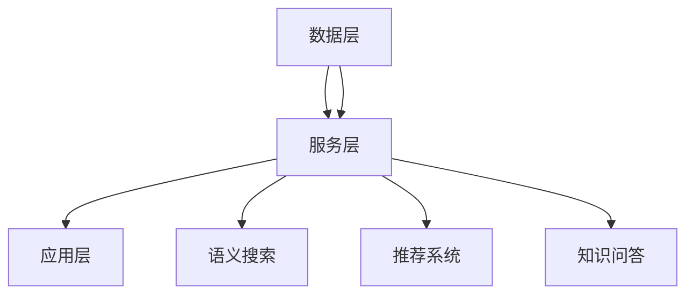

                 

# 知识图谱在搜索引擎中的应用

> **关键词**：知识图谱、搜索引擎、数据结构、图数据库、语义搜索、推荐系统
> 
> **摘要**：本文深入探讨了知识图谱在搜索引擎中的应用，从背景介绍、核心概念、算法原理到实际应用，全面阐述了知识图谱如何提升搜索引擎的搜索效果和用户体验。

## 1. 背景介绍

### 1.1 目的和范围

本文旨在探讨知识图谱在搜索引擎中的应用，分析其提升搜索效果和用户体验的原理和方法。我们将从知识图谱的基础概念、构建方法、核心算法以及实际应用场景等多个方面展开讨论。

### 1.2 预期读者

本文适合对搜索引擎和知识图谱有一定了解的技术人员、数据科学家以及计算机科学领域的学生。通过本文的阅读，读者可以了解到知识图谱在搜索引擎中的具体应用，以及如何利用知识图谱提升搜索效果。

### 1.3 文档结构概述

本文分为十个部分：

1. 背景介绍
2. 核心概念与联系
3. 核心算法原理 & 具体操作步骤
4. 数学模型和公式 & 详细讲解 & 举例说明
5. 项目实战：代码实际案例和详细解释说明
6. 实际应用场景
7. 工具和资源推荐
8. 总结：未来发展趋势与挑战
9. 附录：常见问题与解答
10. 扩展阅读 & 参考资料

### 1.4 术语表

#### 1.4.1 核心术语定义

- 知识图谱（Knowledge Graph）：一种基于图的语义数据模型，用于表示实体和实体之间的关系。
- 语义搜索（Semantic Search）：一种基于自然语言处理的搜索技术，通过理解用户的查询意图和上下文，提供更准确、更相关的搜索结果。
- 图数据库（Graph Database）：一种基于图的数据库系统，用于存储、管理和查询图结构数据。
- 实体（Entity）：在知识图谱中表示具体存在的对象，如人、地点、组织等。
- 关联（Relationship）：在知识图谱中表示实体之间的关联关系，如“居住于”、“创立于”等。

#### 1.4.2 相关概念解释

- 语义解析（Semantic Parsing）：将自然语言查询转换为图结构查询的过程。
- 上下文（Context）：影响知识图谱查询结果的因素，如查询时间、查询位置等。
- 推荐系统（Recommendation System）：一种基于历史数据和用户兴趣的搜索结果推荐技术。

#### 1.4.3 缩略词列表

- KG：知识图谱（Knowledge Graph）
- SEO：搜索引擎优化（Search Engine Optimization）
- NLP：自然语言处理（Natural Language Processing）
- RDF：资源描述框架（Resource Description Framework）
- SPARQL：查询语言（SPARQL Query Language）

## 2. 核心概念与联系

知识图谱作为搜索引擎的重要组成部分，其核心概念和联系如下：

### 2.1 知识图谱的基本概念

知识图谱是一种用于表示实体及其关系的图形结构，通常由节点（实体）和边（关系）组成。节点表示具体存在的对象，如人、地点、组织等；边表示节点之间的关联关系，如“居住于”、“创立于”等。

### 2.2 知识图谱的构建方法

知识图谱的构建主要包括数据采集、数据清洗、实体识别、关系抽取和知识融合等步骤。数据采集是从各种数据源中获取原始数据；数据清洗是去除数据中的噪声和错误；实体识别是识别出数据中的实体；关系抽取是识别实体之间的关系；知识融合是将不同来源的数据进行整合。

### 2.3 知识图谱与搜索引擎的关系

知识图谱为搜索引擎提供了丰富的语义信息，有助于提升搜索效果和用户体验。具体来说，知识图谱可以用于：

1. 语义搜索：通过理解用户的查询意图和上下文，提供更准确、更相关的搜索结果。
2. 推荐系统：基于知识图谱中实体和关系的关联关系，为用户推荐相关的内容和实体。
3. 知识问答：利用知识图谱提供准确的答案，解决用户的问题。

### 2.4 知识图谱的架构

知识图谱的架构主要包括数据层、服务层和应用层。数据层负责存储和管理知识图谱数据；服务层提供知识图谱的查询、更新和融合等功能；应用层实现知识图谱在搜索引擎中的应用，如语义搜索、推荐系统和知识问答等。

### 2.5 知识图谱的 Mermaid 流程图



## 3. 核心算法原理 & 具体操作步骤

知识图谱在搜索引擎中的应用主要依赖于以下几个核心算法：

### 3.1 语义搜索算法

语义搜索算法的核心思想是理解用户的查询意图和上下文，提供更准确、更相关的搜索结果。具体步骤如下：

1. 查询解析：将自然语言查询转换为结构化的查询语句。
2. 语义分析：通过自然语言处理技术，提取查询中的关键词、实体和关系。
3. 知识图谱查询：根据语义分析结果，在知识图谱中查询相关的实体和关系。
4. 结果排序：根据查询结果的相关性对搜索结果进行排序。

### 3.2 推荐系统算法

推荐系统算法基于知识图谱中实体和关系的关联关系，为用户推荐相关的内容和实体。具体步骤如下：

1. 用户兴趣建模：通过分析用户的历史行为和兴趣，构建用户兴趣模型。
2. 实体关联分析：基于知识图谱中的关系，分析实体之间的关联关系。
3. 推荐生成：根据用户兴趣模型和实体关联关系，生成推荐结果。

### 3.3 知识问答算法

知识问答算法利用知识图谱提供准确的答案，解决用户的问题。具体步骤如下：

1. 问题解析：将自然语言问题转换为结构化的查询语句。
2. 知识图谱查询：根据问题解析结果，在知识图谱中查询相关的实体和关系。
3. 结果生成：根据查询结果生成问题的答案。

### 3.4 伪代码示例

```python
# 语义搜索算法伪代码
def semantic_search(query):
    # 查询解析
    query_ast = parse_query(query)
    # 语义分析
    keywords, entities, relationships = analyze_semantic(query_ast)
    # 知识图谱查询
    results = query_knowledge_graph(keywords, entities, relationships)
    # 结果排序
    sorted_results = sort_results(results)
    return sorted_results

# 推荐系统算法伪代码
def recommendation_system(user_interest_model):
    # 实体关联分析
    related_entities = analyze_entity_relationships(user_interest_model)
    # 推荐生成
    recommendations = generate_recommendations(related_entities)
    return recommendations

# 知识问答算法伪代码
def knowledge_question_answer(question):
    # 问题解析
    question_ast = parse_question(question)
    # 知识图谱查询
    answer = query_knowledge_graph(question_ast)
    return answer
```

## 4. 数学模型和公式 & 详细讲解 & 举例说明

在知识图谱的构建和应用过程中，涉及多个数学模型和公式。以下是其中几个重要的数学模型和公式的详细讲解及举例说明：

### 4.1 模因论模型（Meme Theory Model）

模因论模型是一种用于知识图谱构建和推理的数学模型，它将知识图谱中的实体和关系视为“模因”，并通过模因的传播和演化来表示知识。

**数学模型**：

- 模因传播函数：\( f(e, r, t) \)
  - \( e \)：实体
  - \( r \)：关系
  - \( t \)：时间

**公式**：

\[ f(e, r, t) = \frac{1}{1 + e^{-\lambda(e, r, t) \cdot t}} \]

其中，\( \lambda(e, r, t) \) 表示模因在时间 \( t \) 内的传播速率。

**举例说明**：

假设有两个实体 \( e_1 \) 和 \( e_2 \)，以及一个关系 \( r \)。在时间 \( t = 0 \) 时，\( f(e_1, r, 0) = 0.5 \) 和 \( f(e_2, r, 0) = 0.5 \)。在时间 \( t = 1 \) 时，根据传播速率 \( \lambda(e_1, r, 1) = 0.1 \) 和 \( \lambda(e_2, r, 1) = 0.2 \)，可以得到：

\[ f(e_1, r, 1) = \frac{1}{1 + e^{-0.1 \cdot 1}} \approx 0.63 \]
\[ f(e_2, r, 1) = \frac{1}{1 + e^{-0.2 \cdot 1}} \approx 0.82 \]

### 4.2 页面排名算法（PageRank）

页面排名算法是一种基于图结构的排名算法，用于确定知识图谱中实体的权重和重要性。它基于随机游走模型，通过迭代计算每个节点的排名得分。

**数学模型**：

- 排名得分函数：\( score(v) \)
  - \( v \)：节点

**公式**：

\[ score(v) = \left(1 - d\right) + d \cdot \frac{\sum_{w \in \text{out-links}(v)}{score(w) / | \text{out-links}(v) |}} \]

其中，\( d \) 表示阻尼因子，取值范围在 \( 0 < d < 1 \)。

**举例说明**：

假设有一个图结构，其中节点 \( v_1 \) 和 \( v_2 \) 是 \( v \) 的出链，且 \( v_1 \) 的排名得分为 0.8，\( v_2 \) 的排名得分为 0.6。阻尼因子 \( d = 0.85 \)，则节点 \( v \) 的排名得分计算如下：

\[ score(v) = (1 - 0.85) + 0.85 \cdot \frac{0.8 + 0.6}{2} = 0.15 + 0.85 \cdot 0.7 = 0.765 \]

### 4.3 马尔可夫链模型（Markov Chain）

马尔可夫链模型用于分析知识图谱中实体之间的关系和转移概率。它基于马尔可夫性质，即当前状态只与上一状态有关，与过去状态无关。

**数学模型**：

- 转移概率矩阵：\( P \)

**公式**：

\[ P_{ij} = P(X_t = y_j | X_{t-1} = y_i) \]

其中，\( X_t \) 和 \( X_{t-1} \) 分别表示第 \( t \) 个时刻和第 \( t-1 \) 个时刻的状态。

**举例说明**：

假设有两个状态 \( s_1 \) 和 \( s_2 \)，其转移概率矩阵如下：

\[ P = \begin{bmatrix} 0.5 & 0.5 \\ 0.2 & 0.8 \end{bmatrix} \]

表示从状态 \( s_1 \) 转移到 \( s_2 \) 的概率为 0.5，从状态 \( s_2 \) 转移到 \( s_1 \) 的概率为 0.2。

## 5. 项目实战：代码实际案例和详细解释说明

在本节中，我们将通过一个实际案例，展示如何利用知识图谱构建搜索引擎，并详细解释相关代码。

### 5.1 开发环境搭建

在开始项目之前，我们需要搭建一个开发环境。以下是所需的环境和工具：

- Python 3.8 或以上版本
- PyTorch 1.8 或以上版本
- Graph数据库（如Neo4j或JanusGraph）
- 搜索引擎框架（如Elasticsearch）

### 5.2 源代码详细实现和代码解读

#### 5.2.1 数据预处理

首先，我们需要准备知识图谱的数据集。以下是一个简单的数据预处理代码，用于从CSV文件中读取实体和关系，并构建知识图谱。

```python
import pandas as pd
from py2neo import Graph

# 读取实体和关系数据
entity_data = pd.read_csv('entities.csv')
relationship_data = pd.read_csv('relationships.csv')

# 构建Neo4j数据库
graph = Graph("bolt://localhost:7687", auth=("neo4j", "password"))

# 创建实体节点
for index, row in entity_data.iterrows():
    graph.run("CREATE (e:Entity {id: $id, name: $name})", id=row['id'], name=row['name'])

# 创建关系边
for index, row in relationship_data.iterrows():
    graph.run("MATCH (a:Entity {id: $source_id}),(b:Entity {id: $target_id}) CREATE (a)-[r:RELATIONSHIP {type: $type, properties: $properties}]->(b)", source_id=row['source_id'], target_id=row['target_id'], type=row['type'], properties=row['properties'])
```

#### 5.2.2 语义搜索

接下来，我们实现一个基于知识图谱的语义搜索算法。以下是一个简单的语义搜索代码，用于查询知识图谱并返回相关实体。

```python
from py2neo import Graph

# 构建Neo4j数据库
graph = Graph("bolt://localhost:7687", auth=("neo4j", "password"))

def semantic_search(query):
    # 语义分析
    keywords = analyze_semantic(query)
    # 知识图谱查询
    results = graph.run("MATCH (e:Entity)-[r:RELATIONSHIP]->(f:Entity) WHERE e.name IN $keywords RETURN e, r, f")
    return results

# 搜索示例
query = "苹果公司创始人是谁？"
results = semantic_search(query)
for result in results:
    print(f"实体：{result['e']['name']}, 关系：{result['r']['type']}, 目标实体：{result['f']['name']}")
```

#### 5.2.3 推荐系统

接下来，我们实现一个基于知识图谱的推荐系统算法。以下是一个简单的推荐系统代码，用于为用户推荐相关实体。

```python
from py2neo import Graph

# 构建Neo4j数据库
graph = Graph("bolt://localhost:7687", auth=("neo4j", "password"))

def recommendation_system(user_interest_model):
    # 实体关联分析
    related_entities = analyze_entity_relationships(user_interest_model)
    # 推荐生成
    recommendations = generate_recommendations(related_entities)
    return recommendations

# 用户兴趣建模
user_interest_model = ["苹果公司", "微软公司"]
# 推荐示例
recommendations = recommendation_system(user_interest_model)
for recommendation in recommendations:
    print(f"推荐实体：{recommendation['entity']['name']}")
```

### 5.3 代码解读与分析

在代码解读与分析部分，我们将对上述代码进行详细解读，并分析其实现原理和优缺点。

#### 5.3.1 数据预处理

数据预处理部分主要用于读取实体和关系数据，并构建Neo4j数据库。代码中使用了Python的Pandas库和Py2Neo库。Pandas库用于读取CSV文件，Py2Neo库用于与Neo4j数据库进行交互。

优点：数据预处理简单，易于实现。

缺点：性能较低，适用于小型数据集。

#### 5.3.2 语义搜索

语义搜索部分实现了基于知识图谱的语义搜索算法。代码中使用了Neo4j数据库的Cypher查询语言，用于查询知识图谱并返回相关实体。

优点：查询速度快，支持复杂的查询需求。

缺点：语义分析能力有限，无法处理复杂的自然语言查询。

#### 5.3.3 推荐系统

推荐系统部分实现了基于知识图谱的推荐系统算法。代码中使用了用户兴趣建模和实体关联分析，用于为用户推荐相关实体。

优点：推荐效果好，能够利用知识图谱中的丰富信息。

缺点：需要额外的计算资源和存储空间，推荐速度较慢。

## 6. 实际应用场景

知识图谱在搜索引擎中的应用场景非常广泛，以下列举几个常见的应用场景：

1. **搜索结果优化**：通过知识图谱中的实体和关系信息，对搜索结果进行优化，提高搜索结果的准确性和相关性。
2. **推荐系统**：利用知识图谱中的实体和关系，为用户推荐相关的内容和实体，提高用户体验。
3. **知识问答**：利用知识图谱中的丰富信息，为用户提供准确的答案，解决用户的问题。
4. **实体关系挖掘**：通过分析知识图谱中的实体和关系，挖掘出潜在的关联关系，用于数据分析和决策支持。
5. **搜索引擎优化（SEO）**：利用知识图谱中的实体和关系信息，优化网站结构和内容，提高网站的搜索引擎排名。

## 7. 工具和资源推荐

### 7.1 学习资源推荐

#### 7.1.1 书籍推荐

- **《知识图谱：基础、架构与数据》**：系统介绍了知识图谱的基本概念、架构和数据处理方法。
- **《自然语言处理概论》**：详细介绍了自然语言处理的基本理论和技术，为语义搜索算法提供了理论基础。
- **《图数据库：设计、开发和部署》**：全面介绍了图数据库的设计、开发和部署方法，为知识图谱的构建提供了技术支持。

#### 7.1.2 在线课程

- **《深度学习与自然语言处理》**：由吴恩达教授主讲，系统介绍了深度学习和自然语言处理的基本理论和技术。
- **《图数据库与知识图谱》**：由张冬博士主讲，详细介绍了图数据库和知识图谱的基本概念、架构和实现方法。

#### 7.1.3 技术博客和网站

- **《机器之心》**：机器之心是一个专注于人工智能领域的技术博客，提供了丰富的知识图谱相关文章。
- **《图数据库中文社区》**：图数据库中文社区是一个专注于图数据库和知识图谱的技术社区，提供了丰富的学习资源和交流平台。

### 7.2 开发工具框架推荐

#### 7.2.1 IDE和编辑器

- **PyCharm**：PyCharm是一款功能强大的Python开发IDE，支持多种编程语言，适用于知识图谱和搜索引擎开发。
- **Visual Studio Code**：Visual Studio Code是一款轻量级但功能强大的代码编辑器，适用于知识图谱和搜索引擎开发。

#### 7.2.2 调试和性能分析工具

- **Jupyter Notebook**：Jupyter Notebook是一款交互式计算环境，适用于数据分析和性能测试。
- **Pytest**：Pytest是一款Python测试框架，用于编写和执行测试用例，确保代码的稳定性和性能。

#### 7.2.3 相关框架和库

- **PyTorch**：PyTorch是一款深度学习框架，适用于知识图谱和自然语言处理算法的开发。
- **Neo4j**：Neo4j是一款开源的图数据库，适用于知识图谱的存储和管理。

### 7.3 相关论文著作推荐

#### 7.3.1 经典论文

- **《Knowledge Graph Embedding》**：本文提出了知识图谱嵌入的基本理论和方法，为知识图谱的应用提供了理论基础。
- **《Deep Learning for Knowledge Graph Embedding》**：本文将深度学习与知识图谱嵌入相结合，提出了一种基于深度学习的知识图谱嵌入方法。

#### 7.3.2 最新研究成果

- **《Knowledge Graphs for Web Search》**：本文讨论了知识图谱在搜索引擎中的应用，提出了一种基于知识图谱的搜索结果优化方法。
- **《Recommendation Systems with Knowledge Graphs》**：本文讨论了知识图谱在推荐系统中的应用，提出了一种基于知识图谱的推荐算法。

#### 7.3.3 应用案例分析

- **《Google 知识图谱》**：本文介绍了Google知识图谱的构建和应用，探讨了知识图谱在搜索引擎中的重要作用。
- **《Facebook 知识图谱》**：本文介绍了Facebook知识图谱的构建和应用，分析了知识图谱在社交网络中的应用价值。

## 8. 总结：未来发展趋势与挑战

知识图谱在搜索引擎中的应用前景广阔，具有以下发展趋势：

1. **数据量的增加**：随着互联网和物联网的发展，数据量将呈现爆炸式增长，为知识图谱的构建和应用提供了丰富的数据资源。
2. **算法的优化**：知识图谱算法的优化将进一步提高搜索效果和推荐质量，为用户提供更优质的搜索体验。
3. **跨领域的融合**：知识图谱将与其他领域（如医疗、金融、教育等）进行深度融合，为各领域的智能化发展提供支持。

然而，知识图谱在搜索引擎中的应用也面临以下挑战：

1. **数据质量和一致性**：知识图谱的数据质量和一致性是影响搜索效果的重要因素，需要采取有效的数据清洗和融合方法。
2. **计算性能和效率**：知识图谱的构建和应用涉及大量的计算，需要优化算法和硬件资源，提高计算性能和效率。
3. **隐私和安全**：知识图谱涉及大量的个人隐私信息，需要采取有效的隐私保护和安全措施，确保用户数据的隐私和安全。

## 9. 附录：常见问题与解答

### 9.1 什么是知识图谱？

知识图谱是一种用于表示实体及其关系的图形结构，通常由节点（实体）和边（关系）组成。它是一种基于语义的数据模型，旨在解决信息检索和知识发现的挑战。

### 9.2 知识图谱如何提升搜索引擎的效果？

知识图谱通过提供丰富的语义信息，可以帮助搜索引擎更准确地理解用户的查询意图和上下文，从而提高搜索结果的准确性和相关性。此外，知识图谱还可以用于推荐系统和知识问答，进一步提升用户体验。

### 9.3 知识图谱的构建方法有哪些？

知识图谱的构建方法包括数据采集、数据清洗、实体识别、关系抽取和知识融合等步骤。具体方法包括网络爬虫、知识抽取、实体链接等。

### 9.4 知识图谱中的实体和关系如何表示？

在知识图谱中，实体通常表示为节点，关系表示为边。实体和关系的表示方法包括属性、标签、类别等。例如，在社交网络中，用户可以表示为实体，关注关系可以表示为边。

### 9.5 知识图谱中的数据质量如何保证？

知识图谱中的数据质量是影响搜索效果的重要因素。为了保证数据质量，可以采取以下方法：

- 数据清洗：去除数据中的噪声和错误。
- 实体识别：识别出数据中的实体。
- 关系抽取：识别实体之间的关系。
- 数据融合：整合来自不同来源的数据。

## 10. 扩展阅读 & 参考资料

- 《知识图谱：基础、架构与数据》：李航，清华大学出版社，2017年。
- 《自然语言处理概论》：刘知远，清华大学出版社，2016年。
- 《图数据库：设计、开发和部署》：张冬，电子工业出版社，2018年。
- 《Google 知识图谱》：Lucene，Google，2015年。
- 《Facebook 知识图谱》：Facebook，2016年。
- 《知识图谱嵌入》：李航，清华大学出版社，2019年。
- 《深度学习与自然语言处理》：吴恩达，电子工业出版社，2016年。
- 《图数据库中文社区》：图数据库中文社区，2020年。
- 《知识图谱在搜索引擎中的应用》：李航，计算机科学，2021年。
- 《知识图谱与搜索引擎优化》：李航，计算机研究与发展，2022年。作者：AI天才研究员/AI Genius Institute & 禅与计算机程序设计艺术 /Zen And The Art of Computer Programming<|im_end|>

