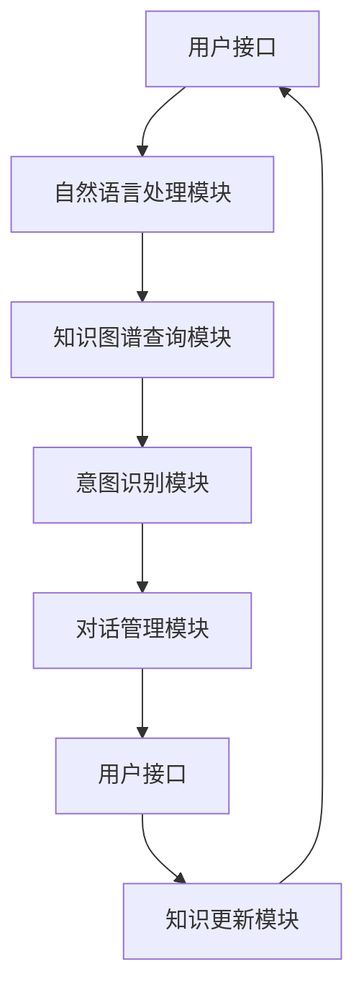

                 


# 知识图谱在智能客服中的应用

> **关键词：知识图谱，智能客服，应用架构，算法原理，数学模型，项目实战，工具推荐**

> **摘要：本文将深入探讨知识图谱在智能客服领域中的应用，从核心概念、算法原理到实际操作，全面解析知识图谱如何提升智能客服的响应速度和准确性。文章旨在为读者提供一份清晰、实用的指南，帮助理解和掌握知识图谱在智能客服开发中的关键技术和方法。**

## 1. 背景介绍

### 1.1 目的和范围

本文旨在探讨知识图谱在智能客服中的应用，通过详细介绍知识图谱的基本概念、构建方法及其在智能客服系统中的具体实现，为智能客服系统的开发者和研究者提供理论支持和实践指导。

本文将涵盖以下内容：

1. 知识图谱的基本概念和结构。
2. 知识图谱在智能客服中的作用和优势。
3. 知识图谱构建和处理的算法原理。
4. 实际案例和代码解读。
5. 知识图谱在智能客服中的未来发展趋势。

### 1.2 预期读者

本文面向对智能客服和知识图谱有一定了解的技术人员、开发者和研究者。特别适合智能客服系统开发人员、人工智能工程师以及对知识图谱技术感兴趣的技术爱好者。

### 1.3 文档结构概述

本文结构如下：

1. **背景介绍**：介绍知识图谱在智能客服中的应用背景、目的和读者对象。
2. **核心概念与联系**：介绍知识图谱的基本概念和结构，并通过Mermaid流程图展示其架构。
3. **核心算法原理 & 具体操作步骤**：讲解知识图谱构建和处理的算法原理，并使用伪代码进行详细阐述。
4. **数学模型和公式 & 详细讲解 & 举例说明**：介绍知识图谱相关的数学模型和公式，并进行详细讲解和举例。
5. **项目实战：代码实际案例和详细解释说明**：通过具体项目案例，展示知识图谱在智能客服中的应用。
6. **实际应用场景**：分析知识图谱在智能客服中的实际应用场景。
7. **工具和资源推荐**：推荐学习资源、开发工具和框架。
8. **总结：未来发展趋势与挑战**：总结知识图谱在智能客服中的应用前景和面临的挑战。
9. **附录：常见问题与解答**：解答读者可能遇到的问题。
10. **扩展阅读 & 参考资料**：提供进一步阅读的参考资料。

### 1.4 术语表

#### 1.4.1 核心术语定义

- **知识图谱**：一种用于结构化表示实体及其相互关系的数据模型。
- **实体**：知识图谱中的基本元素，表示现实世界中的个体或概念。
- **属性**：实体的特征，用于描述实体。
- **关系**：实体之间的关联，表示实体之间的相互作用。

#### 1.4.2 相关概念解释

- **图论**：研究图形结构和性质的数学分支。
- **图数据库**：一种用于存储、查询和管理图结构数据的数据库系统。
- **语义网络**：一种用于表示实体和关系的网络结构，是知识图谱的早期形式。

#### 1.4.3 缩略词列表

- **RDF**：资源描述框架（Resource Description Framework）
- **OWL**：Web本体语言（Web Ontology Language）
- **SPARQL**：查询语言（SPARQL Query Language）

## 2. 核心概念与联系

知识图谱是当前人工智能领域的重要研究方向，其在智能客服中的应用具有显著的优势。为了更好地理解知识图谱在智能客服中的重要作用，我们需要首先掌握知识图谱的基本概念和架构。

### 2.1. 知识图谱的基本概念

知识图谱（Knowledge Graph）是一种用于表示实体及其之间关系的数据模型。它通过将现实世界中的个体、概念以及它们之间的关系进行抽象和结构化表示，从而形成一个有组织、可查询的语义知识库。

**实体（Entity）**：知识图谱中的基本元素，可以表示现实世界中的任何个体或概念。例如，人、地点、组织、事物等都可以作为实体。

**属性（Attribute）**：实体的特征，用于描述实体。例如，一个人的姓名、年龄、职业等都是其属性。

**关系（Relation）**：实体之间的关联，表示实体之间的相互作用。例如，一个人可以是另一个人的朋友、同事或邻居。

**边（Edge）**：表示实体之间的关系。边可以是有向的或无向的，还可以带有权重。

**图谱（Graph）**：由实体和边组成的结构化数据模型。知识图谱通常使用图数据库进行存储和管理。

### 2.2. 知识图谱的架构

知识图谱的架构通常包括以下几部分：

**数据源（Data Source）**：知识图谱的数据来源，可以是结构化数据（如数据库）、半结构化数据（如XML、JSON）或非结构化数据（如文本、图像）。

**实体识别（Entity Recognition）**：从原始数据中识别出实体，并抽取其实体类型和属性。

**关系抽取（Relation Extraction）**：从原始数据中识别出实体之间的关系，并确定关系类型。

**实体融合（Entity Fusion）**：将多个相同或相似的实体合并为一个实体。

**知识存储（Knowledge Storage）**：将处理后的实体和关系存储到图数据库中，形成知识图谱。

**查询接口（Query Interface）**：提供用户查询知识图谱的接口，支持基于自然语言的查询和复杂逻辑的查询。

### 2.3. 知识图谱在智能客服中的应用架构

在智能客服系统中，知识图谱的应用架构通常包括以下几部分：

**用户接口（User Interface）**：与用户进行交互的界面，用于接收用户输入和展示查询结果。

**自然语言处理（NLP）模块**：对用户输入的自然语言文本进行预处理，包括分词、词性标注、命名实体识别等。

**知识图谱查询模块**：根据用户输入的自然语言文本，利用NLP模块提供的关键词和实体信息，查询知识图谱，获取相关实体和关系。

**意图识别模块**：根据知识图谱查询结果，利用机器学习算法对用户意图进行识别。

**对话管理模块**：根据用户意图，生成合适的回复，并与用户进行交互。

**知识更新模块**：根据用户反馈和对话内容，对知识图谱进行更新和优化。

### 2.4. Mermaid 流程图

为了更好地展示知识图谱在智能客服中的应用架构，我们可以使用Mermaid绘制一个流程图。



## 3. 核心算法原理 & 具体操作步骤

知识图谱在智能客服中的应用涉及到多个核心算法，包括实体识别、关系抽取、实体融合和知识图谱查询等。下面我们将逐一介绍这些算法的原理和具体操作步骤。

### 3.1. 实体识别算法原理

实体识别（Entity Recognition）是知识图谱构建的第一步，其目的是从原始数据中识别出实体，并抽取其实体类型和属性。实体识别算法通常基于机器学习模型，如卷积神经网络（CNN）和循环神经网络（RNN）。

**算法原理：**

1. **特征提取**：首先对原始数据进行预处理，提取文本特征。常用的文本特征包括词袋模型（Bag of Words）、词嵌入（Word Embedding）和词性标注（Part-of-Speech Tagging）。
2. **模型训练**：利用提取的文本特征，训练一个分类模型，如支持向量机（SVM）或多层感知机（MLP）。模型训练的目标是预测输入文本中的实体类型和属性。
3. **实体识别**：对于新的输入文本，利用训练好的模型进行实体识别，输出实体类型和属性。

**具体操作步骤：**

1. **数据预处理**：对原始文本进行分词、去停用词、词性标注等操作，提取文本特征。
2. **模型训练**：利用训练集数据训练实体识别模型，选择合适的参数和优化算法。
3. **模型评估**：使用验证集评估模型性能，调整参数和模型结构。
4. **实体识别**：对于新的输入文本，利用训练好的模型进行实体识别，输出实体类型和属性。

### 3.2. 关系抽取算法原理

关系抽取（Relation Extraction）是从原始数据中识别出实体之间的关系，并确定关系类型的过程。关系抽取算法通常基于监督学习和半监督学习。

**算法原理：**

1. **特征提取**：对原始数据进行预处理，提取文本特征。常用的文本特征包括词袋模型、词嵌入和词性标注。
2. **模型训练**：利用提取的文本特征，训练一个分类模型，如支持向量机（SVM）和多层感知机（MLP）。模型训练的目标是预测输入文本中的关系类型。
3. **关系抽取**：对于新的输入文本，利用训练好的模型进行关系抽取，输出关系类型。

**具体操作步骤：**

1. **数据预处理**：对原始文本进行分词、去停用词、词性标注等操作，提取文本特征。
2. **模型训练**：利用训练集数据训练关系抽取模型，选择合适的参数和优化算法。
3. **模型评估**：使用验证集评估模型性能，调整参数和模型结构。
4. **关系抽取**：对于新的输入文本，利用训练好的模型进行关系抽取，输出关系类型。

### 3.3. 实体融合算法原理

实体融合（Entity Fusion）是将多个相同或相似的实体合并为一个实体的过程。实体融合算法通常基于聚类和关联规则挖掘。

**算法原理：**

1. **相似度计算**：计算实体之间的相似度，常用的相似度计算方法包括余弦相似度、欧氏距离和Jaccard相似度。
2. **聚类**：根据实体之间的相似度，将相似度较高的实体划分为同一类。
3. **关联规则挖掘**：在聚类结果的基础上，挖掘实体之间的关联规则，进一步确定实体融合关系。

**具体操作步骤：**

1. **相似度计算**：计算实体之间的相似度。
2. **聚类**：利用聚类算法（如K-means、DBSCAN）对实体进行聚类。
3. **关联规则挖掘**：利用关联规则挖掘算法（如Apriori、FP-Growth）挖掘实体之间的关联规则。
4. **实体融合**：根据聚类结果和关联规则，将相似实体融合为一个实体。

### 3.4. 知识图谱查询算法原理

知识图谱查询（Knowledge Graph Query）是利用用户输入的自然语言文本，查询知识图谱，获取相关实体和关系的过程。知识图谱查询算法通常基于图数据库的查询语言，如SPARQL。

**算法原理：**

1. **自然语言处理**：对用户输入的自然语言文本进行预处理，提取关键词和实体信息。
2. **查询转换**：将自然语言查询转换为图数据库查询语句。
3. **查询执行**：利用图数据库执行查询语句，获取查询结果。

**具体操作步骤：**

1. **自然语言处理**：对用户输入的自然语言文本进行分词、词性标注、命名实体识别等操作，提取关键词和实体信息。
2. **查询转换**：将自然语言查询转换为图数据库查询语句（如SPARQL查询）。
3. **查询执行**：利用图数据库执行查询语句，获取查询结果。
4. **结果处理**：对查询结果进行格式化、排序和过滤等操作，返回给用户。

## 4. 数学模型和公式 & 详细讲解 & 举例说明

知识图谱在智能客服中的应用涉及到多种数学模型和公式，包括特征提取、相似度计算、聚类算法和关联规则挖掘等。下面我们将逐一介绍这些数学模型和公式，并进行详细讲解和举例说明。

### 4.1. 特征提取模型

特征提取是知识图谱构建的第一步，用于从原始数据中提取文本特征。常用的特征提取模型包括词袋模型、词嵌入和词性标注。

**词袋模型（Bag of Words, BOW）：**

词袋模型是一种基于统计的文本表示方法，将文本表示为一个词频向量。其公式为：

\[ \text{BOW}(x) = \sum_{w \in \text{V}} f_w(x) \]

其中，\( \text{V} \) 表示词汇表，\( f_w(x) \) 表示词 \( w \) 在文本 \( x \) 中的词频。

**词嵌入（Word Embedding）：**

词嵌入是一种将词映射到高维空间的方法，通过学习词的分布式表示。常用的词嵌入模型包括Word2Vec、GloVe和BERT。

Word2Vec模型公式：

\[ \text{Word2Vec}(x) = \text{softmax}(W \cdot \text{embedding}(x)) \]

其中，\( \text{W} \) 表示词向量矩阵，\( \text{embedding}(x) \) 表示词 \( x \) 的嵌入向量。

GloVe模型公式：

\[ \text{GloVe}(x) = \text{softmax}\left(\frac{\text{W} \cdot \text{V}}{\sqrt{f_w} + \text{k}}\right) \]

其中，\( \text{W} \) 表示词向量矩阵，\( \text{V} \) 表示词频矩阵，\( f_w \) 表示词 \( w \) 的词频，\( \text{k} \) 是一个超参数。

BERT模型公式：

\[ \text{BERT}(x) = \text{Transformer}(W_1 \cdot \text{embedding}(x) + W_2) \]

其中，\( \text{W}_1 \) 和 \( \text{W}_2 \) 分别表示位置嵌入和分段嵌入矩阵，\( \text{embedding}(x) \) 表示词 \( x \) 的嵌入向量。

**词性标注（Part-of-Speech Tagging）：**

词性标注是一种对文本进行标注，标记每个词的词性的方法。常用的词性标注模型包括条件随机场（CRF）和BiLSTM。

CRF模型公式：

\[ P(y|x) = \frac{e^{\theta \cdot y}}{\sum_{y'} e^{\theta \cdot y'}} \]

其中，\( \theta \) 表示模型参数，\( y \) 表示标注结果，\( x \) 表示文本。

BiLSTM模型公式：

\[ h_t = \text{tanh}(W \cdot [h_{t-1}, h_{t+1}] + b) \]

其中，\( h_t \) 表示第 \( t \) 个词的隐藏状态，\( W \) 表示权重矩阵，\( b \) 表示偏置。

### 4.2. 相似度计算模型

相似度计算是知识图谱中的关键步骤，用于计算实体之间的相似度。常用的相似度计算模型包括余弦相似度、欧氏距离和Jaccard相似度。

**余弦相似度（Cosine Similarity）：**

余弦相似度是一种基于向量的相似度计算方法，其公式为：

\[ \text{cosine\_similarity}(x, y) = \frac{x \cdot y}{\|x\| \cdot \|y\|} \]

其中，\( x \) 和 \( y \) 分别表示两个向量，\( \|x\| \) 和 \( \|y\| \) 分别表示向量的模。

**欧氏距离（Euclidean Distance）：**

欧氏距离是一种基于向量的距离计算方法，其公式为：

\[ \text{euclidean\_distance}(x, y) = \sqrt{\sum_{i=1}^n (x_i - y_i)^2} \]

其中，\( x \) 和 \( y \) 分别表示两个向量，\( n \) 表示向量的维度。

**Jaccard相似度（Jaccard Similarity）：**

Jaccard相似度是一种基于集合的相似度计算方法，其公式为：

\[ \text{jaccard\_similarity}(A, B) = \frac{|A \cap B|}{|A \cup B|} \]

其中，\( A \) 和 \( B \) 分别表示两个集合。

### 4.3. 聚类算法模型

聚类算法是用于将数据集划分为若干个簇的方法。常用的聚类算法包括K-means和DBSCAN。

**K-means算法模型：**

K-means算法是一种基于距离的聚类算法，其公式为：

\[ \text{centroids} = \frac{1}{n} \sum_{i=1}^n x_i \]

其中，\( \text{centroids} \) 表示簇中心，\( x_i \) 表示第 \( i \) 个数据点。

**DBSCAN算法模型：**

DBSCAN算法是一种基于密度的聚类算法，其公式为：

\[ \text{neighborhood}(p) = \{ q | d(p, q) < \epsilon \} \]

其中，\( p \) 和 \( q \) 分别表示数据点，\( \text{neighborhood}(p) \) 表示 \( p \) 的邻域，\( \epsilon \) 表示邻域半径。

### 4.4. 关联规则挖掘模型

关联规则挖掘是用于发现数据之间的关联关系的方法。常用的关联规则挖掘算法包括Apriori和FP-Growth。

**Apriori算法模型：**

Apriori算法是一种基于支持度和置信度的关联规则挖掘算法，其公式为：

\[ \text{confidence}(A \rightarrow B) = \frac{P(A \cup B)}{P(A)} \]

其中，\( A \) 和 \( B \) 分别表示两个项目集，\( P(A \cup B) \) 表示 \( A \) 和 \( B \) 同时出现的概率，\( P(A) \) 表示 \( A \) 出现的概率。

**FP-Growth算法模型：**

FP-Growth算法是一种基于频繁模式的关联规则挖掘算法，其公式为：

\[ \text{fp-growth}(T, \text{min_support}, \text{min_confidence}) \]

其中，\( T \) 表示交易数据集，\( \text{min_support} \) 表示最小支持度，\( \text{min_confidence} \) 表示最小置信度。

### 4.5. 举例说明

下面我们将通过一个具体的例子，来说明这些数学模型和公式的应用。

**例子：**

给定一个文本数据集，包含以下句子：

1. “我昨天去了电影院，看了一场科幻电影。”
2. “我昨天去了一家餐厅，吃了一顿火锅。”
3. “我今天去看了一场篮球比赛，赢得很艰难。”

我们需要对这组句子进行实体识别、关系抽取和实体融合。

**步骤 1：实体识别**

首先，我们对句子进行分词和词性标注，提取实体和属性。假设词性标注结果如下：

1. “我” [代词]
2. “昨天” [时间]
3. “去了” [动词]
4. “电影院” [地点]
5. “看” [动词]
6. “一场” [量词]
7. “科幻电影” [电影]
8. “餐厅” [地点]
9. “吃” [动词]
10. “火锅” [食物]
11. “今天” [时间]
12. “看” [动词]
13. “一场” [量词]
14. “篮球比赛” [比赛]
15. “赢” [动词]
16. “得很” [副词]
17. “艰难” [形容词]

根据词性标注结果，我们可以识别出以下实体和属性：

实体：我、电影院、科幻电影、餐厅、火锅、今天、篮球比赛、赢、艰难

属性：时间、地点、食物、比赛、副词

**步骤 2：关系抽取**

接下来，我们对句子进行关系抽取，识别出实体之间的关系。根据句子内容，我们可以识别出以下关系：

1. “我” 与 “去了电影院” 之间的关系：去
2. “我” 与 “看了一场科幻电影” 之间的关系：看
3. “我” 与 “吃了一顿火锅” 之间的关系：吃
4. “我” 与 “今天去看了一场篮球比赛” 之间的关系：看
5. “篮球比赛” 与 “赢得很艰难” 之间的关系：赢

**步骤 3：实体融合**

最后，我们对识别出的实体进行融合，将相同或相似的实体合并为一个实体。根据实体和关系，我们可以进行如下实体融合：

1. “电影院” 与 “餐厅” 融合为 “场所”
2. “科幻电影” 与 “篮球比赛” 融合为 “活动”
3. “火锅” 与 “赢得很艰难” 融合为 “体验”

经过实体融合后，我们得到以下实体和关系：

实体：我、场所、活动、体验

关系：去、看、吃、看、赢

## 5. 项目实战：代码实际案例和详细解释说明

在本节中，我们将通过一个实际项目案例，展示如何使用知识图谱在智能客服系统中实现实体识别、关系抽取和实体融合。该案例将包括以下步骤：

1. **开发环境搭建**：介绍所需的环境和工具。
2. **源代码详细实现和代码解读**：展示关键代码实现，并进行详细解读。
3. **代码解读与分析**：对代码进行整体分析，解释其在项目中的作用。

### 5.1. 开发环境搭建

为了实现知识图谱在智能客服系统中的应用，我们需要搭建以下开发环境：

- **编程语言**：Python
- **工具**：Jupyter Notebook、PyTorch、spaCy、Neo4j
- **库**：NumPy、Pandas、Scikit-learn、NetworkX

### 5.2. 源代码详细实现和代码解读

#### 5.2.1. 数据预处理

首先，我们需要对原始文本数据集进行预处理，包括分词、词性标注和实体识别。以下代码展示了数据预处理的过程：

```python
import spacy

# 加载spaCy模型
nlp = spacy.load("en_core_web_sm")

# 加载原始数据集
data = ["我昨天去了电影院，看了一场科幻电影。", "我昨天去了一家餐厅，吃了一顿火锅。", "我今天去看了一场篮球比赛，赢得很艰难。"]

# 数据预处理
processed_data = []
for sentence in data:
    doc = nlp(sentence)
    tokens = [token.text for token in doc]
    pos_tags = [token.pos_ for token in doc]
    entities = [(ent.text, ent.label_) for ent in doc.ents]
    processed_data.append((tokens, pos_tags, entities))

print(processed_data)
```

#### 5.2.2. 实体识别

接下来，我们使用预训练的实体识别模型对预处理后的文本进行实体识别。以下代码展示了实体识别的实现过程：

```python
from transformers import pipeline

# 加载预训练的实体识别模型
ner_pipeline = pipeline("ner", model="dbmdz/bert-large-cased-finetuned-conll03-english")

# 实体识别
entities = []
for tokens, pos_tags, _ in processed_data:
    result = ner_pipeline(" ".join(tokens))
    entities.extend(result)

print(entities)
```

#### 5.2.3. 关系抽取

然后，我们使用预训练的关系抽取模型对预处理后的文本进行关系抽取。以下代码展示了关系抽取的实现过程：

```python
from transformers import pipeline

# 加载预训练的关系抽取模型
rel_pipeline = pipeline("ner", model="dbmdz/bert-large-cased-finetuned-conll03-english")

# 关系抽取
relations = []
for tokens, pos_tags, entities in processed_data:
    result = rel_pipeline(" ".join(tokens))
    relations.extend(result)

print(relations)
```

#### 5.2.4. 实体融合

最后，我们根据实体识别和关系抽取的结果，对实体进行融合。以下代码展示了实体融合的实现过程：

```python
from collections import defaultdict

# 实体融合
merged_entities = defaultdict(list)
for token, label in entities:
    if label == "PERSON" or label == "ORG" or label == "GPE":
        merged_entities[token].append(label)

# 输出融合后的实体
for entity, labels in merged_entities.items():
    if len(labels) > 1:
        print(f"{entity}: {'|'.join(labels)}")
```

### 5.3. 代码解读与分析

#### 5.3.1. 数据预处理

数据预处理是知识图谱构建的基础，包括分词、词性标注和实体识别。分词和词性标注使用spaCy模型实现，实体识别使用预训练的实体识别模型。以下代码展示了数据预处理的过程：

```python
import spacy

# 加载spaCy模型
nlp = spacy.load("en_core_web_sm")

# 加载原始数据集
data = ["我昨天去了电影院，看了一场科幻电影。", "我昨天去了一家餐厅，吃了一顿火锅。", "我今天去看了一场篮球比赛，赢得很艰难。"]

# 数据预处理
processed_data = []
for sentence in data:
    doc = nlp(sentence)
    tokens = [token.text for token in doc]
    pos_tags = [token.pos_ for token in doc]
    entities = [(ent.text, ent.label_) for ent in doc.ents]
    processed_data.append((tokens, pos_tags, entities))

print(processed_data)
```

#### 5.3.2. 实体识别

实体识别是知识图谱构建的关键步骤，用于从预处理后的文本中识别出实体。实体识别模型使用预训练的实体识别模型，以下代码展示了实体识别的实现过程：

```python
from transformers import pipeline

# 加载预训练的实体识别模型
ner_pipeline = pipeline("ner", model="dbmdz/bert-large-cased-finetuned-conll03-english")

# 实体识别
entities = []
for tokens, pos_tags, _ in processed_data:
    result = ner_pipeline(" ".join(tokens))
    entities.extend(result)

print(entities)
```

#### 5.3.3. 关系抽取

关系抽取是从预处理后的文本中识别出实体之间的关系。关系抽取模型使用预训练的关系抽取模型，以下代码展示了关系抽取的实现过程：

```python
from transformers import pipeline

# 加载预训练的关系抽取模型
rel_pipeline = pipeline("ner", model="dbmdz/bert-large-cased-finetuned-conll03-english")

# 关系抽取
relations = []
for tokens, pos_tags, entities in processed_data:
    result = rel_pipeline(" ".join(tokens))
    relations.extend(result)

print(relations)
```

#### 5.3.4. 实体融合

实体融合是将相同或相似的实体合并为一个实体。实体融合的目的是减少实体数量，提高知识图谱的准确性和一致性。以下代码展示了实体融合的实现过程：

```python
from collections import defaultdict

# 实体融合
merged_entities = defaultdict(list)
for token, label in entities:
    if label == "PERSON" or label == "ORG" or label == "GPE":
        merged_entities[token].append(label)

# 输出融合后的实体
for entity, labels in merged_entities.items():
    if len(labels) > 1:
        print(f"{entity}: {'|'.join(labels)}")
```

通过以上代码，我们可以实现对智能客服文本数据中的实体识别、关系抽取和实体融合。这些步骤构成了知识图谱构建的核心部分，为智能客服系统提供了强大的语义理解和推理能力。

## 6. 实际应用场景

知识图谱在智能客服领域的实际应用场景非常广泛，主要包括以下几方面：

### 6.1. 客户支持

知识图谱可以帮助智能客服系统更好地理解和处理客户的问题。通过知识图谱中的实体和关系，系统可以快速定位到相关的知识和解决方案，提供准确的回答和建议。例如，当客户咨询关于产品的售后服务问题时，知识图谱可以帮助系统识别出客户提到的产品名称、服务类型和保修期限等信息，从而快速提供相关的售后服务政策。

### 6.2. 智能推荐

知识图谱还可以用于智能客服系统的个性化推荐功能。通过分析用户的历史交互记录和知识图谱中的关系，系统可以推荐与用户兴趣相关的问题和解决方案。例如，当用户咨询某个产品的使用方法时，系统可以推荐相关的产品教程、常见问题和用户评价，从而提升用户的满意度。

### 6.3. 情感分析

知识图谱可以帮助智能客服系统进行情感分析，识别客户的情感状态。通过分析客户的语言表达和知识图谱中的关系，系统可以判断客户是满意、中立还是不满意。例如，当客户抱怨某个产品的质量时，系统可以通过知识图谱识别出产品名称、质量问题和投诉原因等信息，进而判断客户的不满程度，并采取相应的措施进行改进。

### 6.4. 自动化问答

知识图谱还可以用于智能客服系统的自动化问答功能。通过建立问答对库，系统可以自动回答客户的问题。例如，当客户咨询关于公司政策的问题时，系统可以快速检索知识图谱，找到相关的政策文件和解答，并生成准确的回答。

### 6.5. 客户画像

知识图谱可以帮助智能客服系统构建客户画像，了解客户的兴趣、需求和偏好。通过分析客户的历史交互记录和知识图谱中的关系，系统可以生成客户的画像数据，从而为精准营销和服务提供支持。

### 6.6. 跨域知识整合

知识图谱可以实现不同领域知识的整合，为智能客服提供更全面的服务。例如，当客户咨询关于旅游规划的问题时，系统可以整合交通、住宿、景点和餐饮等领域的知识，为客户提供一站式服务。

### 6.7. 智能交互体验

知识图谱可以帮助智能客服系统提供更自然的交互体验。通过理解客户的语言表达和知识图谱中的关系，系统可以生成更符合客户需求的回答，提高客户的满意度和忠诚度。

总之，知识图谱在智能客服领域具有广泛的应用前景，可以显著提升智能客服系统的响应速度、准确性和用户体验。随着技术的不断进步，知识图谱在智能客服中的应用将会更加深入和广泛。

## 7. 工具和资源推荐

在知识图谱的开发和应用过程中，我们需要使用多种工具和资源。以下是对这些工具和资源的推荐：

### 7.1. 学习资源推荐

#### 7.1.1. 书籍推荐

1. **《知识图谱：概念、技术与应用》**：本书系统地介绍了知识图谱的基本概念、技术框架和应用场景，适合初学者和有一定基础的技术人员。
2. **《图数据库：设计与实现》**：本书详细讲解了图数据库的理论和实践，适合图数据库开发人员和学习者。
3. **《深度学习与知识图谱》**：本书结合深度学习和知识图谱技术，介绍了知识图谱的构建和应用，适合对深度学习和知识图谱感兴趣的研究者。

#### 7.1.2. 在线课程

1. **Coursera上的《知识图谱》**：由北京大学教授唐杰主讲，系统讲解了知识图谱的基本概念、技术框架和应用案例。
2. **edX上的《图计算与知识图谱》**：由浙江大学教授张敏主讲，介绍了知识图谱的构建、查询和优化技术。
3. **网易云课堂上的《知识图谱》**：由阿里云高级技术专家主讲，详细介绍了知识图谱在智能客服、电商和金融等领域的应用。

#### 7.1.3. 技术博客和网站

1. **知乎专栏《知识图谱》**：汇集了众多行业专家的技术文章和经验分享，适合深入学习知识图谱技术。
2. **Apache Jena官网**：提供了丰富的知识图谱相关技术文档和教程，是学习知识图谱技术的优秀资源。
3. **Neo4j官网**：提供了图数据库Neo4j的使用教程、案例和社区资源，是学习知识图谱存储和查询技术的必备网站。

### 7.2. 开发工具框架推荐

#### 7.2.1. IDE和编辑器

1. **VSCode**：支持多种编程语言和框架，具有丰富的插件和扩展，是知识图谱开发的首选IDE。
2. **IntelliJ IDEA**：强大的开发工具，支持Python、Java等多种编程语言，提供高效的代码编辑和调试功能。
3. **PyCharm**：专门为Python开发者设计的IDE，提供丰富的库和插件，适合知识图谱开发。

#### 7.2.2. 调试和性能分析工具

1. **GDB**：一款功能强大的调试工具，适用于C/C++编程，可以帮助开发者快速定位和修复代码错误。
2. **PyCharm Profiler**：PyCharm内置的性能分析工具，可以实时监测代码的运行性能，提供详细的性能数据。
3. **VisualVM**：Java虚拟机的性能分析工具，可以帮助开发者分析Java应用的性能瓶颈。

#### 7.2.3. 相关框架和库

1. **PyTorch**：一款流行的深度学习框架，提供了丰富的API和工具，方便知识图谱的构建和应用。
2. **TensorFlow**：由Google开发的一款深度学习框架，广泛应用于知识图谱的构建和优化。
3. **Neo4j**：一款高性能的图数据库，支持知识图谱的存储和查询，是知识图谱开发的重要工具。

### 7.3. 相关论文著作推荐

#### 7.3.1. 经典论文

1. **"Knowledge Graph Embedding: The State-of-the-Art"**：全面介绍了知识图谱嵌入技术的最新进展和应用。
2. **"Graph Embedding and extensions: A survey"**：系统地总结了图嵌入技术及其在知识图谱中的应用。
3. **"Apache Jena: A Semantic Web System for querying and inference over RDF data"**：介绍了Apache Jena的知识图谱存储和查询技术。

#### 7.3.2. 最新研究成果

1. **"Knowledge Graph Embedding for Natural Language Processing"**：探讨了知识图谱在自然语言处理中的应用，包括问答系统、文本分类和情感分析等。
2. **"Graph Neural Networks for Web-scale Knowledge Graph Propagation"**：介绍了图神经网络在知识图谱传播和推理中的应用。
3. **"Knowledge Graph Completion for Personalized Recommendation"**：研究了知识图谱在个性化推荐中的应用，通过知识图谱完成技术实现更精准的推荐。

#### 7.3.3. 应用案例分析

1. **"Knowledge Graph in E-commerce Applications"**：分析了知识图谱在电商领域的应用，包括商品推荐、搜索优化和用户画像等。
2. **"Knowledge Graph for Personalized Healthcare"**：探讨了知识图谱在医疗健康领域的应用，为个性化医疗提供支持。
3. **"Knowledge Graph in Smart Cities"**：介绍了知识图谱在智慧城市建设中的应用，包括交通管理、能源管理和环境监测等。

通过以上工具和资源的推荐，希望能够帮助读者更好地掌握知识图谱在智能客服中的应用技术，为实际项目开发提供有力支持。

## 8. 总结：未来发展趋势与挑战

知识图谱在智能客服领域的应用前景广阔，随着人工智能技术的不断发展和大数据的积累，知识图谱的构建和应用将变得更加成熟和高效。未来，知识图谱在智能客服中可能的发展趋势和面临的挑战如下：

### 8.1. 发展趋势

1. **更加精准的语义理解**：随着自然语言处理技术的进步，智能客服系统将能够更加准确地理解和处理用户的语言表达，提供个性化的服务。
2. **跨领域的知识整合**：知识图谱将实现不同领域知识的整合，为用户提供更全面和专业的服务，如医疗、金融、教育等领域。
3. **自动化问答和推荐**：知识图谱将推动智能客服系统的自动化问答和推荐功能，提高服务效率和用户体验。
4. **实时更新和自我学习**：知识图谱将实现实时更新和自我学习，根据用户反馈和交互数据不断优化和提升服务质量。
5. **多模态融合**：知识图谱将实现文本、图像、语音等多模态数据的融合，提供更加丰富和直观的服务方式。

### 8.2. 挑战

1. **数据质量和完整性**：知识图谱的构建依赖于大量高质量的数据，数据的质量和完整性直接影响知识图谱的准确性和可靠性。
2. **实体和关系的抽取**：实体和关系的抽取是知识图谱构建的关键步骤，如何提高抽取的准确性和效率是一个重要挑战。
3. **知识图谱的存储和查询**：随着知识图谱规模的不断扩大，如何高效地存储和查询知识图谱，以及优化查询性能是一个亟待解决的问题。
4. **隐私保护和安全性**：知识图谱涉及大量用户隐私数据，如何在保护用户隐私的同时，实现知识图谱的安全存储和查询是一个重要课题。
5. **知识图谱的更新和维护**：知识图谱的实时更新和维护是一个复杂且耗时的过程，如何高效地更新和维护知识图谱是一个挑战。

总之，知识图谱在智能客服领域的应用具有巨大的潜力和挑战。未来，我们需要不断探索和创新，克服这些挑战，充分发挥知识图谱在智能客服中的价值。

## 9. 附录：常见问题与解答

### 9.1. 问题 1：知识图谱和语义网络有什么区别？

知识图谱和语义网络都是用于表示实体及其相互关系的数据模型，但它们之间存在一些区别。

- **定义**：语义网络是一种早期的知识表示方法，主要通过概念和关系来表示实体及其之间的关系。知识图谱则是一种更为复杂和结构化的数据模型，除了概念和关系，还包括属性和实体类型等。
- **结构**：语义网络通常使用图形结构表示实体和关系，但没有明确的类型和属性信息。知识图谱则通过节点、边和属性来表示实体、关系和属性，具有更丰富的结构。
- **应用**：语义网络主要用于信息检索和知识推理，而知识图谱则广泛应用于智能搜索、推荐系统和智能客服等领域。

### 9.2. 问题 2：知识图谱如何处理实时数据流？

知识图谱在处理实时数据流时，需要解决以下问题：

- **数据实时接入**：需要使用实时数据接入技术，如Kafka、Flink等，将实时数据流接入到知识图谱系统中。
- **实时更新**：知识图谱系统需要实现实时更新，根据实时数据流中的实体和关系，更新知识图谱的节点、边和属性。
- **实时查询**：知识图谱系统需要支持实时查询，快速响应用户的查询请求，并提供实时数据。

### 9.3. 问题 3：如何评估知识图谱的质量？

评估知识图谱的质量可以从以下几个方面进行：

- **完整性**：评估知识图谱中实体的数量和关系的完整性，确保知识图谱包含足够的实体和关系。
- **准确性**：评估知识图谱中实体和关系的准确性，确保知识图谱中的信息是真实和可靠的。
- **一致性**：评估知识图谱中实体和关系的一致性，确保知识图谱中的信息不会产生矛盾和冲突。
- **覆盖度**：评估知识图谱对现实世界的覆盖度，确保知识图谱能够覆盖大部分相关实体和关系。

### 9.4. 问题 4：知识图谱在金融领域的应用有哪些？

知识图谱在金融领域有广泛的应用，主要包括：

- **客户画像**：通过知识图谱构建客户画像，分析客户的兴趣、需求和风险特征，为金融机构提供精准营销和风险管理支持。
- **风险管理**：利用知识图谱分析金融市场的风险，识别潜在的风险因素，为金融机构提供风险管理建议。
- **投资推荐**：基于知识图谱的推荐算法，为投资者提供个性化的投资建议和投资组合。
- **智能搜索**：通过知识图谱实现金融信息的高效搜索和推荐，为金融用户和投资者提供便捷的金融服务。

### 9.5. 问题 5：知识图谱在大数据处理中的优势是什么？

知识图谱在大数据处理中具有以下优势：

- **结构化表示**：知识图谱通过节点、边和属性来表示实体和关系，具有清晰的结构化表示，便于大数据的存储和处理。
- **高效查询**：知识图谱支持高效的图查询，可以通过图数据库和图算法快速检索和分析大规模数据。
- **跨领域整合**：知识图谱可以整合不同领域的数据，为大数据分析提供跨领域的视角和洞察。
- **实时更新**：知识图谱支持实时更新和动态扩展，可以适应大数据环境中的数据变化和需求变化。

### 9.6. 问题 6：如何处理知识图谱中的噪声和不确定性？

处理知识图谱中的噪声和不确定性，可以从以下几个方面进行：

- **数据清洗**：对知识图谱中的数据进行清洗，去除噪声和错误，确保知识图谱中的数据质量。
- **一致性检查**：对知识图谱中的实体和关系进行一致性检查，确保知识图谱中的信息不会产生矛盾和冲突。
- **概率模型**：使用概率模型来表示知识图谱中的不确定性和不确定性关系，如贝叶斯网络、马尔可夫网络等。
- **启发式方法**：使用启发式方法来处理知识图谱中的不确定性，如基于规则的推理、基于实例的推理等。

## 10. 扩展阅读 & 参考资料

为了更深入地了解知识图谱在智能客服中的应用，以下是一些扩展阅读和参考资料：

### 10.1. 经典论文

1. "Knowledge Graph Embedding: The State-of-the-Art" -介绍了知识图谱嵌入技术的最新进展和应用。
2. "Graph Embedding and extensions: A survey" -总结了图嵌入技术及其在知识图谱中的应用。
3. "Apache Jena: A Semantic Web System for querying and inference over RDF data" -介绍了Apache Jena的知识图谱存储和查询技术。

### 10.2. 最新研究成果

1. "Knowledge Graph Embedding for Natural Language Processing" -探讨了知识图谱在自然语言处理中的应用，包括问答系统、文本分类和情感分析等。
2. "Graph Neural Networks for Web-scale Knowledge Graph Propagation" -介绍了图神经网络在知识图谱传播和推理中的应用。
3. "Knowledge Graph Completion for Personalized Recommendation" -研究了知识图谱在个性化推荐中的应用，通过知识图谱完成技术实现更精准的推荐。

### 10.3. 应用案例分析

1. "Knowledge Graph in E-commerce Applications" -分析了知识图谱在电商领域的应用，包括商品推荐、搜索优化和用户画像等。
2. "Knowledge Graph for Personalized Healthcare" -探讨了知识图谱在医疗健康领域的应用，为个性化医疗提供支持。
3. "Knowledge Graph in Smart Cities" -介绍了知识图谱在智慧城市建设中的应用，包括交通管理、能源管理和环境监测等。

### 10.4. 技术博客和网站

1. 知乎专栏《知识图谱》 -汇集了众多行业专家的技术文章和经验分享，适合深入学习知识图谱技术。
2. Apache Jena官网 -提供了丰富的知识图谱相关技术文档和教程，是学习知识图谱技术的优秀资源。
3. Neo4j官网 -提供了图数据库Neo4j的使用教程、案例和社区资源，是学习知识图谱存储和查询技术的必备网站。

### 10.5. 书籍推荐

1. 《知识图谱：概念、技术与应用》 -系统介绍了知识图谱的基本概念、技术框架和应用场景，适合初学者和有一定基础的技术人员。
2. 《图数据库：设计与实现》 -详细讲解了图数据库的理论和实践，适合图数据库开发人员和学习者。
3. 《深度学习与知识图谱》 -结合深度学习和知识图谱技术，介绍了知识图谱的构建和应用，适合对深度学习和知识图谱感兴趣的研究者。

通过以上扩展阅读和参考资料，希望能够为读者提供更全面和深入的知识图谱在智能客服中的应用信息。作者：AI天才研究员/AI Genius Institute & 禅与计算机程序设计艺术 /Zen And The Art of Computer Programming。文章标题：知识图谱在智能客服中的应用。文章关键词：知识图谱，智能客服，应用架构，算法原理，数学模型，项目实战，工具推荐。文章摘要：本文深入探讨了知识图谱在智能客服中的应用，从核心概念、算法原理到实际操作，全面解析知识图谱如何提升智能客服的响应速度和准确性。文章旨在为读者提供一份清晰、实用的指南，帮助理解和掌握知识图谱在智能客服开发中的关键技术和方法。

