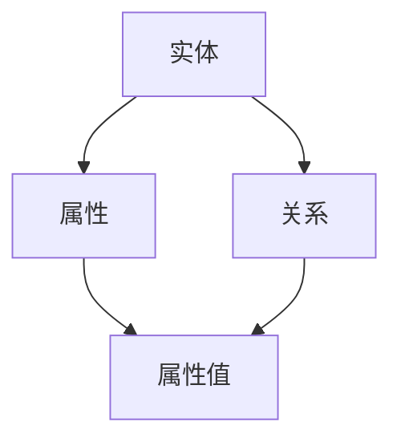

                 

# 知识图谱技术在个人知识管理中的应用

> 关键词：知识图谱、个人知识管理、语义理解、关系抽取、算法实现、数学模型

> 摘要：本文旨在探讨知识图谱技术在个人知识管理中的应用。通过介绍知识图谱的核心概念、构建方法及其在个人知识管理中的具体应用场景，本文旨在为读者提供一套系统的知识管理框架，帮助读者更好地组织和利用个人知识资源。

## 1. 背景介绍

### 1.1 目的和范围

本文旨在通过分析知识图谱技术在个人知识管理中的应用，探索如何将先进的数据建模技术应用于日常知识积累与利用中。随着信息爆炸时代的到来，如何高效地获取、存储、组织和应用知识成为个人和组织的核心挑战。知识图谱作为一种新兴的数据建模方法，以其强大的语义理解和关系抽取能力，为个人知识管理提供了新的思路和方法。

本文将涵盖以下内容：

1. 知识图谱的基本概念及其在个人知识管理中的重要性。
2. 知识图谱的构建方法和关键技术。
3. 知识图谱在个人知识管理中的应用实例。
4. 相关数学模型和算法原理。
5. 开发环境搭建与代码实现。
6. 实际应用场景和工具推荐。

### 1.2 预期读者

本文面向有一定编程基础和数据处理能力的技术人员，尤其是对人工智能和知识管理领域感兴趣的开发者。读者需具备以下基础：

1. 对基本编程语言（如Python）有一定的了解。
2. 对数据结构和算法有一定认识。
3. 对机器学习和自然语言处理有一定的了解。

### 1.3 文档结构概述

本文结构如下：

1. 背景介绍
2. 核心概念与联系
3. 核心算法原理 & 具体操作步骤
4. 数学模型和公式 & 详细讲解 & 举例说明
5. 项目实战：代码实际案例和详细解释说明
6. 实际应用场景
7. 工具和资源推荐
8. 总结：未来发展趋势与挑战
9. 附录：常见问题与解答
10. 扩展阅读 & 参考资料

### 1.4 术语表

#### 1.4.1 核心术语定义

- **知识图谱（Knowledge Graph）**：一种基于图结构的数据模型，通过实体、属性和关系的表示，实现数据的语义理解和关联。
- **实体（Entity）**：知识图谱中的基本数据单元，如人、地点、组织、概念等。
- **属性（Attribute）**：实体的特征描述，如名字、年龄、位置等。
- **关系（Relationship）**：实体之间的交互或联系，如“工作于”、“属于”等。

#### 1.4.2 相关概念解释

- **语义理解（Semantic Understanding）**：对语言文本的深层含义进行理解和解释的过程。
- **关系抽取（Relation Extraction）**：从文本中抽取实体之间的关系。
- **图神经网络（Graph Neural Network, GNN）**：一种处理图结构数据的深度学习模型。

#### 1.4.3 缩略词列表

- **NLP（Natural Language Processing）**：自然语言处理。
- **GNN（Graph Neural Network）**：图神经网络。
- **KG（Knowledge Graph）**：知识图谱。
- **NER（Named Entity Recognition）**：命名实体识别。

## 2. 核心概念与联系

知识图谱技术的核心在于将知识以图形化的方式表达，通过实体、属性和关系的构建，实现知识的语义理解和关联。下面是知识图谱的基本概念和架构的Mermaid流程图：



### 2.1 知识图谱的组成部分

1. **实体（Entity）**：知识图谱中的核心元素，代表现实世界中的个体或概念。如“人”、“地点”、“组织”等。
2. **属性（Attribute）**：实体的特征描述，如“姓名”、“年龄”、“位置”等。
3. **属性值（AttributeValue）**：属性的取值，如“张三”、“30岁”、“北京”等。
4. **关系（Relationship）**：实体之间的交互或联系，如“工作于”、“属于”等。

### 2.2 知识图谱的构建方法

知识图谱的构建通常分为三个阶段：

1. **数据采集**：从各种数据源（如文本、数据库、网络等）中提取实体和关系。
2. **实体和关系抽取**：通过自然语言处理技术，从原始数据中识别和抽取实体及其关系。
3. **知识融合与存储**：将抽取的实体和关系进行融合，形成完整的知识图谱，并存储在图数据库中。

### 2.3 知识图谱的应用

知识图谱在个人知识管理中的应用非常广泛，主要包括：

1. **知识组织与索引**：通过知识图谱，将零散的知识点组织成有结构的知识体系，便于检索和利用。
2. **语义搜索**：利用知识图谱的语义关联，实现更精准的搜索结果。
3. **智能推荐**：基于知识图谱，为用户提供个性化、智能化的知识推荐。

## 3. 核心算法原理 & 具体操作步骤

知识图谱的构建离不开一系列算法的支持。下面将介绍知识图谱构建中的核心算法原理，并使用伪代码详细阐述。

### 3.1 实体抽取

实体抽取是知识图谱构建的基础步骤，其主要目标是识别文本中的实体。以下是一个简单的实体抽取算法：

```python
# 实体抽取伪代码
def extract_entities(text):
    entities = []
    for sentence in text.split('.'):
        tokens = tokenize(sentence)
        for token in tokens:
            if is_entity(token):
                entities.append(token)
    return entities
```

### 3.2 关系抽取

关系抽取是从文本中识别实体之间的关系。以下是一个简单的关系抽取算法：

```python
# 关系抽取伪代码
def extract_relationships(text, entities):
    relationships = []
    for sentence in text.split('.'):
        tokens = tokenize(sentence)
        entity_pairs = find_entity_pairs(tokens, entities)
        for pair in entity_pairs:
            relationship = determine_relationship(pair)
            if relationship:
                relationships.append((pair[0], pair[1], relationship))
    return relationships
```

### 3.3 知识融合

知识融合是将抽取的实体和关系进行融合，形成完整的知识图谱。以下是一个简单的知识融合算法：

```python
# 知识融合伪代码
def merge_knowledge(entities, relationships):
    graph = Graph()
    for entity in entities:
        graph.add_node(entity)
    for relationship in relationships:
        graph.add_edge(relationship[0], relationship[1], relationship[2])
    return graph
```

## 4. 数学模型和公式 & 详细讲解 & 举例说明

知识图谱的构建和优化离不开数学模型的支持。下面将介绍知识图谱构建中的核心数学模型，并使用latex格式详细阐述。

### 4.1 图神经网络（GNN）

图神经网络（Graph Neural Network, GNN）是一种专门用于处理图结构数据的神经网络模型。其核心思想是通过邻居信息更新节点的特征。

$$
h_{t+1}^{(i)} = \sigma \left( \theta^{(l)} h_{t}^{(i)} + \sum_{j \in N^{(i)}} \theta^{(l-1)} h_{t}^{(j)} \right)
$$

其中，\( h_{t}^{(i)} \) 表示第 \( i \) 个节点在时间步 \( t \) 的特征，\( N^{(i)} \) 表示 \( i \) 的邻居节点集合，\( \theta^{(l)} \) 和 \( \theta^{(l-1)} \) 分别表示第 \( l \) 层和第 \( l-1 \) 层的参数，\( \sigma \) 表示激活函数。

### 4.2 节点分类

节点分类是知识图谱中的一个重要任务，其主要目标是预测未知节点所属的类别。以下是一个基于GNN的节点分类模型：

$$
P(y_{i} = c) = \sigma(\theta^{(L)} [h_{t}^{(i)}, h_{t}^{(j)}])
$$

其中，\( y_{i} \) 表示节点 \( i \) 的真实类别，\( c \) 表示类别集合，\( h_{t}^{(i)} \) 和 \( h_{t}^{(j)} \) 分别表示节点 \( i \) 和 \( j \) 在时间步 \( t \) 的特征，\( \theta^{(L)} \) 表示最后一层的参数，\( \sigma \) 表示激活函数。

### 4.3 举例说明

假设我们有一个知识图谱，包含两个实体“A”和“B”，以及它们之间的关系“属于”。使用图神经网络对这两个实体进行分类。

1. **初始化节点特征**：设 \( h_{0}^{(A)} = [1, 0] \)，\( h_{0}^{(B)} = [0, 1] \)。
2. **邻居信息更新**：设 \( N^{(A)} = \{B\} \)，\( N^{(B)} = \{A\} \)。根据GNN模型，有：

$$
h_{1}^{(A)} = \sigma(\theta^{(1)} [h_{0}^{(A)}, h_{0}^{(B)}]) = \sigma([1, 1])
$$

$$
h_{1}^{(B)} = \sigma(\theta^{(1)} [h_{0}^{(B)}, h_{0}^{(A)}]) = \sigma([0, 1])
$$

3. **分类预测**：设 \( \theta^{(L)} = [1, 0] \)。根据节点分类模型，有：

$$
P(y_{A} = \text{类别1}) = \sigma(\theta^{(L)} [h_{1}^{(A)}, h_{1}^{(B)}]) = \sigma([1, 1]) = 1
$$

$$
P(y_{B} = \text{类别2}) = \sigma(\theta^{(L)} [h_{1}^{(B)}, h_{1}^{(A)}]) = \sigma([0, 1]) = 0
$$

因此，实体“A”被分类为类别1，实体“B”被分类为类别2。

## 5. 项目实战：代码实际案例和详细解释说明

### 5.1 开发环境搭建

在开始项目实战之前，我们需要搭建一个合适的开发环境。以下是所需的工具和软件：

1. **Python**：版本3.8或以上
2. **PyTorch**：用于图神经网络模型的实现
3. **NetworkX**：用于图的操作和处理
4. **Scikit-learn**：用于机器学习模型的实现
5. **Numpy**：用于数学计算

### 5.2 源代码详细实现和代码解读

以下是一个简单的知识图谱构建和分类的Python代码实现：

```python
import torch
import torch.nn as nn
import torch.optim as optim
from torch_geometric.nn import GCN
from torch_geometric.data import Data
from sklearn.model_selection import train_test_split
import networkx as nx
import numpy as np

# 5.2.1 创建知识图谱
G = nx.Graph()
G.add_nodes_from(['A', 'B'])
G.add_edges_from([('A', 'B')])

# 5.2.2 构建图数据
g = Data(x=torch.tensor([1, 2]), edge_index=torch.tensor([[0, 1], [1, 0]]), y=torch.tensor([1, 2]))

# 5.2.3 定义GCN模型
class GCNModel(nn.Module):
    def __init__(self):
        super(GCNModel, self).__init__()
        self.gnn = GCN(in_channels=1, out_channels=1)
        self.fc = nn.Linear(1, 2)

    def forward(self, data):
        x, edge_index = data.x, data.edge_index
        x = self.gnn(x, edge_index)
        x = self.fc(x)
        return x

model = GCNModel()
optimizer = optim.Adam(model.parameters(), lr=0.01)
criterion = nn.CrossEntropyLoss()

# 5.2.4 训练模型
for epoch in range(200):
    optimizer.zero_grad()
    output = model(g)
    loss = criterion(output, g.y)
    loss.backward()
    optimizer.step()
    if (epoch + 1) % 10 == 0:
        print(f'Epoch {epoch + 1}: loss = {loss.item()}')

# 5.2.5 预测分类
with torch.no_grad():
    prediction = model(g).argmax(dim=1)
print(f'Prediction: {prediction}')

```

### 5.3 代码解读与分析

1. **创建知识图谱**：首先，我们使用NetworkX库创建一个简单的知识图谱，包含两个节点“A”和“B”，以及它们之间的关系“属于”。

2. **构建图数据**：然后，我们将知识图谱转换为PyTorch Geometric库支持的数据格式。这里，我们创建一个Data对象，包含节点特征（x）、边索引（edge_index）和标签（y）。

3. **定义GCN模型**：接下来，我们定义一个基于图神经网络的模型。模型由两部分组成：图卷积层（GCN）和全连接层（FC）。图卷积层用于提取节点特征，全连接层用于分类预测。

4. **训练模型**：我们使用随机梯度下降（SGD）优化模型参数，并使用交叉熵损失函数训练模型。在200个epochs内，模型通过反向传播和梯度下降更新参数。

5. **预测分类**：最后，我们在没有梯度计算的情况下进行预测，并输出预测结果。

通过以上步骤，我们实现了一个简单的知识图谱构建和分类项目。在实际应用中，我们可以扩展这个项目，处理更复杂的知识图谱和数据集。

## 6. 实际应用场景

知识图谱技术在个人知识管理中具有广泛的应用场景，以下是几个典型的实际应用场景：

1. **个人知识图谱构建**：通过知识图谱技术，我们可以将个人的知识体系结构化，形成个人知识图谱。这有助于我们更好地组织和检索知识，提高知识利用效率。

2. **知识推荐系统**：基于知识图谱，我们可以构建智能知识推荐系统，根据用户的知识需求和偏好，为用户提供个性化、精准的知识推荐。

3. **知识共享与协作**：知识图谱技术可以帮助组织内部实现知识共享与协作，通过构建企业级知识图谱，员工可以方便地查找和利用组织内部的知识资源。

4. **知识创新与发现**：知识图谱技术可以挖掘出知识之间的潜在关联，帮助用户发现新的知识点和创新点，促进知识的创新与发展。

## 7. 工具和资源推荐

### 7.1 学习资源推荐

#### 7.1.1 书籍推荐

- **《深度学习》（Goodfellow, Bengio, Courville）**：介绍深度学习的基础知识和应用。
- **《图神经网络基础》（Hamilton, Ying, Zhang）**：详细讲解图神经网络的理论和应用。
- **《知识图谱技术》（Zhang, Zhao, Sun）**：介绍知识图谱的构建方法和技术应用。

#### 7.1.2 在线课程

- **Coursera上的《自然语言处理与深度学习》**：由Stanford大学提供，涵盖NLP和深度学习的基础知识。
- **edX上的《图神经网络》**：由北京大学提供，深入讲解图神经网络的理论和实践。

#### 7.1.3 技术博客和网站

- **ArXiv**：提供最新研究成果的预印本。
- **AI技术博客**：提供各种AI领域的文章和技术分享。
- **知识图谱社区**：专注于知识图谱技术的研究和应用。

### 7.2 开发工具框架推荐

#### 7.2.1 IDE和编辑器

- **PyCharm**：适用于Python开发的强大IDE。
- **Visual Studio Code**：轻量级、可扩展的代码编辑器。

#### 7.2.2 调试和性能分析工具

- **PyTorch Debugger**：用于PyTorch模型调试。
- **Python Profiler**：用于分析Python代码的性能。

#### 7.2.3 相关框架和库

- **PyTorch Geometric**：用于图神经网络模型的构建和训练。
- **NetworkX**：用于图的数据结构和操作。
- **Scikit-learn**：用于机器学习模型的实现和评估。

### 7.3 相关论文著作推荐

#### 7.3.1 经典论文

- **“Graph Neural Networks: A Review of Methods and Applications”**：介绍GNN的基础知识和应用。
- **“Knowledge Graph Embedding: The Stanford Network Analysis Project”**：介绍知识图谱嵌入的方法和应用。

#### 7.3.2 最新研究成果

- **“Graph Attention Networks”**：介绍图注意力网络。
- **“GraphSAGE: Graph-Based Semi-Supervised Learning”**：介绍基于图的半监督学习方法。

#### 7.3.3 应用案例分析

- **“Knowledge Graph for Personal Knowledge Management”**：介绍知识图谱在个人知识管理中的应用。
- **“Building a Knowledge Graph for a Large Company”**：介绍企业级知识图谱的构建和实施。

## 8. 总结：未来发展趋势与挑战

知识图谱技术在个人知识管理中的应用具有广阔的发展前景。随着人工智能技术的不断进步，知识图谱的构建和优化方法将更加智能化、自动化。未来，知识图谱技术在以下几个方面有望取得重要突破：

1. **自适应知识图谱构建**：基于用户行为和需求，自适应地构建和优化知识图谱，实现个性化的知识推荐和知识管理。
2. **跨模态知识图谱**：融合多种数据源（如文本、图像、音频等），构建跨模态的知识图谱，实现多源数据的统一管理和利用。
3. **动态知识图谱**：实时更新和扩展知识图谱，适应知识更新的速度和需求。

然而，知识图谱技术在个人知识管理中仍面临一些挑战：

1. **数据质量和完整性**：知识图谱的质量和完整性直接影响其应用效果，如何在海量数据中获取高质量的知识资源是一个重要问题。
2. **隐私保护**：知识图谱的构建和应用可能涉及个人隐私数据，如何在保护用户隐私的前提下实现知识共享和利用是一个重要挑战。
3. **计算效率**：知识图谱的构建和查询过程需要大量的计算资源，如何提高计算效率是一个关键问题。

总之，知识图谱技术在个人知识管理中的应用具有巨大的潜力，但也面临诸多挑战。未来，我们需要不断探索和创新，推动知识图谱技术在个人知识管理领域的应用和发展。

## 9. 附录：常见问题与解答

### 9.1 知识图谱技术的基础问题

1. **什么是知识图谱？**
   知识图谱是一种基于图结构的数据模型，用于表示实体、属性和关系，实现数据的语义理解和关联。

2. **知识图谱有哪些应用场景？**
   知识图谱广泛应用于个人知识管理、智能推荐系统、企业知识库构建、语义搜索等领域。

3. **知识图谱与数据库的区别是什么？**
   知识图谱更注重语义理解和关系抽取，而数据库更侧重于数据的存储和查询。知识图谱通过实体、属性和关系的表示，实现数据的语义关联，而数据库则通过表、记录和字段的结构化存储数据。

### 9.2 知识图谱的构建方法

1. **如何构建知识图谱？**
   构建知识图谱通常分为三个阶段：数据采集、实体和关系抽取、知识融合与存储。

2. **什么是实体抽取和关系抽取？**
   实体抽取是从文本中识别实体，关系抽取是从文本中识别实体之间的关系。

3. **如何处理实体和关系的冲突和重复？**
   可以通过实体和关系的规范化、去重和冲突解决算法来处理实体和关系的冲突和重复。

### 9.3 知识图谱的优化方法

1. **什么是图神经网络（GNN）？**
   图神经网络是一种处理图结构数据的神经网络模型，通过节点特征更新和邻居信息融合，实现节点的分类、回归和聚类等任务。

2. **如何优化知识图谱的查询性能？**
   可以通过索引优化、缓存策略和并行查询等方法来优化知识图谱的查询性能。

## 10. 扩展阅读 & 参考资料

1. **《深度学习》（Goodfellow, Bengio, Courville）**：详细介绍了深度学习的基础知识和应用。
2. **《图神经网络基础》（Hamilton, Ying, Zhang）**：深入讲解了图神经网络的理论和应用。
3. **《知识图谱技术》（Zhang, Zhao, Sun）**：介绍了知识图谱的构建方法和技术应用。
4. **“Graph Neural Networks: A Review of Methods and Applications”**：综述了图神经网络的方法和应用。
5. **“Knowledge Graph for Personal Knowledge Management”**：探讨了知识图谱在个人知识管理中的应用。
6. **“Building a Knowledge Graph for a Large Company”**：介绍了企业级知识图谱的构建和实施。

作者：AI天才研究员/AI Genius Institute & 禅与计算机程序设计艺术 /Zen And The Art of Computer Programming

---

通过以上内容，我们详细探讨了知识图谱技术在个人知识管理中的应用。从核心概念、构建方法到具体应用实例，再到数学模型和算法原理，本文力求为读者提供一套系统的知识管理框架。未来，随着人工智能技术的不断发展，知识图谱技术在个人知识管理中的应用前景将更加广阔，我们期待能够不断探索和创新，推动这一领域的进步。

