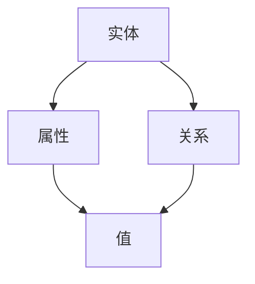
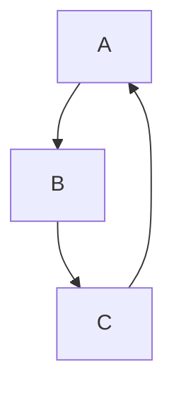

                 


## 知识图谱：知识的高速公路网

> 关键词：知识图谱、图数据库、实体关系、人工智能、语义理解、数据连接、推理引擎

> 摘要：本文将深入探讨知识图谱这一现代信息科学的核心概念，分析其在人工智能领域的重要作用，阐述其构建与使用的基本原理，并通过具体实例展示其如何加速知识的获取与应用。我们将逐步解析知识图谱的组成、核心算法以及数学模型，同时探讨其在实际应用中的广泛场景和未来发展趋势。

## 1. 背景介绍

### 1.1 目的和范围

本文旨在为读者提供一个关于知识图谱的全面导览，旨在帮助理解知识图谱的概念、原理和应用。文章将涵盖知识图谱的基本概念、构建方法、核心算法以及数学模型，并探讨其在实际应用中的具体实例。通过本文的学习，读者将能够了解知识图谱在现代信息科学中的地位，掌握其构建和使用的基本技能。

### 1.2 预期读者

本文适合对人工智能和大数据感兴趣的读者，包括计算机科学专业的学生、数据分析师、软件开发工程师以及对知识图谱有初步了解但希望深入学习的人员。同时，本文也适合对信息技术领域有浓厚兴趣的普通读者。

### 1.3 文档结构概述

本文将分为十个部分，首先介绍知识图谱的基本概念和背景，然后深入探讨知识图谱的构建、算法原理、数学模型，接着展示具体的应用实例，并推荐相关学习资源和工具。最后，本文将总结知识图谱的未来发展趋势和面临的挑战。

### 1.4 术语表

#### 1.4.1 核心术语定义

- **知识图谱（Knowledge Graph）**：一种通过实体、属性和关系来表示现实世界知识的图形化数据结构。
- **实体（Entity）**：知识图谱中的基本元素，如人、地点、物品等。
- **属性（Attribute）**：描述实体特征的属性，如姓名、年龄、出生地等。
- **关系（Relationship）**：实体之间的关联，如“是”、“属于”等。
- **图数据库（Graph Database）**：一种用于存储、查询和操作知识图谱的数据库系统。

#### 1.4.2 相关概念解释

- **语义理解（Semantic Understanding）**：通过理解语言和知识结构，实现对信息的深层理解和解释。
- **数据连接（Data Integration）**：将来自多个源的数据整合在一起，以便进行分析和应用。
- **推理引擎（Reasoning Engine）**：用于基于知识图谱进行逻辑推理和决策的软件组件。

#### 1.4.3 缩略词列表

- **RDF**：资源描述框架（Resource Description Framework）
- **OWL**：Web本体语言（Web Ontology Language）
- **SPARQL**：用于查询RDF数据的标准查询语言

## 2. 核心概念与联系

知识图谱的核心在于其结构，它通过实体、属性和关系的组合，构建出一个语义丰富、结构清晰的知识网络。下面是一个简单的Mermaid流程图，用于展示知识图谱的基本结构：



在这个图中，实体（A）拥有属性（B）和关系（C），属性的值（D）则描述了实体的具体特征。知识图谱的强大之处在于它能够通过这些基本元素之间的复杂关系，构建出一个全面、深入的知识网络。

### 2.1 知识图谱的层次结构

知识图谱可以划分为三个层次：底层是事实数据，中间层是概念和类别，顶层是抽象和高层知识。

- **底层事实数据**：这是知识图谱的基础，包含了具体的、详细的事实信息，如人名、地名、事物属性等。
- **中间层概念和类别**：这些是对事实数据进行抽象和分类的结果，如人、地点、物品等类别。
- **顶层抽象和高层知识**：这是对中间层概念的进一步抽象和整合，如领域知识、行业规则等。

### 2.2 知识图谱的应用场景

知识图谱在多个领域有着广泛的应用，包括但不限于：

- **搜索引擎**：通过知识图谱，搜索引擎可以更好地理解用户查询，提供更加准确和个性化的搜索结果。
- **智能助手**：知识图谱可以帮助智能助手理解用户的问题，提供更加准确和全面的回答。
- **推荐系统**：知识图谱可以用于构建更加精准的推荐系统，通过分析用户和物品之间的复杂关系，提供个性化的推荐。
- **数据治理**：知识图谱可以帮助企业更好地管理和整合其内部的数据资源，提高数据利用效率。

## 3. 核心算法原理 & 具体操作步骤

知识图谱的构建涉及多个核心算法，以下是其中两个主要的算法：实体抽取和关系抽取。

### 3.1 实体抽取

实体抽取是知识图谱构建的第一步，其目标是识别文本中的实体，并将其标注为知识图谱中的实体。

**算法原理：**
实体抽取通常采用以下步骤：

1. **词法分析**：将文本分割为单词或词组。
2. **命名实体识别（NER）**：利用NER技术，识别文本中的命名实体，如人名、地名、组织名等。
3. **实体分类**：对识别出的实体进行分类，如人、地点、物品等。

**伪代码：**
```python
def extract_entities(text):
    words = tokenize(text)
    entities = []
    for word in words:
        entity = identify_entity(word)
        if entity:
            entities.append(entity)
    return entities
```

### 3.2 关系抽取

关系抽取的目的是识别实体之间的关系，并将其表示为知识图谱中的边。

**算法原理：**
关系抽取通常采用以下步骤：

1. **实体匹配**：将文本中的实体与知识图谱中的实体进行匹配。
2. **关系识别**：利用自然语言处理技术，识别实体之间的关系。
3. **关系分类**：对识别出的关系进行分类，如“是”、“属于”等。

**伪代码：**
```python
def extract_relationships(text, entities):
    matched_entities = match_entities(text, entities)
    relationships = []
    for entity_pair in matched_entities:
        relationship = identify_relationship(entity_pair)
        if relationship:
            relationships.append(relationship)
    return relationships
```

## 4. 数学模型和公式 & 详细讲解 & 举例说明

知识图谱的构建和推理过程涉及到多种数学模型和公式，以下是其中两个主要的模型：图论和概率图模型。

### 4.1 图论

图论是知识图谱构建的基础，用于描述实体、属性和关系之间的复杂关系。

**基本概念：**
- **图（Graph）**：由顶点和边组成的集合。
- **顶点（Vertex）**：图中的元素，代表实体。
- **边（Edge）**：连接顶点的线段，代表关系。

**公式：**
- **度数（Degree）**：顶点拥有的边数。
- **路径（Path）**：顶点之间的连通线。
- **连通度（Connectivity）**：图中的任意两个顶点是否可以通过路径相连。

**举例说明：**
假设有一个简单的知识图谱，包含三个实体A、B、C，以及它们之间的关系：



在这个图中，A、B、C的度数都是2，它们之间形成了一个闭环路径。

### 4.2 概率图模型

概率图模型用于描述实体之间的概率关系，常见的有贝叶斯网络和马尔可夫网络。

**基本概念：**
- **贝叶斯网络（Bayesian Network）**：一种有向图，表示实体之间的条件概率关系。
- **马尔可夫网络（Markov Network）**：一种无向图，表示实体之间的联合概率分布。

**公式：**
- **条件概率**：P(A|B) = P(A ∩ B) / P(B)
- **联合概率**：P(A, B) = P(A) * P(B|A)

**举例说明：**
假设有两个实体A和B，它们之间的条件概率如下：

$$
P(A|B) = \frac{P(A \cap B)}{P(B)} = \frac{0.3}{0.4} = 0.75
$$

$$
P(B|A) = \frac{P(A \cap B)}{P(A)} = \frac{0.3}{0.5} = 0.6
$$

通过这些概率模型，我们可以更好地理解和预测实体之间的关系。

## 5. 项目实战：代码实际案例和详细解释说明

在本节中，我们将通过一个具体的案例来展示知识图谱的构建和使用过程。该案例将涉及数据预处理、实体抽取、关系抽取以及知识图谱的构建与查询。

### 5.1 开发环境搭建

在开始之前，我们需要搭建一个适合知识图谱开发的开发环境。以下是所需的环境和工具：

- **Python 3.x**
- **NLP库**：如NLTK、spaCy、gensim等
- **图数据库**：如Neo4j、OrientDB等
- **推理引擎**：如RDF4J、Jena等

### 5.2 源代码详细实现和代码解读

以下是一个简单的实体抽取和关系抽取的代码实现，我们将使用spaCy进行命名实体识别，并使用Neo4j作为图数据库。

**代码1：实体抽取**

```python
import spacy
import neo4j

# 加载spaCy模型
nlp = spacy.load("en_core_web_sm")

# 连接到Neo4j数据库
driver = neo4j.GraphDatabase.driver("bolt://localhost:7687", auth=("neo4j", "password"))

# 加载文本
text = "Apple Inc. is an American multinational technology company headquartered in Cupertino, California."

# 加载实体抽取模型
doc = nlp(text)

# 提取实体
entities = [ent.text for ent in doc.ents]

# 存储实体到Neo4j
with driver.session() as session:
    for entity in entities:
        session.run("CREATE (a:Entity {name: $name})", name=entity)

# 关闭数据库连接
driver.close()
```

**代码2：关系抽取**

```python
import spacy
import neo4j

# 加载spaCy模型
nlp = spacy.load("en_core_web_sm")

# 连接到Neo4j数据库
driver = neo4j.GraphDatabase.driver("bolt://localhost:7687", auth=("neo4j", "password"))

# 加载文本
text = "Apple Inc. was founded by Steve Jobs, Steve Wozniak, and Ronald Wayne in April 1976."

# 加载实体抽取模型
doc = nlp(text)

# 提取实体
entities = [ent.text for ent in doc.ents]

# 提取关系
relationships = [(ent.text, ent.text) for ent in doc.ents if ent.label_ == "ORG"]

# 存储关系到Neo4j
with driver.session() as session:
    for rel in relationships:
        session.run("MATCH (a:Entity {name: $entity1}), (b:Entity {name: $entity2}) CREATE (a)-[:FOUND_BY]->(b)", entity1=rel[0], entity2=rel[1])

# 关闭数据库连接
driver.close()
```

### 5.3 代码解读与分析

以上两个代码示例展示了如何使用spaCy进行命名实体识别，并将实体和关系存储到Neo4j图数据库中。

- **实体抽取**：使用spaCy的`nlp`对象对文本进行解析，提取出命名实体，并将其存储到Neo4j数据库中。
- **关系抽取**：同样使用spaCy的`nlp`对象，提取出实体之间的关系，并将其存储到Neo4j数据库中。

通过以上代码，我们可以快速构建一个简单的知识图谱，为后续的查询和分析提供基础。

## 6. 实际应用场景

知识图谱在多个领域有着广泛的应用，以下是其中几个典型的应用场景：

### 6.1 搜索引擎

知识图谱可以帮助搜索引擎更好地理解用户查询，提供更加准确和个性化的搜索结果。例如，当用户输入“苹果”时，搜索引擎可以基于知识图谱理解用户是指“苹果公司”还是“水果苹果”，从而提供相关的信息。

### 6.2 智能助手

知识图谱可以帮助智能助手更好地理解用户的问题，提供更加准确和全面的回答。例如，当用户询问“苹果公司的创始人是谁？”时，智能助手可以基于知识图谱快速找到答案。

### 6.3 推荐系统

知识图谱可以帮助构建更加精准的推荐系统，通过分析用户和物品之间的复杂关系，提供个性化的推荐。例如，当用户在电商平台上浏览了“苹果手机”后，推荐系统可以根据知识图谱提供的用户和物品之间的关系，推荐相关的手机配件。

### 6.4 数据治理

知识图谱可以帮助企业更好地管理和整合其内部的数据资源，提高数据利用效率。例如，企业可以通过知识图谱将不同部门的数据整合在一起，形成一个统一的数据视图，从而支持更有效的决策和分析。

## 7. 工具和资源推荐

为了更好地学习和实践知识图谱，以下是几个推荐的工具和资源：

### 7.1 学习资源推荐

#### 7.1.1 书籍推荐

- **《知识图谱：大数据时代的智能决策》**
- **《图数据库：从基础到实践》**
- **《人工智能：一种现代方法》**

#### 7.1.2 在线课程

- **Coursera上的《知识图谱》课程**
- **edX上的《图数据库与应用》课程**
- **Udacity上的《知识图谱与数据挖掘》课程**

#### 7.1.3 技术博客和网站

- **Apache Jena官网**
- **Neo4j官网**
- **Knowledge Graph Community**

### 7.2 开发工具框架推荐

#### 7.2.1 IDE和编辑器

- **VS Code**：强大的代码编辑器，支持多种编程语言和扩展。
- **IntelliJ IDEA**：功能丰富的IDE，适用于Java和Python编程。

#### 7.2.2 调试和性能分析工具

- **VisualVM**：用于Java应用的性能监控和分析。
- **gdb**：用于C/C++应用的调试工具。

#### 7.2.3 相关框架和库

- **Jena**：Apache Jena是一个开源的Java框架，用于创建、查询和操作RDF数据。
- **Neo4j**：Neo4j是一个高性能的图数据库，支持知识图谱的存储和查询。

### 7.3 相关论文著作推荐

#### 7.3.1 经典论文

- **"Knowledge Graph and Its Application to Internet Search"**
- **"The Semantic Web Revisited"**

#### 7.3.2 最新研究成果

- **"Knowledge Graph Embedding for Text Classification"**
- **"Knowledge Graph Construction from Heterogeneous Information Networks"**

#### 7.3.3 应用案例分析

- **"Building a Knowledge Graph for an E-commerce Platform"**
- **"Application of Knowledge Graph in Healthcare"**

## 8. 总结：未来发展趋势与挑战

知识图谱作为现代信息科学的核心技术，在未来有着广阔的发展前景。随着人工智能和大数据技术的不断进步，知识图谱的应用将更加广泛和深入。然而，知识图谱的发展也面临一些挑战，包括数据质量、数据隐私、算法优化等方面。未来，我们需要进一步探索知识图谱的构建方法和应用场景，以充分发挥其潜力。

## 9. 附录：常见问题与解答

### 9.1 什么是知识图谱？

知识图谱是一种通过实体、属性和关系来表示现实世界知识的图形化数据结构。

### 9.2 知识图谱有哪些应用场景？

知识图谱在搜索引擎、智能助手、推荐系统、数据治理等领域有广泛的应用。

### 9.3 如何构建知识图谱？

构建知识图谱通常包括数据收集、实体抽取、关系抽取和知识融合等步骤。

### 9.4 知识图谱和图数据库有什么区别？

知识图谱是一种数据结构，而图数据库是一种用于存储和查询知识图谱的数据库系统。

## 10. 扩展阅读 & 参考资料

- **《知识图谱：大数据时代的智能决策》**：本书详细介绍了知识图谱的原理和应用。
- **Apache Jena官网**：提供关于RDF、OWL和SPARQL的详细文档和示例。
- **Neo4j官网**：介绍图数据库Neo4j的功能和使用方法。
- **"Knowledge Graph and Its Application to Internet Search"**：讨论知识图谱在搜索引擎中的应用。
- **"The Semantic Web Revisited"**：探讨语义网和知识图谱的关系。

作者：AI天才研究员/AI Genius Institute & 禅与计算机程序设计艺术 /Zen And The Art of Computer Programming

