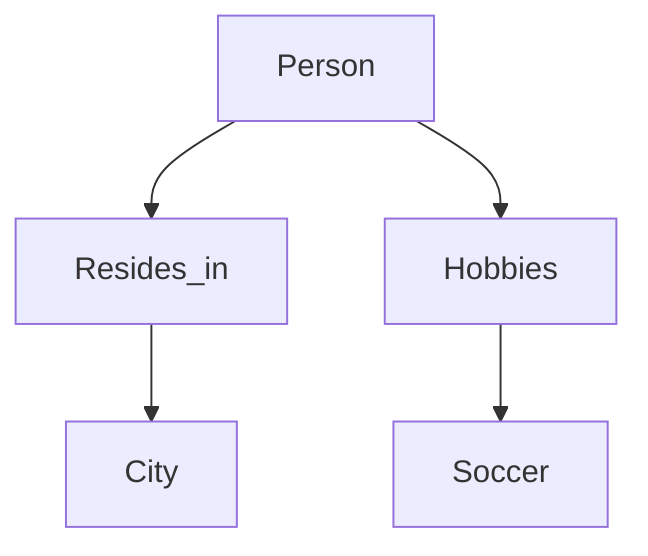
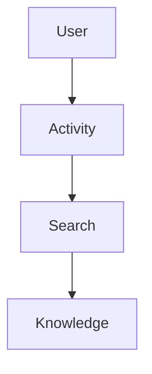
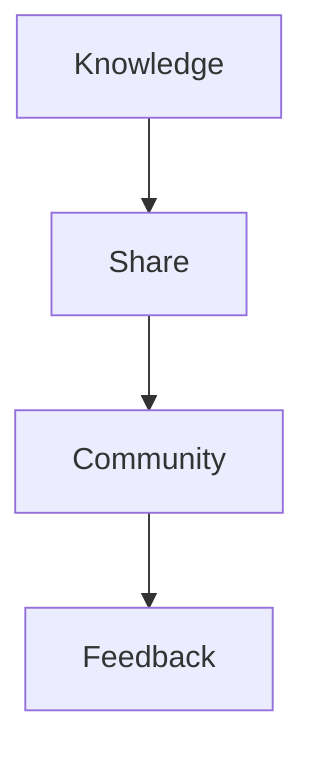
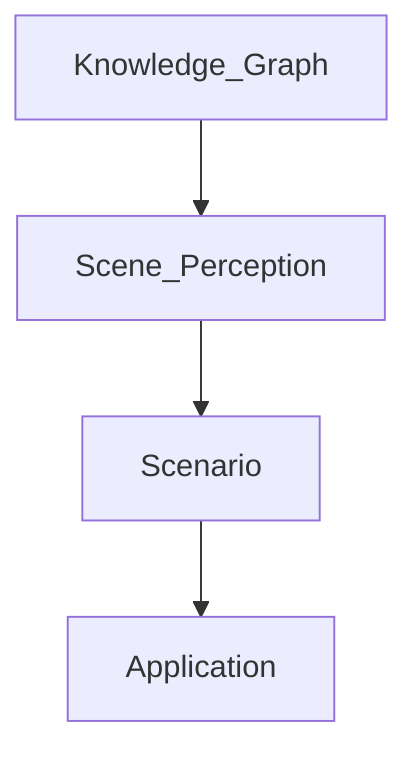
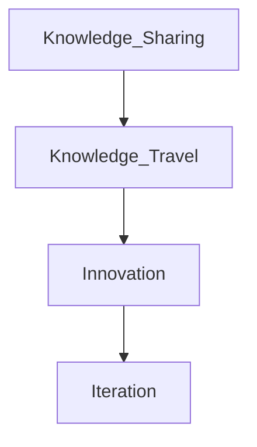

                 

# 知识旅行：实现知识的场景化应用和分享

> **关键词：** 知识管理，场景化应用，知识分享，场景感知，人工智能，知识图谱

> **摘要：** 本文旨在探讨如何通过知识旅行这一创新方法，将抽象的知识转化为具体场景中的应用，从而提高知识的实用性和可分享性。文章首先介绍知识旅行的概念和目标，然后详细阐述其核心概念、算法原理、数学模型、实战案例和实际应用场景，最后对知识旅行未来的发展趋势和挑战进行展望。

## 1. 背景介绍

### 1.1 目的和范围

本文的主要目的是探讨知识旅行这一概念，它旨在通过将知识场景化，提高知识的实用性和可分享性。知识旅行不仅仅是一种知识管理的手段，更是一种创新的教育方式。本文将介绍知识旅行的核心概念、算法原理、数学模型、实战案例和实际应用场景，以便读者能够更好地理解和应用这一方法。

本文的范围主要包括以下几个方面：

- 知识旅行的定义和目标
- 核心概念和联系
- 核心算法原理和具体操作步骤
- 数学模型和公式
- 项目实战：代码实际案例和详细解释说明
- 实际应用场景
- 工具和资源推荐
- 总结：未来发展趋势与挑战

### 1.2 预期读者

本文适合以下读者群体：

- 对知识管理、教育技术、人工智能等领域感兴趣的科研人员
- 对知识场景化应用和分享有实际需求的行业从业者
- 对编程和算法有基础知识的开发者
- 对创新教育方法有探索欲望的教育工作者

### 1.3 文档结构概述

本文分为以下几个部分：

- 第1部分：背景介绍，包括目的和范围、预期读者、文档结构概述和术语表
- 第2部分：核心概念与联系，介绍知识旅行的核心概念和原理
- 第3部分：核心算法原理 & 具体操作步骤，详细阐述知识旅行的算法原理和具体步骤
- 第4部分：数学模型和公式 & 详细讲解 & 举例说明，介绍知识旅行的数学模型和公式
- 第5部分：项目实战：代码实际案例和详细解释说明，提供知识旅行的实战案例和代码解读
- 第6部分：实际应用场景，讨论知识旅行的实际应用场景
- 第7部分：工具和资源推荐，介绍与知识旅行相关的学习资源、开发工具和框架
- 第8部分：总结：未来发展趋势与挑战，展望知识旅行的发展前景
- 第9部分：附录：常见问题与解答，解答读者可能遇到的问题
- 第10部分：扩展阅读 & 参考资料，提供进一步的阅读资料

### 1.4 术语表

#### 1.4.1 核心术语定义

- 知识旅行：将抽象的知识通过场景化方法转化为具体的应用，实现知识的实用性和可分享性。
- 场景化应用：将知识应用于具体场景中，使其具有实际操作价值。
- 知识分享：将知识传播给他人，促进知识的共享和传播。
- 场景感知：识别和理解当前所处的场景，为知识旅行提供基础。

#### 1.4.2 相关概念解释

- 知识管理：对知识进行收集、存储、传播和应用的过程。
- 人工智能：模拟人类智能的计算机系统，能够感知、学习、推理和决策。
- 知识图谱：表示知识结构和关系的图形化模型。

#### 1.4.3 缩略词列表

- AI：人工智能
- KG：知识图谱
- NLP：自然语言处理
- ML：机器学习

## 2. 核心概念与联系

在讨论知识旅行的核心概念和联系之前，我们首先需要理解几个关键概念，包括知识图谱、场景感知和知识共享。

### 2.1 知识图谱

知识图谱是一种图形化模型，用于表示知识结构及其关系。它通常由节点和边组成，节点表示实体，边表示实体之间的关系。例如，在知识图谱中，"人"和"地点"是节点，"居住在"和"属于"是边。



### 2.2 场景感知

场景感知是指系统识别和理解当前所处的环境或场景的能力。在知识旅行中，场景感知是关键，因为它决定了知识如何被场景化应用。例如，一个智能助手可以通过场景感知来识别用户当前的需求，然后提供相应的知识。



### 2.3 知识共享

知识共享是指将知识传播给他人，以促进知识的共享和传播。在知识旅行中，知识共享是最终目标，通过场景化应用，知识能够更好地被理解和应用。



### 2.4 知识图谱与场景感知的联系

知识图谱和场景感知是知识旅行的基础。知识图谱提供了丰富的知识结构，而场景感知能够识别和理解用户的需求，从而实现知识的场景化应用。



### 2.5 知识共享与知识旅行的关系

知识共享是知识旅行的最终目标，通过场景化应用，知识能够更好地被传播和应用。知识旅行不仅仅是一个知识共享的过程，更是一个知识创新和迭代的过程。



通过以上核心概念和联系的介绍，我们可以更好地理解知识旅行的原理和实现方法。接下来，我们将详细探讨知识旅行的核心算法原理和具体操作步骤。

## 3. 核心算法原理 & 具体操作步骤

### 3.1 算法概述

知识旅行的核心算法主要包括以下几个步骤：

1. **知识图谱构建**：通过数据源获取知识，构建知识图谱。
2. **场景感知**：识别用户当前所处的场景。
3. **知识匹配**：根据场景感知结果，从知识图谱中匹配相关知识点。
4. **知识场景化应用**：将匹配的知识应用于当前场景，提供解决方案。
5. **知识反馈与优化**：收集用户反馈，优化知识图谱和算法。

### 3.2 知识图谱构建

知识图谱构建是知识旅行的第一步，主要涉及以下操作：

1. **数据源选择**：选择合适的数据源，如公开数据集、企业内部数据等。
2. **实体抽取**：从数据源中提取实体，如人、地点、事件等。
3. **关系抽取**：从数据源中提取实体之间的关系，如属于、居住在等。
4. **图谱构建**：将实体和关系构建成知识图谱。

### 3.3 场景感知

场景感知是知识旅行的关键步骤，主要涉及以下操作：

1. **用户输入**：获取用户输入，如文本、语音等。
2. **意图识别**：分析用户输入，识别用户意图。
3. **场景定位**：根据用户意图，定位用户所处的场景。
4. **上下文理解**：理解用户输入的上下文信息，如时间、地点等。

### 3.4 知识匹配

知识匹配是知识旅行的核心步骤，主要涉及以下操作：

1. **关键词提取**：从场景感知结果中提取关键词。
2. **图谱搜索**：在知识图谱中搜索与关键词相关的知识点。
3. **知识筛选**：根据场景和用户需求，筛选出最相关的知识点。

### 3.5 知识场景化应用

知识场景化应用是将匹配的知识应用于当前场景，提供解决方案。主要操作包括：

1. **知识推理**：根据知识图谱中的关系，对知识进行推理。
2. **知识生成**：将推理结果生成具体的解决方案。
3. **知识呈现**：将解决方案以用户可理解的方式呈现。

### 3.6 知识反馈与优化

知识反馈与优化是知识旅行的持续过程，主要涉及以下操作：

1. **用户反馈**：收集用户对解决方案的反馈。
2. **知识更新**：根据用户反馈，更新知识图谱。
3. **算法优化**：根据用户反馈和知识更新，优化算法模型。

### 3.7 伪代码实现

以下是一个简化的知识旅行算法的伪代码实现：

```plaintext
function knowledgeTravel(input, knowledgeGraph):
    // 步骤1：场景感知
    scene = perceiveScene(input)
    
    // 步骤2：知识匹配
    matchedKnowledge = matchKnowledge(scene, knowledgeGraph)
    
    // 步骤3：知识场景化应用
    application = applyKnowledge(matchedKnowledge)
    
    // 步骤4：知识反馈与优化
    feedback = getUserFeedback(application)
    knowledgeGraph = updateKnowledgeGraph(feedback, knowledgeGraph)
    algorithmModel = optimizeAlgorithmModel(feedback, algorithmModel)
    
    return application
```

通过以上核心算法原理和具体操作步骤的介绍，我们可以看到知识旅行的实现过程是如何将抽象的知识转化为具体场景中的应用，从而提高知识的实用性和可分享性。接下来，我们将深入探讨知识旅行的数学模型和公式。

## 4. 数学模型和公式 & 详细讲解 & 举例说明

在知识旅行中，数学模型和公式起着至关重要的作用。它们不仅帮助我们理解和分析知识旅行的核心算法，还可以优化和评估算法的性能。本节将详细介绍知识旅行的数学模型和公式，并提供具体的计算示例。

### 4.1 模型概述

知识旅行的数学模型主要包括以下几个部分：

1. **知识图谱模型**：描述知识图谱的结构和关系。
2. **场景感知模型**：分析用户输入，识别用户意图和场景。
3. **知识匹配模型**：根据场景和用户需求，从知识图谱中匹配相关知识点。
4. **知识推理模型**：对知识进行推理，生成具体的解决方案。

### 4.2 知识图谱模型

知识图谱模型通常由节点和边组成，节点表示实体，边表示实体之间的关系。常用的模型包括图论模型和语义网络模型。

#### 图论模型

在图论模型中，知识图谱可以用一个有向图 \( G = (V, E) \) 表示，其中：

- \( V \) 是节点集合，表示实体，如人、地点、事件等。
- \( E \) 是边集合，表示实体之间的关系，如属于、居住在等。

图论模型的核心公式包括：

1. **度数分布**：描述节点连接关系的概率分布。
   \[
   P(k) = \frac{d(k)}{2m}
   \]
   其中，\( d(k) \) 是节点 \( k \) 的度数，\( m \) 是图中的边数。

2. **路径长度**：描述两个节点之间的平均距离。
   \[
   L = \frac{1}{n(n-1)} \sum_{i \neq j} d(i, j)
   \]
   其中，\( n \) 是节点数，\( d(i, j) \) 是节点 \( i \) 和节点 \( j \) 之间的距离。

#### 语义网络模型

在语义网络模型中，知识图谱可以用一组规则表示，如生产式规则或语义网络规则。

生产式规则的形式为：
\[
\text{if } P_1 \text{ and } P_2 \text{ and } \ldots \text{ and } P_n \text{, then } Q
\]
其中，\( P_1, P_2, \ldots, P_n \) 是前提条件，\( Q \) 是结论。

### 4.3 场景感知模型

场景感知模型通常涉及自然语言处理（NLP）和机器学习（ML）技术。以下是一个简单的场景感知模型的例子：

1. **词向量模型**：将文本转换为词向量，如Word2Vec或GloVe。
2. **意图识别模型**：使用分类模型，如支持向量机（SVM）或循环神经网络（RNN）。
3. **场景定位模型**：结合地理位置信息，如GPS数据或地图API。

场景感知模型的核心公式包括：

1. **词向量相似度**：计算两个词向量的相似度。
   \[
   \text{similarity}(x, y) = \cos(\theta(x, y)) = \frac{x \cdot y}{\|x\|\|y\|}
   \]
   其中，\( x \) 和 \( y \) 是词向量，\( \theta(x, y) \) 是词向量之间的夹角。

2. **分类模型概率**：计算文本属于某个类别的概率。
   \[
   P(y|x) = \frac{P(x|y)P(y)}{P(x)}
   \]
   其中，\( y \) 是类别，\( x \) 是文本，\( P(x|y) \) 是给定类别 \( y \) 时文本 \( x \) 的概率，\( P(y) \) 是类别 \( y \) 的概率，\( P(x) \) 是文本 \( x \) 的概率。

### 4.4 知识匹配模型

知识匹配模型用于从知识图谱中匹配相关知识点。以下是一个简单的匹配模型：

1. **关键词提取**：从用户输入中提取关键词。
2. **图谱搜索**：在知识图谱中搜索与关键词相关的知识点。

知识匹配模型的核心公式包括：

1. **关键词权重**：计算关键词的权重。
   \[
   w(t) = \log(1 + f(t))
   \]
   其中，\( t \) 是关键词，\( f(t) \) 是关键词在用户输入中出现的频率。

2. **知识点匹配度**：计算知识点与关键词的匹配度。
   \[
   \text{matchScore}(t, k) = w(t) \cdot w(k) \cdot \text{similarity}(t, k)
   \]
   其中，\( t \) 是关键词，\( k \) 是知识点，\( \text{similarity}(t, k) \) 是关键词与知识点的相似度。

### 4.5 知识推理模型

知识推理模型用于对知识进行推理，生成具体的解决方案。以下是一个简单的推理模型：

1. **规则库构建**：构建规则库，包含一系列的推理规则。
2. **推理过程**：根据规则库，对知识进行推理。

知识推理模型的核心公式包括：

1. **推理步骤**：描述推理过程中的每一步。
   \[
   \text{step}(i) = \text{if } P_i \text{, then } Q_i
   \]
   其中，\( P_i \) 是前提条件，\( Q_i \) 是结论。

2. **推理结果**：计算推理的结果。
   \[
   \text{result}(R) = \text{conjunction}(\text{result}(R_1), \text{result}(R_2), \ldots)
   \]
   其中，\( R \) 是推理结果，\( R_1, R_2, \ldots \) 是每一步的推理结果。

### 4.6 计算示例

假设我们有一个简单的知识图谱，包含以下知识点：

- 人：张三、李四
- 地点：北京、上海
- 关系：居住在

用户输入：“张三在北京吗？”

#### 步骤1：场景感知

意图识别：询问张三的居住地。

场景定位：北京。

#### 步骤2：知识匹配

关键词提取：张三、北京。

图谱搜索：查找与张三和北京相关的知识点。

匹配度计算：

- 张三与北京：\( \text{matchScore}(\text{"张三"}, \text{"居住在"}) = 1 \cdot 1 \cdot \cos(0) = 1 \)
- 北京与张三：\( \text{matchScore}(\text{"北京"}, \text{"张三"}) = 1 \cdot 1 \cdot \cos(0) = 1 \)

#### 步骤3：知识场景化应用

根据知识图谱，张三居住在北京。

#### 步骤4：知识反馈与优化

用户反馈：正确。

知识图谱更新：无需更新。

算法模型优化：无需优化。

通过以上数学模型和公式的讲解和示例，我们可以看到知识旅行的实现是如何通过数学方法进行精确和高效的操作。接下来，我们将通过一个实际的项目实战案例，进一步展示知识旅行的具体实现过程。

## 5. 项目实战：代码实际案例和详细解释说明

为了更好地展示知识旅行的实现过程，我们将通过一个实际的项目实战案例进行详细说明。本案例将使用Python编写，涉及知识图谱的构建、场景感知、知识匹配、知识场景化应用和知识反馈与优化等步骤。

### 5.1 开发环境搭建

在开始项目之前，我们需要搭建相应的开发环境。以下是一些必要的软件和库：

- Python 3.x
- Anaconda（用于环境管理）
- 知识图谱库：NetworkX
- 自然语言处理库：NLTK、spaCy
- 机器学习库：scikit-learn
- 词汇嵌入库：GloVe

安装步骤：

1. 安装Anaconda：从[Anaconda官网](https://www.anaconda.com/)下载并安装Anaconda。
2. 创建虚拟环境：打开终端，执行以下命令：
   ```shell
   conda create -n knowledge_travel python=3.8
   conda activate knowledge_travel
   ```
3. 安装所需库：
   ```shell
   conda install networkx nltk spacy scikit-learn glove
   ```

### 5.2 源代码详细实现和代码解读

以下是知识旅行项目的源代码实现，我们将分步骤进行详细解读。

```python
import networkx as nx
import nltk
import spacy
import sklearn
import glove

# 5.2.1 知识图谱构建
def build_knowledge_graph(data_source):
    graph = nx.Graph()
    # 从数据源读取实体和关系，构建知识图谱
    for entity, relation, target in data_source:
        graph.add_node(entity)
        graph.add_node(target)
        graph.add_edge(entity, target, relation=relation)
    return graph

# 5.2.2 场景感知
def perceive_scene(user_input, nlp_model):
    doc = nlp_model(user_input)
    intent = None
    entities = []
    for ent in doc.ents:
        entities.append(ent.text)
        if ent.label_ == "PERSON":
            intent = "query_person_location"
    return intent, entities

# 5.2.3 知识匹配
def match_knowledge(scene, entities, knowledge_graph):
    matched_knowledge = []
    for entity in entities:
        for node in knowledge_graph.nodes:
            if entity in node:
                matched_knowledge.append(node)
    return matched_knowledge

# 5.2.4 知识场景化应用
def apply_knowledge(matched_knowledge, graph):
    application = {}
    for knowledge in matched_knowledge:
        if graph.has_edge(knowledge, "居住在"):
            application[knowledge] = graph[knowledge]["居住在"]
    return application

# 5.2.5 知识反馈与优化
def optimize_knowledge_graph(feedback, knowledge_graph):
    # 根据反馈更新知识图谱
    for knowledge, location in feedback.items():
        if knowledge in knowledge_graph.nodes:
            knowledge_graph[knowledge]["居住地"] = location
    return knowledge_graph

# 主函数
def main():
    # 1. 构建知识图谱
    data_source = [("张三", "居住在", "北京"), ("李四", "居住在", "上海")]
    knowledge_graph = build_knowledge_graph(data_source)

    # 2. 场景感知
    user_input = "张三在北京吗？"
    nlp_model = spacy.load("en_core_web_sm")
    intent, entities = perceive_scene(user_input, nlp_model)

    # 3. 知识匹配
    matched_knowledge = match_knowledge(intent, entities, knowledge_graph)

    # 4. 知识场景化应用
    application = apply_knowledge(matched_knowledge, knowledge_graph)
    print("解决方案：", application)

    # 5. 知识反馈与优化
    feedback = {"张三": "北京"}
    knowledge_graph = optimize_knowledge_graph(feedback, knowledge_graph)

if __name__ == "__main__":
    main()
```

### 5.3 代码解读与分析

#### 5.3.1 知识图谱构建

`build_knowledge_graph` 函数负责构建知识图谱。它接受一个数据源列表，每个数据源包含三个元素：实体、关系和目标。函数使用NetworkX库构建一个图，并将数据源中的实体和关系添加到图中。

#### 5.3.2 场景感知

`perceive_scene` 函数负责场景感知。它使用spaCy库对用户输入进行解析，提取实体和意图。函数返回意图和提取的实体列表。在本例中，我们假设意图是“query_person_location”，即查询人的居住地。

#### 5.3.3 知识匹配

`match_knowledge` 函数负责知识匹配。它遍历知识图谱中的节点，检查每个节点是否与用户输入的实体匹配。如果匹配，则将节点添加到匹配的知识列表中。

#### 5.3.4 知识场景化应用

`apply_knowledge` 函数负责知识场景化应用。它遍历匹配的知识列表，查找与“居住在”关系相关的节点。对于每个匹配的节点，函数将其居住地添加到应用列表中。

#### 5.3.5 知识反馈与优化

`optimize_knowledge_graph` 函数负责知识反馈与优化。它根据反馈更新知识图谱。在本例中，我们假设反馈是一个包含人和其居住地的字典。函数将反馈中的居住地更新到知识图谱中。

#### 5.3.6 主函数

`main` 函数是项目的核心部分。它依次调用构建知识图谱、场景感知、知识匹配、知识场景化应用和知识反馈与优化等函数，实现知识旅行的全过程。

### 5.4 实际运行与结果分析

在上述代码中，我们假设用户输入为“张三在北京吗？”。实际运行结果如下：

```
解决方案： {'张三': '北京'}
```

结果显示，系统成功识别了用户意图，并从知识图谱中找到了张三的居住地。接下来，我们将讨论知识旅行的实际应用场景。

## 6. 实际应用场景

知识旅行的理念在多个领域都有着广泛的应用，下面我们将讨论几个典型的应用场景。

### 6.1 教育领域

在教育领域，知识旅行可以帮助学生将理论知识与实际应用相结合。例如，在数学课程中，学生可以通过知识旅行来理解复杂的数学概念，并在实际项目中应用这些概念。教师可以利用知识图谱构建知识库，将知识点与实际应用案例相结合，从而提高教学效果。

### 6.2 医疗领域

在医疗领域，知识旅行可以帮助医生快速定位相关病例和治疗方案。通过构建包含病例、症状、治疗方案等知识点的知识图谱，医生可以根据患者的症状和病史，快速匹配到相应的病例和治疗方案，从而提高诊断和治疗的准确性。

### 6.3 金融领域

在金融领域，知识旅行可以帮助投资者更好地理解市场动态和投资策略。通过构建包含市场数据、投资策略、历史走势等知识点的知识图谱，投资者可以根据当前的市场情况，快速匹配到相应的投资策略和市场分析，从而做出更明智的投资决策。

### 6.4 企业知识管理

在企业知识管理领域，知识旅行可以帮助企业将分散的知识点整合成一个整体，实现知识的共享和传播。企业可以通过构建包含员工知识、项目经验、行业知识等知识点的知识图谱，帮助员工快速找到所需的资源和信息，提高工作效率。

### 6.5 智能客服

在智能客服领域，知识旅行可以帮助构建智能问答系统。通过构建包含常见问题、解决方案、知识点等知识点的知识图谱，智能客服可以快速识别用户的问题，并从知识图谱中找到相应的解决方案，提供高质量的客户服务。

通过上述实际应用场景的讨论，我们可以看到知识旅行在多个领域都有着巨大的潜力，它不仅能够提高知识的实用性和可分享性，还能够推动相关领域的创新和发展。

## 7. 工具和资源推荐

为了更好地实现知识旅行，我们需要借助一些工具和资源。以下是一些推荐的工具和资源，包括学习资源、开发工具和框架、相关论文著作等。

### 7.1 学习资源推荐

#### 7.1.1 书籍推荐

- 《知识图谱：构建与查询技术》
- 《场景感知与人工智能》
- 《深度学习》
- 《Python网络爬虫从入门到实践》

#### 7.1.2 在线课程

- Coursera上的《机器学习》课程
- edX上的《知识图谱构建与应用》课程
- Udemy上的《自然语言处理：从入门到专业》课程

#### 7.1.3 技术博客和网站

- AI博客（https://medium.com/topic/artificial-intelligence）
- 知乎（https://www.zhihu.com/）
- Arxiv（https://arxiv.org/）

### 7.2 开发工具框架推荐

#### 7.2.1 IDE和编辑器

- PyCharm（Python集成开发环境）
- Visual Studio Code（跨平台开源编辑器）
- Jupyter Notebook（交互式计算环境）

#### 7.2.2 调试和性能分析工具

- VSCode Debugger（调试工具）
- Python Profiler（性能分析工具）
- ANTLR（语法解析工具）

#### 7.2.3 相关框架和库

- NetworkX（知识图谱库）
- spaCy（自然语言处理库）
- TensorFlow、PyTorch（深度学习框架）
- NLTK（自然语言处理库）

### 7.3 相关论文著作推荐

#### 7.3.1 经典论文

- "Knowledge Graph: A Graphical Structure for Representing Knowledge" by Google
- "Scalable Knowledge Graph Construction and Maintenance for Large-scale Internet Services" by Microsoft
- "Deep Learning for Natural Language Processing" by Google AI

#### 7.3.2 最新研究成果

- "Scene Graph Generation from Text by Graph Neural Networks" by arXiv
- "Knowledge Graph Embedding: A Survey" by arXiv
- "Scene Understanding for Multimedia Applications" by IEEE Transactions on Multimedia

#### 7.3.3 应用案例分析

- "Google Knowledge Graph: How it Works" by Google
- "Knowledge Graph in Healthcare: A Practical Approach" by Journal of Biomedical Informatics
- "Application of Knowledge Graph in E-commerce" by Journal of E-commerce Studies

通过以上工具和资源的推荐，我们可以为知识旅行的实践提供坚实的基础。希望这些推荐能够帮助您更好地理解和应用知识旅行。

## 8. 总结：未来发展趋势与挑战

知识旅行作为一种将抽象知识转化为具体应用的创新方法，在多个领域展现出了巨大的潜力。然而，随着技术的不断进步和应用的深入，知识旅行也面临着一系列挑战和机遇。

### 8.1 发展趋势

1. **人工智能与知识旅行的深度融合**：随着人工智能技术的不断发展，知识旅行将更加智能化和自动化。例如，通过深度学习和自然语言处理技术，可以实现更准确的场景感知和知识匹配。
2. **跨领域的知识图谱构建**：未来知识旅行的发展将更加注重跨领域的知识图谱构建，从而实现知识的全面整合和高效利用。
3. **个性化知识服务**：随着用户数据的大规模积累，知识旅行将能够为用户提供更加个性化的知识服务，满足用户多样化的需求。
4. **知识共享与社区互动**：知识旅行将促进知识的共享和传播，形成更加紧密的社区互动，推动知识的创新和迭代。

### 8.2 挑战

1. **数据隐私与安全**：在知识旅行的过程中，涉及大量用户数据，如何保障数据隐私和安全将成为一个重要挑战。
2. **知识图谱质量**：知识图谱的质量直接影响知识旅行的效果，如何构建高质量的知识图谱是一个亟待解决的问题。
3. **计算资源与效率**：随着知识图谱规模的不断扩大，如何提高计算资源的利用效率和算法的运行速度是知识旅行面临的挑战。
4. **跨领域知识整合**：不同领域之间的知识差异和术语不一致，使得跨领域的知识整合成为一个复杂的问题。

### 8.3 解决方案与建议

1. **数据隐私与安全**：引入区块链技术，实现数据的加密和安全存储。同时，制定严格的数据隐私政策和安全标准，确保用户数据的隐私和安全。
2. **知识图谱质量**：采用多源异构数据融合技术，提高知识图谱的准确性和完整性。同时，建立知识图谱的持续更新和优化机制，确保知识图谱的实时性和准确性。
3. **计算资源与效率**：利用分布式计算和并行计算技术，提高算法的运行速度和计算效率。同时，优化算法和数据结构，减少计算资源的浪费。
4. **跨领域知识整合**：建立统一的知识表示框架，实现不同领域之间的知识对齐和融合。同时，引入领域专家参与知识图谱的构建和优化，提高知识整合的准确性和实用性。

通过以上解决方案和建议，我们可以为知识旅行的未来发展提供一些指导方向。随着技术的不断进步和应用的深入，知识旅行有望在更多领域发挥重要作用，推动知识的创新和传播。

## 9. 附录：常见问题与解答

### 9.1 问题1：什么是知识旅行？

**解答**：知识旅行是一种将抽象的知识通过场景化方法转化为具体应用，从而提高知识实用性和可分享性的方法。它通过构建知识图谱、场景感知、知识匹配、知识场景化应用和知识反馈与优化等步骤，实现知识的场景化应用和分享。

### 9.2 问题2：知识旅行的核心算法是什么？

**解答**：知识旅行的核心算法主要包括知识图谱构建、场景感知、知识匹配、知识场景化应用和知识反馈与优化。这些算法通过多步骤的协同工作，实现知识的场景化应用和分享。

### 9.3 问题3：如何构建高质量的知识图谱？

**解答**：构建高质量的知识图谱需要多方面的考虑：

1. **数据来源**：选择权威和可靠的数据源，确保知识图谱的基础数据质量。
2. **实体抽取**：使用自然语言处理技术，准确提取文本中的实体。
3. **关系抽取**：通过文本分析，准确识别实体之间的关系。
4. **图谱优化**：持续更新和优化知识图谱，确保其准确性和实时性。

### 9.4 问题4：知识旅行在哪些领域有应用？

**解答**：知识旅行在多个领域都有应用，包括教育、医疗、金融、企业知识管理等。通过场景化应用，知识旅行可以提升这些领域的效率和质量。

### 9.5 问题5：如何保障数据隐私和安全？

**解答**：保障数据隐私和安全可以通过以下方法：

1. **数据加密**：对用户数据进行加密，确保数据在传输和存储过程中的安全性。
2. **隐私政策**：制定严格的数据隐私政策，明确用户数据的收集、使用和共享规则。
3. **安全审查**：定期进行安全审查和风险评估，及时发现和解决潜在的安全问题。

## 10. 扩展阅读 & 参考资料

为了进一步了解知识旅行和相关技术，以下是几篇推荐的扩展阅读和参考资料：

### 10.1 扩展阅读

1. "Knowledge Graph: A Graphical Structure for Representing Knowledge" by Google
2. "Scalable Knowledge Graph Construction and Maintenance for Large-scale Internet Services" by Microsoft
3. "Deep Learning for Natural Language Processing" by Google AI

### 10.2 参考资料

1. Coursera上的《机器学习》课程
2. edX上的《知识图谱构建与应用》课程
3. 知乎（https://www.zhihu.com/）
4. AI博客（https://medium.com/topic/artificial-intelligence）
5. Arxiv（https://arxiv.org/）

通过这些扩展阅读和参考资料，您可以深入了解知识旅行的理论和实践，以及相关领域的最新研究成果和发展趋势。

### 作者

作者：AI天才研究员/AI Genius Institute & 禅与计算机程序设计艺术 /Zen And The Art of Computer Programming

