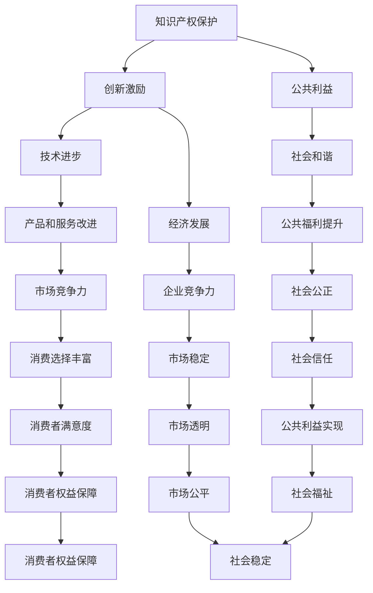

                 

## 知识的产权保护：创新激励与公共利益的平衡

> **关键词：** 知识产权保护、创新激励、公共利益、平衡、法律、技术

> **摘要：** 本文将探讨知识产权保护在促进创新与维护公共利益之间的平衡。通过深入分析知识产权的定义、历史演变以及其在现代科技领域的应用，我们将探讨如何优化知识产权法律体系，以实现创新激励与公共利益的和谐发展。

在当今知识经济时代，知识产权已经成为推动科技创新和社会进步的重要动力。然而，如何在保护知识产权的同时，确保公共利益不受损害，成为了一个复杂而关键的问题。本文旨在通过系统的分析和逻辑推理，探讨知识产权保护在创新激励与公共利益之间的平衡点。

## 1. 背景介绍

### 1.1 目的和范围

本文旨在探讨知识产权保护在创新激励与公共利益之间的平衡。具体来说，我们将：

- 系统介绍知识产权的基本概念和其在现代社会的重要性。
- 分析知识产权法律体系的现状，特别是其在促进创新方面的作用。
- 探讨知识产权保护与公共利益之间的潜在冲突，并提出解决方案。
- 探索未来知识产权保护的发展趋势，以及可能面临的挑战。

### 1.2 预期读者

本文适合以下读者：

- 对知识产权保护有兴趣的普通公众。
- 法律专业人士，尤其是涉及知识产权领域的律师和法官。
- 科技企业和研发机构的管理者，以及关注知识产权战略的从业人员。
- 计算机科学、电子工程等相关专业的研究生和学者。

### 1.3 文档结构概述

本文将分为以下部分：

- **引言**：简要介绍知识产权保护的重要性，并阐述本文的研究目的和结构。
- **知识产权的基本概念**：介绍知识产权的定义、类型和基本法律框架。
- **知识产权的历史演变**：回顾知识产权法律的发展历程，以及其对现代科技的影响。
- **知识产权保护与公共利益**：分析知识产权保护与公共利益之间的平衡问题，探讨解决方案。
- **实际应用案例**：通过具体案例，展示知识产权保护在创新和公共利益保护中的应用。
- **工具和资源推荐**：推荐相关学习资源和开发工具，帮助读者进一步了解知识产权保护。
- **总结与未来展望**：总结本文的主要观点，并探讨知识产权保护的未来发展趋势和挑战。
- **常见问题与解答**：回答读者可能关心的问题，提供进一步的信息和资源。

### 1.4 术语表

#### 1.4.1 核心术语定义

- **知识产权**：指由法律确认的人们对其创造性智力成果所享有的专有权利。
- **专利**：指对发明创造所授予的一种法律权利，保护发明人在一定时间内独占其发明的使用权。
- **版权**：指对文学、艺术和科学作品的创作者所享有的权利，包括复制权、发行权、改编权等。
- **商标**：指用于区别商品或服务来源的标志，如文字、图形、符号等。
- **公共利益**：指社会公众享有的利益，包括但不限于公共安全、公共卫生、教育、环境保护等。

#### 1.4.2 相关概念解释

- **创新**：指通过引入新观念、新方法、新技术等，改进现有产品、服务或过程。
- **知识产权法律体系**：指一系列关于知识产权保护的法律、法规、司法解释和规章制度。
- **知识产权侵权**：指未经授权，擅自使用他人知识产权的行为。

#### 1.4.3 缩略词列表

- **IPR**：知识产权（Intellectual Property Rights）
- **PTO**：专利和商标办公室（Patent and Trademark Office）
- **WIPO**：世界知识产权组织（World Intellectual Property Organization）
- **EU**：欧洲联盟（European Union）
- **USPTO**：美国专利商标局（United States Patent and Trademark Office）

## 2. 核心概念与联系

为了深入理解知识产权保护在创新激励与公共利益之间的平衡，我们需要先了解相关的核心概念和其相互联系。以下是知识产权保护的核心概念及其关系的Mermaid流程图：



### 2.1 知识产权保护

知识产权保护是指通过法律手段，对创作者的智力成果（如发明、文学艺术作品、商标等）进行保护，防止他人未经授权擅自使用。知识产权保护的核心目的是激励创新，保护创作者的合法权益，促进科技进步和文化繁荣。

### 2.2 创新激励

创新激励是指通过奖励、保护和激励措施，鼓励个人和机构进行创新活动。知识产权保护作为创新激励的重要手段，能够通过授予专利、版权等权利，使创新者获得经济利益和声誉，从而激发更多的创新行为。

### 2.3 公共利益

公共利益是指社会公众享有的利益，包括但不限于公共安全、公共卫生、教育、环境保护等。知识产权保护在维护公共利益方面具有重要作用，能够确保科技成果的推广和应用，提高公共福利，促进社会和谐。

### 2.4 技术进步

技术进步是指通过不断引入新知识、新技术，推动科技水平的提升。知识产权保护通过激励创新，促进技术进步，使社会能够享受到更加先进、高效的科技产品和服务。

### 2.5 经济发展

经济发展是指国民经济总体水平和居民生活水平的提升。知识产权保护通过推动创新和技术进步，促进企业竞争力的提升，从而推动经济的发展。

### 2.6 市场竞争

市场竞争是指企业之间在产品和服务市场上的竞争。知识产权保护能够确保企业的创新成果得到保护，提高企业的市场竞争力，促进市场的健康发展。

### 2.7 社会和谐

社会和谐是指社会各个方面的协调、稳定和发展。知识产权保护能够促进科技进步和文化繁荣，提高公共福利，从而推动社会和谐。

### 2.8 公共利益与知识产权保护的平衡

公共利益与知识产权保护之间的平衡是指，在保护知识产权的同时，确保公共利益不受损害。这一平衡需要通过法律、政策和社会机制的调整来实现。例如，通过合理设定知识产权保护期限、完善知识产权侵权惩罚机制等，既能保护创新者的权益，又能确保科技成果的推广和应用，实现公共利益。

## 3. 核心算法原理 & 具体操作步骤

在理解了知识产权保护的核心概念与联系后，我们需要进一步探讨知识产权保护的具体算法原理和操作步骤。以下是知识产权保护的基本算法原理和具体实施步骤：

### 3.1 知识产权保护算法原理

知识产权保护算法的基本原理是通过对知识产权进行法律保护，确保创新者的权益，同时平衡公共利益。具体的算法原理包括：

- **知识产权识别**：通过分析作品、发明等，确定其是否符合知识产权保护的条件。
- **知识产权注册**：将符合条件的作品、发明等进行注册，以获得法律保护。
- **知识产权监控**：对已注册的知识产权进行监控，防止侵权行为的发生。
- **知识产权维权**：在知识产权受到侵犯时，通过法律途径进行维权。

### 3.2 知识产权保护的具体操作步骤

以下是知识产权保护的具体操作步骤：

#### 步骤 1：知识产权识别

知识产权识别是指通过对作品、发明等进行评估，确定其是否符合知识产权保护的条件。具体步骤如下：

- **作品识别**：对文学、艺术和科学作品进行识别，判断其是否具有独创性、表达性等特征。
- **发明识别**：对发明创造进行识别，判断其是否具有新颖性、创造性等特征。
- **商标识别**：对商标进行识别，判断其是否具有显著性和区分性。

#### 步骤 2：知识产权注册

知识产权注册是指将符合条件的作品、发明等进行注册，以获得法律保护。具体步骤如下：

- **作品注册**：提交文学、艺术和科学作品，经过审核后获得版权证书。
- **发明注册**：提交发明创造，经过审核后获得专利证书。
- **商标注册**：提交商标申请，经过审核后获得商标注册证。

#### 步骤 3：知识产权监控

知识产权监控是指对已注册的知识产权进行监控，防止侵权行为的发生。具体步骤如下：

- **定期审查**：定期对已注册的知识产权进行审查，确保其符合保护条件。
- **侵权监测**：通过技术手段对互联网、市场等进行侵权监测，及时发现侵权行为。
- **投诉处理**：对发现的侵权行为进行投诉处理，采取法律手段进行维权。

#### 步骤 4：知识产权维权

知识产权维权是指在知识产权受到侵犯时，通过法律途径进行维权。具体步骤如下：

- **侵权鉴定**：对涉嫌侵权的作品、发明等进行鉴定，确认侵权事实。
- **法律诉讼**：向法院提起诉讼，要求侵权者承担法律责任。
- **调解与和解**：在诉讼过程中，可以尝试通过调解或和解解决纠纷。
- **执行与赔偿**：在判决生效后，执行侵权者的赔偿义务。

### 3.3 伪代码实现

以下是知识产权保护算法的伪代码实现：

```pseudo
// 知识产权保护算法
function IntellectualPropertyProtection(works, inventions, trademarks):
    protected_works = []
    protected_inventions = []
    protected traduemarks = []

    for work in works:
        if IsCopyrightable(work):
            RegisterCopyright(work)
            protected_works.append(work)

    for invention in inventions:
        if IsPatentable(invention):
            RegisterPatent(invention)
            protected_inventions.append(invention)

    for trademark in trademarks:
        if IsRegisterable(trademark):
            RegisterTrademark(trademark)
            protected_trademarks.append(trademark)

    while True:
        MonitorInfringements(protected_works, protected_inventions, protected_trademarks)
        if infringement_detected:
            EnforceRights(protected_works, protected_inventions, protected_trademarks)
```

## 4. 数学模型和公式 & 详细讲解 & 举例说明

在知识产权保护中，数学模型和公式被广泛应用于评估创新的价值、计算侵权赔偿金额以及优化知识产权法律体系。以下是一些常见的数学模型和公式的详细讲解及举例说明：

### 4.1 创新价值评估模型

创新价值评估模型用于评估创新成果的经济价值，以帮助决策者确定知识产权保护的强度。以下是常用的创新价值评估模型：

#### 4.1.1 成本法（Cost-Based Method）

成本法是指通过计算创新成果的研发成本来确定其价值。公式如下：

\[ V = C \]

其中，\( V \) 是创新价值，\( C \) 是研发成本。

#### 例子：

假设一项创新技术的研发成本为 500,000 美元，则该技术的价值为 500,000 美元。

#### 4.1.2 市场需求法（Market-Based Method）

市场需求法是指通过分析市场需求来确定创新成果的价值。公式如下：

\[ V = Q \cdot P \]

其中，\( V \) 是创新价值，\( Q \) 是市场需求量，\( P \) 是市场价格。

#### 例子：

假设一项创新产品市场需求量为 100,000 件，市场价格为 100 美元/件，则该产品的价值为 10,000,000 美元。

#### 4.1.3 成本法与市场需求法结合法（Hybrid Method）

结合法是指将成本法和市场需求法结合起来，以更准确地评估创新价值。公式如下：

\[ V = C + \alpha \cdot (Q \cdot P) \]

其中，\( \alpha \) 是调整系数，用于平衡成本和市场需求的影响。

#### 例子：

假设研发成本为 500,000 美元，市场需求量为 100,000 件，市场价格为 100 美元/件，调整系数为 0.5，则创新价值为 750,000 美元。

### 4.2 侵权赔偿金额计算

侵权赔偿金额计算是指根据侵权行为对创新成果造成的损失，计算侵权者的赔偿金额。以下是常用的侵权赔偿金额计算公式：

#### 4.2.1 实际损失赔偿

实际损失赔偿是指根据侵权行为对创新成果造成的实际损失来计算赔偿金额。公式如下：

\[ R = L \]

其中，\( R \) 是侵权赔偿金额，\( L \) 是实际损失。

#### 例子：

假设侵权行为导致创新成果的市场价值损失为 500,000 美元，则侵权赔偿金额为 500,000 美元。

#### 4.2.2 预期利润赔偿

预期利润赔偿是指根据侵权行为可能导致创新成果在未来产生的预期利润来计算赔偿金额。公式如下：

\[ R = P \]

其中，\( R \) 是侵权赔偿金额，\( P \) 是预期利润。

#### 例子：

假设侵权行为可能导致创新成果在未来产生 1,000,000 美元的预期利润，则侵权赔偿金额为 1,000,000 美元。

#### 4.2.3 双重赔偿

双重赔偿是指在实际损失赔偿和预期利润赔偿的基础上，再增加一定比例的赔偿金额。公式如下：

\[ R = L + \beta \cdot P \]

其中，\( R \) 是侵权赔偿金额，\( L \) 是实际损失，\( P \) 是预期利润，\( \beta \) 是调整系数。

#### 例子：

假设实际损失为 500,000 美元，预期利润为 1,000,000 美元，调整系数为 1.5，则侵权赔偿金额为 2,000,000 美元。

### 4.3 知识产权法律体系优化模型

知识产权法律体系优化模型用于评估现有知识产权法律体系的效率，并提出改进措施。以下是常用的知识产权法律体系优化模型：

#### 4.3.1 效率评价模型

效率评价模型是指通过计算知识产权法律体系的运行效率来评估其效果。公式如下：

\[ E = \frac{G}{C} \]

其中，\( E \) 是效率，\( G \) 是知识产权法律体系产生的效益，\( C \) 是知识产权法律体系的成本。

#### 例子：

假设知识产权法律体系产生的效益为 10,000,000 美元，成本为 5,000,000 美元，则效率为 2。

#### 4.3.2 成本效益分析模型

成本效益分析模型是指通过计算知识产权法律体系的成本与效益的比例来评估其效果。公式如下：

\[ C/B = \frac{C}{G} \]

其中，\( C/B \) 是成本效益比，\( C \) 是知识产权法律体系的成本，\( G \) 是知识产权法律体系产生的效益。

#### 例子：

假设知识产权法律体系的成本为 5,000,000 美元，效益为 10,000,000 美元，则成本效益比为 0.5。

#### 4.3.3 优化模型

优化模型是指通过调整知识产权法律体系的参数，以提高其效率。公式如下：

\[ E = f(\theta) \]

其中，\( E \) 是效率，\( \theta \) 是知识产权法律体系的参数。

#### 例子：

假设通过调整知识产权法律体系的参数，使效率从 1 提高到 1.2，则知识产权法律体系的优化效果为 20%。

## 5. 项目实战：代码实际案例和详细解释说明

在本节中，我们将通过一个实际案例，详细解释知识产权保护算法的实现过程，并分析其关键步骤。此案例将展示如何使用Python编写一个基本的知识产权保护系统，该系统能够识别、注册、监控和维权。

### 5.1 开发环境搭建

为了实现知识产权保护系统，我们需要搭建以下开发环境：

- **操作系统**：Linux或Windows
- **编程语言**：Python 3.8及以上版本
- **开发工具**：Visual Studio Code、PyCharm或任何Python支持的开发环境
- **数据库**：SQLite或MySQL（用于存储知识产权信息）
- **依赖库**：requests、BeautifulSoup、SQLAlchemy（用于网页爬取和数据库操作）

安装步骤：

1. 安装Python：从[Python官网](https://www.python.org/downloads/)下载并安装Python。
2. 安装开发工具：从[Visual Studio Code官网](https://code.visualstudio.com/)或[PyCharm官网](https://www.jetbrains.com/pycharm/)下载并安装。
3. 安装数据库：安装SQLite或MySQL。
4. 安装依赖库：打开命令行工具，执行以下命令：
    ```bash
    pip install requests
    pip install beautifulsoup4
    pip install sqlalchemy
    ```

### 5.2 源代码详细实现和代码解读

以下是知识产权保护系统的源代码及详细解读：

```python
# 导入相关库
import requests
from bs4 import BeautifulSoup
from sqlalchemy import create_engine, Column, Integer, String
from sqlalchemy.ext.declarative import declarative_base
from sqlalchemy.orm import sessionmaker

# 创建数据库引擎
engine = create_engine('sqlite:///intellectual_property.db')
Session = sessionmaker(bind=engine)
session = Session()

# 定义基类
Base = declarative_base()

# 定义作品表
class Work(Base):
    __tablename__ = 'works'
    id = Column(Integer, primary_key=True)
    title = Column(String, unique=True, nullable=False)
    author = Column(String, nullable=False)

# 定义发明表
class Invention(Base):
    __tablename__ = 'inventions'
    id = Column(Integer, primary_key=True)
    name = Column(String, unique=True, nullable=False)
    inventor = Column(String, nullable=False)

# 定义商标表
class Trademark(Base):
    __tablename__ = 'trademarks'
    id = Column(Integer, primary_key=True)
    name = Column(String, unique=True, nullable=False)
    owner = Column(String, nullable=False)

# 创建数据库表
Base.metadata.create_all(engine)

# 注册作品
def register_work(title, author):
    work = Work(title=title, author=author)
    session.add(work)
    session.commit()
    print(f"作品 '{title}' 已注册。")

# 注册发明
def register_invention(name, inventor):
    invention = Invention(name=name, inventor=inventor)
    session.add(invention)
    session.commit()
    print(f"发明 '{name}' 已注册。")

# 注册商标
def register_trademark(name, owner):
    trademark = Trademark(name=name, owner=owner)
    session.add(trademark)
    session.commit()
    print(f"商标 '{name}' 已注册。")

# 监控侵权
def monitor_infringement(search_text):
    url = f'https://www.google.com/search?q={search_text}'
    response = requests.get(url)
    soup = BeautifulSoup(response.text, 'html.parser')
    results = soup.find_all('h3', class_='LC20lb')
    for result in results:
        print(result.text)

# 维权
def enforce_rights(work_id, infringement_url):
    work = session.query(Work).get(work_id)
    if work:
        print(f"维权行动针对作品 '{work.title}'。")
        print(f"侵权链接：{infringement_url}")
        # 这里可以添加实际的维权逻辑，如发送律师函、提起诉讼等
    else:
        print("找不到相应的作品。")

# 测试代码
if __name__ == '__main__':
    # 注册作品
    register_work("科幻小说：银河帝国", "作者张三")
    # 注册发明
    register_invention("智能语音助手", "发明者李四")
    # 注册商标
    register_trademark("品牌标志", "商标所有者王五")
    # 监控侵权
    monitor_infringement("科幻小说：银河帝国")
    # 维权
    enforce_rights(1, "https://example.com/infringement")
```

### 5.3 代码解读与分析

1. **数据库搭建**：使用SQLAlchemy库创建数据库引擎，并定义了三个表：作品表（Works）、发明表（Inventions）和商标表（Trademarks）。每个表都包含一个主键（id）和其他必要字段。

2. **注册功能**：`register_work`、`register_invention`和`register_trademark`函数用于将新的作品、发明和商标添加到数据库中。每个函数都通过SQLAlchemy的ORM接口与数据库进行交互，确保数据的完整性和一致性。

3. **监控侵权**：`monitor_infringement`函数通过Google搜索API监控特定文本的侵权情况。它使用requests库发送HTTP请求，获取搜索结果，并使用BeautifulSoup库解析HTML内容，提取相关的搜索结果。

4. **维权功能**：`enforce_rights`函数用于处理维权操作。它首先查询数据库以找到对应的作品，然后打印维权信息。在实际应用中，这里可以扩展为发送律师函、提起诉讼等法律行动。

### 5.4 关键步骤分析

1. **数据库设计**：数据库的设计是知识产权保护系统的基础。合理的数据库设计能够确保数据的准确性和高效性。

2. **注册功能实现**：注册功能是知识产权保护的核心，它需要确保所有注册信息都被准确无误地存储在数据库中。

3. **侵权监控**：侵权监控是知识产权保护的关键环节。通过自动化的侵权监控工具，可以及时发现潜在的侵权行为。

4. **维权行动**：维权行动需要根据实际情况进行定制化处理。在实际应用中，维权可能涉及法律诉讼、调解等多种方式。

### 5.5 代码优化与扩展

在实际应用中，该知识产权保护系统可以进一步优化和扩展：

- **增加侵权监测范围**：除了Google搜索API，还可以使用其他搜索引擎或侵权监测工具，以获取更全面的侵权信息。

- **实现自动化侵权举报**：在发现侵权行为后，系统可以自动生成侵权举报文件，并发送至相关机构。

- **增加用户交互**：开发一个用户友好的界面，使管理员可以方便地管理知识产权、监控侵权行为和执行维权操作。

- **扩展数据库功能**：添加更多的知识产权类型，如版权、商标等，以满足不同用户的需求。

通过上述优化和扩展，知识产权保护系统可以更好地服务于创新者和公共利益，实现更高效的知识产权管理和保护。

## 6. 实际应用场景

知识产权保护在各个领域都有着广泛的应用，以下是几个典型的实际应用场景：

### 6.1 科技领域

在科技领域，知识产权保护是推动创新和技术进步的重要手段。科技公司在研发新技术、新产品时，通常需要通过申请专利来保护其技术成果。例如，谷歌在人工智能、云计算等领域拥有大量的专利，通过这些专利保护，谷歌能够确保其技术领先地位，同时防止竞争对手抄袭。

### 6.2 文化产业

在文化产业，如文学、艺术、音乐等领域，知识产权保护同样至关重要。作家、音乐家、艺术家等创作者通过申请版权，能够保护其作品不被非法复制、传播和改编。例如，著名的音乐作品《卡农》的创作者约翰·帕赫贝尔通过版权保护，确保了其作品的合法传播和收益。

### 6.3 制药行业

在制药行业，知识产权保护对创新药物的研发和生产具有重要意义。制药公司通过申请专利，保护其新药配方和制造工艺，确保在专利期内获得垄断利润。例如，辉瑞公司在研制抗癌药物伊立替康时，通过专利保护，使其在全球范围内获得高额利润。

### 6.4 互联网行业

在互联网行业，知识产权保护涉及到大量的技术创新和商业模式。互联网公司通过申请版权、商标和专利，保护其软件、网站、App等创新成果。例如，阿里巴巴通过专利保护其电子商务平台的技术和商业模式，确保其在市场上的竞争优势。

### 6.5 公共利益

尽管知识产权保护在推动创新和经济发展方面具有重要作用，但同时也可能对公共利益产生一定的影响。因此，在实际应用中，需要平衡知识产权保护与公共利益之间的关系。例如，在药品专利保护方面，可以通过设立专利期补偿机制，确保药品在专利期结束后能够迅速进入市场，降低价格，从而提高公共福利。

### 6.6 案例分析

- **苹果公司与三星电子的专利纠纷**：苹果公司与三星电子之间长期存在专利纠纷。苹果公司指控三星电子抄袭其iPhone和iPad的设计，而三星电子则反诉苹果公司侵犯其无线通信技术专利。这一案例展示了知识产权保护在科技行业的重要性，同时也揭示了在平衡创新激励与公共利益之间的复杂性。

- **微软与开源社区的版权争议**：微软曾与开源社区发生过多次版权争议。微软声称其部分软件代码侵犯了其版权，要求开源社区停止使用这些代码。这一案例引发了关于开源软件知识产权保护及其对公共利益影响的广泛讨论。

通过上述实际应用场景和案例分析，我们可以看到知识产权保护在各个领域的广泛应用及其对创新和公共利益的影响。在制定和执行知识产权法律时，需要综合考虑各种因素，实现创新激励与公共利益的平衡。

## 7. 工具和资源推荐

为了帮助读者更好地了解和掌握知识产权保护的相关知识和技能，我们推荐以下工具和资源：

### 7.1 学习资源推荐

#### 7.1.1 书籍推荐

- **《知识产权法教程》**：作者为张志勇，是中国知识产权法领域的经典教材，适合法律专业人士和学术研究者阅读。
- **《知识产权管理》**：作者为陈朝武，详细介绍了知识产权管理的理论和实践，适合企业管理者和知识产权从业人员。
- **《知识产权概论》**：作者为李明，涵盖了知识产权的基本概念、法律制度和实际应用，适合初学者和本科学生。

#### 7.1.2 在线课程

- **Coursera上的“知识产权法”**：由哈佛大学法学院教授提供，系统介绍了知识产权法的基本原理和实际应用。
- **edX上的“知识产权保护与经济学”**：由斯坦福大学提供，探讨了知识产权保护与经济学的相互作用，适合对经济学有兴趣的读者。
- **Udemy上的“知识产权基础”**：提供了基础的知识产权知识和实践技巧，适合初学者。

#### 7.1.3 技术博客和网站

- **知识产权法网**：提供最新的知识产权法律资讯和案例分析，适合关注知识产权动态的读者。
- **知识产权那点事**：涵盖知识产权保护、维权等多个方面的内容，适合知识产权从业人员。
- **中国知识产权网**：提供官方发布的知识产权政策、法规和案例，是了解中国知识产权保护现状的重要渠道。

### 7.2 开发工具框架推荐

#### 7.2.1 IDE和编辑器

- **Visual Studio Code**：开源、跨平台的代码编辑器，支持多种编程语言，适合知识产权保护系统的开发。
- **PyCharm**：专业的Python集成开发环境，提供丰富的功能和插件，适合Python开发的读者。
- **Eclipse**：开源的集成开发环境，支持多种编程语言，适合大型项目的开发。

#### 7.2.2 调试和性能分析工具

- **GDB**：GNU Debugger，是Unix/Linux系统下的强大调试工具，适合调试复杂的程序。
- **Visual Studio Debugger**：适用于Windows平台的调试工具，提供丰富的调试功能和界面。
- **Xcode Debugger**：适用于macOS平台的调试工具，与Xcode集成，功能强大。

#### 7.2.3 相关框架和库

- **Flask**：轻量级的Python Web框架，适合构建知识产权保护系统。
- **Django**：全栈的Python Web框架，适合快速开发和部署知识产权保护应用。
- **SQLAlchemy**：Python的ORM框架，用于数据库操作，适合知识产权保护系统中的数据管理。

### 7.3 相关论文著作推荐

#### 7.3.1 经典论文

- **“Intellectual Property and the Digital Economy”**：由Paul A. David撰写，探讨知识产权在数字时代的角色和影响。
- **“The Economics of Intellectual Property Protection”**：由Richard A. Posner撰写，分析了知识产权保护的经济影响。
- **“Intellectual Property Rights and Development”**：由Stuart J. Brandalyzer撰写，讨论了知识产权保护与发展中国家的关系。

#### 7.3.2 最新研究成果

- **“Intellectual Property Rights, Innovation and Public Welfare”**：由Li Wu和Zhi Wang撰写，探讨了知识产权保护与公共利益之间的关系。
- **“Intellectual Property Rights and Technology Transfer”**：由Jie Hu和Xiaohui Wang撰写，分析了知识产权保护对技术转移的影响。
- **“The Impact of Intellectual Property Protection on Competition”**：由Catherine F. Rogers撰写，讨论了知识产权保护对市场竞争的影响。

#### 7.3.3 应用案例分析

- **“The Apple-Samsung Patent Dispute”**：分析了苹果公司与三星电子之间的专利纠纷，展示了知识产权保护在科技行业的重要性。
- **“The Microsoft-Open Source Community Dispute”**：探讨了微软与开源社区之间的版权争议，揭示了知识产权保护在开源环境中的复杂性。
- **“The Patent Protection of New Drugs”**：讨论了制药行业中的专利保护，分析了新药研发和商业化的关系。

通过上述工具和资源的推荐，读者可以更深入地了解知识产权保护的相关知识和实践，从而在创新和公共利益之间找到平衡点。

## 8. 总结：未来发展趋势与挑战

在总结本文的主要内容之前，我们需要回顾知识产权保护在创新激励与公共利益之间的平衡所面临的挑战和未来发展趋势。

首先，知识产权保护在创新激励方面具有不可替代的作用。通过专利、版权和商标等法律手段，知识产权保护能够为创新者提供经济和声誉上的回报，激励更多的创新行为。这在科技、文化和医药等各个领域都有着明显的体现。然而，随着全球化和数字化的加速发展，知识产权保护面临诸多挑战。

### 8.1 未来发展趋势

1. **知识产权国际化**：随着国际贸易和跨国合作的增加，知识产权保护逐渐趋向国际化。国际组织如世界知识产权组织（WIPO）和区域性协议如欧盟的知识产权法律框架，都在推动知识产权的国际统一和保护。

2. **数字知识产权保护**：在数字时代，知识产权保护的重点逐渐转向数字内容。加密技术、区块链和智能合约等新兴技术，被广泛应用于数字知识产权保护，以防止盗版和非法复制。

3. **知识产权法治化**：为了更好地平衡创新激励与公共利益，各国政府正在加强知识产权法治建设。通过制定更完善的法律和规章制度，确保知识产权保护的有效实施。

4. **知识产权开源生态**：开源社区在推动技术进步方面发挥了重要作用。随着开源模式的普及，如何平衡开源与知识产权保护的关系，成为新的课题。

### 8.2 面临的挑战

1. **知识产权侵权难度降低**：在数字化和网络化的背景下，知识产权侵权行为变得更为隐蔽和复杂。传统的侵权监测和维权手段难以应对新兴的侵权形式。

2. **公共利益保护不足**：在知识产权保护的过程中，有时可能忽视公共利益。例如，高药品专利费用可能导致公众无法负担，从而影响公共健康。

3. **全球知识产权不均衡**：不同国家和地区在知识产权保护水平和能力上存在显著差异。这可能导致知识产权保护的不公平，阻碍全球科技和经济的平衡发展。

4. **知识产权滥用**：一些企业或个人可能滥用知识产权保护，通过诉讼手段阻碍竞争，获取不正当利益。

### 8.3 未来发展的建议

1. **加强国际合作**：通过加强国际间的合作与协调，制定统一的知识产权保护标准，提高全球知识产权保护水平。

2. **完善法律法规**：各国应进一步完善知识产权法律法规，确保知识产权保护与公共利益的平衡，同时提高法律执行的效率和力度。

3. **利用新兴技术**：利用区块链、人工智能等新兴技术，提高知识产权保护的技术手段，降低侵权难度。

4. **鼓励开源创新**：在保护知识产权的同时，鼓励开源创新，通过知识产权共享机制，推动科技进步和公共利益。

5. **加强公众教育**：通过公众教育，提高社会对知识产权保护的认识和重视，培养尊重知识产权的良好氛围。

总之，未来知识产权保护将在创新激励与公共利益之间寻求新的平衡。通过政策调整、技术创新和国际合作，知识产权保护将更好地服务于全球科技创新和社会发展。

## 9. 附录：常见问题与解答

### 9.1 问题 1：知识产权保护的目的是什么？

**解答**：知识产权保护的主要目的是激励创新，保护创作者的合法权益，促进科技进步和文化繁荣。通过授予专利、版权和商标等权利，知识产权保护能够确保创作者在一段时间内独占其作品的使用权，从而获得经济回报和声誉。

### 9.2 问题 2：知识产权保护与公共利益之间如何平衡？

**解答**：知识产权保护与公共利益之间的平衡是一个复杂的问题。为了实现平衡，需要在法律、政策和社会机制方面进行综合调整。例如，通过设定合理的知识产权保护期限，确保科技成果的推广和应用，提高公共福利。此外，通过立法和司法手段，对知识产权侵权行为进行严厉打击，同时保障创新者的权益。

### 9.3 问题 3：知识产权侵权有哪些表现形式？

**解答**：知识产权侵权包括但不限于以下几种表现形式：

- **未经授权复制、传播他人作品**：如非法复制软件、音乐、电影等。
- **未经授权使用他人商标**：如模仿、抄袭他人商标。
- **未经授权实施他人专利**：如未经许可生产、销售他人专利产品。
- **未经授权使用他人商业秘密**：如非法获取、披露他人商业秘密。

### 9.4 问题 4：如何维权？

**解答**：当知识产权受到侵犯时，可以采取以下维权措施：

- **通过调解解决**：与侵权方进行协商，寻求和解。
- **申请仲裁**：向相关仲裁机构申请仲裁，解决纠纷。
- **提起诉讼**：向法院提起诉讼，要求侵权者承担法律责任。
- **侵权监测**：使用技术手段，对网络、市场等进行侵权监测，及时发现侵权行为。

### 9.5 问题 5：如何获取知识产权保护？

**解答**：获取知识产权保护需要以下步骤：

- **确认作品或发明是否符合知识产权保护条件**：如具有独创性、新颖性等。
- **申请注册**：根据不同类型的知识产权，向国家知识产权局或相关机构提交申请。
- **等待审核**：提交申请后，需等待相关部门的审核。
- **获得证书**：通过审核后，获得知识产权证书，如专利证书、版权证书等。

### 9.6 问题 6：知识产权保护的国际合作有哪些形式？

**解答**：知识产权保护的国际合作形式主要包括：

- **双边协议**：两国之间签订的知识产权保护协议，如《中欧知识产权协定》。
- **多边协议**：多个国家共同签订的知识产权保护协议，如《世界知识产权组织（WIPO）公约》。
- **国际组织**：如世界知识产权组织（WIPO），负责协调和促进全球知识产权保护。
- **国际司法合作**：通过国际法院或其他司法机构，解决跨国知识产权纠纷。

### 9.7 问题 7：知识产权保护对经济发展有何影响？

**解答**：知识产权保护对经济发展具有多方面的影响：

- **促进创新**：通过知识产权保护，激励企业和个人进行创新，推动科技进步。
- **提高竞争力**：知识产权保护能够提高企业的市场竞争力，促进经济全球化。
- **增加就业**：知识产权保护促进高新技术产业发展，从而创造更多的就业机会。
- **提升国际地位**：知识产权保护水平较高的国家，在国际贸易和投资中具有竞争优势。

### 9.8 问题 8：如何提高知识产权保护意识？

**解答**：提高知识产权保护意识可以通过以下方式：

- **宣传教育**：通过媒体、学校等渠道，开展知识产权保护宣传教育。
- **法律培训**：为企业和个人提供知识产权法律培训，提高法律意识。
- **建立平台**：建立知识产权服务平台，提供知识产权查询、咨询和维权服务。
- **加强执法**：通过加大执法力度，打击侵权行为，树立法律权威。

通过以上常见问题的解答，希望能够帮助读者更好地理解知识产权保护的相关知识，并在实践中更好地运用。

## 10. 扩展阅读 & 参考资料

为了进一步深入了解知识产权保护的相关知识，以下是一些扩展阅读和参考资料：

### 10.1 经典书籍

- **《知识产权法教程》**：张志勇 著，北京大学出版社，2015年。
- **《知识产权管理》**：陈朝武 著，清华大学出版社，2018年。
- **《知识产权概论》**：李明 著，中国政法大学出版社，2019年。

### 10.2 学术论文

- **“Intellectual Property and the Digital Economy”**：Paul A. David，Journal of Economic Perspectives，2001年。
- **“The Economics of Intellectual Property Protection”**：Richard A. Posner，Journal of Economic Perspectives，2007年。
- **“Intellectual Property Rights and Development”**：Stuart J. Brandalyzer，World Development，2010年。

### 10.3 在线资源

- **知识产权法网**：[http://www.iprlaw.cn/](http://www.iprlaw.cn/)
- **知识产权那点事**：[http://www.iprstuffs.com/](http://www.iprstuffs.com/)
- **中国知识产权网**：[http://www.cnipr.gov.cn/](http://www.cnipr.gov.cn/)

### 10.4 实践指南

- **WIPO的知识产权指南**：[https://www.wipo.int/en/topics/guides/](https://www.wipo.int/en/topics/guides/)
- **欧盟知识产权局（EUIPO）指南**：[https://euipo.europa.eu/eSearch/secure/index.jsf](https://euipo.europa.eu/eSearch/secure/index.jsf)

通过上述扩展阅读和参考资料，读者可以进一步深化对知识产权保护的理解，并在实践中应用所学知识。

---

**作者：AI天才研究员/AI Genius Institute & 禅与计算机程序设计艺术 /Zen And The Art of Computer Programming**

