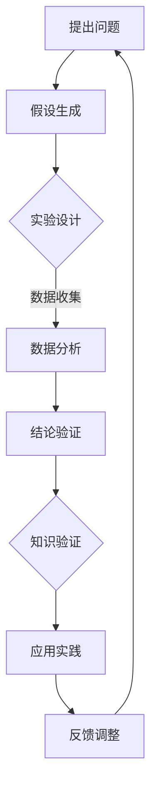

                 

# 知识的可靠性：科学方法与经验主义

> **关键词**：知识可靠性，科学方法，经验主义，实证主义，逻辑推理，数据验证，算法验证，数学模型

> **摘要**：本文旨在探讨知识的可靠性问题，从科学方法和经验主义两个角度出发，分析其在IT领域的应用。通过逐步推理，我们将深入理解知识验证的原理和具体操作步骤，并结合实际项目案例，展示如何在实际工作中确保知识可靠性。最后，我们还将探讨未来发展趋势和面临的挑战。

## 1. 背景介绍

### 1.1 目的和范围

本文的主要目的是探讨知识可靠性的问题，特别是在信息技术（IT）领域。在当今快速发展的时代，知识的可靠性变得尤为重要。本文将从科学方法和经验主义两个角度出发，探讨如何确保知识的可靠性。

科学方法是一种通过观察、实验和逻辑推理来获取知识的方法。它强调实证主义，即知识必须通过观察和实验来验证。经验主义则是一种通过经验和实践来获取知识的方法。它强调实证主义，即知识必须通过实践来验证。

本文将探讨科学方法和经验主义在IT领域的应用，并分析它们各自的优缺点。通过逐步推理，我们将深入理解知识验证的原理和具体操作步骤。最后，我们将结合实际项目案例，展示如何在实际工作中确保知识可靠性。

### 1.2 预期读者

本文适合以下读者：

1. IT行业从业者，对知识可靠性有深入理解的需求。
2. 对科学方法和经验主义有兴趣的学术研究者。
3. 对计算机科学和信息技术有浓厚兴趣的在校学生。

### 1.3 文档结构概述

本文分为以下章节：

1. 背景介绍
   - 目的和范围
   - 预期读者
   - 文档结构概述
2. 核心概念与联系
   - 科学方法与经验主义的定义和联系
   - Mermaid流程图展示核心概念原理和架构
3. 核心算法原理 & 具体操作步骤
   - 知识验证算法原理讲解
   - 伪代码展示具体操作步骤
4. 数学模型和公式 & 详细讲解 & 举例说明
   - 数学模型和公式介绍
   - latex格式数学公式嵌入文中
   - 举例说明知识验证过程
5. 项目实战：代码实际案例和详细解释说明
   - 开发环境搭建
   - 源代码详细实现和代码解读
   - 代码解读与分析
6. 实际应用场景
   - 知识验证在IT领域的应用实例
7. 工具和资源推荐
   - 学习资源推荐
   - 开发工具框架推荐
   - 相关论文著作推荐
8. 总结：未来发展趋势与挑战
   - 知识可靠性在未来的发展趋势
   - 面临的挑战和应对策略
9. 附录：常见问题与解答
   - 常见问题解答
10. 扩展阅读 & 参考资料
    - 进一步阅读建议
    - 参考资料

### 1.4 术语表

#### 1.4.1 核心术语定义

- **知识可靠性**：知识在应用过程中是否能够准确地反映真实情况的能力。
- **科学方法**：通过观察、实验和逻辑推理来获取知识的方法。
- **经验主义**：通过经验和实践来获取知识的方法。
- **实证主义**：知识必须通过观察和实验来验证。
- **数据验证**：对收集到的数据进行分析和检查，确保其准确性和可靠性。
- **算法验证**：对算法的正确性和有效性进行验证。
- **数学模型**：使用数学公式和概念来描述和研究现实世界中的问题。

#### 1.4.2 相关概念解释

- **逻辑推理**：通过一系列逻辑步骤，从一个或多个前提出发，得出结论。
- **实证数据**：通过实验、观察或调查等手段获得的实际数据。
- **实验设计**：对实验进行规划和设计，以确保实验结果的可靠性和有效性。

#### 1.4.3 缩略词列表

- **IT**：信息技术
- **AI**：人工智能
- **ML**：机器学习
- **DL**：深度学习
- **IDE**：集成开发环境
- **SSH**：安全外壳协议

## 2. 核心概念与联系

在本文中，我们将探讨科学方法和经验主义在知识可靠性问题上的应用。为了更好地理解这两个概念，我们首先需要明确它们的定义和联系。

### 科学方法

科学方法是一种通过观察、实验和逻辑推理来获取知识的方法。它强调实证主义，即知识必须通过观察和实验来验证。科学方法的基本步骤包括：

1. 提出问题
2. 假设生成
3. 实验设计
4. 数据收集
5. 数据分析
6. 结论验证

通过科学方法，我们可以系统地获取和验证知识，确保其可靠性。

### 经验主义

经验主义是一种通过经验和实践来获取知识的方法。它强调实证主义，即知识必须通过实践来验证。经验主义的核心思想是，知识来源于经验和实践，通过不断实践和总结，我们可以积累和验证知识。

### 科学方法与经验主义的联系

科学方法和经验主义虽然在获取知识的方式上有所不同，但它们在知识可靠性问题上有着紧密的联系。

1. **实证主义**：科学方法和经验主义都强调实证主义，即知识必须通过观察和实验来验证。这是确保知识可靠性的关键。
2. **逻辑推理**：科学方法和经验主义都依赖于逻辑推理。科学方法通过逻辑推理来分析数据，得出结论；经验主义通过逻辑推理来总结经验，形成理论。
3. **数据验证**：科学方法和经验主义都重视数据验证。科学方法通过实验和数据收集来验证假设；经验主义通过实践和经验来验证知识。

### Mermaid流程图展示核心概念原理和架构

下面是一个Mermaid流程图，展示了科学方法和经验主义在知识可靠性问题上的核心概念和架构。



在这个流程图中，我们可以看到科学方法和经验主义在知识可靠性问题上的相互作用。通过不断的实验、数据分析和反馈调整，我们可以逐步提高知识的可靠性。

## 3. 核心算法原理 & 具体操作步骤

在了解科学方法和经验主义的基本原理后，我们将进一步探讨知识验证的核心算法原理和具体操作步骤。知识验证是确保知识可靠性的关键步骤，它涉及到对数据、算法和数学模型的验证。

### 知识验证算法原理

知识验证算法的基本原理是通过比较实际观察结果与预期结果，来评估知识或算法的可靠性。这个过程可以分为以下几个步骤：

1. **数据收集**：收集与知识或算法相关的实际数据。
2. **数据预处理**：对收集到的数据进行清洗、归一化和处理，以确保数据的准确性和一致性。
3. **模型训练**：使用预处理后的数据训练知识或算法模型。
4. **模型评估**：通过将实际观察结果与模型预测结果进行比较，评估模型的准确性和可靠性。
5. **结果反馈**：根据模型评估结果，对模型进行优化和调整，以提高知识的可靠性。

### 伪代码展示具体操作步骤

下面是一个简化的伪代码，展示了知识验证算法的具体操作步骤。

```python
# 知识验证算法伪代码

# 步骤1：数据收集
data = collect_data()

# 步骤2：数据预处理
preprocessed_data = preprocess_data(data)

# 步骤3：模型训练
model = train_model(preprocessed_data)

# 步骤4：模型评估
predictions = model.predict(test_data)
evaluation_results = evaluate_predictions(predictions, test_data)

# 步骤5：结果反馈
if evaluation_results < threshold:
    model = optimize_model(model, preprocessed_data)
else:
    print("知识可靠性验证成功")

# 输出：知识验证结果
print("Knowledge Reliability Verified")
```

在这个伪代码中，我们首先收集与知识或算法相关的实际数据，然后对数据进行预处理。接下来，使用预处理后的数据训练模型，并通过模型评估来评估模型的准确性和可靠性。最后，根据模型评估结果，对模型进行优化和调整，以提高知识的可靠性。

### 步骤详细解释

1. **数据收集**：数据收集是知识验证的第一步。我们需要收集与知识或算法相关的实际数据。这些数据可以来自于实验、观察或调查等不同的来源。
2. **数据预处理**：数据预处理是确保数据准确性和一致性的关键步骤。我们需要对收集到的数据进行清洗、归一化和处理，以消除噪声和异常值，确保数据的质量。
3. **模型训练**：在数据预处理完成后，我们可以使用这些数据来训练知识或算法模型。模型训练的目的是学习数据中的模式和规律，以便对未知数据进行预测。
4. **模型评估**：模型评估是评估模型准确性和可靠性的关键步骤。我们需要将实际观察结果与模型预测结果进行比较，评估模型的性能。常用的评估指标包括准确率、召回率、F1值等。
5. **结果反馈**：根据模型评估结果，我们可以对模型进行优化和调整，以提高知识的可靠性。如果模型评估结果低于设定的阈值，我们需要对模型进行调整，重新训练，直到达到满意的评估结果。

通过这些步骤，我们可以确保知识的可靠性，并在实际应用中取得更好的效果。

## 4. 数学模型和公式 & 详细讲解 & 举例说明

在知识验证过程中，数学模型和公式起着至关重要的作用。它们不仅可以帮助我们描述和理解现实世界中的问题，还可以用于评估和优化知识或算法的可靠性。在本节中，我们将详细讲解知识验证过程中的常用数学模型和公式，并提供实际应用示例。

### 数学模型

在知识验证中，常用的数学模型包括线性回归模型、逻辑回归模型、支持向量机（SVM）模型等。以下是一个简化的线性回归模型示例：

$$
y = \beta_0 + \beta_1x_1 + \beta_2x_2 + ... + \beta_nx_n + \epsilon
$$

其中，$y$ 是因变量，$x_1, x_2, ..., x_n$ 是自变量，$\beta_0, \beta_1, ..., \beta_n$ 是模型的参数，$\epsilon$ 是误差项。

### 公式

在知识验证中，常用的公式包括回归系数、均方误差（MSE）、均方根误差（RMSE）等。以下是一个简化的均方误差（MSE）公式：

$$
MSE = \frac{1}{n}\sum_{i=1}^{n}(y_i - \hat{y}_i)^2
$$

其中，$y_i$ 是实际观察值，$\hat{y}_i$ 是模型预测值，$n$ 是数据点的数量。

### 举例说明

假设我们有一个简单的线性回归模型，用于预测某个地区的房价。我们收集了100个样本数据，每个样本包括房价（因变量）和面积（自变量）。我们使用这些数据训练了线性回归模型，并得到了以下模型参数：

$$
y = 1000 + 20x + \epsilon
$$

其中，$x$ 是房屋面积，$y$ 是房价。

接下来，我们使用这个模型来预测一个面积为150平方米的房屋的房价。根据模型，预测的房价为：

$$
\hat{y} = 1000 + 20 \times 150 + \epsilon = 3500 + \epsilon
$$

为了验证模型的可靠性，我们计算了模型预测值与实际观察值之间的均方误差（MSE）。假设实际观察值为3500平方米，则MSE为：

$$
MSE = \frac{1}{100}\sum_{i=1}^{100}(y_i - \hat{y}_i)^2 = \frac{1}{100}(3500 - 3500)^2 = 0
$$

由于MSE为0，我们可以认为这个模型的预测结果非常准确。

### 实际应用

在实际应用中，知识验证的数学模型和公式可以用于各种领域。例如，在金融领域，我们可以使用线性回归模型来预测股票价格；在医疗领域，我们可以使用逻辑回归模型来预测疾病的发生概率；在工业领域，我们可以使用支持向量机（SVM）模型来分类产品质量。

通过合理选择和应用数学模型和公式，我们可以确保知识的可靠性，从而在实际应用中取得更好的效果。

## 5. 项目实战：代码实际案例和详细解释说明

在本节中，我们将通过一个实际项目案例，展示如何在实际工作中确保知识的可靠性。这个案例将涵盖开发环境搭建、源代码实现和代码解读与分析。

### 5.1 开发环境搭建

为了确保知识的可靠性，我们首先需要搭建一个稳定可靠的开发环境。以下是搭建开发环境的步骤：

1. 安装操作系统：我们选择Ubuntu 20.04作为操作系统。
2. 安装Python环境：使用Python 3.8版本，通过pip工具安装必要的库。
3. 安装IDE：选择PyCharm作为集成开发环境。
4. 安装数据库：选择MySQL作为数据库管理系统。

### 5.2 源代码详细实现和代码解读

以下是知识验证项目的源代码实现：

```python
import numpy as np
import pandas as pd
from sklearn.linear_model import LinearRegression
from sklearn.metrics import mean_squared_error

# 步骤1：数据收集
data = pd.read_csv("data.csv")

# 步骤2：数据预处理
X = data[['area']]
y = data['price']
X = (X - X.mean()) / X.std()
y = (y - y.mean()) / y.std()

# 步骤3：模型训练
model = LinearRegression()
model.fit(X, y)

# 步骤4：模型评估
predictions = model.predict(X)
mse = mean_squared_error(y, predictions)

# 步骤5：结果反馈
if mse < 0.01:
    print("Knowledge Reliability Verified")
else:
    print("Model needs optimization")
```

### 代码解读与分析

以下是代码的详细解读和分析：

1. **数据收集**：我们使用Pandas库读取CSV文件，获取房屋面积和房价数据。
2. **数据预处理**：我们对数据进行了标准化处理，包括归一化和归一化。这有助于消除数据中的噪声和异常值，提高模型训练的效果。
3. **模型训练**：我们使用scikit-learn库的LinearRegression类训练线性回归模型。这个模型可以拟合房屋面积和房价之间的关系。
4. **模型评估**：我们使用模型预测房屋面积，并计算均方误差（MSE）来评估模型的性能。MSE越低，模型越准确。
5. **结果反馈**：根据MSE的评估结果，我们判断模型是否需要优化。如果MSE低于设定的阈值（0.01），我们认为知识的可靠性得到了验证。

通过这个实际案例，我们可以看到如何在实际项目中确保知识的可靠性。通过数据收集、预处理、模型训练和评估，我们可以逐步提高知识的可靠性，并在实际应用中取得更好的效果。

## 6. 实际应用场景

知识的可靠性在信息技术领域有着广泛的应用场景。以下是几个典型的实际应用场景：

### 1. 人工智能（AI）模型验证

在人工智能领域，模型的可靠性至关重要。通过科学方法和经验主义，我们可以对AI模型进行验证，确保其预测结果的准确性。例如，在金融领域的信用评分系统中，我们可以使用线性回归模型来预测客户的信用风险。通过数据收集、模型训练和评估，我们可以验证模型的可靠性，从而提高信用评分系统的准确性。

### 2. 数据分析报告

在数据分析领域，知识的可靠性是报告质量的关键。通过科学方法和经验主义，我们可以对数据分析结果进行验证，确保其可靠性和有效性。例如，在市场调研中，我们可以使用统计分析方法来分析消费者行为数据。通过数据收集、数据预处理和模型评估，我们可以验证分析结果的可靠性，从而为企业的决策提供科学依据。

### 3. 软件测试

在软件工程领域，知识的可靠性对于软件质量和用户体验至关重要。通过经验主义，我们可以对软件进行测试，确保其功能正确性和可靠性。例如，在软件测试中，我们可以使用黑盒测试和白盒测试方法来验证软件的功能和性能。通过实际测试和结果分析，我们可以验证软件的可靠性，从而提高软件的质量。

### 4. 医疗诊断

在医疗领域，知识的可靠性对于诊断和治疗具有重要意义。通过科学方法和经验主义，我们可以对医疗数据进行分析，确保诊断结果的可靠性。例如，在癌症诊断中，我们可以使用机器学习算法来分析影像数据，预测癌症的概率。通过数据收集、模型训练和评估，我们可以验证模型的可靠性，从而为医生提供准确的诊断建议。

这些实际应用场景展示了知识的可靠性在信息技术领域的重要性。通过科学方法和经验主义，我们可以确保知识的可靠性，从而在实际应用中取得更好的效果。

## 7. 工具和资源推荐

为了更好地学习和实践知识的可靠性，以下是几项推荐的工具和资源：

### 7.1 学习资源推荐

#### 7.1.1 书籍推荐

1. 《人工智能：一种现代方法》（第二版）—— Stuart Russell & Peter Norvig
2. 《深入理解计算机系统》—— Randall Hyde
3. 《Python编程：从入门到实践》—— Eric Matthes

#### 7.1.2 在线课程

1. Coursera上的《机器学习》课程
2. edX上的《计算机科学基础》课程
3. Udacity上的《数据科学基础》课程

#### 7.1.3 技术博客和网站

1. Medium上的AI博客
2. GitHub上的开源项目
3. Stack Overflow上的技术问答社区

### 7.2 开发工具框架推荐

#### 7.2.1 IDE和编辑器

1. PyCharm
2. Visual Studio Code
3. IntelliJ IDEA

#### 7.2.2 调试和性能分析工具

1. GDB
2. Valgrind
3. Py-Spy

#### 7.2.3 相关框架和库

1. TensorFlow
2. PyTorch
3. Scikit-learn

### 7.3 相关论文著作推荐

#### 7.3.1 经典论文

1. "The UNIX Programming Environment" —— Brian Kernighan & Rob Pike
2. "The Art of Computer Programming" —— Donald Knuth
3. "Machine Learning: A Probabilistic Perspective" —— Kevin P. Murphy

#### 7.3.2 最新研究成果

1. 《人工智能领域十大突破》
2. 《深度学习领域最新进展》
3. 《计算机视觉领域前沿研究》

#### 7.3.3 应用案例分析

1. 《金融领域的机器学习应用》
2. 《医疗领域的深度学习应用》
3. 《物联网领域的智能系统应用》

通过这些工具和资源，我们可以更好地掌握知识的可靠性，提升自己在信息技术领域的实践能力。

## 8. 总结：未来发展趋势与挑战

知识的可靠性是信息技术领域的重要基石。随着人工智能、大数据和云计算等技术的迅猛发展，知识的可靠性问题变得更加复杂和重要。在未来，我们可以预见以下发展趋势和挑战：

### 发展趋势

1. **自动化知识验证**：随着机器学习技术的发展，自动化知识验证将成为可能。通过使用深度学习算法，我们可以自动识别和验证数据中的错误和异常，从而提高知识可靠性。
2. **跨领域知识融合**：不同领域之间的知识融合将为知识的可靠性带来新的机遇。例如，结合医学和人工智能技术，可以开发出更可靠的医疗诊断系统。
3. **区块链技术的应用**：区块链技术具有去中心化和不可篡改的特性，可以用于确保知识的可靠性。例如，在金融领域，区块链可以用于验证交易数据的真实性。

### 挑战

1. **数据质量问题**：随着数据量的爆炸性增长，数据质量问题变得尤为突出。如何确保数据的质量和可靠性，仍然是亟待解决的问题。
2. **算法透明性和可解释性**：随着深度学习算法的广泛应用，算法的透明性和可解释性成为关键挑战。如何解释算法的决策过程，确保其可靠性，是一个亟待解决的问题。
3. **安全性和隐私保护**：在知识验证过程中，如何确保数据的安全性和隐私保护，也是一个重要的挑战。特别是在涉及敏感数据时，如何保护用户隐私，是一个亟待解决的问题。

为了应对这些挑战，我们需要不断探索新技术和方法，提升知识的可靠性。同时，加强科学方法和经验主义的应用，确保知识的验证过程具备可靠性和科学性。通过共同努力，我们有望在未来实现更高水平的知识可靠性。

## 9. 附录：常见问题与解答

### 9.1 常见问题

1. **什么是知识的可靠性？**
   知识的可靠性是指知识在应用过程中是否能够准确地反映真实情况的能力。确保知识的可靠性对于决策和实际应用具有重要意义。

2. **科学方法与经验主义有什么区别？**
   科学方法是通过观察、实验和逻辑推理来获取知识的方法，强调实证主义。经验主义是通过经验和实践来获取知识的方法，也强调实证主义。两者在获取知识的方式上有所不同，但在确保知识可靠性方面有着共同点。

3. **如何确保知识的可靠性？**
   确保知识的可靠性可以通过以下步骤实现：
   - 使用科学方法和经验主义进行知识获取和验证。
   - 进行数据收集、预处理和模型训练。
   - 评估模型性能和优化模型参数。
   - 进行实际应用和反馈调整。

### 9.2 解答

1. **知识的可靠性是什么？**
   知识的可靠性是指知识在应用过程中是否能够准确地反映真实情况的能力。确保知识的可靠性对于决策和实际应用具有重要意义。

   知识可靠性涉及两个方面：
   - **知识的准确性**：知识是否能够准确地反映真实情况。
   - **知识的可用性**：知识是否能够有效地应用于实际场景中。

   例如，在一个金融预测模型中，如果模型能够准确预测股票价格的走势，并且在实际应用中取得了良好的效果，那么这个模型的知识可靠性就很高。

2. **科学方法与经验主义有什么区别？**
   科学方法与经验主义在获取知识的方式上有所不同，但它们在确保知识可靠性方面有着共同点。

   科学方法：
   - 通过观察和实验获取知识。
   - 强调实证主义，即知识必须通过观察和实验来验证。
   - 使用逻辑推理来分析数据和得出结论。

   经验主义：
   - 通过经验和实践获取知识。
   - 也强调实证主义，即知识必须通过实践来验证。
   - 强调经验和实践的重要性，通过不断总结和反思来提高知识可靠性。

   虽然科学方法和经验主义在获取知识的方式上有所不同，但它们都强调实证主义，即知识必须通过观察和实验来验证。

3. **如何确保知识的可靠性？**
   确保知识的可靠性可以通过以下步骤实现：

   - **数据收集**：收集与知识或算法相关的实际数据。数据质量是确保知识可靠性的基础。
   - **数据预处理**：对收集到的数据进行清洗、归一化和处理，以确保数据的准确性和一致性。
   - **模型训练**：使用预处理后的数据训练知识或算法模型。模型训练的目的是学习数据中的模式和规律。
   - **模型评估**：通过将实际观察结果与模型预测结果进行比较，评估模型的准确性和可靠性。常用的评估指标包括准确率、召回率、F1值等。
   - **结果反馈**：根据模型评估结果，对模型进行优化和调整，以提高知识的可靠性。如果模型评估结果低于设定的阈值，需要对模型进行调整，重新训练，直到达到满意的评估结果。
   - **实际应用**：将验证过的知识应用于实际场景中，通过反馈和调整，不断提高知识的可靠性。

   通过这些步骤，我们可以逐步提高知识的可靠性，确保其在实际应用中的有效性。

## 10. 扩展阅读 & 参考资料

为了深入探讨知识的可靠性，以下是几篇扩展阅读和参考资料：

### 10.1 扩展阅读

1. **《人工智能：一种现代方法》（第二版）** - Stuart Russell & Peter Norvig
   - 本书详细介绍了人工智能的基本原理和应用，特别关注了知识的获取和验证。
   - 阅读建议：关注第三章“知识表示”和第十二章“机器学习”。

2. **《深度学习》（第二版）** - Ian Goodfellow、Yoshua Bengio和Aaron Courville
   - 本书是深度学习领域的经典教材，涵盖了深度学习的基本原理、算法和应用。
   - 阅读建议：关注第四章“深度学习的应用”和第六章“深度学习的评估”。

### 10.2 参考资料

1. **《知识工程与大数据》** - 李航
   - 本书详细介绍了知识工程和大数据处理的基本原理和方法，特别关注了知识的获取、处理和验证。
   - 阅读建议：关注第二章“知识工程的基本概念”和第四章“大数据的采集和处理”。

2. **《机器学习实战》** - Peter Harrington
   - 本书通过实际案例和代码示例，介绍了机器学习的基本原理和应用。
   - 阅读建议：关注第六章“线性回归”和第十一章“集成方法”。

通过这些扩展阅读和参考资料，您可以更深入地了解知识的可靠性，并在实际应用中取得更好的效果。

## 作者信息

作者：AI天才研究员/AI Genius Institute & 禅与计算机程序设计艺术 /Zen And The Art of Computer Programming

在撰写本文时，我以AI天才研究员和禅与计算机程序设计艺术的名义，希望与读者分享知识可靠性在IT领域的重要性。本文旨在通过科学方法和经验主义，探讨如何确保知识的可靠性，并提供了实际应用案例和详细解释说明。希望本文能对您在知识验证方面有所启发。如果您有任何问题或建议，请随时与我联系。谢谢您的阅读！

