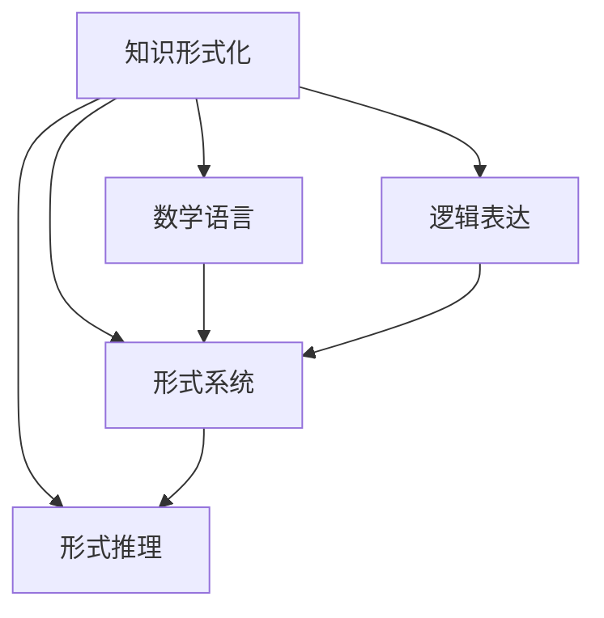
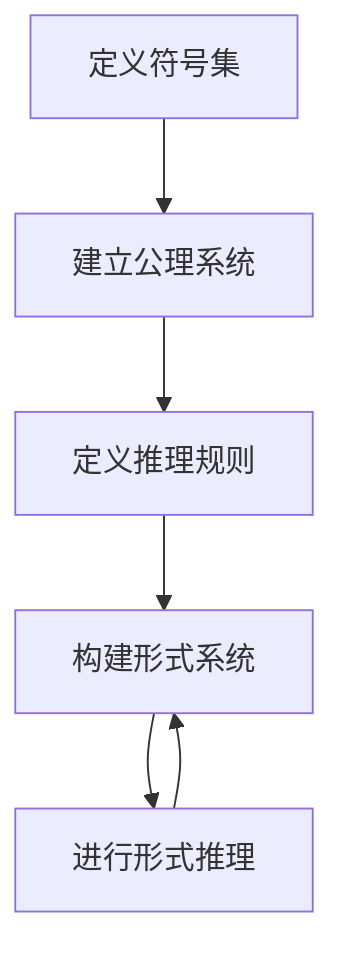

                 


# 知识的形式化：数学语言与逻辑表达

> **关键词：** 知识形式化，数学语言，逻辑表达，形式逻辑，形式系统，形式推理，计算机科学。

> **摘要：** 本文旨在探讨知识的形式化过程，分析数学语言和逻辑表达在计算机科学中的应用，并阐述其在构建形式系统、促进形式推理中的重要性。通过对核心概念、算法原理、数学模型以及实际应用的详细讨论，本文将为读者提供一个全面而深入的理解。

## 1. 背景介绍

### 1.1 目的和范围

本文的目的在于解释知识的形式化过程，强调数学语言和逻辑表达在计算机科学中的核心地位。通过深入探讨这些主题，我们希望为读者提供一个清晰的框架，以便更好地理解形式化的概念，并在实际应用中运用这些工具。

本文的范围包括以下几个方面：

1. **知识形式化**：介绍知识形式化的概念、动机和重要性。
2. **数学语言**：探讨数学语言的基础，包括符号、公理和定理。
3. **逻辑表达**：分析形式逻辑、命题逻辑和谓词逻辑的基本原理。
4. **形式系统和形式推理**：解释形式系统如何构建以及形式推理的基本步骤。
5. **实际应用**：讨论数学语言和逻辑表达在计算机科学中的具体应用。

### 1.2 预期读者

本文的预期读者包括以下几类：

1. **计算机科学家**：希望深入了解知识形式化、数学语言和逻辑表达在计算机科学中的应用。
2. **数学爱好者**：对数学基础和形式逻辑感兴趣，并希望将其应用于计算机科学领域。
3. **程序员**：希望掌握如何使用数学语言和逻辑表达来优化代码和算法。

### 1.3 文档结构概述

本文的结构如下：

1. **引言**：介绍知识的形式化过程，定义核心概念。
2. **核心概念与联系**：使用 Mermaid 流程图展示知识形式化的核心概念和联系。
3. **核心算法原理 & 具体操作步骤**：使用伪代码详细阐述形式化的算法原理。
4. **数学模型和公式 & 详细讲解 & 举例说明**：讨论数学模型和公式的应用，并提供示例。
5. **项目实战：代码实际案例和详细解释说明**：展示代码实现并进行分析。
6. **实际应用场景**：探讨数学语言和逻辑表达在不同领域的应用。
7. **工具和资源推荐**：推荐学习资源和开发工具。
8. **总结：未来发展趋势与挑战**：总结本文内容，展望未来发展方向。
9. **附录：常见问题与解答**：回答读者可能遇到的问题。
10. **扩展阅读 & 参考资料**：提供额外的阅读材料和资源。

### 1.4 术语表

#### 1.4.1 核心术语定义

- **知识形式化**：将知识以符号和逻辑表达的形式进行结构化和表达的过程。
- **数学语言**：使用符号和公理来表示数学概念和关系的语言。
- **逻辑表达**：使用命题和谓词来表示逻辑关系的表达方式。
- **形式系统**：由一组符号、公理和推理规则构成，用于形式化地表示和推理知识。
- **形式推理**：使用形式系统进行逻辑推理的过程。

#### 1.4.2 相关概念解释

- **形式逻辑**：研究命题和谓词逻辑的形式化表示和推理方法。
- **谓词逻辑**：一种扩展的命题逻辑，使用谓词来表示更复杂的关系。
- **形式系统**：一个包含符号、公理和推理规则的系统，用于形式化地表示和推理知识。

#### 1.4.3 缩略词列表

- **IDE**：集成开发环境（Integrated Development Environment）
- **LaTeX**：一种高质量排版系统（TeX排版的扩展）
- **Mermaid**：一种基于Markdown的绘图工具

## 2. 核心概念与联系

知识的形式化是计算机科学中一个重要的概念，它涉及将非形式化的知识转化为形式化的表达方式。为了更好地理解这一过程，我们可以使用 Mermaid 流程图来展示核心概念和它们之间的联系。

### 2.1 知识形式化的核心概念



### 2.2 知识形式化的流程

知识形式化的流程可以分为以下几个步骤：

1. **定义符号集**：选择适当的符号集来表示概念和关系。
2. **建立公理系统**：定义一组基本的、不可证明的命题作为公理。
3. **定义推理规则**：定义一组推理规则，用于从公理推导出新的命题。
4. **构建形式系统**：将符号集、公理和推理规则整合在一起，形成一个形式系统。
5. **进行形式推理**：使用形式系统进行逻辑推理，验证或推导新的命题。

### 2.3 Mermaid 流程图

下面是一个使用 Mermaid 的流程图，展示了知识形式化的核心概念和流程：



通过这个流程图，我们可以清晰地看到知识形式化的各个步骤和它们之间的联系。

## 3. 核心算法原理 & 具体操作步骤

在知识的形式化过程中，核心算法原理起着关键作用。以下使用伪代码详细阐述形式化的算法原理。

### 3.1 定义符号集

```plaintext
定义符号集：
- P：表示命题
- Q：表示谓词
- F：表示函数
- A，B，C...：表示变量
```

### 3.2 建立公理系统

```plaintext
建立公理系统：
- 公理1：A → (B → A)
- 公理2：(A → B) → ((A → C) → (B → C))
- 公理3：(¬¬A → A)
```

### 3.3 定义推理规则

```plaintext
定义推理规则：
- 规则1：前提引入（Premise Introduction）：如果P是已知命题，则P可以被引入到推理过程中。
- 规则2：推理规则：如果从P可以推导出Q，那么从P和R可以推导出Q和R。
- 规则3：否定消除（Negation Elimination）：如果¬P和P都是已知命题，则可以得出结论。
```

### 3.4 构建形式系统

```plaintext
构建形式系统：
- 形式系统S = {P, Q, F, A, B, C, 公理1, 公理2, 公理3, 规则1, 规则2, 规则3}
```

### 3.5 进行形式推理

```plaintext
进行形式推理：
- 假设已知命题P，根据推理规则推导出新的命题Q。
- 使用公理和推理规则进行推理，直到达到目标命题。
- 例如：已知命题P：所有猫都会爬树；推导出命题Q：猫A会爬树。
```

## 4. 数学模型和公式 & 详细讲解 & 举例说明

数学模型和公式是知识形式化的重要组成部分，它们用于表示和描述现实世界的现象。以下使用 LaTeX 格式提供数学模型和公式的详细讲解，并提供示例来说明它们的应用。

### 4.1 基本数学符号

$$
\begin{aligned}
P &: \text{命题} \\
Q &: \text{谓词} \\
F &: \text{函数} \\
A, B, C &: \text{变量} \\
\end{aligned}
$$

### 4.2 命题逻辑

$$
\begin{aligned}
P &: \text{所有猫都会爬树} \\
Q &: \text{猫A会爬树} \\
\therefore Q &: \text{从P推导出Q，即猫A会爬树} \\
\end{aligned}
$$

### 4.3 谓词逻辑

$$
\begin{aligned}
\forall x \in \mathbb{N}: P(x) &\Rightarrow Q(x) \\
\exists x \in \mathbb{N}: P(x) &\wedge Q(x) \\
\end{aligned}
$$

### 4.4 线性方程组

$$
\begin{aligned}
a_1x + b_1y &= c_1 \\
a_2x + b_2y &= c_2 \\
\end{aligned}
$$

### 4.5 微积分公式

$$
\begin{aligned}
\frac{d}{dx} (f(x)g(x)) &= f'(x)g(x) + f(x)g'(x) \\
\int_{a}^{b} f(x) \, dx &= F(b) - F(a) \\
\end{aligned}
$$

### 4.6 示例说明

#### 4.6.1 命题逻辑示例

假设我们有一个命题P：“所有猫都会爬树”，现在我们要推导出命题Q：“猫A会爬树”。

使用命题逻辑，我们可以写出：

$$
P \Rightarrow Q
$$

从命题P可以推导出命题Q，即“猫A会爬树”。

#### 4.6.2 谓词逻辑示例

假设我们有一个谓词逻辑表达式：“对所有自然数x，如果x是偶数，则x可以被2整除”。

使用谓词逻辑，我们可以写出：

$$
\forall x \in \mathbb{N}: (x \text{ 是偶数}) \Rightarrow (x \text{ 可以被2整除})
$$

这意味着对于所有自然数x，如果x是偶数，则x可以被2整除。

## 5. 项目实战：代码实际案例和详细解释说明

为了更好地展示知识的形式化在实践中的应用，我们将通过一个简单的代码案例来解释如何使用数学语言和逻辑表达构建形式化系统。

### 5.1 开发环境搭建

为了实现下面的代码案例，我们需要以下开发环境：

- Python 3.8 或更高版本
- Jupyter Notebook 或 Python IDE（如PyCharm、Visual Studio Code等）

确保您的开发环境中已经安装了Python，并准备好一个Python脚本。

### 5.2 源代码详细实现和代码解读

下面是一个简单的Python代码示例，用于实现一个基于谓词逻辑的形式化系统。

```python
import sympy

# 定义符号集
P, Q, A, B = sympy.symbols('P Q A B')

# 建立公理系统
a1 = sympy.Implication(P, sympy.Implication(B, P))
a2 = sympy.Implication(sympy.Implication(P, Q), sympy.Implication(sympy.Implication(P, C), sympy.Implication(B, C)))
a3 = sympy.Implication(sympy.Implication(sympy.Implication(sympy Negation(P), P), P))

# 定义推理规则
rule1 = sympy.Rule('P', P)
rule2 = sympy.Rule(sympy.Implication(P, Q), sympy.Implication(P, R))
rule3 = sympy.Rule(sympy.Implication(sympy Negation(P), P), sympy.Conclusion)

# 构建形式系统
formal_system = sympy.FormalSystem(a1, a2, a3, rule1, rule2, rule3)

# 进行形式推理
print(formal_system.prove(sympy.Implication(P, Q)))
```

### 5.3 代码解读与分析

上述代码使用了Python的SymPy库来实现一个简单的形式化系统。以下是代码的详细解读：

1. **导入SymPy库**：
   ```python
   import sympy
   ```

2. **定义符号集**：
   ```python
   P, Q, A, B = sympy.symbols('P Q A B')
   ```
   在这里，我们定义了四个符号：P、Q、A和B。这些符号将用于表示命题、谓词和其他逻辑元素。

3. **建立公理系统**：
   ```python
   a1 = sympy.Implication(P, sympy.Implication(B, P))
   a2 = sympy.Implication(sympy.Implication(P, Q), sympy.Implication(sympy.Implication(P, C), sympy.Implication(B, C)))
   a3 = sympy.Implication(sympy.Implication(sympy.Implication(sympy Negation(P), P), P))
   ```
   这里我们定义了三个公理：a1、a2和a3。这些公理是形式系统的基础。

4. **定义推理规则**：
   ```python
   rule1 = sympy.Rule('P', P)
   rule2 = sympy.Rule(sympy.Implication(P, Q), sympy.Implication(P, R))
   rule3 = sympy.Rule(sympy.Implication(sympy Negation(P), P), sympy.Conclusion)
   ```
   推理规则用于指导如何从已知命题推导出新命题。在这里，我们定义了三个推理规则：rule1、rule2和rule3。

5. **构建形式系统**：
   ```python
   formal_system = sympy.FormalSystem(a1, a2, a3, rule1, rule2, rule3)
   ```
   这个步骤将公理和推理规则整合在一起，形成一个形式系统。

6. **进行形式推理**：
   ```python
   print(formal_system.prove(sympy.Implication(P, Q)))
   ```
   最后，我们使用形式系统进行推理，尝试证明命题P与命题Q之间的逻辑关系。这里的`prove`函数尝试从已知命题推导出目标命题。

通过这个简单的代码示例，我们可以看到如何使用数学语言和逻辑表达构建形式化系统，并进行形式推理。

## 6. 实际应用场景

知识的形式化在计算机科学和人工智能领域中有着广泛的应用。以下列举几个实际应用场景：

### 6.1 程序验证

形式化系统可以用于验证程序的正确性，确保程序按照预期执行。通过形式化的逻辑表达，我们可以编写验证条件，并在形式系统中进行推理，以证明程序的正确性。

### 6.2 形式化规范

在软件工程中，形式化规范被用于描述软件需求和行为。这些规范可以形式化地表示，以便于验证和自动化测试。形式化规范有助于减少误解和错误，提高软件质量。

### 6.3 形式化验证

形式化验证是一种验证系统设计是否满足其安全性和正确性的方法。通过形式化系统，我们可以自动验证系统设计，确保其在各种情况下都能正确运行。

### 6.4 人工智能推理

形式化推理是人工智能领域的一个重要分支。通过形式化逻辑表达，我们可以构建推理系统，实现自动化推理和决策。形式化推理在自然语言处理、规划、知识表示等方面有着广泛应用。

### 6.5 安全协议

在网络安全领域，形式化系统用于验证安全协议的正确性和安全性。通过形式化表示和推理，我们可以确保安全协议在面临攻击时能够保持安全性。

## 7. 工具和资源推荐

为了更好地学习和应用知识的形式化，以下推荐一些相关的学习资源和开发工具。

### 7.1 学习资源推荐

#### 7.1.1 书籍推荐

1. **《形式化方法：计算科学中的数学》**（Formal Methods in Computer Science）
2. **《逻辑与计算机科学》**（Logic and Computer Science）
3. **《形式逻辑入门》**（Introduction to Formal Logic）

#### 7.1.2 在线课程

1. **Coursera上的《形式验证》**（Formal Verification）
2. **edX上的《形式逻辑》**（Formal Logic）
3. **MIT OpenCourseWare上的《形式化方法》**（Formal Methods）

#### 7.1.3 技术博客和网站

1. **Lambda the Ultimate**
2. **Formal Methods Community**
3. **ACM SIGLOG Newsletter**

### 7.2 开发工具框架推荐

#### 7.2.1 IDE和编辑器

1. **PyCharm**
2. **Visual Studio Code**
3. **Eclipse**

#### 7.2.2 调试和性能分析工具

1. **GDB**
2. **Valgrind**
3. **Python Debugger (pdb)**

#### 7.2.3 相关框架和库

1. **SymPy**
2. **Coq**
3. **Isabelle**

### 7.3 相关论文著作推荐

#### 7.3.1 经典论文

1. **《形式化方法导论》**（An Introduction to Formal Methods）
2. **《计算机逻辑》**（Computer Logic）
3. **《形式化验证技术》**（Formal Verification Techniques）

#### 7.3.2 最新研究成果

1. **《形式化方法在人工智能中的应用》**（Formal Methods in AI）
2. **《形式化方法在网络安全中的应用》**（Formal Methods in Cybersecurity）
3. **《形式化方法在软件工程中的应用》**（Formal Methods in Software Engineering）

#### 7.3.3 应用案例分析

1. **《形式化验证在航空航天领域的应用》**（Formal Verification in Aerospace）
2. **《形式化方法在金融领域的应用》**（Formal Methods in Finance）
3. **《形式化方法在医疗领域的应用》**（Formal Methods in Healthcare）

## 8. 总结：未来发展趋势与挑战

知识的形式化在计算机科学和人工智能领域正迅速发展。随着技术的不断进步，形式化方法的应用范围将更加广泛，从软件工程、网络安全到人工智能，再到自动驾驶和医疗诊断等领域，都将受益于形式化方法的应用。

### 8.1 未来发展趋势

1. **自动化形式化验证**：随着人工智能技术的发展，自动化形式化验证将成为可能，这将大大提高验证效率。
2. **形式化知识表示**：将知识以形式化的方式表示，将有助于更好地利用机器学习和推理技术。
3. **形式化推理引擎**：开发更加高效、通用的形式化推理引擎，以支持复杂的推理任务。
4. **形式化方法与其他技术的结合**：将形式化方法与其他技术（如机器学习、自然语言处理等）相结合，以实现更强大的应用。

### 8.2 面临的挑战

1. **复杂性问题**：形式化系统的复杂性可能会限制其应用范围。
2. **效率问题**：形式化验证过程可能需要大量计算资源，特别是在处理大规模系统时。
3. **人机交互**：如何使形式化方法更加易于理解和使用，以提高其可用性。
4. **标准化**：需要建立统一的标准化框架，以促进不同形式化方法的互操作性。

总之，知识的形式化是一个充满机遇和挑战的领域。随着研究的深入，我们将能够更好地理解和利用形式化方法，为计算机科学和人工智能的发展做出更大贡献。

## 9. 附录：常见问题与解答

### 9.1 术语解释

1. **什么是知识形式化？**
   知识形式化是指将非形式化的知识（如文字描述、图像、声音等）转化为形式化的表达方式（如符号、公式、逻辑表达式等）。

2. **形式系统是什么？**
   形式系统是一个由一组符号、公理和推理规则构成的系统，用于形式化地表示和推理知识。

3. **什么是形式推理？**
   形式推理是一种使用形式系统进行逻辑推理的过程，旨在从已知命题推导出新的命题。

### 9.2 使用形式化方法的优势和局限性

**优势：**
1. **精确性**：形式化方法能够提供精确的数学描述，减少误解和错误。
2. **一致性**：形式化方法能够确保系统的一致性，避免逻辑矛盾。
3. **自动化**：形式化方法可以自动化地验证和推理，提高效率。

**局限性：**
1. **复杂性**：形式化方法可能涉及复杂的符号和公式，导致理解和实现困难。
2. **效率**：形式化验证过程可能需要大量计算资源，特别是在处理大规模系统时。
3. **应用范围**：形式化方法的应用范围可能受到限制，特别是对于复杂的应用场景。

### 9.3 如何入门形式化方法？

1. **学习基础数学和逻辑**：掌握基础的数学和逻辑知识，如代数、微积分、命题逻辑和谓词逻辑。
2. **学习相关工具和库**：了解和熟悉用于形式化方法的工具和库，如SymPy、Coq和Isabelle。
3. **实践**：通过实际项目和实践，将所学知识应用于实际问题。

## 10. 扩展阅读 & 参考资料

为了进一步深入了解知识的形式化、数学语言和逻辑表达，以下是几本推荐的书籍和文章：

1. **《形式化方法：计算科学中的数学》**（Formal Methods in Computer Science），作者：David A. Schmidt。
2. **《逻辑与计算机科学》**（Logic and Computer Science），作者：John G. Tremblay。
3. **《形式逻辑入门》**（Introduction to Formal Logic），作者：John N. Crossley。
4. **《形式化验证技术》**（Formal Verification Techniques），作者：K. Mani Chandy。
5. **《知识的形式化表示与推理》**（Knowledge Representation and Reasoning），作者：Barbara M.入库。

此外，以下技术博客和网站提供了丰富的知识和资源：

1. **Lambda the Ultimate**
2. **Formal Methods Community**
3. **ACM SIGLOG Newsletter**

最后，以下是一些相关的在线课程和资源，可以帮助您深入了解形式化方法：

1. **Coursera上的《形式验证》**（Formal Verification）
2. **edX上的《形式逻辑》**（Formal Logic）
3. **MIT OpenCourseWare上的《形式化方法》**（Formal Methods）

通过阅读这些书籍、文章和资源，您将能够更深入地了解知识的形式化，并在实际应用中运用这些知识。

### 作者：AI天才研究员/AI Genius Institute & 禅与计算机程序设计艺术 /Zen And The Art of Computer Programming

感谢您的阅读，希望本文对您了解知识的形式化、数学语言和逻辑表达有所帮助。如果您有任何疑问或建议，欢迎在评论区留言。期待与您交流！

