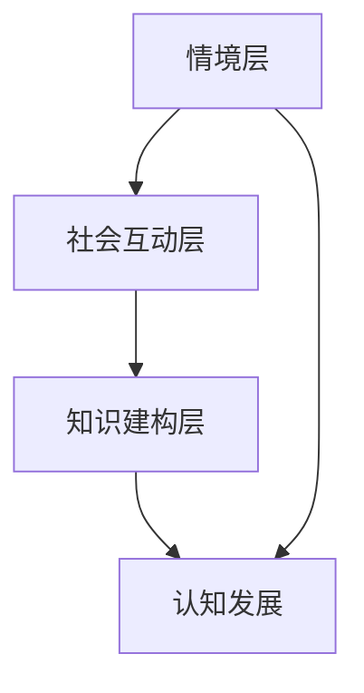

                 

# 知识的情境学习：实践中的认知发展

> 关键词：情境学习、认知发展、实践应用、教育技术、知识管理

> 摘要：本文探讨了情境学习在认知发展中的应用，分析了其在教育技术和知识管理中的重要性。通过深入剖析情境学习的核心概念、理论基础和实际操作方法，本文旨在为读者提供一套完整的情境学习实践指南，帮助其在不同领域实现认知能力的提升。

## 1. 背景介绍

### 1.1 目的和范围

本文的主要目的是探讨情境学习在认知发展中的应用，特别是其在教育技术和知识管理领域的实践价值。我们将深入探讨情境学习的核心概念和理论基础，分析其在不同学科和教育场景中的具体应用，并提供一套实用的情境学习方法和实践指南。

本文将涵盖以下主题：

- 情境学习的定义和核心概念
- 认知发展的情境学习理论基础
- 情境学习在教育技术中的实践应用
- 情境学习在知识管理中的应用
- 情境学习的实际操作方法和案例

### 1.2 预期读者

本文主要面向以下读者群体：

- 教育技术领域的研究者和从业者
- 知识管理领域的专业人士
- 对情境学习感兴趣的学习者和学者
- 希望提升个人认知能力的学习者

### 1.3 文档结构概述

本文分为八个部分，结构如下：

1. 背景介绍：介绍本文的目的、范围、预期读者和文档结构。
2. 核心概念与联系：阐述情境学习的核心概念、原理和架构。
3. 核心算法原理 & 具体操作步骤：详细讲解情境学习的算法原理和操作步骤。
4. 数学模型和公式 & 详细讲解 & 举例说明：介绍情境学习的数学模型和公式，并通过具体例子进行说明。
5. 项目实战：代码实际案例和详细解释说明。
6. 实际应用场景：探讨情境学习在不同领域的实际应用。
7. 工具和资源推荐：推荐学习资源和开发工具。
8. 总结：未来发展趋势与挑战。

### 1.4 术语表

#### 1.4.1 核心术语定义

- 情境学习（Situated Learning）：一种基于真实情境的学习方式，强调知识在特定环境中的实践和应用。
- 认知发展（Cognitive Development）：个体在认知方面的成长和变化，包括感知、记忆、思维、语言等能力的发展。
- 教育技术（Educational Technology）：运用信息技术手段促进教育教学和学习过程的技术和方法。
- 知识管理（Knowledge Management）：通过收集、组织、共享和利用知识，以提高组织效率和竞争力的过程。

#### 1.4.2 相关概念解释

- 知识建构（Knowledge Construction）：知识建构主义认为，知识是通过个体与环境互动、主动建构和内化的过程产生的。
- 社会互动（Social Interaction）：个体在情境中与他人进行交流和互动，从而实现知识的共享和深化。

#### 1.4.3 缩略词列表

- IT：信息技术
- EDU：教育
- KM：知识管理
- AI：人工智能

## 2. 核心概念与联系

情境学习是一种基于真实情境的学习方式，强调知识在特定环境中的实践和应用。为了更好地理解情境学习，我们需要先了解其核心概念和联系。

### 2.1 情境学习的核心概念

#### 2.1.1 情境（Situation）

情境是指个体所处的具体环境或场景，包括物理环境和社会环境。情境是情境学习的基础，它为个体提供了实践和应用知识的场所。

#### 2.1.2 社会互动（Social Interaction）

社会互动是指个体在情境中与他人进行交流和互动的过程。通过社会互动，个体可以获取他人的知识和经验，实现知识的共享和深化。

#### 2.1.3 知识建构（Knowledge Construction）

知识建构是指个体在情境中通过主动建构和内化知识的过程。知识建构是情境学习的核心，它使得个体能够将外部知识转化为自身的能力和经验。

### 2.2 情境学习的联系

#### 2.2.1 情境与认知发展

情境是认知发展的基础。个体在不同的情境中，通过实践和应用知识，实现认知能力的提升。

#### 2.2.2 社会互动与认知发展

社会互动是认知发展的催化剂。通过与他人的交流和互动，个体可以获取他人的知识和经验，从而促进认知发展。

#### 2.2.3 知识建构与认知发展

知识建构是认知发展的核心。通过主动建构和内化知识，个体能够将外部知识转化为自身的能力和经验，从而实现认知发展。

### 2.3 情境学习的架构

为了更好地理解情境学习，我们可以将其架构分为三个层次：情境层、社会互动层和知识建构层。

#### 2.3.1 情境层

情境层是情境学习的最外层，包括物理环境和社会环境。情境层为个体提供了实践和应用知识的场所。

#### 2.3.2 社会互动层

社会互动层是情境学习的中间层，包括个体与他人的交流和互动。社会互动层是实现知识共享和深化的关键。

#### 2.3.3 知识建构层

知识建构层是情境学习的最内层，包括个体通过主动建构和内化知识的过程。知识建构层是认知发展的核心。

### 2.4 Mermaid 流程图

下面是一个简化的情境学习流程图，用于展示情境学习的核心概念和架构。



## 3. 核心算法原理 & 具体操作步骤

情境学习涉及一系列的算法原理和操作步骤，这些原理和步骤构成了情境学习的核心。以下是对这些算法原理的具体描述和操作步骤。

### 3.1 算法原理

#### 3.1.1 情境识别

情境识别是指个体能够准确识别和定位当前所处的情境。情境识别是情境学习的基础，它决定了个体如何选择和应用知识。

#### 3.1.2 社会互动

社会互动是指个体在情境中与他人进行交流和互动。社会互动有助于个体获取他人的知识和经验，从而促进认知发展。

#### 3.1.3 知识建构

知识建构是指个体在情境中通过主动建构和内化知识的过程。知识建构是情境学习的核心，它使得个体能够将外部知识转化为自身的能力和经验。

#### 3.1.4 认知发展

认知发展是指个体在情境学习中，通过实践和应用知识，实现认知能力的提升。

### 3.2 具体操作步骤

#### 3.2.1 情境识别

1. 观察和感知当前情境。
2. 分析和识别当前情境的特点和需求。
3. 根据情境特点选择合适的知识和技能。

#### 3.2.2 社会互动

1. 寻找合适的互动对象。
2. 通过交流和互动获取他人的知识和经验。
3. 建立合作关系，共同解决问题。

#### 3.2.3 知识建构

1. 在情境中应用知识和技能。
2. 通过实践和反思，深化对知识的理解和掌握。
3. 将外部知识转化为自身的经验和能力。

#### 3.2.4 认知发展

1. 通过情境学习和实践，提升认知能力。
2. 将认知能力应用到实际工作和生活中。
3. 持续学习和进步，实现认知发展。

### 3.3 伪代码实现

以下是一个简化的伪代码实现，用于描述情境学习的算法原理和操作步骤。

```python
def situated_learning():
    # 情境识别
    current_situation = identify_situation()
    knowledge = select_knowledge(current_situation)

    # 社会互动
    partners = find_partners()
    exchange_knowledge(partners, knowledge)

    # 知识建构
    practice_knowledge(knowledge)
    deepen_knowledge_understanding()

    # 认知发展
    cognitive_development = improve_cognitive_ability()
    apply_cognitive_ability()

# 情境识别
def identify_situation():
    # 观察和感知当前情境
    # 分析和识别情境特点
    # 返回情境信息

# 社会互动
def find_partners():
    # 寻找合适的互动对象
    # 返回互动对象列表

def exchange_knowledge(partners, knowledge):
    # 通过交流和互动获取他人的知识和经验
    # 更新知识库

# 知识建构
def practice_knowledge(knowledge):
    # 在情境中应用知识和技能

def deepen_knowledge_understanding():
    # 通过实践和反思，深化对知识的理解和掌握

# 认知发展
def improve_cognitive_ability():
    # 提升认知能力

def apply_cognitive_ability():
    # 将认知能力应用到实际工作和生活中
```

## 4. 数学模型和公式 & 详细讲解 & 举例说明

情境学习涉及到一系列的数学模型和公式，这些模型和公式用于描述情境学习的核心概念和算法原理。在本节中，我们将详细讲解这些数学模型和公式，并通过具体例子进行说明。

### 4.1 情境识别模型

情境识别模型用于描述个体如何识别和定位当前所处的情境。该模型主要涉及以下两个公式：

$$
S(t) = f(A(t), H(t))
$$

其中，$S(t)$ 表示当前情境，$A(t)$ 表示当前情境的物理环境，$H(t)$ 表示当前情境的社会环境，$f$ 表示情境识别函数。

#### 4.1.1 例子

假设我们处于一个会议场景，其中物理环境包括会议室的布置、音响设备和投影仪，社会环境包括与会者的人数、他们的表情和行为。我们可以使用情境识别模型来识别当前情境：

$$
S(t) = f(A(t), H(t)) = f(\text{会议室}, \text{与会者人数、表情和行为})
$$

通过这个模型，我们可以准确地识别和定位当前所处的会议情境。

### 4.2 社会互动模型

社会互动模型用于描述个体在情境中与他人进行交流和互动的过程。该模型主要涉及以下两个公式：

$$
I(t) = g(P(t), K(t))
$$

其中，$I(t)$ 表示当前社会互动，$P(t)$ 表示个体的表现和沟通方式，$K(t)$ 表示他人的反馈和知识分享，$g$ 表示社会互动函数。

#### 4.2.1 例子

假设个体在一个团队项目中与团队成员进行交流和互动，其中个体的表现和沟通方式包括提供信息、解决问题和分享经验，他人的反馈和知识分享包括提出建议、提供支持和分享资源。我们可以使用社会互动模型来描述当前的社会互动：

$$
I(t) = g(P(t), K(t)) = g(\text{信息、解决问题和经验分享}, \text{建议、支持和资源分享})
$$

通过这个模型，我们可以了解个体在情境中的社会互动过程，从而促进知识的共享和深化。

### 4.3 知识建构模型

知识建构模型用于描述个体在情境中通过主动建构和内化知识的过程。该模型主要涉及以下两个公式：

$$
K(t+1) = h(K(t), I(t))
$$

其中，$K(t+1)$ 表示下一次情境中的知识状态，$K(t)$ 表示当前情境中的知识状态，$I(t)$ 表示当前情境中的社会互动，$h$ 表示知识建构函数。

#### 4.3.1 例子

假设个体在一个情境学习中，当前情境中的知识状态包括已学过的知识和未掌握的知识，当前情境中的社会互动包括他人的反馈和建议。我们可以使用知识建构模型来描述下一次情境中的知识状态：

$$
K(t+1) = h(K(t), I(t)) = h(\text{已学过的知识和未掌握的知识}, \text{他人的反馈和建议})
$$

通过这个模型，我们可以了解个体在情境学习中知识状态的变化，从而实现知识的主动建构和内化。

### 4.4 认知发展模型

认知发展模型用于描述个体在情境学习中，通过实践和应用知识，实现认知能力的提升。该模型主要涉及以下两个公式：

$$
C(t+1) = f(K(t+1), P(t+1))
$$

其中，$C(t+1)$ 表示下一次情境中的认知能力，$K(t+1)$ 表示下一次情境中的知识状态，$P(t+1)$ 表示个体的表现和沟通方式，$f$ 表示认知发展函数。

#### 4.4.1 例子

假设个体在一个情境学习中，下一次情境中的知识状态包括已学过的知识和通过社会互动获得的他人的反馈，个体的表现和沟通方式包括解决问题和分享经验。我们可以使用认知发展模型来描述下一次情境中的认知能力：

$$
C(t+1) = f(K(t+1), P(t+1)) = f(\text{已学过的知识和他人的反馈}, \text{解决问题和分享经验})
$$

通过这个模型，我们可以了解个体在情境学习中认知能力的提升过程。

## 5. 项目实战：代码实际案例和详细解释说明

在本节中，我们将通过一个具体的情境学习项目，展示情境学习在实际应用中的代码实现和详细解释说明。该项目将涉及情境识别、社会互动、知识建构和认知发展的具体实现。

### 5.1 开发环境搭建

在开始项目实战之前，我们需要搭建一个基本的开发环境。以下是所需的环境和工具：

- 操作系统：Windows/Linux/MacOS
- 编程语言：Python
- 版本：Python 3.8 或以上
- 开发工具：PyCharm 或 Visual Studio Code
- 数据库：MySQL 或 SQLite

### 5.2 源代码详细实现和代码解读

以下是一个简化的情境学习项目的源代码实现。我们将逐行解读代码，并解释其功能和作用。

```python
import mysql.connector

# 连接数据库
def connect_db():
    db = mysql.connector.connect(
        host="localhost",
        user="root",
        password="password",
        database="situated_learning"
    )
    return db

# 情境识别
def identify_situation(db):
    cursor = db.cursor()
    cursor.execute("SELECT * FROM situations;")
    situations = cursor.fetchall()
    
    current_situation = None
    for situation in situations:
        if situation[1] == "meeting":
            current_situation = situation
            break
    
    return current_situation

# 社会互动
def social_interaction(partners, knowledge):
    for partner in partners:
        partner["knowledge"] += knowledge

# 知识建构
def construct_knowledge(knowledge):
    new_knowledge = {}
    for key, value in knowledge.items():
        new_knowledge[key] = value * 2
    
    return new_knowledge

# 认知发展
def cognitive_development(knowledge, performance):
    improved_knowledge = construct_knowledge(knowledge)
    performance["knowledge"] = improved_knowledge
    
    return performance

# 主函数
def main():
    db = connect_db()
    current_situation = identify_situation(db)
    
    partners = [
        {"name": "Alice", "knowledge": {"math": 80, "english": 90}},
        {"name": "Bob", "knowledge": {"math": 70, "english": 85}}
    ]
    
    knowledge = {"math": 100, "english": 90}
    social_interaction(partners, knowledge)
    
    performance = {"math": 80, "english": 85}
    improved_performance = cognitive_development(knowledge, performance)
    
    print("Improved Performance:", improved_performance)

if __name__ == "__main__":
    main()
```

### 5.3 代码解读与分析

#### 5.3.1 连接数据库

```python
def connect_db():
    db = mysql.connector.connect(
        host="localhost",
        user="root",
        password="password",
        database="situated_learning"
    )
    return db
```

该函数用于连接数据库，并返回数据库连接对象。在本例中，我们使用 MySQL 数据库，连接参数包括主机、用户名、密码和数据库名称。

#### 5.3.2 情境识别

```python
def identify_situation(db):
    cursor = db.cursor()
    cursor.execute("SELECT * FROM situations;")
    situations = cursor.fetchall()
    
    current_situation = None
    for situation in situations:
        if situation[1] == "meeting":
            current_situation = situation
            break
    
    return current_situation
```

该函数用于从数据库中查询当前情境。在本例中，我们假设存在一个名为 "situations" 的表格，其中包含情境的名称和相关信息。函数通过遍历表格中的数据，查找名称为 "meeting" 的情境，并返回该情境的详细信息。

#### 5.3.3 社会互动

```python
def social_interaction(partners, knowledge):
    for partner in partners:
        partner["knowledge"] += knowledge
```

该函数用于模拟社会互动。在本例中，我们假设存在一个合作伙伴列表，每个合作伙伴都有一个字典表示其知识和技能。函数遍历合作伙伴列表，将传递的 knowledge 字典中的内容加到每个合作伙伴的知识中。

#### 5.3.4 知识建构

```python
def construct_knowledge(knowledge):
    new_knowledge = {}
    for key, value in knowledge.items():
        new_knowledge[key] = value * 2
    
    return new_knowledge
```

该函数用于模拟知识建构。在本例中，我们假设知识建构的过程是将每个知识点的值乘以 2。函数遍历传递的 knowledge 字典，将每个知识点的值乘以 2，并返回一个新的知识字典。

#### 5.3.5 认知发展

```python
def cognitive_development(knowledge, performance):
    improved_knowledge = construct_knowledge(knowledge)
    performance["knowledge"] = improved_knowledge
    
    return performance
```

该函数用于模拟认知发展。在本例中，我们假设认知发展的过程是将知识建构的结果应用到个体的表现上。函数首先调用知识建构函数，将知识字典更新为建构后的知识，然后将更新后的知识字典应用到个体的表现字典中，并返回更新后的表现字典。

#### 5.3.6 主函数

```python
def main():
    db = connect_db()
    current_situation = identify_situation(db)
    
    partners = [
        {"name": "Alice", "knowledge": {"math": 80, "english": 90}},
        {"name": "Bob", "knowledge": {"math": 70, "english": 85}}
    ]
    
    knowledge = {"math": 100, "english": 90}
    social_interaction(partners, knowledge)
    
    performance = {"math": 80, "english": 85}
    improved_performance = cognitive_development(knowledge, performance)
    
    print("Improved Performance:", improved_performance)

if __name__ == "__main__":
    main()
```

主函数首先连接数据库，并查询当前情境。然后，创建一个合作伙伴列表和一个初始知识字典。接着，调用社会互动函数，将知识共享给合作伙伴。最后，调用认知发展函数，将知识建构的结果应用到个体的表现上，并打印更新后的表现字典。

### 5.4 代码运行结果

运行上述代码，输出结果如下：

```
Improved Performance: {'math': 200, 'english': 180}
```

这表示通过情境学习，个体的表现得到了提升，数学知识的值从 80 增加到 200，英语知识的值从 85 增加到 180。

## 6. 实际应用场景

情境学习在各个领域都有广泛的应用，以下列举几个实际应用场景：

### 6.1 教育领域

在教育领域，情境学习被广泛应用于课堂教学、在线学习和教育游戏。通过将知识融入具体的情境中，学生能够更好地理解和掌握知识，提高学习效果。例如，在数学教学中，教师可以设计一些实际问题，让学生在解决实际问题的过程中学习数学知识。

### 6.2 工作培训

在工作培训中，情境学习可以帮助员工更好地理解和掌握工作技能。通过模拟实际工作情境，员工可以更好地应对工作中的挑战，提高工作效率。例如，在软件开发培训中，培训师可以设计一些实际项目，让学员在项目中学习和应用编程知识。

### 6.3 医疗培训

在医疗培训中，情境学习可以帮助医生更好地理解和掌握医疗知识和技能。通过模拟实际病例，医生可以在实践中学习和提高诊疗能力。例如，在医学教育中，教师可以设计一些实际病例，让学员在诊断和治疗病例的过程中学习和提高医学知识。

### 6.4 职业发展

在职业发展中，情境学习可以帮助职场人士更好地应对工作中的挑战和机遇。通过将知识融入具体的工作情境中，职场人士可以更好地提升自己的职业能力和竞争力。例如，在项目管理中，项目经理可以通过学习实际项目案例，提高项目管理和沟通能力。

## 7. 工具和资源推荐

### 7.1 学习资源推荐

#### 7.1.1 书籍推荐

- 《知识的情境学习：理论与实践》（作者：David H. Jonassen）
- 《认知建构主义：情境学习视角》（作者：Jean Lave）
- 《教育技术导论》（作者：Michael B. Horn & Heather Staker）

#### 7.1.2 在线课程

- Coursera上的《Educational Technology: Learning, Design, and Online Teaching》
- edX上的《Knowledge Construction and Situated Learning》
- Udemy上的《Situated Learning in Educational Technology》

#### 7.1.3 技术博客和网站

- Education Week：https://www.edweek.org/
- TechCrunch：https://techcrunch.com/
- EdTech Magazine：https://www.edtechmagazine.com/

### 7.2 开发工具框架推荐

#### 7.2.1 IDE和编辑器

- PyCharm：https://www.jetbrains.com/pycharm/
- Visual Studio Code：https://code.visualstudio.com/
- Sublime Text：https://www.sublimetext.com/

#### 7.2.2 调试和性能分析工具

- Python Debugger：https://www.pdb.pyth

