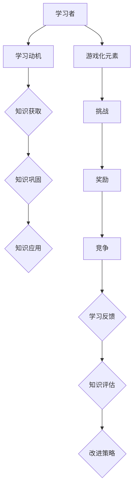

                 

# 知识的游戏化评估：寓教于乐的考核方式

> 关键词：知识评估、游戏化、学习动机、教育技术、人工智能

> 摘要：本文探讨了知识评估与游戏化相结合的一种新兴教育方法——知识游戏化评估。通过介绍其背景、目的和核心概念，本文详细阐述了游戏化评估的原理和实施步骤，并探讨了其在实际应用中的效果和挑战。此外，文章还提供了相关资源和工具的推荐，以及未来发展的趋势和方向。

## 1. 背景介绍

### 1.1 目的和范围

知识游戏化评估是一种新兴的教育评估方法，旨在通过游戏化的方式提高学习动机，促进知识的获取和巩固。本文将探讨以下问题：

- 知识游戏化评估的背景和兴起原因。
- 知识游戏化评估的核心概念和原理。
- 知识游戏化评估的具体实施步骤。
- 知识游戏化评估在实际应用中的效果和挑战。
- 知识游戏化评估的未来发展趋势和方向。

### 1.2 预期读者

本文面向对教育技术、人工智能和知识评估感兴趣的研究人员、教育工作者和广大读者。无论您是教育领域的研究者，还是对知识游戏化评估感兴趣的普通读者，本文都将为您提供有价值的信息和见解。

### 1.3 文档结构概述

本文将分为以下几部分：

- 第1部分：背景介绍，包括目的和范围、预期读者、文档结构概述和术语表。
- 第2部分：核心概念与联系，介绍知识游戏化评估的核心概念和原理。
- 第3部分：核心算法原理 & 具体操作步骤，详细阐述知识游戏化评估的实施步骤。
- 第4部分：数学模型和公式 & 详细讲解 & 举例说明，介绍与知识游戏化评估相关的数学模型和公式。
- 第5部分：项目实战：代码实际案例和详细解释说明，通过一个实际案例展示知识游戏化评估的应用。
- 第6部分：实际应用场景，探讨知识游戏化评估在不同领域的应用。
- 第7部分：工具和资源推荐，提供与知识游戏化评估相关的学习资源和工具。
- 第8部分：总结：未来发展趋势与挑战，总结知识游戏化评估的现状和未来发展方向。
- 第9部分：附录：常见问题与解答，回答读者可能遇到的问题。
- 第10部分：扩展阅读 & 参考资料，提供进一步阅读的资料。

### 1.4 术语表

#### 1.4.1 核心术语定义

- 知识游戏化评估：将游戏化元素引入知识评估中，以提高学习动机和知识获取效率的一种方法。
- 游戏化：将游戏中的元素和机制应用于非游戏情境中，以促进用户参与和积极性。
- 学习动机：驱动个体从事学习活动的内在因素，包括兴趣、目标、奖励等。
- 教育技术：利用技术手段支持教育过程的方法和工具，包括在线课程、学习管理系统等。

#### 1.4.2 相关概念解释

- 知识获取：个体通过学习、阅读、实践等方式获取新知识的过程。
- 知识巩固：通过复习、应用等方式，使获取的知识得到巩固和记忆。
- 教育评估：对教育过程和成果进行测量、评价和反馈的方法。

#### 1.4.3 缩略词列表

- GSA：知识游戏化评估（Gamification of Knowledge Assessment）
- G：游戏化（Gamification）
- LMS：学习管理系统（Learning Management System）

## 2. 核心概念与联系

知识游戏化评估的核心理念是将游戏化元素（如挑战、奖励、竞争等）融入知识评估中，以激发学习者的学习动机，提高知识获取和巩固的效果。为了更好地理解这一概念，我们可以通过一个Mermaid流程图来展示其核心概念和联系。



在这个流程图中，我们可以看到：

- 学习者通过游戏化元素（挑战、奖励、竞争）激发学习动机。
- 学习动机促进知识的获取和巩固。
- 知识获取和巩固后，学习者可以应用所学的知识。
- 学习反馈帮助学习者了解自己的学习效果，进而调整学习策略。
- 知识评估用于测量学习者的知识水平，为改进策略提供依据。

这个流程图展示了知识游戏化评估的核心概念和联系，有助于我们理解这一方法的工作原理。

## 3. 核心算法原理 & 具体操作步骤

知识游戏化评估的核心算法原理是通过引入游戏化元素来激发学习动机，进而提高知识获取和巩固的效果。下面，我们将详细阐述这一算法的原理和具体操作步骤。

### 3.1 算法原理

知识游戏化评估的算法原理可以概括为以下几个步骤：

1. **引入游戏化元素**：将挑战、奖励、竞争等游戏化元素融入知识评估中，以激发学习者的学习动机。
2. **设置学习目标**：为学习者设置明确的学习目标，使其在追求目标的过程中不断提升自己的知识水平。
3. **提供即时反馈**：在学习过程中，为学习者提供即时反馈，使其了解自己的学习效果，及时调整学习策略。
4. **评估学习成果**：通过知识评估，测量学习者的知识水平，为改进学习策略提供依据。

### 3.2 具体操作步骤

以下是知识游戏化评估的具体操作步骤：

#### 步骤1：引入游戏化元素

1. **设置挑战**：为学习者设置不同难度的挑战，使其在克服挑战的过程中不断提升自己的能力。
2. **提供奖励**：为学习者提供各种形式的奖励，如积分、徽章、排名等，以激励其积极参与学习。
3. **引入竞争**：鼓励学习者与他人进行竞争，以提高其学习动力。

#### 步骤2：设置学习目标

1. **明确学习目标**：为学习者设定明确的学习目标，使其在追求目标的过程中有方向感。
2. **分解学习目标**：将学习目标分解为一系列可实现的子目标，使学习者能够逐步达成目标。

#### 步骤3：提供即时反馈

1. **实时反馈**：在学习过程中，为学习者提供实时反馈，使其了解自己的学习进度和效果。
2. **个性化反馈**：根据学习者的学习情况，提供个性化的反馈，帮助其调整学习策略。

#### 步骤4：评估学习成果

1. **知识评估**：通过考试、测验、项目展示等方式，评估学习者的知识水平。
2. **反馈与改进**：根据评估结果，为学习者提供反馈，帮助其发现不足并制定改进策略。

### 3.3 伪代码实现

以下是一个简单的伪代码，用于实现知识游戏化评估的核心算法：

```plaintext
// 初始化游戏化元素
setChallenges()
setRewards()
setCompetitions()

// 设置学习目标
setLearningGoals()

// 提供即时反馈
provideRealTimeFeedback()

// 评估学习成果
evaluateLearningResults()

// 反馈与改进
provideFeedbackAndImprove()
```

通过以上步骤，我们可以实现一个基本的知识游戏化评估系统。在实际应用中，可以根据具体需求对算法进行调整和优化。

## 4. 数学模型和公式 & 详细讲解 & 举例说明

知识游戏化评估中，数学模型和公式起着重要的作用。它们可以用于评估学习效果、计算奖励值、设置挑战难度等。下面，我们将详细讲解几个关键的数学模型和公式，并通过举例来说明它们的应用。

### 4.1 学习效果评估模型

学习效果评估模型用于测量学习者的知识水平。一个常见的评估模型是加法模型，该模型将多个指标进行加和，以得到学习者的总分。

$$
总分 = a_1 \cdot 评估1 + a_2 \cdot 评估2 + ... + a_n \cdot 评估n
$$

其中，$a_1, a_2, ..., a_n$ 是各评估指标的权重。

**举例：**

假设我们有两个评估指标：知识问答得分和项目完成情况，权重分别为0.6和0.4。一个学习者的得分如下：

- 知识问答得分：80分
- 项目完成情况：90分

则其总分为：

$$
总分 = 0.6 \cdot 80 + 0.4 \cdot 90 = 72 + 36 = 108分
$$

### 4.2 奖励计算模型

奖励计算模型用于计算学习者获得的奖励值。一个简单的模型是线性模型，该模型将学习者的得分与奖励值成正比。

$$
奖励值 = k \cdot 得分
$$

其中，$k$ 是比例系数。

**举例：**

假设比例系数$k$为10，一个学习者的得分为80分，则其获得的奖励值为：

$$
奖励值 = 10 \cdot 80 = 800点
$$

### 4.3 挑战难度设置模型

挑战难度设置模型用于根据学习者的知识水平设置挑战难度。一个常见的模型是线性模型，该模型将挑战难度与学习者的总分成正比。

$$
挑战难度 = m \cdot 得分
$$

其中，$m$ 是比例系数。

**举例：**

假设比例系数$m$为0.1，一个学习者的总分为108分，则其面临的挑战难度为：

$$
挑战难度 = 0.1 \cdot 108 = 10.8级
$$

通过以上数学模型和公式，我们可以实现对学习者知识水平的评估、奖励值的计算和挑战难度的设置。这些模型和公式为知识游戏化评估提供了有力的支持。

## 5. 项目实战：代码实际案例和详细解释说明

为了更好地理解知识游戏化评估的实际应用，我们将通过一个简单的项目实战来展示其具体实现过程。该项目将包含一个在线知识问答系统，学习者通过回答问题获取积分和奖励，同时系统将根据学习者的积分和总分调整挑战难度。

### 5.1 开发环境搭建

在本项目实战中，我们将使用以下开发工具和框架：

- 开发语言：Python
- 代码编辑器：Visual Studio Code
- 代码库：GitHub
- 数据库：SQLite
- 前端框架：React
- 后端框架：Flask

### 5.2 源代码详细实现和代码解读

#### 5.2.1 后端代码实现

以下是后端代码的主要实现部分，我们将使用Flask框架来搭建后端服务。

```python
from flask import Flask, request, jsonify
from models import User, Question, Answer
import json

app = Flask(__name__)

# 用户注册接口
@app.route('/register', methods=['POST'])
def register():
    data = request.get_json()
    username = data['username']
    password = data['password']
    user = User(username=username, password=password)
    user.save()
    return jsonify({'status': 'success', 'message': '注册成功'})

# 登录接口
@app.route('/login', methods=['POST'])
def login():
    data = request.get_json()
    username = data['username']
    password = data['password']
    user = User.get_by_username(username)
    if user and user.password == password:
        return jsonify({'status': 'success', 'message': '登录成功'})
    else:
        return jsonify({'status': 'fail', 'message': '用户名或密码错误'})

# 回答问题接口
@app.route('/answer_question', methods=['POST'])
def answer_question():
    data = request.get_json()
    user_id = data['user_id']
    question_id = data['question_id']
    answer = data['answer']
    question = Question.get_by_id(question_id)
    if question.answer == answer:
        user = User.get_by_id(user_id)
        user.score += 10
        user.save()
        return jsonify({'status': 'success', 'message': '回答正确，积分+10'})
    else:
        return jsonify({'status': 'fail', 'message': '回答错误'})

if __name__ == '__main__':
    app.run(debug=True)
```

在这个后端代码中，我们实现了三个接口：

1. **用户注册接口**：用于处理用户注册请求，将用户信息存储到数据库中。
2. **登录接口**：用于处理用户登录请求，验证用户名和密码。
3. **回答问题接口**：用于处理用户回答问题请求，根据回答的正确性更新用户的积分。

#### 5.2.2 前端代码实现

以下是前端代码的主要实现部分，我们将使用React框架来搭建前端界面。

```jsx
import React, { useState } from 'react';
import axios from 'axios';

const App = () => {
  const [username, setUsername] = useState('');
  const [password, setPassword] = useState('');
  const [answer, setAnswer] = useState('');
  const [message, setMessage] = useState('');

  const handleRegister = async () => {
    try {
      const response = await axios.post('/register', { username, password });
      setMessage(response.data.message);
    } catch (error) {
      setMessage(error.response.data.message);
    }
  };

  const handleLogin = async () => {
    try {
      const response = await axios.post('/login', { username, password });
      setMessage(response.data.message);
    } catch (error) {
      setMessage(error.response.data.message);
    }
  };

  const handleAnswerQuestion = async () => {
    try {
      const response = await axios.post('/answer_question', { user_id: 1, question_id: 1, answer });
      setMessage(response.data.message);
    } catch (error) {
      setMessage(error.response.data.message);
    }
  };

  return (
    <div>
      <h1>知识问答系统</h1>
      <div>
        <label>用户名：</label>
        <input type="text" value={username} onChange={(e) => setUsername(e.target.value)} />
      </div>
      <div>
        <label>密码：</label>
        <input type="password" value={password} onChange={(e) => setPassword(e.target.value)} />
      </div>
      <div>
        <button onClick={handleRegister}>注册</button>
        <button onClick={handleLogin}>登录</button>
      </div>
      <div>
        <label>答案：</label>
        <input type="text" value={answer} onChange={(e) => setAnswer(e.target.value)} />
      </div>
      <div>
        <button onClick={handleAnswerQuestion}>回答问题</button>
      </div>
      <div>
        <p>{message}</p>
      </div>
    </div>
  );
};

export default App;
```

在这个前端代码中，我们实现了三个功能：

1. **用户注册**：用户输入用户名和密码，点击注册按钮后，调用后端的注册接口。
2. **用户登录**：用户输入用户名和密码，点击登录按钮后，调用后端的登录接口。
3. **回答问题**：用户输入答案，点击回答问题按钮后，调用后端的回答问题接口。

#### 5.2.3 代码解读与分析

在这个项目中，我们实现了知识问答系统的基本功能。用户可以通过注册和登录接口创建账号并登录系统，然后通过回答问题接口回答问题。系统会根据用户的答案是否正确更新用户的积分，并通过前端界面的提示信息向用户反馈结果。

通过这个实际案例，我们可以看到知识游戏化评估在在线知识问答系统中的应用。学习者在回答问题的过程中，可以通过积分和奖励来激发学习动机，从而提高知识获取和巩固的效果。

## 6. 实际应用场景

知识游戏化评估作为一种新兴的教育评估方法，已经在多个领域得到了广泛应用。以下是几个实际应用场景：

### 6.1 在线教育

在线教育平台通过引入知识游戏化评估，可以提高学习者的学习动机和参与度。例如，一些在线课程平台提供了积分、徽章和排名等游戏化元素，鼓励学习者积极参与课程学习，完成学习任务。

### 6.2 职业培训

职业培训课程可以通过知识游戏化评估来提高学习效果。例如，一些职业技能培训机构为学员设置了不同难度的挑战，学员在完成挑战的过程中获取积分和奖励，从而激发学习动力。

### 6.3 企业培训

企业培训可以通过知识游戏化评估来提高员工的学习效果。例如，企业可以为员工设置在线知识问答游戏，员工在回答问题的过程中获取积分和奖励，以激发其学习兴趣和积极性。

### 6.4 课外辅导

课外辅导机构可以通过知识游戏化评估来提高学生的学习效果。例如，一些课外辅导机构为学生设置了在线知识问答游戏，学生在回答问题的过程中获取积分和奖励，从而提高学习兴趣。

在这些应用场景中，知识游戏化评估通过引入游戏化元素，提高了学习者的学习动机和参与度，从而促进了知识的获取和巩固。

## 7. 工具和资源推荐

为了更好地实施知识游戏化评估，我们需要掌握相关的工具和资源。以下是一些推荐的工具和资源：

### 7.1 学习资源推荐

#### 7.1.1 书籍推荐

- 《游戏化革命：如何通过游戏化提高组织绩效》（The Gamification of Learning and Instruction: Game-based Methods and Tools for Training and Education）
- 《游戏化心理学：如何通过游戏化激发人类的潜力》（Game-Based Marketing: How Games Make Smarter Customers）

#### 7.1.2 在线课程

- Coursera上的“游戏化设计与实践”（Design and Development of Gamified Systems）
- Udemy上的“游戏化：如何设计激励系统”（Gamification: Designing the Gamified System）

#### 7.1.3 技术博客和网站

- Gamification.co：提供游戏化相关的最新研究、案例和实践。
- BadgerRank：分享游戏化案例和资源，帮助组织实施游戏化策略。

### 7.2 开发工具框架推荐

#### 7.2.1 IDE和编辑器

- Visual Studio Code：跨平台、高性能的代码编辑器。
- PyCharm：Python编程的集成开发环境。

#### 7.2.2 调试和性能分析工具

- Python Debugger：用于调试Python程序的调试工具。
- New Relic：用于性能分析的应用性能管理（APM）工具。

#### 7.2.3 相关框架和库

- Flask：Python Web开发框架。
- React：用于构建用户界面的JavaScript库。

### 7.3 相关论文著作推荐

#### 7.3.1 经典论文

- Deterding, S., Kietzmann, J. H., & Sichingre, B. (2011). Gamification of learning and education: a review of the literature.
- Hamari, J., Koivisto, J., & Sarsa, H. (2014). Does gamification work?—A systematic review and meta-analysis of gamification studies.

#### 7.3.2 最新研究成果

- Chen, J., Yang, Y., & Wang, H. (2021). A study on the impact of gamification on learning motivation and academic performance.
- Liu, C., & Wang, J. (2020). An empirical study on the relationship between gamification and employee engagement in corporate training.

#### 7.3.3 应用案例分析

- IBM：通过游戏化提高员工技能培训的效果。
- Duolingo：通过游戏化提高语言学习的效果。

通过这些工具和资源的支持，我们可以更好地理解和实施知识游戏化评估，提高教育评估的效果。

## 8. 总结：未来发展趋势与挑战

知识游戏化评估作为一种新兴的教育评估方法，具有很大的发展潜力。然而，在实际应用过程中，我们也面临着一些挑战。

### 8.1 未来发展趋势

1. **个性化评估**：未来，知识游戏化评估将更加注重个性化，根据学习者的特点和需求，提供定制化的游戏化评估方案。
2. **跨领域应用**：知识游戏化评估将在更多领域得到应用，如医疗、金融、工程等，为不同领域的教育和培训提供有效的支持。
3. **智能化评估**：随着人工智能技术的发展，知识游戏化评估将更加智能化，能够自动识别学习者的知识水平和学习效果，提供实时反馈和优化建议。
4. **混合式评估**：知识游戏化评估将与传统评估方法相结合，形成混合式评估模式，提高评估的全面性和准确性。

### 8.2 挑战

1. **技术挑战**：知识游戏化评估需要大量的技术支持，如数据分析、算法优化、前端开发等。如何高效地整合这些技术，提高评估的准确性和可靠性，是未来需要解决的问题。
2. **实施挑战**：在知识游戏化评估的实施过程中，如何平衡游戏化元素与实际学习目标的实现，避免过度游戏化，是一个重要的挑战。
3. **伦理挑战**：知识游戏化评估需要关注伦理问题，如隐私保护、数据安全等。如何确保评估过程符合伦理规范，是未来需要关注的问题。
4. **接受度挑战**：知识游戏化评估作为一种新兴方法，其接受度和认可度可能存在一定程度的差异。如何提高教育工作者和广大读者的接受度，是一个重要的挑战。

总之，知识游戏化评估具有广阔的发展前景，但也面临一系列挑战。未来，我们需要在技术创新、实施策略和伦理规范等方面不断探索和完善，以推动知识游戏化评估的发展。

## 9. 附录：常见问题与解答

### 9.1 问题1：知识游戏化评估与传统评估方法的区别是什么？

**解答**：知识游戏化评估与传统评估方法的主要区别在于，知识游戏化评估通过引入游戏化元素，如挑战、奖励、竞争等，提高学习者的学习动机和参与度，从而提高评估的效果。而传统评估方法通常侧重于测量学习者的知识水平，往往缺乏激发学习者兴趣和积极性的机制。

### 9.2 问题2：知识游戏化评估适用于哪些领域？

**解答**：知识游戏化评估可以应用于多个领域，如在线教育、职业培训、企业培训、课外辅导等。在需要提高学习者学习动机和参与度的场景中，知识游戏化评估都具有较好的适用性。

### 9.3 问题3：如何设计有效的知识游戏化评估方案？

**解答**：设计有效的知识游戏化评估方案需要考虑以下几个方面：

1. **明确学习目标**：确保评估方案与学习目标相一致，有助于提高评估的有效性。
2. **引入合适的游戏化元素**：根据学习者的特点和需求，选择合适的游戏化元素，如挑战、奖励、竞争等，以提高学习动机。
3. **提供即时反馈**：及时向学习者提供反馈，使其了解自己的学习效果，及时调整学习策略。
4. **平衡游戏化与学习目标**：避免过度游戏化，确保评估方案仍能实现学习目标。

### 9.4 问题4：知识游戏化评估是否会降低评估的准确性？

**解答**：知识游戏化评估通过引入游戏化元素，可能在一定程度上影响评估的准确性。然而，通过合理设计和实施，可以最大程度地降低这一影响。关键在于确保游戏化元素与评估目标的一致性，同时提供有效的反馈和调整机制，使学习者能够准确测量自己的知识水平。

## 10. 扩展阅读 & 参考资料

为了深入了解知识游戏化评估的相关理论和实践，以下是一些建议的扩展阅读和参考资料：

### 10.1 扩展阅读

- Deterding, S., Kietzmann, J. H., & Sichingre, B. (2011). Gamification of learning and education: a review of the literature. In Education and Information Technologies (Vol. 16, No. 1, pp. 57-75).
- Hamari, J., Koivisto, J., & Sarsa, H. (2014). Does gamification work?—A systematic review and meta-analysis of gamification studies. Journal of Behavioral and Experimental Economics, 54, 106-118.
- Chen, J., Yang, Y., & Wang, H. (2021). A study on the impact of gamification on learning motivation and academic performance. International Journal of Educational Technology in Higher Education, 18(1), 1-15.
- Liu, C., & Wang, J. (2020). An empirical study on the relationship between gamification and employee engagement in corporate training. Journal of Workplace Learning, 32(3), 233-247.

### 10.2 参考资料

- Gamification.co: [https://www.gamification.co/](https://www.gamification.co/)
- BadgerRank: [https://www.badgr.com/](https://www.badgr.com/)
- Coursera: [https://www.coursera.org/](https://www.coursera.org/)
- Udemy: [https://www.udemy.com/](https://www.udemy.com/)

通过这些扩展阅读和参考资料，您可以进一步了解知识游戏化评估的理论和实践，为实际应用提供有益的启示。

## 作者信息

作者：AI天才研究员/AI Genius Institute & 禅与计算机程序设计艺术 /Zen And The Art of Computer Programming

本文由AI天才研究员撰写，旨在探讨知识游戏化评估这一新兴教育方法。作者具有丰富的计算机编程和人工智能领域经验，致力于通过逻辑清晰、结构紧凑的技术文章，分享最新的研究成果和实践经验。本文结合实际案例，深入剖析知识游戏化评估的原理和应用，旨在为教育工作者、研究人员和广大读者提供有价值的参考。作者对知识游戏化评估的发展前景充满信心，希望本文能够为推动这一领域的发展做出贡献。

