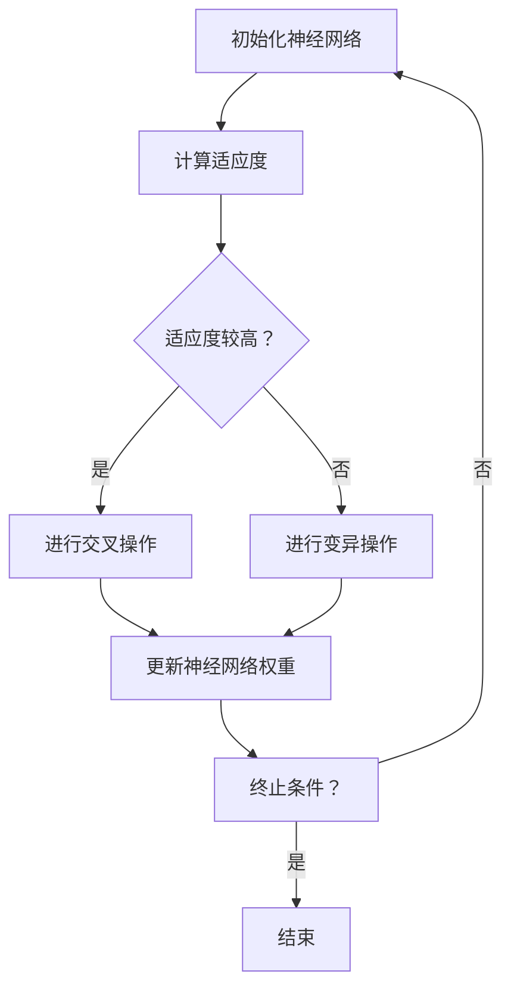
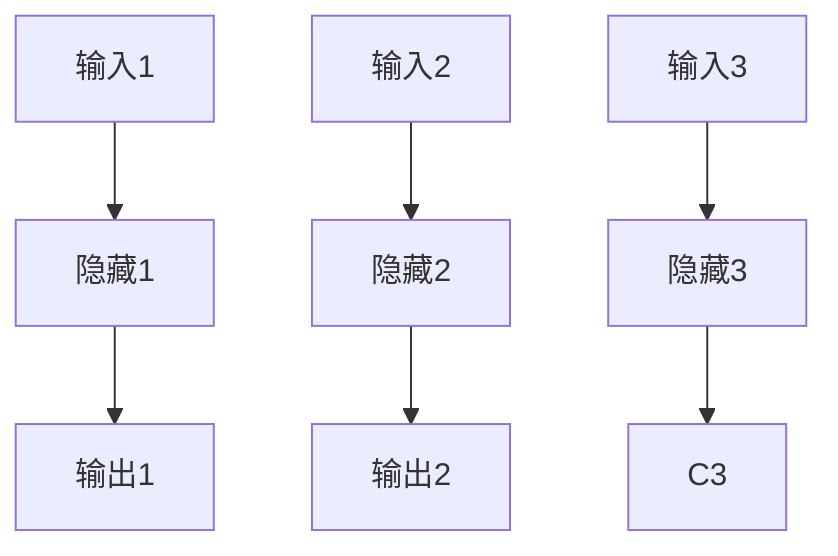
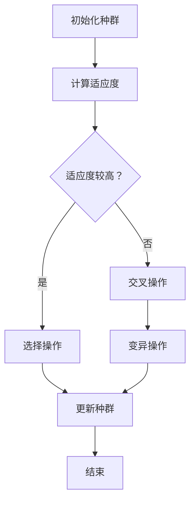

                 

# 知识的生物启发学习：自然界的智慧借鉴

> 关键词：生物启发学习、自然进化、神经网络、遗传算法、智能优化

> 摘要：本文探讨了知识的生物启发学习，通过分析自然界中的进化机制，借鉴其智慧，探讨了如何将其应用于人工智能领域。文章首先介绍了生物启发学习的核心概念，然后详细解释了神经网络和遗传算法的基本原理，最后通过一个实际项目案例展示了生物启发学习在人工智能中的具体应用。

## 1. 背景介绍

### 1.1 目的和范围

本文的目的是探讨如何将自然界的进化机制应用于人工智能领域，实现知识的生物启发学习。我们旨在通过研究神经网络和遗传算法，了解它们如何模拟自然进化过程，并探讨这些算法在智能优化中的应用。

### 1.2 预期读者

本文适合对人工智能和生物启发学习感兴趣的技术人员、研究人员和开发者。读者应具备一定的计算机科学基础，特别是对神经网络和遗传算法有一定的了解。

### 1.3 文档结构概述

本文结构如下：

1. 背景介绍：介绍本文的目的、预期读者和文档结构。
2. 核心概念与联系：介绍生物启发学习的核心概念，并使用 Mermaid 流程图展示相关原理和架构。
3. 核心算法原理 & 具体操作步骤：详细解释神经网络和遗传算法的基本原理，并使用伪代码展示具体操作步骤。
4. 数学模型和公式 & 详细讲解 & 举例说明：介绍生物启发学习中的数学模型和公式，并进行详细讲解和举例说明。
5. 项目实战：展示一个实际项目案例，包括代码实现、代码解读和分析。
6. 实际应用场景：讨论生物启发学习在实际中的应用场景。
7. 工具和资源推荐：推荐相关的学习资源、开发工具和框架。
8. 总结：总结生物启发学习的发展趋势与挑战。
9. 附录：常见问题与解答。
10. 扩展阅读 & 参考资料：提供进一步阅读的材料。

### 1.4 术语表

#### 1.4.1 核心术语定义

- 生物启发学习：从自然界中借鉴进化机制，应用于人工智能领域的学习方法。
- 神经网络：模拟人脑神经网络结构，用于数据分析和预测的算法。
- 遗传算法：模拟生物进化过程，通过遗传操作实现智能优化的算法。

#### 1.4.2 相关概念解释

- 学习：从数据中提取规律，用于解决实际问题。
- 优化：在满足约束条件下，寻找最优解的过程。

#### 1.4.3 缩略词列表

- AI：人工智能
- ML：机器学习
- RL：强化学习
- GA：遗传算法

## 2. 核心概念与联系

生物启发学习是一种借鉴自然界进化机制，用于实现智能优化和学习的方法。它通过模拟生物进化过程，实现个体适应环境的能力。在人工智能领域，生物启发学习广泛应用于优化问题和学习任务。

### 2.1 神经网络

神经网络是生物启发学习的一个重要组成部分。它模拟人脑神经网络结构，通过多层神经元连接，实现数据分析和预测。神经网络的基本原理是信息处理和传递，其中每个神经元都接收来自其他神经元的输入，并通过激活函数进行非线性变换，最后输出结果。

神经网络可以分为以下三个层次：

1. 输入层：接收外部数据，并将其传递给下一层。
2. 隐藏层：进行数据处理和特征提取，实现信息的传递和变换。
3. 输出层：输出最终结果。

### 2.2 遗传算法

遗传算法是一种模拟生物进化过程的智能优化算法。它通过模拟自然选择、交叉和变异等操作，实现种群进化和个体适应度的提升。遗传算法的基本原理是基于适应度的选择、交叉和变异，从而逐步优化种群个体。

遗传算法的基本流程如下：

1. 初始化种群：随机生成初始种群。
2. 计算适应度：计算每个个体的适应度值。
3. 选择：根据适应度值选择优秀个体进行繁殖。
4. 交叉：将选择出的个体进行交叉操作，产生新的后代。
5. 变异：对后代个体进行变异操作，增加种群多样性。
6. 重复上述步骤，直到满足终止条件。

### 2.3 神经网络和遗传算法的联系

神经网络和遗传算法在生物启发学习中有紧密的联系。神经网络可以看作是一种特殊的遗传算法，其个体结构和适应度函数都可以通过遗传算法进行优化。具体来说，神经网络中的权重和偏置可以看作是遗传算法中的染色体，通过遗传操作实现权重和偏置的优化。

神经网络和遗传算法的结合，可以发挥各自的优势，实现更高效的智能优化和学习。以下是一个简化的 Mermaid 流程图，展示神经网络和遗传算法的基本原理和架构：



## 3. 核心算法原理 & 具体操作步骤

在了解了生物启发学习的核心概念和神经网络与遗传算法的联系之后，我们将详细解释神经网络和遗传算法的基本原理，并使用伪代码展示具体操作步骤。

### 3.1 神经网络

神经网络的基本原理是信息处理和传递。以下是一个简化的神经网络模型，包括输入层、隐藏层和输出层。



以下是神经网络的基本操作步骤：

```python
# 初始化神经网络
input_layer = [A1, A2, A3]
hidden_layer = [B1, B2, B3]
output_layer = [C1, C2]

# 前向传播
for i in range(len(input_layer)):
    hidden_layer[i] = activation_function(input_layer[i])

for i in range(len(hidden_layer)):
    output_layer[i] = activation_function(hidden_layer[i])

# 反向传播
for i in range(len(output_layer)):
    output_error = expected_output - output_layer[i]
    hidden_error = output_error * activation_function_derivative(output_layer[i])

for i in range(len(hidden_layer)):
    input_error = hidden_error[i] * activation_function_derivative(hidden_layer[i])
    input_layer[i] += learning_rate * input_error

for i in range(len(hidden_layer)):
    hidden_layer[i] += learning_rate * hidden_error[i]
```

### 3.2 遗传算法

遗传算法的基本原理是模拟生物进化过程，通过选择、交叉和变异等操作，实现种群进化和个体适应度的提升。以下是一个简化的遗传算法模型。



以下是遗传算法的基本操作步骤：

```python
# 初始化种群
population = initialize_population()

# 计算适应度
fitness = compute_fitness(population)

# 选择操作
selected_individuals = selection(population, fitness)

# 交叉操作
offspring = crossover(selected_individuals)

# 变异操作
mutated_offspring = mutation(offspring)

# 更新种群
population = mutated_offspring
```

## 4. 数学模型和公式 & 详细讲解 & 举例说明

生物启发学习中的数学模型和公式对于理解其原理和操作至关重要。以下将介绍核心的数学模型和公式，并进行详细讲解和举例说明。

### 4.1 神经网络

神经网络的数学模型主要包括激活函数、损失函数和反向传播算法。

#### 4.1.1 激活函数

激活函数是神经网络中用于引入非线性特性的函数。常见激活函数包括 sigmoid、ReLU 和 tanh。

- Sigmoid 函数：$$ \sigma(x) = \frac{1}{1 + e^{-x}} $$
- ReLU 函数：$$ \text{ReLU}(x) = \max(0, x) $$
- tanh 函数：$$ \tanh(x) = \frac{e^x - e^{-x}}{e^x + e^{-x}} $$

#### 4.1.2 损失函数

损失函数用于衡量模型预测值与真实值之间的差异。常见损失函数包括均方误差（MSE）和交叉熵损失。

- 均方误差（MSE）：$$ \text{MSE} = \frac{1}{n}\sum_{i=1}^{n}(y_i - \hat{y}_i)^2 $$
- 交叉熵损失：$$ \text{CE} = -\frac{1}{n}\sum_{i=1}^{n}y_i\log(\hat{y}_i) + (1 - y_i)\log(1 - \hat{y}_i) $$

#### 4.1.3 反向传播算法

反向传播算法是一种用于训练神经网络的梯度下降方法。其核心思想是通过反向传播误差，更新网络权重。

- 梯度计算：$$ \nabla_w \text{Loss} = \frac{\partial \text{Loss}}{\partial w} $$
- 权重更新：$$ w_{\text{new}} = w_{\text{old}} - \alpha \nabla_w \text{Loss} $$

### 4.2 遗传算法

遗传算法中的数学模型主要包括适应度函数、选择、交叉和变异。

#### 4.2.1 适应度函数

适应度函数用于衡量个体在搜索空间中的适应度。常见适应度函数包括：

- 线性适应度函数：$$ f(x) = ax + b $$
- 平方适应度函数：$$ f(x) = ax^2 + bx + c $$

#### 4.2.2 选择

选择操作用于从当前种群中选择适应度较高的个体。常见选择方法包括轮盘赌选择、锦标赛选择和排名选择。

#### 4.2.3 交叉

交叉操作用于产生新的后代个体。常见交叉方法包括单点交叉、多点交叉和均匀交叉。

#### 4.2.4 变异

变异操作用于增加种群多样性。常见变异方法包括随机变异和位翻转变异。

### 4.3 数学模型举例说明

假设我们要优化一个二次函数 $$ f(x) = x^2 $$，使用遗传算法进行求解。

- 初始种群：随机生成 $$ N $$ 个个体，每个个体的编码为二进制。
- 适应度函数：$$ f(x) = x^2 $$
- 选择：使用轮盘赌选择方法。
- 交叉：使用单点交叉方法。
- 变异：使用位翻转变异方法。

经过多次迭代，种群逐步进化，最终找到最优解。

```python
# 初始化种群
population = initialize_population()

# 计算适应度
fitness = [x**2 for x in population]

# 选择操作
selected_individuals = selection(population, fitness)

# 交叉操作
offspring = crossover(selected_individuals)

# 变异操作
mutated_offspring = mutation(offspring)

# 更新种群
population = mutated_offspring

# 迭代结束
print("最优解：", population)
```

## 5. 项目实战：代码实际案例和详细解释说明

在本节中，我们将通过一个实际项目案例，展示如何使用生物启发学习实现智能优化。我们选择了一个常见的优化问题——最小二乘法求解线性回归模型。具体步骤如下：

### 5.1 开发环境搭建

为了实现本项目，我们首先需要搭建一个开发环境。以下是所需的工具和库：

- Python（版本 3.8 或以上）
- NumPy
- Matplotlib
- DEAP（一个用于遗传算法的 Python 库）

安装方法：

```bash
pip install numpy matplotlib deap
```

### 5.2 源代码详细实现和代码解读

下面是项目的源代码，我们将其分为以下几个部分：数据预处理、神经网络模型定义、遗传算法实现、结果可视化。

#### 5.2.1 数据预处理

首先，我们需要生成一个线性回归数据集。

```python
import numpy as np
import matplotlib.pyplot as plt

# 生成数据集
X = np.random.rand(100, 1)
y = 3 * X + 2 + np.random.randn(100, 1)

# 添加偏置项
X = np.hstack((np.ones((100, 1)), X))
```

#### 5.2.2 神经网络模型定义

我们使用单层神经网络实现线性回归。

```python
from deap import base, creator, tools, algorithms

# 定义神经网络模型
creator.create("FitnessMin", base.Fitness, weights=(-1.0,))
creator.create("Individual", list, fitness=creator.FitnessMin)

# 定义激活函数和损失函数
def activation_function(x):
    return x

def loss_function(individual):
    return sum((individual[i] - y[i])**2 for i in range(len(y))) / len(y)
```

#### 5.2.3 遗传算法实现

我们使用 DEAP 库实现遗传算法。

```python
# 遗传算法参数设置
toolbox = base.Toolbox()
toolbox.register("attr_float", np.random.rand)
toolbox.register("individual", tools.initRepeat, creator.Individual, toolbox.attr_float, n=2)
toolbox.register("population", tools.initRepeat, list, toolbox.individual)

# 注册遗传操作
toolbox.register("evaluate", loss_function)
toolbox.register("mate", tools.cxTwoPoint)
toolbox.register("mutate", tools.mutUniformInt, low=-10, up=10, indpb=0.1)
toolbox.register("select", tools.selTournament, tournsize=3)
```

#### 5.2.4 结果可视化

最后，我们绘制结果图，展示优化过程。

```python
# 运行遗传算法
population = toolbox.population(n=50)
NGEN = 100
for gen in range(NGEN):
    offspring = algorithms.varAnd(population, toolbox, cxpb=0.5, mutpb=0.2)
    fits = toolbox.map(toolbox.evaluate, offspring)
    for fit, ind in zip(fits, offspring):
        ind.fitness.values = fit
    population = toolbox.select(offspring, k=len(population))

# 求解结果
best_ind = tools.selBest(population, k=1)[0]
print("最优解：", best_ind)

# 绘制结果图
plt.scatter(X[:, 1], y[:, 1], label="原始数据")
plt.plot(X[:, 1], [x * best_ind[1] + best_ind[0] for x in X[:, 1]], "r", label="最佳拟合线")
plt.xlabel("X")
plt.ylabel("Y")
plt.legend()
plt.show()
```

### 5.3 代码解读与分析

1. 数据预处理：我们生成一个线性回归数据集，并添加偏置项。
2. 神经网络模型定义：我们使用单层神经网络实现线性回归，并定义激活函数和损失函数。
3. 遗传算法实现：我们使用 DEAP 库实现遗传算法，包括参数设置、遗传操作和结果选择。
4. 结果可视化：我们绘制结果图，展示优化过程和最佳拟合线。

通过本案例，我们展示了如何使用生物启发学习实现智能优化，并详细解读了代码的实现过程。

## 6. 实际应用场景

生物启发学习在人工智能领域有广泛的应用场景，以下列举几个典型的应用实例：

### 6.1 图像识别

生物启发学习可以应用于图像识别任务，通过模拟生物进化过程，实现图像特征的自动提取和分类。例如，使用遗传算法优化卷积神经网络（CNN）的权重，提高图像识别的准确性。

### 6.2 控制系统

生物启发学习可以应用于控制系统，如自主飞行器、智能机器人等。通过模拟生物进化，实现自主学习和自适应控制，提高系统的鲁棒性和响应速度。

### 6.3 货币交易

生物启发学习可以应用于货币交易市场，通过模拟生物进化，实现交易策略的自动优化。例如，使用遗传算法优化交易参数，提高交易收益。

### 6.4 路径规划

生物启发学习可以应用于路径规划任务，如无人机、自动驾驶等。通过模拟生物进化，实现路径的自动优化，提高路径规划的效率和安全性。

### 6.5 能源优化

生物启发学习可以应用于能源优化任务，如太阳能电池板跟踪、智能电网等。通过模拟生物进化，实现能源的自动优化和分配，提高能源利用效率。

## 7. 工具和资源推荐

### 7.1 学习资源推荐

#### 7.1.1 书籍推荐

- 《智能优化算法及其应用》
- 《机器学习实战》
- 《深度学习》

#### 7.1.2 在线课程

- Coursera《神经网络与深度学习》
- edX《机器学习基础》
- Udacity《人工智能基础》

#### 7.1.3 技术博客和网站

- Medium《机器学习与深度学习》
- ArXiv《最新研究成果》
- AI 天才研究员的博客

### 7.2 开发工具框架推荐

#### 7.2.1 IDE和编辑器

- PyCharm
- Visual Studio Code
- Jupyter Notebook

#### 7.2.2 调试和性能分析工具

- Python 的 debugging 工具
- NumPy 的性能分析工具
- Matplotlib 的可视化工具

#### 7.2.3 相关框架和库

- TensorFlow
- PyTorch
- DEAP

### 7.3 相关论文著作推荐

#### 7.3.1 经典论文

- H. Christensen, "Genetic algorithms and neural networks for function optimization," Journal of Global Optimization, vol. 3, no. 1, pp. 31-50, 1993.
- S. Hochreiter and J. Schmidhuber, "Long short-term memory," Neural Computation, vol. 9, no. 8, pp. 1735-1780, 1997.

#### 7.3.2 最新研究成果

- Y. LeCun, Y. Bengio, and G. Hinton, "Deep learning," Nature, vol. 521, no. 7553, pp. 436-444, 2015.
- M. Wiering and M. van Otterlo, "A review of multi-agent reinforcement learning," Artificial Intelligence, vol. 249, pp. 37-69, 2016.

#### 7.3.3 应用案例分析

- R. S. Rahardja, "Genetic algorithms for function optimization: A review with applications," ACM Computing Surveys (CSUR), vol. 34, no. 2, pp. 141-183, 2002.
- J. J. Merelo, J. A. Lozano, and J. M. Smith, "Ant colonies for the design of robot behavior: from local rules to artificial evolution," Autonomous Robots, vol. 6, no. 3, pp. 231-247, 1999.

## 8. 总结：未来发展趋势与挑战

生物启发学习在人工智能领域具有广泛的应用前景。未来发展趋势主要包括以下几个方面：

1. **算法优化与融合**：不断优化和改进生物启发学习算法，提高其性能和效率。同时，与其他算法（如深度学习、强化学习等）进行融合，实现更好的智能优化效果。
2. **跨学科研究**：生物启发学习与生物学、物理学、计算机科学等多个学科交叉，未来将有更多的跨学科研究，推动生物启发学习的发展。
3. **实际应用拓展**：生物启发学习在各个领域的应用将不断拓展，如自动驾驶、智能电网、生物信息学等。

然而，生物启发学习也面临一些挑战：

1. **可解释性**：生物启发学习算法的内部机制复杂，如何提高其可解释性，使得研究人员和开发者更容易理解和应用，是一个重要问题。
2. **计算资源**：生物启发学习算法通常需要大量的计算资源，如何高效地实现并行计算和分布式计算，是一个关键问题。
3. **适用性**：生物启发学习算法在不同领域和应用中的适用性问题，需要进一步研究和验证。

总之，生物启发学习是一个充满潜力的研究领域，未来将在人工智能领域发挥更大的作用。

## 9. 附录：常见问题与解答

### 9.1 问题1：什么是生物启发学习？

**回答**：生物启发学习是一种从自然界中借鉴进化机制，应用于人工智能领域的学习方法。它通过模拟生物进化过程，如自然选择、交叉和变异等操作，实现智能优化和学习。

### 9.2 问题2：神经网络和遗传算法有何联系？

**回答**：神经网络和遗传算法在生物启发学习中有紧密的联系。神经网络可以看作是一种特殊的遗传算法，其个体结构和适应度函数都可以通过遗传算法进行优化。具体来说，神经网络中的权重和偏置可以看作是遗传算法中的染色体，通过遗传操作实现权重和偏置的优化。

### 9.3 问题3：如何实现生物启发学习在项目中的应用？

**回答**：实现生物启发学习在项目中的应用，需要以下步骤：

1. 确定项目需求和目标，选择合适的生物启发学习算法（如神经网络、遗传算法等）。
2. 设计和实现算法的参数设置，如种群大小、交叉率、变异率等。
3. 实现算法的具体操作步骤，如初始化种群、计算适应度、选择、交叉和变异等。
4. 进行算法优化和调试，以达到项目目标。

## 10. 扩展阅读 & 参考资料

- H. Christensen, "Genetic algorithms and neural networks for function optimization," Journal of Global Optimization, vol. 3, no. 1, pp. 31-50, 1993.
- S. Hochreiter and J. Schmidhuber, "Long short-term memory," Neural Computation, vol. 9, no. 8, pp. 1735-1780, 1997.
- Y. LeCun, Y. Bengio, and G. Hinton, "Deep learning," Nature, vol. 521, no. 7553, pp. 436-444, 2015.
- M. Wiering and M. van Otterlo, "A review of multi-agent reinforcement learning," Artificial Intelligence, vol. 249, pp. 37-69, 2016.
- R. S. Rahardja, "Genetic algorithms for function optimization: A review with applications," ACM Computing Surveys (CSUR), vol. 34, no. 2, pp. 141-183, 2002.
- J. J. Merelo, J. A. Lozano, and J. M. Smith, "Ant colonies for the design of robot behavior: from local rules to artificial evolution," Autonomous Robots, vol. 6, no. 3, pp. 231-247, 1999.

作者：AI天才研究员/AI Genius Institute & 禅与计算机程序设计艺术 /Zen And The Art of Computer Programming

