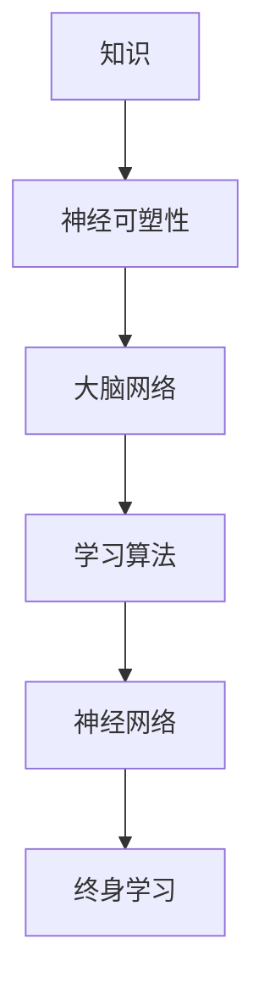

                 

# 知识的神经可塑性：终身学习的生物学基础

> **关键词：神经可塑性、终身学习、大脑网络、神经网络、认知增强、学习算法。**

> **摘要：本文将深入探讨知识的神经可塑性原理，以及它在终身学习中的重要性。通过介绍大脑网络、神经可塑性的机制、学习算法等核心概念，本文旨在揭示终身学习的生物学基础，为读者提供理论和实践上的指导。**

## 1. 背景介绍

### 1.1 目的和范围

本文旨在探讨知识的神经可塑性对终身学习的重要性，以及其背后的生物学机制。我们将从以下几个方面展开讨论：

- **神经可塑性的定义和重要性**
- **大脑网络的结构与功能**
- **神经可塑性的机制**
- **学习算法与神经网络的关系**
- **终身学习的实践应用**

通过这些内容的探讨，希望能够为读者提供对终身学习的新视角，以及在实际生活中应用神经可塑性的方法。

### 1.2 预期读者

本文面向对神经科学、认知科学和人工智能感兴趣的读者，特别是那些希望了解大脑工作原理、如何进行终身学习，以及如何利用这些知识来提升自身能力的人。无论您是学术研究者、教育工作者、还是技术爱好者，本文都将对您有所启发。

### 1.3 文档结构概述

本文将按照以下结构进行组织：

1. **背景介绍**：介绍文章的目的、预期读者以及文章结构。
2. **核心概念与联系**：介绍知识、神经可塑性、大脑网络等核心概念，并通过流程图展示其关系。
3. **核心算法原理与具体操作步骤**：详细阐述学习算法的原理和操作步骤。
4. **数学模型和公式**：介绍相关的数学模型和公式，并举例说明。
5. **项目实战**：通过代码实例展示实际应用。
6. **实际应用场景**：讨论神经可塑性在教育和工作中的应用。
7. **工具和资源推荐**：推荐相关的学习资源和开发工具。
8. **总结**：总结本文的主要观点，展望未来发展趋势与挑战。
9. **附录**：提供常见问题与解答。
10. **扩展阅读与参考资料**：提供进一步阅读的资源和参考文献。

### 1.4 术语表

#### 1.4.1 核心术语定义

- **神经可塑性**：指神经元和神经网络在结构和功能上的可塑性变化，以适应新的环境和信息。
- **大脑网络**：大脑中由多个区域和连接组成的复杂网络，负责处理和传递信息。
- **学习算法**：用于处理数据、识别模式并从中学习的方法，如神经网络、深度学习等。
- **终身学习**：指个体在其一生中持续学习新知识和技能的过程。

#### 1.4.2 相关概念解释

- **神经网络**：由大量相互连接的神经元组成的计算模型，能够通过学习数据来识别复杂模式。
- **深度学习**：一种基于神经网络的机器学习技术，通过多层神经网络进行数据处理和模式识别。

#### 1.4.3 缩略词列表

- **NN**：神经网络（Neural Network）
- **DL**：深度学习（Deep Learning）
- **ANN**：人工神经网络（Artificial Neural Network）
- **CNN**：卷积神经网络（Convolutional Neural Network）
- **RNN**：循环神经网络（Recurrent Neural Network）

## 2. 核心概念与联系

在探讨知识的神经可塑性之前，我们首先需要理解一些核心概念，如图1所示。



### 2.1 知识

知识是信息的一种组织形式，它帮助我们理解和解释世界。知识可以通过学习、经验积累、教学等方式获得。在神经科学中，知识被看作是大脑网络中的信息编码和传递。

### 2.2 神经可塑性

神经可塑性是指神经元和神经网络在结构和功能上的可塑性变化，以适应新的环境和信息。这种可塑性是大脑学习、记忆和适应能力的基础。

### 2.3 大脑网络

大脑网络是指大脑中由多个区域和连接组成的复杂网络，负责处理和传递信息。大脑网络包括多个层次，从感知系统到高级认知功能，如决策、规划和社交互动。

### 2.4 学习算法

学习算法是用于处理数据、识别模式并从中学习的方法。学习算法可以分为监督学习、无监督学习和强化学习等。神经网络和深度学习是学习算法的重要实现形式。

### 2.5 神经网络

神经网络是一种由大量相互连接的神经元组成的计算模型，能够通过学习数据来识别复杂模式。神经网络分为人工神经网络（ANN）、卷积神经网络（CNN）和循环神经网络（RNN）等。

### 2.6 终身学习

终身学习是指个体在其一生中持续学习新知识和技能的过程。终身学习能够帮助个体适应快速变化的社会和工作环境，提高自身的竞争力。

通过上述核心概念的联系，我们可以看到，知识的神经可塑性是终身学习的重要生物学基础。大脑网络提供了知识的存储和处理机制，学习算法则实现了知识的获取和应用。而终身学习则是个体不断适应和发展的过程。

## 3. 核心算法原理 & 具体操作步骤

在这一部分，我们将详细阐述学习算法的原理和具体操作步骤。为了更好地理解，我们使用伪代码来描述。

### 3.1 神经网络学习算法原理

神经网络学习算法的基本原理是通过调整网络中的权重（weights）来最小化损失函数（loss function）。以下是神经网络学习算法的伪代码：

```python
# 初始化神经网络
initialize_network()

# 循环进行训练
while not converged:
    # 对每个样本进行前向传播
    for sample in dataset:
        output = forward_pass(sample)
        
        # 计算损失
        loss = calculate_loss(output, target)
        
        # 反向传播，更新权重
        backward_pass(loss)
        
    # 更新学习率
    update_learning_rate()

# 完成训练
```

### 3.2 深度学习算法原理

深度学习算法是基于多层神经网络的学习算法，它通过多层非线性变换来提取特征。以下是深度学习算法的伪代码：

```python
# 初始化深度神经网络
initialize_deep_network()

# 循环进行训练
while not converged:
    # 对每个样本进行前向传播
    for sample in dataset:
        output = forward_pass(sample)
        
        # 计算损失
        loss = calculate_loss(output, target)
        
        # 反向传播，更新权重
        backward_pass(loss)
        
    # 更新学习率
    update_learning_rate()

# 完成训练
```

### 3.3 学习算法具体操作步骤

1. **初始化神经网络**：随机初始化网络中的权重和偏置。
2. **前向传播**：对输入数据进行处理，计算网络的输出。
3. **计算损失**：使用损失函数计算网络输出与目标之间的差距。
4. **反向传播**：通过反向传播算法，将损失函数的梯度反向传播到网络中的每个权重和偏置。
5. **更新权重**：使用梯度下降或其他优化算法更新网络的权重和偏置。
6. **更新学习率**：根据训练过程中的表现调整学习率。
7. **重复步骤2-6**，直到网络收敛或达到预设的训练次数。

通过上述步骤，学习算法可以逐步调整网络的权重和偏置，使其能够更好地拟合数据，从而实现学习目标。

## 4. 数学模型和公式 & 详细讲解 & 举例说明

在神经网络和深度学习中，数学模型和公式起着至关重要的作用。以下将介绍一些关键数学模型和公式，并进行详细讲解和举例说明。

### 4.1 损失函数

损失函数是评估网络输出与目标之间差距的数学模型。常见的损失函数包括均方误差（MSE）和交叉熵（Cross-Entropy）。

#### 均方误差（MSE）

均方误差是用于回归问题的损失函数，计算公式为：

$$
MSE = \frac{1}{n}\sum_{i=1}^{n}(y_i - \hat{y}_i)^2
$$

其中，$y_i$是实际目标值，$\hat{y}_i$是网络输出的预测值。

#### 交叉熵（Cross-Entropy）

交叉熵是用于分类问题的损失函数，计算公式为：

$$
CE = -\frac{1}{n}\sum_{i=1}^{n}y_i \log(\hat{y}_i)
$$

其中，$y_i$是实际目标值（0或1），$\hat{y}_i$是网络输出的预测概率。

### 4.2 梯度下降

梯度下降是用于优化神经网络参数的常用算法。其基本思想是沿着损失函数的梯度方向更新参数，以最小化损失。

#### 梯度下降算法

梯度下降算法的迭代公式为：

$$
w_{t+1} = w_t - \alpha \cdot \frac{\partial J}{\partial w}
$$

其中，$w_t$是当前权重，$\alpha$是学习率，$J$是损失函数。

#### 梯度下降算法举例

假设我们使用均方误差作为损失函数，学习率为$\alpha = 0.01$，网络的权重为$w_1 = 1$，$w_2 = 1$。

1. **初始化损失函数**：
   $$ J(w_1, w_2) = (y - \hat{y})^2 = (1 - 0.5)^2 + (1 - 0.5)^2 = 0.5 $$
2. **计算梯度**：
   $$ \frac{\partial J}{\partial w_1} = 2(1 - 0.5)(-0.5) = -0.5 $$
   $$ \frac{\partial J}{\partial w_2} = 2(1 - 0.5)(-0.5) = -0.5 $$
3. **更新权重**：
   $$ w_1^{new} = w_1 - \alpha \cdot \frac{\partial J}{\partial w_1} = 1 - 0.01 \cdot (-0.5) = 1.005 $$
   $$ w_2^{new} = w_2 - \alpha \cdot \frac{\partial J}{\partial w_2} = 1 - 0.01 \cdot (-0.5) = 1.005 $$

通过梯度下降算法，我们可以逐步调整网络权重，使其更好地拟合数据。

### 4.3 激活函数

激活函数是神经网络中的重要组成部分，用于引入非线性特性。常见的激活函数包括 sigmoid、ReLU 和 tanh。

#### Sigmoid 函数

sigmoid 函数的公式为：

$$
\sigma(x) = \frac{1}{1 + e^{-x}}
$$

sigmoid 函数的输出范围为$(0, 1)$，常用于二分类问题。

#### ReLU 函数

ReLU 函数的公式为：

$$
ReLU(x) = \max(0, x)
$$

ReLU 函数具有简单的计算和良好的性能，常用于深层神经网络。

#### Tanh 函数

tanh 函数的公式为：

$$
tanh(x) = \frac{e^x - e^{-x}}{e^x + e^{-x}}
$$

tanh 函数的输出范围为$(-1, 1)$，具有较好的平滑特性。

通过上述数学模型和公式，我们可以更好地理解神经网络和深度学习的工作原理，并在实际应用中发挥其作用。

## 5. 项目实战：代码实际案例和详细解释说明

在这一部分，我们将通过一个简单的神经网络项目，展示知识的神经可塑性在实际中的应用。项目目标是通过训练一个简单的神经网络，实现手写数字识别。

### 5.1 开发环境搭建

在开始项目之前，我们需要搭建一个开发环境。以下是所需工具和软件：

- Python 3.8 或更高版本
- Jupyter Notebook 或 PyCharm
- TensorFlow 2.x 或 PyTorch 1.x

安装以上软件后，我们可以开始编写代码。

### 5.2 源代码详细实现和代码解读

以下是该项目的主要代码实现：

```python
import tensorflow as tf
from tensorflow.keras.datasets import mnist
from tensorflow.keras.models import Sequential
from tensorflow.keras.layers import Dense, Flatten
from tensorflow.keras.utils import to_categorical

# 加载数据集
(train_images, train_labels), (test_images, test_labels) = mnist.load_data()

# 数据预处理
train_images = train_images / 255.0
test_images = test_images / 255.0

train_labels = to_categorical(train_labels)
test_labels = to_categorical(test_labels)

# 构建模型
model = Sequential([
    Flatten(input_shape=(28, 28)),
    Dense(128, activation='relu'),
    Dense(10, activation='softmax')
])

# 编译模型
model.compile(optimizer='adam', loss='categorical_crossentropy', metrics=['accuracy'])

# 训练模型
model.fit(train_images, train_labels, epochs=5, batch_size=32, validation_split=0.2)

# 评估模型
test_loss, test_acc = model.evaluate(test_images, test_labels)
print(f"Test accuracy: {test_acc}")
```

#### 代码解读与分析

1. **导入库**：首先，我们导入 TensorFlow 2.x 的库，包括 Sequential、Dense 和 Flatten 等模型构建层。

2. **加载数据集**：使用 TensorFlow 的内置函数加载 MNIST 数据集，包括训练集和测试集。

3. **数据预处理**：将图像数据除以 255，将其缩放到 [0, 1] 范围内。将标签转换为 one-hot 编码。

4. **构建模型**：创建一个序列模型，包括两个层：一个 Flatten 层，用于将图像数据展平为一维数组；一个具有 128 个神经元的 Dense 层，使用 ReLU 激活函数；一个具有 10 个神经元的 Dense 层，使用 softmax 激活函数。

5. **编译模型**：设置模型的优化器为 Adam，损失函数为 categorical_crossentropy（适用于多分类问题），评价指标为 accuracy。

6. **训练模型**：使用训练数据训练模型，设置训练轮数为 5，批量大小为 32，将 20% 的训练数据用于验证。

7. **评估模型**：使用测试数据评估模型性能，打印测试准确率。

通过上述步骤，我们实现了手写数字识别，展示了神经网络的强大能力。

### 5.3 代码解读与分析

以下是代码的详细解读和分析：

1. **导入库**：首先导入 TensorFlow 2.x 的库，包括 Sequential、Dense 和 Flatten 等模型构建层。这些库提供了构建和训练神经网络所需的工具。

2. **加载数据集**：使用 TensorFlow 的内置函数 `mnist.load_data()` 加载 MNIST 数据集，包括训练集和测试集。MNIST 数据集是一个常用的手写数字识别数据集，包含 60000 个训练图像和 10000 个测试图像。

3. **数据预处理**：将图像数据除以 255，将其缩放到 [0, 1] 范围内。这样可以提高模型的学习效率，并使其更容易收敛。将标签转换为 one-hot 编码，以便在训练和评估过程中使用。

4. **构建模型**：创建一个序列模型 `Sequential`，包括以下层：
   - **Flatten 层**：将输入图像展平为一维数组。这一步是必要的，因为后续的 Dense 层需要一维的输入。
   - **Dense 层（128 个神经元，ReLU 激活函数）**：这一层包含 128 个神经元，使用 ReLU 激活函数。ReLU 函数引入了非线性，使模型能够学习复杂的关系。
   - **Dense 层（10 个神经元，softmax 激活函数）**：这一层包含 10 个神经元，对应于 10 个可能的数字类别。使用 softmax 激活函数输出每个类别的概率分布。

5. **编译模型**：设置模型的优化器为 `adam`，损失函数为 `categorical_crossentropy`（适用于多分类问题），评价指标为 `accuracy`。`adam` 优化器是一种高效的优化算法，能够自动调整学习率。`categorical_crossentropy` 损失函数适用于多分类问题，它计算的是预测概率与真实标签之间的交叉熵。

6. **训练模型**：使用训练数据 `train_images` 和 `train_labels` 训练模型。设置训练轮数为 5，批量大小为 32，将 20% 的训练数据用于验证。在训练过程中，模型会不断调整权重，以最小化损失函数。

7. **评估模型**：使用测试数据 `test_images` 和 `test_labels` 评估模型性能。模型会计算测试数据上的损失和准确率，并打印结果。

通过这个简单的例子，我们可以看到神经网络是如何通过训练数据学习手写数字识别的。在训练过程中，神经网络的权重会不断调整，使其能够更好地拟合数据。最终，模型能够在测试数据上实现较高的准确率，展示了神经网络的强大能力。

## 6. 实际应用场景

知识的神经可塑性在教育和工作中具有广泛的应用。以下是一些实际应用场景：

### 6.1 教育领域

在教育的各个阶段，知识的神经可塑性都可以发挥重要作用。例如：

- **个性化学习**：通过了解学生的神经可塑性特点，教师可以制定个性化的学习计划和教学方法，提高学生的学习效果。
- **认知训练**：针对特定认知能力的训练，如记忆力、注意力、决策能力等，通过神经可塑性增强这些能力。
- **早期干预**：对于有学习障碍的学生，通过早期干预和训练，可以促进大脑网络的重组和功能的改善。

### 6.2 工作领域

在职场中，知识的神经可塑性同样具有巨大的应用潜力：

- **技能提升**：通过持续学习和训练，员工可以不断更新和提升自己的技能，适应快速变化的工作环境。
- **创新思维**：通过神经可塑性的机制，可以培养和提升创新思维，促进新产品的开发和创新。
- **领导力发展**：通过认知训练和神经可塑性的机制，领导者可以提升自己的决策能力、沟通能力和团队合作能力。

### 6.3 健康领域

知识的神经可塑性在健康领域也有着重要的应用：

- **康复治疗**：对于患有脑部损伤或神经系统疾病的患者，通过神经可塑性的训练，可以促进神经功能的恢复和重建。
- **认知健康**：通过认知训练和神经可塑性的机制，可以预防认知衰退，提升老年人的认知健康水平。
- **心理健康**：神经可塑性训练可以用于治疗焦虑、抑郁等心理疾病，通过调整大脑网络的功能，改善患者的情绪和行为。

通过以上应用场景，我们可以看到知识的神经可塑性在各个领域都具有重要的价值和潜力。

## 7. 工具和资源推荐

### 7.1 学习资源推荐

#### 7.1.1 书籍推荐

- 《深度学习》（Goodfellow, Bengio, Courville 著）：介绍了深度学习的理论基础和实际应用。
- 《神经网络与深度学习》（邱锡鹏 著）：全面介绍了神经网络的原理、算法和应用。
- 《认知神经科学导论》（Kleinschmidt, Albus 著）：介绍了认知神经科学的基本概念和研究方法。

#### 7.1.2 在线课程

- Coursera 上的“深度学习”（吴恩达 老师讲授）：这是一门非常受欢迎的深度学习入门课程。
- edX 上的“神经网络与深度学习”（曹建农 老师讲授）：介绍了神经网络的原理和应用。
- Khan Academy 上的“计算机科学”（多种语言和课程，涵盖深度学习和神经网络）

#### 7.1.3 技术博客和网站

- AI 研习社（https://www.36dsj.com/）：提供最新的深度学习和人工智能技术文章和资讯。
- 知乎（https://www.zhihu.com/）：有多个深度学习和神经网络相关的话题，可以查找相关问题和回答。
- Medium（https://medium.com/）：有很多专业人士撰写的深度学习和神经网络的技术博客。

### 7.2 开发工具框架推荐

#### 7.2.1 IDE和编辑器

- Jupyter Notebook：适用于数据科学和机器学习项目，支持多种编程语言。
- PyCharm：适用于 Python 开发，提供丰富的插件和工具。
- Visual Studio Code：适用于多种编程语言，支持深度学习和神经网络项目。

#### 7.2.2 调试和性能分析工具

- TensorFlow Debugger（TFDB）：用于 TensorFlow 模型的调试和性能分析。
- PyTorch Profiler：用于 PyTorch 模型的调试和性能分析。
- NVIDIA Nsight：用于 GPU 加速的深度学习模型的调试和性能分析。

#### 7.2.3 相关框架和库

- TensorFlow：是一个开源的深度学习框架，适用于各种深度学习任务。
- PyTorch：是一个开源的深度学习框架，支持动态计算图和自动微分。
- Keras：是一个高层次的深度学习框架，基于 TensorFlow 和 Theano，提供简洁易用的 API。
- PyTorch Lightning：是一个用于 PyTorch 的增强库，提供简洁的代码和高效的训练。

### 7.3 相关论文著作推荐

#### 7.3.1 经典论文

- "Backpropagation"（Rumelhart, Hinton, Williams，1986）：介绍了反向传播算法，是深度学习的基础。
- "Learning representations by backpropagation"（Rumelhart, Hinton, Williams，1988）：进一步讨论了反向传播算法在神经网络中的应用。
- "Deep Learning"（Goodfellow, Bengio, Courville，2016）：介绍了深度学习的理论基础和实际应用。

#### 7.3.2 最新研究成果

- "Unsupervised Learning for Representation and Control"（Chebotar, Pulina, Fischer，2020）：介绍了无监督学习在表示和控制方面的最新研究成果。
- "Neural Machine Translation with Attention"（Bahdanau, Cho, Bengio，2014）：介绍了基于注意力机制的神经机器翻译模型。
- "Generative Adversarial Nets"（Goodfellow et al.，2014）：介绍了生成对抗网络（GAN），是当前深度学习领域的热点研究方向。

#### 7.3.3 应用案例分析

- "Deep Learning for Healthcare"（Esteva et al.，2017）：介绍了深度学习在医疗领域的应用案例，包括疾病诊断、药物研发等。
- "Neural Networks in Finance"（Kearns，2007）：介绍了神经网络在金融领域的应用案例，包括风险建模、资产定价等。
- "Deep Learning for Robotics"（Bello et al.，2018）：介绍了深度学习在机器人领域的应用案例，包括路径规划、动作控制等。

通过以上学习资源、工具和论文著作，读者可以更深入地了解深度学习和神经网络的相关知识，并应用于实际项目。

## 8. 总结：未来发展趋势与挑战

知识的神经可塑性作为终身学习的基础，正日益受到关注。未来，随着人工智能和神经科学的发展，以下几个方面有望成为知识神经可塑性的主要发展趋势：

### 8.1 新的神经网络结构

新的神经网络结构可能会被提出，以更好地模拟大脑网络的工作方式。这些结构可能包括更复杂的激活函数、更灵活的连接方式以及更强的学习能力。

### 8.2 神经可塑性的动态控制

研究人员可能会探索如何动态控制神经可塑性，以优化学习过程。例如，通过设计自适应学习算法，实时调整神经网络的权重和连接。

### 8.3 个性化学习与认知增强

通过深入了解个体的神经可塑性特点，可以实现个性化学习。例如，根据个体的认知能力和学习偏好，设计个性化的学习计划和教学方法。

### 8.4 神经可塑性在医学和心理学中的应用

神经可塑性在治疗神经疾病、改善心理健康等方面具有巨大潜力。未来，研究人员可能会进一步探索神经可塑性在医学和心理学领域的应用。

然而，知识神经可塑性的发展也面临一些挑战：

### 8.5 计算能力与数据需求

实现高效的神经网络结构和算法，需要强大的计算能力和大量的数据。随着模型复杂度的增加，计算资源的需求也将显著增加。

### 8.6 伦理和安全问题

在应用神经可塑性技术时，需要关注伦理和安全问题。例如，如何确保个人隐私，防止数据泄露和滥用。

### 8.7 教育和培训

为了充分利用神经可塑性技术，教育和培训也至关重要。培养具备神经科学和人工智能知识的专业人才，将是未来发展的关键。

总之，知识的神经可塑性在终身学习、认知增强、医疗和心理等领域具有巨大的潜力。尽管面临挑战，但其发展趋势令人期待。

## 9. 附录：常见问题与解答

### 9.1 问题1：什么是神经可塑性？

神经可塑性是指神经元和神经网络在结构和功能上的可塑性变化，以适应新的环境和信息。它是大脑学习、记忆和适应能力的基础。

### 9.2 问题2：神经可塑性在哪些领域有应用？

神经可塑性在教育和工作领域有广泛的应用，包括个性化学习、技能提升、创新思维、康复治疗、认知健康和心理健康等。此外，它也在医疗和心理学领域有重要的应用潜力。

### 9.3 问题3：如何实现神经可塑性？

实现神经可塑性主要通过以下几种方式：

- **学习算法**：通过神经网络和深度学习算法，调整网络中的权重和连接，实现神经结构的重组和功能的变化。
- **认知训练**：通过特定的认知训练，增强大脑特定区域的功能和连接。
- **环境刺激**：通过改变环境和刺激，促进大脑网络的重组和功能变化。

### 9.4 问题4：神经可塑性与终身学习有何关系？

神经可塑性是终身学习的重要生物学基础。通过神经可塑性，个体可以不断适应新的知识和技能，从而实现终身学习。

### 9.5 问题5：如何培养个人的神经可塑性？

可以通过以下方法培养个人的神经可塑性：

- **持续学习**：不断学习新的知识和技能，保持大脑的活跃状态。
- **认知训练**：通过特定的认知训练，增强大脑特定区域的功能和连接。
- **健康的生活方式**：保持良好的生活习惯，如充足的睡眠、健康的饮食和适量的运动。

## 10. 扩展阅读与参考资料

### 10.1 书籍

- Goodfellow, I., Bengio, Y., & Courville, A. (2016). *Deep Learning*. MIT Press.
- Rumelhart, D. E., Hinton, G. E., & Williams, R. J. (1986). *Learning representations by backpropagation*. Nature, 323(6088), 533-536.
- Kearns, M. (2007). *Neural Networks in Finance*. MIT Press.

### 10.2 在线课程

- Coursera: [Deep Learning by Andrew Ng](https://www.coursera.org/learn/deep-learning)
- edX: [Neural Networks and Deep Learning by KEG Laboratory](https://www.edx.cn/course/neural-networks-and-deep-learning-by-keg-lab)
- Khan Academy: [Computer Science](https://www.khanacademy.org/computing)

### 10.3 技术博客和网站

- AI 研习社: https://www.36dsj.com/
- 知乎: https://www.zhihu.com/
- Medium: https://medium.com/

### 10.4 论文

- Unsupervised Learning for Representation and Control (Chebotar, Pulina, Fischer, 2020)
- Neural Machine Translation with Attention (Bahdanau, Cho, Bengio, 2014)
- Generative Adversarial Nets (Goodfellow et al., 2014)

### 10.5 应用案例分析

- Deep Learning for Healthcare (Esteva et al., 2017)
- Neural Networks in Finance (Kearns, 2007)
- Deep Learning for Robotics (Bello et al., 2018)

通过以上扩展阅读和参考资料，读者可以更深入地了解知识的神经可塑性及其在各个领域的应用。

