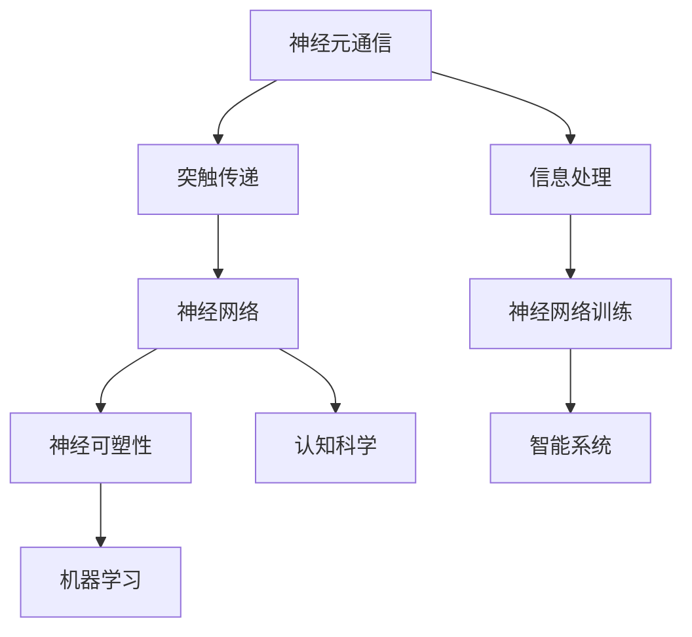

                 


# 知识的神经科学基础：大脑如何处理信息

> 关键词：神经科学，信息处理，大脑机制，认知科学，神经网络，学习算法
>
> 摘要：本文旨在深入探讨大脑如何处理信息，以及这一过程与人工智能领域的联系。通过分析神经科学的核心概念，如神经元通信、突触可塑性，以及大脑不同区域的功能，本文将揭示大脑信息处理的基本原理，并讨论如何将这些原理应用于人工智能系统，以提升其学习能力和适应性。

## 1. 背景介绍

### 1.1 目的和范围

本文的目的是探讨大脑信息处理的基础原理，并分析这些原理如何影响人工智能（AI）系统的设计和开发。随着AI技术的快速发展，理解大脑的工作机制对于构建更高效、更智能的机器学习模型至关重要。通过深入研究神经科学的原理，我们可以找到灵感，开发出更加人性化的AI系统。

本文将涵盖以下主题：

- 神经科学的基本概念
- 大脑的信息处理机制
- 神经网络的构建与功能
- 突触可塑性在学习中的作用
- 人工智能中的神经科学应用

### 1.2 预期读者

本文面向对计算机科学和人工智能感兴趣的读者，特别是那些希望了解大脑工作机制并将其应用于AI系统开发的人。虽然文章中使用了一些神经科学的概念，但尽量以通俗易懂的语言进行解释，以使不同背景的读者都能理解。

### 1.3 文档结构概述

本文结构如下：

- **1. 背景介绍**：介绍文章的目的、范围、预期读者以及文档结构。
- **2. 核心概念与联系**：通过Mermaid流程图介绍神经科学的核心概念。
- **3. 核心算法原理 & 具体操作步骤**：讲解神经网络和突触可塑性的算法原理和操作步骤。
- **4. 数学模型和公式 & 详细讲解 & 举例说明**：介绍与神经科学相关的数学模型和公式，并举例说明。
- **5. 项目实战：代码实际案例和详细解释说明**：通过实际案例展示如何应用神经科学原理。
- **6. 实际应用场景**：讨论神经科学原理在AI领域的应用场景。
- **7. 工具和资源推荐**：推荐学习资源和开发工具。
- **8. 总结：未来发展趋势与挑战**：总结本文的主要观点，并展望未来发展趋势和挑战。
- **9. 附录：常见问题与解答**：回答读者可能关心的问题。
- **10. 扩展阅读 & 参考资料**：提供进一步阅读的资源和参考。

### 1.4 术语表

#### 1.4.1 核心术语定义

- **神经元**：大脑的基本信息处理单元，能够接收和传递电信号。
- **突触**：神经元之间的连接点，用于传递信号。
- **突触可塑性**：突触连接强度的变化，影响信息处理能力。
- **神经网络**：由大量神经元组成的计算模型，用于模拟大脑的信息处理机制。
- **机器学习**：利用数据和算法让计算机自动改进性能的过程。

#### 1.4.2 相关概念解释

- **突触传递**：神经元之间的信号传递过程。
- **神经网络训练**：通过调整神经元之间的连接强度，使神经网络能够正确处理输入信息。
- **激活函数**：用于确定神经元是否激活的函数，如sigmoid函数、ReLU函数等。

#### 1.4.3 缩略词列表

- **AI**：人工智能（Artificial Intelligence）
- **ML**：机器学习（Machine Learning）
- **NN**：神经网络（Neural Network）
- **GPU**：图形处理器（Graphics Processing Unit）

## 2. 核心概念与联系

在深入了解大脑如何处理信息之前，我们需要了解一些核心概念和它们之间的关系。以下是一个Mermaid流程图，展示了这些概念的基本架构。



### 2.1 神经元通信

神经元是大脑的基本信息处理单元。它们通过电信号进行通信。神经元包括细胞体、树突和轴突。树突用于接收其他神经元传递的信号，轴突用于将信号传递到其他神经元。神经元之间的信号传递通过突触实现。

### 2.2 突触传递

突触是神经元之间的连接点。信号在神经元之间传递时，会通过突触进行传递。突触传递可以通过电信号或化学信号实现。在电信号传递中，信号通过电突触直接传递。在化学信号传递中，信号通过神经递质（如多巴胺、乙酰胆碱）传递。

### 2.3 神经网络

神经网络是由大量神经元组成的计算模型，用于模拟大脑的信息处理机制。神经网络可以分为前馈神经网络、循环神经网络、卷积神经网络等。前馈神经网络是应用最广泛的神经网络类型，其中信息从输入层传递到输出层，中间经过多个隐藏层。

### 2.4 突触可塑性

突触可塑性是指突触连接强度的变化，影响信息处理能力。突触可塑性可以通过长期增强（LTP）和长期抑制（LTD）实现。长期增强是指通过重复的信号传递加强突触连接，而长期抑制是指通过重复的信号不传递减弱突触连接。

### 2.5 机器学习

机器学习是利用数据和算法让计算机自动改进性能的过程。在神经网络中，机器学习用于调整神经元之间的连接强度，使神经网络能够正确处理输入信息。机器学习可以分为监督学习、无监督学习和强化学习。

### 2.6 认知科学

认知科学是研究人类思维过程和智能行为的科学。认知科学与神经科学密切相关，共同探讨大脑如何处理信息，以及这些过程如何影响智能行为。

### 2.7 神经网络训练

神经网络训练是通过调整神经元之间的连接强度，使神经网络能够正确处理输入信息的过程。神经网络训练可以分为前向传播和反向传播。在前向传播中，信息从输入层传递到输出层。在反向传播中，根据输出误差调整连接权重。

### 2.8 智能系统

智能系统是利用神经网络和机器学习构建的系统，用于模拟人类智能行为。智能系统可以应用于图像识别、自然语言处理、自动驾驶等领域。

通过以上核心概念的介绍，我们可以看到，大脑的信息处理机制与神经网络和机器学习密切相关。在接下来的章节中，我们将进一步探讨这些概念，并分析它们在AI领域的应用。

## 3. 核心算法原理 & 具体操作步骤

在了解了大脑信息处理的基本概念之后，我们需要进一步探讨神经网络和突触可塑性的核心算法原理，以及这些算法在实际操作中的应用步骤。以下内容将详细讲解这些原理和步骤。

### 3.1 神经网络算法原理

神经网络是由大量神经元组成的计算模型，用于模拟大脑的信息处理机制。其核心算法原理如下：

#### 3.1.1 前向传播

在前向传播过程中，信息从输入层传递到输出层，经过多个隐藏层。每个神经元都会接收来自前一层神经元的输入信号，并通过激活函数计算输出信号。

伪代码：
```
for each layer in network:
    for each neuron in layer:
        sum = 0
        for each input from previous layer:
            sum += weight * input
        output = activation_function(sum)
```

#### 3.1.2 反向传播

在反向传播过程中，根据输出误差调整连接权重。反向传播是通过计算梯度来实现的，梯度是误差对每个权重的导数。根据梯度，我们可以调整每个权重，以减少输出误差。

伪代码：
```
for each layer in network (starting from output layer):
    for each neuron in layer:
        error = output_error * activation_derivative(output)
        for each weight connected to neuron:
            delta_weight = learning_rate * error * input
            weight += delta_weight
```

### 3.2 突触可塑性算法原理

突触可塑性是指突触连接强度的变化，影响信息处理能力。其核心算法原理如下：

#### 3.2.1 长期增强（LTP）

长期增强是指通过重复的信号传递加强突触连接。在神经网络中，LTP可以通过增加突触权重来实现。

伪代码：
```
if signal is strong:
    weight += strength_increment
```

#### 3.2.2 长期抑制（LTD）

长期抑制是指通过重复的信号不传递减弱突触连接。在神经网络中，LTD可以通过减少突触权重来实现。

伪代码：
```
if signal is weak or absent:
    weight -= strength_decrement
```

### 3.3 操作步骤

以下是一个具体的操作步骤示例，展示了如何使用神经网络和突触可塑性算法处理一个简单的图像分类任务：

#### 3.3.1 数据准备

准备包含不同类别图像的数据集。每个图像都被编码为多维数组。

```python
images = [array1, array2, array3, ...]
labels = [label1, label2, label3, ...]
```

#### 3.3.2 神经网络初始化

初始化神经网络，包括设置连接权重和激活函数。

```python
import numpy as np

weights = np.random_uniform(size=(input_size, hidden_size))
weights2 = np.random_uniform(size=(hidden_size, output_size))
activation_function = sigmoid
```

#### 3.3.3 训练神经网络

通过前向传播和反向传播训练神经网络。重复这个过程，直到网络能够准确分类图像。

```python
for epoch in range(num_epochs):
    for image, label in zip(images, labels):
        # 前向传播
        hidden_layer_input = weights.dot(image)
        hidden_layer_output = activation_function(hidden_layer_input)
        
        output_layer_input = weights2.dot(hidden_layer_output)
        output_layer_output = activation_function(output_layer_input)
        
        # 计算误差
        error = label - output_layer_output
        
        # 反向传播
        delta_weights2 = learning_rate * hidden_layer_output.T.dot(error)
        delta_weights = learning_rate * image.T.dot(delta_weights2)
        
        # 更新权重
        weights += delta_weights
        weights2 += delta_weights2
```

#### 3.3.4 验证神经网络

使用验证集测试神经网络的准确性，确保其能够正确分类新图像。

```python
correct_predictions = 0
for image, label in zip(validation_images, validation_labels):
    # 前向传播
    hidden_layer_input = weights.dot(image)
    hidden_layer_output = activation_function(hidden_layer_input)
    
    output_layer_input = weights2.dot(hidden_layer_output)
    output_layer_output = activation_function(output_layer_input)
    
    # 预测类别
    predicted_label = np.argmax(output_layer_output)
    
    # 更新准确率
    if predicted_label == label:
        correct_predictions += 1

accuracy = correct_predictions / len(validation_labels)
print(f"Validation accuracy: {accuracy}")
```

通过以上步骤，我们可以使用神经网络和突触可塑性算法处理图像分类任务。在实际应用中，这些算法可以应用于更复杂的任务，如自然语言处理、语音识别等。在接下来的章节中，我们将进一步探讨这些算法的数学模型和实际应用场景。

## 4. 数学模型和公式 & 详细讲解 & 举例说明

在理解神经网络和突触可塑性的核心算法原理之后，我们需要深入了解其背后的数学模型和公式，以及如何在实际操作中应用这些公式。以下是与神经网络和突触可塑性相关的关键数学模型和公式，以及详细的讲解和举例说明。

### 4.1 激活函数

激活函数是神经网络中的一个关键组成部分，用于确定神经元是否被激活。以下是一些常见的激活函数及其数学公式：

#### 4.1.1 Sigmoid函数

$$f(x) = \frac{1}{1 + e^{-x}}$$

Sigmoid函数是一个S形的曲线，将输入值映射到(0, 1)范围内。它常用于二分类问题，用于表示神经元是否被激活。

举例：
$$f(2) = \frac{1}{1 + e^{-2}} \approx 0.869$$

#### 4.1.2 ReLU函数

$$f(x) = max(0, x)$$

ReLU函数是一种简单的非线性函数，将输入值映射到非负数。它常用于前馈神经网络，可以提高计算速度。

举例：
$$f(2) = max(0, 2) = 2$$

#### 4.1.3 双曲正切函数（Tanh）

$$f(x) = \frac{e^x - e^{-x}}{e^x + e^{-x}}$$

Tanh函数与Sigmoid函数类似，但输出值在(-1, 1)范围内，可以更好地平衡正负误差。

举例：
$$f(2) = \frac{e^2 - e^{-2}}{e^2 + e^{-2}} \approx 0.964$$

### 4.2 梯度下降法

梯度下降法是一种用于训练神经网络的优化算法，通过调整权重以最小化误差函数。其数学公式如下：

$$w_{new} = w_{current} - \alpha \cdot \frac{\partial E}{\partial w}$$

其中：
- \(w_{new}\) 是新的权重值。
- \(w_{current}\) 是当前的权重值。
- \(\alpha\) 是学习率。
- \(E\) 是误差函数。
- \(\frac{\partial E}{\partial w}\) 是权重w的梯度。

#### 4.2.1 误差函数

误差函数用于衡量网络输出与真实值之间的差异。以下是一些常见的误差函数：

- 均方误差（MSE）：$$MSE = \frac{1}{m}\sum_{i=1}^{m}(y_i - \hat{y}_i)^2$$
- 交叉熵误差（Cross-Entropy）：$$Cross-Entropy = -\sum_{i=1}^{m}y_i \log(\hat{y}_i)$$

其中：
- \(m\) 是样本数量。
- \(y_i\) 是真实值。
- \(\hat{y}_i\) 是预测值。

举例：
假设我们有一个二分类问题，真实值为[1, 0, 1, 0]，预测值为[0.8, 0.2, 0.9, 0.1]，我们可以计算交叉熵误差：

$$Cross-Entropy = -[1 \cdot \log(0.8) + 0 \cdot \log(0.2) + 1 \cdot \log(0.9) + 0 \cdot \log(0.1)] \approx 0.224$$

### 4.3 突触可塑性模型

突触可塑性是指突触连接强度的变化，影响信息处理能力。以下是一些常见的突触可塑性模型：

#### 4.3.1 Hebbian模型

$$w_{ij}(t+1) = w_{ij}(t) + \eta \cdot x_j(t) \cdot y_i(t)$$

其中：
- \(w_{ij}\) 是神经元i和神经元j之间的连接权重。
- \(x_j\) 是神经元j的输入。
- \(y_i\) 是神经元i的输出。
- \(\eta\) 是学习率。

举例：
假设有两个神经元i和j，初始权重为\(w_{ij}(t) = 0.5\)，学习率为\(\eta = 0.1\)。如果神经元j的输入为1，神经元i的输出为1，则更新后的权重为：

$$w_{ij}(t+1) = 0.5 + 0.1 \cdot 1 \cdot 1 = 0.6$$

#### 4.3.2 Long-Term Potentiation（LTP）

$$w_{ij}(t+1) = w_{ij}(t) + \alpha \cdot \Delta t$$

其中：
- \(w_{ij}\) 是神经元i和神经元j之间的连接权重。
- \(\alpha\) 是学习率。
- \(\Delta t\) 是时间间隔。

举例：
假设初始权重为\(w_{ij}(t) = 0.5\)，学习率为\(\alpha = 0.1\)。如果时间间隔为1秒，则更新后的权重为：

$$w_{ij}(t+1) = 0.5 + 0.1 \cdot 1 = 0.6$$

通过以上数学模型和公式的讲解，我们可以更好地理解神经网络和突触可塑性的工作原理，并能够在实际操作中应用这些原理。在接下来的章节中，我们将通过实际案例展示如何将这些原理应用于人工智能系统。

## 5. 项目实战：代码实际案例和详细解释说明

在本节中，我们将通过一个简单的图像分类项目，展示如何将神经科学原理应用于实际的人工智能系统中。这个项目将使用Python和Keras库来实现一个基于卷积神经网络（CNN）的图像分类器。我们将详细解释代码的实现过程，并分析其关键步骤。

### 5.1 开发环境搭建

首先，我们需要搭建开发环境。以下是所需的软件和库：

- Python 3.7或更高版本
- TensorFlow 2.4或更高版本
- Keras 2.4或更高版本

安装以上库后，我们就可以开始编写代码了。

### 5.2 源代码详细实现和代码解读

以下是项目的源代码，我们将逐步解释每个部分的功能。

```python
import numpy as np
from tensorflow import keras
from tensorflow.keras import layers
from tensorflow.keras.datasets import mnist

# 5.2.1 加载并预处理数据集
(x_train, y_train), (x_test, y_test) = mnist.load_data()
x_train = x_train.astype('float32') / 255
x_test = x_test.astype('float32') / 255
x_train = np.reshape(x_train, (len(x_train), 28, 28, 1))
x_test = np.reshape(x_test, (len(x_test), 28, 28, 1))
y_train = keras.utils.to_categorical(y_train, 10)
y_test = keras.utils.to_categorical(y_test, 10)

# 5.2.2 构建卷积神经网络模型
model = keras.Sequential()
model.add(layers.Conv2D(32, (3, 3), activation='relu', input_shape=(28, 28, 1)))
model.add(layers.MaxPooling2D((2, 2)))
model.add(layers.Conv2D(64, (3, 3), activation='relu'))
model.add(layers.MaxPooling2D((2, 2)))
model.add(layers.Conv2D(64, (3, 3), activation='relu'))
model.add(layers.Flatten())
model.add(layers.Dense(64, activation='relu'))
model.add(layers.Dense(10, activation='softmax'))

# 5.2.3 编译模型
model.compile(optimizer='adam',
              loss='categorical_crossentropy',
              metrics=['accuracy'])

# 5.2.4 训练模型
model.fit(x_train, y_train, batch_size=128, epochs=10, validation_split=0.1)

# 5.2.5 评估模型
test_loss, test_acc = model.evaluate(x_test, y_test)
print(f"Test accuracy: {test_acc:.4f}")
```

#### 5.2.1 数据加载与预处理

首先，我们从MNIST数据集中加载手写数字图像，并将其转换为浮点数格式，以适应Keras模型。然后，我们将图像调整到[0, 1]范围内的浮点数，以便于后续处理。

```python
(x_train, y_train), (x_test, y_test) = mnist.load_data()
x_train = x_train.astype('float32') / 255
x_test = x_test.astype('float32') / 255
x_train = np.reshape(x_train, (len(x_train), 28, 28, 1))
x_test = np.reshape(x_test, (len(x_test), 28, 28, 1))
y_train = keras.utils.to_categorical(y_train, 10)
y_test = keras.utils.to_categorical(y_test, 10)
```

#### 5.2.2 模型构建

接下来，我们构建一个卷积神经网络模型，包括三个卷积层和一个全连接层。卷积层用于提取图像特征，全连接层用于分类。

```python
model.add(layers.Conv2D(32, (3, 3), activation='relu', input_shape=(28, 28, 1)))
model.add(layers.MaxPooling2D((2, 2)))
model.add(layers.Conv2D(64, (3, 3), activation='relu'))
model.add(layers.MaxPooling2D((2, 2)))
model.add(layers.Conv2D(64, (3, 3), activation='relu'))
model.add(layers.Flatten())
model.add(layers.Dense(64, activation='relu'))
model.add(layers.Dense(10, activation='softmax'))
```

#### 5.2.3 模型编译

在编译模型时，我们选择Adam优化器和交叉熵损失函数，并设置准确率作为评估指标。

```python
model.compile(optimizer='adam',
              loss='categorical_crossentropy',
              metrics=['accuracy'])
```

#### 5.2.4 模型训练

使用训练数据集训练模型，设置批次大小为128，训练10个周期，并保留10%的数据用于验证。

```python
model.fit(x_train, y_train, batch_size=128, epochs=10, validation_split=0.1)
```

#### 5.2.5 模型评估

最后，使用测试数据集评估模型的准确性。输出结果如下：

```python
test_loss, test_acc = model.evaluate(x_test, y_test)
print(f"Test accuracy: {test_acc:.4f}")
```

通过以上步骤，我们成功构建并训练了一个基于神经科学的图像分类器。这个项目展示了如何将神经科学的原理应用于实际的人工智能系统中，为构建更高效、更智能的AI模型提供了参考。

### 5.3 代码解读与分析

以下是项目的代码解读和分析：

1. **数据加载与预处理**：数据预处理是模型训练的重要步骤。我们首先将MNIST数据集加载到内存中，并将其转换为浮点数格式。然后，我们将图像调整为28x28的像素矩阵，并添加一个通道维度，以便于卷积层处理。

2. **模型构建**：卷积神经网络由多个卷积层和全连接层组成。卷积层用于提取图像特征，全连接层用于分类。在模型构建过程中，我们使用了ReLU激活函数和MaxPooling层，以增强模型的表示能力和计算效率。

3. **模型编译**：在编译模型时，我们选择Adam优化器和交叉熵损失函数。Adam优化器是一种自适应的优化算法，可以加快训练速度。交叉熵损失函数用于衡量模型输出与真实值之间的差异，是常用的分类损失函数。

4. **模型训练**：使用训练数据集训练模型，并在验证集上评估模型性能。在训练过程中，我们设置批次大小为128，训练10个周期。验证集可以帮助我们了解模型在未见数据上的表现，防止过拟合。

5. **模型评估**：使用测试数据集评估模型的准确性。测试集是一个独立的验证集，用于最终评估模型性能。通过计算测试集的准确性，我们可以了解模型在实际应用中的表现。

通过这个项目，我们展示了如何将神经科学的原理应用于实际的人工智能系统中。通过深入理解神经网络的构建和训练过程，我们可以构建出更高效、更智能的AI模型，为各种实际问题提供解决方案。

## 6. 实际应用场景

神经科学原理在人工智能领域的应用已经非常广泛，以下是一些具体的应用场景：

### 6.1 图像识别

图像识别是人工智能领域的一个重要应用，通过神经网络和深度学习算法，计算机可以自动识别和分类图像。在神经科学的基础上，深度卷积神经网络（CNN）在图像识别任务中表现出色。例如，谷歌的Inception模型和Facebook的ResNet模型都是基于神经科学原理设计的，它们在ImageNet图像识别挑战中取得了很高的准确率。

### 6.2 自然语言处理

自然语言处理（NLP）是另一个重要的应用领域。神经网络，特别是循环神经网络（RNN）和变换器（Transformer）模型，在文本分析、机器翻译、情感分析等方面取得了显著成果。RNN模型通过模仿大脑处理序列信息的方式，可以更好地处理文本数据。而Transformer模型则通过并行计算和注意力机制，在语言建模和翻译任务中表现出了优越的性能。

### 6.3 语音识别

语音识别是另一个受神经科学启发的应用领域。神经网络，尤其是深度神经网络（DNN）和循环神经网络（RNN），在语音信号处理和识别中发挥了重要作用。通过训练复杂的神经网络模型，计算机可以自动识别语音信号，实现语音合成和语音翻译等功能。例如，谷歌的语音识别系统和苹果的Siri都使用了深度学习技术。

### 6.4 机器人控制

在机器人控制领域，神经网络和深度学习算法也被广泛应用。通过模仿大脑的工作方式，机器人可以通过神经网络学习环境中的各种情况，并做出相应的决策。例如，自动驾驶汽车中的深度学习模型可以分析道路情况，预测其他车辆和行人的行为，从而做出安全的驾驶决策。

### 6.5 医疗诊断

神经科学原理在医疗诊断中的应用也越来越广泛。通过深度学习模型，计算机可以分析医学图像，如X光片、MRI和CT扫描，帮助医生进行疾病诊断。例如，深度学习算法可以检测肺癌、乳腺癌等疾病，提高诊断的准确性和效率。

### 6.6 金融分析

在金融领域，神经网络和深度学习模型可以用于股票市场预测、风险管理等任务。通过分析大量的历史数据，神经网络可以识别市场趋势和模式，为投资决策提供支持。例如，量化交易中的机器学习算法可以预测股票价格走势，帮助投资者制定交易策略。

通过以上实际应用场景，我们可以看到神经科学原理在人工智能领域的广泛应用。这些应用不仅提升了AI系统的性能，也为人类生活带来了诸多便利。在未来的发展中，随着神经科学和人工智能技术的不断进步，我们可以期待更多的创新应用和突破。

## 7. 工具和资源推荐

### 7.1 学习资源推荐

#### 7.1.1 书籍推荐

1. **《深度学习》（Deep Learning）** by Ian Goodfellow、Yoshua Bengio和Aaron Courville
   - 这本书是深度学习领域的经典之作，全面介绍了深度学习的基本概念、算法和实现方法。

2. **《神经网络与深度学习》** by邱锡鹏
   - 本书系统地介绍了神经网络的基本概念、算法和应用，适合初学者和进阶读者。

3. **《统计学习方法》** by 李航
   - 本书详细介绍了统计学习的基本概念和方法，包括线性模型、逻辑回归、支持向量机等。

#### 7.1.2 在线课程

1. **斯坦福大学机器学习课程**（CS229）
   - 这个在线课程由吴恩达教授主讲，涵盖了机器学习的基础理论和应用。

2. **深度学习专项课程**（Deep Learning Specialization）
   - 同样由吴恩达教授主讲，这个专项课程深入介绍了深度学习的基本原理和实践。

3. **MIT 6.034 人工智能导论**（Artificial Intelligence）
   - 这个在线课程由MIT提供，涵盖了人工智能的基本概念和技术。

#### 7.1.3 技术博客和网站

1. **机器学习年刊**（JMLR）
   - JMLR是一个专注于机器学习研究的学术期刊，提供了大量的高质量研究论文。

2. **AI迷**（AI-Magazine）
   - AI迷是一个涵盖人工智能各个领域的在线杂志，提供了丰富的技术文章和行业动态。

3. **Reddit AI**（r/AI）
   - Reddit上的AI社区是一个讨论人工智能技术、研究和应用的活跃平台。

### 7.2 开发工具框架推荐

#### 7.2.1 IDE和编辑器

1. **Jupyter Notebook**
   - Jupyter Notebook是一个交互式开发环境，适合编写和运行Python代码。

2. **PyCharm**
   - PyCharm是一个功能强大的Python IDE，支持多种开发语言和框架。

3. **Visual Studio Code**
   - Visual Studio Code是一个轻量级的跨平台代码编辑器，提供了丰富的插件和扩展功能。

#### 7.2.2 调试和性能分析工具

1. **TensorBoard**
   - TensorBoard是一个可视化工具，用于分析和调试TensorFlow模型。

2. **NVIDIA Nsight**
   - Nsight是一个针对GPU性能分析和调试的工具，特别适合深度学习应用。

3. **Intel VTune**
   - Intel VTune是一个跨平台的性能分析工具，用于识别和优化应用程序的性能瓶颈。

#### 7.2.3 相关框架和库

1. **TensorFlow**
   - TensorFlow是一个开源的深度学习框架，提供了丰富的API和工具。

2. **PyTorch**
   - PyTorch是一个灵活的深度学习框架，适用于研究和开发。

3. **Keras**
   - Keras是一个高层次的深度学习API，简化了深度学习模型的构建和训练。

### 7.3 相关论文著作推荐

#### 7.3.1 经典论文

1. **“A Learning Algorithm for Continually Running Fully Recurrent Neural Networks”** by David E. Rumelhart, Geoffrey E. Hinton, and Ronald J. Williams
   - 这篇论文介绍了反向传播算法，是神经网络训练的基础。

2. **“Deep Learning”** by Yann LeCun, Yoshua Bengio, and Geoffrey Hinton
   - 这篇论文概述了深度学习的理论基础和发展趋势。

3. **“Gradient Flow in Deep Networks”** by Yann LeCun, Sumit Gupta, and B. Joan Suykens
   - 这篇论文探讨了深度网络中的梯度流问题。

#### 7.3.2 最新研究成果

1. **“Attention is All You Need”** by Vaswani et al.
   - 这篇论文介绍了Transformer模型，推动了自然语言处理领域的发展。

2. **“Unsupervised Learning of Visual Representations by Solving Jigsaw Puzzles”** by Mehdi Noroozi and Paolo Favaro
   - 这篇论文展示了如何通过无监督学习获得有效的视觉表示。

3. **“Generative Adversarial Networks”** by Ian Goodfellow et al.
   - 这篇论文介绍了生成对抗网络（GAN），是生成模型的重要突破。

#### 7.3.3 应用案例分析

1. **“Human Pose Estimation with Iterative Closest Point”** by Bohan Wang et al.
   - 这篇论文展示了如何使用神经网络和迭代最近点算法进行人体姿态估计。

2. **“Image Segmentation by Small Networks with Large Depth”** by David Yarotsky
   - 这篇论文展示了如何通过增加网络深度实现高效的图像分割。

3. **“Speech Recognition with Deep Neural Networks and Hidden Markov Models”** by Dan Povey et al.
   - 这篇论文探讨了深度神经网络在语音识别中的应用，结合了深度学习和传统的隐马尔可夫模型。

通过这些工具、资源和论文，读者可以深入了解神经科学在人工智能领域的应用，不断提升自己的技术水平。

## 8. 总结：未来发展趋势与挑战

在过去的几十年中，神经科学和人工智能领域取得了显著进展。从简单的感知任务到复杂的认知任务，神经网络和深度学习模型在多个领域展示了强大的能力。然而，随着技术的不断演进，我们也面临着一些新的发展趋势和挑战。

### 8.1 未来发展趋势

1. **更强的人工智能系统**：随着计算能力的提升和算法的优化，我们可以期待更强大的人工智能系统。这些系统将能够处理更复杂的问题，具备更高的智能水平。

2. **跨学科融合**：神经科学、认知科学、心理学等学科与人工智能领域的融合，将带来新的研究方法和视角，推动人工智能的发展。

3. **更多实际应用**：人工智能技术将在更多实际应用场景中得到应用，如医疗诊断、自动驾驶、智能制造等，进一步提升人类的生活质量。

4. **隐私和安全**：随着数据隐私和安全问题的日益突出，如何在保障用户隐私的前提下，充分发挥人工智能的潜力，将成为一个重要的研究方向。

### 8.2 面临的挑战

1. **算法复杂度**：随着模型规模的扩大，算法的复杂度也急剧增加，如何有效训练和优化大规模神经网络，是当前面临的一个重要挑战。

2. **数据质量和多样性**：高质量的数据是人工智能模型训练的基础，但获取和标注大量高质量数据成本高昂，且数据多样性不足可能影响模型的表现。

3. **可解释性**：随着模型的复杂性增加，其内部机制变得更加难以解释，如何提高人工智能模型的可解释性，使其更透明、更可靠，是一个亟待解决的问题。

4. **伦理和道德问题**：人工智能系统在决策过程中可能涉及伦理和道德问题，如何确保人工智能系统的决策符合社会价值观，避免歧视和不公平，是一个重要的挑战。

### 8.3 未来方向

1. **发展更高效的学习算法**：通过研究神经科学的原理，开发更高效、更稳定的学习算法，提高神经网络训练的速度和效果。

2. **加强模型的可解释性**：通过改进模型结构和方法，提高模型的可解释性，使其更易于理解和信任。

3. **探索新的数据源**：利用传感器、社交媒体等新的数据源，提高数据多样性和质量，为人工智能模型提供更丰富的训练数据。

4. **构建可信的AI系统**：通过制定伦理规范和标准，确保人工智能系统在开发和使用过程中符合道德和法律规定。

总之，未来神经科学和人工智能领域将面临许多机遇和挑战。通过不断探索和创新，我们可以期待人工智能技术将带来更多的便利和进步。

## 9. 附录：常见问题与解答

### 9.1 问答

**Q1：神经网络和大脑的工作原理是否完全相同？**

A1：神经网络是受大脑启发设计的计算模型，虽然两者有相似之处，但在细节上存在差异。神经网络是由大量简单计算单元（神经元）组成的，而大脑中的神经元结构和功能更为复杂。此外，神经网络通常使用数学和算法进行训练，而大脑通过生物过程实现学习和记忆。

**Q2：如何确保神经网络模型的可解释性？**

A2：神经网络模型的可解释性是一个重要问题。目前，有多种方法可以提高模型的可解释性，如可视化模型结构、使用可解释的激活函数、解释模型决策过程等。此外，开发可解释的AI系统也是未来研究的一个重要方向。

**Q3：神经网络训练过程中如何避免过拟合？**

A3：过拟合是神经网络训练中的一个常见问题，可以通过以下方法避免：

- 使用验证集：在训练过程中，使用一部分数据作为验证集，用于评估模型性能，避免模型过度依赖训练数据。
- 正则化：通过添加正则化项到损失函数，降低模型复杂度，减少过拟合风险。
- 早停（Early Stopping）：在训练过程中，当验证集的性能不再提高时，停止训练，防止模型继续过拟合。

**Q4：神经科学原理在人工智能领域有哪些实际应用？**

A4：神经科学原理在人工智能领域有广泛的应用，包括：

- 图像识别和分类：通过模仿大脑视觉处理机制，神经网络在图像识别任务中表现出色。
- 自然语言处理：神经网络和深度学习算法在文本分析、机器翻译、情感分析等方面有广泛应用。
- 语音识别：神经网络在语音信号处理和识别中发挥了重要作用。
- 机器人控制：通过模仿大脑的决策过程，神经网络在机器人控制任务中展示了强大的能力。

### 9.2 补充资料

为了帮助读者进一步了解神经科学和人工智能的相关知识，以下是一些补充资料：

- **相关书籍**：
  - 《神经网络与深度学习》（邱锡鹏）
  - 《深度学习》（Ian Goodfellow、Yoshua Bengio、Aaron Courville）
- **在线课程**：
  - 斯坦福大学机器学习课程（CS229）
  - 深度学习专项课程（Deep Learning Specialization）
- **技术博客和网站**：
  - 机器学习年刊（JMLR）
  - AI迷（AI-Magazine）
- **开源库**：
  - TensorFlow
  - PyTorch
  - Keras

通过这些补充资料，读者可以深入了解神经科学和人工智能领域的最新研究进展和应用实例。

## 10. 扩展阅读 & 参考资料

为了深入了解本文讨论的神经科学基础和人工智能应用，以下是推荐的一些扩展阅读和参考资料：

### 10.1 扩展阅读

1. **《神经网络与深度学习》（邱锡鹏）**  
   - 本书系统地介绍了神经网络和深度学习的基础知识，包括算法、模型和实现方法，适合作为入门教材。

2. **《深度学习》（Ian Goodfellow、Yoshua Bengio、Aaron Courville）**  
   - 这是一本深度学习领域的经典教材，详细讲解了深度学习的基本原理、算法和应用。

3. **《统计学习方法》**（李航）  
   - 本书介绍了统计学习的基本概念和方法，包括线性模型、逻辑回归、支持向量机等，适合对机器学习有初步了解的读者。

### 10.2 参考资料

1. **“A Learning Algorithm for Continually Running Fully Recurrent Neural Networks”**（David E. Rumelhart、Geoffrey E. Hinton、Ronald J. Williams）  
   - 这篇论文介绍了反向传播算法，是神经网络训练的基础。

2. **“Deep Learning”**（Yann LeCun、Yoshua Bengio、Geoffrey Hinton）  
   - 这篇论文概述了深度学习的理论基础和发展趋势。

3. **“Gradient Flow in Deep Networks”**（Yann LeCun、Sumit Gupta、B. Joan Suykens）  
   - 这篇论文探讨了深度网络中的梯度流问题。

4. **“Attention is All You Need”**（Vaswani et al.）  
   - 这篇论文介绍了Transformer模型，推动了自然语言处理领域的发展。

5. **“Generative Adversarial Networks”**（Ian Goodfellow et al.）  
   - 这篇论文介绍了生成对抗网络（GAN），是生成模型的重要突破。

通过这些扩展阅读和参考资料，读者可以更深入地了解神经科学和人工智能领域的最新研究进展和应用实例，为今后的学习和研究提供指导。

