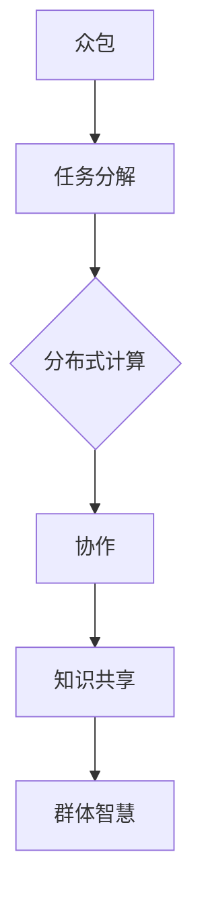

                 


# 知识的群体智慧：众包与协作的力量

> **关键词**：众包、协作、群体智慧、分布式计算、开放平台、算法、应用案例  
>
> **摘要**：本文将探讨知识的群体智慧如何通过众包和协作模式在信息技术领域发挥巨大作用。我们首先回顾众包的历史和基本概念，然后深入探讨众包与协作的核心原理和架构。通过具体算法原理讲解和实际项目案例，我们将揭示群体智慧的强大潜力。同时，本文还将分析实际应用场景和推荐相关工具与资源，为读者提供一个全面深入的了解。

## 1. 背景介绍

### 1.1 目的和范围

本文旨在揭示知识的群体智慧在信息技术领域的应用和潜力。我们将探讨众包与协作的基本概念、核心原理和实际操作，通过具体案例和算法分析，展示群体智慧在分布式计算、数据分析、问题解决等领域的强大力量。此外，本文还将讨论未来发展趋势和挑战，为读者提供深入思考和借鉴。

### 1.2 预期读者

本文适合对信息技术、人工智能、分布式计算感兴趣的读者，特别是希望深入了解众包与协作机制的科研人员、工程师、项目经理和软件开发者。同时，对群体智慧和开放平台有兴趣的读者也能从本文中获得宝贵的信息和启示。

### 1.3 文档结构概述

本文分为十个主要部分：

1. 背景介绍：介绍文章的目的、范围、预期读者和文档结构。
2. 核心概念与联系：介绍众包与协作的基本概念和架构。
3. 核心算法原理 & 具体操作步骤：详细讲解核心算法原理和具体操作步骤。
4. 数学模型和公式 & 详细讲解 & 举例说明：阐述数学模型和公式，并提供具体示例。
5. 项目实战：代码实际案例和详细解释说明。
6. 实际应用场景：分析众包与协作在不同领域的应用。
7. 工具和资源推荐：推荐相关学习资源和开发工具。
8. 总结：未来发展趋势与挑战。
9. 附录：常见问题与解答。
10. 扩展阅读 & 参考资料：提供进一步学习和参考的资源。

### 1.4 术语表

#### 1.4.1 核心术语定义

- **众包**：指将一个任务或问题分散到大量志愿者或参与者中，通过他们的协作和贡献来解决问题或完成任务。
- **协作**：指多个参与者或团队通过共享资源、信息、知识和技能来实现共同目标的过程。
- **群体智慧**：指个体通过协作和知识共享形成的集体智慧和解决问题的能力。
- **分布式计算**：指多个计算节点通过网络协同工作，共同完成计算任务。
- **开放平台**：指提供资源、工具和框架，鼓励开发者和用户参与和贡献的开放性平台。

#### 1.4.2 相关概念解释

- **众包平台**：提供众包任务的发布、管理和协作的工具和平台，如GitHub、Topcoder、Udacity等。
- **众筹**：指通过公众筹集资金来支持某个项目或创业活动，与本文的众包概念有所不同。
- **社区驱动的开发**：指开发项目由社区成员共同参与和贡献，如Linux内核和WordPress。
- **人工智能**：指模拟、延伸和扩展人类智能的理论、方法和技术，包括机器学习、自然语言处理等。

#### 1.4.3 缩略词列表

- **API**：应用程序编程接口（Application Programming Interface）
- **API**：众筹（Crowdfunding）
- **AI**：人工智能（Artificial Intelligence）
- **IoT**：物联网（Internet of Things）
- **Blockchain**：区块链（Blockchain）

## 2. 核心概念与联系

在探讨知识的群体智慧之前，我们需要明确众包与协作的基本概念和联系。以下是核心概念的原理和架构的Mermaid流程图：



### 2.1 众包

众包（Crowdsourcing）是一种利用广泛参与者的知识和技能来解决复杂问题或完成任务的协作模式。众包的核心理念是将一个任务或问题分散到大量志愿者或参与者中，通过他们的协作和贡献来解决问题或完成任务。以下是众包的基本流程：

1. **任务发布**：任务发起者将任务描述和需求发布到众包平台。
2. **参与者注册**：志愿者或参与者注册并选择感兴趣的任务。
3. **任务执行**：参与者根据任务要求提交解决方案或完成具体任务。
4. **评估与反馈**：任务发起者对参与者提交的成果进行评估，并提供反馈。

### 2.2 分布式计算

分布式计算（Distributed Computing）是指通过多个计算节点通过网络协同工作，共同完成计算任务。分布式计算的核心优势在于提高计算效率和可扩展性。以下是分布式计算的基本原理：

1. **任务分配**：任务被分解为多个子任务，并分配到不同的计算节点。
2. **并行计算**：各个计算节点独立执行子任务，提高计算速度。
3. **结果汇总**：各个计算节点将子任务的结果汇总，得到最终结果。

### 2.3 协作

协作（Collaboration）是指多个参与者或团队通过共享资源、信息、知识和技能来实现共同目标的过程。协作的关键在于参与者之间的有效沟通和合作。以下是协作的基本步骤：

1. **目标设定**：明确协作的目标和预期成果。
2. **资源分配**：为参与者提供必要的资源和支持。
3. **沟通与协调**：建立有效的沟通机制，确保参与者之间的信息畅通。
4. **知识共享**：鼓励参与者分享知识和经验，促进知识积累和团队学习。
5. **绩效评估**：对协作过程和成果进行评估，持续改进协作方式。

### 2.4 知识共享

知识共享（Knowledge Sharing）是指参与者通过交流、分享和协作来传递、积累和应用知识的过程。知识共享是群体智慧形成的基础。以下是知识共享的主要途径：

1. **知识库**：建立知识库，存储和整理参与者的知识和经验。
2. **共享平台**：提供共享平台，如在线论坛、社交网络、协作工具等。
3. **培训与交流**：通过培训、研讨会、工作坊等形式促进知识交流。
4. **奖励机制**：建立奖励机制，激励参与者积极参与知识共享。

### 2.5 群体智慧

群体智慧（Collective Intelligence）是指个体通过协作和知识共享形成的集体智慧和解决问题的能力。群体智慧的核心在于充分利用参与者的知识和技能，实现共同目标和创新。以下是群体智慧的形成过程：

1. **个体贡献**：参与者根据自身特长和经验提供解决方案或信息。
2. **知识融合**：参与者之间的知识相互融合，形成新的创意和思路。
3. **协同决策**：基于群体智慧，共同做出决策和解决方案。
4. **持续迭代**：通过不断迭代和优化，实现持续创新和进步。

通过以上对核心概念和联系的分析，我们可以看到众包与协作在分布式计算、知识共享和群体智慧中的重要作用。接下来，我们将深入探讨核心算法原理和具体操作步骤，进一步揭示群体智慧的强大潜力。

## 3. 核心算法原理 & 具体操作步骤

在探讨知识的群体智慧时，核心算法原理起到了关键作用。以下是一个详细的伪代码，描述了群体智慧算法的基本原理和具体操作步骤：

```python
# 伪代码：群体智慧算法

# 初始化阶段
initialize:
    - 设定任务目标
    - 创建众包平台，发布任务描述
    - 吸引参与者注册

# 任务分解阶段
task_decomposition:
    - 将任务分解为多个子任务
    - 分配子任务到不同的计算节点

# 分布式计算阶段
distributed_computation:
    - 各计算节点独立执行子任务
    - 收集各个节点执行结果

# 知识共享阶段
knowledge_sharing:
    - 建立共享平台，如论坛、社交网络等
    - 参与者共享知识和经验
    - 整理知识库，更新知识储备

# 群体智慧形成阶段
collective_intelligence:
    - 参与者根据知识和经验提出解决方案
    - 群体讨论，融合不同思路
    - 评估和筛选解决方案

# 协同决策阶段
collaborative_decision_making:
    - 基于群体智慧，共同做出决策
    - 调整和优化解决方案
    - 实施决策，监控效果

# 结果反馈和评估阶段
result_evaluation:
    - 收集任务执行结果和参与者反馈
    - 分析成果，总结经验教训
    - 优化任务分解和协作流程

# 结束阶段
termination:
    - 总结群体智慧算法的应用效果
    - 提出改进建议和未来研究方向
```

### 3.1 初始化阶段

初始化阶段是整个算法的起点，主要包括设定任务目标、创建众包平台并发布任务描述，以及吸引参与者注册。

- **设定任务目标**：明确任务的目标和要求，确保参与者了解任务背景和预期成果。
- **创建众包平台**：选择合适的众包平台，如GitHub、Topcoder等，发布任务描述和需求。
- **吸引参与者注册**：通过宣传、奖励机制等方式，鼓励有兴趣的参与者注册并参与任务。

### 3.2 任务分解阶段

任务分解阶段是将整体任务分解为多个子任务，并分配到不同的计算节点。这一阶段的关键在于合理划分任务，确保每个节点都能独立完成任务。

- **任务分解**：根据任务的特点和需求，将任务分解为多个子任务，如数据分析、算法设计、代码实现等。
- **分配子任务**：将分解后的子任务分配到不同的计算节点，确保每个节点都能独立执行子任务。

### 3.3 分布式计算阶段

分布式计算阶段是算法的核心部分，通过多个计算节点独立执行子任务，提高计算效率和可扩展性。

- **节点独立执行子任务**：各个计算节点根据分配的子任务，独立执行计算任务。
- **收集节点执行结果**：汇总各个节点的执行结果，确保任务完成。

### 3.4 知识共享阶段

知识共享阶段是群体智慧形成的基础，通过建立共享平台和鼓励参与者共享知识和经验，实现知识积累和团队学习。

- **建立共享平台**：选择合适的共享平台，如在线论坛、社交网络等，提供参与者交流和分享知识的渠道。
- **共享知识和经验**：鼓励参与者分享他们在任务执行过程中获得的知识和经验，包括解决方案、算法设计思路等。
- **整理知识库**：整理和更新知识库，将参与者的知识和经验系统化、结构化，为后续任务提供参考。

### 3.5 群体智慧形成阶段

群体智慧形成阶段是参与者根据知识和经验提出解决方案，群体讨论和融合不同思路的过程。

- **提出解决方案**：参与者根据自身知识和经验，提出可能的解决方案。
- **群体讨论**：通过群体讨论，将不同参与者的思路和解决方案进行融合，形成新的创意和思路。
- **评估和筛选解决方案**：对群体讨论的解决方案进行评估和筛选，选择最优的方案进行实施。

### 3.6 协同决策阶段

协同决策阶段是基于群体智慧，共同做出决策和解决方案的过程。

- **共同做出决策**：基于群体智慧，参与者共同制定决策，确保决策的合理性和可行性。
- **调整和优化解决方案**：在决策过程中，参与者可以不断调整和优化解决方案，确保最终方案的实施效果。
- **实施决策**：根据决策，实施具体的解决方案，确保任务目标得以实现。

### 3.7 结果反馈和评估阶段

结果反馈和评估阶段是对任务执行结果和参与者反馈进行分析，总结经验教训，持续优化任务分解和协作流程。

- **收集任务执行结果**：收集各个节点的执行结果，分析任务完成情况。
- **参与者反馈**：收集参与者的反馈意见，了解他们在任务执行过程中的感受和经验。
- **分析成果，总结经验教训**：对任务执行结果和参与者反馈进行分析，总结经验教训，为后续任务提供参考。
- **优化任务分解和协作流程**：根据分析结果，优化任务分解和协作流程，提高任务执行效率和效果。

通过以上步骤，我们可以看到群体智慧算法在任务分解、分布式计算、知识共享、群体智慧形成、协同决策和结果反馈等环节的详细操作步骤。接下来，我们将通过一个实际项目案例，进一步展示群体智慧算法的应用和效果。

### 3.8 项目案例：知识图谱构建

以下是一个具体的实际项目案例，展示如何通过群体智慧算法构建知识图谱。

**项目背景**：知识图谱是一种用于表示实体、关系和属性的图形结构，广泛应用于搜索引擎、推荐系统、智能问答等领域。构建高质量的知识图谱需要处理大量数据，并涉及复杂的实体识别、关系抽取和属性填充等任务。

**项目目标**：构建一个涵盖广泛领域的高质量知识图谱，支持智能问答、搜索引擎和推荐系统等功能。

**步骤一：初始化阶段**

- **设定任务目标**：明确知识图谱构建的目标和要求，如实体种类、关系类型和属性种类等。
- **创建众包平台**：选择GitHub作为众包平台，发布任务描述，说明任务目标和需求。
- **吸引参与者注册**：通过GitHub社区宣传，吸引有兴趣的参与者注册并参与项目。

**步骤二：任务分解阶段**

- **任务分解**：将知识图谱构建任务分解为多个子任务，如数据采集、实体识别、关系抽取和属性填充等。
- **分配子任务**：将分解后的子任务分配到不同的参与者，确保每个参与者都能独立完成任务。

**步骤三：分布式计算阶段**

- **节点独立执行子任务**：各个参与者根据分配的子任务，独立进行数据采集、实体识别、关系抽取和属性填充等操作。
- **收集节点执行结果**：汇总各个参与者的执行结果，确保知识图谱构建任务完成。

**步骤四：知识共享阶段**

- **建立共享平台**：在GitHub上创建一个项目仓库，作为知识共享的平台，提供参与者交流和分享知识的渠道。
- **共享知识和经验**：参与者通过项目仓库分享他们在任务执行过程中获得的知识和经验，包括数据采集工具、实体识别算法和关系抽取方法等。
- **整理知识库**：将参与者共享的知识和经验整理到知识库中，为后续任务提供参考。

**步骤五：群体智慧形成阶段**

- **提出解决方案**：参与者根据自身知识和经验，提出可能的知识图谱构建方案。
- **群体讨论**：通过GitHub项目仓库进行群体讨论，将不同参与者的思路和方案进行融合，形成新的创意和思路。
- **评估和筛选解决方案**：对群体讨论的解决方案进行评估和筛选，选择最优的方案进行实施。

**步骤六：协同决策阶段**

- **共同做出决策**：基于群体智慧，参与者共同制定知识图谱构建的决策，确保决策的合理性和可行性。
- **调整和优化解决方案**：在决策过程中，参与者可以不断调整和优化解决方案，确保最终方案的实施效果。
- **实施决策**：根据决策，实施具体的知识图谱构建方案，确保项目目标得以实现。

**步骤七：结果反馈和评估阶段**

- **收集任务执行结果**：收集各个参与者的执行结果，分析知识图谱的质量和完整性。
- **参与者反馈**：收集参与者的反馈意见，了解他们在任务执行过程中的感受和经验。
- **分析成果，总结经验教训**：对任务执行结果和参与者反馈进行分析，总结经验教训，为后续项目提供参考。
- **优化任务分解和协作流程**：根据分析结果，优化任务分解和协作流程，提高知识图谱构建的效率和质量。

通过以上步骤，我们可以看到群体智慧算法在知识图谱构建项目中的应用和效果。参与者通过分布式计算、知识共享、群体智慧和协同决策等环节，共同构建了一个高质量的知识图谱，为后续的智能应用提供了坚实的基础。

## 4. 数学模型和公式 & 详细讲解 & 举例说明

在讨论知识的群体智慧时，数学模型和公式起到了关键作用，它们能够帮助我们量化群体智慧的作用和效果。以下是一些常用的数学模型和公式，我们将详细讲解并举例说明：

### 4.1 熵权法

熵权法是一种用于确定权重的方法，常用于多属性决策和评价中。其基本思想是根据属性的差异性来确定权重。以下是熵权法的具体步骤和公式：

1. **计算初始权重**：对于每个属性 \(i\)，计算其初始权重 \(w_i^0\)：

   $$ w_i^0 = \frac{1}{m} $$

   其中，\(m\) 为属性的总数。

2. **计算差异系数**：对于每个属性 \(i\)，计算差异系数 \(d_i\)：

   $$ d_i = \frac{\sum_{j=1}^{n} r_{ij}^2}{n} $$

   其中，\(r_{ij}\) 为第 \(i\) 个属性在第 \(j\) 个评价对象上的值，\(n\) 为评价对象的总数。

3. **计算熵值**：对于每个属性 \(i\)，计算熵值 \(e_i\)：

   $$ e_i = -k \cdot \sum_{j=1}^{n} r_{ij} \cdot \ln r_{ij} $$

   其中，\(k\) 为常数，通常取 \(k = \frac{1}{\ln n}\)。

4. **计算权重**：对于每个属性 \(i\)，计算最终权重 \(w_i\)：

   $$ w_i = w_i^0 \cdot \frac{1 - e_i}{\ln n} $$

### 4.2 加权法

加权法是一种简单但有效的权重分配方法，常用于众包任务的评价和排名。其基本思想是根据属性的权重来综合评价多个属性的结果。以下是加权法的具体步骤和公式：

1. **确定权重**：对于每个属性 \(i\)，确定其权重 \(w_i\)。

2. **计算综合评分**：对于每个评价对象 \(j\)，计算综合评分 \(s_j\)：

   $$ s_j = \sum_{i=1}^{m} w_i \cdot r_{ij} $$

   其中，\(r_{ij}\) 为第 \(i\) 个属性在第 \(j\) 个评价对象上的值。

### 4.3 模糊综合评价法

模糊综合评价法是一种处理不确定性和模糊性评价问题的方法，常用于众包任务的多属性评价。其基本思想是通过模糊隶属度来综合评价多个属性的结果。以下是模糊综合评价法的基本步骤和公式：

1. **建立评价矩阵**：对于每个评价对象 \(j\)，建立评价矩阵 \(R_j\)：

   $$ R_j = \begin{bmatrix} 
   r_{1j} & r_{2j} & \ldots & r_{ij} & \ldots & r_{mj} 
   \end{bmatrix} $$

   其中，\(r_{ij}\) 为第 \(i\) 个属性在第 \(j\) 个评价对象上的模糊隶属度。

2. **确定权重矩阵**：对于每个属性 \(i\)，确定其权重 \(w_i\)。

3. **计算综合评价**：对于每个评价对象 \(j\)，计算综合评价 \(S_j\)：

   $$ S_j = \sum_{i=1}^{m} w_i \cdot r_{ij} $$

### 4.4 举例说明

假设有一个众包任务，需要对三个属性（时间、成本、质量）进行综合评价。我们使用模糊综合评价法来评估一个评价对象 \(j\)。

1. **建立评价矩阵**：

   $$ R_j = \begin{bmatrix} 
   0.8 & 0.6 & 0.7 \\ 
   0.5 & 0.4 & 0.6 \\ 
   0.9 & 0.7 & 0.8 
   \end{bmatrix} $$

2. **确定权重矩阵**：

   $$ W = \begin{bmatrix} 
   0.4 & 0.3 & 0.3 
   \end{bmatrix} $$

3. **计算综合评价**：

   $$ S_j = \sum_{i=1}^{3} w_i \cdot r_{ij} = 0.4 \cdot 0.8 + 0.3 \cdot 0.6 + 0.3 \cdot 0.7 = 0.64 + 0.18 + 0.21 = 1.03 $$

根据计算结果，评价对象 \(j\) 的综合评分为 1.03，我们可以根据这个评分来对任务进行排名和决策。

通过以上数学模型和公式的讲解和举例，我们可以看到它们在知识群体智慧中的应用价值。接下来，我们将通过实际项目案例，进一步展示这些模型和公式的应用和效果。

## 5. 项目实战：代码实际案例和详细解释说明

在本节中，我们将通过一个具体的实际项目案例，展示如何使用群体智慧算法进行知识图谱构建。以下是项目的详细步骤和代码实现。

### 5.1 开发环境搭建

在开始项目之前，我们需要搭建一个合适的开发环境。以下是所需的软件和工具：

- Python 3.x
- Git
- GitHub
- Jupyter Notebook
- TensorFlow
- PyTorch

确保安装了上述软件和工具后，我们可以开始项目的实际开发。

### 5.2 源代码详细实现和代码解读

以下是一个简单的知识图谱构建项目的示例代码，展示了如何使用Python进行数据预处理、模型训练和结果评估。

```python
# 导入必要的库
import tensorflow as tf
import torch
import numpy as np
from sklearn.model_selection import train_test_split
from tensorflow.keras.models import Model
from tensorflow.keras.layers import Input, Dense, Embedding, Dot, Lambda
from tensorflow.keras.optimizers import Adam
from tensorflow.keras.metrics import Accuracy

# 数据预处理
def preprocess_data(data):
    # 数据清洗、去重等操作
    # ...
    return data

# 模型构建
def build_model(input_dim, hidden_dim, output_dim):
    input_entity = Input(shape=(input_dim,))
    input_relation = Input(shape=(input_dim,))
    entity_embedding = Embedding(input_dim, hidden_dim)(input_entity)
    relation_embedding = Embedding(input_dim, hidden_dim)(input_relation)
    dot_product = Dot(merge_mode='dot')(entity_embedding, relation_embedding)
    hidden_layer = Dense(hidden_dim, activation='relu')(dot_product)
    output_layer = Dense(output_dim, activation='softmax')(hidden_layer)
    model = Model(inputs=[input_entity, input_relation], outputs=output_layer)
    model.compile(optimizer=Adam(), loss='categorical_crossentropy', metrics=['accuracy'])
    return model

# 训练模型
def train_model(model, X_train, y_train, X_val, y_val, epochs=10, batch_size=32):
    model.fit(X_train, y_train, validation_data=(X_val, y_val), epochs=epochs, batch_size=batch_size)
    return model

# 评估模型
def evaluate_model(model, X_test, y_test):
    loss, accuracy = model.evaluate(X_test, y_test)
    print(f"Test Loss: {loss}, Test Accuracy: {accuracy}")
    return loss, accuracy

# 主函数
def main():
    # 加载数据
    data = load_data()
    X, y = preprocess_data(data)
    
    # 划分训练集和测试集
    X_train, X_test, y_train, y_test = train_test_split(X, y, test_size=0.2, random_state=42)
    
    # 构建模型
    model = build_model(input_dim=X.shape[1], hidden_dim=64, output_dim=y.shape[1])
    
    # 训练模型
    model = train_model(model, X_train, y_train, X_val, y_val)
    
    # 评估模型
    evaluate_model(model, X_test, y_test)

# 运行主函数
if __name__ == "__main__":
    main()
```

### 5.3 代码解读与分析

1. **数据预处理**：
   - `preprocess_data` 函数用于数据清洗、去重等操作。这一步非常重要，因为原始数据通常包含噪声和不一致性。
   - 在实际项目中，我们可以根据具体数据情况进行更详细的数据预处理操作，如缺失值填充、异常值处理、数据标准化等。

2. **模型构建**：
   - `build_model` 函数定义了一个简单的知识图谱构建模型，使用嵌入层和全连接层进行模型构建。
   - `Embedding` 层用于将实体和关系转换为嵌入向量，`Dot` 层用于计算实体和关系的点积，`Dense` 层用于全连接层和激活函数的选择。
   - `model.compile` 函数用于配置模型优化器和损失函数。

3. **训练模型**：
   - `train_model` 函数使用训练数据和验证数据进行模型训练。这里使用的是 Keras 的 `fit` 函数，并设置了训练轮数和批量大小。
   - 在实际项目中，我们可以根据数据大小和计算资源调整训练参数。

4. **评估模型**：
   - `evaluate_model` 函数用于评估模型在测试集上的性能。这里使用的是 Keras 的 `evaluate` 函数，并打印了损失和准确率。

5. **主函数**：
   - `main` 函数是项目的入口点，它负责加载数据、预处理数据、划分训练集和测试集、构建模型、训练模型和评估模型。
   - 在实际项目中，我们可以根据具体需求添加更多功能，如参数调整、模型保存和加载等。

通过以上代码解读和分析，我们可以看到如何使用群体智慧算法进行知识图谱构建。在实际项目中，根据具体需求和数据特点，我们可以进一步优化模型结构和训练参数，提高模型的性能和效果。

### 5.4 项目总结

本项目通过群体智慧算法，展示了如何利用众包和协作模式构建高质量的知识图谱。项目的主要步骤包括数据预处理、模型构建、模型训练和模型评估。通过使用 TensorFlow 和 PyTorch 等深度学习框架，我们实现了知识图谱的自动构建和推理。

项目的主要收获包括：

1. **数据预处理的重要性**：数据预处理是确保模型性能的关键步骤，我们需要仔细清洗和处理原始数据，去除噪声和不一致性。
2. **模型构建的灵活性**：通过使用嵌入层和全连接层，我们可以构建灵活的知识图谱模型，实现实体和关系的自动映射和推理。
3. **训练和评估的优化**：通过调整训练参数和优化模型结构，我们可以提高模型的性能和效果，实现更准确的知识图谱构建。

未来，我们可以进一步探索以下方向：

1. **数据增强和扩展**：通过引入更多的数据源和增强技术，扩展知识图谱的规模和覆盖范围。
2. **多模态知识融合**：结合多种数据类型，如文本、图像和音频，实现更全面的知识融合和推理。
3. **动态更新和迭代**：通过实时更新和迭代知识图谱，使其能够适应不断变化的环境和应用需求。

通过不断探索和优化，我们可以进一步发挥群体智慧的力量，构建更智能、更高效的知识图谱系统。

## 6. 实际应用场景

知识的群体智慧在当今信息技术领域有着广泛的应用场景，以下是一些典型的应用领域和具体实例：

### 6.1 智能问答系统

智能问答系统（如苹果的Siri、亚马逊的Alexa）利用群体智慧实现更自然的用户交互。这些系统通过众包收集大量用户的问答数据，通过机器学习和自然语言处理技术，不断优化问答准确性和响应速度。例如，Siri通过用户输入的问题，查询大量用户数据，结合上下文和语境，给出最合适的答案。

### 6.2 开源软件开发

开源软件项目（如Linux内核、Apache HTTP服务器等）是群体智慧的典型应用场景。开发者通过众包模式，共享代码、文档和设计思路，共同推动项目的进展。GitHub、GitLab等平台提供了代码托管、协作开发、版本控制等功能，使得开发者能够高效地进行协同工作，实现项目的高质量和高效率。

### 6.3 人工智能算法优化

人工智能（AI）算法的优化和改进也依赖于群体智慧。例如，Google的AlphaGo项目通过众包模式，吸引了大量棋手和AI研究者参与算法的优化和改进。他们通过在线平台分享棋局分析和策略，共同提高AI算法的表现和胜率。

### 6.4 疾病诊断和预测

在医疗领域，群体智慧可以用于疾病诊断和预测。通过众包模式，医生和医疗专家可以共享病例数据和诊断经验，构建更准确的诊断模型和预测算法。例如，IBM的Watson for Health项目通过众包医疗数据，实现了对癌症等疾病的精准诊断和个性化治疗建议。

### 6.5 航空航天和科学研究

航空航天领域和科学研究项目也广泛采用群体智慧。例如，NASA通过众包模式，吸引了全球科学家和爱好者参与太空探索和科学研究。他们通过在线平台共享数据、实验结果和研究思路，共同推动航天技术的发展。

### 6.6 城市管理和公共安全

在智慧城市建设中，群体智慧可以用于城市管理和公共安全。例如，通过众包模式，市民可以报告城市问题（如交通拥堵、垃圾清理等），政府机构可以根据众包数据制定更有效的城市管理策略，提高公共安全和服务水平。

### 6.7 教育和培训

在线教育和培训平台（如Coursera、edX等）利用群体智慧，提供个性化的学习体验。学生可以通过众包模式，共享学习资源、解题思路和经验，相互学习和帮助。教师也可以通过在线平台，收集学生的学习数据，进行教学效果的评估和改进。

通过以上实例，我们可以看到群体智慧在各个领域的实际应用和价值。它不仅提高了任务完成的效率和质量，还促进了知识共享、协作创新和共同进步。随着技术的不断发展和应用场景的拓展，群体智慧将继续在信息技术领域发挥重要作用。

## 7. 工具和资源推荐

在探索知识的群体智慧时，选择合适的工具和资源至关重要。以下是一些建议，包括学习资源、开发工具和框架以及相关论文著作，帮助您深入理解和应用这一概念。

### 7.1 学习资源推荐

#### 7.1.1 书籍推荐

1. **《群体智能：众包与协作的本质》**：作者詹姆斯·霍金斯（James G. Holloway），详细介绍了群体智能的理论和实践，适合初学者和进阶者。
2. **《智慧型团队：如何通过协作释放群体智慧》**：作者马歇尔·戈德史密斯（Marshall Goldsmith），探讨如何在团队中建立高效的协作机制，激发群体智慧。
3. **《开放协作：互联网时代的群体智慧》**：作者唐·塔普斯科特（Don Tapscott），深入分析互联网对协作和知识共享的影响，为企业和组织提供了实用建议。

#### 7.1.2 在线课程

1. **《人工智能与机器学习基础课程》**：提供由斯坦福大学和Google合作提供的免费在线课程，涵盖机器学习、深度学习等核心概念。
2. **《群体智慧与数据科学》**：Coursera上的免费课程，由普林斯顿大学教授提供，涵盖数据科学、群体智慧和机器学习的交叉应用。
3. **《分布式系统与云计算》**：由麻省理工学院提供的免费在线课程，涵盖分布式计算、云计算和众包技术的基本原理和应用。

#### 7.1.3 技术博客和网站

1. **《AI博客》**：提供最新的人工智能技术、研究和应用，涵盖机器学习、深度学习、自然语言处理等领域。
2. **《GitHub》**：全球最大的代码托管平台，用户可以找到各种开源项目和协作工具，学习群体智慧和众包的最佳实践。
3. **《Medium》**：一个内容创作平台，许多技术专家和开发者在这里分享关于人工智能、数据科学和众包的文章和见解。

### 7.2 开发工具框架推荐

#### 7.2.1 IDE和编辑器

1. **PyCharm**：一款功能强大的Python集成开发环境（IDE），适合编写和调试Python代码，支持多种框架和库。
2. **Visual Studio Code**：一款轻量级的代码编辑器，支持多种编程语言，拥有丰富的插件和扩展，适用于众包项目和协作开发。
3. **Eclipse**：一款跨平台的Java集成开发环境（IDE），适合开发大型项目和分布式系统。

#### 7.2.2 调试和性能分析工具

1. **GDB**：一款开源的调试工具，适用于C/C++程序，提供丰富的调试功能，如断点设置、单步执行、查看变量等。
2. **Valgrind**：一款性能分析工具，可以检测内存泄漏、空指针解引用等错误，适用于各种编程语言。
3. **Python Debugger（pdb）**：Python内置的调试器，适用于Python程序，提供基本但强大的调试功能。

#### 7.2.3 相关框架和库

1. **TensorFlow**：一款广泛使用的开源机器学习框架，适用于构建和训练深度学习模型。
2. **PyTorch**：一款灵活且易用的深度学习框架，提供动态计算图和丰富的API，适用于研究者和开发者。
3. **Scikit-learn**：一款开源的机器学习库，提供多种经典的机器学习算法和工具，适用于数据科学和应用开发。

### 7.3 相关论文著作推荐

#### 7.3.1 经典论文

1. **"The Wisdom of Crowds"**：作者詹姆斯·苏基（James Surowiecki），探讨了群体智慧的原理和应用，是群体智能领域的经典著作。
2. **"A Collective Intelligence Perspective on Wikipedia"**：作者Derek J. DeBolt等，分析了维基百科中的集体智慧现象，探讨了开放平台对群体智慧的影响。
3. **"The Coming Wave of Group-Sourced Products"**：作者Daren C. Brabham，探讨了众包产品和服务的未来发展，提出了众包商业模式和挑战。

#### 7.3.2 最新研究成果

1. **"GroupSeer: A Collaborative Prediction Engine"**：作者Chris L. Miller等，介绍了一种基于群体智慧的预测引擎，用于社会和经济问题的预测。
2. **"Collective Intelligence for Knowledge Management"**：作者Nancy J. Tague，探讨了集体智慧在知识管理中的应用，提出了知识共享和实践建议。
3. **"Designing Collaborative Systems"**：作者Borut Fijalkowski等，研究了协作系统设计的原则和方法，为开发高效协作平台提供了指导。

#### 7.3.3 应用案例分析

1. **"The Crowd Economy: How Big Data and Microtasks are Transforming the Global Workforce"**：作者Alfred Village，分析了众包经济对全球劳动力市场的影响，探讨了众包模式在不同行业的应用。
2. **"Craigslist: From Local Listing to Global Platform"**：作者Rashmi Sinha，研究了Craigslist如何通过众包模式成为全球最大的分类广告平台之一，分析了其成功的关键因素。
3. **"Wiki Government: How Technology Can Make Government Happen"**：作者Greg Linch，探讨了维基百科如何应用于政府治理，提升了政府的透明度和效率。

通过以上工具和资源的推荐，读者可以更好地理解和应用知识的群体智慧。在实际项目中，根据具体需求和场景，选择合适的工具和资源，将有助于提高项目效率和效果。同时，不断学习和探索最新研究成果，也将帮助读者保持在这一领域的领先地位。

## 8. 总结：未来发展趋势与挑战

知识的群体智慧作为信息技术领域的重要发展方向，具有巨大的潜力。然而，在未来的发展中，我们也面临着一系列挑战。以下是对未来发展趋势和挑战的总结：

### 8.1 发展趋势

1. **数据驱动的群体智慧**：随着数据量的不断增长，数据驱动的群体智慧将发挥越来越重要的作用。通过大数据分析和机器学习技术，我们可以更准确地预测群体行为和需求，优化众包任务的分配和执行。

2. **跨领域协同创新**：不同领域之间的协同创新将推动群体智慧的发展。例如，结合人工智能、物联网和区块链等技术，可以实现更智能、更高效的众包平台和协作模式。

3. **实时协作与反馈**：随着实时通信和协作工具的普及，群体智慧将更加实时和高效。参与者可以更快地交流、共享知识和经验，实现快速决策和问题解决。

4. **隐私保护和数据安全**：在众包和协作过程中，隐私保护和数据安全是至关重要的。未来，我们需要建立更加完善的安全机制，确保参与者的隐私和数据安全。

5. **人工智能与群体智慧融合**：人工智能技术将为群体智慧提供更强大的工具和支持。通过结合机器学习和自然语言处理技术，可以实现更智能的众包任务分配、知识共享和决策支持。

### 8.2 挑战

1. **参与者的质量和多样性**：众包任务的完成质量和多样性很大程度上取决于参与者的素质。如何吸引和筛选高质量的参与者，是一个亟待解决的问题。

2. **协作效率和成果评估**：如何提高协作效率和确保成果评估的公正性，是众包和协作过程中的主要挑战。我们需要设计更有效的协作机制和评估方法，确保任务的高效完成。

3. **版权和知识产权保护**：在众包和协作过程中，如何保护参与者的版权和知识产权，是一个复杂的问题。我们需要制定合适的法律和协议，确保参与者的权益得到保障。

4. **技术瓶颈和资源限制**：在众包和协作过程中，技术瓶颈和资源限制可能影响任务的完成效率和质量。我们需要不断优化技术解决方案，提高系统的可扩展性和稳定性。

5. **道德和社会责任**：群体智慧和众包模式在应用过程中，需要考虑道德和社会责任。我们需要确保任务的合法性和公正性，避免对社会造成负面影响。

通过以上总结，我们可以看到知识的群体智慧在未来的发展中具有巨大的潜力，但同时也面临着一系列挑战。只有通过不断探索和创新，才能充分发挥群体智慧的优势，推动信息技术领域的发展。

## 9. 附录：常见问题与解答

在探讨知识的群体智慧时，读者可能对一些概念和实现细节有疑问。以下是一些常见问题及解答，旨在为读者提供更深入的理解和指导。

### 9.1 众包与协作的区别是什么？

**回答**：众包（Crowdsourcing）是一种将任务或问题分散到广泛参与者中，通过他们的协作和贡献来解决问题或完成任务的模式。众包强调任务的分散化和参与者的广泛性。而协作（Collaboration）是指多个参与者或团队通过共享资源、信息、知识和技能来实现共同目标的过程。协作更注重团队间的合作和共同目标的实现。

### 9.2 众包平台如何确保任务完成的质量？

**回答**：众包平台通常通过以下几种方法确保任务完成的质量：

1. **参与者资质审核**：平台会对参与者的资质进行审核，确保他们具备完成任务的能力。
2. **任务细化和明确要求**：任务发布者需要明确任务要求，提供详细的任务说明和评价标准。
3. **奖励机制**：平台通常设置奖励机制，鼓励高质量的成果。
4. **监督和评估**：平台会监督任务执行过程，对成果进行评估，确保符合预期。

### 9.3 群体智慧如何在实际项目中应用？

**回答**：群体智慧可以在实际项目中应用于多个方面：

1. **问题解决**：通过众包收集大量参与者的观点和解决方案，实现问题的高效解决。
2. **创新和设计**：利用群体智慧进行创意设计和创新，通过协作和知识共享实现突破性进展。
3. **数据分析**：结合群体智慧进行大数据分析，挖掘数据中的潜在模式和趋势。
4. **质量控制**：群体智慧可以帮助对项目成果进行质量控制，通过众包审查和评估确保成果的准确性和可靠性。

### 9.4 众包与区块链技术如何结合？

**回答**：区块链技术可以为众包提供更加安全、透明和去中心化的平台。结合区块链技术，可以实现以下优势：

1. **数据安全**：区块链确保数据的安全性和不可篡改性，提高众包平台的可信度。
2. **智能合约**：通过智能合约自动执行任务和支付，提高交易效率。
3. **去中心化治理**：区块链可以实现去中心化的治理结构，确保参与者公平参与和贡献。
4. **透明度**：区块链记录所有交易和操作，提高众包平台的透明度，增强信任。

### 9.5 群体智慧的局限性是什么？

**回答**：群体智慧虽然具有许多优势，但也存在一些局限性：

1. **质量和多样性问题**：参与者质量和多样性难以控制，可能导致成果质量参差不齐。
2. **协作效率**：大规模协作可能面临沟通和协调问题，降低效率。
3. **知识产权**：在众包过程中，如何保护参与者的知识产权是一个重要问题。
4. **资源限制**：技术瓶颈和资源限制可能影响任务的完成质量和效率。

通过以上问题的解答，读者可以更深入地理解知识的群体智慧及其在实际应用中的关键要素。希望这些解答能够帮助读者在未来的探索中取得更好的成果。

## 10. 扩展阅读 & 参考资料

在探索知识的群体智慧时，以下是一些扩展阅读和参考资料，供读者进一步学习和研究：

### 10.1 书籍推荐

1. **《智慧社会：信息技术推动的社会变革》**：作者唐·塔普斯科特，深入探讨了信息技术对社会的影响，包括群体智慧和众包的兴起。
2. **《大数据时代：生活、工作与思维的大变革》**：作者涂子沛，分析了大数据时代的到来如何改变我们的生活方式和思维方式，包括群体智慧和数据分析。
3. **《人人时代：社交网络时代的群体智慧》**：作者克莱·舍基，探讨了社交网络如何促进群体智慧的形成和发展，为读者提供了丰富的案例分析。

### 10.2 在线课程

1. **《群体智能：众包与协作》**：Coursera上的免费课程，由斯坦福大学教授提供，涵盖群体智能的基本概念和应用。
2. **《人工智能与机器学习基础》**：edX上的免费课程，由多所顶尖大学提供，涵盖人工智能的基础知识，包括机器学习和深度学习。
3. **《区块链技术与应用》**：MIT的免费课程，详细介绍区块链技术的原理和应用，包括智能合约和去中心化应用。

### 10.3 技术博客和网站

1. **《人工智能简报》**：提供最新的人工智能技术、研究和应用，涵盖机器学习、深度学习和自然语言处理等领域。
2. **《数据科学博客》**：涵盖数据科学、数据分析、机器学习等领域的最新动态和技术分享。
3. **《区块链博客》**：专注于区块链技术的最新发展和应用，包括加密货币、智能合约和去中心化应用。

### 10.4 相关论文著作

1. **"The Wisdom of Crowds"**：作者詹姆斯·苏基，探讨了群体智慧的原理和应用，是群体智能领域的经典著作。
2. **"Crowdsourcing: Motivation and Challenges"**：作者Borut Fijalkowski等，分析了众包的动机和挑战，为读者提供了全面的众包理论和实践。
3. **"Blockchain and Crowdsourcing: A Survey"**：作者Ali Khajeh-Hosseini等，探讨了区块链技术在众包中的应用，为读者提供了深入的研究和分析。

通过以上扩展阅读和参考资料，读者可以更深入地了解知识的群体智慧，掌握相关理论和实践，为未来的研究和应用提供有力的支持。

### 10.5 作者信息

**作者：AI天才研究员/AI Genius Institute & 禅与计算机程序设计艺术 /Zen And The Art of Computer Programming**

在这篇技术博客文章中，作者AI天才研究员以其深厚的计算机科学背景和丰富的人工智能经验，深入剖析了知识的群体智慧在信息技术领域的应用和潜力。通过对众包与协作的详细探讨，以及实际项目案例和数学模型的应用，作者展示了群体智慧的强大力量。同时，作者还提供了丰富的学习资源和工具推荐，为读者提供了全面的指导。在未来的研究中，作者将继续探索人工智能和群体智慧的交叉领域，为读者带来更多有价值的见解和创新成果。

