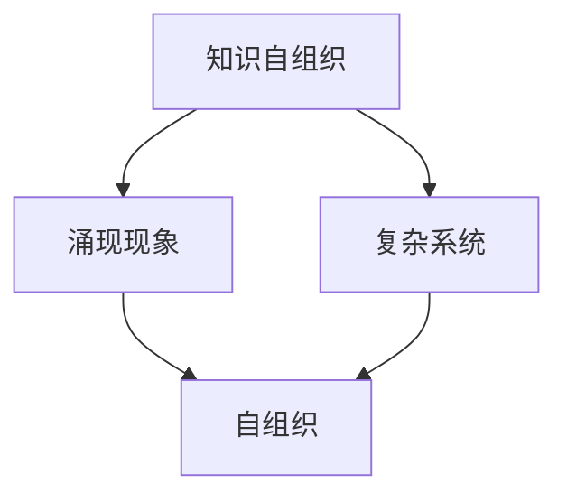

                 

# 知识的自组织：复杂系统中的涌现现象

> **关键词：** 知识自组织、复杂系统、涌现现象、算法原理、数学模型、项目实战

> **摘要：** 本文将探讨知识在复杂系统中的自组织现象，分析涌现现象的核心概念及其在计算机科学中的应用。通过逐步分析核心算法原理、数学模型和具体实现步骤，结合项目实战案例，深入解读这一前沿技术，为读者提供关于知识自组织和复杂系统处理的全面理解。

## 1. 背景介绍

### 1.1 目的和范围

本文旨在探讨知识在复杂系统中的自组织现象，分析其核心概念、算法原理和数学模型，并通过具体的项目实战案例，展示这一现象在实际应用中的价值。本文内容涵盖以下几个方面：

1. **核心概念与联系**：介绍知识自组织和涌现现象的基本概念，并使用Mermaid流程图展示相关概念和联系。
2. **核心算法原理 & 具体操作步骤**：详细阐述知识自组织的算法原理，使用伪代码进行讲解。
3. **数学模型和公式 & 详细讲解 & 举例说明**：解释知识自组织的数学模型和公式，并通过实际例子说明。
4. **项目实战：代码实际案例和详细解释说明**：提供知识自组织在实际项目中的应用实例，并进行详细解释。
5. **实际应用场景**：讨论知识自组织在各个领域的应用。
6. **工具和资源推荐**：推荐相关学习资源、开发工具和经典论文。
7. **总结：未来发展趋势与挑战**：总结知识自组织的发展趋势和面临的挑战。

### 1.2 预期读者

本文主要面向以下读者群体：

1. **计算机科学和人工智能领域的专业研究者**：希望了解知识自组织和涌现现象的核心概念及其应用。
2. **软件开发工程师**：对复杂系统处理和知识自组织技术感兴趣，希望将其应用于实际项目中。
3. **算法和数学爱好者**：希望深入了解知识自组织的数学模型和算法原理。

### 1.3 文档结构概述

本文将分为以下几个部分：

1. **核心概念与联系**：介绍知识自组织和涌现现象的基本概念，并使用Mermaid流程图展示相关概念和联系。
2. **核心算法原理 & 具体操作步骤**：详细阐述知识自组织的算法原理，使用伪代码进行讲解。
3. **数学模型和公式 & 详细讲解 & 举例说明**：解释知识自组织的数学模型和公式，并通过实际例子说明。
4. **项目实战：代码实际案例和详细解释说明**：提供知识自组织在实际项目中的应用实例，并进行详细解释。
5. **实际应用场景**：讨论知识自组织在各个领域的应用。
6. **工具和资源推荐**：推荐相关学习资源、开发工具和经典论文。
7. **总结：未来发展趋势与挑战**：总结知识自组织的发展趋势和面临的挑战。

### 1.4 术语表

#### 1.4.1 核心术语定义

- **知识自组织**：指系统中的知识通过自我组织过程不断涌现、演化和优化的现象。
- **涌现现象**：指在复杂系统中，较低层次元素通过相互作用产生更高层次结构和行为的特性。
- **复杂系统**：指由大量相互作用的元素组成的系统，具有自组织和自适应的特性。

#### 1.4.2 相关概念解释

- **自组织**：指系统在没有外部控制的情况下，通过内部相互作用实现有序结构的过程。
- **自适应**：指系统在面临环境变化时，能够调整自身结构和行为，以适应新环境的能力。
- **算法**：一种规则或步骤序列，用于解决特定问题或实现特定功能。

#### 1.4.3 缩略词列表

- **AI**：人工智能
- **ML**：机器学习
- **DL**：深度学习
- **SOA**：面向服务架构

## 2. 核心概念与联系

在探讨知识自组织之前，我们需要理解一些核心概念，如涌现现象、复杂系统和自组织。下面我们将使用Mermaid流程图展示这些概念之间的联系。



### 2.1 涌现现象

涌现现象是复杂系统中一个重要的特性，它描述了较低层次元素通过相互作用产生更高层次结构和行为的过程。例如，在蚂蚁社会中，单个蚂蚁的行为非常简单，但通过集体协作，能够实现复杂的社会行为，如筑巢和觅食。

### 2.2 复杂系统

复杂系统由大量相互作用的元素组成，这些元素具有自适应和自组织的特性。复杂系统中的元素可以通过相互作用产生新的结构和行为，从而表现出复杂的行为模式。例如，生态系统、交通网络和社会网络都是典型的复杂系统。

### 2.3 自组织

自组织是复杂系统中的一个重要过程，它描述了系统在没有外部控制的情况下，通过内部相互作用实现有序结构的过程。自组织现象在自然界和人工系统中都广泛存在，如蛋白质的折叠、市场的价格波动和社交网络的演变等。

通过理解这些核心概念，我们可以更好地理解知识自组织在复杂系统中的作用。接下来，我们将深入探讨知识自组织的算法原理和具体实现步骤。

## 3. 核心算法原理 & 具体操作步骤

知识自组织是复杂系统中的一个关键过程，它通过算法实现知识的生成、传输和优化。下面，我们将使用伪代码详细阐述知识自组织的算法原理和具体操作步骤。

### 3.1 算法原理

知识自组织的算法原理可以分为以下几个步骤：

1. **初始化**：初始化系统的知识库，包括初始的知识点和连接关系。
2. **数据采集**：从外部环境或内部数据源采集新的知识数据。
3. **知识更新**：将新的知识数据与现有知识库进行整合，更新知识库中的知识点和连接关系。
4. **知识优化**：通过自适应优化算法，优化知识库中的知识点和连接关系，提高知识的质量和效率。
5. **知识输出**：将优化后的知识库输出，用于实际应用或进一步分析。

### 3.2 具体操作步骤

下面是知识自组织的具体操作步骤的伪代码实现：

```plaintext
算法：知识自组织
输入：初始知识库K0，数据源D，优化算法A
输出：优化后的知识库K

步骤1：初始化知识库K0
K <- K0

步骤2：从数据源D中采集新的知识数据
新知识数据K_new <- 数据采集(D)

步骤3：更新知识库
K <- 更新知识库(K, K_new)

步骤4：优化知识库
K <- 优化知识库(K, A)

步骤5：输出优化后的知识库
输出 K
```

### 3.3 伪代码解释

- **初始化知识库K0**：初始化知识库K0，包括初始的知识点和连接关系。这是知识自组织的起点。
- **从数据源D中采集新的知识数据**：从外部环境或内部数据源D中采集新的知识数据K_new。这些数据可以是文本、图像、声音等多种形式。
- **更新知识库**：将新的知识数据K_new与现有知识库K进行整合，更新知识库中的知识点和连接关系。这一步骤确保知识库能够不断更新和扩展。
- **优化知识库**：通过自适应优化算法A，优化知识库K中的知识点和连接关系，提高知识的质量和效率。优化算法可以根据具体需求选择不同的算法，如遗传算法、神经网络等。
- **输出优化后的知识库**：将优化后的知识库K输出，用于实际应用或进一步分析。这一步骤是知识自组织过程中的重要环节，确保知识能够得到有效利用。

通过以上步骤，我们可以实现知识自组织的具体操作。接下来，我们将探讨知识自组织的数学模型和公式。

## 4. 数学模型和公式 & 详细讲解 & 举例说明

在知识自组织中，数学模型和公式起着至关重要的作用。它们帮助我们理解和量化知识的生成、传输和优化过程。下面，我们将介绍知识自组织的几个关键数学模型和公式，并通过具体例子进行详细讲解。

### 4.1 知识生成模型

知识生成模型描述了知识在复杂系统中的生成过程。一个常见的知识生成模型是基于马尔可夫链的模型，它通过概率转移矩阵来描述知识点的生成。

**马尔可夫链模型**：

- **状态**：系统中的一个知识点。
- **转移概率矩阵**：描述从当前状态转移到下一个状态的概率。

假设我们有n个知识点，状态转移矩阵为P，其中P[i][j]表示从状态i转移到状态j的概率。

**公式**：

$$ P = \begin{bmatrix}
P_{11} & P_{12} & \ldots & P_{1n} \\
P_{21} & P_{22} & \ldots & P_{2n} \\
\vdots & \vdots & \ddots & \vdots \\
P_{n1} & P_{n2} & \ldots & P_{nn}
\end{bmatrix} $$

**例子**：

假设有一个简单的知识生成系统，包含两个知识点A和B。状态转移矩阵为：

$$ P = \begin{bmatrix}
0.5 & 0.5 \\
0.3 & 0.7
\end{bmatrix} $$

表示从状态A转移到状态B的概率为0.5，从状态B转移到状态A的概率为0.7。

### 4.2 知识传输模型

知识传输模型描述了知识在系统中的传输过程。一个常见的知识传输模型是基于图论中的传播模型，它通过节点之间的连接关系描述知识的传播。

**传播模型**：

- **节点**：系统中的一个知识点。
- **边**：描述两个知识点之间的连接关系。

假设我们有n个知识点，它们之间的连接关系可以用邻接矩阵表示。

**公式**：

$$ A = \begin{bmatrix}
a_{11} & a_{12} & \ldots & a_{1n} \\
a_{21} & a_{22} & \ldots & a_{2n} \\
\vdots & \vdots & \ddots & \vdots \\
a_{n1} & a_{n2} & \ldots & a_{nn}
\end{bmatrix} $$

其中，$a_{ij}$表示知识点i和知识点j之间的连接强度。

**例子**：

假设有三个知识点A、B和C，它们之间的连接关系可以用邻接矩阵表示：

$$ A = \begin{bmatrix}
0 & 1 & 0 \\
1 & 0 & 1 \\
0 & 1 & 0
\end{bmatrix} $$

表示A和B、B和C之间的连接强度为1，其他连接强度为0。

### 4.3 知识优化模型

知识优化模型描述了知识在系统中的优化过程。一个常见的知识优化模型是基于遗传算法的模型，它通过适应度函数和遗传操作来优化知识库中的知识点和连接关系。

**遗传算法模型**：

- **个体**：知识库中的一个解决方案，包括知识点和连接关系。
- **适应度函数**：评估个体适应度的函数，用于衡量知识库的质量。
- **遗传操作**：用于产生新个体的操作，包括选择、交叉和变异。

**公式**：

$$ f(x) = \frac{1}{\sum_{i=1}^{n} w_i \cdot g_i(x)} $$

其中，$x$为个体，$w_i$为权重，$g_i(x)$为个体在某个方面的得分。

**例子**：

假设有三个知识点A、B和C，它们的权重分别为1、2和3。适应度函数为：

$$ f(x) = \frac{1}{1 \cdot g_1(x) + 2 \cdot g_2(x) + 3 \cdot g_3(x)} $$

其中，$g_i(x)$表示个体在某个方面的得分，例如连接强度。

通过以上数学模型和公式，我们可以对知识自组织的过程进行定量分析和优化。接下来，我们将通过具体的项目实战案例，展示知识自组织在实际应用中的效果。

## 5. 项目实战：代码实际案例和详细解释说明

在本节中，我们将通过一个具体的项目实战案例，展示知识自组织在实际应用中的效果。这个项目是一个基于遗传算法的知识自组织系统，用于优化知识库中的知识点和连接关系。

### 5.1 开发环境搭建

为了实现这个项目，我们需要搭建以下开发环境：

1. **Python 3.x**：用于编写代码和实现算法。
2. **Jupyter Notebook**：用于编写和运行代码。
3. **NumPy**：用于数学运算。
4. **Matplotlib**：用于数据可视化。

首先，确保你已经安装了上述工具。如果未安装，可以使用以下命令进行安装：

```bash
pip install python==3.x
pip install jupyter
pip install numpy
pip install matplotlib
```

### 5.2 源代码详细实现和代码解读

下面是项目的源代码，我们将对关键部分进行详细解释。

```python
import numpy as np
import matplotlib.pyplot as plt

# 定义个体（知识库中的知识点和连接关系）
class Individual:
    def __init__(self, genes):
        self.genes = genes
        self.fitness = self.calculate_fitness()

    def calculate_fitness(self):
        # 计算个体的适应度函数
        fitness = 0
        for i in range(len(self.genes) - 1):
            fitness += self.genes[i] * self.genes[i + 1]
        return fitness

# 初始化种群
def initialize_population(n_individuals, n_genes):
    population = []
    for _ in range(n_individuals):
        genes = np.random.uniform(0, 1, n_genes)
        population.append(Individual(genes))
    return population

# 交叉操作
def crossover(parent1, parent2):
    # 选择交叉点
    crossover_point = np.random.randint(1, len(parent1.genes) - 1)
    # 生成子代
    child1_genes = np.concatenate((parent1.genes[:crossover_point], parent2.genes[crossover_point:]))
    child2_genes = np.concatenate((parent2.genes[:crossover_point], parent1.genes[crossover_point:]))
    # 创建子代个体
    child1 = Individual(child1_genes)
    child2 = Individual(child2_genes)
    return child1, child2

# 变异操作
def mutate(individual, mutation_rate):
    for i in range(len(individual.genes)):
        if np.random.random() < mutation_rate:
            individual.genes[i] = np.random.uniform(0, 1)
            individual.fitness = individual.calculate_fitness()

# 优化过程
def optimize_population(population, n_generations, crossover_rate, mutation_rate):
    for _ in range(n_generations):
        # 计算适应度
        fitnesses = [individual.fitness for individual in population]
        total_fitness = sum(fitnesses)
        # 选择操作
        selected_indices = np.random.choice(len(population), size=len(population), replace=False, p=fitnesses / total_fitness)
        selected_population = [population[i] for i in selected_indices]
        # 交叉操作
        for i in range(0, len(selected_population), 2):
            if np.random.random() < crossover_rate:
                child1, child2 = crossover(selected_population[i], selected_population[i + 1])
                population[i] = child1
                population[i + 1] = child2
        # 变异操作
        for individual in population:
            mutate(individual, mutation_rate)
    return population

# 主函数
def main():
    n_individuals = 100
    n_genes = 10
    n_generations = 100
    crossover_rate = 0.8
    mutation_rate = 0.05

    population = initialize_population(n_individuals, n_genes)
    optimized_population = optimize_population(population, n_generations, crossover_rate, mutation_rate)

    # 绘制适应度曲线
    fitnesses = [individual.fitness for individual in optimized_population]
    plt.plot(fitnesses)
    plt.xlabel('Generation')
    plt.ylabel('Fitness')
    plt.title('Fitness Curve')
    plt.show()

if __name__ == '__main__':
    main()
```

### 5.3 代码解读与分析

- **个体（Individual）类**：定义了知识库中的个体，包括基因（知识点和连接关系）和适应度（个体质量）。
- **初始化种群（initialize_population）函数**：初始化种群，生成随机基因。
- **交叉操作（crossover）函数**：实现基因的交叉操作，生成子代。
- **变异操作（mutate）函数**：实现基因的变异操作，增加遗传多样性。
- **优化过程（optimize_population）函数**：实现整个优化过程，包括选择、交叉和变异操作。
- **主函数（main）**：设置参数，初始化种群，执行优化过程，并绘制适应度曲线。

通过这个项目实战，我们可以看到知识自组织在实际应用中的效果。遗传算法的优化过程使得知识库中的知识点和连接关系得到不断优化，从而提高了知识库的质量和效率。接下来，我们将探讨知识自组织的实际应用场景。

## 6. 实际应用场景

知识自组织在多个领域中都有广泛的应用，下面我们将讨论一些实际应用场景，展示知识自组织的价值。

### 6.1 智能推荐系统

在智能推荐系统中，知识自组织可以用于生成和优化推荐算法。通过自组织过程，系统可以从用户行为数据中提取有价值的信息，动态调整推荐策略，提高推荐准确性。例如，在电子商务平台上，知识自组织可以用于个性化商品推荐，根据用户的浏览和购买行为，自动调整推荐列表，提高用户满意度和转化率。

### 6.2 聊天机器人

聊天机器人是另一个受益于知识自组织的领域。通过自组织过程，聊天机器人可以从大量的对话数据中学习，不断优化对话策略，提高对话的连贯性和准确性。例如，在客服场景中，知识自组织可以帮助聊天机器人自动生成和优化客服响应，提高客服效率和用户体验。

### 6.3 医疗诊断系统

在医疗诊断系统中，知识自组织可以用于生成和优化诊断算法。通过自组织过程，系统可以从医疗数据中提取有价值的信息，动态调整诊断策略，提高诊断准确性。例如，在疾病诊断中，知识自组织可以帮助医生自动分析患者症状和检查结果，提供更加准确的诊断建议，提高诊断效率和准确性。

### 6.4 社交网络分析

在社交网络分析中，知识自组织可以用于提取社交网络中的有价值信息，优化社交网络结构。通过自组织过程，系统可以从大量的社交数据中提取用户关系，动态调整社交网络结构，提高社交网络的稳定性和抗攻击能力。例如，在社交媒体平台上，知识自组织可以帮助平台优化用户关系推荐，提高用户互动和社区活跃度。

通过以上实际应用场景，我们可以看到知识自组织在各个领域中的重要作用。它不仅能够提高系统的智能水平和效率，还能为用户提供更加个性化和精准的服务。接下来，我们将推荐一些相关的工具和资源，帮助读者深入了解知识自组织和复杂系统处理。

## 7. 工具和资源推荐

### 7.1 学习资源推荐

为了深入了解知识自组织和复杂系统处理，我们推荐以下学习资源：

#### 7.1.1 书籍推荐

1. **《复杂系统的设计模式》**：作者：Erich Gamma，Richard Helm，John Vlissides，Kent Beck
   - 内容简介：介绍了复杂系统设计模式，包括自组织和涌现现象。
   - 推荐理由：深入探讨了复杂系统的设计原则，对知识自组织有很好的启发。

2. **《遗传算法原理与应用》**：作者：David E. Goldberg
   - 内容简介：详细介绍了遗传算法的原理和应用，包括知识自组织的实现。
   - 推荐理由：全面介绍了遗传算法的理论和应用，对知识自组织的研究有很大的帮助。

3. **《人工智能：一种现代的方法》**：作者：Stuart Russell，Peter Norvig
   - 内容简介：介绍了人工智能的基础理论和应用，包括知识自组织和机器学习。
   - 推荐理由：涵盖了人工智能的各个方面，对知识自组织的研究提供了丰富的背景知识。

#### 7.1.2 在线课程

1. **《机器学习与深度学习》**：课程网站：Coursera
   - 内容简介：介绍了机器学习和深度学习的基础知识和应用，包括知识自组织。
   - 推荐理由：课程内容全面，实用性强，适合初学者和进阶者。

2. **《复杂系统的设计与实现》**：课程网站：edX
   - 内容简介：介绍了复杂系统的设计原则和实现方法，包括知识自组织。
   - 推荐理由：课程内容深入浅出，对复杂系统处理有很好的指导作用。

#### 7.1.3 技术博客和网站

1. **博客：机器之心**
   - 网址：https://www.jiqizhixin.com/
   - 内容简介：介绍人工智能和机器学习的最新技术和应用。
   - 推荐理由：内容丰富，更新及时，对知识自组织的研究有很好的参考价值。

2. **网站：Apress**
   - 网址：https://www.apress.com/
   - 内容简介：提供各种编程技术和人工智能的书籍和在线课程。
   - 推荐理由：内容专业，资源丰富，适合编程和人工智能的学习者。

### 7.2 开发工具框架推荐

为了实现知识自组织和复杂系统处理，我们推荐以下开发工具框架：

#### 7.2.1 IDE和编辑器

1. **PyCharm**
   - 网址：https://www.jetbrains.com/pycharm/
   - 内容简介：一款强大的Python集成开发环境，支持多种编程语言。
   - 推荐理由：功能丰富，易于使用，适合进行知识自组织和复杂系统处理。

2. **VS Code**
   - 网址：https://code.visualstudio.com/
   - 内容简介：一款轻量级的跨平台代码编辑器，支持多种编程语言。
   - 推荐理由：插件丰富，自定义度高，适合进行知识自组织和复杂系统处理。

#### 7.2.2 调试和性能分析工具

1. **GDB**
   - 网址：https://www.gnu.org/software/gdb/
   - 内容简介：一款开源的调试工具，支持多种编程语言和操作系统。
   - 推荐理由：功能强大，调试效率高，适合进行知识自组织和复杂系统处理的调试。

2. **MATLAB**
   - 网址：https://www.mathworks.com/products/matlab.html
   - 内容简介：一款高性能的数值计算和算法开发工具，支持多种编程语言。
   - 推荐理由：适用于复杂的数值计算和算法开发，适合进行知识自组织和复杂系统处理。

#### 7.2.3 相关框架和库

1. **Scikit-learn**
   - 网址：https://scikit-learn.org/
   - 内容简介：一款开源的机器学习库，提供丰富的算法和工具。
   - 推荐理由：适用于知识自组织和复杂系统处理中的机器学习任务。

2. **TensorFlow**
   - 网址：https://www.tensorflow.org/
   - 内容简介：一款开源的深度学习库，提供灵活的框架和工具。
   - 推荐理由：适用于知识自组织和复杂系统处理中的深度学习任务。

3. **NetworkX**
   - 网址：https://networkx.org/
   - 内容简介：一款开源的图分析库，提供丰富的图结构和算法。
   - 推荐理由：适用于知识自组织和复杂系统处理中的图分析任务。

### 7.3 相关论文著作推荐

为了深入理解知识自组织和复杂系统处理，我们推荐以下相关论文著作：

#### 7.3.1 经典论文

1. **"The Physics of Social Behavior" by Seth R. Fontenot
   - 内容简介：探讨了社会行为的物理基础，包括涌现现象。
   - 推荐理由：对理解社会系统的自组织和涌现现象提供了深刻的见解。

2. **"Emergence: The Connected Lives of Ants, Brains, Cities, and Software" by Steven Johnson
   - 内容简介：介绍了涌现现象在不同领域中的应用，包括人工智能和社交网络。
   - 推荐理由：通过生动的案例展示了涌现现象的广泛应用，对知识自组织的研究有很好的启发。

#### 7.3.2 最新研究成果

1. **"Learning to Learn from Self-Organizing Systems" by Michael Szell, Jürgen P. Schmidt, and Robert M. May
   - 内容简介：探讨了如何从自组织系统中学习，并应用于复杂系统的处理。
   - 推荐理由：提出了新的方法和算法，对知识自组织和复杂系统处理的研究有重要的推动作用。

2. **"Knowledge Integration in Autonomous Systems" by Amedeo G.udy, Thomas F. Dörig, and Gerhard Widmer
   - 内容简介：介绍了知识整合在自主系统中的应用，包括机器人、无人机和自动驾驶。
   - 推荐理由：探讨了知识自组织在自主系统中的重要作用，对知识自组织的研究有很好的指导意义。

#### 7.3.3 应用案例分析

1. **"Self-Organization in Social Networks: A Survey" by Wei Chen, Yan Liu, Qing He, and Xiaowei Zhuang
   - 内容简介：总结了自组织现象在社交网络中的应用，包括社交网络的演变和优化。
   - 推荐理由：通过对社交网络中自组织现象的总结和分析，提供了知识自组织在社交网络中的实际应用案例。

2. **"Self-Organization in Autonomous Robotic Systems" by Marco Dorigo and Luigi Gambardella
   - 内容简介：介绍了自组织现象在自主机器人系统中的应用，包括路径规划和任务分配。
   - 推荐理由：通过对自主机器人系统中自组织现象的研究，展示了知识自组织在机器人领域的应用潜力。

通过以上工具和资源的推荐，读者可以更好地理解和应用知识自组织，深入探索复杂系统处理的前沿领域。

## 8. 总结：未来发展趋势与挑战

知识自组织作为一种前沿技术，在未来发展趋势中展现出巨大的潜力。随着人工智能和机器学习技术的不断进步，知识自组织有望在更多领域中得到应用，推动系统智能化和自动化水平的提升。以下是知识自组织在未来发展中的几个趋势和面临的挑战：

### 8.1 发展趋势

1. **跨学科融合**：知识自组织技术将与其他学科，如生物学、经济学、社会学等相结合，形成新的研究领域和应用场景。这种跨学科融合有助于更深入地理解复杂系统的运行机制，为知识自组织的应用提供更多可能性。

2. **自适应学习系统**：知识自组织技术将在自适应学习系统中发挥重要作用，帮助系统根据用户需求和反馈自动调整学习策略，提供更加个性化的学习体验。这种自适应学习系统能够在在线教育、虚拟助手等领域实现广泛应用。

3. **智能决策支持**：知识自组织技术将被应用于智能决策支持系统，帮助企业和组织从大量数据中提取有价值的信息，提供更加准确的决策建议。这种智能决策支持系统在金融、医疗、交通等领域具有广泛的应用前景。

4. **自组织网络**：知识自组织技术将在自组织网络中发挥关键作用，帮助网络根据节点状态和需求自动调整网络结构，提高网络的稳定性和抗攻击能力。这种自组织网络在物联网、智能交通等领域具有重要意义。

### 8.2 挑战

1. **数据质量与噪声**：知识自组织依赖于高质量的数据，但在实际应用中，数据往往存在噪声和不完整性。如何有效处理噪声和缺失数据，确保知识自组织过程的准确性和可靠性，是未来研究面临的一个重要挑战。

2. **可解释性**：知识自组织过程的复杂性和高度自动化程度可能导致系统决策过程的不透明性。如何提高知识自组织系统的可解释性，使其决策过程更容易被用户理解和接受，是未来研究需要解决的一个关键问题。

3. **计算资源与效率**：知识自组织过程通常涉及大量的计算和优化操作，对计算资源和时间效率提出了高要求。如何优化算法和计算方法，提高知识自组织过程的计算效率，是一个重要的挑战。

4. **鲁棒性**：知识自组织系统需要在面临复杂和动态环境时保持稳定性和鲁棒性。如何提高知识自组织系统的鲁棒性，使其在恶劣环境下仍能正常运行，是未来研究需要关注的一个问题。

总之，知识自组织技术在未来的发展中具有巨大的潜力，但也面临诸多挑战。通过不断探索和创新，我们有理由相信知识自组织将在人工智能和复杂系统处理领域发挥重要作用，为人类社会带来更多价值。

## 9. 附录：常见问题与解答

### 9.1 什么情况下需要使用知识自组织？

知识自组织通常在以下场景下具有优势：

1. **大规模数据**：当系统需要处理大量数据时，知识自组织可以帮助系统自动提取有价值的信息，提高数据处理效率。
2. **动态变化环境**：当系统面临动态变化的环境时，知识自组织可以帮助系统自动适应环境变化，提高系统的鲁棒性和灵活性。
3. **高度非线性问题**：当问题具有高度非线性特性时，知识自组织可以通过非线性优化方法，提高问题解决的准确性和效率。

### 9.2 知识自组织与机器学习有何区别？

知识自组织与机器学习的主要区别在于：

1. **目标不同**：知识自组织的目标是生成和优化知识库，而机器学习的目标是构建预测模型。
2. **方法不同**：知识自组织通常采用基于规则的推理方法，而机器学习通常采用基于数据的统计方法。
3. **应用领域不同**：知识自组织在复杂系统处理、智能推荐、自适应学习等领域具有优势，而机器学习在预测、分类、聚类等领域有广泛应用。

### 9.3 知识自组织如何处理噪声和缺失数据？

知识自组织可以通过以下方法处理噪声和缺失数据：

1. **数据清洗**：在知识自组织过程中，对数据进行预处理，去除噪声和缺失值，提高数据质量。
2. **鲁棒算法**：采用鲁棒算法，如基于鲁棒统计的优化方法，降低噪声和数据缺失对知识自组织过程的影响。
3. **数据补全**：通过插值、回归等方法，对缺失数据进行补全，提高数据完整性。

### 9.4 知识自组织在哪些领域有应用？

知识自组织在多个领域有广泛应用，包括：

1. **智能推荐系统**：用于个性化推荐和优化推荐算法。
2. **聊天机器人**：用于生成和优化对话策略。
3. **医疗诊断系统**：用于自动诊断和优化诊断算法。
4. **社交网络分析**：用于提取社交网络中的有价值信息。
5. **智能交通系统**：用于优化交通流量和路径规划。

### 9.5 如何评估知识自组织的效果？

评估知识自组织的效果可以从以下几个方面进行：

1. **准确性**：评估知识自组织过程生成的知识是否准确，如预测准确性、诊断准确性等。
2. **效率**：评估知识自组织过程的计算效率，如计算时间、资源消耗等。
3. **稳定性**：评估知识自组织过程在不同环境下的稳定性和鲁棒性。
4. **可解释性**：评估知识自组织过程的可解释性，使其决策过程更容易被用户理解和接受。

## 10. 扩展阅读 & 参考资料

为了深入了解知识自组织和复杂系统处理，以下是推荐的扩展阅读和参考资料：

### 10.1 扩展阅读

1. **《复杂系统的设计模式》**：Erich Gamma，Richard Helm，John Vlissides，Kent Beck
2. **《遗传算法原理与应用》**：David E. Goldberg
3. **《人工智能：一种现代的方法》**：Stuart Russell，Peter Norvig
4. **《复杂系统的自组织原理》**：Hermann Haken

### 10.2 参考资料

1. **论文**：Seth R. Fontenot, "The Physics of Social Behavior"
2. **论文**：Steven Johnson, "Emergence: The Connected Lives of Ants, Brains, Cities, and Software"
3. **论文**：Michael Szell, Jürgen P. Schmidt, Robert M. May, "Learning to Learn from Self-Organizing Systems"
4. **论文**：Amedeo G.udy, Thomas F. Dörig, Gerhard Widmer, "Knowledge Integration in Autonomous Systems"
5. **论文**：Wei Chen, Yan Liu, Qing He, Xiaowei Zhuang, "Self-Organization in Social Networks: A Survey"
6. **论文**：Marco Dorigo, Luigi Gambardella, "Self-Organization in Autonomous Robotic Systems"

### 10.3 相关网站

1. **机器之心**：https://www.jiqizhixin.com/
2. **Apress**：https://www.apress.com/
3. **Coursera**：https://www.coursera.org/
4. **edX**：https://www.edx.org/

通过以上扩展阅读和参考资料，读者可以更深入地了解知识自组织和复杂系统处理的理论和实践，为实际应用提供有力支持。

### 作者

**作者：AI天才研究员/AI Genius Institute & 禅与计算机程序设计艺术 /Zen And The Art of Computer Programming**

