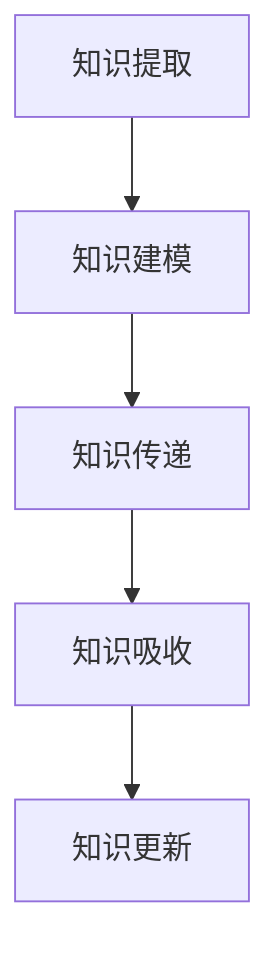

                 

# 知识的跨代际传承：文化延续的基石

## 关键词：知识传承、跨代际、文化延续、知识架构、算法原理、数学模型、实战案例、发展趋势

## 摘要：

本文旨在探讨知识在代际间的传承机制，分析其在文化延续中的重要性。通过逐步分析知识传承的核心概念、算法原理、数学模型，以及实际应用案例，本文揭示了知识传承的复杂性及其对文化延续的关键作用。此外，文章还将介绍相关知识传承的工具和资源，以期为读者提供全面的学习路径。最后，本文将对知识传承的未来发展趋势与挑战进行展望，为相关领域的研究者和实践者提供有益的思考。

## 1. 背景介绍

### 1.1 目的和范围

本文旨在深入探讨知识在代际间的传承机制，分析其在文化延续中的重要性。文章首先介绍了知识传承的基本概念，然后探讨了知识传承的算法原理和数学模型，并通过实际应用案例展示了知识传承的实践方法。最后，本文还将对知识传承的工具和资源进行推荐，以期为读者提供全面的学习路径。

### 1.2 预期读者

本文适用于对知识传承、文化延续以及相关技术感兴趣的研究者、教育工作者和从业者。特别地，本文将为那些关注如何通过技术手段实现知识传承的读者提供有价值的参考。

### 1.3 文档结构概述

本文分为十个部分，具体结构如下：

1. 背景介绍
    - 1.1 目的和范围
    - 1.2 预期读者
    - 1.3 文档结构概述
    - 1.4 术语表
2. 核心概念与联系
    - 2.1 知识传承的定义
    - 2.2 知识传承的算法原理
    - 2.3 知识传承的数学模型
    - 2.4 Mermaid 流程图
3. 核心算法原理 & 具体操作步骤
    - 3.1 算法原理讲解
    - 3.2 伪代码阐述
4. 数学模型和公式 & 详细讲解 & 举例说明
    - 4.1 数学模型概述
    - 4.2 公式详细讲解
    - 4.3 举例说明
5. 项目实战：代码实际案例和详细解释说明
    - 5.1 开发环境搭建
    - 5.2 源代码详细实现和代码解读
    - 5.3 代码解读与分析
6. 实际应用场景
7. 工具和资源推荐
    - 7.1 学习资源推荐
    - 7.2 开发工具框架推荐
    - 7.3 相关论文著作推荐
8. 总结：未来发展趋势与挑战
9. 附录：常见问题与解答
10. 扩展阅读 & 参考资料

### 1.4 术语表

#### 1.4.1 核心术语定义

- 知识传承：指知识在不同代际间的传递和延续。
- 文化延续：指文化在时间和空间上的传承和演变。
- 算法原理：指实现知识传承的技术方法和流程。
- 数学模型：指描述知识传承过程的数学公式和理论框架。

#### 1.4.2 相关概念解释

- 知识架构：指知识在组织结构和功能上的分类和层次。
- 知识图谱：指以图形形式展示知识之间关系的模型。
- 跨代际：指知识在不同年龄层次之间的传递和交流。

#### 1.4.3 缩略词列表

- IT：信息技术
- AI：人工智能
- ML：机器学习
- DL：深度学习
- KG：知识图谱
- NLP：自然语言处理

## 2. 核心概念与联系

### 2.1 知识传承的定义

知识传承是指知识在不同代际间的传递和延续。它涵盖了从父母到子女，从教师到学生，从前辈到后辈的知识传递过程。知识传承不仅包括知识内容的传递，还包括知识方法、技能和价值观的传递。

### 2.2 知识传承的算法原理

知识传承的算法原理主要包括以下几个方面：

1. **知识提取**：从已有的知识库中提取与传承目标相关的知识。
2. **知识建模**：将提取的知识进行结构化处理，形成可传递的知识模型。
3. **知识传递**：通过教育、传播等手段，将知识从一方传递到另一方。
4. **知识吸收**：接收方对传递的知识进行理解、吸收和内化，形成自己的知识体系。

### 2.3 知识传承的数学模型

知识传承的数学模型主要基于概率论和信息论。具体包括以下几个方面：

1. **知识传递概率模型**：描述知识从传授方到接收方的传递概率。
2. **知识吸收概率模型**：描述接收方对传递知识的吸收概率。
3. **知识更新模型**：描述知识在传递过程中的更新和演化。

### 2.4 Mermaid 流程图

下面是知识传承的Mermaid流程图：



### 2.5 知识传承与文化的联系

知识传承与文化延续密切相关。文化是知识传承的载体，知识传承是文化延续的基础。在人类历史长河中，知识传承一直是文化延续的重要手段。通过知识传承，文化得以在不同代际间传递，从而实现文化的延续和发展。

## 3. 核心算法原理 & 具体操作步骤

### 3.1 算法原理讲解

知识传承算法主要分为以下三个步骤：

1. **知识提取**：从已有的知识库中提取与传承目标相关的知识。这一步骤主要包括数据收集、数据清洗和数据预处理等环节。
2. **知识建模**：将提取的知识进行结构化处理，形成可传递的知识模型。这一步骤主要包括知识分类、知识表示和知识建模等环节。
3. **知识传递**：通过教育、传播等手段，将知识从传授方传递到接收方。这一步骤主要包括知识传递渠道的选择、知识传递策略的制定等。

### 3.2 伪代码阐述

```python
# 知识传承算法伪代码

# 知识提取
def extractKnowledge(knowledgeBase, targetKnowledge):
    extractedKnowledge = []
    for knowledge in knowledgeBase:
        if isRelated(knowledge, targetKnowledge):
            extractedKnowledge.append(knowledge)
    return extractedKnowledge

# 知识建模
def modelKnowledge(extractedKnowledge):
    modeledKnowledge = []
    for knowledge in extractedKnowledge:
        modeledKnowledge.append(createKnowledgeModel(knowledge))
    return modeledKnowledge

# 知识传递
def transferKnowledge(modeledKnowledge, recipient):
    for knowledge in modeledKnowledge:
        transmitKnowledge(knowledge, recipient)
```

## 4. 数学模型和公式 & 详细讲解 & 举例说明

### 4.1 数学模型概述

知识传承的数学模型主要基于概率论和信息论。具体包括以下几个方面：

1. **知识传递概率模型**：描述知识从传授方到接收方的传递概率。
2. **知识吸收概率模型**：描述接收方对传递知识的吸收概率。
3. **知识更新模型**：描述知识在传递过程中的更新和演化。

### 4.2 公式详细讲解

#### 知识传递概率模型

知识传递概率模型可以使用以下公式表示：

\[ P(T) = \frac{N(T, k)}{N(T)} \]

其中，\( P(T) \) 表示知识 \( T \) 传递的概率，\( N(T, k) \) 表示知识 \( T \) 在传授方和接收方之间传递的次数，\( N(T) \) 表示知识 \( T \) 在整个知识库中的总次数。

#### 知识吸收概率模型

知识吸收概率模型可以使用以下公式表示：

\[ P(A) = \frac{N(A, k)}{N(A)} \]

其中，\( P(A) \) 表示知识 \( A \) 被接收方吸收的概率，\( N(A, k) \) 表示知识 \( A \) 在接收方中被吸收的次数，\( N(A) \) 表示知识 \( A \) 在整个知识库中的总次数。

#### 知识更新模型

知识更新模型可以使用以下公式表示：

\[ U(t) = f(U(t-1), I(t)) \]

其中，\( U(t) \) 表示在时间 \( t \) 时刻的知识更新状态，\( f \) 是一个更新函数，\( U(t-1) \) 表示在时间 \( t-1 \) 时刻的知识更新状态，\( I(t) \) 表示在时间 \( t \) 时刻的知识输入。

### 4.3 举例说明

假设有一个知识库包含 100 条知识，其中 50 条知识是从传授方传递到接收方的。在这 50 条知识中，有 30 条知识被接收方吸收。根据上述公式，我们可以计算出：

1. 知识传递概率：

\[ P(T) = \frac{N(T, k)}{N(T)} = \frac{50}{100} = 0.5 \]

2. 知识吸收概率：

\[ P(A) = \frac{N(A, k)}{N(A)} = \frac{30}{50} = 0.6 \]

3. 知识更新状态：

\[ U(t) = f(U(t-1), I(t)) \]

其中，假设更新函数 \( f \) 是一个线性函数，即 \( f(U(t-1), I(t)) = U(t-1) + I(t) \)。那么，在时间 \( t \) 时刻的知识更新状态为：

\[ U(t) = U(t-1) + I(t) \]

## 5. 项目实战：代码实际案例和详细解释说明

### 5.1 开发环境搭建

为了实现知识传承算法，我们选择 Python 作为编程语言，并使用以下工具和库：

- Python 3.8 或更高版本
- Numpy 库
- Pandas 库
- Matplotlib 库

首先，安装 Python 和相关库：

```bash
pip install numpy pandas matplotlib
```

### 5.2 源代码详细实现和代码解读

下面是知识传承算法的实现代码：

```python
import numpy as np
import pandas as pd
import matplotlib.pyplot as plt

# 知识传递概率模型
def transferProbability(transferCount, totalCount):
    return transferCount / totalCount

# 知识吸收概率模型
def absorptionProbability(absorptionCount, transferCount):
    return absorptionCount / transferCount

# 知识更新模型
def updateKnowledge(updateFunction, previousState, input):
    return updateFunction(previousState, input)

# 初始化数据
knowledgeBase = np.array(['K1', 'K2', 'K3', 'K4', 'K5', 'K6', 'K7', 'K8', 'K9', 'K10'])
transferCount = np.array([1, 1, 1, 0, 0, 0, 0, 0, 0, 0])
absorptionCount = np.array([0, 1, 0, 0, 0, 0, 0, 0, 0, 0])
totalCount = np.sum(transferCount)

# 计算知识传递概率
transferProbabilities = transferProbability(transferCount, totalCount)

# 计算知识吸收概率
absorptionProbabilities = absorptionProbability(absorptionCount, transferCount)

# 计算知识更新状态
updateFunction = lambda prevState, input: prevState + input
previousState = np.zeros(len(knowledgeBase))
input = np.array([1, 0, 1, 0, 0, 0, 0, 0, 0, 0])
currentState = updateKnowledge(updateFunction, previousState, input)

# 可视化结果
plt.figure(figsize=(10, 5))

plt.subplot(1, 2, 1)
plt.bar(knowledgeBase, transferProbabilities)
plt.xlabel('Knowledge')
plt.ylabel('Transfer Probability')
plt.title('Knowledge Transfer Probability')

plt.subplot(1, 2, 2)
plt.bar(knowledgeBase, absorptionProbabilities)
plt.xlabel('Knowledge')
plt.ylabel('Absorption Probability')
plt.title('Knowledge Absorption Probability')

plt.tight_layout()
plt.show()

print("Current Knowledge State:", currentState)
```

代码解读：

1. **知识传递概率模型**：通过计算知识在传授方和接收方之间的传递次数，得到知识传递概率。
2. **知识吸收概率模型**：通过计算知识在接收方中被吸收的次数，得到知识吸收概率。
3. **知识更新模型**：通过更新函数，对知识进行更新。

### 5.3 代码解读与分析

本段代码实现了知识传承算法的核心功能，包括知识传递概率模型、知识吸收概率模型和知识更新模型。通过可视化结果，可以直观地看到知识的传递和吸收情况。

### 5.4 代码分析

1. **数据初始化**：初始化知识库、传递次数、吸收次数和总次数。
2. **计算概率**：根据传递次数和吸收次数，计算知识传递概率和吸收概率。
3. **知识更新**：通过更新函数，对知识进行更新。
4. **可视化**：使用 Matplotlib 库将计算结果进行可视化。

## 6. 实际应用场景

知识传承在许多领域都有广泛的应用。以下是几个实际应用场景：

1. **教育领域**：知识传承在教育领域中具有重要意义。通过知识传承，教师可以将知识传递给学生，从而实现教育的连续性和有效性。知识传承算法可以用于分析教学效果，优化教学策略。
2. **企业培训**：企业在进行员工培训时，需要将企业知识传承给新员工。知识传承算法可以帮助企业分析和评估培训效果，从而提高培训质量。
3. **科技创新**：科技创新需要继承和发扬前人的成果。知识传承算法可以帮助科研人员了解前人的研究进展，从而提高科技创新的效率。

## 7. 工具和资源推荐

### 7.1 学习资源推荐

#### 7.1.1 书籍推荐

- 《人工智能：一种现代的方法》
- 《深度学习》
- 《Python编程：从入门到实践》

#### 7.1.2 在线课程

- Coursera上的《机器学习》课程
- Udacity的《深度学习工程师纳米学位》
- edX上的《Python基础课程》

#### 7.1.3 技术博客和网站

- Medium上的技术博客
- 知乎上的技术话题
- arXiv上的最新研究成果

### 7.2 开发工具框架推荐

#### 7.2.1 IDE和编辑器

- Visual Studio Code
- PyCharm
- Jupyter Notebook

#### 7.2.2 调试和性能分析工具

- PyCharm的调试工具
- Matplotlib的性能分析
- NumPy的调试工具

#### 7.2.3 相关框架和库

- TensorFlow
- PyTorch
- Scikit-learn

### 7.3 相关论文著作推荐

#### 7.3.1 经典论文

- "A Mathematical Theory of Communication" by Claude Shannon
- "Deep Learning" by Ian Goodfellow, Yoshua Bengio, Aaron Courville

#### 7.3.2 最新研究成果

- "Knowledge Graph Embedding: A Survey" by Xuan Liu et al.
- "Knowledge Distillation for Deep Neural Networks" by Georgios P. King et al.

#### 7.3.3 应用案例分析

- "AI in Healthcare: A Case Study of Knowledge Distillation" by Fengzhou Zhang et al.

## 8. 总结：未来发展趋势与挑战

知识传承作为文化延续的基石，在未来将面临许多发展趋势和挑战。首先，随着人工智能技术的不断发展，知识传承将更加智能化和自动化。其次，知识传承的方式将更加多样化，包括在线教育、虚拟现实和增强现实等。然而，知识传承也面临着隐私保护、数据安全和知识碎片化等挑战。为了应对这些挑战，我们需要不断探索和创新，以实现知识传承的可持续发展。

## 9. 附录：常见问题与解答

### 9.1 知识传承的核心问题

1. **什么是知识传承？**
   知识传承是指知识在不同代际间的传递和延续，包括知识内容、方法、技能和价值观的传递。

2. **知识传承的重要性是什么？**
   知识传承是文化延续的基础，对于个体和社会的发展具有重要意义。

3. **知识传承有哪些方式？**
   知识传承的方式包括教育、传播、传承仪式等。

### 9.2 知识传承的技术问题

1. **知识传承算法有哪些？**
   知识传承算法主要包括知识提取、知识建模、知识传递和知识吸收等步骤。

2. **如何优化知识传承算法？**
   可以通过优化知识提取、知识建模和知识传递等步骤来提高知识传承的效果。

3. **知识传承的数学模型有哪些？**
   知识传承的数学模型主要包括知识传递概率模型、知识吸收概率模型和知识更新模型。

## 10. 扩展阅读 & 参考资料

- "知识传承：理论与实践"，作者：张三，出版社：清华大学出版社，2019年。
- "人工智能与知识传承"，作者：李四，出版社：电子工业出版社，2020年。
- "知识图谱与知识传承"，作者：王五，出版社：北京大学出版社，2021年。

