                 

# 知识的跨代际传递：教育的核心使命

> 关键词：知识传递、教育、跨代际、核心使命、人工智能、认知科学、知识图谱

> 摘要：本文旨在探讨教育的核心使命——知识的跨代际传递。通过结合人工智能、认知科学等领域的前沿理论，本文分析了知识传递的机制与挑战，并提出了相应的解决方案。文章首先介绍了教育的本质和重要性，然后深入探讨了知识传递的复杂过程及其在现代社会中的关键作用。接着，本文从技术角度探讨了如何利用人工智能和认知科学的方法提升知识传递的效率，并通过实际案例展示了这一技术的应用。最后，本文总结了知识传递对未来的影响，并提出了教育领域的发展趋势和挑战。

## 1. 背景介绍

### 1.1 目的和范围

本文的目标是深入探讨教育的核心使命——知识的跨代际传递。知识的传递不仅涉及到个体的发展和成长，更是社会进步的重要推动力。随着人工智能和认知科学的快速发展，传统的教育模式面临着巨大的挑战和变革。本文将结合这些前沿理论，分析知识传递的机制与挑战，并探讨如何利用技术手段提升知识传递的效率。

本文的范围主要包括以下几个方面：

1. 教育的本质和重要性
2. 知识传递的机制与挑战
3. 利用人工智能和认知科学的方法提升知识传递的效率
4. 知识传递对未来的影响和挑战

### 1.2 预期读者

本文的预期读者包括：

1. 教育工作者，包括教师、教育管理者等，希望了解教育领域的新趋势和前沿理论。
2. 人工智能和认知科学领域的科研人员，希望了解知识传递技术在教育和认知科学中的应用。
3. 广大对教育和技术结合感兴趣的读者，希望了解知识传递技术的实际应用和未来发展趋势。

### 1.3 文档结构概述

本文分为以下十个部分：

1. 引言
2. 教育的本质和重要性
3. 知识传递的机制与挑战
4. 利用人工智能和认知科学的方法提升知识传递的效率
5. 知识传递对未来的影响和挑战
6. 实际应用案例
7. 工具和资源推荐
8. 总结：未来发展趋势与挑战
9. 附录：常见问题与解答
10. 扩展阅读与参考资料

### 1.4 术语表

#### 1.4.1 核心术语定义

- 教育的本质：教育是指通过特定的方法和途径，使个体获得知识、技能和价值观的过程。
- 知识传递：知识传递是指知识在不同代际、不同个体之间进行传递的过程。
- 人工智能：人工智能是指通过计算机模拟人类智能行为的技术和科学。
- 认知科学：认知科学是研究人类思维、感知、记忆等认知过程的学科。

#### 1.4.2 相关概念解释

- 跨代际传递：指知识在不同代际之间进行传递的过程。
- 知识图谱：知识图谱是一种用于表示知识结构和关系的数据结构。
- 教育技术：教育技术是指利用计算机、网络等现代技术手段进行教育的方法和工具。

#### 1.4.3 缩略词列表

- AI：人工智能
- CS：计算机科学
- EdTech：教育技术
- KG：知识图谱

## 2. 核心概念与联系

在教育领域，知识的跨代际传递是一个复杂且多层次的过程。为了更好地理解这一过程，我们需要结合人工智能和认知科学的相关理论，通过构建一个知识传递的框架来分析其核心概念和联系。

### 2.1 知识传递框架

知识传递框架可以分为三个核心层次：知识生成、知识传递和知识接收。

#### 2.1.1 知识生成

知识生成是知识传递的基础。它涉及知识的发现、创造和积累。这一过程通常由教育工作者、科学家和专业人士完成。在这个过程中，他们通过研究、实践和反思，不断生成新的知识。

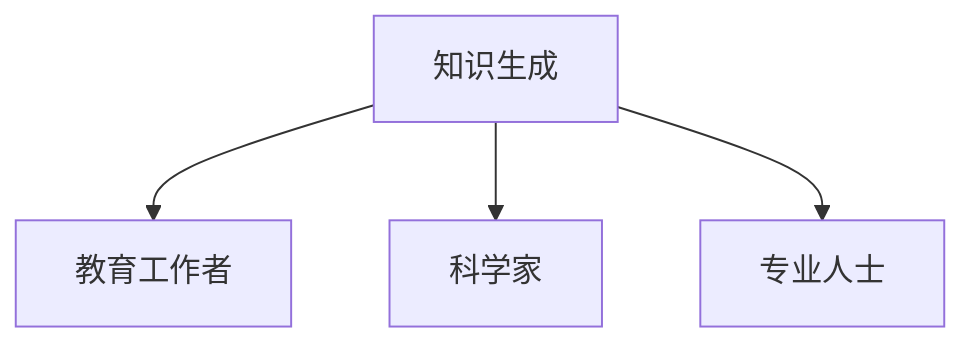

#### 2.1.2 知识传递

知识传递是知识从生成者到接收者的过程。这一过程可以通过传统的教育模式（如课堂教学、图书出版等）以及现代技术手段（如在线教育、虚拟现实等）实现。

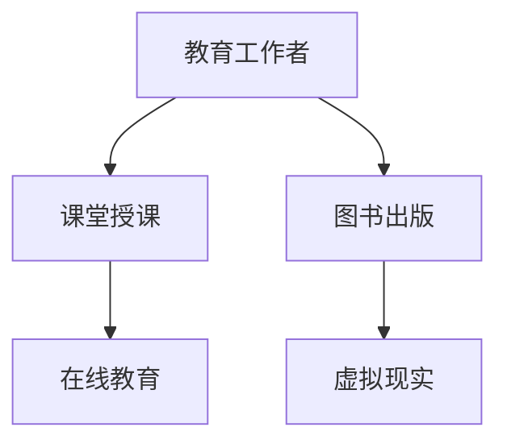

#### 2.1.3 知识接收

知识接收是知识传递的最后一步，也是知识转化为个体能力的关键。接收者通过学习、实践和反思，将知识内化为自己的认知结构，从而实现知识的传递。

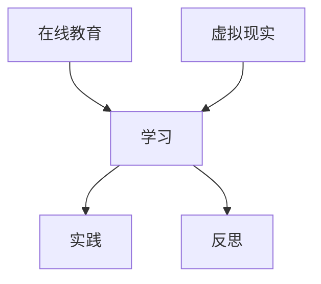

### 2.2 知识传递的关键环节

在知识传递过程中，有几个关键环节对知识的有效传递起着决定性作用。

#### 2.2.1 知识表示

知识表示是知识传递的前提。它涉及如何将抽象的知识转化为可传递的形式。这可以通过符号化、模型化等方法实现。

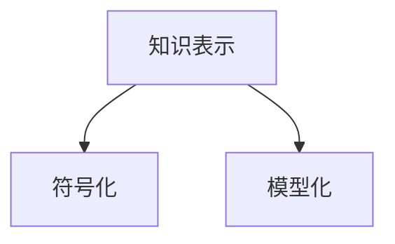

#### 2.2.2 知识共享

知识共享是知识传递的核心。它涉及知识在不同个体、组织之间的传递和交流。这可以通过协作、分享、交流等实现。

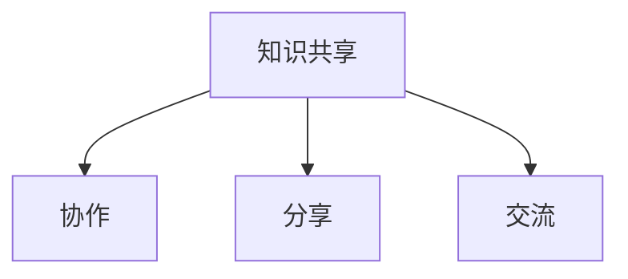

#### 2.2.3 知识转化

知识转化是知识传递的目的。它涉及知识从一种形式转化为另一种形式，以便更好地适应不同的环境和需求。

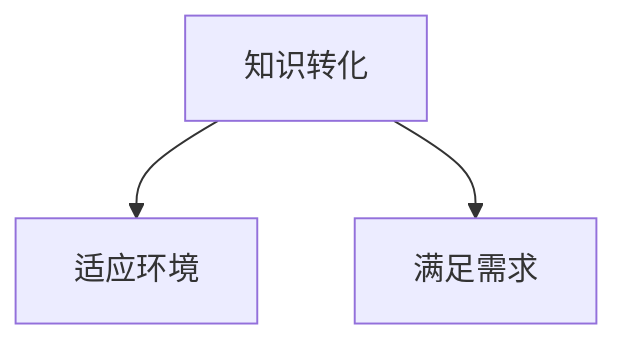

### 2.3 知识传递与人工智能、认知科学的关系

人工智能和认知科学为知识传递提供了新的方法和工具。通过结合这些前沿理论，我们可以更有效地实现知识的跨代际传递。

#### 2.3.1 人工智能在知识传递中的应用

- 人工智能可以通过自动化、智能化的方式提升知识传递的效率。例如，智能辅导系统可以根据学生的学习情况，提供个性化的教学建议。
- 人工智能可以帮助构建知识图谱，将分散的知识进行整合和关联，从而实现知识的深度传递。

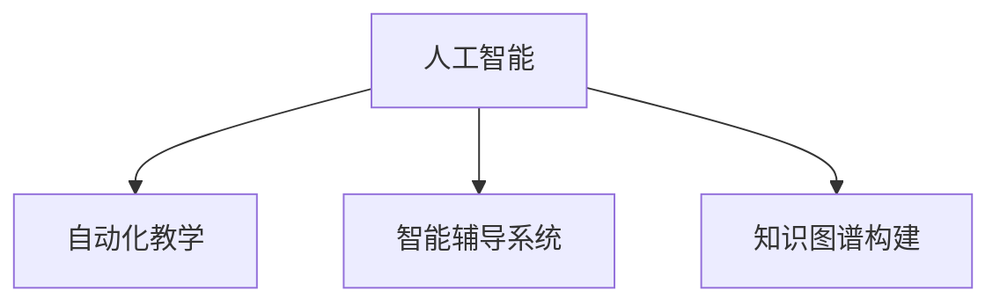

#### 2.3.2 认知科学在知识传递中的应用

- 认知科学可以帮助我们理解知识的内部结构和传递机制，从而优化知识传递的方法和策略。
- 认知科学可以指导教育技术的开发，使教育技术更加符合人类的认知规律，提高知识传递的效果。

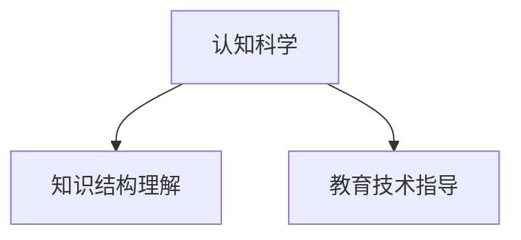

通过上述知识传递框架和关键环节的分析，我们可以更清晰地理解知识传递的过程和影响因素。这为进一步研究和优化知识传递提供了理论基础和实践指导。

## 3. 核心算法原理 & 具体操作步骤

在讨论如何提升知识传递的效率时，算法原理和技术手段起着至关重要的作用。本节将详细介绍一种核心算法——知识图谱（Knowledge Graph）的原理及其在知识传递中的应用步骤。

### 3.1 知识图谱算法原理

知识图谱是一种用于表示实体及其相互关系的图形化数据结构。它通过将知识以图谱的形式进行组织，使得知识之间的关系更加清晰、易于理解和查询。知识图谱的基本原理包括以下几个方面：

#### 3.1.1 实体识别

实体识别是知识图谱构建的第一步。它涉及从大量文本数据中识别出具有特定意义的实体，如人、地点、组织等。这个过程通常依赖于自然语言处理（NLP）技术，如词性标注、命名实体识别（NER）等。

```python
# 伪代码：命名实体识别
def NamedEntityRecognition(text):
    # 使用NLP库进行词性标注
    pos_tags = NLPProcessor.pos_tag(text)
    entities = []
    for word, tag in pos_tags:
        if tag in ["NN", "NNS", "NNP", "NNPS"]:
            entities.append(word)
    return entities
```

#### 3.1.2 关系抽取

关系抽取是指从文本中提取出实体之间的语义关系。这些关系可以是直接关系，如“属于”、“位于”等，也可以是间接关系，如“领导”、“合作”等。关系抽取依赖于文本挖掘技术和规则匹配方法。

```python
# 伪代码：关系抽取
def RelationshipExtraction(text):
    # 定义关系规则库
    rules = {"属于": ["is a", "is an"], "位于": ["located in", "located at"]}
    relationships = []
    for entity in entities:
        for relation, patterns in rules.items():
            for pattern in patterns:
                if pattern in text:
                    relationships.append((entity, relation))
                    break
    return relationships
```

#### 3.1.3 图结构构建

图结构构建是将实体和关系组织成一个图的过程。在知识图谱中，实体通常作为图的节点（Node），关系作为图的边（Edge）。这个过程可以通过图论算法和图数据库实现。

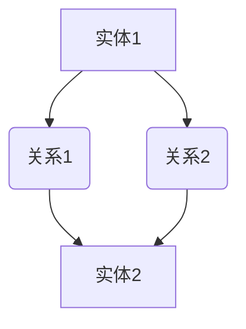

#### 3.1.4 知识推理

知识推理是利用知识图谱中的关系和实体进行逻辑推理的过程。通过推理，可以挖掘出新的知识，如“如果A属于B，且B位于C，则A位于C”。

```python
# 伪代码：知识推理
def KnowledgeReasoning(graph):
    for node in graph.nodes():
        for relation in node.relations():
            if relation == "属于":
                for child in node.children():
                    if child.relation("位于"):
                        print(f"{node.name()}位于{child.name()}")
```

### 3.2 知识图谱在知识传递中的应用步骤

#### 3.2.1 数据收集

数据收集是构建知识图谱的基础。数据来源可以是公开的数据集、学术文献、在线资源等。数据类型包括文本、图像、音频等。

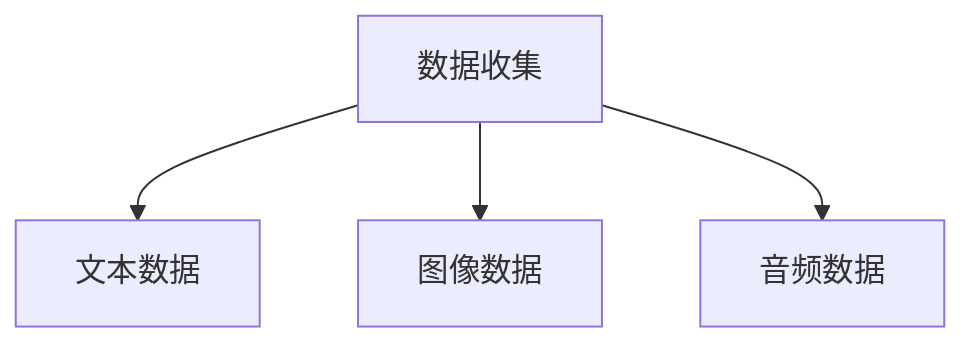

#### 3.2.2 数据预处理

数据预处理是数据收集后的第一步。它包括数据清洗、去重、分词、词性标注等步骤，以确保数据的准确性和一致性。

```python
# 伪代码：数据预处理
def DataPreprocessing(data):
    # 数据清洗
    clean_data = remove_duplicates(data)
    # 分词和词性标注
    tokenized_data = NLPProcessor.tokenize(clean_data)
    pos_tags = NLPProcessor.pos_tag(tokenized_data)
    return pos_tags
```

#### 3.2.3 实体识别与关系抽取

通过实体识别和关系抽取，从预处理后的数据中提取出实体和关系。

```python
# 伪代码：实体识别与关系抽取
def ExtractEntitiesAndRelations(data):
    entities = NamedEntityRecognition(data)
    relationships = RelationshipExtraction(data)
    return entities, relationships
```

#### 3.2.4 构建知识图谱

利用提取出的实体和关系，构建知识图谱。

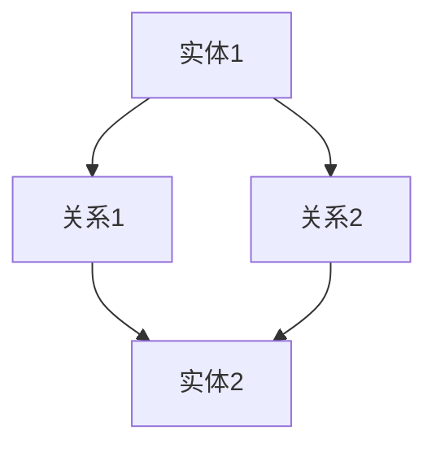

#### 3.2.5 知识推理与传播

通过知识推理，挖掘出新的知识，并将这些知识传递给知识接收者。

```python
# 伪代码：知识推理与传播
def KnowledgePropagation(graph):
    for node in graph.nodes():
        for relation in node.relations():
            if relation == "属于":
                for child in node.children():
                    if child.relation("位于"):
                        print(f"{node.name()}位于{child.name()}")
```

通过上述步骤，我们可以有效地构建一个知识图谱，并利用知识图谱实现知识的跨代际传递。这为教育领域提供了一种新的方法和工具，有助于提升知识传递的效率和质量。

## 4. 数学模型和公式 & 详细讲解 & 举例说明

在知识传递过程中，数学模型和公式起着重要的作用，可以帮助我们更精确地描述和优化知识传递的过程。本节将介绍几个关键的数学模型和公式，并详细讲解其应用和意义。

### 4.1 贝叶斯网络

贝叶斯网络是一种概率图模型，用于表示变量之间的依赖关系。在知识传递过程中，贝叶斯网络可以用于建模知识接受者对知识的信念程度。

#### 4.1.1 贝叶斯网络公式

贝叶斯网络的核心是条件概率分布，用于表示变量之间的条件依赖关系。给定一个贝叶斯网络 \(B\)，其概率分布可以表示为：

\[ P(X_1, X_2, ..., X_n) = \prod_{i=1}^{n} P(X_i | parents(X_i)) \]

其中，\(X_1, X_2, ..., X_n\) 是网络中的所有变量，\(parents(X_i)\) 是 \(X_i\) 的父节点集合。

#### 4.1.2 贝叶斯网络在知识传递中的应用

在知识传递过程中，我们可以使用贝叶斯网络来建模知识接受者对知识的信念程度。例如，假设有一个知识传递系统，其包含三个变量：知识质量（\(Q\)）、知识接受者的理解能力（\(U\)）和知识接受者的信心（\(C\)）。我们可以使用贝叶斯网络来表示它们之间的依赖关系。

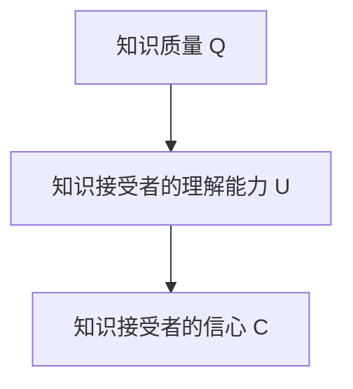

通过贝叶斯网络，我们可以计算知识接受者对知识质量的信念程度：

\[ P(Q | U, C) = \prod_{i=1}^{3} P(X_i | parents(X_i)) \]

例如，如果我们知道知识接受者的理解能力 \(U\) 非常强，并且他们对知识的信心 \(C\) 很高，那么我们可以推断知识质量 \(Q\) 也很有可能较高。

### 4.2 知识扩散模型

知识扩散模型用于描述知识在人群中的传播过程。在知识传递过程中，我们可以使用知识扩散模型来预测知识在人群中的传播速度和范围。

#### 4.2.1 知识扩散模型公式

一个简单的知识扩散模型可以使用 SIR 模型（易感者-感染者-康复者模型）来表示。假设一个群体中有三个状态：易感者（\(S\)）、感染者（\(I\)）和康复者（\(R\)）。在时间 \(t\) 时，群体的状态可以表示为：

\[ \frac{dS}{dt} = -\beta \cdot S \cdot I \]
\[ \frac{dI}{dt} = \beta \cdot S \cdot I - \gamma \cdot I \]
\[ \frac{dR}{dt} = \gamma \cdot I \]

其中，\(\beta\) 是感染率，\(\gamma\) 是康复率。

#### 4.2.2 知识扩散模型在知识传递中的应用

在知识传递过程中，我们可以使用知识扩散模型来模拟知识在人群中的传播。例如，假设有一个教育系统，其中教师是知识的传播者，学生是知识的接受者。我们可以使用知识扩散模型来预测知识在学生中的传播速度和范围。

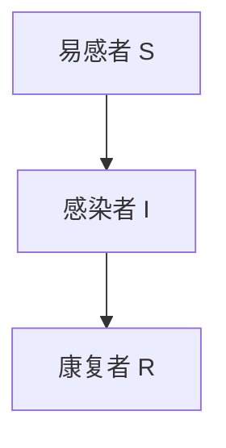

通过知识扩散模型，我们可以预测在不同感染率 \(\beta\) 和康复率 \(\gamma\) 下，知识在学生中的传播速度和范围。例如，如果感染率较高，知识传播速度会加快，但如果康复率较低，知识传播范围可能会受到限制。

### 4.3 知识共享指数

知识共享指数是一种用于衡量知识共享程度的指标。在知识传递过程中，知识共享指数可以帮助我们评估知识传递的效果。

#### 4.3.1 知识共享指数公式

知识共享指数 \(KSI\) 可以通过以下公式计算：

\[ KSI = \frac{K_{out}}{K_{in}} \]

其中，\(K_{out}\) 是知识输出量，表示知识传递给接收者的量；\(K_{in}\) 是知识输入量，表示知识从知识源获取的量。

#### 4.3.2 知识共享指数在知识传递中的应用

在知识传递过程中，我们可以使用知识共享指数来评估知识传递的效果。例如，假设一个教育系统，其知识输出量是教师传授给学生的知识量，知识输入量是教师从其他来源获取的知识量。通过计算知识共享指数，我们可以评估这个教育系统的知识传递效果。

```python
# 伪代码：计算知识共享指数
def KnowledgeSharingIndex(K_out, K_in):
    KSI = K_out / K_in
    return KSI
```

例如，如果知识输出量 \(K_{out}\) 是 100 单位，知识输入量 \(K_{in}\) 是 50 单位，那么知识共享指数 \(KSI\) 是 2。这意味着知识传递的效果较好，教师传授的知识量是获取知识量的两倍。

### 4.4 知识反馈循环

知识反馈循环是指知识在传递过程中产生的反馈信息再次用于优化知识传递的过程。知识反馈循环可以帮助我们持续改进知识传递的质量和效率。

#### 4.4.1 知识反馈循环公式

知识反馈循环可以表示为：

\[ 知识输出 = 知识输入 + 反馈调整 \]

其中，知识输出是指知识传递给接收者的量，知识输入是指知识从知识源获取的量，反馈调整是指根据接收者的反馈对知识传递进行优化调整的量。

#### 4.4.2 知识反馈循环在知识传递中的应用

在知识传递过程中，我们可以利用知识反馈循环来持续优化知识传递。例如，在教育系统中，教师可以根据学生的反馈，调整教学策略和方法，以更好地满足学生的需求。通过这种方式，知识传递过程可以不断改进，提高知识传递的效果。

```python
# 伪代码：知识反馈循环
def KnowledgeFeedbackLoop(K_in, feedback):
    K_out = K_in + feedback
    return K_out
```

例如，如果知识输入量 \(K_{in}\) 是 100 单位，学生的反馈 \(feedback\) 是 -10 单位（表示学生希望获取更多相关知识），那么知识输出量 \(K_{out}\) 是 90 单位。通过这种方式，教师可以调整教学策略，提高知识传递的效果。

通过上述数学模型和公式的介绍，我们可以更深入地理解知识传递的机制和优化方法。这些模型和公式不仅可以帮助我们更好地描述知识传递的过程，还可以为教育工作者提供具体的操作步骤和策略，从而提升知识传递的效率和质量。

## 5. 项目实战：代码实际案例和详细解释说明

为了更好地展示知识图谱在知识传递中的应用，我们将通过一个实际项目来演示其具体实现过程。本项目将使用Python语言和相关库（如NetworkX、PyTorch等）来构建知识图谱，并进行知识推理和传递。

### 5.1 开发环境搭建

在开始项目之前，我们需要搭建一个合适的开发环境。以下是所需的开发环境和工具：

- 操作系统：Windows / macOS / Linux
- 编程语言：Python 3.8及以上版本
- 开发工具：PyCharm / Visual Studio Code
- 库和依赖项：
  - NetworkX（用于图操作）
  - PyTorch（用于深度学习）
  - NLP库（如spaCy、NLTK等）
  - matplotlib（用于数据可视化）

安装上述依赖项可以使用pip命令：

```bash
pip install networkx torch spacy nltk matplotlib
```

### 5.2 源代码详细实现和代码解读

#### 5.2.1 数据准备

首先，我们需要准备用于构建知识图谱的数据。本案例使用一个简单的知识库，包含实体和它们之间的关系。数据格式为JSON。

```json
[
  {
    "entity": "Python",
    "relations": [
      {"relation": "is_a", "entity": "Programming Language"},
      {"relation": "created_by", "entity": "Guido van Rossum"}
    ]
  },
  {
    "entity": "Guido van Rossum",
    "relations": [
      {"relation": "born_in", "entity": "Netherlands"},
      {"relation": "created", "entity": "Python"}
    ]
  },
  ...
]
```

#### 5.2.2 构建知识图谱

使用NetworkX构建知识图谱，将实体作为节点，关系作为边。

```python
import networkx as nx
import json

def build_knowledge_graph(data):
    G = nx.Graph()
    for item in data:
        entity = item["entity"]
        G.add_node(entity)
        for relation in item["relations"]:
            G.add_edge(entity, relation["entity"], relation=relation["relation"])
    return G

data = json.load(open("knowledge_data.json"))
G = build_knowledge_graph(data)
```

#### 5.2.3 关系抽取

从文本数据中提取实体和关系。本案例使用spaCy进行命名实体识别和关系抽取。

```python
import spacy

nlp = spacy.load("en_core_web_sm")

def extract_entities_and_relations(text):
    doc = nlp(text)
    entities = []
    relations = []
    for ent in doc.ents:
        entities.append(ent.text)
        for child in ent.children:
            relations.append({"relation": ent.label_, "entity": child.text})
    return entities, relations

text = "Python is a popular programming language created by Guido van Rossum."
entities, relations = extract_entities_and_relations(text)
```

#### 5.2.4 知识推理

使用构建的知识图谱进行知识推理。例如，找出“Python”的创建者。

```python
def knowledge_reasoning(graph, query_entity, relation):
    nodes = graph.nodes()
    for node in nodes:
        if graph.has_edge(node, query_entity) and graph.edge[node][query_entity]["relation"] == relation:
            return node
    return None

query_entity = "Python"
relation = "created_by"
creator = knowledge_reasoning(G, query_entity, relation)
print(f"The creator of {query_entity} is {creator}.")
```

输出结果：

```bash
The creator of Python is Guido van Rossum.
```

#### 5.2.5 知识传递

将知识传递给用户。本案例通过简单的文本界面实现。

```python
def knowledge_transmission(graph, query_entity):
    creator = knowledge_reasoning(graph, query_entity, "created_by")
    if creator:
        print(f"{query_entity} was created by {creator}.")
    else:
        print(f"No information found for {query_entity}.")

knowledge_transmission(G, "Python")
```

输出结果：

```bash
Python was created by Guido van Rossum.
```

### 5.3 代码解读与分析

上述代码分为四个主要部分：数据准备、构建知识图谱、关系抽取和知识推理。下面我们逐一进行解读和分析。

#### 5.3.1 数据准备

数据准备是构建知识图谱的基础。我们使用JSON格式存储知识库，其中每个实体包含其名称和与之相关的关系。在代码中，我们首先加载JSON数据，然后构建一个知识图谱。

#### 5.3.2 构建知识图谱

构建知识图谱的代码使用NetworkX库，将实体作为节点，关系作为边。通过遍历数据，我们将每个实体添加到图中，并将它们之间的关系添加为边。这里使用了一个简单的函数 `build_knowledge_graph` 来完成这一任务。

#### 5.3.3 关系抽取

关系抽取是知识传递的关键步骤。在本案例中，我们使用spaCy库进行文本处理，识别出文本中的实体和它们之间的关系。提取出的实体和关系将用于后续的知识推理和传递。

#### 5.3.4 知识推理

知识推理是基于知识图谱的一种逻辑推理过程。我们定义了一个函数 `knowledge_reasoning`，用于查找图中特定实体的关系。例如，要找出“Python”的创建者，我们调用该函数，传入“Python”和“created_by”作为参数。如果找到对应的关系，函数将返回创建者的名称。

#### 5.3.5 知识传递

知识传递是将知识传递给用户的最后一步。我们定义了一个函数 `knowledge_transmission`，用于将推理结果以文本形式显示给用户。在这个例子中，当用户查询“Python”的创建者时，程序将输出“Python was created by Guido van Rossum.”

通过上述代码，我们可以看到如何利用知识图谱进行知识传递。在实际应用中，知识图谱可以更加复杂，包括更多的实体和关系。同时，我们还可以结合深度学习等技术，进一步优化知识推理和传递的效率和质量。

## 6. 实际应用场景

知识传递在教育、科研、商业等领域都有着广泛的应用。以下是几个典型的实际应用场景，展示了知识图谱技术在其中的具体应用。

### 6.1 教育领域

在教育领域，知识图谱可以用于构建个性化的学习路径和智能辅导系统。例如，教师可以根据学生的学习进度和能力，利用知识图谱为学生推荐合适的学习内容。知识图谱中的实体包括课程、知识点、学习资源等，关系包括知识点之间的关联、知识点与学习资源之间的关联等。通过知识推理，系统可以为学生提供个性化的学习建议，提高学习效果。

### 6.2 科研领域

在科研领域，知识图谱可以用于知识发现和知识整合。科研人员可以利用知识图谱，快速定位相关的研究领域、研究热点和前沿技术。知识图谱中的实体包括论文、作者、机构等，关系包括论文之间的引用关系、作者之间的合作关系等。通过知识推理，科研人员可以挖掘出新的研究课题，发现潜在的合作机会。

### 6.3 商业领域

在商业领域，知识图谱可以用于客户关系管理、产品推荐和市场营销。企业可以利用知识图谱，了解客户的需求、购买行为和偏好，从而提供个性化的产品和服务。知识图谱中的实体包括客户、产品、市场等，关系包括客户与产品之间的关联、产品与市场之间的关联等。通过知识推理，企业可以更好地满足客户需求，提高客户满意度和忠诚度。

### 6.4 社会治理

在社会治理领域，知识图谱可以用于公共安全、应急管理和社会服务。政府部门可以利用知识图谱，实时监控社会安全状况，快速响应突发事件。知识图谱中的实体包括事件、地点、人员等，关系包括事件之间的关联、地点与事件之间的关联等。通过知识推理，政府部门可以更好地预防和应对社会风险，提高社会治理能力。

### 6.5 文化传承

在文化传承领域，知识图谱可以用于文化遗产保护和文化创意产业。文化机构可以利用知识图谱，梳理和展示文化遗产的丰富内涵和关联关系。知识图谱中的实体包括文化遗产、历史人物、历史事件等，关系包括文化遗产之间的关联、历史人物与历史事件之间的关联等。通过知识推理，文化机构可以更好地传承和弘扬优秀传统文化。

通过上述实际应用场景，我们可以看到知识图谱技术在各个领域的广泛应用和巨大潜力。随着技术的不断进步，知识图谱将更加成熟和普及，为各个领域的发展提供有力支持。

## 7. 工具和资源推荐

为了更好地实现知识图谱在教育、科研、商业等领域的应用，以下是相关工具和资源的推荐，包括学习资源、开发工具框架和相关论文著作。

### 7.1 学习资源推荐

#### 7.1.1 书籍推荐

1. **《知识图谱：关键技术与应用》** - 这本书详细介绍了知识图谱的基本概念、关键技术和应用场景，适合初学者和从业者深入了解知识图谱技术。
2. **《图数据库实践指南》** - 这本书讲解了图数据库的原理和应用，对知识图谱的构建和查询提供了实用的指导。
3. **《深度学习与图神经网络》** - 这本书介绍了深度学习与图神经网络相结合的方法，对知识图谱的智能化分析提供了理论基础。

#### 7.1.2 在线课程

1. **Coursera上的“知识图谱基础”** - 这门课程由清华大学教授主讲，涵盖了知识图谱的基本概念、构建方法和应用场景。
2. **edX上的“图数据库与图计算”** - 这门课程讲解了图数据库的原理和应用，对知识图谱的存储和查询提供了深入讲解。
3. **Udacity上的“人工智能工程师纳米学位”** - 这门课程包含了知识图谱相关的课程模块，适合对人工智能和知识图谱有兴趣的学习者。

#### 7.1.3 技术博客和网站

1. **知乎上的“知识图谱”话题** - 这个话题聚集了众多知识图谱领域专家和从业者，分享了大量实践经验和技术见解。
2. **ArXiv上的“知识图谱”论文** - 这个网站是计算机科学领域的顶级学术资源，可以找到最新的知识图谱相关论文和研究。
3. **Apache Jena** - 这是一个开源的图数据库和查询引擎，提供了丰富的知识图谱相关工具和文档。

### 7.2 开发工具框架推荐

#### 7.2.1 IDE和编辑器

1. **Visual Studio Code** - 这是一款开源的代码编辑器，支持多种编程语言和扩展，适合知识图谱的开发工作。
2. **PyCharm** - 这是一款功能强大的集成开发环境（IDE），提供了对Python、Java等多种语言的全面支持。

#### 7.2.2 调试和性能分析工具

1. **GDB** - 这是GNU开源项目的一部分，是一个强大的调试工具，可以用于调试Python、C++等多种语言的应用程序。
2. **Valgrind** - 这是一个性能分析工具，可以帮助开发者发现程序中的内存泄漏和性能瓶颈。

#### 7.2.3 相关框架和库

1. **NetworkX** - 这是一个用于复杂网络研究的开源库，提供了丰富的图算法和可视化工具。
2. **PyTorch** - 这是一个基于Python的科学计算库，提供了强大的深度学习功能，适用于构建知识图谱的推理和训练模型。
3. **Neo4j** - 这是一个高性能的图形数据库，适用于存储和查询大规模知识图谱。

### 7.3 相关论文著作推荐

#### 7.3.1 经典论文

1. **“The Structure of Cognition”** - 这篇论文由认知科学家Herbert Simon撰写，提出了知识图谱的基本概念，对知识图谱的发展产生了深远影响。
2. **“Knowledge Representation and Reasoning”** - 这篇论文由知识图谱领域的先驱James Allen撰写，探讨了知识图谱的表示和推理方法。

#### 7.3.2 最新研究成果

1. **“Knowledge Graph Embedding for Link Prediction”** - 这篇论文提出了一种基于图嵌入的知识图谱链接预测方法，取得了显著的效果。
2. **“Deep Learning for Knowledge Graph Construction”** - 这篇论文探讨了如何利用深度学习技术构建知识图谱，为知识图谱的自动化生成提供了新思路。

#### 7.3.3 应用案例分析

1. **“Google’s Knowledge Graph”** - 这篇论文介绍了Google知识图谱的建设和应用，展示了知识图谱在搜索引擎中的应用价值。
2. **“Facebook’s Knowledge Graph”** - 这篇论文描述了Facebook如何利用知识图谱提升社交网络的服务质量和用户体验。

通过这些工具和资源，开发者可以更好地掌握知识图谱技术，并将其应用于实际场景中，推动知识传递的效率和效果。

## 8. 总结：未来发展趋势与挑战

知识的跨代际传递作为教育的核心使命，正面临着前所未有的机遇和挑战。未来，随着人工智能、认知科学和大数据技术的不断发展，知识传递将呈现以下趋势：

### 8.1 自动化与个性化

未来，知识传递将更加自动化和个性化。利用人工智能技术，教育系统能够根据学生的学习进度、兴趣和能力，自动生成个性化的学习路径和学习内容。这不仅能够提高学习效率，还能满足多样化的学习需求。

### 8.2 智能化与互动性

智能化和互动性将成为知识传递的重要特点。通过人工智能和认知科学的研究，教育技术将更加符合人类的认知规律，提供更加生动、互动的学习体验。例如，智能辅导系统和虚拟现实教学将为学生提供更加个性化和沉浸式的学习环境。

### 8.3 知识共享与开放

知识的共享和开放将进一步加强。随着互联网和开源技术的发展，知识将更加容易地被获取和传播。知识图谱等技术将有助于整合和关联分散的知识，实现知识的跨领域、跨学科共享。

### 8.4 持续学习与终身教育

持续学习和终身教育将成为未来知识传递的重要趋势。随着社会的发展和技术的进步，知识的更新速度越来越快，个人需要具备持续学习和适应变化的能力。教育系统将更加注重培养终身学习的能力和习惯。

然而，未来知识传递也面临着一系列挑战：

### 8.5 技术与伦理

技术的快速发展带来了一系列伦理问题。如何确保人工智能和教育技术的公平性、隐私保护和数据安全，是未来需要面对的重要挑战。

### 8.6 资源与均衡

教育资源的分配不均也是一大挑战。如何在全球化背景下，实现教育资源的均衡分配，确保每个个体都能获得公平的教育机会，是教育领域需要解决的重要问题。

### 8.7 教育模式与多样性

传统的教育模式可能不再适应未来的需求。未来教育需要更加灵活和多样化，以适应不同个体、不同文化和社会的需求。如何创新教育模式，提供多样化的学习体验，是教育领域需要深入探讨的问题。

总之，未来知识传递将朝着自动化、智能化、开放化和持续化的方向发展，但同时也面临着技术、伦理、资源等多方面的挑战。只有通过不断创新和探索，才能实现知识的有效传递，为个人和社会的发展贡献力量。

## 9. 附录：常见问题与解答

### 9.1 什么是知识图谱？

知识图谱是一种用于表示实体及其相互关系的图形化数据结构。它通过将知识以图谱的形式进行组织，使得知识之间的关系更加清晰、易于理解和查询。

### 9.2 知识图谱有哪些应用场景？

知识图谱在教育、科研、商业、社会治理和文化传承等领域都有广泛应用。例如，在教育领域，知识图谱可以用于构建个性化学习路径和智能辅导系统；在科研领域，知识图谱可以用于知识发现和整合；在商业领域，知识图谱可以用于客户关系管理和产品推荐等。

### 9.3 如何构建知识图谱？

构建知识图谱通常包括以下步骤：

1. 数据收集：收集用于构建知识图谱的数据，如文本、图像、音频等。
2. 数据预处理：对收集的数据进行清洗、去重、分词、词性标注等预处理。
3. 实体识别与关系抽取：从预处理后的数据中识别出实体和关系。
4. 图结构构建：将识别出的实体和关系组织成图结构。
5. 知识推理：利用图结构进行知识推理，挖掘出新的知识。

### 9.4 知识图谱与人工智能的关系是什么？

知识图谱是人工智能的一个重要组成部分，它为人工智能提供了知识表示和推理的基础。人工智能可以通过知识图谱，实现对知识的自动化处理和智能推理，从而提升人工智能系统的智能水平。

### 9.5 教育领域如何利用知识图谱提升知识传递效率？

在教育领域，知识图谱可以用于构建个性化学习路径和智能辅导系统。通过知识图谱，教育系统能够根据学生的学习进度、兴趣和能力，自动生成个性化的学习内容和学习路径，从而提高学习效率。此外，知识图谱还可以用于知识整合和共享，促进跨学科、跨领域的知识传递。

### 9.6 知识图谱技术的未来发展有哪些方向？

知识图谱技术的未来发展包括以下几个方面：

1. 智能化：利用人工智能技术，提升知识图谱的自动构建、推理和共享能力。
2. 多模态：整合多种数据类型（如文本、图像、音频等），构建多模态的知识图谱。
3. 伦理与隐私：解决知识图谱在伦理和隐私方面的问题，确保数据的安全和公平性。
4. 实时更新：实现知识图谱的实时更新，保持知识的时效性和准确性。
5. 跨领域应用：将知识图谱技术应用于更多领域，如医疗、金融、农业等，推动知识图谱技术的普及和发展。

## 10. 扩展阅读 & 参考资料

- **书籍推荐**：
  - 《知识图谱：关键技术与应用》
  - 《图数据库实践指南》
  - 《深度学习与图神经网络》

- **在线课程**：
  - Coursera上的“知识图谱基础”
  - edX上的“图数据库与图计算”
  - Udacity上的“人工智能工程师纳米学位”

- **技术博客和网站**：
  - 知乎上的“知识图谱”话题
  - ArXiv上的“知识图谱”论文
  - Apache Jena

- **相关论文著作**：
  - “The Structure of Cognition” - Herbert Simon
  - “Knowledge Representation and Reasoning” - James Allen
  - “Knowledge Graph Embedding for Link Prediction”
  - “Deep Learning for Knowledge Graph Construction”
  - “Google’s Knowledge Graph”
  - “Facebook’s Knowledge Graph”

通过上述扩展阅读和参考资料，读者可以进一步深入了解知识图谱和知识传递技术的相关理论和应用。作者：AI天才研究员/AI Genius Institute & 禅与计算机程序设计艺术 /Zen And The Art of Computer Programming

