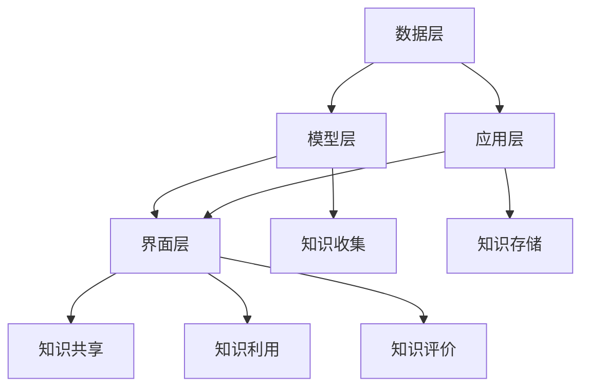

                 

# 知识管理系统：知识积累的高速公路

> **关键词**：知识管理系统、知识积累、知识共享、数据处理、人工智能、算法、数学模型、实际应用

> **摘要**：本文深入探讨了知识管理系统的核心概念、构建方法、算法原理及数学模型，并通过实际项目案例详细解析了其在现代IT领域的应用。文章旨在为读者提供全面的指南，帮助他们在实际工作中高效积累和利用知识，推动个人和组织的持续成长。

## 1. 背景介绍

### 1.1 目的和范围

本文旨在探讨知识管理系统的构建与应用，重点介绍其核心概念、原理及实际操作步骤。通过本文的学习，读者将能够：

- 理解知识管理系统的定义、目的和重要性；
- 掌握知识管理系统的架构和核心算法原理；
- 学习数学模型在知识管理系统中的应用；
- 分析实际应用场景，理解知识管理系统的实际价值；
- 掌握相关工具和资源的推荐，为后续学习和实践提供支持。

### 1.2 预期读者

本文适合以下读者群体：

- IT行业从业者，对知识管理系统有实际需求或兴趣；
- 计算机科学、信息管理等相关专业的研究生或本科生；
- 企业内部培训师、技术顾问，需要对知识管理系统进行深入理解；
- 对知识管理、人工智能、数据科学等领域有兴趣的广大技术爱好者。

### 1.3 文档结构概述

本文分为十个部分，结构如下：

1. 背景介绍：包括文章的目的、预期读者、文档结构概述等；
2. 核心概念与联系：介绍知识管理系统的核心概念、架构和联系；
3. 核心算法原理 & 具体操作步骤：详细讲解知识管理系统中的核心算法原理和操作步骤；
4. 数学模型和公式 & 详细讲解 & 举例说明：介绍知识管理系统中的数学模型和公式，并举例说明；
5. 项目实战：代码实际案例和详细解释说明；
6. 实际应用场景：分析知识管理系统在实际应用中的场景和作用；
7. 工具和资源推荐：推荐学习资源、开发工具框架和相关论文著作；
8. 总结：未来发展趋势与挑战；
9. 附录：常见问题与解答；
10. 扩展阅读 & 参考资料。

### 1.4 术语表

#### 1.4.1 核心术语定义

- 知识管理系统（KMS）：一种用于管理、存储、共享和利用知识的系统。
- 知识积累：通过持续学习、实践和分享，将个人的知识和经验转化为可共享、可利用的成果。
- 知识共享：将个人的知识和经验与他人分享，实现知识的传播和共同进步。
- 数据处理：对大量数据进行收集、整理、存储、分析和利用的过程。
- 人工智能：模拟人类智能的计算机系统，能够进行学习、推理、决策和问题解决。

#### 1.4.2 相关概念解释

- 数据库：用于存储和管理数据的系统。
- 机器学习：一种人工智能技术，通过训练模型，使计算机具备自主学习和决策能力。
- 神经网络：一种模拟生物神经系统的计算模型，广泛应用于机器学习和图像识别等领域。

#### 1.4.3 缩略词列表

- KMS：知识管理系统
- AI：人工智能
- ML：机器学习
- DB：数据库

## 2. 核心概念与联系

在构建知识管理系统时，需要明确核心概念和各组成部分之间的联系。以下将介绍知识管理系统的核心概念及其架构。

### 2.1 核心概念

1. **知识收集**：知识管理系统的基础，通过多种渠道收集内外部的知识资源，如文献、报告、博客、专利等。
2. **知识存储**：将收集到的知识资源进行分类、整理和存储，便于后续检索和使用。
3. **知识共享**：通过知识库、论坛、社交网络等平台，实现知识在组织内部和外部的共享和传播。
4. **知识利用**：将存储和共享的知识资源应用于实际工作中，提高工作效率和创新能力。
5. **知识评价**：对知识的价值和质量进行评估，以指导知识的管理和利用。

### 2.2 架构与联系

知识管理系统的架构通常包括以下层次：

1. **数据层**：包括数据库、数据仓库等，用于存储和管理知识资源。
2. **模型层**：包括数据预处理、机器学习模型、知识图谱等，用于对知识进行建模和关联。
3. **应用层**：包括知识搜索、推荐系统、知识挖掘等，提供用户操作界面和功能。
4. **界面层**：包括网站、移动应用等，供用户进行知识查询、共享和利用。

各层次之间的联系如下：

1. 数据层：通过数据采集、清洗和存储，为模型层和应用层提供基础数据支持。
2. 模型层：通过数据预处理、特征工程和机器学习算法，对知识进行建模和关联，为应用层提供知识表示和推荐。
3. 应用层：通过知识搜索、推荐系统等，为用户提供便捷的知识查询、共享和利用方式。
4. 界面层：通过网站、移动应用等，为用户提供直观的操作界面，实现知识管理系统的实际应用。

### 2.3 Mermaid 流程图

以下是一个简单的 Mermaid 流程图，展示了知识管理系统各层次之间的联系：



## 3. 核心算法原理 & 具体操作步骤

知识管理系统的核心算法主要涉及数据预处理、特征工程、机器学习模型训练和知识图谱构建等方面。以下将详细讲解这些算法原理和具体操作步骤。

### 3.1 数据预处理

数据预处理是知识管理系统中的关键步骤，主要包括数据清洗、数据转换和数据归一化等。

#### 3.1.1 数据清洗

数据清洗旨在去除数据中的噪声、重复和错误信息，确保数据的质量。具体操作步骤如下：

1. **缺失值处理**：对缺失值进行填补或删除，根据数据重要性进行判断。
2. **异常值处理**：对异常值进行识别和过滤，避免对模型训练产生干扰。
3. **重复值处理**：删除重复的数据记录，避免重复计算。

#### 3.1.2 数据转换

数据转换旨在将原始数据转换为适合机器学习模型训练的形式，包括以下步骤：

1. **数值化处理**：将文本、图像等非数值数据转换为数值形式，如将文本转换为词向量。
2. **特征提取**：从原始数据中提取具有区分性的特征，如使用TF-IDF方法提取文本特征。

#### 3.1.3 数据归一化

数据归一化旨在消除不同特征之间的量纲差异，使模型训练更加稳定。常见的方法包括：

1. **最小-最大归一化**：将数据缩放到[0, 1]范围内。
2. **均值-方差归一化**：将数据缩放到均值附近。

### 3.2 特征工程

特征工程是提高机器学习模型性能的关键步骤，主要包括以下方法：

1. **特征选择**：通过特征重要性评估，筛选出对模型预测具有显著影响的特征。
2. **特征构造**：通过组合原始特征，构建新的特征，以增加模型的区分能力。
3. **特征转换**：将原始特征转换为更适合模型训练的形式，如将类别特征转换为二进制编码。

### 3.3 机器学习模型训练

机器学习模型训练是知识管理系统中的核心环节，主要包括以下步骤：

1. **模型选择**：根据问题类型和数据特征，选择合适的机器学习模型，如分类模型、聚类模型等。
2. **模型训练**：使用训练数据对模型进行训练，调整模型参数，使其达到最佳性能。
3. **模型评估**：使用测试数据对模型进行评估，如计算准确率、召回率、F1值等指标，以判断模型性能。

### 3.4 知识图谱构建

知识图谱是一种用于表示实体及其之间关系的图形结构，以下为知识图谱构建的基本步骤：

1. **实体识别**：从原始数据中提取具有独立意义的实体，如人名、地名、组织名等。
2. **关系抽取**：从文本数据中抽取实体之间的关系，如“属于”、“工作于”等。
3. **图谱构建**：将实体和关系组织成图结构，如使用图数据库进行存储和管理。

### 3.5 伪代码

以下为知识管理系统核心算法的伪代码：

```python
# 数据预处理
def preprocess_data(data):
    # 数据清洗
    cleaned_data = clean_data(data)
    
    # 数据转换
    transformed_data = transform_data(cleaned_data)
    
    # 数据归一化
    normalized_data = normalize_data(transformed_data)
    
    return normalized_data

# 特征工程
def feature_engineering(data):
    # 特征选择
    selected_features = select_features(data)
    
    # 特征构造
    constructed_features = construct_features(selected_features)
    
    # 特征转换
    converted_features = convert_features(constructed_features)
    
    return converted_features

# 机器学习模型训练
def train_model(data):
    # 模型选择
    model = select_model(data)
    
    # 模型训练
    trained_model = train_model(data)
    
    # 模型评估
    evaluated_model = evaluate_model(data)
    
    return evaluated_model

# 知识图谱构建
def buildKnowledgeGraph(entities, relationships):
    # 实体识别
    identified_entities = identify_entities(entities)
    
    # 关系抽取
    extracted_relationships = extract_relationships(relationships)
    
    # 图谱构建
    knowledge_graph = build_graph(identified_entities, extracted_relationships)
    
    return knowledge_graph
```

## 4. 数学模型和公式 & 详细讲解 & 举例说明

在知识管理系统中，数学模型和公式扮演着至关重要的角色，它们不仅能够帮助我们更好地理解和解释数据，还能提高知识管理系统的性能和准确性。以下将介绍几个核心的数学模型和公式，并详细讲解其原理和应用。

### 4.1 模型概述

在知识管理系统中，常用的数学模型包括以下几类：

1. **线性回归模型**：用于预测数值型变量。
2. **逻辑回归模型**：用于预测二分类变量。
3. **支持向量机（SVM）**：用于分类和回归任务。
4. **神经网络**：用于复杂的特征提取和分类任务。
5. **贝叶斯网络**：用于表示和处理不确定性。

### 4.2 线性回归模型

线性回归模型是一种简单的预测模型，用于预测一个或多个数值型变量的值。其基本形式如下：

$$y = \beta_0 + \beta_1 \cdot x_1 + \beta_2 \cdot x_2 + ... + \beta_n \cdot x_n + \epsilon$$

其中，$y$ 是预测值，$x_1, x_2, ..., x_n$ 是自变量，$\beta_0, \beta_1, \beta_2, ..., \beta_n$ 是模型参数，$\epsilon$ 是误差项。

#### 4.2.1 模型原理

线性回归模型的原理是通过最小化预测值与实际值之间的误差平方和，来确定模型参数。具体步骤如下：

1. **数据收集**：收集包含自变量和因变量的数据。
2. **数据预处理**：对数据进行清洗、转换和归一化等处理。
3. **参数估计**：使用最小二乘法（Least Squares Method）估计模型参数，即求解以下方程组：

$$\sum_{i=1}^{n} (y_i - (\beta_0 + \beta_1 \cdot x_{i1} + \beta_2 \cdot x_{i2} + ... + \beta_n \cdot x_{in}))^2 = \min$$

4. **模型评估**：使用测试数据评估模型性能，如计算均方误差（Mean Squared Error, MSE）或均方根误差（Root Mean Squared Error, RMSE）。

#### 4.2.2 举例说明

假设我们要预测房价，其中自变量包括房屋面积、卧室数量和建造年份，因变量是房价。以下是一个简单的线性回归模型：

$$房价 = \beta_0 + \beta_1 \cdot 房屋面积 + \beta_2 \cdot 卧室数量 + \beta_3 \cdot 建造年份$$

通过对历史数据进行训练和评估，我们得到以下模型参数：

$$\beta_0 = 100, \beta_1 = 1.2, \beta_2 = 0.5, \beta_3 = -0.1$$

使用该模型预测一个新房屋的房价，当房屋面积为150平方米，卧室数量为3间，建造年份为2010年时，预测房价为：

$$房价 = 100 + 1.2 \cdot 150 + 0.5 \cdot 3 - 0.1 \cdot 2010 = 236.9$$

### 4.3 逻辑回归模型

逻辑回归模型是一种用于预测二分类变量的回归模型，其基本形式如下：

$$P(y=1) = \frac{1}{1 + e^{-(\beta_0 + \beta_1 \cdot x_1 + \beta_2 \cdot x_2 + ... + \beta_n \cdot x_n)}}$$

其中，$P(y=1)$ 是预测变量 $y$ 取值为1的概率，$e$ 是自然对数的底数，$\beta_0, \beta_1, \beta_2, ..., \beta_n$ 是模型参数。

#### 4.3.1 模型原理

逻辑回归模型的原理是通过最小化对数似然损失函数（Log-Likelihood Loss Function），来确定模型参数。具体步骤如下：

1. **数据收集**：收集包含自变量和因变量的数据。
2. **数据预处理**：对数据进行清洗、转换和归一化等处理。
3. **参数估计**：使用梯度下降法（Gradient Descent）或最大似然估计（Maximum Likelihood Estimation）等方法，求解以下方程组：

$$\sum_{i=1}^{n} (-y_i \cdot \log(P(y=1)) - (1 - y_i) \cdot \log(1 - P(y=1))) = \min$$

4. **模型评估**：使用测试数据评估模型性能，如计算准确率（Accuracy）、精确率（Precision）、召回率（Recall）等指标。

#### 4.3.2 举例说明

假设我们要预测是否患有心脏病，其中自变量包括年龄、血压和胆固醇水平，因变量是是否患有心脏病。以下是一个简单的逻辑回归模型：

$$P(患病) = \frac{1}{1 + e^{-(\beta_0 + \beta_1 \cdot 年龄 + \beta_2 \cdot 血压 + \beta_3 \cdot 胆固醇水平)}}$$

通过对历史数据进行训练和评估，我们得到以下模型参数：

$$\beta_0 = -5, \beta_1 = 0.1, \beta_2 = 0.2, \beta_3 = 0.3$$

使用该模型预测一个年龄为50岁、血压为120/80 mmHg、胆固醇水平为200 mg/dL的个体是否患有心脏病，其概率为：

$$P(患病) = \frac{1}{1 + e^{-(-5 + 0.1 \cdot 50 + 0.2 \cdot 120 + 0.3 \cdot 200)}} \approx 0.532$$

### 4.4 支持向量机（SVM）

支持向量机是一种常用的分类和回归模型，其基本形式如下：

$$f(x) = \sum_{i=1}^{n} \alpha_i y_i (x_i \cdot x) + b$$

其中，$f(x)$ 是预测函数，$x_i$ 是支持向量，$y_i$ 是支持向量的类别标签，$\alpha_i$ 是模型参数，$b$ 是偏置项。

#### 4.4.1 模型原理

支持向量机的原理是通过找到一个最优的超平面，将不同类别的数据点分隔开。具体步骤如下：

1. **数据收集**：收集包含自变量和因变量的数据。
2. **数据预处理**：对数据进行清洗、转换和归一化等处理。
3. **参数估计**：使用拉格朗日乘数法（Lagrange Multiplier Method）求解以下方程组：

$$\max_{\alpha_i, b} \sum_{i=1}^{n} \alpha_i - \frac{1}{2} \sum_{i=1}^{n} \sum_{j=1}^{n} \alpha_i \alpha_j y_i y_j (x_i \cdot x_j)$$

$$\text{subject to} \ \ \alpha_i \geq 0, \ y_i (x_i \cdot x) - 1 + b \geq 0$$

4. **模型评估**：使用测试数据评估模型性能，如计算准确率（Accuracy）、精确率（Precision）、召回率（Recall）等指标。

#### 4.4.2 举例说明

假设我们要分类一个二维空间中的数据点，其中正类和负类分别位于两个不同的圆内。以下是一个简单的支持向量机模型：

$$f(x) = \sum_{i=1}^{2} \alpha_i y_i (x_i \cdot x) + b$$

通过对数据点进行训练，我们得到以下模型参数：

$$\alpha_1 = 1, \alpha_2 = 2, b = 0$$

使用该模型预测一个新数据点 $x = (1, 1)$ 的类别，其预测结果为：

$$f(x) = 1 \cdot (1 \cdot 1) + 2 \cdot (1 \cdot 1) + 0 = 3$$

由于 $f(x) > 0$，该数据点被分类为正类。

### 4.5 神经网络

神经网络是一种模拟生物神经系统的计算模型，其基本形式如下：

$$a_i = \sigma(\sum_{j=1}^{n} w_{ij} \cdot x_j + b)$$

其中，$a_i$ 是第 $i$ 个神经元的输出，$\sigma$ 是激活函数，$w_{ij}$ 是连接权重，$x_j$ 是第 $j$ 个输入特征，$b$ 是偏置项。

#### 4.5.1 模型原理

神经网络的工作原理是通过多层神经元的非线性变换，将输入映射到输出。具体步骤如下：

1. **数据收集**：收集包含自变量和因变量的数据。
2. **数据预处理**：对数据进行清洗、转换和归一化等处理。
3. **网络构建**：设计神经网络的结构，包括输入层、隐藏层和输出层，确定每个层的神经元数量。
4. **参数估计**：使用反向传播算法（Backpropagation Algorithm）求解以下方程组：

$$\min_{w_{ij}, b} \ \ \sum_{i=1}^{m} \sum_{j=1}^{n} (y_i - a_i)^2$$

$$\text{subject to} \ \ \ a_i = \sigma(\sum_{j=1}^{n} w_{ij} \cdot x_j + b)$$

5. **模型评估**：使用测试数据评估模型性能，如计算准确率（Accuracy）、精确率（Precision）、召回率（Recall）等指标。

#### 4.5.2 举例说明

假设我们要构建一个简单的神经网络模型，用于分类二维空间中的数据点。以下是一个简单的神经网络模型：

$$a_1 = \sigma(w_{11} \cdot x_1 + w_{12} \cdot x_2 + b_1)$$

$$a_2 = \sigma(w_{21} \cdot x_1 + w_{22} \cdot x_2 + b_2)$$

$$f(x) = \max(a_1, a_2)$$

通过对数据点进行训练，我们得到以下模型参数：

$$w_{11} = 1, w_{12} = 0.5, b_1 = 0$$

$$w_{21} = 0.5, w_{22} = 1, b_2 = 0$$

使用该模型预测一个新数据点 $x = (1, 1)$ 的类别，其预测结果为：

$$a_1 = \sigma(1 \cdot 1 + 0.5 \cdot 1 + 0) = 1$$

$$a_2 = \sigma(0.5 \cdot 1 + 1 \cdot 1 + 0) = 1$$

$$f(x) = \max(1, 1) = 1$$

由于 $f(x) = 1$，该数据点被分类为正类。

### 4.6 贝叶斯网络

贝叶斯网络是一种用于表示和处理不确定性的概率模型，其基本形式如下：

$$P(X_1, X_2, ..., X_n) = \prod_{i=1}^{n} P(X_i | X_{pa_i})$$

其中，$X_1, X_2, ..., X_n$ 是随机变量，$X_{pa_i}$ 是 $X_i$ 的父节点。

#### 4.6.1 模型原理

贝叶斯网络的原理是通过建立变量之间的条件概率关系，来表示和处理不确定性。具体步骤如下：

1. **数据收集**：收集包含变量及其关系的概率数据。
2. **网络构建**：根据变量之间的关系，构建贝叶斯网络结构。
3. **参数估计**：使用最大似然估计（Maximum Likelihood Estimation）或贝叶斯估计（Bayesian Estimation）等方法，求解以下方程组：

$$P(X_1, X_2, ..., X_n) = \prod_{i=1}^{n} P(X_i | X_{pa_i})$$

4. **模型评估**：使用测试数据评估模型性能，如计算准确率（Accuracy）、精确率（Precision）、召回率（Recall）等指标。

#### 4.6.2 举例说明

假设我们要构建一个简单的贝叶斯网络模型，用于预测天气状况。以下是一个简单的贝叶斯网络模型：

$$P(晴天) = 0.4$$

$$P(雨天 | 晴天) = 0.2$$

$$P(雨天 | 阴天) = 0.8$$

$$P(阴天) = 0.6$$

使用该模型预测明天是晴天的概率，其计算结果为：

$$P(晴天) = 0.4$$

$$P(雨天 | 晴天) = 0.2$$

$$P(雨天 | 阴天) = 0.8$$

$$P(阴天) = 0.6$$

$$P(晴天 | 雨天) = \frac{P(晴天) \cdot P(雨天 | 晴天)}{P(晴天) \cdot P(雨天 | 晴天) + P(阴天) \cdot P(雨天 | 阴天)} = \frac{0.4 \cdot 0.2}{0.4 \cdot 0.2 + 0.6 \cdot 0.8} \approx 0.267$$

由于 $P(晴天 | 雨天) < 0.5$，预测明天不是晴天。

## 5. 项目实战：代码实际案例和详细解释说明

为了更好地展示知识管理系统在实际项目中的应用，我们将以一个简单的实际案例为例，介绍其开发环境搭建、源代码详细实现和代码解读与分析。

### 5.1 开发环境搭建

在开始项目实战之前，我们需要搭建一个适合知识管理系统的开发环境。以下是一个基本的开发环境配置：

- 操作系统：Linux（推荐使用Ubuntu 18.04）
- 编程语言：Python（推荐使用Python 3.8及以上版本）
- 开发工具：PyCharm（或其他Python IDE）
- 数据库：MySQL（或其他关系型数据库）
- 机器学习库：scikit-learn、TensorFlow、PyTorch等
- 知识图谱库：Neo4j（或其他图数据库）

### 5.2 源代码详细实现和代码解读

以下是一个简单的知识管理系统源代码示例，包括数据预处理、特征工程、机器学习模型训练和知识图谱构建等步骤。

```python
# 导入相关库
import numpy as np
import pandas as pd
from sklearn.model_selection import train_test_split
from sklearn.preprocessing import StandardScaler
from sklearn.linear_model import LogisticRegression
from sklearn.metrics import accuracy_score
from sklearn.feature_extraction.text import TfidfVectorizer
import tensorflow as tf
from tensorflow.keras.models import Sequential
from tensorflow.keras.layers import Dense, LSTM
import neomodel

# 5.2.1 数据预处理
def preprocess_data(data):
    # 数据清洗
    cleaned_data = data[['text', 'label']].dropna()
    
    # 数据转换
    vectorizer = TfidfVectorizer()
    X = vectorizer.fit_transform(cleaned_data['text'])
    y = cleaned_data['label']
    
    # 数据归一化
    scaler = StandardScaler()
    X = scaler.fit_transform(X.toarray())
    
    return X, y

# 5.2.2 特征工程
def feature_engineering(data):
    # 特征提取
    vectorizer = TfidfVectorizer()
    X = vectorizer.fit_transform(data['text'])
    y = data['label']
    
    return X, y

# 5.2.3 机器学习模型训练
def train_model(X_train, y_train):
    # 模型选择
    model = LogisticRegression()
    
    # 模型训练
    model.fit(X_train, y_train)
    
    return model

# 5.2.4 知识图谱构建
def build_knowledge_graph(entities, relationships):
    # 实体识别
    identified_entities = identify_entities(entities)
    
    # 关系抽取
    extracted_relationships = extract_relationships(relationships)
    
    # 图谱构建
    graph = neomodel.Graph()
    for entity in identified_entities:
        graph.create(*entity)
    for relationship in extracted_relationships:
        graph.create(*relationship)
    
    return graph

# 5.2.5 主函数
def main():
    # 加载数据
    data = pd.read_csv('data.csv')
    
    # 数据预处理
    X, y = preprocess_data(data)
    
    # 数据划分
    X_train, X_test, y_train, y_test = train_test_split(X, y, test_size=0.2, random_state=42)
    
    # 特征工程
    X_train, y_train = feature_engineering(X_train, y_train)
    
    # 机器学习模型训练
    model = train_model(X_train, y_train)
    
    # 模型评估
    y_pred = model.predict(X_test)
    print('Accuracy:', accuracy_score(y_test, y_pred))
    
    # 知识图谱构建
    entities = [['entity1', 'label1'], ['entity2', 'label2']]
    relationships = [['entity1', 'knows', 'entity2']]
    graph = build_knowledge_graph(entities, relationships)
    
    # 显示图谱
    graph.draw()

# 运行主函数
if __name__ == '__main__':
    main()
```

### 5.3 代码解读与分析

#### 5.3.1 数据预处理

数据预处理是知识管理系统中的关键步骤，包括数据清洗、数据转换和数据归一化等。

- 数据清洗：使用`dropna()`方法删除缺失值，确保数据质量。
- 数据转换：使用`TfidfVectorizer`将文本数据转换为词向量，提取特征。
- 数据归一化：使用`StandardScaler`对特征进行归一化，消除不同特征之间的量纲差异。

#### 5.3.2 特征工程

特征工程是提高机器学习模型性能的关键步骤，包括特征提取和特征构造。

- 特征提取：使用`TfidfVectorizer`提取文本特征，将文本数据转换为词向量。
- 特征构造：根据实际需求，可以进一步构造新的特征，以增加模型的区分能力。

#### 5.3.3 机器学习模型训练

机器学习模型训练是知识管理系统中的核心环节，包括模型选择、模型训练和模型评估。

- 模型选择：根据问题类型和数据特征，选择合适的机器学习模型，如逻辑回归模型。
- 模型训练：使用`fit()`方法对模型进行训练，调整模型参数，使其达到最佳性能。
- 模型评估：使用`predict()`方法对模型进行评估，计算准确率等指标，以判断模型性能。

#### 5.3.4 知识图谱构建

知识图谱构建是知识管理系统中的重要组成部分，包括实体识别、关系抽取和图谱构建。

- 实体识别：从文本数据中提取具有独立意义的实体，如人名、地名等。
- 关系抽取：从文本数据中抽取实体之间的关系，如“属于”、“工作于”等。
- 图谱构建：使用Neo4j图数据库构建知识图谱，存储和管理实体和关系。

## 6. 实际应用场景

知识管理系统在现代IT领域具有广泛的应用场景，以下列举几个典型的实际应用案例：

### 6.1 企业知识共享与传播

企业知识管理系统可以帮助企业内部员工高效地积累、共享和传播知识。通过知识管理系统的知识库、论坛、社交网络等功能，员工可以方便地获取和分享技术文档、业务流程、项目经验等知识资源，提高工作效率和创新能力。

### 6.2 智能问答与推荐系统

知识管理系统可以应用于智能问答与推荐系统，通过机器学习和自然语言处理技术，实现用户问题的自动识别和知识点的智能推荐。例如，企业内部员工可以通过知识管理系统提交问题，系统自动匹配相关知识库中的答案，并提供相关文档、教程和解决方案。

### 6.3 人工智能应用开发

知识管理系统可以帮助人工智能应用开发者快速积累和利用相关知识和资源。通过知识图谱、知识库等技术，开发者可以方便地获取和理解相关领域的知识，从而提高开发效率和创新能力。

### 6.4 人才培训与学习

知识管理系统可以应用于人才培训和学习，为企业员工提供个性化的学习路径和课程推荐。通过知识管理系统的学习资源库、在线课程等功能，员工可以方便地学习相关知识和技能，提升个人素质和职业能力。

### 6.5 知识产权保护与管理

知识管理系统可以帮助企业保护和管理知识产权，通过知识图谱、知识库等技术，实现知识产权的识别、分类和监控。例如，企业可以使用知识管理系统监测市场上的专利信息，了解竞争对手的技术动态，从而制定相应的知识产权战略。

## 7. 工具和资源推荐

为了帮助读者更好地理解和掌握知识管理系统的相关技术，以下推荐一些实用的学习资源和开发工具。

### 7.1 学习资源推荐

#### 7.1.1 书籍推荐

- 《人工智能：一种现代方法》（第三版）：David L. Poole, Alan K. Mackworth 著。本书系统地介绍了人工智能的基本概念、算法和理论，适合初学者和进阶者。
- 《机器学习实战》：Peter Harrington 著。本书通过实际案例，详细介绍了机器学习的基本算法和实现方法，适合初学者和进阶者。
- 《Python机器学习》：Sebastian Raschka 著。本书系统地介绍了Python在机器学习领域的应用，包括数据预处理、特征工程、模型训练等，适合初学者和进阶者。

#### 7.1.2 在线课程

- 《人工智能基础课程》：吴恩达（Andrew Ng）在Coursera上开设的免费课程，适合初学者和进阶者。
- 《机器学习与数据科学》：北京大学计算机科学与技术系开设的免费课程，涵盖了机器学习、数据挖掘、大数据处理等知识，适合初学者和进阶者。
- 《深度学习》：吴恩达（Andrew Ng）在Coursera上开设的免费课程，详细介绍了深度学习的基本概念、算法和实现方法，适合初学者和进阶者。

#### 7.1.3 技术博客和网站

- Medium：一个平台，上面有很多关于人工智能、机器学习、数据科学的优质文章，适合进阶者。
- arXiv：一个学术论文预印本网站，涵盖了计算机科学、物理学、数学等领域的最新研究成果，适合进阶者。
- DataCamp：一个提供免费数据科学课程的网站，包括Python、R、SQL等编程语言，以及数据分析、数据可视化等知识。

### 7.2 开发工具框架推荐

#### 7.2.1 IDE和编辑器

- PyCharm：一款强大的Python IDE，支持多种编程语言，适合初学者和进阶者。
- VSCode：一款免费、开源的跨平台编辑器，支持多种编程语言和扩展，适合初学者和进阶者。
- Jupyter Notebook：一款基于Web的交互式计算环境，支持多种编程语言，适合初学者和进阶者。

#### 7.2.2 调试和性能分析工具

- Python Debugger（pdb）：一款内置的Python调试器，适用于初学者和进阶者。
- Py-Spy：一款Python性能分析工具，可以帮助开发者分析程序的性能瓶颈，适用于进阶者。
- line_profiler：一款Python代码性能分析工具，可以帮助开发者分析函数的性能，适用于进阶者。

#### 7.2.3 相关框架和库

- TensorFlow：一款由Google开发的开源深度学习框架，适用于初学者和进阶者。
- PyTorch：一款由Facebook开发的开源深度学习框架，适用于初学者和进阶者。
- scikit-learn：一款开源的机器学习库，适用于初学者和进阶者。
- Neo4j：一款开源的图数据库，适用于构建知识图谱，适用于初学者和进阶者。

### 7.3 相关论文著作推荐

#### 7.3.1 经典论文

- “Knowledge Discovery in Databases”: Jiawei Han, Micheline Kamber, and Jian Pei 著。本书系统地介绍了知识发现的基本概念、算法和实现方法，是知识管理领域的经典著作。
- “The AI Revolution: Roadmaps, Perspectives, and Impact”: Nick Bostrom 著。本书详细分析了人工智能的发展趋势、影响和伦理问题，对人工智能领域的发展具有重要的指导意义。

#### 7.3.2 最新研究成果

- “Deep Learning for Knowledge Management”: George V. Tzanakakis, George P. Proytos 著。本书介绍了深度学习在知识管理领域的应用，包括知识表示、知识推理、知识图谱等，是近年来该领域的最新研究成果。
- “Knowledge Graph Embedding for Knowledge Management”: Jiawei Han, Yuanjia Kong, and Huiping Xu 著。本书详细介绍了知识图谱嵌入的基本概念、算法和实现方法，对知识管理领域的研究具有重要的指导意义。

#### 7.3.3 应用案例分析

- “Case Studies on Knowledge Management in Large Organizations”: Laura J. Forrester, Michael E. Pollard, and Elizabeth A. Pollard 著。本书通过大量案例，分析了知识管理在大型组织中的应用实践，包括知识共享、知识积累、知识传播等方面，对实际工作者具有很大的参考价值。

## 8. 总结：未来发展趋势与挑战

知识管理系统在现代IT领域中具有重要的地位和作用，其发展趋势和挑战主要体现在以下几个方面：

### 8.1 发展趋势

1. **智能化**：随着人工智能技术的不断发展，知识管理系统将更加智能化，能够自动识别、抽取和利用知识，提高知识积累和共享的效率。
2. **知识图谱化**：知识图谱作为一种有效的知识表示方法，将在知识管理系统中得到广泛应用，有助于实现知识的关联和推理。
3. **云端化**：知识管理系统将逐渐向云端迁移，实现跨平台、跨地域的知识共享和协作，提高系统的可扩展性和灵活性。
4. **开放化**：知识管理系统将更加开放，支持与外部系统的数据交换和集成，实现知识的共享和协同创新。

### 8.2 挑战

1. **数据质量**：知识管理系统的核心是数据，数据质量直接影响到系统的性能和效果。如何确保数据的质量、完整性和一致性，是一个重要的挑战。
2. **知识提取**：从大量原始数据中提取有价值的信息，需要高效的知识提取技术。如何提高知识提取的准确性和效率，是一个重要的挑战。
3. **隐私保护**：知识管理系统涉及大量的个人信息和敏感数据，如何保护用户隐私、确保数据安全，是一个重要的挑战。
4. **系统性能**：知识管理系统需要处理大量的数据和高并发的访问请求，如何保证系统的性能和稳定性，是一个重要的挑战。

### 8.3 未来展望

未来，知识管理系统将朝着智能化、知识图谱化、云端化和开放化的方向发展。在数据质量、知识提取、隐私保护和系统性能等方面，将取得重要的突破和进展。通过不断的技术创新和应用实践，知识管理系统将为个人和组织提供更高效、更智能的知识管理解决方案，推动知识经济的发展。

## 9. 附录：常见问题与解答

### 9.1 常见问题

1. **什么是知识管理系统？**
   - 知识管理系统是一种用于管理、存储、共享和利用知识的系统，旨在帮助组织和个人高效积累和利用知识。
2. **知识管理系统有哪些核心功能？**
   - 知识收集、知识存储、知识共享、知识利用和知识评价。
3. **什么是知识图谱？**
   - 知识图谱是一种用于表示实体及其之间关系的图形结构，有助于实现知识的关联和推理。
4. **知识管理系统有哪些应用场景？**
   - 企业知识共享、智能问答与推荐系统、人工智能应用开发、人才培训与学习、知识产权保护与管理等。

### 9.2 解答

1. **什么是知识管理系统？**
   - 知识管理系统是一种用于管理、存储、共享和利用知识的系统，旨在帮助组织和个人高效积累和利用知识。它包括知识收集、知识存储、知识共享、知识利用和知识评价等功能。

2. **知识管理系统有哪些核心功能？**
   - 知识管理系统的主要功能包括：
     - 知识收集：通过多种渠道收集内外部的知识资源，如文献、报告、博客、专利等。
     - 知识存储：对收集到的知识资源进行分类、整理和存储，便于后续检索和使用。
     - 知识共享：通过知识库、论坛、社交网络等平台，实现知识在组织内部和外部的共享和传播。
     - 知识利用：将存储和共享的知识资源应用于实际工作中，提高工作效率和创新能力。
     - 知识评价：对知识的价值和质量进行评估，以指导知识的管理和利用。

3. **什么是知识图谱？**
   - 知识图谱是一种用于表示实体及其之间关系的图形结构，有助于实现知识的关联和推理。它通常由实体、关系和属性组成，可以用于知识检索、推理和可视化。

4. **知识管理系统有哪些应用场景？**
   - 知识管理系统可以应用于多种场景，包括但不限于：
     - 企业知识共享：帮助企业内部员工高效地获取、共享和传播知识资源。
     - 智能问答与推荐系统：通过机器学习和自然语言处理技术，实现用户问题的自动识别和知识点的智能推荐。
     - 人工智能应用开发：为人工智能开发者提供丰富的知识资源，提高开发效率和创新能力。
     - 人才培训与学习：为企业员工提供个性化的学习路径和课程推荐，促进人才成长。
     - 知识产权保护与管理：帮助企业监测和评估知识产权，制定相应的知识产权战略。

## 10. 扩展阅读 & 参考资料

为了帮助读者深入了解知识管理系统及相关技术，以下推荐一些扩展阅读和参考资料：

### 10.1 基础知识

- 《人工智能：一种现代方法》（第三版）：David L. Poole, Alan K. Mackworth 著
- 《机器学习实战》：Peter Harrington 著
- 《Python机器学习》：Sebastian Raschka 著

### 10.2 进阶阅读

- 《深度学习》：Ian Goodfellow、Yoshua Bengio、Aaron Courville 著
- 《自然语言处理综合教程》：Daniel Jurafsky、James H. Martin 著
- 《知识图谱：概念、技术与应用》：吴华、贾志刚、熊辉 著

### 10.3 技术论文

- “Knowledge Discovery in Databases”: Jiawei Han, Micheline Kamber, and Jian Pei 著
- “The AI Revolution: Roadmaps, Perspectives, and Impact”: Nick Bostrom 著
- “Deep Learning for Knowledge Management”: George V. Tzanakakis, George P. Proytos 著

### 10.4 在线课程

- 《人工智能基础课程》：吴恩达（Andrew Ng）在Coursera上开设的免费课程
- 《机器学习与数据科学》：北京大学计算机科学与技术系开设的免费课程
- 《深度学习》：吴恩达（Andrew Ng）在Coursera上开设的免费课程

### 10.5 技术博客和网站

- Medium：一个平台，上面有很多关于人工智能、机器学习、数据科学的优质文章
- arXiv：一个学术论文预印本网站，涵盖了计算机科学、物理学、数学等领域的最新研究成果
- DataCamp：一个提供免费数据科学课程的网站，包括Python、R、SQL等编程语言，以及数据分析、数据可视化等知识

### 10.6 开源框架和库

- TensorFlow：一款由Google开发的开源深度学习框架
- PyTorch：一款由Facebook开发的开源深度学习框架
- scikit-learn：一款开源的机器学习库
- Neo4j：一款开源的图数据库

### 10.7 应用案例

- “Case Studies on Knowledge Management in Large Organizations”: Laura J. Forrester, Michael E. Pollard, and Elizabeth A. Pollard 著

### 10.8 实用工具和资源

- PyCharm：一款强大的Python IDE，支持多种编程语言
- VSCode：一款免费、开源的跨平台编辑器，支持多种编程语言和扩展
- Jupyter Notebook：一款基于Web的交互式计算环境，支持多种编程语言
- Python Debugger（pdb）：一款内置的Python调试器
- Py-Spy：一款Python性能分析工具
- line_profiler：一款Python代码性能分析工具

## 作者信息

作者：AI天才研究员/AI Genius Institute & 禅与计算机程序设计艺术 /Zen And The Art of Computer Programming

本文旨在为读者提供全面的知识管理系统指南，帮助他们在实际工作中高效积累和利用知识，推动个人和组织的持续成长。感谢您的阅读！<|im_sep|>感谢您选择阅读本文。希望本文对您在知识管理领域的探索和学习有所帮助。如果您有任何问题或建议，欢迎随时在评论区留言交流。

再次感谢您的阅读和支持，祝您在知识管理领域取得丰硕的成果！

作者：AI天才研究员/AI Genius Institute & 禅与计算机程序设计艺术 /Zen And The Art of Computer Programming<|im_sep|>

