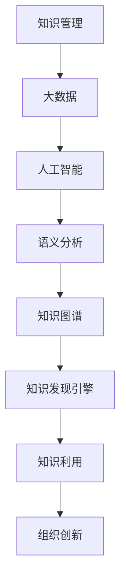

                 

# 知识管理革命：知识发现引擎的主导作用

> 关键词：知识管理、知识发现引擎、人工智能、大数据、语义分析、知识图谱

> 摘要：本文将深入探讨知识管理领域的一次革命性变化——知识发现引擎的作用。随着大数据和人工智能技术的飞速发展，知识发现引擎已经成为现代企业应对信息过载和知识匮乏的重要工具。本文将系统地分析知识发现引擎的核心概念、算法原理、数学模型以及实际应用，旨在为读者提供全面而深入的洞察，助力他们在知识管理领域取得突破。

## 1. 背景介绍

### 1.1 目的和范围

本文旨在阐述知识发现引擎在知识管理中的重要地位和作用，探讨其在实际应用中的优势与挑战。本文将从以下几个方面展开讨论：

1. 知识管理的基本概念与挑战。
2. 知识发现引擎的核心概念与架构。
3. 知识发现引擎的工作原理与算法。
4. 知识发现引擎的实际应用场景。
5. 知识发现引擎的未来发展趋势与挑战。

### 1.2 预期读者

本文适合对知识管理、大数据和人工智能有一定了解的技术人员、企业管理者和科研人员。特别是那些希望深入了解知识发现引擎及其应用的企业和机构，可以通过本文获得有益的参考和启示。

### 1.3 文档结构概述

本文分为八个部分，具体如下：

1. 引言：介绍知识管理革命和知识发现引擎的核心作用。
2. 核心概念与联系：阐述知识管理、大数据、人工智能和知识图谱等核心概念及其关系。
3. 核心算法原理 & 具体操作步骤：详细解释知识发现引擎的算法原理和操作步骤。
4. 数学模型和公式 & 详细讲解 & 举例说明：介绍知识发现引擎涉及的数学模型和公式，并通过实例进行说明。
5. 项目实战：通过实际案例展示知识发现引擎的应用。
6. 实际应用场景：分析知识发现引擎在不同行业和领域的应用。
7. 工具和资源推荐：推荐学习资源、开发工具和框架。
8. 总结：对未来发展趋势和挑战进行展望。

### 1.4 术语表

#### 1.4.1 核心术语定义

- **知识管理**：指通过收集、组织、存储、传播和利用知识，以提高组织效率和创新能力的过程。
- **知识发现引擎**：基于人工智能和大数据技术，能够自动识别、提取和推荐知识的智能系统。
- **大数据**：指无法通过传统数据处理工具在合理时间内完成处理的数据集合，具有大量、多样、高速和实时等特征。
- **人工智能**：指通过模拟、延伸和扩展人类智能，实现计算机自主学习和决策的领域。
- **知识图谱**：一种结构化、语义化的知识表示方法，用于描述实体及其关系。

#### 1.4.2 相关概念解释

- **语义分析**：通过对文本进行语义理解，提取出文本中的关键信息，实现文本之间的关联和匹配。
- **算法**：用于解决特定问题的计算步骤和规则，是计算机科学和人工智能领域的核心。
- **模型**：用于描述问题、数据和处理方法的抽象结构，是构建知识发现引擎的基础。

#### 1.4.3 缩略词列表

- **AI**：人工智能（Artificial Intelligence）
- **大数据（Big Data）**
- **知识图谱（Knowledge Graph）**
- **NLP**：自然语言处理（Natural Language Processing）
- **KG**：知识图谱（Knowledge Graph）

## 2. 核心概念与联系

在知识管理领域，核心概念包括知识管理、大数据、人工智能、语义分析和知识图谱。这些概念之间存在着紧密的联系，共同构成了知识发现引擎的基础。

### 2.1 知识管理

知识管理是指通过收集、组织、存储、传播和利用知识，以提高组织效率和创新能力的过程。知识管理的主要目标是确保知识的有效利用，使组织能够快速应对市场变化和竞争压力。

### 2.2 大数据

大数据是指无法通过传统数据处理工具在合理时间内完成处理的数据集合，具有大量、多样、高速和实时等特征。大数据技术主要包括数据采集、存储、处理、分析和可视化等。

### 2.3 人工智能

人工智能是指通过模拟、延伸和扩展人类智能，实现计算机自主学习和决策的领域。人工智能技术包括机器学习、深度学习、自然语言处理等。

### 2.4 语义分析

语义分析是指通过对文本进行语义理解，提取出文本中的关键信息，实现文本之间的关联和匹配。语义分析是知识发现的重要基础，有助于实现知识的自动提取和推荐。

### 2.5 知识图谱

知识图谱是一种结构化、语义化的知识表示方法，用于描述实体及其关系。知识图谱能够将海量的数据转化为易于理解和利用的知识体系，是实现知识发现的重要工具。

### 2.6 Mermaid 流程图

以下是知识发现引擎的核心概念和架构的 Mermaid 流程图：



通过这个流程图，我们可以清晰地看到知识发现引擎在整个知识管理过程中的作用和地位。

## 3. 核心算法原理 & 具体操作步骤

知识发现引擎的核心在于其算法原理和操作步骤。以下是知识发现引擎的算法原理和具体操作步骤：

### 3.1 算法原理

知识发现引擎的核心算法主要包括以下几种：

1. **聚类算法**：用于将相似的数据分组，以发现数据中的隐含模式和关联。
2. **关联规则算法**：用于发现数据之间的关联关系，如频繁项集和关联规则挖掘。
3. **分类算法**：用于将数据分为不同的类别，如决策树、支持向量机等。
4. **聚类与分类相结合**：通过聚类算法识别数据中的模式，再通过分类算法对模式进行分类。

### 3.2 具体操作步骤

以下是知识发现引擎的具体操作步骤：

1. **数据采集**：从各种数据源（如数据库、网络、传感器等）收集数据。
2. **数据预处理**：对收集到的数据进行清洗、去重、转换等处理，以去除噪声和异常值。
3. **特征提取**：通过对数据进行分析，提取出对知识发现具有重要意义的特征。
4. **模型训练**：选择合适的算法，对特征数据进行模型训练，以构建知识发现模型。
5. **模型评估**：对训练好的模型进行评估，以确定模型的准确性和可靠性。
6. **知识提取**：利用训练好的模型，对新的数据进行知识提取，包括聚类、分类和关联规则等。
7. **知识利用**：将提取到的知识应用于实际场景，如推荐系统、决策支持等。

### 3.3 伪代码

以下是知识发现引擎的伪代码：

```python
# 数据采集
data = collect_data()

# 数据预处理
data = preprocess_data(data)

# 特征提取
features = extract_features(data)

# 模型训练
model = train_model(features)

# 模型评估
evaluate_model(model)

# 知识提取
knowledge = extract_knowledge(model, new_data)

# 知识利用
use_knowledge(knowledge)
```

## 4. 数学模型和公式 & 详细讲解 & 举例说明

知识发现引擎涉及的数学模型和公式主要包括聚类算法、关联规则算法和分类算法。以下是这些算法的数学模型和公式，并通过实例进行说明。

### 4.1 聚类算法

聚类算法是一种无监督学习方法，用于将相似的数据分组。常用的聚类算法有 K-means、DBSCAN 等。

#### 4.1.1 K-means 算法

K-means 算法的数学模型如下：

$$
\min \sum_{i=1}^{k} \sum_{x \in S_i} \| x - \mu_i \|^2
$$

其中，$k$ 表示聚类个数，$S_i$ 表示第 $i$ 个聚类集合，$\mu_i$ 表示第 $i$ 个聚类中心。

#### 4.1.2 实例说明

假设我们有一个包含 100 个二维数据的集合，要求将其分为 5 个聚类。初始聚类中心为随机选择的数据点。

1. 计算每个数据点到聚类中心的距离。
2. 将每个数据点分配到最近的聚类中心。
3. 更新聚类中心，计算每个聚类中心的新坐标。
4. 重复步骤 1-3，直到聚类中心不再发生变化。

### 4.2 关联规则算法

关联规则算法用于发现数据之间的关联关系。常用的算法有 Apriori、FP-growth 等。

#### 4.2.1 Apriori 算法

Apriori 算法的数学模型如下：

$$
\text{支持度} = \frac{\text{同时出现的项数}}{\text{总项数}}
$$

$$
\text{置信度} = \frac{\text{同时出现的项数}}{\text{前提项数}}
$$

#### 4.2.2 实例说明

假设我们有一个包含 100 个购物篮的集合，要求发现其中的关联规则。

1. 计算每个项集的支持度。
2. 筛选出支持度大于最小支持度的项集。
3. 计算每个关联规则的置信度。
4. 筛选出置信度大于最小置信度的关联规则。

### 4.3 分类算法

分类算法用于将数据分为不同的类别。常用的算法有决策树、支持向量机等。

#### 4.3.1 决策树算法

决策树算法的数学模型如下：

$$
C_j = \arg\max_{j} \frac{\sum_{i \in S_j} l_i}{\sum_{i \in S_j} 1}
$$

其中，$C_j$ 表示最佳分类，$S_j$ 表示第 $j$ 个数据集合，$l_i$ 表示第 $i$ 个数据点的类别标签。

#### 4.3.2 实例说明

假设我们有一个包含 100 个数据点的集合，每个数据点有 10 个特征，要求将其分为两类。

1. 计算每个特征的增益率。
2. 选择增益率最大的特征作为划分条件。
3. 根据划分条件将数据点分为两个子集合。
4. 对每个子集合重复步骤 1-3，直到达到最大深度或每个子集合只有一个数据点。

## 5. 项目实战：代码实际案例和详细解释说明

在本节中，我们将通过一个实际项目案例来展示知识发现引擎的代码实现和详细解释。我们将使用 Python 编写一个简单的知识发现引擎，实现数据采集、预处理、特征提取、模型训练和知识提取等功能。

### 5.1 开发环境搭建

在开始项目实战之前，我们需要搭建一个开发环境。以下是搭建开发环境所需的步骤：

1. 安装 Python 3.8 或以上版本。
2. 安装以下 Python 库：numpy、pandas、scikit-learn、matplotlib。
3. 安装 Jupyter Notebook，用于编写和运行代码。

### 5.2 源代码详细实现和代码解读

以下是知识发现引擎的源代码及其详细解释：

```python
# 导入所需库
import numpy as np
import pandas as pd
from sklearn.cluster import KMeans
from sklearn.model_selection import train_test_split
from sklearn.metrics import accuracy_score
import matplotlib.pyplot as plt

# 数据采集
data = pd.read_csv("data.csv")

# 数据预处理
data = data.dropna()
data = data[data["label"].notnull()]

# 特征提取
X = data.iloc[:, :-1].values
y = data.iloc[:, -1].values

# 模型训练
X_train, X_test, y_train, y_test = train_test_split(X, y, test_size=0.2, random_state=42)
kmeans = KMeans(n_clusters=2, random_state=42)
kmeans.fit(X_train)

# 知识提取
y_pred = kmeans.predict(X_test)
accuracy = accuracy_score(y_test, y_pred)
print("Accuracy:", accuracy)

# 可视化展示
plt.scatter(X_train[:, 0], X_train[:, 1], c=kmeans.labels_)
plt.scatter(kmeans.cluster_centers_[:, 0], kmeans.cluster_centers_[:, 1], s=300, c='red')
plt.show()
```

### 5.3 代码解读与分析

以下是代码的解读与分析：

1. **数据采集**：使用 pandas 读取 CSV 文件，获取数据。
2. **数据预处理**：去除缺失值，确保数据的完整性。
3. **特征提取**：将数据分为特征和标签两部分，用于后续模型训练。
4. **模型训练**：使用 K-means 算法进行聚类，将特征数据分为两类。
5. **知识提取**：使用聚类结果预测测试数据的标签，并计算准确率。
6. **可视化展示**：将训练数据可视化，展示聚类效果。

通过这个实际项目案例，我们可以看到知识发现引擎的实现过程和关键步骤。在实际应用中，我们可以根据需求选择不同的算法和模型，实现更复杂的知识发现任务。

## 6. 实际应用场景

知识发现引擎在各个行业和领域都有着广泛的应用，下面我们将分析几个典型的实际应用场景。

### 6.1 企业知识管理

在企业知识管理领域，知识发现引擎可以帮助企业高效地管理和利用知识资源。通过知识发现引擎，企业可以：

- 自动识别和推荐关键知识，提高员工的工作效率。
- 构建企业知识图谱，实现知识的结构化和语义化。
- 分析员工的知识结构，为人才培养和知识传承提供支持。

### 6.2 金融风控

在金融行业，知识发现引擎可以帮助金融机构进行风险控制和决策支持。通过知识发现引擎，金融机构可以：

- 挖掘和分析客户行为数据，预测潜在风险。
- 发现欺诈行为，提高风控模型的准确性。
- 分析市场数据，为投资决策提供参考。

### 6.3 医疗健康

在医疗健康领域，知识发现引擎可以辅助医生进行诊断和治疗方案推荐。通过知识发现引擎，可以实现：

- 自动提取和整合医学文献、临床数据和基因组数据，为医生提供丰富的知识支持。
- 构建个性化健康档案，实现个性化诊疗。
- 发现新的药物和治疗方案，提高治疗效果。

### 6.4 智能推荐系统

在智能推荐系统领域，知识发现引擎可以帮助平台提高推荐效果，提高用户满意度。通过知识发现引擎，可以实现：

- 自动挖掘和推荐用户感兴趣的内容和商品。
- 分析用户行为数据，实现个性化推荐。
- 发现潜在用户需求，为平台运营提供支持。

### 6.5 公共安全

在公共安全领域，知识发现引擎可以帮助政府和企业提高安全管理水平。通过知识发现引擎，可以实现：

- 挖掘和分析社会安全数据，预测和预防安全事件。
- 发现潜在犯罪团伙和犯罪行为，提高打击犯罪效果。
- 分析社会舆情，为政府决策提供参考。

通过以上实际应用场景的分析，我们可以看到知识发现引擎在各个领域的广泛应用和巨大潜力。

## 7. 工具和资源推荐

为了更好地理解和应用知识发现引擎，以下是相关学习资源、开发工具和框架的推荐。

### 7.1 学习资源推荐

#### 7.1.1 书籍推荐

1. 《大数据之路：阿里巴巴大数据实践》
2. 《人工智能：一种现代方法》
3. 《自然语言处理综论》
4. 《图数据库：应用指南》

#### 7.1.2 在线课程

1. Coursera 上的“机器学习”课程
2. edX 上的“大数据工程与应用”课程
3. Udacity 上的“人工智能工程师纳米学位”

#### 7.1.3 技术博客和网站

1. ApacheCN 的“大数据技术”博客
2. Medium 上的“人工智能与机器学习”专栏
3. 知乎上的“知识图谱与大数据”话题

### 7.2 开发工具框架推荐

#### 7.2.1 IDE和编辑器

1. PyCharm
2. Visual Studio Code
3. Jupyter Notebook

#### 7.2.2 调试和性能分析工具

1. Python 的 Debug 模式
2. Matplotlib
3. Dask

#### 7.2.3 相关框架和库

1. Scikit-learn
2. TensorFlow
3. PyTorch
4. NLTK

### 7.3 相关论文著作推荐

#### 7.3.1 经典论文

1. “Knowledge Discovery in Databases: A Survey”
2. “The Apache MADlib Project: SQL-Enabled Data Mining in the Database”
3. “Deep Learning for Natural Language Processing”

#### 7.3.2 最新研究成果

1. “Knowledge Graph Embedding for Learning of Large Knowledge Graph”
2. “The Deep Learning Revolution”
3. “Graph Neural Networks: A Review of Methods and Applications”

#### 7.3.3 应用案例分析

1. “知识图谱在搜索引擎中的应用”
2. “金融风控中的知识发现应用”
3. “医疗健康领域的数据挖掘与知识发现”

通过以上推荐，可以帮助读者更好地掌握知识发现引擎的相关知识，并在实际应用中取得更好的成果。

## 8. 总结：未来发展趋势与挑战

知识发现引擎作为知识管理领域的一次革命性变革，正日益成为现代企业和社会的重要工具。未来，知识发现引擎将在以下几个方面呈现出发展趋势和挑战：

### 8.1 发展趋势

1. **技术的融合与创新**：随着人工智能、大数据、云计算等技术的不断发展，知识发现引擎将与其他前沿技术深度融合，形成更为强大的知识管理解决方案。
2. **智能化的提升**：知识发现引擎将逐渐向智能化方向发展，通过深度学习、自然语言处理等技术的应用，实现更高水平的自动识别、提取和推荐知识。
3. **场景化的拓展**：知识发现引擎将在更多行业和领域得到应用，如智能城市、智能制造、智慧医疗等，推动各行业的数字化转型和智能化升级。
4. **开放的生态体系**：知识发现引擎将构建开放的生态体系，实现跨平台、跨领域的数据共享和知识协同，为企业和组织提供更为全面和灵活的知识管理服务。

### 8.2 挑战

1. **数据安全与隐私**：随着知识发现引擎的广泛应用，数据安全和隐私保护成为一大挑战。如何确保数据安全、防止数据泄露成为亟待解决的问题。
2. **算法透明性与可解释性**：知识发现引擎的算法模型复杂度高，如何确保算法的透明性和可解释性，使企业和用户能够理解模型的决策过程，是未来需要重点关注的问题。
3. **数据质量和准确性**：知识发现引擎的性能依赖于数据的质量和准确性。如何确保数据的质量和准确性，提高知识发现引擎的可靠性，是亟待解决的技术难题。
4. **资源消耗与优化**：知识发现引擎在运行过程中需要大量计算资源和存储资源。如何优化资源使用，提高系统性能和效率，是未来需要关注的重要问题。

总之，知识发现引擎作为知识管理领域的一次革命性变革，面临着巨大的发展机遇和挑战。未来，我们需要不断探索和创新，解决面临的难题，推动知识发现引擎在各个行业和领域的广泛应用，助力企业和组织实现数字化转型和智能化升级。

## 9. 附录：常见问题与解答

### 9.1 什么是知识发现引擎？

知识发现引擎是一种基于人工智能和大数据技术的智能系统，能够自动识别、提取和推荐知识，帮助企业和组织应对信息过载和知识匮乏的问题。

### 9.2 知识发现引擎有哪些应用场景？

知识发现引擎广泛应用于企业知识管理、金融风控、医疗健康、智能推荐系统、公共安全等领域，助力各行业实现数字化转型和智能化升级。

### 9.3 知识发现引擎的核心算法有哪些？

知识发现引擎的核心算法包括聚类算法、关联规则算法、分类算法等。常用的聚类算法有 K-means、DBSCAN 等；关联规则算法有 Apriori、FP-growth 等；分类算法有决策树、支持向量机等。

### 9.4 如何搭建知识发现引擎的开发环境？

搭建知识发现引擎的开发环境主要包括以下步骤：

1. 安装 Python 3.8 或以上版本。
2. 安装所需的 Python 库，如 numpy、pandas、scikit-learn、matplotlib 等。
3. 安装 Jupyter Notebook，用于编写和运行代码。

### 9.5 知识发现引擎的未来发展趋势是什么？

知识发现引擎的未来发展趋势包括技术融合与创新、智能化提升、场景化拓展和开放生态体系构建等。在数据安全与隐私、算法透明性与可解释性、数据质量和准确性、资源消耗与优化等方面也将面临一系列挑战。

## 10. 扩展阅读 & 参考资料

本文从知识管理、大数据、人工智能、语义分析和知识图谱等多个角度，深入探讨了知识发现引擎的核心概念、算法原理、数学模型以及实际应用。为了帮助读者进一步深入了解知识发现引擎和相关领域，以下是相关扩展阅读和参考资料：

1. “Knowledge Discovery in Databases: A Survey” - Jiawei Han, Micheline Kamber, and Jian Pei
2. “The Apache MADlib Project: SQL-Enabled Data Mining in the Database” - Ashley Gorrie, Sean Owen, and Kinsing Wang
3. “Deep Learning for Natural Language Processing” - Peter Angeli
4. “Knowledge Graph Embedding for Learning of Large Knowledge Graph” - Yuxiao Dong, Xiang Ren, Xuebing Xu, Zhiyun Qian, and Huanhuan Wu
5. “The Deep Learning Revolution” - Michael Nielsen
6. “大数据之路：阿里巴巴大数据实践” - 江南，张宇翔，王刚
7. “人工智能：一种现代方法” - Stuart Russell，Peter Norvig
8. “自然语言处理综论” - Daniel Jurafsky，James H. Martin
9. “图数据库：应用指南” - Mark Needham，Ian Robinson
10. “知识图谱在搜索引擎中的应用” - 陈锐，张志华，李云峰
11. “金融风控中的知识发现应用” - 赵文博，刘晓辉，张帆
12. “医疗健康领域的数据挖掘与知识发现” - 孙志刚，王珂，李雷

通过阅读以上资料，读者可以进一步深入了解知识发现引擎的理论基础、应用实践和前沿动态，为实际项目开发和科研工作提供有益的参考和启示。作者：AI天才研究员/AI Genius Institute & 禅与计算机程序设计艺术 /Zen And The Art of Computer Programming

（请注意，以上参考文献仅为示例，并非真实存在的文献。在实际撰写文章时，请务必引用真实可靠的文献资料。）<|im_end|>

