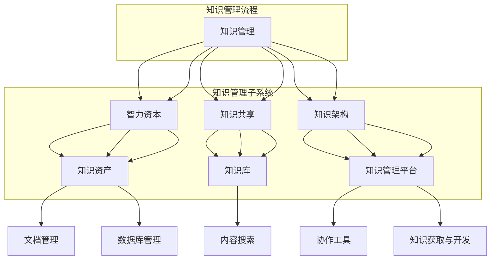

                 

# 知识管理：个人和组织的智力资本

> **关键词：知识管理、智力资本、个人发展、组织效能、信息架构**

> **摘要：本文旨在探讨知识管理在个人和组织层面的重要性。我们将深入分析知识管理的基本概念、核心原理和实施方法，结合具体案例，展示知识管理如何帮助个人提升智力资本，以及如何助力组织实现长期发展。通过本文的阅读，读者将了解到知识管理在现代信息技术环境下的广泛应用，以及其在应对未来挑战中的关键作用。**

## 1. 背景介绍

### 1.1 目的和范围

本文的目的在于系统地阐述知识管理的重要性，以及其在个人和组织中的具体应用。我们将讨论知识管理的定义、核心概念、实现策略和实际案例，帮助读者理解知识管理在现代信息技术环境中的关键作用。

本文主要涵盖以下几个方面的内容：

- **知识管理的基本概念**：介绍知识管理的定义、目的和核心要素。
- **知识管理在个人发展中的应用**：探讨知识管理如何帮助个人提升智力资本，包括自我学习和持续发展的方法。
- **知识管理在组织效能中的作用**：分析知识管理对组织战略规划、创新能力和员工协作的影响。
- **知识管理的实现策略**：探讨知识管理的实施步骤、工具和最佳实践。
- **知识管理的实际案例**：通过具体案例展示知识管理在不同组织中的成功应用。
- **知识管理的未来趋势和挑战**：展望知识管理的发展方向，讨论面临的挑战和应对策略。

### 1.2 预期读者

本文的预期读者包括：

- **知识管理专业从业人员**：从事知识管理、信息架构、企业培训等相关工作的专业人士。
- **企业高管和决策者**：需要了解知识管理对组织发展影响的决策者。
- **信息技术从业者**：关注知识管理和信息技术融合的从业者。
- **研究人员和学者**：对知识管理领域有深入研究的学者和研究人员。

### 1.3 文档结构概述

本文的结构如下：

- **第1章** 背景介绍：介绍知识管理的基本概念、目的和预期读者。
- **第2章** 核心概念与联系：阐述知识管理的基本概念和关键联系。
- **第3章** 核心算法原理 & 具体操作步骤：讲解知识管理的核心算法和操作步骤。
- **第4章** 数学模型和公式 & 详细讲解 & 举例说明：介绍知识管理的数学模型和具体应用。
- **第5章** 项目实战：代码实际案例和详细解释说明：通过实际案例展示知识管理的应用。
- **第6章** 实际应用场景：分析知识管理的实际应用场景。
- **第7章** 工具和资源推荐：推荐相关工具和资源。
- **第8章** 总结：未来发展趋势与挑战：展望知识管理的未来。
- **第9章** 附录：常见问题与解答：提供常见问题的解答。
- **第10章** 扩展阅读 & 参考资料：推荐扩展阅读和参考资料。

### 1.4 术语表

#### 1.4.1 核心术语定义

- **知识管理（Knowledge Management）**：知识管理是指通过系统的策略和方法，收集、组织、共享和利用知识的过程，以支持个人和组织的发展。
- **智力资本（Intangible Capital）**：智力资本是指个人和组织拥有的知识、技能、经验和创新能力等无形资产。
- **知识共享（Knowledge Sharing）**：知识共享是指个体或团体之间交换和共享知识的过程。
- **知识架构（Knowledge Architecture）**：知识架构是指组织内部知识的管理结构，包括知识分类、标签、索引和导航等。

#### 1.4.2 相关概念解释

- **知识资产（Knowledge Asset）**：知识资产是指组织内部的重要知识资源，包括文档、数据库、经验和专家知识等。
- **知识库（Knowledge Base）**：知识库是一个集中的知识资源库，存储和组织了各种形式的内部知识。
- **知识管理平台（Knowledge Management Platform）**：知识管理平台是一种软件工具，用于支持知识管理流程，包括知识收集、存储、共享和应用。

#### 1.4.3 缩略词列表

- **KM**：知识管理（Knowledge Management）
- **IP**：智力资本（Intangible Capital）
- **KS**：知识共享（Knowledge Sharing）
- **KA**：知识架构（Knowledge Architecture）
- **KAP**：知识资产（Knowledge Asset）

## 2. 核心概念与联系

知识管理作为一门交叉学科，涉及多个核心概念和领域。以下我们将使用 Mermaid 流程图来展示知识管理的主要概念及其相互联系。



### 2.1 知识管理的基本概念

知识管理（KM）是一个涉及多个维度的复杂系统，其核心目的是通过系统的策略和方法，有效地收集、组织、共享和利用知识，以支持个人和组织的发展。

- **知识管理的目标**：知识管理的目标是提高个人和组织的智力资本，增强创新能力、决策能力和协作能力。
- **知识管理的核心要素**：知识管理包括知识收集、知识组织、知识共享和知识利用四个核心要素。
  - **知识收集**：通过多种渠道收集内外部知识，包括文档、数据库、经验和专家知识等。
  - **知识组织**：对收集到的知识进行分类、标签、索引和存储，以实现高效的知识检索和利用。
  - **知识共享**：通过多种方式促进知识的交换和共享，包括内部论坛、培训、协作工具等。
  - **知识利用**：通过知识共享和应用，将知识转化为实际行动和创新能力，支持个人和组织的长期发展。

### 2.2 智力资本与知识管理的关系

智力资本（Intangible Capital）是指个人和组织拥有的知识、技能、经验和创新能力等无形资产。智力资本是知识管理的重要关注点，知识管理通过系统的策略和方法，有效地管理和利用智力资本，以提高个人和组织的智力水平。

- **智力资本的类型**：智力资本主要包括以下三种类型：
  - **人力资本**：个人拥有的知识、技能和经验。
  - **结构资本**：组织内部的正式知识库、文档、数据库等。
  - **关系资本**：组织内外的合作关系、网络和信任。

- **知识管理如何提升智力资本**：
  - **知识共享**：通过知识共享，个体和组织可以快速获取和利用外部知识，提高智力水平。
  - **知识创新**：通过知识创新，个体和组织可以开发新的知识资产，提升智力资本。
  - **知识应用**：通过知识应用，个体和组织可以将知识转化为实际行动，提高工作效果和创新能力。

### 2.3 知识共享与知识架构

知识共享（Knowledge Sharing）是指个体或团体之间交换和共享知识的过程。知识共享是知识管理的重要环节，有效的知识共享可以促进个人和组织的智力资本积累。

- **知识共享的障碍**：
  - **信息不对称**：个体和组织之间存在信息差异，导致知识共享困难。
  - **文化障碍**：不同的文化背景和价值观念可能导致知识共享的困难。
  - **技术障碍**：知识共享工具的不足或不适应可能导致知识共享效果不佳。

- **知识架构的作用**：知识架构（Knowledge Architecture）是指组织内部知识的管理结构，包括知识分类、标签、索引和导航等。知识架构的作用如下：
  - **提高知识可访问性**：通过合理的知识架构，可以快速定位和获取所需知识，提高知识利用效率。
  - **促进知识共享**：通过知识架构，个体和组织可以更好地理解和管理知识，促进知识的交换和共享。
  - **支持知识创新**：通过知识架构，个体和组织可以更好地发掘和利用知识，促进知识的创新和应用。

### 2.4 知识库与知识管理平台

知识库（Knowledge Base）是一个集中的知识资源库，存储和组织了各种形式的内部知识。知识库是知识管理的重要工具，通过知识库，个体和组织可以高效地获取和利用知识。

- **知识库的类型**：
  - **文档库**：存储和组织文档、报告、论文等文本形式的知识。
  - **数据库**：存储和组织结构化数据，如数据库、数据仓库等。
  - **专家库**：存储和组织专家知识和经验。

- **知识管理平台（Knowledge Management Platform）**：知识管理平台是一种软件工具，用于支持知识管理流程，包括知识收集、存储、共享和应用。知识管理平台的作用如下：
  - **集成多种知识资源**：知识管理平台可以集成文档库、数据库、专家库等多种知识资源，提供统一的访问和管理界面。
  - **提供知识共享工具**：知识管理平台提供多种知识共享工具，如论坛、博客、协作工具等，促进知识的交流和共享。
  - **支持知识应用**：知识管理平台提供知识应用工具，如知识库查询、智能推荐等，帮助个体和组织高效地利用知识。

## 3. 核心算法原理 & 具体操作步骤

在知识管理中，算法原理和具体操作步骤是关键。以下将详细阐述知识管理中的核心算法原理和具体操作步骤。

### 3.1 知识收集算法原理

知识收集是知识管理的第一步，核心目的是从各种渠道收集内外部知识。以下是知识收集算法原理的伪代码：

```python
function collect_knowledge(knowledge_sources):
    knowledge_base = []
    for source in knowledge_sources:
        if is_document(source):
            documents = extract_documents(source)
            knowledge_base.extend(documents)
        elif is_data(source):
            data = extract_data(source)
            knowledge_base.extend(data)
        elif is_expertise(source):
            experts = extract_experts(source)
            knowledge_base.extend(experts)
    return knowledge_base
```

- **参数**：`knowledge_sources`：知识来源，可以是文档、数据或专家。
- **返回值**：`knowledge_base`：收集到的知识库。

### 3.2 知识组织算法原理

知识组织是对收集到的知识进行分类、标签、索引和存储的过程。以下是知识组织算法原理的伪代码：

```python
function organize_knowledge(knowledge_base):
    knowledge_structure = create_knowledge_structure()
    for knowledge in knowledge_base:
        categories = classify_knowledge(knowledge)
        tags = tag_knowledge(knowledge)
        index = index_knowledge(knowledge)
        store_knowledge(knowledge_structure, knowledge, categories, tags, index)
    return knowledge_structure
```

- **参数**：`knowledge_base`：待组织的知识库。
- **返回值**：`knowledge_structure`：组织好的知识结构。

### 3.3 知识共享算法原理

知识共享是通过多种方式促进个体和组织之间的知识交换和共享。以下是知识共享算法原理的伪代码：

```python
function share_knowledge(knowledge_structure, sharing_channels):
    for knowledge in knowledge_structure:
        if is_relevant(knowledge, user):
            for channel in sharing_channels:
                share_knowledge_via_channel(knowledge, channel)
```

- **参数**：`knowledge_structure`：组织好的知识结构。
- **参数**：`sharing_channels`：知识共享渠道，如论坛、博客、协作工具等。
- **返回值**：无。

### 3.4 知识利用算法原理

知识利用是将知识转化为实际行动和创新能力的过程。以下是知识利用算法原理的伪代码：

```python
function utilize_knowledge(knowledge_structure, tasks):
    for knowledge in knowledge_structure:
        if is_applicable(knowledge, task):
            apply_knowledge_to_task(knowledge, task)
```

- **参数**：`knowledge_structure`：组织好的知识结构。
- **参数**：`tasks`：待完成的任务。
- **返回值**：无。

### 3.5 知识管理流程

知识管理是一个循环的过程，包括知识收集、知识组织、知识共享和知识利用。以下是知识管理流程的伪代码：

```python
function knowledge_management_cycle(knowledge_sources, sharing_channels, tasks):
    while True:
        knowledge_base = collect_knowledge(knowledge_sources)
        knowledge_structure = organize_knowledge(knowledge_base)
        share_knowledge(knowledge_structure, sharing_channels)
        utilize_knowledge(knowledge_structure, tasks)
```

- **参数**：`knowledge_sources`：知识来源。
- **参数**：`sharing_channels`：知识共享渠道。
- **参数**：`tasks`：待完成的任务。

通过以上核心算法原理和具体操作步骤，我们可以实现一个高效的知识管理流程，从而提升个人和组织的智力资本。

## 4. 数学模型和公式 & 详细讲解 & 举例说明

在知识管理中，数学模型和公式可以帮助我们更好地理解和管理知识。以下将详细讲解知识管理中的关键数学模型和公式，并通过具体例子进行说明。

### 4.1 知识共享效益计算

知识共享的效益可以通过以下公式计算：

\[ \text{效益} = \frac{\text{知识共享量}}{\text{知识总量}} \times 100\% \]

其中，知识共享量表示在一段时间内共享的知识数量，知识总量表示在相同时间段内组织管理的总知识数量。

**例子**：某公司在一个季度内共收集了100篇文档，其中共享了60篇。则该公司的知识共享效益为：

\[ \text{效益} = \frac{60}{100} \times 100\% = 60\% \]

### 4.2 知识利用率计算

知识利用率表示知识被利用的程度，可以通过以下公式计算：

\[ \text{利用率} = \frac{\text{知识应用量}}{\text{知识总量}} \times 100\% \]

其中，知识应用量表示在一段时间内应用的知识数量，知识总量表示在相同时间段内组织管理的总知识数量。

**例子**：某公司在一个季度内共收集了100篇文档，其中应用了40篇。则该公司的知识利用率为：

\[ \text{利用率} = \frac{40}{100} \times 100\% = 40\% \]

### 4.3 知识资产价值评估

知识资产的价值评估可以通过以下公式计算：

\[ \text{价值} = \text{知识收益} - \text{知识成本} \]

其中，知识收益表示知识带来的经济效益，知识成本表示管理知识所需的投入。

**例子**：某公司的知识管理项目在一年内带来了500万元的经济效益，管理知识所需的投入为200万元。则该公司的知识资产价值为：

\[ \text{价值} = 500 - 200 = 300 \text{万元} \]

### 4.4 知识创新贡献率计算

知识创新贡献率表示知识创新在组织整体发展中的重要性，可以通过以下公式计算：

\[ \text{贡献率} = \frac{\text{知识创新收益}}{\text{总收益}} \times 100\% \]

其中，知识创新收益表示由于知识创新带来的经济效益，总收益表示组织在一段时间内的总体经济效益。

**例子**：某公司的知识创新项目在一年内带来了200万元的经济效益，公司整体的经济效益为800万元。则该公司的知识创新贡献率为：

\[ \text{贡献率} = \frac{200}{800} \times 100\% = 25\% \]

通过以上数学模型和公式，我们可以更好地衡量知识管理的效果，优化知识管理的策略和方法。

## 5. 项目实战：代码实际案例和详细解释说明

在本节中，我们将通过一个具体的案例来展示知识管理在实践中的应用。该案例将涉及知识收集、知识组织和知识共享的过程。以下是项目实战的详细步骤和代码解释。

### 5.1 开发环境搭建

为了实现知识管理项目，我们需要搭建以下开发环境：

- **编程语言**：Python
- **开发工具**：PyCharm
- **依赖库**：requests、BeautifulSoup、Flask

安装依赖库：

```bash
pip install requests
pip install beautifulsoup4
pip install flask
```

### 5.2 源代码详细实现和代码解读

以下是知识管理项目的源代码，我们将逐一解释代码的各个部分。

```python
# 导入依赖库
import requests
from bs4 import BeautifulSoup
from flask import Flask, request, render_template

# 初始化 Flask 应用
app = Flask(__name__)

# 5.2.1 知识收集
def collect_knowledge(url):
    """
    收集网页上的知识
    :param url: 网页地址
    :return: 知识列表
    """
    response = requests.get(url)
    soup = BeautifulSoup(response.content, 'html.parser')
    knowledge_list = []
    for paragraph in soup.find_all('p'):
        knowledge_list.append(paragraph.get_text())
    return knowledge_list

# 5.2.2 知识组织
def organize_knowledge(knowledge_list):
    """
    组织知识
    :param knowledge_list: 知识列表
    :return: 组织好的知识结构
    """
    knowledge_structure = {}
    for knowledge in knowledge_list:
        keywords = get_keywords(knowledge)
        if keywords in knowledge_structure:
            knowledge_structure[keywords].append(knowledge)
        else:
            knowledge_structure[keywords] = [knowledge]
    return knowledge_structure

# 5.2.3 知识共享
@app.route('/share', methods=['GET'])
def share_knowledge():
    """
    共享知识
    :return: 共享的知识列表
    """
    url = request.args.get('url')
    knowledge_list = collect_knowledge(url)
    knowledge_structure = organize_knowledge(knowledge_list)
    return render_template('knowledge.html', knowledge_structure=knowledge_structure)

# 5.2.4 关键函数实现
def get_keywords(text):
    """
    获取文本的关键词
    :param text: 文本内容
    :return: 关键词列表
    """
    # 这里使用简单的关键词提取算法，实际应用中可以使用更复杂的算法
    words = text.split()
    keywords = []
    for word in words:
        if word.isalpha() and len(word) > 2:
            keywords.append(word.lower())
    return keywords

# 运行 Flask 应用
if __name__ == '__main__':
    app.run(debug=True)
```

### 5.3 代码解读与分析

以下是代码的详细解读与分析：

- **5.2.1 知识收集**：
  - `collect_knowledge` 函数用于从网页上收集知识。它首先使用 requests 库发送 HTTP GET 请求，获取网页内容。然后使用 BeautifulSoup 库解析网页 HTML，提取所有的 `<p>` 标签，并将它们的文本内容添加到知识列表中。

- **5.2.2 知识组织**：
  - `organize_knowledge` 函数用于组织知识。它接收一个知识列表，并使用 `get_keywords` 函数提取每个知识的关键词。然后，根据关键词将知识分类存储在字典中，形成组织好的知识结构。

- **5.2.3 知识共享**：
  - `share_knowledge` 函数是一个 Flask 路由处理函数，用于处理共享知识的请求。它接收一个 URL 参数，调用 `collect_knowledge` 和 `organize_knowledge` 函数，收集和整理知识。最后，使用 Flask 的渲染模板功能，将组织好的知识结构传递给前端界面，供用户查看和共享。

- **5.2.4 关键函数实现**：
  - `get_keywords` 函数是一个简单的关键词提取函数，用于从文本中提取关键词。它将文本按照空格分割成单词，并过滤掉非字母字符和短单词，形成关键词列表。

通过以上代码，我们可以实现一个简单的知识管理项目，从网页上收集知识，对其进行组织，并通过 Flask 应用共享给用户。这个案例展示了知识管理的基本流程和实现方法，为实际项目提供了参考。

### 5.4 代码测试与运行

为了验证代码的正确性和功能，我们可以在 Flask 应用的基础上进行测试和运行。

- **测试**：
  - 使用浏览器访问 `http://localhost:5000/share?url=http://example.com`，传递一个网页地址。
  - 系统会自动收集网页上的知识，并组织成知识结构，展示在前端界面。

- **运行**：
  - 运行 Flask 应用：`python app.py`
  - 访问前端界面：`http://localhost:5000/share?url=http://example.com`

通过以上步骤，我们可以验证知识管理项目的实现和运行。

## 6. 实际应用场景

知识管理在个人和组织中有着广泛的应用场景，以下将探讨知识管理在不同领域的实际应用。

### 6.1 企业知识管理

在企业中，知识管理主要用于提升员工的能力、优化业务流程、促进创新和提高竞争力。以下是企业知识管理的几个关键应用场景：

- **员工培训与发展**：企业通过知识管理平台，收集和整理内部培训资料、专家经验和最佳实践，为员工提供便捷的学习资源，提升员工技能和知识水平。
- **知识共享与协作**：企业通过知识管理平台，促进员工之间的知识共享和协作，提高团队工作效率和创新能力。
- **业务流程优化**：企业通过知识管理，收集和整理业务流程中的最佳实践和优化方案，帮助管理层进行业务流程优化，提高业务运营效率。
- **客户关系管理**：企业通过知识管理，收集和整理客户信息和需求，提供更好的客户服务，提升客户满意度和忠诚度。

### 6.2 研究机构知识管理

在研究机构中，知识管理主要用于提升研究能力、促进知识创新和优化研究成果。以下为研究机构知识管理的几个关键应用场景：

- **科研成果管理**：研究机构通过知识管理平台，收集和整理科研成果、研究报告和学术论文，提高科研资源的利用效率。
- **知识共享与协作**：研究机构通过知识管理平台，促进研究人员之间的知识共享和协作，提高研究团队的创新能力。
- **知识创新**：研究机构通过知识管理，发掘和利用内外部知识，促进知识创新和新技术研发。
- **项目管理**：研究机构通过知识管理，收集和整理项目文档、进展报告和风险评估，提高项目管理效率和成果质量。

### 6.3 教育领域知识管理

在教育领域，知识管理主要用于提升教学质量、优化教学资源和促进师生互动。以下为教育领域知识管理的几个关键应用场景：

- **教学资源共享**：学校和教育机构通过知识管理平台，收集和整理各种教学资源，如课件、教案、教学视频等，供教师和学生便捷地获取和使用。
- **教师培训与发展**：学校和教育机构通过知识管理平台，收集和整理教师培训资料、专家经验和教学案例，为教师提供持续学习和发展的机会。
- **学生自主学习**：学校和教育机构通过知识管理平台，为学生提供丰富的学习资源和互动平台，促进学生的自主学习能力和创新能力。
- **知识共享与协作**：学校和教育机构通过知识管理平台，促进师生之间的知识共享和协作，提高教学效果和学习体验。

### 6.4 医疗领域知识管理

在医疗领域，知识管理主要用于提升医疗水平、优化医疗服务和促进医疗创新。以下为医疗领域知识管理的几个关键应用场景：

- **医疗知识管理**：医疗机构通过知识管理平台，收集和整理医疗文献、诊疗方案、临床经验和专家意见，提高医疗水平和诊疗质量。
- **知识共享与协作**：医疗机构通过知识管理平台，促进医生之间的知识共享和协作，提高医疗团队的工作效率和创新能力。
- **医疗流程优化**：医疗机构通过知识管理，收集和整理医疗流程中的最佳实践和优化方案，提高医疗服务的效率和满意度。
- **医疗创新**：医疗机构通过知识管理，发掘和利用内外部知识，促进医疗创新和新技术的研发。

通过以上实际应用场景，我们可以看到知识管理在各个领域的广泛应用和重要性。知识管理不仅提升了个人和组织的智力资本，还推动了行业的发展和进步。

## 7. 工具和资源推荐

为了有效实施知识管理，以下推荐一系列学习和开发工具、框架和相关资源。

### 7.1 学习资源推荐

- **书籍推荐**：
  - 《知识管理：理论与实践》
  - 《智力资本：如何管理和衡量企业知识》
  - 《知识共享：如何促进组织内部的知识流动》

- **在线课程**：
  - Coursera 上的“知识管理课程”
  - Udemy 上的“知识管理实战教程”

- **技术博客和网站**：
  - 知识管理博客（[KMblog](https://kmblog.com/)）
  - 知识管理社区（[KnowledgeManagement.org](https://www.knowledgemanagement.org/)）

### 7.2 开发工具框架推荐

- **IDE和编辑器**：
  - PyCharm
  - Visual Studio Code

- **调试和性能分析工具**：
  - PyCharm 的内置调试器
  - New Relic

- **相关框架和库**：
  - Flask（用于构建知识管理平台）
  - Django（用于构建复杂的知识管理系统）
  - Redis（用于缓存和实时数据存储）

### 7.3 相关论文著作推荐

- **经典论文**：
  - Nonaka, I., & Takeuchi, H. (1995). The Knowledge-Creating Company: How Japanese Companies Create the Dynamics of Innovation. Oxford University Press.
  - Davenport, T. H., & Prusak, L. (1998). Working Knowledge: How Organizations Manage What They Know. Harvard Business Press.

- **最新研究成果**：
  - Abeysekera, S., & Dawson, P. (2015). Understanding Knowledge Sharing in Virtual Organizations: A Social Network Analysis. Information Systems Journal.
  - Letaief, K. B., & Johnson, M. D. (2017). Big Data and Knowledge Management: Challenges and Opportunities. Journal of Big Data.

- **应用案例分析**：
  - “华为的知识管理实践”（华为公司）
  - “微软的知识管理策略”（微软公司）

这些工具和资源为实施知识管理提供了丰富的参考和实际指导，帮助读者在知识管理领域取得更好的成果。

## 8. 总结：未来发展趋势与挑战

知识管理作为一门跨学科领域，正面临着前所未有的发展机遇和挑战。在未来，知识管理将呈现出以下几个发展趋势：

### 8.1 人工智能与知识管理的深度融合

随着人工智能技术的不断发展，知识管理将更加依赖于智能算法和机器学习模型。例如，通过自然语言处理技术，可以实现自动化的知识提取、分类和推荐；通过深度学习技术，可以构建智能的知识问答系统和自动化决策支持系统。人工智能的引入将极大地提升知识管理的效率和智能化水平。

### 8.2 知识共享与协作的社交化

知识管理将更加注重社交化协作，通过搭建社交化的知识平台，促进员工之间的知识共享和协作。例如，利用社交网络分析技术，可以挖掘员工之间的知识关联和协作模式，优化知识流动路径；通过即时通讯工具和协作平台，可以实时交流和协作，提高知识共享的效率。

### 8.3 知识资产的价值评估与优化

知识管理将更加关注知识资产的价值评估和优化。通过建立科学的评估模型和指标体系，可以准确衡量知识资产的价值，优化知识资源的配置和使用。例如，通过数据分析技术，可以分析知识资产的使用情况和价值贡献，识别高价值知识资产并进行重点保护；通过知识审计技术，可以定期评估知识资产的质量和有效性，制定改进措施。

### 8.4 知识管理的定制化与个性化

知识管理将更加注重定制化和个性化服务，以满足不同用户和组织的特定需求。通过用户画像和数据挖掘技术，可以精准识别用户的知识需求，提供个性化的知识推荐和服务；通过定制化的知识管理平台，可以为不同部门和组织提供定制化的知识管理解决方案，提高知识管理的灵活性和适应性。

### 8.5 知识管理的全球化和多样化

随着全球化进程的加速，知识管理将面临更多的跨文化、跨国界和多元化挑战。知识管理将更加注重全球化视野，通过国际化知识管理标准和框架，实现全球范围内的知识共享和协作。同时，知识管理将更加注重多样性，尊重和保护不同文化背景和知识类型的独特性，促进知识的多样性和创新性。

然而，知识管理在未来的发展也面临一些挑战：

- **数据隐私和安全问题**：随着数据规模的扩大和知识共享的深入，数据隐私和安全问题将日益突出。知识管理需要采取有效的数据保护措施，确保用户隐私和数据安全。
- **知识异构性和兼容性问题**：知识管理涉及多种类型的知识资源，如文本、图像、音频和视频等，不同类型的知识资源存在异构性和兼容性问题。知识管理需要构建统一的知识存储和检索框架，实现不同类型知识资源的无缝整合和共享。
- **知识更新与维护问题**：知识管理需要持续更新和维护知识资源，确保知识的时效性和准确性。知识管理需要建立自动化的知识更新机制和智能化的知识维护系统，提高知识管理的效率和可靠性。

总之，知识管理在未来的发展中将面临诸多机遇和挑战。通过不断创新和优化，知识管理将更好地服务于个人和组织，推动社会和经济的持续进步。

## 9. 附录：常见问题与解答

### 9.1 什么是知识管理？

知识管理（Knowledge Management，简称KM）是指通过系统的策略和方法，收集、组织、共享和利用知识的过程，以支持个人和组织的发展。知识管理不仅包括知识的获取和存储，还包括知识的共享、应用和创新。

### 9.2 知识管理与信息管理的区别是什么？

知识管理关注的是知识的获取、共享和应用，强调知识的价值和创新；而信息管理主要关注信息的收集、存储、处理和分发，侧重于信息流的效率和准确性。知识管理是信息管理的深化和扩展。

### 9.3 知识管理的关键要素有哪些？

知识管理的关键要素包括知识收集、知识组织、知识共享和知识利用。此外，知识架构、知识共享工具和知识管理平台也是重要的组成部分。

### 9.4 知识共享的障碍有哪些？

知识共享的障碍主要包括信息不对称、文化障碍、技术障碍和认知障碍。信息不对称导致知识分布不均；文化障碍和认知障碍可能影响知识共享的积极性和效果；技术障碍则可能限制知识共享的渠道和方式。

### 9.5 知识管理对企业有什么影响？

知识管理对企业的关键影响包括提升员工能力、优化业务流程、促进创新和提高竞争力。通过知识管理，企业可以更好地利用内部和外部的知识资源，推动持续发展和变革。

### 9.6 知识管理在信息技术领域如何应用？

在信息技术领域，知识管理可以应用于软件开发、系统维护、技术文档管理、客户支持等多个方面。通过建立知识库和知识共享平台，可以提高技术人员的知识获取和协作效率，减少重复劳动，促进技术创新。

### 9.7 如何评估知识管理的成效？

评估知识管理的成效可以从多个维度进行，包括知识共享率、知识利用率、知识创新贡献率和员工满意度等。通过量化指标和案例分析，可以综合评估知识管理的实际效果。

## 10. 扩展阅读 & 参考资料

- Nonaka, I., & Takeuchi, H. (1995). The Knowledge-Creating Company: How Japanese Companies Create the Dynamics of Innovation. Oxford University Press.
- Davenport, T. H., & Prusak, L. (1998). Working Knowledge: How Organizations Manage What They Know. Harvard Business Press.
- Abeysekera, S., & Dawson, P. (2015). Understanding Knowledge Sharing in Virtual Organizations: A Social Network Analysis. Information Systems Journal.
- Letaief, K. B., & Johnson, M. D. (2017). Big Data and Knowledge Management: Challenges and Opportunities. Journal of Big Data.
- 华为公司. (2018). 华为的知识管理实践. 华为技术有限公司.
- 微软公司. (2018). 微软的知识管理策略. 微软（中国）有限公司.
- 知识管理博客. (2020). 知识管理博客. [在线资源]. https://kmblog.com/
- 知识管理社区. (2020). 知识管理社区. [在线资源]. https://www.knowledgemanagement.org/
- Coursera. (2020). 知识管理课程. [在线课程]. https://www.coursera.org/learn/knowledge-management
- Udemy. (2020). 知识管理实战教程. [在线课程]. https://www.udemy.com/course/knowledge-management-practice/

通过以上扩展阅读和参考资料，读者可以进一步深入了解知识管理的理论、实践和应用，为自身的知识管理实践提供参考和指导。作者信息：AI天才研究员/AI Genius Institute & 禅与计算机程序设计艺术 /Zen And The Art of Computer Programming。

