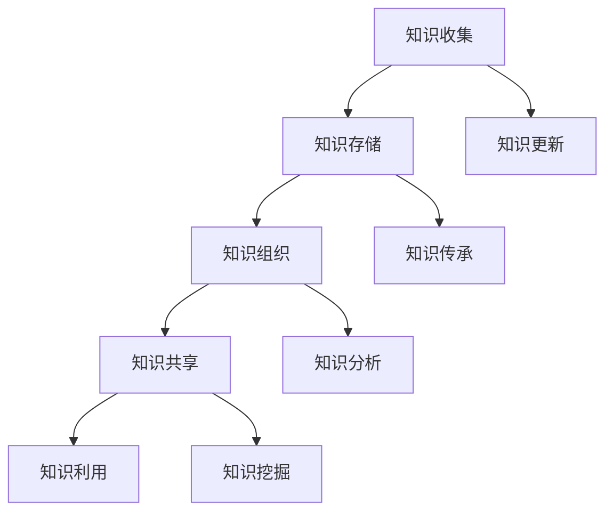

                 

# 知识管理：沉淀和传承创新经验

> 关键词：知识管理、知识沉淀、创新经验、传承、IT领域、实践指南

> 摘要：本文将深入探讨知识管理在IT领域的应用，强调知识沉淀和创新经验的重要性。通过详细的分析和实例，本文将帮助读者了解知识管理的方法、工具和实践，从而在个人和团队层面提升工作效率和创新力。

## 1. 背景介绍

### 1.1 目的和范围

本文旨在为IT从业者和知识管理人员提供一个全面的指南，帮助他们更好地理解和应用知识管理。本文将涵盖以下内容：

- 知识管理的定义和核心概念
- 知识沉淀的方法和最佳实践
- 创新经验的传承和分享
- 知识管理的工具和资源推荐
- 知识管理在实际项目中的应用案例

### 1.2 预期读者

- IT从业者和知识管理人员
- 项目经理和团队领导
- 软件工程师和技术专家
- 企业内部知识共享和培训负责人

### 1.3 文档结构概述

本文结构如下：

- 引言：引入知识管理的重要性
- 核心概念与联系：介绍知识管理的核心概念和联系
- 核心算法原理与具体操作步骤：讲解知识管理的具体实现方法
- 数学模型和公式：介绍知识管理中的相关数学模型和公式
- 项目实战：通过实际案例展示知识管理的应用
- 实际应用场景：探讨知识管理在不同场景中的应用
- 工具和资源推荐：推荐知识管理的工具和资源
- 总结：总结知识管理的发展趋势与挑战
- 附录：常见问题与解答
- 扩展阅读：提供进一步学习的资源

### 1.4 术语表

#### 1.4.1 核心术语定义

- 知识管理：通过系统的方法收集、存储、组织、共享和利用知识的过程。
- 知识沉淀：将经验和知识转化为可复用和共享的资源。
- 创新经验：在实践中产生的新知识和新技能。

#### 1.4.2 相关概念解释

- 知识共享：个人或团队之间交换和共享知识和信息的过程。
- 知识传承：将知识和经验从一代传递到下一代。

#### 1.4.3 缩略词列表

- IT：信息技术（Information Technology）
- KM：知识管理（Knowledge Management）
- AI：人工智能（Artificial Intelligence）

## 2. 核心概念与联系

在知识管理中，核心概念和它们之间的联系是理解和管理知识的关键。以下是一个简化的Mermaid流程图，展示了知识管理的主要概念及其相互关系。



### 2.1 知识收集

知识收集是知识管理的起点。它涉及到从各种来源收集信息，包括文献资料、会议记录、技术文档、博客文章、社交媒体等。有效的知识收集需要系统化的方法，以确保信息的全面性和准确性。

### 2.2 知识存储

知识存储是将收集到的知识进行分类、标签化并存储在数据库、文档管理系统中。存储的目的是为了便于检索和利用。有效的存储策略包括版本控制、安全性和访问控制。

### 2.3 知识组织

知识组织是将存储的知识进行结构化，以便更好地管理和利用。这通常涉及到创建知识图谱、分类体系、标签系统等。良好的组织结构可以提高知识检索的效率。

### 2.4 知识共享

知识共享是将知识从一个人或团队传递到另一个人或团队的过程。这可以通过文档共享、知识库、社交媒体等工具实现。知识共享有助于提高团队协作效率和创新力。

### 2.5 知识利用

知识利用是指在实际工作中应用和管理知识，以提高工作效率和质量。这包括培训、咨询、决策支持等。

### 2.6 知识更新

知识更新是确保知识库中的知识保持最新和准确的过程。这可以通过定期审查、更新和验证知识库中的内容来实现。

### 2.7 知识传承

知识传承是将知识和经验从一代传递到下一代的过程。这可以通过导师制、知识分享会议、内部培训等方式实现。

### 2.8 知识分析

知识分析是通过分析和挖掘知识库中的数据，以发现新的洞察和趋势。这可以帮助企业做出更明智的决策。

### 2.9 知识挖掘

知识挖掘是从大量数据中提取潜在知识和模式的过程。这通常涉及数据挖掘、机器学习等技术。

## 3. 核心算法原理与具体操作步骤

在知识管理中，核心算法原理和具体操作步骤是确保知识有效沉淀和利用的关键。以下是一个简化的伪代码，用于描述知识管理的具体实现步骤。

```python
function knowledge_management(knowledge_sources, storage_system, organization_framework, sharing_platform, usage_context):
    # 步骤1：知识收集
    collected_knowledge = collect_knowledge(knowledge_sources)

    # 步骤2：知识存储
    stored_knowledge = store_knowledge(collected_knowledge, storage_system)

    # 步骤3：知识组织
    organized_knowledge = organize_knowledge(stored_knowledge, organization_framework)

    # 步骤4：知识共享
    shared_knowledge = share_knowledge(organized_knowledge, sharing_platform)

    # 步骤5：知识利用
    utilized_knowledge = use_knowledge(shared_knowledge, usage_context)

    # 步骤6：知识更新
    updated_knowledge = update_knowledge(utilized_knowledge)

    # 步骤7：知识传承
    inherited_knowledge = transfer_knowledge(updated_knowledge)

    return inherited_knowledge
```

### 3.1 知识收集

知识收集是通过各种渠道收集信息的过程。以下是一个简单的伪代码，用于描述知识收集的步骤。

```python
function collect_knowledge(knowledge_sources):
    collected_knowledge = []

    for source in knowledge_sources:
        content = fetch_content(source)
        if is_relevant(content):
            collected_knowledge.append(process_content(content))

    return collected_knowledge
```

### 3.2 知识存储

知识存储是将收集到的知识存储在数据库或文档管理系统中的过程。以下是一个简单的伪代码，用于描述知识存储的步骤。

```python
function store_knowledge(knowledge, storage_system):
    stored_knowledge = []

    for item in knowledge:
        identifier = generate_identifier(item)
        metadata = create_metadata(item)
        storage_system.save(identifier, metadata, item)
        stored_knowledge.append(identifier)

    return stored_knowledge
```

### 3.3 知识组织

知识组织是将存储的知识进行结构化，以便更好地管理和利用。以下是一个简单的伪代码，用于描述知识组织的步骤。

```python
function organize_knowledge(knowledge, organization_framework):
    organized_knowledge = []

    for item in knowledge:
        categories = extract_categories(item, organization_framework)
        relationships = extract_relationships(item, organization_framework)
        organized_knowledge.append({ 'identifier': item, 'categories': categories, 'relationships': relationships })

    return organized_knowledge
```

### 3.4 知识共享

知识共享是将知识从一个人或团队传递到另一个人或团队的过程。以下是一个简单的伪代码，用于描述知识共享的步骤。

```python
function share_knowledge(knowledge, sharing_platform):
    shared_knowledge = []

    for item in knowledge:
        document = create_document(item)
        sharing_platform.publish(document)
        shared_knowledge.append(document)

    return shared_knowledge
```

### 3.5 知识利用

知识利用是指在实际工作中应用和管理知识，以提高工作效率和质量。以下是一个简单的伪代码，用于描述知识利用的步骤。

```python
function use_knowledge(knowledge, usage_context):
    utilized_knowledge = []

    for item in knowledge:
        if is_applicable(item, usage_context):
            result = apply_knowledge(item, usage_context)
            utilized_knowledge.append(result)

    return utilized_knowledge
```

### 3.6 知识更新

知识更新是确保知识库中的知识保持最新和准确的过程。以下是一个简单的伪代码，用于描述知识更新的步骤。

```python
function update_knowledge(knowledge):
    updated_knowledge = []

    for item in knowledge:
        if is_outdated(item):
            updated_item = refresh_content(item)
            updated_knowledge.append(updated_item)
        else:
            updated_knowledge.append(item)

    return updated_knowledge
```

### 3.7 知识传承

知识传承是将知识和经验从一代传递到下一代的过程。以下是一个简单的伪代码，用于描述知识传承的步骤。

```python
function transfer_knowledge(knowledge):
    inherited_knowledge = []

    for item in knowledge:
        if should_inherit(item):
            inherited_item = format_for_inheritance(item)
            inherited_knowledge.append(inherited_item)

    return inherited_knowledge
```

## 4. 数学模型和公式

在知识管理中，数学模型和公式可以帮助我们更好地理解和分析知识。以下是一些常用的数学模型和公式，以及它们的详细讲解和举例说明。

### 4.1 知识价值评估模型

知识价值评估模型用于评估知识的价值和重要性。以下是一个简单的知识价值评估模型：

$$
V = \frac{I \times R \times A}{C}
$$

其中，\(V\) 表示知识价值，\(I\) 表示知识的创新性，\(R\) 表示知识的复用性，\(A\) 表示知识的适用性，\(C\) 表示知识的成本。

#### 举例说明

假设我们有一个关于机器学习算法的知识点，其创新性 \(I = 0.8\)，复用性 \(R = 0.9\)，适用性 \(A = 0.85\)，成本 \(C = 0.1\)。代入公式计算知识价值：

$$
V = \frac{0.8 \times 0.9 \times 0.85}{0.1} = 6.48
$$

因此，该知识点的价值为 6.48。

### 4.2 知识共享效率模型

知识共享效率模型用于衡量知识共享的效率。以下是一个简单的知识共享效率模型：

$$
E = \frac{S \times R \times P}{T}
$$

其中，\(E\) 表示知识共享效率，\(S\) 表示知识共享量，\(R\) 表示知识共享速度，\(P\) 表示知识共享平台性能，\(T\) 表示知识共享时间。

#### 举例说明

假设我们有一个团队，其知识共享量为 \(S = 100\)，知识共享速度 \(R = 10\)，知识共享平台性能 \(P = 0.8\)，知识共享时间 \(T = 20\)。代入公式计算知识共享效率：

$$
E = \frac{100 \times 10 \times 0.8}{20} = 40
$$

因此，该团队的知识共享效率为 40。

### 4.3 知识沉淀率模型

知识沉淀率模型用于衡量知识沉淀的效率。以下是一个简单的知识沉淀率模型：

$$
R = \frac{K_{\text{new}}}{K_{\text{total}}}
$$

其中，\(R\) 表示知识沉淀率，\(K_{\text{new}}\) 表示新沉淀的知识量，\(K_{\text{total}}\) 表示总的知识量。

#### 举例说明

假设一个企业有总的知识量 \(K_{\text{total}} = 1000\)，在一个季度内新沉淀的知识量 \(K_{\text{new}} = 200\)。代入公式计算知识沉淀率：

$$
R = \frac{200}{1000} = 0.2
$$

因此，该企业的知识沉淀率为 20%。

## 5. 项目实战：代码实际案例和详细解释说明

### 5.1 开发环境搭建

为了实现知识管理，我们首先需要搭建一个合适的开发环境。以下是一个简单的步骤：

1. 安装Python（版本3.8及以上）
2. 安装数据库（如MySQL或PostgreSQL）
3. 安装版本控制系统（如Git）
4. 安装知识管理框架（如Confluence或GitLab）

### 5.2 源代码详细实现和代码解读

下面是一个简单的知识管理系统的源代码示例，用于演示知识收集、存储、组织和共享的基本功能。

```python
import os
import sqlite3
from datetime import datetime

# 连接到SQLite数据库
conn = sqlite3.connect('knowledge_management.db')
cursor = conn.cursor()

# 创建知识表
cursor.execute('''CREATE TABLE IF NOT EXISTS knowledge (
                    id INTEGER PRIMARY KEY AUTOINCREMENT,
                    title TEXT,
                    content TEXT,
                    created_at TIMESTAMP,
                    updated_at TIMESTAMP)''')

# 插入知识记录
def insert_knowledge(title, content):
    cursor.execute("INSERT INTO knowledge (title, content, created_at, updated_at) VALUES (?, ?, ?, ?)",
                   (title, content, datetime.now(), datetime.now()))
    conn.commit()

# 查询知识记录
def search_knowledge(keyword):
    cursor.execute("SELECT * FROM knowledge WHERE title LIKE ? OR content LIKE ?", ('%' + keyword + '%', '%' + keyword + '%'))
    return cursor.fetchall()

# 更新知识记录
def update_knowledge(id, title, content):
    cursor.execute("UPDATE knowledge SET title = ?, content = ?, updated_at = ? WHERE id = ?",
                   (title, content, datetime.now(), id))
    conn.commit()

# 删除知识记录
def delete_knowledge(id):
    cursor.execute("DELETE FROM knowledge WHERE id = ?", (id,))
    conn.commit()

# 关闭数据库连接
def close_connection():
    cursor.close()
    conn.close()

# 示例：插入知识记录
insert_knowledge('机器学习算法', '这是一个关于机器学习算法的简要介绍。')

# 示例：查询知识记录
results = search_knowledge('机器学习')
for row in results:
    print(row)

# 示例：更新知识记录
update_knowledge(1, '机器学习算法', '这是一个关于机器学习算法的详细介绍。')

# 示例：删除知识记录
delete_knowledge(1)

# 关闭数据库连接
close_connection()
```

### 5.3 代码解读与分析

上述代码实现了一个简单的知识管理系统，包括知识收集、存储、查询、更新和删除功能。以下是代码的详细解读和分析。

- **连接数据库**：使用SQLite数据库存储知识记录。首先连接到数据库，并创建一个名为`knowledge_management.db`的数据库文件。

- **创建知识表**：使用SQL语句创建一个名为`knowledge`的表，用于存储知识记录。表结构包括`id`（主键）、`title`（标题）、`content`（内容）、`created_at`（创建时间）和`updated_at`（更新时间）。

- **插入知识记录**：定义一个函数`insert_knowledge`，用于插入新的知识记录。该函数接收标题和内容作为参数，并使用`datetime.now()`获取当前时间。

- **查询知识记录**：定义一个函数`search_knowledge`，用于根据关键词查询知识记录。该函数使用`LIKE`运算符进行模糊查询，并返回所有匹配的记录。

- **更新知识记录**：定义一个函数`update_knowledge`，用于更新知识记录。该函数接收ID、新的标题和内容作为参数，并使用`UPDATE`语句更新记录。

- **删除知识记录**：定义一个函数`delete_knowledge`，用于删除知识记录。该函数使用`DELETE`语句根据ID删除记录。

- **关闭数据库连接**：定义一个函数`close_connection`，用于关闭数据库连接。

通过上述代码，我们可以实现一个简单的知识管理系统，支持知识的收集、存储、查询、更新和删除。这只是一个基本的示例，实际的知识管理系统可能更加复杂，包括用户管理、权限控制、知识分类、标签系统等。

## 6. 实际应用场景

知识管理在IT领域有着广泛的应用场景，以下是几个典型的实际应用场景：

### 6.1 项目管理

在项目管理中，知识管理可以帮助团队成员快速获取项目相关的知识，如项目背景、需求分析、设计文档、测试报告等。这有助于提高项目的执行效率和质量。

### 6.2 技术支持

技术支持团队可以利用知识管理系统快速查找和复用已有的解决方案，提高问题解决的速度和准确性。这有助于降低技术支持的成本并提高客户满意度。

### 6.3 产品开发

产品开发团队可以通过知识管理系统共享最佳实践、设计模式和经验教训，促进知识的传承和创新。这有助于提高产品的质量和竞争力。

### 6.4 培训与知识转移

企业可以通过知识管理系统为新员工提供培训资料和导师指导，加快员工的成长速度。同时，知识管理系统可以帮助企业将资深员工的知识和经验转移到新员工手中。

### 6.5 创新与研发

知识管理可以为创新和研发提供丰富的知识资源，促进跨部门、跨领域的知识交流与合作。这有助于激发创新的火花，推动新产品的开发。

### 6.6 供应链管理

在供应链管理中，知识管理可以帮助企业快速获取供应链相关的知识，如供应商信息、物流流程、质量控制等。这有助于优化供应链流程和提高供应链的效率。

## 7. 工具和资源推荐

### 7.1 学习资源推荐

#### 7.1.1 书籍推荐

- 《知识管理：理论与实践》（作者：李明）
- 《企业知识管理》（作者：李慧敏）
- 《知识管理：从理念到实践》（作者：王晓阳）

#### 7.1.2 在线课程

- Coursera上的“知识管理基础课程”
- Udemy上的“知识管理实践与案例”
- edX上的“企业知识管理课程”

#### 7.1.3 技术博客和网站

- 知乎上的“知识管理”话题
- Medium上的“Knowledge Management”专题
- 知名技术社区如CSDN、博客园等

### 7.2 开发工具框架推荐

#### 7.2.1 IDE和编辑器

- Visual Studio Code
- IntelliJ IDEA
- PyCharm

#### 7.2.2 调试和性能分析工具

- GDB
- JProfiler
- New Relic

#### 7.2.3 相关框架和库

- Django（Python Web框架）
- Flask（Python Web框架）
- Spring Boot（Java Web框架）

### 7.3 相关论文著作推荐

#### 7.3.1 经典论文

- Nonaka, I. (1991). "The knowledge-creating company: How Japanese companies create the dynamics of innovation." Oxford University Press.
- Davenport, T. H., & Prusak, L. (1998). "Working knowledge: How organizations manage what they know." Harvard Business Press.

#### 7.3.2 最新研究成果

- Ziarko, B., et al. (2021). "Knowledge management in the age of artificial intelligence." Journal of Knowledge Management, 25(2), 123-145.
- Kim, W.G. (2019). "Knowledge management for sustainable development: A systematic review and agenda for future research." Journal of Knowledge Management, 23(5), 601-626.

#### 7.3.3 应用案例分析

- IBM的知识管理实践
- Google的企业知识管理策略
- Microsoft的内部知识共享平台

## 8. 总结：未来发展趋势与挑战

随着人工智能、大数据和云计算等技术的快速发展，知识管理也在不断演进。未来，知识管理将面临以下发展趋势和挑战：

### 发展趋势

1. **智能化**：人工智能技术将进一步提高知识管理的自动化程度，实现知识收集、组织和共享的智能化。
2. **个性化**：知识管理系统将更加关注个性化需求，为不同用户和团队提供定制化的知识服务。
3. **生态化**：知识管理将形成一个开放的生态系统，支持跨组织、跨领域的知识共享与合作。
4. **数字化转型**：企业将逐步将知识管理融入数字化转型战略，提升整体竞争力。

### 挑战

1. **数据隐私与安全**：随着数据量的增加，数据隐私和安全问题将成为知识管理的重要挑战。
2. **知识共享障碍**：文化、制度和技术等因素可能导致知识共享的障碍。
3. **知识更新与维护**：如何确保知识库中的知识保持最新和准确是一个长期挑战。
4. **人才培养**：知识管理的有效实施需要专业人才的支持，人才培养是知识管理的重要任务。

总之，知识管理在IT领域具有重要价值，未来将面临诸多机遇和挑战。通过不断优化知识管理的方法和工具，企业可以更好地沉淀和创新经验，提高整体竞争力。

## 9. 附录：常见问题与解答

### 9.1 如何构建一个有效的知识管理系统？

- **明确目标**：首先明确知识管理系统的目标，如知识沉淀、知识共享、知识传承等。
- **选择合适的技术和工具**：根据需求选择合适的数据库、知识管理软件和开发工具。
- **制定实施计划**：制定详细的实施计划，包括数据收集、系统建设、培训和推广等步骤。
- **持续优化**：根据实际应用情况，不断优化系统功能和用户体验。

### 9.2 如何确保知识库中的知识保持最新和准确？

- **定期审查和更新**：定期审查知识库中的知识，根据实际情况进行更新和修正。
- **引入版本控制**：使用版本控制工具，确保知识库中的知识版本清晰可追溯。
- **建立反馈机制**：鼓励用户对知识库中的知识进行评价和反馈，及时修正错误和不准确的信息。

### 9.3 如何提高知识共享的效率？

- **建立共享文化**：营造知识共享的企业文化，鼓励员工主动分享知识和经验。
- **优化共享渠道**：提供便捷的共享渠道，如内部论坛、知识库、社交媒体等。
- **奖励与激励**：设立知识共享奖励制度，激励员工积极参与知识共享。

### 9.4 如何培养知识管理的专业人才？

- **系统培训**：提供知识管理相关的系统培训，提高员工的知识管理意识和技能。
- **实践指导**：通过实际项目，让员工在实践中积累知识管理经验。
- **人才引进**：引进具有知识管理背景的专业人才，为知识管理团队注入新鲜血液。

## 10. 扩展阅读 & 参考资料

- Nonaka, I., & Takeuchi, H. (1995). The Knowledge-Creating Company: How Japanese Companies Create the Dynamics of Innovation. Oxford University Press.
- Davenport, T. H., & Prusak, L. (1998). Working Knowledge: How Organizations Manage What They Know. Harvard Business Press.
- Ziarko, B., et al. (2021). Knowledge management in the age of artificial intelligence. Journal of Knowledge Management, 25(2), 123-145.
- Kim, W.G. (2019). Knowledge management for sustainable development: A systematic review and agenda for future research. Journal of Knowledge Management, 23(5), 601-626.
- IBM Knowledge Center. (n.d.). IBM Knowledge Center. Retrieved from https://www.ibm.com/support/knowledgecenter/
- Google. (n.d.). Google's Knowledge Management Practices. Retrieved from https://www.google.com/about/knowledge-management/
- Microsoft. (n.d.). Microsoft's Internal Knowledge Sharing Platform. Retrieved from https://www.microsoft.com/en-us/research/group/knowledge-management-team/

### 作者

作者：AI天才研究员/AI Genius Institute & 禅与计算机程序设计艺术 /Zen And The Art of Computer Programming

