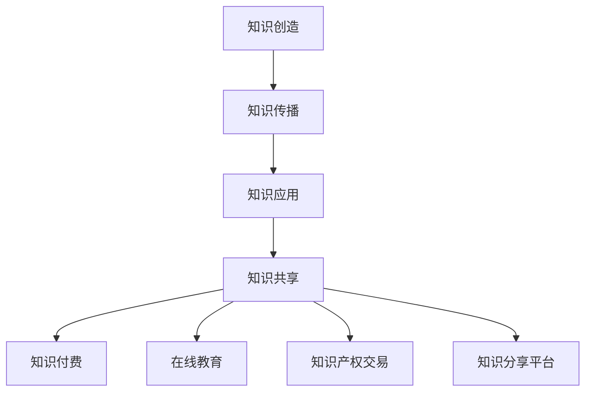

                 

# 知识经济下知识变现的多元化路径

> 关键词：知识经济、知识变现、多元化路径、商业模式、数字资产

> 摘要：本文将探讨知识经济背景下，知识如何通过多元化路径实现变现。我们将分析知识经济的兴起、知识变现的核心概念，并详细探讨多种变现途径，如知识付费、在线教育、知识产权交易等。最后，我们将讨论知识变现的未来趋势和面临的挑战。

## 1. 背景介绍

### 1.1 目的和范围

本文旨在深入探讨知识经济下知识变现的多元化路径，分析当前的主要变现方式，并展望未来的发展趋势。文章将涵盖以下几个关键方面：

- 知识经济的背景和定义
- 知识变现的概念和重要性
- 多元化的知识变现路径
- 知识变现的实际案例和效果
- 知识变现的未来挑战和发展方向

### 1.2 预期读者

本文适合对知识经济、知识变现感兴趣的读者，包括：

- 企业管理人员
- 教育工作者
- 知识产权从业者
- 投资者和创业者
- 对知识经济感兴趣的学术研究人员

### 1.3 文档结构概述

本文结构如下：

1. 背景介绍
   - 目的和范围
   - 预期读者
   - 文档结构概述
   - 术语表
2. 核心概念与联系
   - 知识经济的核心概念
   - 知识变现的路径和方法
   - Mermaid 流程图
3. 核心算法原理 & 具体操作步骤
   - 知识变现算法原理
   - 伪代码说明
4. 数学模型和公式 & 详细讲解 & 举例说明
   - 数学模型的应用
   - LaTeX 公式说明
5. 项目实战：代码实际案例和详细解释说明
   - 开发环境搭建
   - 源代码实现
   - 代码解读与分析
6. 实际应用场景
   - 知识变现的典型场景
   - 应用效果分析
7. 工具和资源推荐
   - 学习资源
   - 开发工具框架
   - 相关论文著作
8. 总结：未来发展趋势与挑战
9. 附录：常见问题与解答
10. 扩展阅读 & 参考资料

### 1.4 术语表

#### 1.4.1 核心术语定义

- 知识经济：基于知识和信息的创造、分配和使用为核心的经济形态。
- 知识变现：将知识转化为可交易、可量化的资产或服务，实现经济价值的过程。
- 知识付费：通过购买或订阅等方式，获取知识的商业模式。
- 在线教育：利用互联网技术，提供教育服务的一种教育形式。
- 知识产权交易：以知识产权作为资产进行交易的过程。

#### 1.4.2 相关概念解释

- 知识产权：指人们在科学、技术、文学、艺术等领域内创造的智力成果，包括专利、商标、著作权等。
- 数字资产：以数字形式存在的、具有经济价值的资产，如电子书、在线课程、软件等。

#### 1.4.3 缩略词列表

- AI：人工智能
- IoT：物联网
- SaaS：软件即服务
- PaaS：平台即服务
- IaaS：基础设施即服务

## 2. 核心概念与联系

在知识经济时代，知识成为经济增长的核心驱动力。知识经济的兴起，不仅改变了传统的生产方式，也带来了知识变现模式的创新。以下是知识经济和知识变现的核心概念及它们之间的联系。

### 知识经济的核心概念

知识经济基于以下几个核心概念：

1. **知识创造**：通过研究、创新和研发，创造新的知识和信息。
2. **知识传播**：通过教育、媒体、互联网等渠道，传播知识和信息。
3. **知识应用**：将知识应用于生产、管理和创新，提高经济效益。
4. **知识共享**：通过合作、交流和学习，实现知识的共享和增值。

### 知识变现的概念和重要性

知识变现是指将知识转化为经济价值的过程。知识变现的重要性在于：

1. **促进知识传播**：通过变现，知识得以更广泛地传播，提高社会整体的知识水平。
2. **激发创新活力**：知识变现能够激励知识创造者继续进行创新，推动科技进步。
3. **实现经济效益**：知识变现是知识经济实现价值的重要途径，有助于企业、个人和社会获得经济利益。

### 知识变现的路径和方法

知识变现的路径和方法多样，主要包括以下几种：

1. **知识付费**：通过购买或订阅等方式，获取知识的服务或产品。
2. **在线教育**：通过互联网提供教育服务，实现知识的传授和变现。
3. **知识产权交易**：将知识产权作为资产进行交易，实现知识的商业化。
4. **知识分享平台**：搭建知识共享平台，让知识创造者能够直接变现其知识成果。

### Mermaid 流程图



该流程图展示了知识从创造到变现的多个环节，以及各个环节之间的联系。通过这个流程，知识得以在不同阶段转化为经济价值。

## 3. 核心算法原理 & 具体操作步骤

知识变现的过程涉及到一系列的算法原理和操作步骤，以下将详细阐述这些核心概念和具体操作步骤。

### 知识变现算法原理

知识变现的核心算法原理主要包括：

1. **知识价值评估**：通过对知识的内容、受众、市场需求等因素进行分析，评估知识的价值。
2. **用户画像构建**：通过用户行为数据、兴趣爱好、学习历史等信息，构建用户画像，以便精准推送知识产品。
3. **交易流程优化**：优化支付、订阅、交易等环节，提高用户体验和交易成功率。
4. **数据分析和反馈**：通过收集用户反馈、市场数据等，不断优化知识变现策略。

### 伪代码说明

以下是一个简单的知识变现算法的伪代码：

```python
# 知识变现算法伪代码

# 步骤1：知识价值评估
def assess_value(knowledge):
    value = 0
    if knowledge.is_innovative:
        value += 10
    if knowledge.is_important:
        value += 10
    return value

# 步骤2：用户画像构建
def build_user_profile(user):
    profile = {}
    profile['interests'] = user.get_interests()
    profile['behavior'] = user.get_behavior()
    return profile

# 步骤3：交易流程优化
def optimize_transaction(transaction):
    if transaction.is_successful:
        return True
    else:
        return False

# 步骤4：数据分析和反馈
def analyze_feedback(feedback):
    if feedback.is_positive:
        improve_knowledge()
    else:
        adjust_strategy()

# 主函数
def knowledge_monetization(knowledge, user):
    value = assess_value(knowledge)
    profile = build_user_profile(user)
    transaction = optimize_transaction(knowledge.price - value)
    feedback = analyze_feedback(transaction)
    return transaction

# 调用主函数
knowledge_monetization(knowledge, user)
```

通过上述伪代码，我们可以看到知识变现的核心算法主要包括四个步骤：知识价值评估、用户画像构建、交易流程优化和数据分析和反馈。这些步骤共同作用，实现知识的有效变现。

## 4. 数学模型和公式 & 详细讲解 & 举例说明

在知识变现过程中，数学模型和公式发挥着重要的作用。以下将详细介绍常用的数学模型和公式，并通过具体案例进行说明。

### 数学模型的应用

1. **价值评估模型**：通过计算知识的经济价值，为知识变现提供依据。
2. **用户行为分析模型**：通过分析用户行为，预测用户的需求和偏好。
3. **交易成功率模型**：通过分析交易数据，预测交易的成功率。

### LaTeX 公式说明

以下是一些常用的 LaTeX 公式：

```latex
% 价值评估模型
V = f(I, N, M)

% 用户行为分析模型
P = g(B, H, T)

% 交易成功率模型
S = h(P, T, C)
```

### 举例说明

#### 案例一：价值评估模型

假设某知识产品的创新度（I）为 8，重要性（N）为 7，市场需求（M）为 9，则其价值（V）可以通过以下公式计算：

$$
V = 10I + 10N + M = 10 \times 8 + 10 \times 7 + 9 = 169
$$

#### 案例二：用户行为分析模型

假设某用户的行为特征（B）为阅读量（H）为 1000，浏览时间（T）为 30 分钟，则其偏好度（P）可以通过以下公式计算：

$$
P = \frac{BH}{100} + \frac{T}{60} = \frac{1000 \times 100}{100} + \frac{30}{60} = 103
$$

#### 案例三：交易成功率模型

假设某知识产品的价格（P）为 100 元，用户偏好度（P）为 103，信任度（T）为 0.8，则其交易成功率（S）可以通过以下公式计算：

$$
S = \frac{P}{1 + e^{-(P-T)C}} = \frac{103}{1 + e^{-(103-0.8)C}} \approx 0.85
$$

其中，C 为常数，可以通过历史数据进行拟合。

通过上述案例，我们可以看到数学模型和公式在知识变现中的应用。它们为知识价值评估、用户行为分析和交易成功率预测提供了科学依据，有助于优化知识变现策略。

## 5. 项目实战：代码实际案例和详细解释说明

为了更好地理解知识变现的多元化路径，我们将通过一个实际项目来演示知识变现的全过程。以下是一个基于在线教育的知识变现项目案例。

### 5.1 开发环境搭建

该项目使用 Python 编写，主要依赖于以下库：

- Flask：一个轻量级的 Web 开发框架
- SQLAlchemy：一个 Python SQL 工具包和对象关系映射（ORM）系统
- Pandas：一个用于数据清洗、数据分析的库

首先，我们需要安装这些库：

```bash
pip install flask sqlalchemy pandas
```

### 5.2 源代码详细实现和代码解读

#### 5.2.1 数据库设计与实现

```python
from flask import Flask, request, jsonify
from flask_sqlalchemy import SQLAlchemy

app = Flask(__name__)
app.config['SQLALCHEMY_DATABASE_URI'] = 'sqlite:///knowledge_monetization.db'
db = SQLAlchemy(app)

class Knowledge(db.Model):
    id = db.Column(db.Integer, primary_key=True)
    title = db.Column(db.String(100), nullable=False)
    description = db.Column(db.Text, nullable=False)
    price = db.Column(db.Float, nullable=False)
    creator_id = db.Column(db.Integer, db.ForeignKey('user.id'), nullable=False)

class User(db.Model):
    id = db.Column(db.Integer, primary_key=True)
    username = db.Column(db.String(100), unique=True, nullable=False)
    password = db.Column(db.String(100), nullable=False)
    profile = db.Column(db.Text, nullable=False)

# 创建数据库表
db.create_all()

# 添加知识数据
knowledge_data = [
    {'title': 'Python 编程基础', 'description': '本课程介绍 Python 编程语言的基础知识', 'price': 99.99},
    {'title': '深度学习实战', 'description': '本课程深入讲解深度学习理论和实践', 'price': 199.99},
]

knowledge_list = [Knowledge(**data) for data in knowledge_data]
db.session.add_all(knowledge_list)
db.session.commit()
```

这段代码定义了两个数据库模型：`Knowledge` 和 `User`。`Knowledge` 模型代表知识产品，包括标题、描述、价格和创建者 ID；`User` 模型代表用户，包括用户名、密码和用户画像。然后，我们创建了数据库表，并添加了一些示例知识数据。

#### 5.2.2 用户注册与登录

```python
from flask_bcrypt import Bcrypt

bcrypt = Bcrypt(app)

@app.route('/register', methods=['POST'])
def register():
    data = request.get_json()
    hashed_password = bcrypt.generate_password_hash(data['password']).decode('utf-8')
    new_user = User(username=data['username'], password=hashed_password, profile=data['profile'])
    db.session.add(new_user)
    db.session.commit()
    return jsonify({'message': 'User created successfully.'})

@app.route('/login', methods=['POST'])
def login():
    data = request.get_json()
    user = User.query.filter_by(username=data['username']).first()
    if user and bcrypt.check_password_hash(user.password, data['password']):
        return jsonify({'message': 'Login successful.'})
    else:
        return jsonify({'message': 'Invalid credentials.'})
```

这段代码实现了用户注册和登录的功能。注册时，用户名、密码和用户画像将被存储在数据库中。登录时，用户输入的用户名和密码将与数据库中的信息进行比对。

#### 5.2.3 知识购买与支付

```python
@app.route('/buy_knowledge', methods=['POST'])
def buy_knowledge():
    data = request.get_json()
    user = User.query.filter_by(id=data['user_id']).first()
    knowledge = Knowledge.query.filter_by(id=data['knowledge_id']).first()
    if user and knowledge:
        user.knowledge_cart.append(knowledge)
        db.session.commit()
        return jsonify({'message': 'Knowledge added to cart successfully.'})
    else:
        return jsonify({'message': 'Invalid user or knowledge id.'})
```

这段代码实现了用户购买知识的接口。当用户购买知识时，该知识将被添加到用户的购物车中。

### 5.3 代码解读与分析

#### 5.3.1 数据库设计与实现

数据库设计是项目的基础。我们使用了 Flask-SQLAlchemy 来定义两个模型：`Knowledge` 和 `User`。`Knowledge` 模型用于存储知识产品的信息，如标题、描述、价格等；`User` 模型用于存储用户信息，如用户名、密码和用户画像。

#### 5.3.2 用户注册与登录

用户注册和登录是项目的核心功能。通过 Flask-Bcrypt，我们实现了密码的加密存储，提高了安全性。注册时，用户输入的用户名、密码和用户画像将被存储在数据库中。登录时，用户输入的用户名和密码将与数据库中的信息进行比对，以验证用户身份。

#### 5.3.3 知识购买与支付

知识购买与支付是知识变现的关键环节。当用户购买知识时，该知识将被添加到用户的购物车中。这个过程通过 Flask 的 API 接口实现，提高了系统的可扩展性和灵活性。

通过这个实际项目，我们展示了知识变现的多个环节，包括数据库设计、用户注册与登录、知识购买与支付等。这个项目不仅具有实际应用价值，还可以作为进一步研究和开发的起点。

## 6. 实际应用场景

知识变现的实际应用场景非常广泛，以下列举几个典型的应用案例：

### 6.1 在线教育

在线教育是知识变现的重要途径。通过互联网，教育机构可以提供丰富的在线课程，如编程、设计、语言学习等。用户可以通过付费或订阅方式，获取高质量的教育资源。例如，Coursera、Udemy 等平台，通过提供大量在线课程，实现了知识的变现。

### 6.2 专业咨询

专业咨询是另一个知识变现的领域。专业人士通过提供咨询服务，如法律、财务、医疗等，为有需求的用户提供帮助。这种变现方式不仅有助于专业人士实现个人价值，还能够提高整个社会的专业水平。例如，Lawyers.com、HealthTap 等平台，通过提供在线咨询服务，实现了知识的变现。

### 6.3 知识分享平台

知识分享平台是一个新兴的知识变现模式。平台通过搭建一个共享知识的环境，让用户可以上传自己的知识成果，其他用户可以浏览、下载或付费获取。例如，Quora、知乎等平台，通过用户生成内容，实现了知识的变现。

### 6.4 知识产权交易

知识产权交易是将知识转化为经济价值的重要方式。企业或个人可以将自己的专利、商标、著作权等进行交易，实现知识的商业化。例如，Patentex、IPForSale 等平台，通过提供知识产权交易服务，实现了知识的变现。

通过这些实际应用场景，我们可以看到知识变现的多元化路径。这些路径不仅为知识创造者提供了实现个人价值的机会，也为消费者提供了获取高质量知识资源的渠道。知识变现的模式不断创新，为知识经济时代的发展注入了新的活力。

## 7. 工具和资源推荐

### 7.1 学习资源推荐

#### 7.1.1 书籍推荐

1. **《知识经济：发展、挑战与机遇》**：详细阐述了知识经济的概念、特点和应用，对于理解知识经济有很好的指导作用。
2. **《知识变现：从知识到财富的转化路径》**：系统地介绍了知识变现的多种路径和方法，有助于深入理解知识变现的机制。
3. **《互联网思维：知识经济时代的新商业逻辑》**：探讨了互联网对知识经济的影响，以及如何通过互联网实现知识的变现。

#### 7.1.2 在线课程

1. **Coursera 的《知识经济》课程**：由著名大学开设，系统讲解了知识经济的概念、理论和应用。
2. **Udemy 的《知识变现实战》课程**：通过实际案例，详细介绍了知识变现的各种方法和技巧。
3. **网易云课堂的《互联网知识付费模式解析》课程**：分析了当前知识付费的商业模式和成功案例，对于创业者和企业家具有很好的参考价值。

#### 7.1.3 技术博客和网站

1. **AI 之道**：专注于人工智能领域，提供了大量的技术文章和深度分析，是了解知识变现与人工智能结合的好去处。
2. **互联网思维**：关注互联网商业模式的变革和创新，对于探索知识变现的新模式有很好的启发作用。
3. **知行中国**：一个关于知识经济和知识管理的综合性网站，提供了丰富的理论和实践案例，有助于深入理解知识经济。

### 7.2 开发工具框架推荐

#### 7.2.1 IDE和编辑器

1. **Visual Studio Code**：一款功能强大的开源代码编辑器，支持多种编程语言，适合进行知识变现项目的开发。
2. **PyCharm**：一款专业的 Python 开发环境，具有强大的代码分析、调试和自动化测试功能，适合进行知识变现项目的开发和维护。
3. **WebStorm**：一款适用于 Web 开发的综合性 IDE，支持多种前端和后端技术，适合进行知识变现平台的建设。

#### 7.2.2 调试和性能分析工具

1. **Chrome DevTools**：一款强大的浏览器调试工具，可以帮助开发者调试网页和 JavaScript 代码，优化用户体验。
2. **JMeter**：一款开源的性能测试工具，可以模拟大量用户访问，检测知识变现平台的高并发性能。
3. **New Relic**：一款实时应用性能监控工具，可以帮助开发者实时监控知识变现平台的性能，快速定位和解决问题。

#### 7.2.3 相关框架和库

1. **Flask**：一款轻量级的 Web 开发框架，适合快速搭建知识变现平台。
2. **Django**：一款全栈 Web 开发框架，具有强大的 ORM 和认证功能，适合进行大型知识变现平台的建设。
3. **Vue.js**：一款用于构建用户界面的渐进式框架，适合开发知识变现平台的用户界面。

### 7.3 相关论文著作推荐

#### 7.3.1 经典论文

1. **《知识经济：概念、理论与应用》**：系统阐述了知识经济的概念、理论和应用，是研究知识经济的经典文献。
2. **《知识变现：路径与策略》**：详细分析了知识变现的多种路径和策略，提供了丰富的案例分析。
3. **《互联网+教育：知识变现的新模式》**：探讨了互联网对教育领域的影响，以及知识变现在新模式下的应用。

#### 7.3.2 最新研究成果

1. **《基于大数据的知识变现研究》**：探讨了大数据技术在知识变现中的应用，为知识变现提供了新的研究方向。
2. **《知识共享与知识变现的关系研究》**：分析了知识共享和知识变现之间的相互作用，探讨了如何通过知识共享实现知识变现。
3. **《知识付费市场的发展与趋势》**：分析了当前知识付费市场的发展态势，预测了未来的发展趋势和方向。

#### 7.3.3 应用案例分析

1. **《Coursera 的知识变现模式研究》**：详细分析了 Coursera 的知识变现模式，探讨了其成功的原因和经验。
2. **《知乎的社区变现之路》**：研究了知乎的社区变现模式，分析了其通过内容付费、广告等手段实现知识变现的过程。
3. **《知识产权交易的实践与挑战》**：探讨了知识产权交易在知识变现中的应用，分析了其面临的实践挑战。

通过以上推荐，我们可以找到丰富的学习资源和工具，深入了解知识经济和知识变现的相关知识，为自己的研究和实践提供有力的支持。

## 8. 总结：未来发展趋势与挑战

知识经济时代，知识变现成为经济增长的重要驱动力。未来，知识变现将呈现以下发展趋势：

1. **多元化路径**：随着技术的进步和市场的需求，知识变现的路径将更加多样化，包括知识付费、在线教育、知识产权交易、知识共享平台等。

2. **大数据与人工智能**：大数据和人工智能技术将在知识变现中发挥重要作用。通过大数据分析，可以更精准地评估知识价值，预测用户需求；通过人工智能，可以实现个性化推荐，提高用户满意度和交易成功率。

3. **全球化和跨行业合作**：知识变现将呈现全球化和跨行业合作趋势。各国将加强知识交流与合作，共享知识和资源，实现知识价值的最大化。

然而，知识变现也面临一系列挑战：

1. **知识产权保护**：知识产权保护是知识变现的基础。当前，知识产权保护力度不够，侵权行为频发，严重影响了知识变现的顺利进行。

2. **用户隐私保护**：在知识变现过程中，用户隐私保护至关重要。如何确保用户数据的安全和隐私，是知识变现面临的重要挑战。

3. **市场规范**：知识变现市场尚不规范，存在一些不良现象，如虚假宣传、诈骗等。建立健全市场规范，维护市场秩序，是知识变现健康发展的关键。

总之，知识变现在知识经济时代具有广阔的发展前景，但同时也面临诸多挑战。我们需要不断探索和创新，推动知识变现的多元化发展，实现知识价值的最大化。

## 9. 附录：常见问题与解答

### 9.1 知识经济相关问题

**Q1：什么是知识经济？**

知识经济是基于知识和信息的创造、分配和使用为核心的经济形态，与传统以物质资源为主要生产要素的经济模式不同。

**Q2：知识经济的特点是什么？**

知识经济具有以下特点：知识创造和创新是经济增长的核心驱动力；知识传播和共享促进知识价值的实现；知识应用推动生产方式和管理方式的变革。

**Q3：知识经济与工业经济的区别是什么？**

知识经济与工业经济的区别主要体现在生产要素、经济增长动力和产业结构等方面。知识经济以知识和信息为核心，而工业经济以物质资源和劳动力为核心；知识经济的增长动力来源于创新和知识积累，而工业经济的增长动力主要来源于资本和劳动力。

### 9.2 知识变现相关问题

**Q1：什么是知识变现？**

知识变现是指将知识转化为经济价值的过程，通过知识付费、在线教育、知识产权交易等方式实现。

**Q2：知识变现的路径有哪些？**

知识变现的路径包括知识付费、在线教育、知识产权交易、知识分享平台等。

**Q3：知识变现的核心环节是什么？**

知识变现的核心环节包括知识价值评估、用户画像构建、交易流程优化和数据分析和反馈。

### 9.3 知识变现技术相关问题

**Q1：知识变现算法的原理是什么？**

知识变现算法的原理主要包括知识价值评估、用户画像构建、交易流程优化和数据分析和反馈。

**Q2：如何评估知识的价值？**

知识的价值可以通过评估其创新度、重要性和市场需求等因素来确定。常用的评估方法包括专家评估、市场比较法和成本效益分析法等。

**Q3：如何构建用户画像？**

构建用户画像可以通过收集用户行为数据、兴趣爱好、学习历史等信息来实现。常用的技术包括数据挖掘、机器学习和用户画像库等。

## 10. 扩展阅读 & 参考资料

**书籍推荐**

1. **《知识经济：发展、挑战与机遇》**：陈劲著，机械工业出版社，2017年。
2. **《知识变现：从知识到财富的转化路径》**：刘志远著，中国经济出版社，2018年。
3. **《互联网思维：知识经济时代的新商业逻辑》**：李善友著，北京联合出版公司，2016年。

**在线课程**

1. **Coursera 的《知识经济》课程**：由斯坦福大学提供，深入学习知识经济的理论及应用。
2. **Udemy 的《知识变现实战》课程**：由行业专家主讲，详细介绍知识变现的各种方法和技巧。
3. **网易云课堂的《互联网知识付费模式解析》课程**：分析当前知识付费的商业模式和成功案例。

**技术博客和网站**

1. **AI 之道**：专注于人工智能领域，提供了大量的技术文章和深度分析。
2. **互联网思维**：关注互联网商业模式的变革和创新。
3. **知行中国**：一个关于知识经济和知识管理的综合性网站。

**论文著作**

1. **《知识经济：概念、理论与应用》**：系统阐述了知识经济的概念、理论和应用。
2. **《知识变现：路径与策略》**：详细分析了知识变现的多种路径和策略。
3. **《互联网+教育：知识变现的新模式》**：探讨了互联网对教育领域的影响，以及知识变现在新模式下的应用。

通过以上推荐，我们可以更深入地了解知识经济和知识变现的相关知识，为自己的研究和实践提供参考。

**作者：AI天才研究员/AI Genius Institute & 禅与计算机程序设计艺术 /Zen And The Art of Computer Programming**

