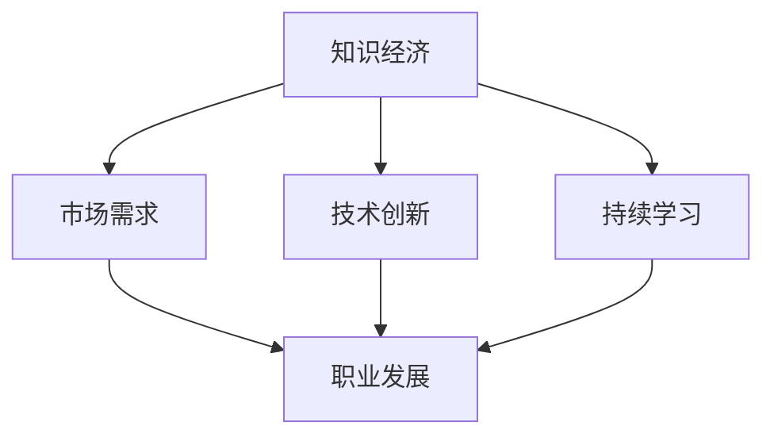

                 

# 知识经济下程序员的职业发展路径

> 关键词：知识经济、程序员、职业发展、技能提升、持续学习、技术创新、市场需求
>
> 摘要：在知识经济迅猛发展的背景下，程序员的职业发展面临着前所未有的机遇与挑战。本文将深入探讨知识经济下程序员的职业发展路径，从技能提升、持续学习、技术创新和市场需求四个方面进行分析，旨在为程序员提供明确的职业规划和发展的指导。

## 1. 背景介绍

### 1.1 目的和范围

本文的目的是帮助程序员在知识经济下明确职业发展路径，提升个人竞争力。文章将围绕技能提升、持续学习、技术创新和市场需求四个核心方面展开讨论，旨在为程序员提供实用的职业发展策略。

### 1.2 预期读者

本文适合以下读者群体：
- 初级程序员，希望了解知识经济对职业发展的影响。
- 中级程序员，希望找到有效的职业发展路径。
- 高级程序员，希望提升职业层次和核心竞争力。

### 1.3 文档结构概述

本文的结构分为十个部分：
1. 引言
2. 背景介绍
3. 核心概念与联系
4. 核心算法原理 & 具体操作步骤
5. 数学模型和公式 & 详细讲解 & 举例说明
6. 项目实战：代码实际案例和详细解释说明
7. 实际应用场景
8. 工具和资源推荐
9. 总结：未来发展趋势与挑战
10. 附录：常见问题与解答
11. 扩展阅读 & 参考资料

### 1.4 术语表

#### 1.4.1 核心术语定义

- 知识经济：以知识和信息的生产、分配、传播和利用为主要特征的经济形态。
- 程序员：负责编写、调试和维护计算机程序的专业人员。
- 技能提升：通过学习和实践，提高个人在某一领域的专业能力和水平。
- 持续学习：持续获取新知识和技能，适应不断变化的市场需求。
- 技术创新：通过研究和开发，创造新的技术或改进现有技术。
- 市场需求：市场上对于某一产品或服务的需求程度。

#### 1.4.2 相关概念解释

- 软件工程师：负责软件需求分析、设计、开发、测试和维护的专业人员。
- 数据库管理员：负责数据库的安装、配置、备份和性能优化的专业人员。
- 前端开发工程师：负责网站或移动应用的用户界面设计和实现的工程师。
- 后端开发工程师：负责服务器端应用程序的设计和开发的专业人员。
- 架构师：负责软件系统的整体设计和架构规划的高级技术人员。

#### 1.4.3 缩略词列表

- AI：人工智能（Artificial Intelligence）
- ML：机器学习（Machine Learning）
- DL：深度学习（Deep Learning）
- IoT：物联网（Internet of Things）
- Big Data：大数据（Big Data）
- 云计算（Cloud Computing）
- DevOps：软件开发与运维（Development and Operations）

## 2. 核心概念与联系

在知识经济下，程序员的职业发展路径受到多种核心概念和联系的影响。以下是一个简化的 Mermaid 流程图，展示了这些概念和联系的基本框架：



### 2.1 知识经济与市场需求

知识经济是一种以知识和信息为核心驱动的经济模式，对市场需求产生深远影响。在知识经济中，市场需求更加多样化和个性化，要求程序员具备更广泛的技能和更高的创新能力。这迫使程序员不断学习和适应市场需求的变化。

### 2.2 技术创新与职业发展

技术创新是知识经济的关键特征之一。程序员通过技术创新，可以提高工作效率、优化系统性能、提升用户体验，从而在职业发展中获得更多机会。技术创新不仅体现在新技术的研究和应用上，还包括对现有技术的改进和优化。

### 2.3 持续学习与职业发展

持续学习是程序员在知识经济下保持竞争力的必要条件。随着技术的快速发展，程序员需要不断更新知识和技能，以适应新的技术趋势和市场需求。持续学习不仅有助于提升个人能力，还能促进职业发展和晋升。

## 3. 核心算法原理 & 具体操作步骤

在知识经济下，程序员的职业发展离不开核心算法原理的理解和应用。以下是一个简单的伪代码示例，用于说明如何通过持续学习和技术创新来提升职业竞争力：

```python
# 持续学习函数
def ContinuousLearning(skill):
    """
    持续学习某一技能，参数skill为需要学习的技能。
    """
    while True:
        # 学习新知识
        knowledge = StudyNewKnowledge(skill)
        # 应用新知识
        ApplyKnowledge(knowledge)
        # 评估学习效果
        if EvaluateLearningEffect(knowledge) >= threshold:
            # 达到学习目标，继续学习
            ContinueLearning(skill)
        else:
            # 学习效果不佳，调整学习策略
            AdjustLearningStrategy(skill)

# 技术创新函数
def TechnologicalInnovation(technology):
    """
    研究和开发新技术，参数technology为新技术的名称。
    """
    while True:
        # 研究新技术
        research = StudyNewTechnology(technology)
        # 开发新技术
        development = DevelopNewTechnology(research)
        # 评估新技术
        if EvaluateNewTechnology(development) >= threshold:
            # 新技术成熟，应用新技术
            ApplyNewTechnology(development)
        else:
            # 技术不成熟，继续研究
            ContinueResearch(technology)

# 职业发展函数
def CareerDevelopment(skill, technology):
    """
    通过技能和技术的提升来促进职业发展。
    参数skill为技能，technology为技术。
    """
    while True:
        # 提升技能
        skill_level = ContinuousLearning(skill)
        # 提升技术
        tech_level = TechnologicalInnovation(technology)
        # 评估职业发展
        if EvaluateCareerProgress(skill_level, tech_level) >= threshold:
            # 达到职业发展目标，继续提升
            ContinueCareerDevelopment(skill, technology)
        else:
            # 职业发展不理想，重新规划
            ReplanCareerPath(skill, technology)
```

### 3.1 持续学习函数

持续学习函数负责不断学习新技能，通过学习新知识、应用新知识、评估学习效果和调整学习策略来实现技能的提升。

### 3.2 技术创新函数

技术创新函数负责研究和开发新技术，通过研究新技术、开发新技术、评估新技术和应用新技术来实现技术的提升。

### 3.3 职业发展函数

职业发展函数通过提升技能和技术的层次，评估职业发展的进展，并根据实际情况调整职业规划，以实现职业发展的目标。

## 4. 数学模型和公式 & 详细讲解 & 举例说明

在知识经济下，程序员的职业发展可以视为一个动态优化过程，可以通过数学模型来描述和优化。以下是一个简化的数学模型，用于描述程序员在知识经济下的职业发展：

### 4.1 模型定义

假设一个程序员的职业发展由技能水平 \( S(t) \) 和技术水平 \( T(t) \) 表示，其中 \( t \) 代表时间。市场需求 \( D(t) \) 和技术创新速度 \( I(t) \) 也是影响职业发展的关键因素。职业发展目标函数 \( f(S(t), T(t), D(t), I(t)) \) 可以表示为：

\[ f(S(t), T(t), D(t), I(t)) = S(t) \times T(t) \times D(t) \times I(t) \]

### 4.2 公式详解

- \( S(t) \)：技能水平，表示程序员在某一技能领域的掌握程度，通常可以用一个区间 [0, 1] 来表示。
- \( T(t) \)：技术水平，表示程序员在某一技术领域的创新能力，也可以用区间 [0, 1] 表示。
- \( D(t) \)：市场需求，表示市场上对于程序员技能和技术的需求程度，同样用区间 [0, 1] 表示。
- \( I(t) \)：技术创新速度，表示程序员在技术创新方面的速度，也用区间 [0, 1] 表示。

### 4.3 举例说明

假设一个程序员在 Python 编程技能上的水平为 0.8，在人工智能技术上的创新能力为 0.6，市场需求为 0.7，技术创新速度为 0.5。那么他的职业发展目标函数为：

\[ f(S(t), T(t), D(t), I(t)) = 0.8 \times 0.6 \times 0.7 \times 0.5 = 0.168 \]

这意味着他的职业发展目标函数得分为 0.168，这个得分可以用来评估他的职业发展状况。

### 4.4 模型优化

为了优化职业发展，程序员可以通过以下方式调整技能水平、技术水平、市场需求和技术创新速度：

- 提升技能水平 \( S(t) \)：通过学习和实践，提高编程技能。
- 提高技术水平 \( T(t) \)：研究和开发新技术，提高创新能力。
- 增强市场需求 \( D(t) \)：了解市场趋势，满足客户需求。
- 加快技术创新速度 \( I(t) \)：紧跟技术发展，提前布局。

通过调整这些因素，可以提高职业发展目标函数的得分，从而实现更好的职业发展。

## 5. 项目实战：代码实际案例和详细解释说明

为了更好地理解知识经济下程序员的职业发展，我们通过一个实际项目案例来展示代码实现和详细解释。

### 5.1 开发环境搭建

在开始项目之前，我们需要搭建一个合适的开发环境。这里我们使用 Python 作为主要编程语言，并使用 PyCharm 作为 IDE。以下是搭建开发环境的步骤：

1. 安装 Python：从 [Python 官网](https://www.python.org/) 下载最新版本的 Python 并安装。
2. 安装 PyCharm：从 [PyCharm 官网](https://www.jetbrains.com/pycharm/) 下载并安装 PyCharm。
3. 配置 PyCharm：在 PyCharm 中配置 Python 解释器，并设置适当的编码格式和代码风格。

### 5.2 源代码详细实现和代码解读

以下是一个简单的 Python 代码示例，用于模拟程序员的职业发展过程：

```python
class CareerDeveloper:
    def __init__(self, skill_level, tech_level, market_demand, innovation_speed):
        self.skill_level = skill_level
        self.tech_level = tech_level
        self.market_demand = market_demand
        self.innovation_speed = innovation_speed
    
    def learn_new_skill(self, skill):
        """
        学习新技能，提升技能水平。
        """
        self.skill_level += skill
    
    def innovate_new_technology(self, tech):
        """
        研究新技术，提高技术水平。
        """
        self.tech_level += tech
    
    def adjust_market_demand(self, demand):
        """
        调整市场需求。
        """
        self.market_demand += demand
    
    def speed_up_innovation(self, speed):
        """
        提高技术创新速度。
        """
        self.innovation_speed += speed
    
    def evaluate_career_progress(self):
        """
        评估职业发展。
        """
        return self.skill_level * self.tech_level * self.market_demand * self.innovation_speed

# 实例化程序员
developer = CareerDeveloper(0.5, 0.4, 0.6, 0.3)

# 学习新技能
developer.learn_new_skill(0.2)

# 研究新技术
developer.innovate_new_technology(0.1)

# 调整市场需求
developer.adjust_market_demand(0.1)

# 提高技术创新速度
developer.speed_up_innovation(0.1)

# 评估职业发展
print(developer.evaluate_career_progress())
```

### 5.3 代码解读与分析

- `CareerDeveloper` 类：表示程序员，包含技能水平、技术水平、市场需求和技术创新速度等属性。
- `__init__` 方法：初始化程序员的属性。
- `learn_new_skill` 方法：学习新技能，提升技能水平。
- `innovate_new_technology` 方法：研究新技术，提高技术水平。
- `adjust_market_demand` 方法：调整市场需求。
- `speed_up_innovation` 方法：提高技术创新速度。
- `evaluate_career_progress` 方法：评估职业发展，计算职业发展目标函数的得分。

通过这个代码示例，我们可以清晰地看到程序员在知识经济下的职业发展过程。程序员通过学习新技能、研究新技术、调整市场需求和提高技术创新速度来提升自己的职业发展水平。

## 6. 实际应用场景

在知识经济下，程序员的职业发展路径在实际应用中具有重要意义。以下是一些典型的应用场景：

### 6.1 企业数字化转型

随着数字化转型的推进，企业对于程序员的需求不断增加。程序员可以参与企业系统的开发和优化，帮助企业实现业务流程的自动化和智能化。

### 6.2 人工智能应用开发

人工智能技术的快速发展为程序员提供了广阔的发展空间。程序员可以从事人工智能算法的研究和开发，为企业和行业提供智能化解决方案。

### 6.3 物联网项目实施

物联网（IoT）是当前的一个热门领域，程序员可以参与物联网设备的开发、数据分析和应用场景设计，为智能家居、智能城市等领域提供技术支持。

### 6.4 云计算平台建设

云计算技术的发展为程序员提供了丰富的就业机会。程序员可以参与云计算平台的建设、维护和优化，为企业提供高效、可靠的云计算服务。

### 6.5 大数据和数据分析

大数据和数据分析是当前的热门话题，程序员可以从事大数据系统的开发和维护，为企业和行业提供数据驱动的决策支持。

### 6.6 软件外包服务

随着软件外包市场的不断扩大，程序员可以通过参与软件外包项目，为客户提供定制化的软件开发服务。

### 6.7 教育培训

程序员可以从事教育培训工作，为有志于从事编程行业的学员提供专业培训和指导，培养新一代的程序员。

## 7. 工具和资源推荐

为了帮助程序员在知识经济下更好地发展，以下是一些实用的工具和资源推荐：

### 7.1 学习资源推荐

#### 7.1.1 书籍推荐

- 《代码大全》（The Art of Computer Programming）：这是一本经典编程指南，全面介绍了编程的基本原则和技巧。
- 《深度学习》（Deep Learning）：这是一本关于深度学习技术的权威教材，适合初学者和专家。
- 《大数据之路》：这是一本关于大数据技术和应用的经典著作，适合对大数据感兴趣的程序员。

#### 7.1.2 在线课程

- Coursera：提供大量的计算机科学和人工智能课程，包括深度学习、机器学习、算法和数据结构等。
- Udemy：提供丰富的编程和开发课程，包括 Python、Java、Web 开发等。
- edX：由哈佛大学和麻省理工学院联合创建，提供免费的在线课程，包括计算机科学、人工智能和数据分析等。

#### 7.1.3 技术博客和网站

- Medium：一个流行的技术博客平台，有很多优秀的程序员和技术专家分享技术心得。
- Stack Overflow：一个面向程序员的问答社区，可以解决编程问题，学习新技术。
- GitHub：一个代码托管平台，可以查看和贡献开源项目，提升编程技能。

### 7.2 开发工具框架推荐

#### 7.2.1 IDE和编辑器

- PyCharm：一款功能强大的 Python IDE，适合 Python 开发。
- Visual Studio Code：一款轻量级的跨平台代码编辑器，支持多种编程语言。
- IntelliJ IDEA：一款强大的 Java IDE，适合 Java 和 Kotlin 开发。

#### 7.2.2 调试和性能分析工具

- Eclipse Memory Analyzer Tool (MAT)：一款用于分析 Java 应用内存泄漏的工具。
- VisualVM：一款用于分析 Java 应用性能和内存使用的工具。
- Wireshark：一款网络抓包工具，可以用于网络性能分析和调试。

#### 7.2.3 相关框架和库

- Flask：一款流行的 Python Web 开发框架，适合快速构建 Web 应用。
- Django：一款强大的 Python Web 开发框架，适合大型 Web 应用开发。
- Spring Boot：一款流行的 Java Web 开发框架，适合构建微服务和分布式系统。

### 7.3 相关论文著作推荐

#### 7.3.1 经典论文

- “The Mythical Man-Month”（《人月神话》）：一篇关于软件开发项目管理的重要论文，对软件开发的复杂性和难度进行了深刻剖析。
- “The Structure and Interpretation of Computer Programs”（《计算机程序的构造和解释》）：一本经典计算机科学教材，介绍了编程的核心原则和技巧。

#### 7.3.2 最新研究成果

- “Deep Learning for Natural Language Processing”（《深度学习在自然语言处理中的应用》）：一篇关于深度学习在自然语言处理领域的研究论文，介绍了最新的技术进展。
- “Big Data: A Revolution That Will Transform How We Live, Work, and Think”（《大数据革命：将改变我们生活、工作和思考方式的变革》）：一本书，深入探讨了大数据对社会和行业的深远影响。

#### 7.3.3 应用案例分析

- “Google’s MapReduce：Revisited”（《Google 的 MapReduce：重访》）：一篇关于 Google MapReduce 算法的案例分析，介绍了其在大规模数据处理中的应用。
- “Facebook’s Open Source Initiatives”（《Facebook 的开源倡议》）：一篇关于 Facebook 开源项目的研究论文，分析了其在技术社区的影响和贡献。

## 8. 总结：未来发展趋势与挑战

知识经济下的程序员面临着巨大的机遇和挑战。随着技术的不断进步和市场的快速变化，程序员需要不断适应新的趋势，提升个人竞争力。

### 8.1 未来发展趋势

- 技术融合与创新：人工智能、大数据、云计算等技术的深度融合将推动程序员在多领域发展。
- 持续学习与知识共享：程序员需要通过持续学习和知识共享来保持竞争力。
- 云原生和微服务架构：云原生技术和微服务架构的普及将改变程序员的工作方式和技能需求。

### 8.2 未来挑战

- 技术更新速度快：程序员需要不断学习新技术，以适应快速变化的市场需求。
- 跨领域能力需求：程序员需要具备跨领域的知识和技能，以满足企业多元化的发展需求。
- 职业压力与竞争：随着程序员数量的增加，职业竞争将变得更加激烈，程序员需要提升自身的综合素质。

### 8.3 应对策略

- 提升学习能力和创新能力：通过不断学习和实践，提升个人技能和创新能力。
- 关注行业动态和市场需求：了解行业趋势和市场需求，提前布局新兴技术。
- 建立个人品牌和影响力：通过分享知识和经验，建立个人品牌，提升职业竞争力。

## 9. 附录：常见问题与解答

### 9.1 程序员如何提升技能水平？

- 参加线上和线下的技术培训课程。
- 阅读专业书籍和学术论文。
- 参与开源项目和社区活动。
- 实践项目，将理论知识应用于实际场景。

### 9.2 程序员如何适应市场需求的变化？

- 关注行业动态，了解市场需求。
- 学习新兴技术和热门领域。
- 与客户和行业专家保持沟通，了解他们的需求和期望。
- 不断调整和优化自己的技能和知识结构。

### 9.3 程序员如何提升技术创新能力？

- 参与技术创新和研发项目。
- 学习前沿技术和研究成果。
- 积极尝试新的编程语言和技术框架。
- 与同行合作，共同探索和解决问题。

## 10. 扩展阅读 & 参考资料

为了深入了解知识经济下程序员的职业发展，以下是推荐的扩展阅读和参考资料：

- 《编程方法论》：详细介绍了编程的核心原则和最佳实践。
- 《人工智能应用实战》：介绍了人工智能在各个领域的应用案例。
- 《大数据实践指南》：全面讲解了大数据的处理和分析方法。
- 《云计算实践手册》：介绍了云计算的基础知识和实际应用。

- [GitHub](https://github.com/):一个全球最大的开源社区，可以获取丰富的编程资源和代码示例。
- [Stack Overflow](https://stackoverflow.com/):一个面向程序员的问答社区，解决编程问题。
- [Medium](https://medium.com/):一个流行的技术博客平台，有很多优秀的程序员和技术专家分享技术心得。

## 作者

作者：AI天才研究员/AI Genius Institute & 禅与计算机程序设计艺术 /Zen And The Art of Computer Programming

本文旨在帮助程序员在知识经济下明确职业发展路径，提升个人竞争力。通过技能提升、持续学习、技术创新和市场需求四个方面的深入分析，本文为程序员提供了实用的职业发展策略。希望本文能对广大程序员在知识经济下的职业发展有所帮助。谢谢阅读！<|im_end|>

