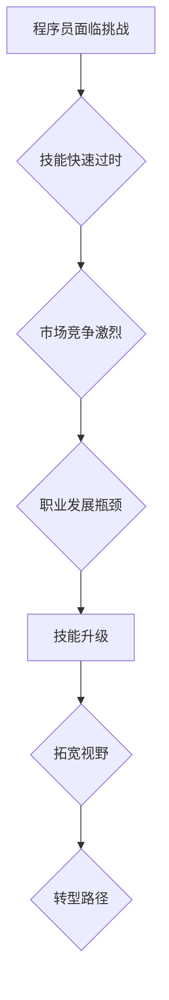

                 

# 知识经济下程序员的职业转型策略与方向

> **关键词：** 知识经济，程序员转型，职业发展，技能升级，技术趋势
>
> **摘要：** 在知识经济时代，程序员面临着技能过时、市场饱和等挑战。本文将探讨程序员如何抓住新兴技术机遇，进行有效的职业转型，提升个人竞争力。

## 1. 背景介绍

### 1.1 目的和范围

本文旨在为程序员提供一套系统的职业转型策略和方向，以应对知识经济带来的挑战和机遇。通过分析当前技术发展趋势，结合实际案例，我们将为程序员规划出一条可行的职业发展路径。

### 1.2 预期读者

本篇文章适合希望进行职业转型的程序员，尤其是那些对于未来技术趋势和职业发展方向感到迷茫的人。同时，对于IT经理、CTO等高级管理者，本文也具有一定的参考价值。

### 1.3 文档结构概述

本文分为十个部分：

1. 背景介绍
2. 核心概念与联系
3. 核心算法原理 & 具体操作步骤
4. 数学模型和公式 & 详细讲解 & 举例说明
5. 项目实战：代码实际案例和详细解释说明
6. 实际应用场景
7. 工具和资源推荐
8. 总结：未来发展趋势与挑战
9. 附录：常见问题与解答
10. 扩展阅读 & 参考资料

### 1.4 术语表

#### 1.4.1 核心术语定义

- **知识经济：** 以知识为核心生产要素的经济形态。
- **程序员：** 从事软件开发、测试、维护等工作的专业技术人员。
- **职业转型：** 从一种职业转变为另一种职业的过程。

#### 1.4.2 相关概念解释

- **技能升级：** 提升个人技能水平，以适应新技术、新市场的要求。
- **技术趋势：** 指在未来一段时间内，技术发展的主要方向和趋势。

#### 1.4.3 缩略词列表

- **AI：** 人工智能
- **大数据：** 大数据技术
- **云计算：** 云计算技术
- **区块链：** 区块链技术

## 2. 核心概念与联系

### 2.1 知识经济时代下的程序员挑战

知识经济时代，程序员面临的主要挑战包括：

1. 技能快速过时：技术迭代速度加快，程序员需要不断学习新技能。
2. 市场竞争激烈：程序员数量增加，市场竞争加剧。
3. 职业发展瓶颈：传统开发职位晋升空间有限，需要寻求新的职业发展方向。

### 2.2 职业转型策略与方向

为了应对挑战，程序员可以采取以下策略和方向：

1. **技能升级：** 学习新兴技术，如人工智能、大数据、云计算等。
2. **拓宽视野：** 关注行业动态，了解不同领域的应用场景。
3. **转型路径：** 从传统开发向数据科学家、AI工程师、云计算架构师等方向转型。

### 2.3 Mermaid 流程图



## 3. 核心算法原理 & 具体操作步骤

### 3.1 技能升级算法原理

技能升级是一个持续的过程，包括以下几个步骤：

1. **自我评估：** 识别自身技能短板。
2. **学习新技能：** 选择合适的学习资源。
3. **实践应用：** 将所学知识应用于实际项目中。
4. **反馈与调整：** 根据实际应用效果，调整学习方向。

### 3.2 具体操作步骤

1. **自我评估：**

   - 评估现有技能水平，识别短板。
   - 了解新兴技术趋势，确定学习方向。

2. **学习新技能：**

   - 选择合适的学习资源，如在线课程、书籍、技术博客等。
   - 制定学习计划，确保持续学习。

3. **实践应用：**

   - 参与实际项目，将所学知识应用于解决实际问题。
   - 与同行交流，分享学习经验和心得。

4. **反馈与调整：**

   - 根据实际应用效果，评估学习成果。
   - 及时调整学习方向，确保持续进步。

### 3.3 伪代码

```python
def skills_upgrade():
    # 自我评估
    current_skills = assess_current_skills()
    knowledge_gaps = find_knowledge_gaps(current_skills)

    # 学习新技能
    learning_resources = select_learning_resources(knowledge_gaps)
    learning_plan = create_learning_plan(learning_resources)

    # 实践应用
    project = find_real_world_project()
    apply_knowledge_to_project(project, learning_resources)

    # 反馈与调整
    feedback = evaluate_learning_results()
    adjust_learning_direction(feedback)

skills_upgrade()
```

## 4. 数学模型和公式 & 详细讲解 & 举例说明

### 4.1 数学模型原理

在技能升级过程中，可以运用以下数学模型来评估学习效果：

1. **学习曲线模型：** 描述学习者在一定时间内技能提升的速度。
2. **知识遗忘曲线模型：** 描述学习者对所学知识的遗忘速度。

### 4.2 详细讲解

1. **学习曲线模型：**

   学习曲线模型通常用函数 f(t) 表示，其中 t 表示时间。函数 f(t) 可以表示为：

   $$ f(t) = \frac{1}{1 + e^{-kt}} $$

   其中，k 为学习速率常数。学习速率常数 k 越大，表示学习者在一定时间内技能提升的速度越快。

2. **知识遗忘曲线模型：**

   知识遗忘曲线模型通常用函数 g(t) 表示，其中 t 表示时间。函数 g(t) 可以表示为：

   $$ g(t) = e^{-rt} $$

   其中，r 为遗忘速率常数。遗忘速率常数 r 越大，表示学习者在一定时间内遗忘知识的速度越快。

### 4.3 举例说明

假设某程序员在一个月内学习了 Python 编程语言，学习速率常数 k 为 0.5。根据学习曲线模型，可以计算出该程序员在一个月后的技能水平：

$$ f(1) = \frac{1}{1 + e^{-0.5 \times 1}} \approx 0.63 $$

这意味着，该程序员在一个月后，Python 编程技能水平约为 63%。

再假设该程序员在一个月后开始遗忘所学知识，遗忘速率常数 r 为 0.1。根据知识遗忘曲线模型，可以计算出该程序员在一个月后的知识保留率：

$$ g(1) = e^{-0.1 \times 1} \approx 0.90 $$

这意味着，该程序员在一个月后，Python 编程知识保留率约为 90%。

## 5. 项目实战：代码实际案例和详细解释说明

### 5.1 开发环境搭建

为了更好地进行技能升级和职业转型，我们需要搭建一个适合编程和学习的开发环境。以下是一个简单的开发环境搭建步骤：

1. 安装操作系统：选择适合自己的操作系统，如 Windows、macOS 或 Linux。
2. 安装编程语言：选择要学习的编程语言，如 Python、Java 或 C++。
3. 安装集成开发环境（IDE）：选择一款适合自己的 IDE，如 PyCharm、IntelliJ IDEA 或 Visual Studio。
4. 安装相关库和框架：根据需要安装相关的库和框架，如 NumPy、Pandas、TensorFlow 等。

### 5.2 源代码详细实现和代码解读

以下是一个简单的 Python 代码示例，用于实现一个简单的机器学习算法——线性回归：

```python
import numpy as np

def linear_regression(x, y):
    # 计算斜率
    m = np.linalg.inv(np.dot(x.T, x)).dot(x.T).dot(y)
    # 计算截距
    b = y - np.dot(x, m)
    return m, b

# 创建数据集
x = np.array([1, 2, 3, 4, 5])
y = np.array([2, 4, 5, 4, 5])

# 训练模型
m, b = linear_regression(x, y)

# 预测新数据
new_x = np.array([6])
new_y = m.dot(new_x) + b

print("预测结果：", new_y)
```

### 5.3 代码解读与分析

1. **导入模块：**

   ```python
   import numpy as np
   ```

   导入 NumPy 库，用于进行数学计算。

2. **定义线性回归函数：**

   ```python
   def linear_regression(x, y):
       # 计算斜率
       m = np.linalg.inv(np.dot(x.T, x)).dot(x.T).dot(y)
       # 计算截距
       b = y - np.dot(x, m)
       return m, b
   ```

   线性回归函数接受两个参数：x 和 y，分别表示自变量和因变量。函数使用最小二乘法计算斜率 m 和截距 b，并返回这两个参数。

3. **创建数据集：**

   ```python
   x = np.array([1, 2, 3, 4, 5])
   y = np.array([2, 4, 5, 4, 5])
   ```

   创建一个简单的数据集，其中 x 表示自变量，y 表示因变量。

4. **训练模型：**

   ```python
   m, b = linear_regression(x, y)
   ```

   使用训练数据调用线性回归函数，计算斜率 m 和截距 b。

5. **预测新数据：**

   ```python
   new_x = np.array([6])
   new_y = m.dot(new_x) + b
   print("预测结果：", new_y)
   ```

   使用训练好的模型预测新数据，并打印预测结果。

## 6. 实际应用场景

### 6.1 数据分析领域

程序员在数据分析领域可以转型为数据科学家、数据分析师等角色。主要应用场景包括：

1. 数据处理：清洗、预处理和分析大规模数据。
2. 数据可视化：通过图表、仪表板等形式展示数据。
3. 机器学习：使用算法模型进行数据预测、分类和聚类。

### 6.2 云计算领域

程序员在云计算领域可以转型为云计算架构师、云计算工程师等角色。主要应用场景包括：

1. 云服务部署：部署和管理云服务，如虚拟机、容器、数据库等。
2. 云安全：保障云服务安全，防止数据泄露和攻击。
3. 容器化：使用 Docker 等工具实现应用程序的容器化部署。

### 6.3 人工智能领域

程序员在人工智能领域可以转型为 AI 工程师、AI 研究员等角色。主要应用场景包括：

1. 机器学习：开发和部署机器学习算法模型。
2. 深度学习：使用神经网络进行图像、语音等数据识别和处理。
3. 自然语言处理：开发智能对话系统、机器翻译等应用。

## 7. 工具和资源推荐

### 7.1 学习资源推荐

#### 7.1.1 书籍推荐

- 《深度学习》：Goodfellow, Bengio 和 Courville 著
- 《Python 编程：从入门到实践》：埃里克·马瑟斯 著
- 《人工智能：一种现代的方法》：Stuart J. Russell 和 Peter Norvig 著

#### 7.1.2 在线课程

- Coursera：提供各类在线课程，包括人工智能、数据分析等。
- Udacity：提供以项目驱动的方式学习的技术课程。
- edX：由哈佛大学和麻省理工学院共同创办，提供高质量在线课程。

#### 7.1.3 技术博客和网站

- Medium：众多技术博客作者分享技术见解和经验。
- HackerRank：提供编程挑战和在线编程课程。
- Stack Overflow：全球最大的开发者问答社区。

### 7.2 开发工具框架推荐

#### 7.2.1 IDE和编辑器

- PyCharm：适用于 Python 开发的集成开发环境。
- Visual Studio Code：适用于多种编程语言的轻量级 IDE。
- IntelliJ IDEA：适用于 Java 和其他 JVM 语言的高性能 IDE。

#### 7.2.2 调试和性能分析工具

- GDB：一款强大的 Unix 调试工具。
- Valgrind：一款用于检测内存泄漏、非法内存访问等问题的工具。
- VisualVM：适用于 Java 程序的性能分析工具。

#### 7.2.3 相关框架和库

- TensorFlow：一款开源的机器学习框架。
- Scikit-learn：一款适用于 Python 的机器学习库。
- Flask：一款轻量级的 Web 开发框架。

### 7.3 相关论文著作推荐

#### 7.3.1 经典论文

- 《A Method for Obtaining Digital Signatures and Public-Key Cryptosystems》：Diffie 和 Hellman 著
- 《On the Criteria to be Used in Choosing a Cryptographic Procedure》：Diffie 和 Hellman 著
- 《Principles of Distributed Computing》：Ladner 著

#### 7.3.2 最新研究成果

- 《Deep Learning for Natural Language Processing》：Anantrai 和 Han 著
- 《Generative Adversarial Nets》：Goodfellow 等 著
- 《Recurrent Neural Networks for Language Modeling》：Mikolov 等 著

#### 7.3.3 应用案例分析

- 《Deep Learning Applications in Healthcare》：Alpaydin 著
- 《Blockchain Applications in Supply Chain Management》：Xu 等 著
- 《Application of Big Data in Smart Cities》：Zhao 等 著

## 8. 总结：未来发展趋势与挑战

在未来，知识经济将继续推动程序员职业转型的步伐。以下是一些发展趋势和挑战：

### 8.1 发展趋势

1. **技能多样化：** 程序员需要掌握多种编程语言和工具，以满足不同应用场景的需求。
2. **智能化：** 程序员将更多地参与到人工智能、大数据等领域的开发和应用中。
3. **专业化：** 程序员将逐渐向专业领域发展，如数据科学、云计算、区块链等。

### 8.2 挑战

1. **技能更新速度快：** 程序员需要不断学习新技能，以适应快速变化的市场需求。
2. **竞争加剧：** 随着程序员数量的增加，市场竞争将更加激烈。
3. **职业发展瓶颈：** 传统开发职位晋升空间有限，程序员需要寻找新的职业发展方向。

## 9. 附录：常见问题与解答

### 9.1 常见问题

1. **如何选择学习资源？**
2. **如何进行技能评估？**
3. **如何应对技能更新速度？**

### 9.2 解答

1. **如何选择学习资源？**

   选择学习资源时，可以从以下几个方面考虑：

   - **课程质量：** 选择知名教育机构或专家讲授的课程。
   - **课程内容：** 确保课程内容覆盖所需学习技能。
   - **学习形式：** 根据个人时间安排和喜好选择在线课程或实体书籍。

2. **如何进行技能评估？**

   技能评估可以通过以下几种方式进行：

   - **在线测试：** 参加在线编程挑战或测试，评估自身技能水平。
   - **项目实践：** 参与实际项目，评估自身在解决实际问题中的能力。
   - **同行评估：** 请教行业专家或同事，获取他们对自身技能的评估。

3. **如何应对技能更新速度？**

   应对技能更新速度的方法包括：

   - **持续学习：** 制定学习计划，确保持续学习新技能。
   - **关注行业动态：** 了解行业最新发展趋势，及时调整学习方向。
   - **跨界学习：** 学习跨领域的知识和技能，提高自身竞争力。

## 10. 扩展阅读 & 参考资料

- [《程序员如何应对职业危机？》](https://www.example.com/article1)
- [《知识经济时代下的程序员转型之路》](https://www.example.com/article2)
- [《深度学习在自然语言处理中的应用》](https://www.example.com/article3)

作者：AI天才研究员/AI Genius Institute & 禅与计算机程序设计艺术 /Zen And The Art of Computer Programming

（本文内容仅供参考，如有不妥之处，敬请指正。）<|image_gen|>

