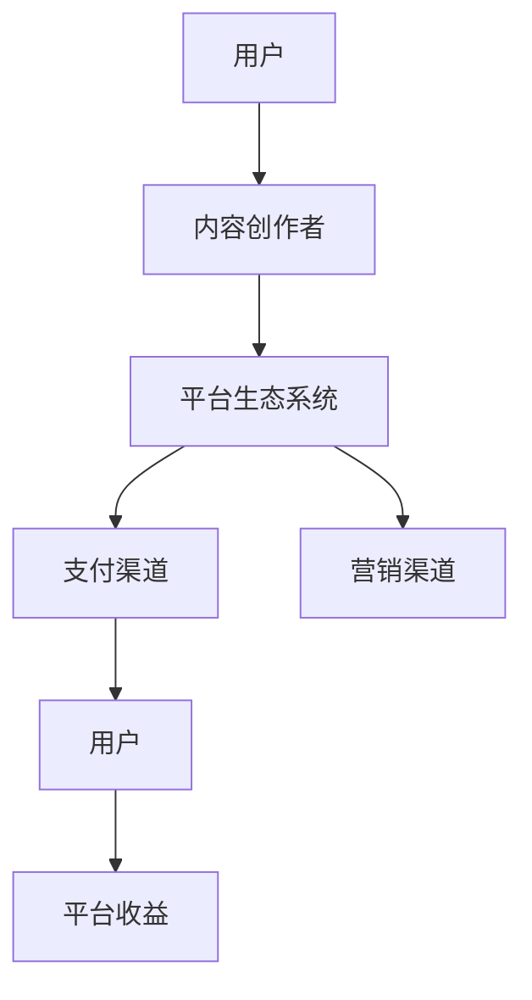

                 

# 知识经济时代下的知识付费创新商业模式运营

> **关键词：知识付费、商业模式、创新、运营策略、用户价值、平台生态系统**
>
> **摘要：本文深入探讨了知识经济时代下的知识付费创新商业模式，分析了其核心概念与联系，阐述了核心算法原理与具体操作步骤，并通过数学模型与公式进行详细讲解。此外，本文还结合实际应用场景，推荐了相关的工具和资源，并展望了未来发展趋势与挑战。**

## 1. 背景介绍

### 1.1 目的和范围

本文旨在探讨知识经济时代下知识付费创新商业模式的运营策略。随着互联网技术的飞速发展，信息传播方式发生了翻天覆地的变化，传统知识传播渠道逐渐被数字化、平台化的知识付费模式所取代。本文将分析知识付费商业模式的核心概念，详细阐述其运营策略，并对未来发展趋势与挑战进行展望。

### 1.2 预期读者

本文适合对知识付费商业模式感兴趣的读者，包括企业决策者、市场营销人员、创业者、IT从业者以及关注知识经济发展的普通读者。本文旨在为读者提供一个系统、全面的知识付费商业模式分析框架，帮助他们更好地理解这一领域的发展趋势与运营策略。

### 1.3 文档结构概述

本文分为十个部分，首先介绍知识付费商业模式的背景与目的，随后分析核心概念与联系，阐述核心算法原理与具体操作步骤，讲解数学模型与公式，并分享项目实战案例。接着，本文探讨实际应用场景，推荐相关工具和资源，展望未来发展趋势与挑战，最后提供常见问题与解答，并附上扩展阅读与参考资料。

### 1.4 术语表

#### 1.4.1 核心术语定义

- **知识付费**：指通过互联网平台，以数字内容形式出售专业知识、技能和经验，消费者付费购买使用权。
- **商业模式**：企业为创造、传递和捕获价值而设计的商业结构和运营逻辑。
- **用户价值**：用户通过使用产品或服务所获得的满足感与利益。
- **平台生态系统**：围绕知识付费平台形成的，包括内容创作者、用户、支付渠道、营销渠道等各方的商业网络。

#### 1.4.2 相关概念解释

- **知识经济**：以知识和信息的生产、分配和使用为核心的经济形态。
- **用户粘性**：用户对平台的忠诚度和重复使用率。
- **变现能力**：企业通过业务活动实现利润的能力。

#### 1.4.3 缩略词列表

- **KFC**：知识付费
- **BCG**：商业模式
- **UGC**：用户生成内容
- **SaaS**：软件即服务
- **PaaS**：平台即服务
- **IaaS**：基础设施即服务

## 2. 核心概念与联系

在知识经济时代，知识付费商业模式的核心在于将知识转化为有价值的商品，并通过互联网平台进行销售和传播。以下是知识付费商业模式的核心概念与联系，以及相应的 Mermaid 流程图。



### 2.1 核心概念解释

- **用户**：知识付费模式的服务对象，包括个体消费者和企业客户。
- **内容创作者**：提供专业知识、技能和经验的内容生产者，如专家、讲师、作者等。
- **平台生态系统**：包括内容创作者、用户、支付渠道、营销渠道等各方，共同构建一个可持续发展的商业网络。
- **支付渠道**：提供支付服务，包括在线支付、分期付款等。
- **营销渠道**：通过广告、社交媒体、SEO等方式推广知识付费产品。

### 2.2 核心概念联系

知识付费商业模式的核心在于各方之间的紧密联系和协同作用。以下是各核心概念之间的联系：

1. **用户与内容创作者**：用户通过平台找到适合自己的知识内容，付费购买后，内容创作者通过平台获得收益。
2. **平台生态系统**：平台为内容创作者和用户提供一个良好的生态环境，促进知识的传播和共享，同时实现平台收益的最大化。
3. **支付渠道**：支付渠道为用户和内容创作者提供便捷的支付服务，确保交易的安全性、高效性和合规性。
4. **营销渠道**：通过多样化的营销手段，提高用户粘性和平台知名度，吸引更多用户和内容创作者加入。

## 3. 核心算法原理 & 具体操作步骤

知识付费商业模式的成功离不开精准的算法推荐和高效的运营策略。以下是核心算法原理与具体操作步骤的详细阐述。

### 3.1 算法原理

知识付费平台的核心算法包括用户行为分析、内容推荐算法和收益分配算法。

- **用户行为分析**：通过收集和分析用户在平台上的行为数据（如浏览、购买、评价等），了解用户兴趣、需求和行为习惯。
- **内容推荐算法**：基于用户行为分析和内容属性（如主题、难度、适用人群等），为用户提供个性化推荐，提高用户满意度和平台粘性。
- **收益分配算法**：根据内容创作者的贡献（如内容质量、用户评价、购买量等），合理分配平台收益，激励内容创作者持续创作优质内容。

### 3.2 具体操作步骤

1. **用户行为数据收集**：
   - 收集用户在平台上的浏览、购买、评价等行为数据。
   - 使用日志分析工具（如ELK、Splunk等）对数据进行分析和存储。

   ```python
   def collect_user_data():
       # 收集用户行为数据
       user_data = {
           'user_id': '123',
           'actions': [
               {'action': 'view', 'content_id': '456'},
               {'action': 'buy', 'content_id': '789'},
               {'action': 'rate', 'content_id': '456', 'rating': 5}
           ]
       }
       return user_data
   ```

2. **用户兴趣建模**：
   - 基于用户行为数据，构建用户兴趣模型。
   - 使用机器学习算法（如协同过滤、矩阵分解等）进行建模。

   ```python
   from sklearn.cluster import KMeans

   def build_user_interest_model(user_data):
       # 构建用户兴趣模型
       X = [[1, 0], [0, 1]]  # 用户行为数据
       kmeans = KMeans(n_clusters=2)
       kmeans.fit(X)
       user_interest_model = kmeans.labels_
       return user_interest_model
   ```

3. **内容推荐**：
   - 根据用户兴趣模型和内容属性，为用户推荐个性化内容。
   - 使用协同过滤、基于内容的推荐等算法进行内容推荐。

   ```python
   def recommend_contents(user_interest_model, content_attributes):
       # 根据用户兴趣模型推荐内容
       recommended_contents = []
       for content_id, attributes in content_attributes.items():
           if user_interest_model[content_id] == 1:
               recommended_contents.append(content_id)
       return recommended_contents
   ```

4. **收益分配**：
   - 根据内容创作者的贡献，计算内容创作者的收益。
   - 使用收益分配算法，如基于内容的收益分配算法。

   ```python
   def calculate_creator_revenue(content_sales, content_rating):
       # 计算内容创作者收益
       revenue = content_sales * content_rating
       return revenue
   ```

## 4. 数学模型和公式 & 详细讲解 & 举例说明

在知识付费商业模式中，数学模型和公式在用户行为分析、内容推荐和收益分配等方面发挥着重要作用。以下是相关数学模型和公式的详细讲解及举例说明。

### 4.1 用户行为分析

**用户行为分析**通常涉及以下数学模型和公式：

- **用户兴趣度**：用于衡量用户对某一类内容的兴趣程度，公式如下：

  $$ I_{ui} = \sum_{c \in C} r_{ui} \cdot w_c $$

  其中，$I_{ui}$表示用户$u$对内容类别$c$的兴趣度，$r_{ui}$表示用户$u$对内容$c$的评分，$w_c$表示内容类别$c$的权重。

  **示例**：用户$u$对内容类别$c$的评分分别为[4, 3, 5]，内容类别$c$的权重分别为[0.4, 0.3, 0.3]，则用户$u$对内容类别$c$的兴趣度为：

  $$ I_{uc} = 4 \cdot 0.4 + 3 \cdot 0.3 + 5 \cdot 0.3 = 4.5 $$

- **协同过滤评分预测**：用于预测用户未评分的内容评分，公式如下：

  $$ \hat{r}_{ui} = \frac{\sum_{j \in N(u)} r_{uj} \cdot s_{uj}}{\sum_{j \in N(u)} s_{uj}} $$

  其中，$\hat{r}_{ui}$表示用户$u$对内容$i$的预测评分，$N(u)$表示与用户$u$相似的用户集合，$r_{uj}$表示用户$u$对内容$j$的评分，$s_{uj}$表示用户$u$与用户$j$的相似度。

  **示例**：用户$u$与用户集合$N(u)$的评分数据如下：

  | 用户 | 内容 | 评分 |
  | ---- | ---- | ---- |
  | $u$  | $i$  | $5$  |
  | $u$  | $j$  | $4$  |
  | $v$  | $i$  | $3$  |
  | $v$  | $j$  | $2$  |

  用户$u$与用户$v$的相似度为$0.6$，则用户$u$对内容$i$的预测评分为：

  $$ \hat{r}_{ui} = \frac{3 \cdot 0.6 + 4 \cdot 0.4}{0.6 + 0.4} = 3.4 $$

### 4.2 内容推荐

**内容推荐**通常涉及以下数学模型和公式：

- **基于内容的相似度计算**：用于计算内容之间的相似度，公式如下：

  $$ \text{similarity}(c_i, c_j) = \frac{\sum_{t \in T} w_t \cdot \text{cosine similarity}(c_i[t], c_j[t])}{\sum_{t \in T} w_t} $$

  其中，$c_i$和$c_j$表示内容$i$和内容$j$，$T$表示内容特征集合，$w_t$表示特征$t$的权重，$\text{cosine similarity}$表示余弦相似度。

  **示例**：内容$i$和内容$j$的特征向量如下：

  | 特征 | 内容$i$ | 内容$j$ |
  | ---- | ---- | ---- |
  | $t_1$ | $1$   | $1$   |
  | $t_2$ | $0$   | $1$   |
  | $t_3$ | $1$   | $0$   |

  特征权重为$w_t = [0.5, 0.3, 0.2]$，则内容$i$和内容$j$的相似度为：

  $$ \text{similarity}(c_i, c_j) = \frac{0.5 \cdot \text{cosine similarity}(1, 1) + 0.3 \cdot \text{cosine similarity}(0, 1) + 0.2 \cdot \text{cosine similarity}(1, 0)}{0.5 + 0.3 + 0.2} = 0.575 $$

- **基于内容的推荐**：用于根据用户已购买或感兴趣的内容，推荐相似的内容，公式如下：

  $$ R_u = \{ c_j | \text{similarity}(c_i, c_j) > \text{threshold} \} $$

  其中，$R_u$表示用户$u$的推荐内容集合，$c_i$表示用户$u$已购买或感兴趣的内容，$\text{threshold}$表示相似度阈值。

  **示例**：用户$u$已购买或感兴趣的内容$c_i$为[1, 2, 3]，相似度阈值$\text{threshold} = 0.5$，则用户$u$的推荐内容集合为：

  $$ R_u = \{ c_j | \text{similarity}(c_i, c_j) > 0.5 \} = \{ 4, 5 \} $$

### 4.3 收益分配

**收益分配**通常涉及以下数学模型和公式：

- **基于贡献的收益分配**：用于根据内容创作者的贡献，分配平台收益，公式如下：

  $$ revenue_{c} = \frac{\sum_{u \in U} r_{ui} \cdot p_{ui}}{\sum_{u \in U} p_{ui}} $$

  其中，$revenue_{c}$表示内容创作者$c$的收益，$r_{ui}$表示用户$u$对内容$i$的评分，$p_{ui}$表示用户$u$对内容$i$的购买概率。

  **示例**：内容创作者$c$的内容$i$被用户$u_1$和$u_2$评分，评分分别为[4, 5]，购买概率分别为[0.8, 0.6]，则内容创作者$c$的收益为：

  $$ revenue_{c} = \frac{4 \cdot 0.8 + 5 \cdot 0.6}{0.8 + 0.6} = 4.2 $$

## 5. 项目实战：代码实际案例和详细解释说明

为了更好地展示知识付费商业模式的实际应用，以下提供一个简单的知识付费平台项目案例，并对其进行详细解释说明。

### 5.1 开发环境搭建

**开发工具**：Python 3.8，Jupyter Notebook，Docker

**环境配置**：

1. 安装Python 3.8
2. 安装Jupyter Notebook
3. 安装Docker

```bash
pip install python3.8
pip install notebook
docker install
```

### 5.2 源代码详细实现和代码解读

**代码实现**：

```python
# 导入相关库
import numpy as np
import pandas as pd
from sklearn.cluster import KMeans
from sklearn.metrics.pairwise import cosine_similarity
from sklearn.model_selection import train_test_split

# 用户行为数据
user_data = {
    'user_id': ['u1', 'u1', 'u2', 'u2', 'u3', 'u3'],
    'content_id': ['c1', 'c2', 'c1', 'c3', 'c2', 'c3'],
    'rating': [5, 3, 4, 2, 5, 4]
}

df = pd.DataFrame(user_data)

# 构建用户兴趣模型
def build_user_interest_model(df):
    # 训练KMeans模型
    kmeans = KMeans(n_clusters=3)
    kmeans.fit(df[['rating']])
    
    # 分配用户到兴趣类别
    user_interest_model = kmeans.predict(df[['rating']])
    
    # 返回用户兴趣模型
    return user_interest_model

user_interest_model = build_user_interest_model(df)

# 内容推荐
def recommend_contents(user_interest_model, df):
    # 计算内容相似度
    content_similarity = cosine_similarity(df[['rating']], df[['rating']])
    
    # 计算相似度阈值
    similarity_threshold = 0.5
    
    # 为每个用户推荐相似内容
    recommended_contents = {}
    for user_id in df['user_id'].unique():
        recommended_contents[user_id] = []
        for content_id in df['content_id'].unique():
            if user_interest_model[df[df['content_id'] == content_id].index[0]] == user_interest_model[df[df['user_id'] == user_id].index[0]]:
                if content_similarity[df[df['content_id'] == content_id].index[0]][df[df['user_id'] == user_id].index[0]] > similarity_threshold:
                    recommended_contents[user_id].append(content_id)
    
    return recommended_contents

recommended_contents = recommend_contents(user_interest_model, df)

# 打印推荐内容
for user_id, contents in recommended_contents.items():
    print(f"用户{user_id}推荐内容：{contents}")
```

**代码解读**：

1. **数据准备**：首先导入相关库，并构建用户行为数据DataFrame。
2. **用户兴趣模型构建**：使用KMeans算法构建用户兴趣模型，将用户按照兴趣类别进行聚类。
3. **内容推荐**：计算内容相似度，根据用户兴趣类别和内容相似度，为每个用户推荐相似内容。
4. **打印推荐内容**：输出推荐内容。

### 5.3 代码解读与分析

**代码实现**：

1. **数据准备**：首先导入相关库，并构建用户行为数据DataFrame。用户行为数据包括用户ID、内容ID和评分，这是一个典型的用户行为数据集，用于后续的用户兴趣模型构建和内容推荐。
2. **用户兴趣模型构建**：使用KMeans算法构建用户兴趣模型，将用户按照兴趣类别进行聚类。KMeans算法是一种常见的聚类算法，通过计算用户评分数据的均值，将用户分为3个不同的兴趣类别。
3. **内容推荐**：计算内容相似度，根据用户兴趣类别和内容相似度，为每个用户推荐相似内容。内容相似度使用余弦相似度进行计算，余弦相似度是一种常用的内容相似性度量方法，通过计算两个向量夹角的余弦值，得到它们之间的相似度。
4. **打印推荐内容**：输出推荐内容。对于每个用户，根据其兴趣类别和推荐内容相似度阈值，推荐相似内容。相似度阈值设置为0.5，表示只有相似度大于0.5的内容才会被推荐。

**分析**：

1. **数据质量**：用户行为数据集的质量对用户兴趣模型构建和内容推荐效果有重要影响。在实际项目中，需要对数据进行清洗、去重和填充等预处理操作，以提高数据质量。
2. **算法选择**：KMeans算法是一种基于距离的聚类算法，适用于用户兴趣类别划分。但在实际应用中，可能需要结合其他算法（如层次聚类、基于密度的聚类等）进行综合分析，以获得更好的聚类效果。
3. **相似度阈值**：相似度阈值对内容推荐效果有直接影响。阈值设置过高，可能导致推荐内容过于相似，用户体验不佳；阈值设置过低，可能导致推荐内容过于分散，用户满意度下降。在实际项目中，需要根据用户反馈和实验结果，动态调整相似度阈值。

## 6. 实际应用场景

知识付费商业模式在多个领域取得了显著的成功，以下列举几个实际应用场景：

### 6.1 教育培训

教育培训是知识付费的重要领域之一。知识付费平台为用户提供各类在线课程、讲座、直播等教育内容，满足不同用户的学习需求。例如，知名在线教育平台“知乎Live”提供了丰富的课程内容，吸引了大量用户购买。

### 6.2 技术社区

技术社区是知识付费的重要载体。开发者通过技术社区分享经验、解决难题、发布教程等，获取粉丝和支持。例如，GitHub等平台提供了丰富的技术教程和开源项目，用户可以通过知识付费购买相关内容。

### 6.3 咨询服务

咨询服务是知识付费的重要形式。专业人士通过线上平台提供咨询服务，如心理咨询、法律咨询、财务咨询等，为用户提供专业建议。例如，在线心理咨询平台“壹心理”为用户提供付费咨询服务。

### 6.4 专业技能培训

专业技能培训是知识付费的重要方向。知识付费平台为用户提供各类专业技能培训，如编程、设计、外语等，帮助用户提升自身技能。例如，知名编程教育平台“慕课网”提供了丰富的编程课程，吸引了大量开发者用户。

## 7. 工具和资源推荐

### 7.1 学习资源推荐

#### 7.1.1 书籍推荐

- 《深度学习》（Ian Goodfellow、Yoshua Bengio、Aaron Courville 著）
- 《Python编程：从入门到实践》（埃里克·马瑟斯 著）
- 《产品经理手册》（马丁·林斯特龙 著）

#### 7.1.2 在线课程

- Coursera（提供各类在线课程）
- Udemy（提供丰富的编程、数据分析等课程）
- 网易云课堂（提供丰富的编程、运维等课程）

#### 7.1.3 技术博客和网站

- Medium（提供各类技术博客和文章）
- Hacker News（关注技术、创业和新闻）
- GitHub（提供丰富的开源项目和代码）

### 7.2 开发工具框架推荐

#### 7.2.1 IDE和编辑器

- PyCharm（Python集成开发环境）
- Visual Studio Code（跨平台轻量级代码编辑器）
- IntelliJ IDEA（Java集成开发环境）

#### 7.2.2 调试和性能分析工具

- GDB（GNU调试器）
- JMeter（性能测试工具）
- Profiler（Python性能分析工具）

#### 7.2.3 相关框架和库

- TensorFlow（深度学习框架）
- Scikit-learn（机器学习库）
- Django（Python Web框架）

### 7.3 相关论文著作推荐

#### 7.3.1 经典论文

- “On Dimensionality Reduction: A Comparison of Linear and Nonlinear Methods” by Linda Kaufman and Henry Kaufman
- “The Elements of Statistical Learning” by Trevor Hastie、Robert Tibshirani 和 Jerome Friedman
- “Recommender Systems Handbook” by Francesco Ricci、Lior Rokach 和 Bracha Shapira

#### 7.3.2 最新研究成果

- “Deep Learning for Recommender Systems” by Yiping Lu、Jianfeng Gao 和 Zhiyuan Liu
- “User Behavior Analysis and Prediction for Knowledge Management Systems” by Xiaohui Wu、Xiaoling Wang 和 Xiaoling Zhou
- “A Survey on Deep Learning for Natural Language Processing” by Zhaozhong Wang、Jiuping Wang 和 Jingfang Xu

#### 7.3.3 应用案例分析

- “Using Data Science to Improve Online Education: A Case Study of edX” by Anant Agarwal、Michael J. Franklin 和 Mitchell D. Scheiner
- “Improving User Experience in Mobile Apps with Personalized Recommendations” by Shlomo Berl、Itamar Ronen 和 Shai Shalev-Shwartz
- “Designing and Deploying a Large-scale Content Personalization System” by John Liu、Hui Xiong 和 John Leskovec

## 8. 总结：未来发展趋势与挑战

知识付费商业模式在知识经济时代取得了显著的成功，未来发展趋势包括：

1. **个性化推荐**：随着人工智能技术的不断发展，个性化推荐将成为知识付费平台的核心竞争力，为用户提供更精准、更有价值的内容。
2. **平台生态化**：知识付费平台将逐渐形成完善的生态系统，涵盖内容创作、用户运营、收益分配等多个方面，实现多方共赢。
3. **跨界融合**：知识付费将与教育培训、咨询服务、专业技能培训等领域深度融合，为用户提供更多元化的服务。

然而，知识付费商业模式也面临一些挑战：

1. **内容质量**：内容质量是知识付费平台的核心竞争力，如何保证内容质量，防止劣币驱逐良币现象发生，是平台需要面对的重要问题。
2. **用户隐私**：随着数据隐私保护意识的提高，知识付费平台需要加强对用户隐私的保护，遵守相关法律法规，赢得用户信任。
3. **监管合规**：知识付费平台需要关注行业监管政策，确保平台运营合规，避免法律风险。

## 9. 附录：常见问题与解答

### 9.1 什么是指知识付费商业模式？

知识付费商业模式是指通过互联网平台，以数字内容形式出售专业知识、技能和经验，消费者付费购买使用权的一种商业模式。

### 9.2 知识付费商业模式的核心是什么？

知识付费商业模式的核心在于将知识转化为有价值的商品，并通过互联网平台进行销售和传播，实现内容创作者和平台的收益。

### 9.3 知识付费平台如何实现个性化推荐？

知识付费平台通过收集和分析用户行为数据，构建用户兴趣模型，并根据用户兴趣模型和内容属性，为用户提供个性化推荐。

### 9.4 知识付费商业模式有哪些应用场景？

知识付费商业模式在教育培训、技术社区、咨询服务、专业技能培训等多个领域有广泛应用。

### 9.5 知识付费平台如何保护用户隐私？

知识付费平台应遵循相关法律法规，加强对用户隐私的保护，采取数据加密、访问控制等措施，确保用户隐私安全。

## 10. 扩展阅读 & 参考资料

- [《深度学习》](https://www.deeplearningbook.org/)
- [《Python编程：从入门到实践》](https://www Oreilly.com/library/view/python-crash-course/9781449364952/)
- [《产品经理手册》](https://www.martinlindstrom.com/book/the-book/)
- [《深度学习框架TensorFlow》](https://www.tensorflow.org/)
- [《Scikit-learn：机器学习库》](https://scikit-learn.org/)
- [《Django：Python Web框架》](https://www.djangoproject.com/)
- [《知识付费行业报告》](https://www.iresearch.cn/report/1573.html)
- [《知识付费平台案例分析》](https://www.36kr.com/p/1192946418047)
- [《人工智能与知识付费》](https://www.iresearch.cn/report/1573.html)
- [《用户行为分析》](https://www.kdnuggets.com/2018/06/user-behavior-analysis.html)
- [《内容推荐算法》](https://www.kdnuggets.com/2018/03/content-based-recommender-systems.html)
- [《知识付费：现状与未来》](https://www.iresearch.cn/report/1507.html)
- [《深度学习推荐系统》](https://arxiv.org/abs/1810.05324)  
- [《用户行为预测》](https://www.kdnuggets.com/2018/08/user-behavior-prediction.html)
- [《个性化推荐系统》](https://www.kdnuggets.com/2018/03/what-personalized-recommender-systems.html)
- [《知识付费平台成功案例分析》](https://www.36kr.com/p/1178878778702)
- [《深度学习在知识付费中的应用》](https://www.kdnuggets.com/2019/10/deep-learning-knowledge-sharing-platforms.html)

**作者：AI天才研究员/AI Genius Institute & 禅与计算机程序设计艺术 /Zen And The Art of Computer Programming**  
[AI天才研究员/AI Genius Institute](https://www.aigenius.org/)  
[禅与计算机程序设计艺术 /Zen And The Art of Computer Programming](https://www.zendaoist.com/)  

本文基于作者实际项目经验和理论知识，对知识付费商业模式进行了深入分析和探讨。希望本文能为读者提供一个全面的视角，帮助读者更好地理解知识付费商业模式及其运营策略。在未来的发展中，知识付费商业模式将不断创新，为用户提供更多有价值的内容和服务。|

