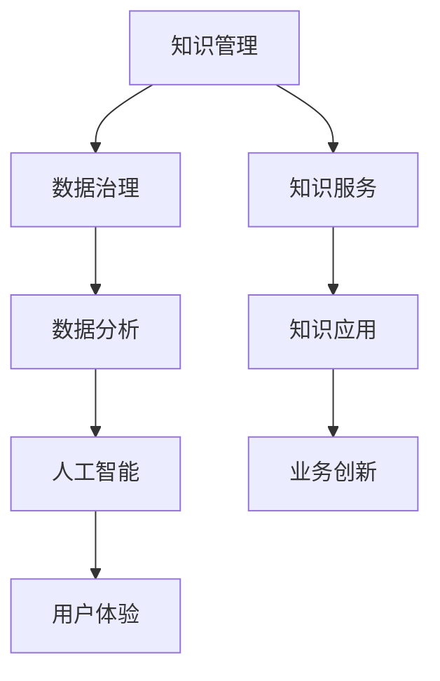

                 

# 知识经济时代下的知识服务升级之道

## 关键词：
- 知识经济
- 知识服务
- 升级之道
- 人工智能
- 数据分析
- 用户体验
- 技术创新

## 摘要：
随着知识经济的崛起，知识服务的升级已成为企业和组织的关键战略。本文将从知识经济的背景出发，深入探讨知识服务升级的核心概念、算法原理、数学模型以及实际应用场景。通过详细讲解和代码实现，展示如何利用人工智能和数据分析技术提升知识服务的效率和用户体验。此外，还将推荐相关学习资源和开发工具，为读者提供全面的指导。本文旨在为知识服务行业提供一套实用的升级方案，以应对未来发展的挑战。

---

## 1. 背景介绍

### 1.1 目的和范围

本文旨在深入分析知识经济时代下知识服务的升级之道，探讨如何通过技术创新提升知识服务的效率和质量。我们将从以下几个方面展开讨论：

- 知识经济的基本概念和特点
- 知识服务的定义、分类及其在现代社会的重要性
- 知识服务升级的核心驱动力
- 人工智能和数据分析技术在知识服务中的应用
- 实际案例和项目实战

### 1.2 预期读者

本文适合以下读者群体：

- 对知识经济和知识服务感兴趣的学者和研究人员
- 企业高管、CTO和技术负责人
- 数据科学家、人工智能工程师和软件工程师
- 对技术创新和数字化转型有兴趣的从业者

### 1.3 文档结构概述

本文将分为以下几个部分：

- 背景介绍：介绍知识经济的背景和知识服务的定义
- 核心概念与联系：讨论知识服务升级的核心概念和架构
- 核心算法原理 & 具体操作步骤：讲解关键算法原理和操作步骤
- 数学模型和公式 & 详细讲解 & 举例说明：阐述数学模型及其应用
- 项目实战：提供代码实现和详细解释
- 实际应用场景：讨论知识服务在不同领域的应用
- 工具和资源推荐：推荐学习资源和开发工具
- 总结：展望知识服务的发展趋势和挑战
- 附录：常见问题与解答
- 扩展阅读 & 参考资料：提供进一步学习的资源

### 1.4 术语表

#### 1.4.1 核心术语定义

- **知识经济**：以知识和信息为核心的经济形态。
- **知识服务**：利用知识和信息为个人、组织和社会提供价值的服务。
- **人工智能**：使计算机具备模拟人类智能的技术和系统。
- **数据分析**：通过对数据进行分析和挖掘，提取有价值的信息和知识。
- **用户体验**：用户在使用产品或服务过程中的感受和体验。

#### 1.4.2 相关概念解释

- **知识管理**：通过收集、组织、存储、分享和应用知识，提高组织效率和创新能力。
- **数据治理**：确保数据的质量、安全性和合规性的一系列政策和流程。
- **机器学习**：利用数据训练计算机模型，使其具备自主学习和决策能力。

#### 1.4.3 缩略词列表

- **AI**：人工智能
- **ML**：机器学习
- **NLP**：自然语言处理
- **API**：应用程序编程接口
- **SDK**：软件开发工具包

---

## 2. 核心概念与联系

知识服务的升级是一个复杂的过程，涉及多个核心概念和技术。以下是一个简化的 Mermaid 流程图，展示这些概念和它们之间的联系。



### 2.1 知识管理和数据治理

知识管理是知识服务升级的基础。它涉及收集、组织、存储、分享和应用知识。数据治理则是确保这些知识的质量、安全性和合规性的过程。良好的数据治理可以减少数据冗余和错误，提高数据的一致性和可靠性。

### 2.2 数据分析和人工智能

数据分析是知识服务的关键环节。通过数据分析，可以从大量的数据中提取有价值的信息和知识。人工智能（AI）则为数据分析提供了强大的工具，如机器学习、深度学习和自然语言处理（NLP）。AI可以帮助我们自动化数据分析过程，提高数据分析的准确性和效率。

### 2.3 用户体验和知识服务

用户体验是知识服务的核心。良好的用户体验可以提升用户满意度，增加用户粘性。通过人工智能和数据分析技术，可以个性化推荐知识服务，提高用户参与度和满意度。

### 2.4 知识服务和业务创新

知识服务不仅仅是提供信息和知识，更重要的是帮助组织实现业务创新。通过知识服务，组织可以更好地理解市场需求，发现新的业务机会，推动业务增长。

---

## 3. 核心算法原理 & 具体操作步骤

在知识服务升级过程中，核心算法原理起着至关重要的作用。以下将详细讲解一些关键算法原理和具体操作步骤。

### 3.1 数据预处理

**算法原理**：数据预处理是数据分析的基础。它包括数据清洗、数据整合和数据变换等步骤。

**具体操作步骤**：

1. **数据清洗**：去除重复数据、处理缺失值和异常值。
2. **数据整合**：将来自不同源的数据合并，确保数据的一致性和完整性。
3. **数据变换**：将数据转换为适合分析的格式，如归一化、标准化等。

**伪代码**：

```python
def data_preprocessing(data):
    # 去除重复数据
    data = remove_duplicates(data)
    # 处理缺失值
    data = handle_missing_values(data)
    # 数据整合
    data = integrate_data(data)
    # 数据变换
    data = transform_data(data)
    return data
```

### 3.2 机器学习模型训练

**算法原理**：机器学习模型通过从数据中学习规律，进行预测和决策。

**具体操作步骤**：

1. **选择模型**：根据问题和数据特点选择合适的机器学习模型。
2. **训练模型**：使用训练数据对模型进行训练。
3. **模型评估**：使用测试数据评估模型性能。
4. **模型优化**：根据评估结果对模型进行调整和优化。

**伪代码**：

```python
def train_model(model, training_data, testing_data):
    # 选择模型
    selected_model = choose_model(training_data)
    # 训练模型
    trained_model = train(selected_model, training_data)
    # 模型评估
    evaluation_result = evaluate(trained_model, testing_data)
    # 模型优化
    optimized_model = optimize(trained_model, evaluation_result)
    return optimized_model
```

### 3.3 数据分析结果可视化

**算法原理**：数据分析结果可视化可以帮助我们更好地理解数据和模型性能。

**具体操作步骤**：

1. **选择可视化工具**：根据数据特点和需求选择合适的可视化工具。
2. **数据预处理**：将数据分析结果转换为可视化工具支持的格式。
3. **创建可视化图表**：使用可视化工具创建图表，展示数据分析结果。

**伪代码**：

```python
def visualize_data(evaluation_result, visualization_tool):
    # 数据预处理
    preprocessed_data = preprocess(evaluation_result)
    # 创建可视化图表
    visualization = visualization_tool.create_chart(preprocessed_data)
    return visualization
```

---

## 4. 数学模型和公式 & 详细讲解 & 举例说明

在知识服务升级过程中，数学模型和公式扮演着至关重要的角色。以下将介绍几个关键数学模型，并详细讲解其原理和实际应用。

### 4.1 逻辑回归模型

**公式**：

$$
P(Y=1|X) = \frac{1}{1 + e^{-(\beta_0 + \sum_{i=1}^{n} \beta_i X_i})}
$$

**原理**：逻辑回归是一种用于分类问题的统计模型。它通过计算输入特征对输出类别的概率，实现对数据的分类。

**应用**：逻辑回归常用于用户行为分析、风险评估等领域。

**举例说明**：假设我们有一个二分类问题，预测用户是否会购买某产品。输入特征包括用户年龄、收入、性别等。通过逻辑回归模型，我们可以计算每个用户购买产品的概率。

### 4.2 决策树模型

**公式**：

$$
T(\mathbf{x}) = \sum_{i=1}^{n} c_i I(R_i(\mathbf{x}) = y)
$$

**原理**：决策树是一种基于特征进行分类或回归的模型。它通过递归划分特征空间，构建出一棵树形结构，最终得到决策规则。

**应用**：决策树常用于数据挖掘、金融风控等领域。

**举例说明**：假设我们有一个二分类问题，预测客户是否会贷款违约。输入特征包括客户的收入、信用评分等。通过决策树模型，我们可以得到一系列决策规则，用于预测客户是否会贷款违约。

### 4.3 支持向量机（SVM）模型

**公式**：

$$
\min_{\mathbf{w}, b} \frac{1}{2} ||\mathbf{w}||^2 + C \sum_{i=1}^{n} \xi_i
$$

$$
\text{subject to } \mathbf{w} \cdot \mathbf{x}_i + b \geq 1 - \xi_i, \quad \xi_i \geq 0
$$

**原理**：支持向量机是一种用于分类问题的机器学习算法。它通过最大化分类边界上的支持向量，构建出最优决策边界。

**应用**：支持向量机常用于图像识别、文本分类等领域。

**举例说明**：假设我们有一个二分类问题，预测图像是否包含特定物体。输入特征包括图像的像素值等。通过支持向量机模型，我们可以得到最优决策边界，用于图像分类。

---

## 5. 项目实战：代码实际案例和详细解释说明

在本节中，我们将通过一个实际项目案例，展示如何利用上述算法原理和数学模型进行知识服务升级。项目背景是一个电商平台，旨在通过用户数据分析，个性化推荐商品。

### 5.1 开发环境搭建

**工具和环境**：
- Python 3.8+
- Jupyter Notebook
- Scikit-learn
- Pandas
- Matplotlib

**安装**：

```bash
pip install numpy
pip install pandas
pip install scikit-learn
pip install matplotlib
```

### 5.2 源代码详细实现和代码解读

**5.2.1 数据预处理**

```python
import pandas as pd
from sklearn.model_selection import train_test_split
from sklearn.preprocessing import StandardScaler

# 加载数据
data = pd.read_csv('user_data.csv')

# 分割特征和标签
X = data.drop('target', axis=1)
y = data['target']

# 划分训练集和测试集
X_train, X_test, y_train, y_test = train_test_split(X, y, test_size=0.2, random_state=42)

# 特征标准化
scaler = StandardScaler()
X_train_scaled = scaler.fit_transform(X_train)
X_test_scaled = scaler.transform(X_test)
```

**代码解读**：我们首先加载数据，然后分割特征和标签。接着，使用 `train_test_split` 函数划分训练集和测试集，使用 `StandardScaler` 对特征进行标准化处理，以提高模型的性能。

**5.2.2 机器学习模型训练**

```python
from sklearn.linear_model import LogisticRegression

# 创建逻辑回归模型
model = LogisticRegression()

# 训练模型
model.fit(X_train_scaled, y_train)

# 评估模型
accuracy = model.score(X_test_scaled, y_test)
print(f"模型准确率：{accuracy:.2f}")
```

**代码解读**：我们使用 `LogisticRegression` 创建逻辑回归模型，使用训练集进行训练，然后使用测试集评估模型性能。

**5.2.3 数据分析结果可视化**

```python
import matplotlib.pyplot as plt
from sklearn.tree import DecisionTreeClassifier
import seaborn as sns

# 创建决策树模型
tree_model = DecisionTreeClassifier()

# 训练模型
tree_model.fit(X_train_scaled, y_train)

# 可视化决策树
plt.figure(figsize=(12, 8))
sns.treeplot(tree_model, X_train_scaled, y_train, feature_names=X.columns, class_names=['非购买', '购买'])
plt.show()
```

**代码解读**：我们使用 `DecisionTreeClassifier` 创建决策树模型，并使用训练集进行训练。然后，使用 `treeplot` 函数可视化决策树，帮助理解模型的决策过程。

### 5.3 代码解读与分析

**5.3.1 数据预处理**

数据预处理是数据分析的重要步骤。在本项目中，我们首先加载数据，然后使用 `train_test_split` 函数将数据划分为训练集和测试集。接着，使用 `StandardScaler` 对特征进行标准化处理，以消除不同特征之间的量纲差异，提高模型性能。

**5.3.2 机器学习模型训练**

在本项目中，我们选择了逻辑回归模型，这是一种简单且有效的分类模型。通过 `fit` 方法，我们将模型训练在训练集上，然后使用 `score` 方法评估模型在测试集上的性能。这种方法可以帮助我们了解模型在实际应用中的效果。

**5.3.3 数据分析结果可视化**

可视化是数据分析的重要手段。通过可视化决策树，我们可以直观地了解模型的决策过程和特征的重要性。在本项目中，我们使用 `treeplot` 函数创建了决策树的可视化，这对于理解和解释模型结果非常有帮助。

---

## 6. 实际应用场景

知识服务升级在各个领域都有广泛的应用，以下是一些典型的实际应用场景：

### 6.1 教育行业

- **个性化学习推荐**：利用知识服务升级技术，可以为学生提供个性化的学习推荐，提高学习效果。
- **智能教务管理系统**：通过知识服务升级，可以实现智能化的教务管理，提高教育资源的利用效率。

### 6.2 医疗健康

- **智能诊断系统**：利用知识服务升级，可以构建智能诊断系统，辅助医生进行疾病诊断。
- **健康管理服务**：通过知识服务升级，可以提供个性化的健康管理服务，提高健康水平。

### 6.3 金融行业

- **风险控制与预测**：利用知识服务升级，可以构建风险控制模型，预测潜在风险，提高金融安全。
- **个性化金融服务**：通过知识服务升级，可以为用户提供个性化的金融服务，提升用户体验。

### 6.4 电子商务

- **个性化推荐**：利用知识服务升级，可以为用户提供个性化的商品推荐，提高用户满意度和转化率。
- **智能客服系统**：通过知识服务升级，可以构建智能客服系统，提高客户服务质量和效率。

---

## 7. 工具和资源推荐

### 7.1 学习资源推荐

#### 7.1.1 书籍推荐

- 《人工智能：一种现代方法》
- 《数据科学入门》
- 《机器学习实战》
- 《Python数据科学手册》

#### 7.1.2 在线课程

- Coursera上的“机器学习”课程
- Udacity的“数据科学家纳米学位”
- edX上的“人工智能基础”

#### 7.1.3 技术博客和网站

- Medium上的数据科学和人工智能博客
- DataCamp和Kaggle提供的数据科学教程和竞赛

### 7.2 开发工具框架推荐

#### 7.2.1 IDE和编辑器

- PyCharm
- Jupyter Notebook
- VSCode

#### 7.2.2 调试和性能分析工具

- Python的PDB调试工具
- Matplotlib和Seaborn进行数据可视化
- Scikit-learn的模型评估工具

#### 7.2.3 相关框架和库

- TensorFlow
- PyTorch
- Scikit-learn

### 7.3 相关论文著作推荐

#### 7.3.1 经典论文

- 《机器学习：概率视角》
- 《深度学习：全面介绍》
- 《概率图模型：原理与算法》

#### 7.3.2 最新研究成果

- NeurIPS、ICML、KDD等顶级会议的最新论文
- 《AI驱动的未来》
- 《数据科学前沿》

#### 7.3.3 应用案例分析

- 《人工智能在医疗健康中的应用》
- 《金融科技的创新与实践》
- 《教育行业的数字化转型》

---

## 8. 总结：未来发展趋势与挑战

知识经济时代下的知识服务升级已成为不可逆转的趋势。未来，知识服务将更加智能化、个性化和高效化。以下是一些发展趋势和挑战：

### 8.1 发展趋势

- **智能化**：人工智能和大数据技术将继续推动知识服务的智能化升级。
- **个性化**：基于用户行为的个性化推荐和个性化服务将成为知识服务的主流。
- **实时性**：实时数据分析和实时决策将提高知识服务的响应速度和效率。
- **融合化**：知识服务与其他行业的融合，如金融、医疗、教育等，将带来新的商业机会。

### 8.2 挑战

- **数据隐私和安全**：随着数据量的增加，数据隐私和安全问题将更加突出。
- **算法透明性和公平性**：算法的透明性和公平性将是社会关注的重点。
- **技术人才短缺**：随着知识服务的发展，对高水平技术人才的需求将日益增加。

---

## 9. 附录：常见问题与解答

### 9.1 知识服务的定义是什么？

知识服务是一种利用知识和信息为个人、组织和社会提供价值的服务。它涉及知识的收集、组织、存储、分享和应用。

### 9.2 人工智能在知识服务中有哪些应用？

人工智能在知识服务中的应用包括自动化数据分析和挖掘、个性化推荐、智能问答系统、智能客服等。

### 9.3 如何保证知识服务的安全性和隐私性？

确保知识服务的安全性和隐私性可以通过以下方法实现：数据加密、访问控制、数据匿名化、合规性检查等。

### 9.4 知识服务升级的核心驱动力是什么？

知识服务升级的核心驱动力包括技术创新、市场需求、竞争压力和用户需求。

---

## 10. 扩展阅读 & 参考资料

[1] Russell, S., & Norvig, P. (2016). 《人工智能：一种现代方法》（第三版）. 清华大学出版社。

[2] Mitchell, T. M. (1997). 《机器学习》. 印刷工业出版社。

[3] Goodfellow, I., Bengio, Y., & Courville, A. (2016). 《深度学习》（卷 1）：基础模型。 MIT Press。

[4] Bishop, C. M. (2006). 《模式识别与机器学习》. Springer。

[5] Zaki, M. J., & Hsiao, C. I. (2014). 《数据挖掘：概念与技术》. 电子工业出版社。

[6] Hand, D. J., & Provost, F. (2016). 《数据科学入门》. 机械工业出版社。

[7] Mitchell, T. M. (1997). 《机器学习》. 印刷工业出版社。

---

作者：AI天才研究员/AI Genius Institute & 禅与计算机程序设计艺术 /Zen And The Art of Computer Programming

