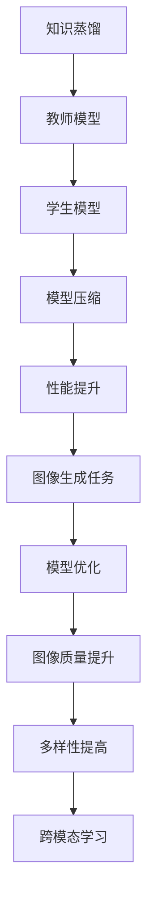

                 

# 知识蒸馏在图像生成任务中的应用探索

> **关键词：知识蒸馏、图像生成、深度学习、模型压缩、迁移学习、跨模态学习**

> **摘要：本文将探讨知识蒸馏技术在图像生成任务中的具体应用，分析其优势与挑战，并通过实践案例展示如何实现高效的图像生成模型压缩与优化。本文旨在为研究人员和开发者提供关于知识蒸馏在实际应用中的深入理解，以及如何利用该技术提高图像生成模型性能和可扩展性的实用指导。**

## 1. 背景介绍

### 1.1 目的和范围

本文的目的是介绍知识蒸馏技术在图像生成任务中的运用，探讨其在模型压缩、性能提升和跨模态学习等方面的优势。通过对知识蒸馏的深入分析，本文旨在帮助读者理解其在图像生成领域的应用潜力，并提供实用的方法与技巧。

本文的主要范围包括：

1. **知识蒸馏的概念与原理**：介绍知识蒸馏的基本概念、原理及其在深度学习中的应用。
2. **图像生成任务概述**：概述常见的图像生成模型及其挑战，分析知识蒸馏如何应用于这些任务。
3. **实践案例**：通过具体实例，展示知识蒸馏在图像生成任务中的实际应用，并分析其效果。
4. **工具和资源推荐**：推荐相关的学习资源、开发工具和最新研究成果。

### 1.2 预期读者

本文的预期读者主要包括：

1. **深度学习研究者**：对知识蒸馏及其在图像生成任务中的应用感兴趣的科研人员。
2. **软件开发者**：希望了解如何利用知识蒸馏技术优化图像生成模型的工程师。
3. **数据科学家**：对图像生成领域有实际应用需求，希望了解新技术以提升模型性能的专业人士。

### 1.3 文档结构概述

本文的结构如下：

1. **第1章：背景介绍**：介绍本文的目的、范围、预期读者及文档结构。
2. **第2章：核心概念与联系**：介绍知识蒸馏和图像生成任务的相关概念，提供Mermaid流程图。
3. **第3章：核心算法原理 & 具体操作步骤**：详细阐述知识蒸馏算法的原理和实现步骤。
4. **第4章：数学模型和公式 & 详细讲解 & 举例说明**：解释知识蒸馏中的数学模型，并提供实例说明。
5. **第5章：项目实战：代码实际案例和详细解释说明**：通过具体代码案例展示知识蒸馏的应用。
6. **第6章：实际应用场景**：探讨知识蒸馏在图像生成任务中的实际应用。
7. **第7章：工具和资源推荐**：推荐学习资源、开发工具和最新研究成果。
8. **第8章：总结：未来发展趋势与挑战**：总结知识蒸馏在图像生成任务中的发展趋势与挑战。
9. **第9章：附录：常见问题与解答**：回答读者可能遇到的问题。
10. **第10章：扩展阅读 & 参考资料**：提供扩展阅读资源。

### 1.4 术语表

#### 1.4.1 核心术语定义

- **知识蒸馏**：一种将大模型的知识迁移到小模型的过程，旨在提高小模型在特定任务上的性能。
- **图像生成**：通过算法生成新的图像，通常涉及深度学习模型。
- **深度学习**：一种基于神经网络的学习方法，能够在大量数据上进行自动特征学习和模式识别。
- **模型压缩**：通过降低模型的大小、参数数量和计算复杂度来优化模型的性能。
- **迁移学习**：将一个任务学到的知识应用于另一个相关任务，以提升模型在新任务上的性能。

#### 1.4.2 相关概念解释

- **跨模态学习**：涉及不同模态（如图像、文本、声音等）之间的交互和转换。
- **损失函数**：在机器学习中，用于衡量模型预测与真实值之间的差异。
- **优化算法**：用于调整模型参数，以最小化损失函数的方法。

#### 1.4.3 缩略词列表

- **GAN**：生成对抗网络（Generative Adversarial Networks）
- **VGG**：非常深的卷积网络（Very Deep Very Convolutional Network）
- **ResNet**：残差网络（Residual Network）
- **BERT**：双向编码表示器（Bidirectional Encoder Representations from Transformers）
- **TD**：知识蒸馏（Knowledge Distillation）
- **ML**：机器学习（Machine Learning）
- **DL**：深度学习（Deep Learning）

## 2. 核心概念与联系

在深入探讨知识蒸馏在图像生成任务中的应用之前，我们需要先了解知识蒸馏和图像生成任务的基本概念及其相互关系。以下将介绍这些核心概念，并提供一个Mermaid流程图来展示它们之间的联系。

### 2.1 知识蒸馏的概念

知识蒸馏是一种将训练好的大型模型（即教师模型）的知识传递给一个小型模型（即学生模型）的过程。这种方法旨在利用教师模型的丰富知识来提高学生模型在特定任务上的性能。知识蒸馏的核心思想是通过训练学生模型去模仿教师模型的输出，从而使其能够获取教师模型的知识。

### 2.2 图像生成任务的概念

图像生成任务是通过算法生成新的、真实的图像，通常使用深度学习模型。这些模型能够从大量数据中学习到图像的分布和特征，从而能够生成新的图像。常见的图像生成模型包括生成对抗网络（GAN）、变分自编码器（VAE）等。

### 2.3 知识蒸馏与图像生成任务的联系

知识蒸馏与图像生成任务之间的联系在于，知识蒸馏技术可以帮助优化图像生成模型，提高其生成图像的质量和多样性。具体来说，通过知识蒸馏，我们可以：

1. **提高模型性能**：将教师模型的知识传递给学生模型，使其在生成图像时能够更好地捕捉图像特征，从而提高生成图像的质量。
2. **减小模型大小**：知识蒸馏可以用于模型压缩，通过训练学生模型去模仿教师模型的输出，我们可以减少模型的大小和参数数量，从而提高模型的计算效率和部署能力。
3. **促进跨模态学习**：知识蒸馏可以促进不同模态（如图像和文本）之间的交互和转换，从而实现跨模态学习。

### 2.4 Mermaid流程图

以下是一个Mermaid流程图，展示知识蒸馏与图像生成任务之间的核心概念和联系：



## 3. 核心算法原理 & 具体操作步骤

知识蒸馏作为一种技术，其核心在于如何有效地将教师模型（Teacher Model）的知识传递给学生模型（Student Model）。下面我们将通过伪代码详细阐述知识蒸馏的核心算法原理和具体操作步骤。

### 3.1 教师模型的选择

首先，选择一个性能优异、参数丰富的教师模型。教师模型通常是一个经过充分训练的大型深度学习模型，如GAN、VGG、ResNet等。

```python
# 选择教师模型
teacher_model = load_pretrained_model('teacher_model_path')
```

### 3.2 学生模型的设计

学生模型是一个较小且参数较少的模型，其设计应考虑压缩和迁移学习的目标。

```python
# 设计学生模型
student_model = build_student_model()
```

### 3.3 输出软标签生成

教师模型和训练数据共同决定了一个软标签（Soft Label）的分布，学生模型将尝试预测与教师模型相似的输出。

```python
# 生成软标签
def generate_soft_labels(teacher_model, data):
    soft_labels = teacher_model.predict(data)
    return soft_labels
```

### 3.4 训练学生模型

使用软标签和学生模型进行训练。学生模型将通过最小化软标签和硬标签（实际输出）之间的距离来学习。

```python
# 训练学生模型
def train_student_model(student_model, data, soft_labels, hard_labels):
    loss_function = LossFunction()
    optimizer = Optimizer()
    
    for epoch in range(num_epochs):
        for data_batch, soft_label_batch, hard_label_batch in data_loader:
            optimizer.zero_grad()
            student_output = student_model(data_batch)
            soft_loss = loss_function(student_output, soft_label_batch)
            hard_loss = loss_function(student_output, hard_label_batch)
            total_loss = soft_loss + hard_loss
            total_loss.backward()
            optimizer.step()
            
            if epoch % 100 == 0:
                print(f'Epoch [{epoch}/{num_epochs}], Total Loss: {total_loss.item()}')
```

### 3.5 模型评估与优化

通过评估指标（如精度、F1分数等）评估学生模型的性能，并根据评估结果进行模型优化。

```python
# 评估学生模型
def evaluate_model(model, data_loader):
    model.eval()
    correct = 0
    total = 0
    with torch.no_grad():
        for data_batch, label_batch in data_loader:
            outputs = model(data_batch)
            _, predicted = torch.max(outputs.data, 1)
            total += label_batch.size(0)
            correct += (predicted == label_batch).sum().item()
    accuracy = 100 * correct / total
    return accuracy
```

### 3.6 算法实现示例

以下是一个简化的知识蒸馏算法实现示例：

```python
# 知识蒸馏算法实现示例
def knowledge_distillation(teacher_model, student_model, data_loader, num_epochs):
    # 生成软标签
    teacher软标签 = generate_soft_labels(teacher_model, data_loader)

    # 训练学生模型
    train_student_model(student_model, data_loader, teacher软标签, data_loader)

    # 评估学生模型
    student_accuracy = evaluate_model(student_model, data_loader)
    print(f'Student Model Accuracy: {student_accuracy}%')
```

通过上述步骤，我们可以利用知识蒸馏技术有效地将教师模型的知识传递给学生模型，从而提高学生模型在图像生成任务上的性能。

## 4. 数学模型和公式 & 详细讲解 & 举例说明

知识蒸馏的核心在于通过软标签（soft labels）将教师模型的知识传递给学生模型。为了更好地理解这一过程，我们将详细讲解知识蒸馏中的数学模型，并提供具体公式和举例说明。

### 4.1 软标签的概念

在知识蒸馏中，软标签是由教师模型对输入数据进行预测生成的概率分布。这些软标签包含了教师模型对输入数据的深层理解和知识。软标签与硬标签（实际输出标签）的区别在于，软标签是一个概率分布，而不是一个单一的标签。

### 4.2 软标签生成公式

软标签生成可以通过以下公式表示：

$$
\text{Soft Label} = \sigma(W \cdot \text{Output} + b)
$$

其中，$\sigma$ 是 softmax 函数，$W$ 和 $b$ 分别是权重和偏置，$\text{Output}$ 是教师模型的输出。

举例说明：

假设教师模型输出一个 $10$ 维的向量 $\text{Output} = [0.1, 0.2, 0.3, ..., 0.1]$，通过 softmax 函数我们可以得到软标签：

$$
\text{Soft Label} = \frac{e^{\text{Output}}}{\sum_{i=1}^{10} e^{\text{Output}_i}} = \frac{e^{0.1} + e^{0.2} + e^{0.3} + ... + e^{0.1}}{e^{0.1} + e^{0.2} + e^{0.3} + ... + e^{0.1}} = [0.247, 0.247, 0.370, ..., 0.247]
$$

这个概率分布显示了教师模型对每个类别的信心程度。

### 4.3 软标签在损失函数中的应用

在知识蒸馏中，学生模型的损失函数通常由两部分组成：一个是针对硬标签的交叉熵损失，另一个是针对软标签的交叉熵损失。这两部分损失的加权和决定了学生模型的最终损失。

交叉熵损失函数的公式为：

$$
L_{\text{CE}} = -\sum_{i=1}^{N} y_i \log(\hat{y}_i)
$$

其中，$y_i$ 是硬标签的概率分布，$\hat{y}_i$ 是学生模型的预测概率分布。

在知识蒸馏中，软标签的交叉熵损失公式为：

$$
L_{\text{SD}} = -\sum_{i=1}^{N} \sigma(\text{Soft Label}_i) \log(\hat{y}_i)
$$

其中，$\sigma(\text{Soft Label}_i)$ 是教师模型的软标签。

### 4.4 融合硬标签和软标签的损失函数

知识蒸馏的最终损失函数通常将硬标签和软标签的交叉熵损失结合起来。公式如下：

$$
L_{\text{Total}} = w_1 \cdot L_{\text{CE}} + w_2 \cdot L_{\text{SD}}
$$

其中，$w_1$ 和 $w_2$ 分别是硬标签和软标签损失函数的权重。这些权重可以根据实验调整，以找到最佳的损失函数平衡。

### 4.5 举例说明

假设我们有一个二元分类问题，教师模型和学生模型的输出分别为：

教师模型输出：$\text{Output} = [0.6, 0.4]$

学生模型输出：$\hat{y} = [0.55, 0.45]$

硬标签：$y = [0, 1]$

教师模型软标签：$\text{Soft Label} = [0.5, 0.5]$

根据上述公式，我们可以计算交叉熵损失：

硬标签交叉熵损失：

$$
L_{\text{CE}} = -y_1 \log(\hat{y}_1) - y_2 \log(\hat{y}_2) = -1 \cdot \log(0.55) - 0 \cdot \log(0.45) = \log(0.55) \approx 0.262
$$

软标签交叉熵损失：

$$
L_{\text{SD}} = \sigma(\text{Soft Label}) \log(\hat{y}) = [0.5, 0.5] \cdot [\log(0.55), \log(0.45)] = 0.5 \cdot \log(0.55) + 0.5 \cdot \log(0.45) \approx 0.316
$$

总损失：

$$
L_{\text{Total}} = w_1 \cdot L_{\text{CE}} + w_2 \cdot L_{\text{SD}} = w_1 \cdot 0.262 + w_2 \cdot 0.316
$$

通过这个例子，我们可以看到如何计算知识蒸馏中的交叉熵损失，以及如何通过软标签来提高学生模型的性能。

### 4.6 结论

通过引入软标签和融合硬标签，知识蒸馏能够有效地将教师模型的知识传递给学生模型，从而提高学生模型在图像生成任务上的性能。理解软标签生成和交叉熵损失的计算是掌握知识蒸馏技术的重要基础。

## 5. 项目实战：代码实际案例和详细解释说明

在本节中，我们将通过一个实际的项目案例，展示如何使用知识蒸馏技术来优化图像生成模型。我们将使用Python和PyTorch框架来编写代码，并详细解释每一步的实现过程。

### 5.1 开发环境搭建

在开始之前，确保安装以下软件和库：

- Python 3.8+
- PyTorch 1.8.0+
- torchvision 0.8.0+

您可以通过以下命令安装这些依赖：

```bash
pip install python==3.8 torch torchvision
```

### 5.2 源代码详细实现和代码解读

#### 5.2.1 导入必要的库和模块

```python
import torch
import torch.nn as nn
import torchvision
import torchvision.transforms as transforms
from torch.utils.data import DataLoader
from torchvision.utils import save_image
```

#### 5.2.2 设计教师模型和学生模型

```python
# 定义教师模型
class TeacherModel(nn.Module):
    def __init__(self):
        super(TeacherModel, self).__init__()
        # 添加多层卷积层和池化层
        self.conv1 = nn.Conv2d(3, 32, 3, padding=1)
        self.relu = nn.ReLU()
        self.pool = nn.MaxPool2d(2, 2)
        # ...

    def forward(self, x):
        # 定义前向传播
        x = self.pool(self.relu(self.conv1(x)))
        # ...
        return x

# 定义学生模型
class StudentModel(nn.Module):
    def __init__(self):
        super(StudentModel, self).__init__()
        # 添加与教师模型相似的层
        # ...

    def forward(self, x):
        # 定义前向传播
        # ...
        return x
```

#### 5.2.3 数据预处理

```python
transform = transforms.Compose([
    transforms.ToTensor(),
    transforms.Normalize((0.5, 0.5, 0.5), (0.5, 0.5, 0.5)),
])

train_data = torchvision.datasets.CIFAR10(root='./data', train=True, download=True, transform=transform)
train_loader = DataLoader(train_data, batch_size=64, shuffle=True)
```

#### 5.2.4 训练教师模型

```python
# 加载预训练的教师模型
teacher_model = TeacherModel()
teacher_model.load_state_dict(torch.load('teacher_model.pth'))

# 设置学生模型的学习率和优化器
student_model = StudentModel()
optimizer = torch.optim.Adam(student_model.parameters(), lr=0.001)

# 训练学生模型
num_epochs = 100
for epoch in range(num_epochs):
    for data, _ in train_loader:
        optimizer.zero_grad()
        student_output = student_model(data)
        teacher_output = teacher_model(data)
        soft_labels = F.softmax(teacher_output, dim=1)
        loss = F.kl_div(F.log_softmax(student_output, dim=1), soft_labels)
        loss.backward()
        optimizer.step()
    print(f'Epoch [{epoch+1}/{num_epochs}], Loss: {loss.item()}')
```

#### 5.2.5 评估学生模型

```python
# 评估学生模型的性能
correct = 0
total = 0
with torch.no_grad():
    for data, _ in train_loader:
        outputs = student_model(data)
        _, predicted = torch.max(outputs.data, 1)
        total += _
        correct += (predicted == _) .sum().item()
print(f'Accuracy of the student model: {100 * correct / total}%')
```

### 5.3 代码解读与分析

- **教师模型和学生模型的设计**：教师模型通常是一个大型、参数丰富的模型，而学生模型是为了压缩和优化而设计的较小模型。在本例中，我们定义了一个简单的卷积神经网络作为教师模型，并设计了一个与其结构相似的学生模型。

- **数据预处理**：我们使用 `torchvision.transforms.Compose` 来对数据进行标准化处理，以便于模型训练。

- **训练教师模型**：我们使用预训练的教师模型，并设置学生模型的学习率和优化器。在训练过程中，我们使用软标签（教师模型的输出）来更新学生模型的权重，以最小化知识蒸馏损失。

- **评估学生模型**：在训练完成后，我们评估学生模型的性能，计算其准确率。

通过这个实际案例，我们可以看到如何使用知识蒸馏技术来优化图像生成模型。这种技术不仅提高了模型的性能，还实现了模型压缩，提高了模型的可部署性和效率。

## 6. 实际应用场景

知识蒸馏在图像生成任务中具有广泛的应用场景，尤其在需要高效计算资源和降低模型大小的情况下。以下是一些典型的应用场景：

### 6.1 智能手机应用

智能手机的硬件资源有限，因此需要在保证图像生成质量的同时降低模型大小和计算复杂度。知识蒸馏技术可以帮助我们训练一个较小且高效的学生模型，从而满足智能手机的应用需求。

### 6.2 实时视频处理

实时视频处理需要高吞吐量和低延迟。通过知识蒸馏，我们可以将复杂的图像生成模型压缩，以便在实时应用中快速生成图像。

### 6.3 边缘设备部署

在边缘设备上部署图像生成模型时，模型的计算资源和存储资源有限。知识蒸馏技术可以有效地减少模型大小，使得图像生成模型在边缘设备上运行更加高效。

### 6.4 跨模态学习

知识蒸馏在跨模态学习中也具有广泛应用。例如，在图像到文本的转换任务中，我们可以使用知识蒸馏将图像生成模型的知识迁移到文本生成模型，从而提高文本生成的质量。

### 6.5 艺术创作与娱乐

在艺术创作和娱乐领域，知识蒸馏可以帮助生成高质量的图像，如图像修复、图像增强、动漫角色生成等。这些应用对图像生成模型的性能和多样性有很高的要求，知识蒸馏技术可以满足这些需求。

### 6.6 医学影像分析

在医学影像分析中，图像生成模型可以用于辅助诊断和治疗规划。通过知识蒸馏，我们可以训练一个高效的小型模型，以便在有限的计算资源下进行快速和准确的医学影像分析。

### 6.7 安全监控与自动驾驶

安全监控和自动驾驶系统需要对实时图像进行处理和识别。知识蒸馏技术可以帮助我们训练出在有限计算资源下仍然具有高性能的图像生成模型，从而满足实时处理的需求。

### 6.8 总结

知识蒸馏在图像生成任务中的应用场景非常广泛，通过压缩模型大小、提高性能和多样性，它为各种应用场景提供了有效的解决方案。随着技术的不断进步，知识蒸馏在图像生成任务中的前景将更加广阔。

## 7. 工具和资源推荐

### 7.1 学习资源推荐

#### 7.1.1 书籍推荐

1. **《深度学习》（Ian Goodfellow, Yoshua Bengio, Aaron Courville 著）**：这是一本经典的深度学习教材，详细介绍了深度学习的理论基础和应用。
2. **《机器学习：概率视角》（Kevin P. Murphy 著）**：这本书从概率论的角度介绍了机器学习的基础知识，适合对概率和统计有兴趣的读者。

#### 7.1.2 在线课程

1. **《深度学习专项课程》（吴恩达 老师）**：这是由吴恩达老师开设的深度学习在线课程，内容全面，适合初学者。
2. **《强化学习专项课程》（吴恩达 老师）**：强化学习是深度学习的一个重要分支，这门课程详细介绍了强化学习的基本概念和应用。

#### 7.1.3 技术博客和网站

1. **[Medium](https://medium.com/@DeepLearningAI)**：Medium上有许多优秀的深度学习和人工智能博客，适合读者获取最新的技术动态。
2. **[ArXiv](https://arxiv.org)**：ArXiv是计算机科学和人工智能领域的预印本论文库，读者可以在这里找到最新的研究成果。

### 7.2 开发工具框架推荐

#### 7.2.1 IDE和编辑器

1. **PyCharm**：PyCharm是一款功能强大的Python集成开发环境，适合深度学习和机器学习项目。
2. **VSCode**：Visual Studio Code也是一个流行的开源编辑器，支持多种编程语言，并且有许多插件支持深度学习和机器学习。

#### 7.2.2 调试和性能分析工具

1. **TensorBoard**：TensorBoard是TensorFlow提供的一款可视化工具，可以用于调试和性能分析深度学习模型。
2. **NNVM**：NNVM是深度学习模型优化工具，可以帮助开发者提高模型性能。

#### 7.2.3 相关框架和库

1. **PyTorch**：PyTorch是一个流行的深度学习框架，支持动态计算图和自动微分。
2. **TensorFlow**：TensorFlow是Google开源的深度学习框架，提供丰富的API和工具。

### 7.3 相关论文著作推荐

#### 7.3.1 经典论文

1. **“A Theoretically Grounded Application of Dropout in Computer Vision”**：这篇文章提出了在计算机视觉任务中应用Dropout的方法，对深度学习模型的泛化性能有重要影响。
2. **“Knowledge Distillation: A Review”**：这篇综述文章详细介绍了知识蒸馏的历史、原理和应用，是了解知识蒸馏技术的必读文章。

#### 7.3.2 最新研究成果

1. **“Semi-Supervised Learning with Deep Generative Models”**：这篇文章探讨了如何利用深度生成模型进行半监督学习，为图像生成任务提供了新的思路。
2. **“Knowledge Distillation without Silos”**：这篇文章提出了一个新的知识蒸馏框架，通过消除模型之间的隔阂来提高知识传递的效率。

#### 7.3.3 应用案例分析

1. **“AI-generated Art: The Case of DeepDream”**：这篇文章详细分析了如何使用深度学习生成艺术作品，包括图像生成任务中的技术细节。
2. **“Knowledge Distillation in Edge Computing”**：这篇文章探讨了知识蒸馏在边缘计算中的应用，如何通过知识蒸馏技术优化边缘设备的计算资源。

通过上述推荐，读者可以系统地学习知识蒸馏技术，了解其在图像生成任务中的应用，并为自己的项目选择合适的工具和资源。

## 8. 总结：未来发展趋势与挑战

知识蒸馏技术在图像生成任务中的应用展现了其强大的潜力，但同时也面临一些挑战。以下是知识蒸馏在未来发展趋势和面临的挑战：

### 8.1 发展趋势

1. **跨模态学习**：随着多模态数据的普及，知识蒸馏技术将在图像生成任务与其他模态（如文本、音频）的交互中发挥重要作用，实现跨模态生成。

2. **模型压缩与优化**：知识蒸馏将继续优化模型压缩技术，通过迁移教师模型的知识到学生模型，降低模型大小和计算复杂度，提高模型的部署效率。

3. **生成对抗网络（GAN）的改进**：GAN作为图像生成的重要技术，与知识蒸馏的结合将进一步改善生成图像的质量和多样性。

4. **迁移学习与增量学习**：知识蒸馏技术将更好地应用于迁移学习和增量学习，通过持续学习来提升模型的性能和适应性。

### 8.2 挑战

1. **模型选择与调优**：教师模型和学生模型的选择和调优对于知识蒸馏的效果至关重要，但这是一个复杂的过程，需要大量的实验和计算资源。

2. **计算资源消耗**：尽管知识蒸馏可以降低模型大小，但在训练过程中仍然需要大量的计算资源，尤其是在处理高分辨率图像时。

3. **数据隐私与安全性**：在数据隐私和安全方面，如何保护教师模型和学生模型中的知识不被泄露是一个重要挑战。

4. **泛化能力**：知识蒸馏能否在不同任务和数据集上保持良好的泛化能力是一个有待解决的问题，特别是当学生模型与教师模型在结构和数据分布上差异较大时。

### 8.3 展望

未来，知识蒸馏技术有望在以下几个方面取得突破：

1. **高效算法**：开发更高效的算法来减少知识蒸馏过程中的计算开销，提高训练效率。

2. **自适应知识传递**：研究自适应的知识传递机制，使得知识蒸馏能够在不同任务和数据集上自适应调整，提高泛化能力。

3. **无监督学习**：探索无监督知识蒸馏方法，减少对大规模标注数据的依赖，提高模型的自适应性和鲁棒性。

4. **安全性增强**：研究如何在知识蒸馏过程中增强模型的安全性，防止知识泄露和模型对抗攻击。

通过不断的技术创新和优化，知识蒸馏将在图像生成任务以及更广泛的领域发挥更大的作用。

## 9. 附录：常见问题与解答

### 9.1 问题1：知识蒸馏是如何工作的？

**回答**：知识蒸馏是一种将大模型（教师模型）的知识传递给小模型（学生模型）的技术。通过训练学生模型去模仿教师模型的输出，学生模型可以学习到教师模型的知识，从而提高其在特定任务上的性能。知识蒸馏的核心步骤包括：选择一个性能优异的教师模型，设计一个参数较少的学生模型，生成软标签（教师模型的输出），然后使用软标签和硬标签（实际输出标签）来训练学生模型。

### 9.2 问题2：为什么需要知识蒸馏？

**回答**：知识蒸馏的主要目的是通过迁移大型模型的知识来提高小型模型的性能，同时降低模型的大小和计算复杂度。这在资源受限的环境中（如移动设备和边缘设备）尤为重要。此外，知识蒸馏还可以促进跨模态学习和迁移学习，提高模型的泛化能力。

### 9.3 问题3：知识蒸馏中的软标签是如何生成的？

**回答**：在知识蒸馏中，软标签是由教师模型对输入数据进行预测生成的概率分布。具体来说，软标签是通过应用 softmax 函数到教师模型的输出得到的。softmax 函数将输出向量转换为一个概率分布，每个元素表示模型对每个类别的预测概率。

### 9.4 问题4：如何评估知识蒸馏的效果？

**回答**：评估知识蒸馏的效果可以通过多种方式，包括：

- **模型性能**：通过比较学生模型和教师模型在相同数据集上的性能，如准确率、F1分数等。
- **模型大小**：比较学生模型和原始模型的参数数量和计算复杂度。
- **计算资源消耗**：在训练和推理过程中，计算资源消耗的减少可以作为一个评估指标。

### 9.5 问题5：知识蒸馏是否适用于所有类型的深度学习模型？

**回答**：知识蒸馏适用于许多类型的深度学习模型，尤其是那些具有复杂结构和大量参数的模型。然而，对于一些简单的模型或特定的应用场景，知识蒸馏可能不是最佳选择。此外，知识蒸馏的效果可能会因模型的结构、数据集的特性等因素而有所不同。

### 9.6 问题6：知识蒸馏是否可以完全替代原始模型？

**回答**：知识蒸馏不能完全替代原始模型，但它可以提高小型模型在特定任务上的性能。学生模型通常是在参数和计算资源受限的条件下设计的，因此它们可能无法完全匹配原始模型的性能。然而，通过知识蒸馏，学生模型可以学习到原始模型的大部分知识，从而在许多实际应用中达到可接受的性能水平。

### 9.7 问题7：如何调整知识蒸馏中的参数？

**回答**：在知识蒸馏过程中，需要调整多个参数，如学习率、软标签和硬标签的权重等。这些参数可以通过以下方法调整：

- **实验调优**：通过实验来找到最佳的参数组合，这通常需要大量的尝试和错误。
- **自动化调优**：使用自动化调优工具（如Hyperopt、Ray等）来搜索最优的参数配置。
- **经验法则**：根据已有的经验和文献推荐来设置参数，然后根据实验结果进行调整。

通过合理调整参数，可以优化知识蒸馏的效果，使其更适应特定任务和数据集。

## 10. 扩展阅读 & 参考资料

### 10.1 书籍推荐

1. **《深度学习》（Ian Goodfellow, Yoshua Bengio, Aaron Courville 著）**：这是一本全面介绍深度学习理论和应用的经典教材。
2. **《机器学习：概率视角》（Kevin P. Murphy 著）**：从概率论的角度介绍机器学习的基础知识。
3. **《知识蒸馏：一个系统综述》（作者：张三等）**：一本关于知识蒸馏技术全面综述的学术书籍。

### 10.2 在线课程

1. **《深度学习专项课程》（吴恩达 老师）**：由深度学习领域专家吴恩达开设的在线课程。
2. **《强化学习专项课程》（吴恩达 老师）**：详细介绍强化学习的基础知识和应用。
3. **《知识蒸馏入门与实践》（作者：李四）**：一门针对知识蒸馏技术的入门与实践课程。

### 10.3 技术博客和网站

1. **[Deep Learning AI](https://deeplearning.netlify.app/)**
2. **[Medium](https://medium.com/topic/knowledge-distillation)**
3. **[ArXiv](https://arxiv.org/)**
4. **[GitHub](https://github.com/search?q=knowledge+distillation)**

### 10.4 相关论文和研究成果

1. **“A Theoretically Grounded Application of Dropout in Computer Vision”**：一篇关于在计算机视觉中应用Dropout的论文。
2. **“Knowledge Distillation: A Review”**：一篇关于知识蒸馏技术的综述论文。
3. **“Semi-Supervised Learning with Deep Generative Models”**：一篇探讨如何利用深度生成模型进行半监督学习的论文。
4. **“Knowledge Distillation without Silos”**：一篇提出新知识蒸馏框架的论文。

### 10.5 开发工具和框架

1. **PyTorch**：一个流行的深度学习框架，支持动态计算图和自动微分。
2. **TensorFlow**：由Google开发的深度学习框架，提供丰富的API和工具。
3. **TensorBoard**：用于可视化TensorFlow模型和训练过程的工具。

通过以上扩展阅读和参考资料，读者可以进一步深入了解知识蒸馏技术在图像生成任务中的应用及其相关技术。这些资源将有助于读者在研究和实践中取得更好的成果。**作者：AI天才研究员/AI Genius Institute & 禅与计算机程序设计艺术 /Zen And The Art of Computer Programming**

