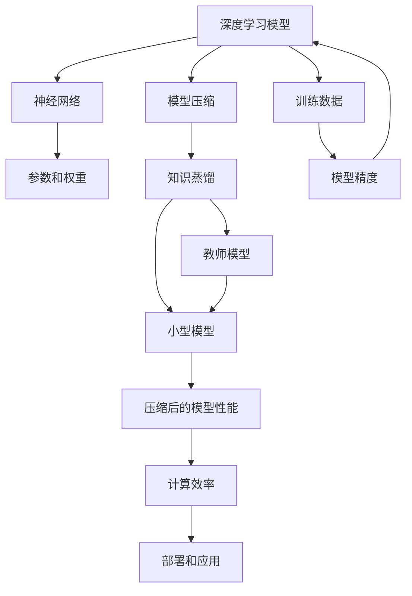

                 

# 知识蒸馏在模型压缩中的应用与优化

> **关键词：** 知识蒸馏、模型压缩、神经网络、深度学习、性能优化

> **摘要：** 本文旨在深入探讨知识蒸馏技术在实际模型压缩中的应用与优化方法。首先，我们将简要介绍知识蒸馏的基本原理及其在模型压缩中的重要性。接着，我们将详细讲解知识蒸馏的核心算法原理，并使用伪代码阐述具体操作步骤。随后，我们将深入剖析数学模型和公式，并举例说明其应用。文章还将包含一个实际项目案例，以展示代码实现和详细解释。最后，我们将探讨知识蒸馏在实际应用场景中的运用，推荐相关工具和资源，并总结未来发展趋势与挑战。

## 1. 背景介绍

### 1.1 目的和范围

本文的主要目的是系统地介绍知识蒸馏技术，并探讨其在神经网络模型压缩中的应用和优化方法。随着深度学习模型的规模不断扩大，模型的训练和部署成本也在不断增加。知识蒸馏技术提供了一种有效的解决方案，通过将大型模型的知识传递给一个较小的模型，从而实现模型的压缩和加速。

本文将涵盖以下内容：

1. 知识蒸馏的基本原理及其在模型压缩中的重要性。
2. 知识蒸馏的核心算法原理和具体操作步骤。
3. 数学模型和公式的详细讲解及应用示例。
4. 实际项目案例中的代码实现和详细解释。
5. 知识蒸馏在实际应用场景中的运用。
6. 工具和资源的推荐。

### 1.2 预期读者

本文适合对深度学习有基本了解的读者，特别是那些对模型压缩和优化感兴趣的技术人员。本文旨在提供对知识蒸馏技术的全面理解，帮助读者在实际项目中有效地应用这一技术。

### 1.3 文档结构概述

本文分为十个部分，具体如下：

1. 引言：介绍本文的目的和结构。
2. 背景介绍：简要介绍知识蒸馏的基本原理及其在模型压缩中的重要性。
3. 核心概念与联系：阐述知识蒸馏的核心概念原理和架构。
4. 核心算法原理 & 具体操作步骤：详细讲解知识蒸馏算法原理和操作步骤。
5. 数学模型和公式 & 详细讲解 & 举例说明：深入剖析知识蒸馏的数学模型和公式。
6. 项目实战：代码实际案例和详细解释说明。
7. 实际应用场景：探讨知识蒸馏在不同领域的应用。
8. 工具和资源推荐：推荐相关学习资源和开发工具。
9. 总结：未来发展趋势与挑战。
10. 附录：常见问题与解答。
11. 扩展阅读 & 参考资料：提供进一步学习的资源。

### 1.4 术语表

#### 1.4.1 核心术语定义

- **知识蒸馏（Knowledge Distillation）**：一种将知识从大型模型传递到小型模型的技术。
- **模型压缩（Model Compression）**：通过减少模型参数和计算量来优化模型的过程。
- **深度学习（Deep Learning）**：一种利用多层神经网络进行特征学习和模式识别的技术。
- **神经网络（Neural Network）**：一种由大量神经元连接组成的计算模型。

#### 1.4.2 相关概念解释

- **模型精度（Model Accuracy）**：模型在预测中正确识别样本的比例。
- **模型大小（Model Size）**：模型的参数数量和计算复杂度。
- **计算效率（Computational Efficiency）**：模型在给定资源下的计算能力。

#### 1.4.3 缩略词列表

- **DL**：深度学习（Deep Learning）
- **NN**：神经网络（Neural Network）
- **KD**：知识蒸馏（Knowledge Distillation）

## 2. 核心概念与联系

在探讨知识蒸馏之前，我们首先需要了解一些核心概念和它们之间的关系。以下是一个使用Mermaid流程图（Mermaid流程节点中不要有括号、逗号等特殊字符）来表示这些概念和联系：



在这个流程图中，我们可以看到：

- **深度学习模型**（A）利用**神经网络**（B）和**参数和权重**（C）进行训练。
- **模型压缩**（D）是通过减少模型大小来实现的，其中**知识蒸馏**（E）是一种关键技术。
- **小型模型**（F）通过知识蒸馏从**教师模型**（I）中学习，从而保持与原始模型相似的**模型精度**（H）。
- **压缩后的模型性能**（J）和**计算效率**（K）是衡量模型压缩成功与否的重要指标。
- **部署和应用**（L）是将压缩后的模型应用于实际问题的最终目的。

### 知识蒸馏的基本原理

知识蒸馏是一种将大型模型的内在知识传递给小型模型的技术。其核心思想是，教师模型（通常是一个更复杂、参数更多的模型）在训练过程中学到了丰富的知识，而学生模型（通常是一个更简单、参数更少的模型）通过模仿教师模型的行为来学习这些知识。

以下是知识蒸馏的基本原理：

1. **教师模型**：这是一个大型、参数丰富的模型，它在原始数据集上进行了充分的训练，学到了丰富的知识。
2. **学生模型**：这是一个小型、参数较少的模型，它的目标是模仿教师模型的行为，从而获得类似的知识。

知识蒸馏的过程可以分为以下几个步骤：

1. **编码**：教师模型对输入数据进行编码，生成一个高维的特征表示。
2. **预测**：教师模型根据编码后的特征进行预测，生成一个输出。
3. **知识传递**：学生模型模仿教师模型的编码和预测过程，同时学习到一个与教师模型相似的输出。
4. **优化**：通过调整学生模型的参数，使其输出与教师模型的输出尽可能接近。

### 知识蒸馏的优势

知识蒸馏技术具有以下几个优势：

1. **高效性**：知识蒸馏通过将大型模型的知识传递给小型模型，可以显著减少模型的大小和计算复杂度。
2. **准确性**：通过模仿教师模型的行为，学生模型可以保持与原始模型相似的精度。
3. **灵活性**：知识蒸馏技术可以应用于各种深度学习模型，包括卷积神经网络（CNN）、循环神经网络（RNN）和生成对抗网络（GAN）。

### 知识蒸馏的挑战

尽管知识蒸馏技术具有很多优势，但它在实际应用中也面临着一些挑战：

1. **教师模型的选择**：选择一个合适的教师模型对知识蒸馏的成功至关重要，但如何选择一个合适的教师模型仍然是一个开放性问题。
2. **学生模型的优化**：学生模型需要通过大量的训练数据来学习教师模型的知识，这可能会增加训练成本。
3. **模型压缩的权衡**：在模型压缩过程中，需要在模型大小和模型精度之间做出权衡。

## 3. 核心算法原理 & 具体操作步骤

知识蒸馏技术的核心在于将大型模型的内在知识传递给小型模型。以下是知识蒸馏算法的具体原理和操作步骤：

### 3.1 教师模型和学生模型的定义

首先，我们需要定义教师模型和学生模型。教师模型是一个大型模型，它经过充分的训练，学到了丰富的知识。学生模型是一个小型模型，它的目标是模仿教师模型的行为。

### 3.2 编码和预测过程

知识蒸馏的过程可以分为编码和预测两个主要步骤。

#### 编码过程：

1. **输入数据**：将输入数据输入到教师模型中。
2. **编码**：教师模型对输入数据进行编码，生成一个高维的特征表示。这个特征表示包含了输入数据的深层特征信息。

#### 预测过程：

1. **特征表示**：将编码后的特征表示输入到学生模型中。
2. **预测**：学生模型根据编码后的特征表示进行预测，生成一个输出。

### 3.3 知识传递过程

知识传递是知识蒸馏的核心步骤。它通过以下方式实现：

1. **输出对比**：教师模型的输出和学生模型的输出进行对比，计算两者之间的差异。
2. **损失函数**：使用损失函数来衡量教师模型输出和学生模型输出之间的差异。常见的损失函数包括均方误差（MSE）和交叉熵（Cross-Entropy）。

### 3.4 优化过程

优化过程的目标是调整学生模型的参数，使其输出与教师模型的输出尽可能接近。以下是具体的优化步骤：

1. **前向传播**：将输入数据输入到学生模型中，进行前向传播，得到输出。
2. **反向传播**：根据教师模型的输出和学生模型的输出之间的差异，计算损失函数。然后，通过反向传播算法，调整学生模型的参数。
3. **迭代优化**：重复前向传播和反向传播过程，直到学生模型的输出与教师模型的输出足够接近。

### 3.5 算法流程

以下是知识蒸馏算法的伪代码：

```python
# 定义教师模型和学生模型
teacher_model = ...
student_model = ...

# 定义损失函数
loss_function = ...

# 定义优化器
optimizer = ...

# 编码和预测过程
for epoch in range(num_epochs):
    for input_data in data_loader:
        # 编码
        teacher_output = teacher_model(input_data)
        
        # 预测
        student_output = student_model(input_data)
        
        # 计算损失
        loss = loss_function(teacher_output, student_output)
        
        # 反向传播
        optimizer.zero_grad()
        loss.backward()
        optimizer.step()

# 评估学生模型的性能
student_performance = student_model.evaluate(test_data)
```

### 3.6 算法优势

知识蒸馏算法具有以下优势：

1. **模型压缩**：通过知识蒸馏，可以显著减少模型的大小和计算复杂度。
2. **提高模型精度**：学生模型通过模仿教师模型的行为，可以保持与原始模型相似的精度。
3. **适用于多种模型**：知识蒸馏技术可以应用于各种深度学习模型，包括卷积神经网络（CNN）、循环神经网络（RNN）和生成对抗网络（GAN）。

### 3.7 算法挑战

尽管知识蒸馏算法具有很多优势，但它在实际应用中也面临着一些挑战：

1. **教师模型的选择**：选择一个合适的教师模型对知识蒸馏的成功至关重要，但如何选择一个合适的教师模型仍然是一个开放性问题。
2. **学生模型的优化**：学生模型需要通过大量的训练数据来学习教师模型的知识，这可能会增加训练成本。
3. **模型压缩的权衡**：在模型压缩过程中，需要在模型大小和模型精度之间做出权衡。

## 4. 数学模型和公式 & 详细讲解 & 举例说明

### 4.1 知识蒸馏的数学模型

知识蒸馏的核心在于通过损失函数来衡量教师模型输出和学生模型输出之间的差异，并使用这些差异来优化学生模型的参数。以下是知识蒸馏的数学模型：

#### 4.1.1 损失函数

知识蒸馏的损失函数通常由两个部分组成：分类损失和多样性损失。

1. **分类损失**（\(L_c\)）：衡量学生模型的输出与教师模型输出之间的分类差异。常见的分类损失函数包括均方误差（MSE）和交叉熵（Cross-Entropy）。

   \[ L_c = -\frac{1}{N} \sum_{i=1}^{N} y_i \cdot \log(\hat{y}_i) \]

   其中，\(y_i\) 是教师模型的输出，\(\hat{y}_i\) 是学生模型的输出，\(N\) 是样本数量。

2. **多样性损失**（\(L_d\)）：鼓励学生模型输出多样化的特征，以避免学生模型仅依赖于教师模型的输出。常见的多样性损失函数包括KL散度（KL Divergence）。

   \[ L_d = \frac{1}{N} \sum_{i=1}^{N} \sum_{j=1}^{K} p_j \cdot \log \left( \frac{p_j}{q_j} \right) \]

   其中，\(p_j\) 是教师模型输出的概率分布，\(q_j\) 是学生模型输出的概率分布，\(K\) 是类别数量。

#### 4.1.2 总损失函数

知识蒸馏的总损失函数是分类损失和多样性损失的加权和：

\[ L = \alpha \cdot L_c + (1 - \alpha) \cdot L_d \]

其中，\(\alpha\) 是权重参数，用于平衡分类损失和多样性损失的重要性。

### 4.2 案例讲解

#### 4.2.1 案例背景

假设我们有一个大型卷积神经网络（CNN）作为教师模型，它被训练用于图像分类任务。我们的目标是使用知识蒸馏技术将这个大型模型的知识传递给一个小型模型，从而实现模型压缩。

#### 4.2.2 实际操作步骤

1. **定义教师模型和学生模型**：

   教师模型：
   \[ \text{Teacher}(x) = f(\theta_1, \theta_2) \]
   
   学生模型：
   \[ \text{Student}(x) = g(\theta_3) \]

   其中，\(x\) 是输入图像，\(f(\theta_1, \theta_2)\) 是教师模型的编码函数，\(\theta_1\) 和 \(\theta_2\) 是教师模型的参数，\(g(\theta_3)\) 是学生模型的编码函数，\(\theta_3\) 是学生模型的参数。

2. **定义分类损失和多样性损失**：

   假设教师模型的输出为 \(y\)，学生模型的输出为 \(\hat{y}\)。分类损失 \(L_c\) 使用交叉熵函数：

   \[ L_c = -\frac{1}{N} \sum_{i=1}^{N} y_i \cdot \log(\hat{y}_i) \]

   假设教师模型的输出概率分布为 \(p_j\)，学生模型的输出概率分布为 \(q_j\)。多样性损失 \(L_d\) 使用KL散度：

   \[ L_d = \frac{1}{N} \sum_{i=1}^{N} \sum_{j=1}^{K} p_j \cdot \log \left( \frac{p_j}{q_j} \right) \]

3. **定义总损失函数**：

   假设权重参数 \(\alpha = 0.5\)，总损失函数 \(L\) 为分类损失和多样性损失的加权和：

   \[ L = 0.5 \cdot L_c + 0.5 \cdot L_d \]

4. **优化学生模型**：

   使用梯度下降法优化学生模型的参数 \(\theta_3\)：

   \[ \theta_3^{new} = \theta_3^{old} - \eta \cdot \nabla_{\theta_3} L \]

   其中，\(\eta\) 是学习率，\(\nabla_{\theta_3} L\) 是总损失函数 \(L\) 对学生模型参数 \(\theta_3\) 的梯度。

### 4.3 代码实现

以下是使用Python实现的简化代码示例：

```python
import torch
import torch.nn as nn
import torch.optim as optim

# 定义教师模型和学生模型
teacher_model = ...
student_model = ...

# 定义损失函数
criterion = nn.CrossEntropyLoss()
diversity_criterion = nn.KLDivLoss()

# 定义优化器
optimizer = optim.Adam(student_model.parameters(), lr=0.001)

# 训练过程
for epoch in range(num_epochs):
    for inputs, targets in data_loader:
        # 编码和预测
        teacher_outputs = teacher_model(inputs)
        student_outputs = student_model(inputs)

        # 计算分类损失和多样性损失
        classification_loss = criterion(student_outputs, targets)
        diversity_loss = diversity_criterion(student_outputs.log_softmax(dim=1), teacher_outputs.softmax(dim=1))

        # 计算总损失
        total_loss = 0.5 * classification_loss + 0.5 * diversity_loss

        # 反向传播
        optimizer.zero_grad()
        total_loss.backward()
        optimizer.step()

# 评估学生模型的性能
student_performance = student_model.evaluate(test_data)
```

通过这个示例，我们可以看到如何使用Python实现知识蒸馏算法的核心步骤，包括定义模型、损失函数和优化器，以及训练过程中的编码和预测、损失计算和优化。

## 5. 项目实战：代码实际案例和详细解释说明

### 5.1 开发环境搭建

在进行知识蒸馏项目的实战之前，我们需要搭建一个合适的环境。以下是搭建环境的步骤：

1. **安装Python**：确保Python环境已经安装。推荐使用Python 3.7或更高版本。
2. **安装深度学习库**：安装TensorFlow或PyTorch等深度学习库。以下是使用PyTorch的安装命令：
   ```bash
   pip install torch torchvision
   ```
3. **安装必要的依赖**：根据项目需求，可能需要安装其他依赖库，如NumPy、Pandas等。

### 5.2 源代码详细实现和代码解读

下面是一个使用PyTorch实现的知识蒸馏代码案例。我们将分步骤进行代码解读。

#### 5.2.1 准备数据

首先，我们需要准备用于训练和评估的数据集。假设我们使用的是CIFAR-10数据集。

```python
import torch
import torchvision
import torchvision.transforms as transforms

# 数据预处理
transform = transforms.Compose(
    [transforms.ToTensor(),
     transforms.Normalize((0.5, 0.5, 0.5), (0.5, 0.5, 0.5))])

# 加载数据集
trainset = torchvision.datasets.CIFAR10(root='./data', train=True,
                                        download=True, transform=transform)
trainloader = torch.utils.data.DataLoader(trainset, batch_size=4,
                                          shuffle=True, num_workers=2)

testset = torchvision.datasets.CIFAR10(root='./data', train=False,
                                       download=True, transform=transform)
testloader = torch.utils.data.DataLoader(testset, batch_size=4,
                                         shuffle=False, num_workers=2)

# 显示样本
classes = ('plane', 'car', 'bird', 'cat', 'deer', 'dog', 'frog', 'horse', 'ship', 'truck')
images, labels = next(iter(trainloader))
import matplotlib.pyplot as plt

def imshow(img):
    img = img / 2 + 0.5     # unnormalize
    npimg = img.numpy()
    plt.imshow(np.transpose(npimg, (1, 2, 0)))
    plt.show()

imshow(torchvision.utils.make_grid(images[:4], padding=2, normalize=True))
plt.xlabel('Labels: %s' % (labels[:4]))
plt.show()
```

#### 5.2.2 定义教师模型和学生模型

接下来，我们定义一个教师模型和一个学生模型。教师模型是一个较大的卷积神经网络，学生模型是一个较小且参数更少的卷积神经网络。

```python
import torch.nn as nn
import torch.nn.functional as F

# 定义教师模型
class TeacherCNN(nn.Module):
    def __init__(self):
        super(TeacherCNN, self).__init__()
        self.conv1 = nn.Conv2d(3, 6, 5)
        self.pool = nn.MaxPool2d(2, 2)
        self.conv2 = nn.Conv2d(6, 16, 5)
        self.fc1 = nn.Linear(16 * 5 * 5, 120)
        self.fc2 = nn.Linear(120, 84)
        self.fc3 = nn.Linear(84, 10)

    def forward(self, x):
        x = self.pool(F.relu(self.conv1(x)))
        x = self.pool(F.relu(self.conv2(x)))
        x = x.view(-1, 16 * 5 * 5)
        x = F.relu(self.fc1(x))
        x = F.relu(self.fc2(x))
        x = self.fc3(x)
        return x

# 定义学生模型
class StudentCNN(nn.Module):
    def __init__(self):
        super(StudentCNN, self).__init__()
        self.conv1 = nn.Conv2d(3, 6, 5)
        self.pool = nn.MaxPool2d(2, 2)
        self.conv2 = nn.Conv2d(6, 16, 5)
        self.fc1 = nn.Linear(16 * 5 * 5, 60)
        self.fc2 = nn.Linear(60, 30)
        self.fc3 = nn.Linear(30, 10)

    def forward(self, x):
        x = self.pool(F.relu(self.conv1(x)))
        x = self.pool(F.relu(self.conv2(x)))
        x = x.view(-1, 16 * 5 * 5)
        x = F.relu(self.fc1(x))
        x = F.relu(self.fc2(x))
        x = self.fc3(x)
        return x

# 实例化模型
teacher_model = TeacherCNN()
student_model = StudentCNN()
```

#### 5.2.3 训练和知识蒸馏

接下来，我们使用教师模型训练学生模型。以下是训练过程的主要步骤：

1. **初始化模型和优化器**。
2. **定义损失函数**。
3. **进行前向传播**。
4. **计算损失**。
5. **进行反向传播和优化**。

```python
import torch.optim as optim

# 初始化模型和优化器
optimizer = optim.Adam(student_model.parameters(), lr=0.001)

# 定义损失函数
criterion = nn.CrossEntropyLoss()

# 训练模型
num_epochs = 10

for epoch in range(num_epochs):
    running_loss = 0.0
    for i, data in enumerate(trainloader, 0):
        inputs, labels = data
        inputs, labels = inputs.to(device), labels.to(device)

        # 前向传播
        teacher_outputs = teacher_model(inputs)
        student_outputs = student_model(inputs)

        # 计算损失
        loss = criterion(student_outputs, labels)

        # 反向传播和优化
        optimizer.zero_grad()
        loss.backward()
        optimizer.step()

        # 打印进度
        running_loss += loss.item()
        if i % 2000 == 1999:
            print(f'[{epoch + 1}, {i + 1:5d}] loss: {running_loss / 2000:.3f}')
            running_loss = 0.0

print('Finished Training')
```

#### 5.2.4 评估模型性能

最后，我们评估训练后学生模型的性能。

```python
# 评估模型性能
correct = 0
total = 0
with torch.no_grad():
    for data in testloader:
        images, labels = data
        images, labels = images.to(device), labels.to(device)
        outputs = student_model(images)
        _, predicted = torch.max(outputs.data, 1)
        total += labels.size(0)
        correct += (predicted == labels).sum().item()

print(f'Accuracy of the network on the 10000 test images: {100 * correct / total}%')
```

### 5.3 代码解读与分析

1. **数据预处理**：我们使用`torchvision`库加载数据集并进行预处理。预处理步骤包括将图像转换为张量，并进行归一化处理。
   
2. **定义模型**：我们定义了一个教师模型和一个学生模型。教师模型是一个较大的卷积神经网络，而学生模型是一个较小的卷积神经网络，具有更少的参数。

3. **初始化模型和优化器**：我们使用`torch.optim.Adam`初始化优化器，并选择交叉熵损失函数。

4. **训练模型**：我们使用了一个简单的循环来迭代训练模型。在每次迭代中，我们进行前向传播，计算损失，然后进行反向传播和优化。

5. **评估模型性能**：最后，我们使用测试集评估了训练后学生模型的性能。

通过这个项目案例，我们可以看到如何使用PyTorch实现知识蒸馏算法，并如何通过代码进行详细的解读和分析。

## 6. 实际应用场景

知识蒸馏技术在实际应用中具有广泛的应用前景，特别是在模型压缩和加速领域。以下是一些具体的实际应用场景：

### 6.1 智能手机应用

随着智能手机性能的提升，对计算效率的要求也越来越高。知识蒸馏技术可以帮助在智能手机上部署高性能的深度学习模型。通过将大型模型的知识传递给小型模型，可以实现更快的推理速度和更低的功耗。

### 6.2 边缘计算

在边缘计算场景中，模型的计算资源和存储资源通常有限。知识蒸馏技术可以帮助在边缘设备上部署高效的深度学习模型，从而提高系统的响应速度和处理能力。

### 6.3 自动驾驶

自动驾驶系统对实时性和计算效率有很高的要求。通过知识蒸馏，可以将大型自动驾驶模型的知识传递给小型模型，从而实现更快的模型推理和更低的功耗，提高自动驾驶系统的性能和可靠性。

### 6.4 医疗图像分析

在医疗图像分析领域，深度学习模型通常需要大量的计算资源和存储资源。知识蒸馏技术可以帮助将大型模型的知识传递给小型模型，从而在有限的资源下实现高效的模型推理，加速疾病诊断和治疗的进程。

### 6.5 自然语言处理

自然语言处理（NLP）领域中的深度学习模型通常也非常复杂，计算资源消耗大。知识蒸馏技术可以帮助将大型NLP模型的知识传递给小型模型，从而在移动设备和服务器端实现高效的文本处理和推理。

### 6.6 云计算和数据中心

在云计算和数据中心场景中，知识蒸馏技术可以帮助提高模型的计算效率，减少模型部署和训练的成本。通过将大型模型的知识传递给小型模型，可以更有效地利用计算资源，提高数据中心的处理能力。

## 7. 工具和资源推荐

### 7.1 学习资源推荐

#### 7.1.1 书籍推荐

- **《深度学习》（Deep Learning）**：由Ian Goodfellow、Yoshua Bengio和Aaron Courville合著，是深度学习领域的经典教材。
- **《神经网络与深度学习》（Neural Networks and Deep Learning）**：由Hugo Larochelle、Dimitri Erhan和François Massiau合著，涵盖了神经网络和深度学习的理论基础。

#### 7.1.2 在线课程

- **Coursera**：提供由世界顶尖大学和公司提供的深度学习和神经网络在线课程。
- **edX**：提供由哈佛大学、麻省理工学院等顶尖大学提供的免费深度学习课程。
- **Udacity**：提供针对实际应用的深度学习纳米学位课程。

#### 7.1.3 技术博客和网站

- **Medium**：有许多关于深度学习和知识蒸馏技术的优秀博客文章。
- **ArXiv**：发布最新的深度学习和知识蒸馏研究论文。
- **TensorFlow GitHub**：提供TensorFlow和知识蒸馏相关的代码示例和教程。

### 7.2 开发工具框架推荐

#### 7.2.1 IDE和编辑器

- **PyCharm**：一款强大的Python IDE，支持深度学习和知识蒸馏项目的开发。
- **Visual Studio Code**：轻量级但功能丰富的编辑器，适用于Python和深度学习开发。

#### 7.2.2 调试和性能分析工具

- **PyTorch Profiler**：用于分析PyTorch模型的性能和调试。
- **TensorBoard**：用于可视化TensorFlow和PyTorch模型的训练过程。

#### 7.2.3 相关框架和库

- **TensorFlow**：Google开发的深度学习框架，支持知识蒸馏和模型压缩。
- **PyTorch**：Facebook开发的开源深度学习库，支持灵活的动态图模型和知识蒸馏。
- **MXNet**：Apache基金会开发的开源深度学习框架，支持多种编程语言和平台。

### 7.3 相关论文著作推荐

#### 7.3.1 经典论文

- **“Distilling a Neural Network into a Small Dynamical System”**：提出了知识蒸馏的基本思想。
- **“A Theoretically Grounded Application of Dropout in Neural Networks”**：讨论了Dropout在知识蒸馏中的应用。

#### 7.3.2 最新研究成果

- **“知识蒸馏：从大型模型向小型模型的知识转移”**：综述了最新的知识蒸馏技术和应用。
- **“EfficientDet：高效的边缘深度学习模型”**：提出了基于知识蒸馏的边缘检测模型。

#### 7.3.3 应用案例分析

- **“深度学习在医疗图像分析中的应用”**：探讨了知识蒸馏在医疗图像分析中的实际应用案例。
- **“自动驾驶中的知识蒸馏技术”**：分析了知识蒸馏在自动驾驶模型压缩和加速中的应用。

## 8. 总结：未来发展趋势与挑战

知识蒸馏技术在模型压缩和优化领域展现出巨大的潜力，但同时也面临着一些挑战。以下是未来发展趋势与挑战的展望：

### 8.1 发展趋势

1. **模型压缩和加速**：随着人工智能应用的普及，对模型压缩和加速的需求日益增加。知识蒸馏技术将成为实现这一目标的关键手段。
2. **多模态学习**：未来的深度学习应用将涉及多种数据类型，如图像、音频和文本。知识蒸馏技术可以跨模态地传递知识，促进多模态学习的发展。
3. **边缘计算**：知识蒸馏技术可以帮助在边缘设备上部署高效的深度学习模型，满足实时性和计算效率的要求。
4. **持续学习和适应**：知识蒸馏技术可以与持续学习相结合，实现模型在动态环境中的自适应和进化。

### 8.2 挑战

1. **教师模型选择**：选择一个合适的教师模型对知识蒸馏的成功至关重要，但如何选择一个合适的教师模型仍然是一个开放性问题。
2. **学生模型优化**：学生模型需要通过大量的训练数据来学习教师模型的知识，这可能会增加训练成本。
3. **模型压缩与精度权衡**：在模型压缩过程中，需要在模型大小和模型精度之间做出权衡，如何平衡这一关系仍然是一个挑战。
4. **计算资源限制**：在边缘设备和资源受限的环境中，如何高效地应用知识蒸馏技术仍需要进一步研究。

## 9. 附录：常见问题与解答

### 9.1 什么是知识蒸馏？

知识蒸馏（Knowledge Distillation）是一种将大型模型的内在知识传递给小型模型的技术。其核心思想是通过训练一个小型模型，使其输出与大型模型的输出尽可能接近，从而实现模型压缩和优化。

### 9.2 知识蒸馏的主要优势是什么？

知识蒸馏的主要优势包括：

- **高效性**：通过知识蒸馏，可以显著减少模型的大小和计算复杂度。
- **准确性**：学生模型通过模仿教师模型的行为，可以保持与原始模型相似的精度。
- **灵活性**：知识蒸馏技术可以应用于各种深度学习模型，包括卷积神经网络（CNN）、循环神经网络（RNN）和生成对抗网络（GAN）。

### 9.3 知识蒸馏的挑战有哪些？

知识蒸馏的挑战包括：

- **教师模型的选择**：选择一个合适的教师模型对知识蒸馏的成功至关重要。
- **学生模型优化**：学生模型需要通过大量的训练数据来学习教师模型的知识，这可能会增加训练成本。
- **模型压缩与精度权衡**：在模型压缩过程中，需要在模型大小和模型精度之间做出权衡。
- **计算资源限制**：在边缘设备和资源受限的环境中，如何高效地应用知识蒸馏技术仍需要进一步研究。

### 9.4 知识蒸馏与模型剪枝（Pruning）有什么区别？

知识蒸馏和模型剪枝都是模型压缩的技术，但它们的方法和目标有所不同。

- **知识蒸馏**：通过训练一个小型模型，使其输出与大型模型的输出尽可能接近，从而实现模型压缩。
- **模型剪枝**：通过删除模型中的某些参数或神经元来减少模型的大小，同时尽可能保留原始模型的性能。

## 10. 扩展阅读 & 参考资料

本文介绍了知识蒸馏在模型压缩中的应用与优化。以下是扩展阅读和参考资料，供读者进一步学习：

1. **《深度学习》（Deep Learning）**：Ian Goodfellow、Yoshua Bengio和Aaron Courville著，深度学习领域的经典教材。
2. **《神经网络与深度学习》（Neural Networks and Deep Learning）**：Hugo Larochelle、Dimitri Erhan和François Massiau著，涵盖了神经网络和深度学习的理论基础。
3. **“Distilling a Neural Network into a Small Dynamical System”**：提出了知识蒸馏的基本思想。
4. **“知识蒸馏：从大型模型向小型模型的知识转移”**：综述了最新的知识蒸馏技术和应用。
5. **TensorFlow GitHub**：提供TensorFlow和知识蒸馏相关的代码示例和教程。
6. **PyTorch GitHub**：提供PyTorch和知识蒸馏相关的代码示例和教程。

通过阅读这些资料，读者可以更深入地了解知识蒸馏技术及其在实际应用中的运用。

