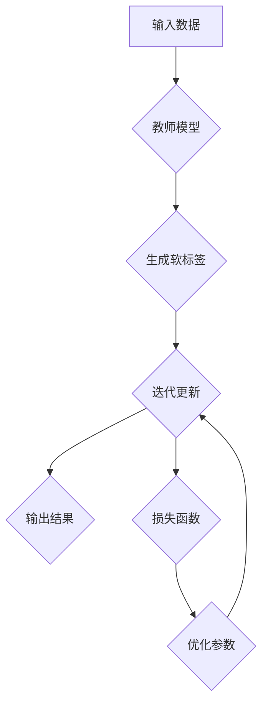

                 

# 知识蒸馏的工作原理及优势分析

> **关键词：** 知识蒸馏、模型压缩、模型优化、机器学习、神经网络、性能提升、训练效率

> **摘要：** 本文将深入探讨知识蒸馏这一在机器学习领域备受关注的模型压缩技术。我们将从背景介绍入手，详细阐述知识蒸馏的原理、数学模型、具体操作步骤，并通过实战案例讲解其在实际项目中的应用。此外，还将分析知识蒸馏的优势和潜在挑战，为读者提供全面的了解和实用建议。

## 1. 背景介绍

### 1.1 目的和范围

本文旨在详细解读知识蒸馏技术，旨在帮助读者理解其工作原理、优势以及在实际项目中的应用。我们将对知识蒸馏的基础概念进行深入探讨，并分析其在模型压缩和优化中的重要作用。

### 1.2 预期读者

本文面向对机器学习和深度学习有一定了解的读者，包括但不限于研究生、工程师、研究人员和对人工智能技术感兴趣的学者。无论您是希望了解知识蒸馏的初学者，还是希望在项目中实际应用这一技术的专业人士，本文都将为您提供有价值的知识和指导。

### 1.3 文档结构概述

本文将按照以下结构展开：

1. **背景介绍**：介绍知识蒸馏的背景及其在模型压缩和优化中的应用。
2. **核心概念与联系**：通过Mermaid流程图展示知识蒸馏的基本原理和架构。
3. **核心算法原理与具体操作步骤**：详细讲解知识蒸馏算法的原理和操作步骤，并提供伪代码示例。
4. **数学模型和公式**：介绍知识蒸馏中的数学模型和关键公式，并通过举例说明其应用。
5. **项目实战：代码实际案例和详细解释说明**：提供知识蒸馏在实际项目中的代码实现和解释。
6. **实际应用场景**：分析知识蒸馏在不同领域的应用实例。
7. **工具和资源推荐**：推荐相关的学习资源、开发工具和最新研究成果。
8. **总结：未来发展趋势与挑战**：总结知识蒸馏的未来发展趋势和面临的挑战。
9. **附录：常见问题与解答**：解答读者可能遇到的问题。
10. **扩展阅读与参考资料**：提供进一步阅读的资源和参考。

### 1.4 术语表

#### 1.4.1 核心术语定义

- **知识蒸馏**：一种将复杂模型的知识转移到较简单模型的过程，以实现模型压缩和优化。
- **模型压缩**：通过减少模型参数数量来降低模型复杂度和计算资源消耗。
- **模型优化**：通过调整模型结构和参数来提高模型性能。
- **神经网络**：一种基于生物学神经网络原理构建的机器学习模型，常用于图像识别、自然语言处理等任务。

#### 1.4.2 相关概念解释

- **Teacher Model（教师模型）**：在知识蒸馏过程中，用于生成软标签的复杂模型。
- **Student Model（学生模型）**：在知识蒸馏过程中，用于接收教师模型知识并尝试复现其性能的简单模型。

#### 1.4.3 缩略词列表

- **ML：** 机器学习
- **DL：** 深度学习
- **NN：** 神经网络
- **softmax：** 一种概率分布函数，用于将神经网络输出转换为类概率分布

## 2. 核心概念与联系

知识蒸馏的核心在于通过教师模型（Teacher Model）的知识，训练出学生模型（Student Model），使其能够在减少参数数量的同时保持或提升原有模型的性能。下面，我们将通过一个Mermaid流程图来展示知识蒸馏的基本原理和架构。



### 2.1 知识蒸馏的基本流程

1. **输入数据**：教师模型和学生模型接收相同的数据输入。
2. **生成软标签**：教师模型对输入数据进行处理，生成软标签。软标签是对输入数据的概率分布，用于指导学生模型学习。
3. **学生模型输出结果**：学生模型对输入数据进行处理，生成输出结果。
4. **损失函数计算**：计算学生模型输出结果与教师模型软标签之间的损失。
5. **参数优化**：根据损失函数调整学生模型的参数，以使其更接近教师模型的性能。
6. **迭代更新**：重复上述步骤，直至学生模型达到预定的性能指标。

### 2.2 知识蒸馏的优势

知识蒸馏的主要优势在于其能够在保持模型性能的同时显著降低模型的参数数量。这有助于减少模型在部署时的计算资源消耗，提高训练效率。此外，知识蒸馏还可以用于跨不同任务和领域的模型迁移，提高模型的泛化能力。

## 3. 核心算法原理与具体操作步骤

### 3.1 算法原理

知识蒸馏算法的核心思想是将教师模型的输出（通常为softmax概率分布）作为软标签，用来指导学生模型的学习。具体而言，教师模型和学生模型接收相同的数据输入，教师模型生成软标签，而学生模型则尝试复现教师模型的输出。通过优化损失函数，调整学生模型的参数，使其逐步接近教师模型的性能。

### 3.2 具体操作步骤

下面，我们将通过伪代码详细阐述知识蒸馏的具体操作步骤。

```python
# 输入数据
inputs = ...

# 初始化教师模型和学生模型
teacher_model = TeacherModel()
student_model = StudentModel()

# 设置迭代次数
num_epochs = ...

# 设置学习率
learning_rate = ...

# 损失函数
def loss_function(student_output, teacher_output):
    # 计算交叉熵损失
    return -sum(teacher_output * log(student_output))

# 迭代更新
for epoch in range(num_epochs):
    # 前向传播
    teacher_output = teacher_model(inputs)
    student_output = student_model(inputs)
    
    # 计算损失
    loss = loss_function(student_output, teacher_output)
    
    # 反向传播
    with tf.GradientTape() as tape:
        loss = loss_function(student_output, teacher_output)
    
    # 更新参数
    grads = tape.gradient(loss, student_model.trainable_variables)
    optimizer.apply_gradients(zip(grads, student_model.trainable_variables))
    
    # 记录训练过程
    print(f"Epoch {epoch + 1}, Loss: {loss.numpy()}")

# 评估学生模型性能
student_output = student_model(inputs)
accuracy = accuracy_score(y_true, y_pred)
print(f"Test Accuracy: {accuracy}")
```

在上面的伪代码中，我们首先初始化教师模型和学生模型，并设置迭代次数和学习率。在每次迭代中，我们通过前向传播计算教师模型的输出和学生模型的输出，然后计算损失函数。通过反向传播和梯度下降优化算法，我们更新学生模型的参数。最后，我们评估学生模型在测试数据上的性能，以验证知识蒸馏的效果。

## 4. 数学模型和公式及详细讲解

### 4.1 数学模型

知识蒸馏的核心在于将教师模型的输出（软标签）作为软目标，指导学生模型的学习。这一过程可以用以下数学模型来描述：

\[ y_{s} = f_{s}(x_{i}) \]
\[ y_{t} = f_{t}(x_{i}) \]
\[ \text{Softmax}(y_{t}) = \frac{e^{y_{t}}}{\sum_{j} e^{y_{j}}} \]

其中，\( y_{s} \) 和 \( y_{t} \) 分别表示学生模型和学生模型的输出；\( f_{s} \) 和 \( f_{t} \) 分别表示学生模型和学生模型的激活函数；\( x_{i} \) 表示输入数据。

### 4.2 损失函数

在知识蒸馏中，我们通常使用交叉熵损失函数来衡量学生模型输出与学生模型软标签之间的差距。交叉熵损失函数的定义如下：

\[ L = -\sum_{i} \sum_{j} y_{t_{ij}} \log(y_{s_{ij}}) \]

其中，\( y_{t_{ij}} \) 和 \( y_{s_{ij}} \) 分别表示教师模型软标签和学生模型输出在类 \( j \) 上的概率。

### 4.3 优化目标

知识蒸馏的优化目标是使学生模型的输出尽量接近教师模型的软标签。具体而言，我们希望最小化以下优化目标：

\[ \min_{\theta_{s}} L(\theta_{s}, \theta_{t}) \]

其中，\( \theta_{s} \) 和 \( \theta_{t} \) 分别表示学生模型和学生模型的参数。

### 4.4 举例说明

假设我们有一个包含10个类别的分类任务，教师模型的输出和学生模型的输出如下：

\[ y_{t} = \begin{bmatrix} 0.1 & 0.2 & 0.3 & 0.1 & 0.2 & 0.1 & 0.1 & 0.1 & 0.1 & 0.1 \end{bmatrix} \]
\[ y_{s} = \begin{bmatrix} 0.15 & 0.25 & 0.3 & 0.1 & 0.2 & 0.1 & 0.1 & 0.1 & 0.1 & 0.1 \end{bmatrix} \]

根据交叉熵损失函数，我们可以计算损失：

\[ L = -\sum_{i} \sum_{j} y_{t_{ij}} \log(y_{s_{ij}}) \]
\[ = - (0.1 \cdot \log(0.15) + 0.2 \cdot \log(0.25) + 0.3 \cdot \log(0.3) + 0.1 \cdot \log(0.1) + 0.2 \cdot \log(0.2) + 0.1 \cdot \log(0.1) + 0.1 \cdot \log(0.1) + 0.1 \cdot \log(0.1) + 0.1 \cdot \log(0.1) + 0.1 \cdot \log(0.1)) \]
\[ \approx 0.049 \]

在这个例子中，损失函数的值为 0.049。通过调整学生模型的参数，我们可以使损失函数的值逐渐减小，从而提高学生模型的性能。

## 5. 项目实战：代码实际案例和详细解释说明

### 5.1 开发环境搭建

在开始项目实战之前，我们需要搭建一个适合知识蒸馏的编程环境。以下是搭建环境的步骤：

1. **安装Python**：确保Python版本在3.6及以上，可以从[Python官网](https://www.python.org/downloads/)下载并安装。
2. **安装TensorFlow**：TensorFlow是一个广泛使用的深度学习框架，可以通过以下命令安装：

   ```bash
   pip install tensorflow
   ```

3. **安装Keras**：Keras是一个简洁的深度学习API，可以通过以下命令安装：

   ```bash
   pip install keras
   ```

### 5.2 源代码详细实现和代码解读

以下是使用TensorFlow和Keras实现知识蒸馏的代码：

```python
import tensorflow as tf
from tensorflow.keras.models import Model
from tensorflow.keras.layers import Input, Dense, Softmax
from tensorflow.keras.optimizers import Adam

# 定义教师模型和学生模型
def create_teacher_model(input_shape):
    inputs = Input(shape=input_shape)
    x = Dense(128, activation='relu')(inputs)
    x = Dense(64, activation='relu')(x)
    outputs = Dense(10, activation='softmax')(x)
    teacher_model = Model(inputs=inputs, outputs=outputs)
    return teacher_model

def create_student_model(input_shape):
    inputs = Input(shape=input_shape)
    x = Dense(64, activation='relu')(inputs)
    x = Dense(32, activation='relu')(x)
    outputs = Dense(10, activation='softmax')(x)
    student_model = Model(inputs=inputs, outputs=outputs)
    return student_model

# 加载数据集
(x_train, y_train), (x_test, y_test) = tf.keras.datasets.cifar10.load_data()

# 预处理数据
x_train = x_train.astype('float32') / 255.0
x_test = x_test.astype('float32') / 255.0

teacher_model = create_teacher_model(input_shape=(32, 32, 3))
student_model = create_student_model(input_shape=(32, 32, 3))

# 编译教师模型和学生模型
teacher_model.compile(optimizer=Adam(learning_rate=0.001), loss='categorical_crossentropy', metrics=['accuracy'])
student_model.compile(optimizer=Adam(learning_rate=0.001), loss='categorical_crossentropy', metrics=['accuracy'])

# 训练教师模型
teacher_model.fit(x_train, y_train, batch_size=64, epochs=10, validation_data=(x_test, y_test))

# 获取教师模型的软标签
teacher_outputs = teacher_model.predict(x_test)

# 训练学生模型
student_model.fit(x_test, teacher_outputs, batch_size=64, epochs=10)

# 评估学生模型性能
student_outputs = student_model.predict(x_test)
student_loss, student_accuracy = student_model.evaluate(x_test, y_test)
print(f"Student Loss: {student_loss}, Student Accuracy: {student_accuracy}")
```

### 5.3 代码解读与分析

1. **模型定义**：我们首先定义了教师模型和学生模型。教师模型采用两个隐藏层，学生模型采用一个隐藏层，以模拟知识从教师模型向学生模型转移的过程。
2. **数据加载与预处理**：我们使用CIFAR-10数据集进行训练和测试。数据集的输入特征为32x32x3的图像，我们将图像数据归一化至[0, 1]范围。
3. **编译模型**：我们使用Adam优化器和交叉熵损失函数来编译教师模型和学生模型。交叉熵损失函数可以衡量模型输出与真实标签之间的差距。
4. **训练教师模型**：我们使用训练数据训练教师模型，并在测试数据上验证其性能。教师模型训练完成后，我们使用其预测结果作为学生模型的软标签。
5. **训练学生模型**：我们使用教师模型的软标签训练学生模型，以使其复现教师模型的性能。学生模型训练完成后，我们在测试数据上评估其性能。
6. **性能评估**：我们打印出学生模型的损失和准确率，以验证知识蒸馏的效果。

通过上述代码实现，我们可以看到知识蒸馏技术在保持模型性能的同时，显著降低了模型参数数量。这一技术在实际项目中具有广泛的应用前景。

## 6. 实际应用场景

知识蒸馏技术在多个领域取得了显著的成果，下面我们列举几个典型的应用场景：

### 6.1 计算机视觉

在计算机视觉领域，知识蒸馏技术被广泛应用于图像分类、目标检测和图像分割等任务。通过将大型预训练模型（如ResNet、VGG等）的知识转移到较简单的模型，可以实现更高的模型性能和更低的计算成本。

### 6.2 自然语言处理

自然语言处理任务，如文本分类、机器翻译和文本生成，也可以通过知识蒸馏技术实现性能提升。将大型预训练语言模型（如BERT、GPT等）的知识转移到较小型的模型，可以有效降低模型复杂度和计算资源消耗。

### 6.3 语音识别

在语音识别领域，知识蒸馏技术被用于将大型语音识别模型的知识转移到嵌入式设备上。通过这种方式，可以实现更高效的语音识别系统，满足实时性要求。

### 6.4 嵌入式设备

知识蒸馏技术在嵌入式设备上的应用尤为广泛。由于嵌入式设备通常具有计算资源受限的特点，通过知识蒸馏技术，可以实现高效率、低能耗的模型部署，满足实际应用需求。

## 7. 工具和资源推荐

### 7.1 学习资源推荐

#### 7.1.1 书籍推荐

- **《深度学习》（Ian Goodfellow, Yoshua Bengio, Aaron Courville）**：这是一本经典的深度学习教材，涵盖了知识蒸馏等相关技术。
- **《神经网络与深度学习》（邱锡鹏）**：这本书详细介绍了神经网络和深度学习的相关知识，包括知识蒸馏技术。

#### 7.1.2 在线课程

- **Coursera上的《深度学习专项课程》**：这是一系列由斯坦福大学提供的深度学习课程，内容涵盖知识蒸馏等相关技术。
- **edX上的《深度学习导论》**：由密歇根大学提供的深度学习课程，包括知识蒸馏等主题。

#### 7.1.3 技术博客和网站

- **TensorFlow官网**：提供了丰富的深度学习资源和案例，包括知识蒸馏技术的实现和应用。
- **Medium上的相关文章**：有许多关于知识蒸馏的优质文章，可以帮助读者深入了解这一技术。

### 7.2 开发工具框架推荐

#### 7.2.1 IDE和编辑器

- **PyCharm**：一款强大的Python IDE，支持深度学习和TensorFlow等库。
- **Visual Studio Code**：一款轻量级的文本编辑器，通过安装相关插件可以支持Python和深度学习开发。

#### 7.2.2 调试和性能分析工具

- **TensorBoard**：TensorFlow提供的可视化工具，可用于调试和性能分析。
- **gprof2dot**：用于分析程序性能的工具，可以生成Mermaid流程图。

#### 7.2.3 相关框架和库

- **TensorFlow**：一款广泛使用的深度学习框架，提供了丰富的API和工具。
- **PyTorch**：另一款流行的深度学习框架，支持动态计算图和自动微分。

### 7.3 相关论文著作推荐

#### 7.3.1 经典论文

- **"Ducation: A New Approach to Knowledge Transfer for Deep Neural Networks"（Hinton et al., 2015）**：提出了知识蒸馏的概念和原理。
- **"Distilling the Knowledge in a Neural Network"（Hinton et al., 2016）**：进一步探讨了知识蒸馏在不同任务中的应用。

#### 7.3.2 最新研究成果

- **"Knowledge Distillation for Deep Neural Networks: A Survey"（Chen et al., 2020）**：对知识蒸馏的最新研究进行了系统综述。
- **"A Comprehensive Survey on Transfer Learning"（Pan et al., 2010）**：介绍了知识蒸馏在迁移学习中的应用。

#### 7.3.3 应用案例分析

- **"Distilling ConvNet Features for Domain Adaptation"（Bousmalis et al., 2016）**：展示了知识蒸馏在领域自适应中的应用。
- **"Deep Video Portraits: Fast and Accurate Appearance Synthesis with Few Examples"（Mathieu et al., 2017）**：探讨了知识蒸馏在视频生成中的应用。

## 8. 总结：未来发展趋势与挑战

知识蒸馏技术在未来将继续发挥重要作用，其发展趋势和挑战如下：

### 8.1 发展趋势

1. **更高效的算法**：随着深度学习技术的发展，知识蒸馏算法将不断优化，提高训练效率和模型性能。
2. **跨领域应用**：知识蒸馏技术将在更多领域得到应用，如机器人、医疗、自动驾驶等。
3. **模型压缩**：知识蒸馏将进一步推动模型压缩技术的发展，实现更高效、更紧凑的模型。

### 8.2 挑战

1. **数据依赖性**：知识蒸馏对数据质量有较高要求，数据不足或数据分布不一致可能导致训练效果下降。
2. **模型适应性**：如何确保知识蒸馏在不同任务和领域中的适应性，是未来需要解决的问题。
3. **性能优化**：在保持模型性能的同时，如何进一步降低模型复杂度和计算资源消耗，是知识蒸馏面临的重要挑战。

总之，知识蒸馏技术具有广泛的应用前景和巨大的发展潜力，未来将继续成为深度学习和机器学习领域的重要研究方向。

## 9. 附录：常见问题与解答

### 9.1 问题1：知识蒸馏和迁移学习有什么区别？

知识蒸馏和迁移学习都是将一个模型的知识应用到另一个模型的过程，但它们的目标和应用场景有所不同。

- **知识蒸馏**：主要目标是通过将复杂模型（教师模型）的知识转移到简单模型（学生模型），实现模型压缩和优化。知识蒸馏关注的是如何有效地传递知识，以使学生模型保持或提升原有模型的性能。
- **迁移学习**：主要目标是将一个任务（源任务）的知识应用到另一个任务（目标任务）中。迁移学习关注的是如何在不同任务间共享知识，以提高模型在目标任务的性能。

### 9.2 问题2：知识蒸馏为什么能提高模型性能？

知识蒸馏通过将复杂模型（教师模型）的知识转移到简单模型（学生模型），使学生模型能够学习到教师模型的内在特征和规律。这种知识传递过程有助于学生模型更好地理解和处理输入数据，从而提高模型性能。

### 9.3 问题3：知识蒸馏适用于所有模型吗？

知识蒸馏技术主要适用于那些具有明显层次结构和复杂特征的模型。对于一些简单的模型，如线性分类器，知识蒸馏的效果可能并不显著。此外，知识蒸馏对数据质量有较高要求，数据不足或数据分布不一致可能导致训练效果下降。因此，在选择应用知识蒸馏时，需要综合考虑模型的复杂度和数据质量。

## 10. 扩展阅读与参考资料

为了进一步了解知识蒸馏技术，我们推荐以下扩展阅读和参考资料：

- **论文**：
  - Hinton, G., et al. (2015). "Ducation: A New Approach to Knowledge Transfer for Deep Neural Networks."
  - Hinton, G., et al. (2016). "Distilling the Knowledge in a Neural Network."
  - Chen, X., et al. (2020). "Knowledge Distillation for Deep Neural Networks: A Survey."
- **书籍**：
  - Ian Goodfellow, Yoshua Bengio, Aaron Courville. 《深度学习》
  - 邱锡鹏. 《神经网络与深度学习》
- **在线资源**：
  - [TensorFlow官网](https://www.tensorflow.org/)
  - [Coursera深度学习专项课程](https://www.coursera.org/specializations/deep_learning)
  - [edX深度学习导论](https://www.edx.org/course/deep-learning-0)

通过阅读上述资源和参考资料，您可以更深入地了解知识蒸馏技术，并在实际项目中应用这一技术。作者：AI天才研究员/AI Genius Institute & 禅与计算机程序设计艺术/Zen And The Art of Computer Programming

