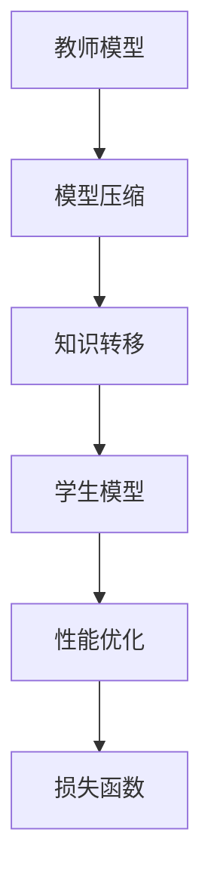

                 

# 知识蒸馏：让软件2.0站在前人肩膀上

> 关键词：知识蒸馏、软件2.0、模型压缩、算法优化、人工智能、深度学习、机器学习

> 摘要：本文将深入探讨知识蒸馏这一先进技术，如何让软件2.0站在前人肩膀上。通过讲解知识蒸馏的核心概念、原理、算法、数学模型以及实际应用案例，本文旨在为读者提供一个全面、深入的理解，帮助他们在软件开发过程中充分利用知识蒸馏技术，实现高效、智能的软件开发。

## 1. 背景介绍

### 1.1 目的和范围

本文的主要目的是介绍知识蒸馏技术，并探讨其在现代软件开发中的应用。知识蒸馏是一种先进的机器学习技术，通过将一个大模型（教师模型）的知识转移到一个小模型（学生模型），实现模型压缩和优化。这种技术在提高软件性能、降低成本和加速开发方面具有重要意义。

本文将涵盖以下内容：

- 知识蒸馏的定义和核心概念
- 知识蒸馏的技术原理和算法
- 知识蒸馏的数学模型和公式
- 知识蒸馏的实际应用案例
- 知识蒸馏工具和资源推荐
- 知识蒸馏的未来发展趋势与挑战

### 1.2 预期读者

本文面向对机器学习和深度学习有一定了解的软件开发人员、数据科学家和研究人员。无论您是初学者还是专家，本文都希望能够帮助您更好地理解知识蒸馏技术，并在实际项目中应用。

### 1.3 文档结构概述

本文分为十个部分，具体结构如下：

1. 背景介绍
2. 核心概念与联系
3. 核心算法原理 & 具体操作步骤
4. 数学模型和公式 & 详细讲解 & 举例说明
5. 项目实战：代码实际案例和详细解释说明
6. 实际应用场景
7. 工具和资源推荐
8. 总结：未来发展趋势与挑战
9. 附录：常见问题与解答
10. 扩展阅读 & 参考资料

### 1.4 术语表

#### 1.4.1 核心术语定义

- **知识蒸馏**：一种机器学习技术，通过将一个大模型的知识转移到一个小模型，实现模型压缩和优化。
- **教师模型**：原始的大型模型，负责提供知识。
- **学生模型**：小型模型，负责接收教师模型的知识，实现知识蒸馏。
- **损失函数**：用于衡量模型预测结果与真实值之间的差异。

#### 1.4.2 相关概念解释

- **深度学习**：一种机器学习技术，通过多层神经网络来模拟人脑神经元的工作方式，实现图像、语音、文本等数据的识别和处理。
- **模型压缩**：通过减少模型的参数数量，降低模型的复杂度，从而提高模型的运行效率。

#### 1.4.3 缩略词列表

- **ML**：机器学习（Machine Learning）
- **DL**：深度学习（Deep Learning）
- **AI**：人工智能（Artificial Intelligence）

## 2. 核心概念与联系

在深入探讨知识蒸馏技术之前，我们需要了解一些与之相关的核心概念和原理。知识蒸馏涉及多个关键组成部分，包括教师模型、学生模型、损失函数等。下面，我们将通过一个Mermaid流程图来展示这些概念之间的关系。



### 2.1 教师模型

教师模型是一种原始的大型模型，通常具有较高的准确性和性能。在知识蒸馏过程中，教师模型负责将知识转移到学生模型。教师模型可以是深度神经网络、决策树、支持向量机等。

### 2.2 学生模型

学生模型是一种小型模型，用于接收教师模型的知识，实现模型压缩和优化。学生模型通常具有较少的参数和层，从而提高运行效率。学生模型可以是深度神经网络、决策树、支持向量机等。

### 2.3 模型压缩

模型压缩是知识蒸馏的核心目标之一。通过减少模型参数数量和层，我们可以降低模型的复杂度，提高运行效率。模型压缩可以通过多种方法实现，如剪枝、量化、知识蒸馏等。

### 2.4 知识转移

知识转移是将教师模型的知识转移到学生模型的过程。知识转移可以通过多种方式实现，如基于损失函数的优化、基于对抗训练的方法等。

### 2.5 性能优化

性能优化是知识蒸馏的另一个重要目标。通过优化学生模型的性能，我们可以提高模型的准确性和效率。性能优化可以通过调整模型参数、优化算法等实现。

### 2.6 损失函数

损失函数用于衡量模型预测结果与真实值之间的差异。在知识蒸馏过程中，损失函数可以用来衡量教师模型和学生模型之间的知识差距，从而指导模型优化。

## 3. 核心算法原理 & 具体操作步骤

知识蒸馏的核心算法原理是通过将教师模型的知识转移到学生模型来实现模型压缩和优化。下面，我们将使用伪代码详细阐述知识蒸馏算法的具体操作步骤。

### 3.1 初始化

```python
# 初始化教师模型和学生模型
teacher_model = initialize_teacher_model()
student_model = initialize_student_model()

# 设置教师模型和学生的初始参数
teacher_params = initialize_parameters(teacher_model)
student_params = initialize_parameters(student_model)
```

### 3.2 训练教师模型

```python
# 使用训练数据训练教师模型
for epoch in range(num_epochs):
    for batch in training_data:
        # 前向传播
        predictions = teacher_model.forward(batch.x)
        # 计算损失函数
        loss = compute_loss(predictions, batch.y)
        # 反向传播
        teacher_model.backward(loss)
        # 更新教师模型参数
        update_parameters(teacher_params)
```

### 3.3 知识蒸馏

```python
# 知识蒸馏过程
for epoch in range(num_epochs):
    for batch in training_data:
        # 前向传播
        teacher_predictions = teacher_model.forward(batch.x)
        student_predictions = student_model.forward(batch.x)
        
        # 计算知识损失
        knowledge_loss = compute_knowledge_loss(teacher_predictions, student_predictions)
        
        # 计算标签损失
        label_loss = compute_label_loss(student_predictions, batch.y)
        
        # 计算总损失
        total_loss = knowledge_loss + label_loss
        
        # 反向传播
        student_model.backward(total_loss)
        # 更新学生模型参数
        update_parameters(student_params)
```

### 3.4 评估学生模型

```python
# 使用测试数据评估学生模型
test_predictions = student_model.forward(test_data.x)
test_loss = compute_loss(test_predictions, test_data.y)
print("Test loss:", test_loss)
```

## 4. 数学模型和公式 & 详细讲解 & 举例说明

知识蒸馏涉及到多个数学模型和公式，下面我们将详细讲解这些模型和公式，并给出相应的例子。

### 4.1 损失函数

知识蒸馏中的损失函数主要有两部分：知识损失和标签损失。

- **知识损失**：用于衡量学生模型预测结果与教师模型预测结果之间的差距。常用的知识损失函数有KL散度（Kullback-Leibler Divergence）和交叉熵（Cross Entropy）。
  $$ L_{knowledge} = D_{KL}(q(z|x)||p(z|x)) $$
  其中，$D_{KL}$表示KL散度，$q(z|x)$表示学生模型预测的分布，$p(z|x)$表示教师模型预测的分布。

- **标签损失**：用于衡量学生模型预测结果与真实标签之间的差距。常用的标签损失函数有均方误差（Mean Squared Error，MSE）和交叉熵。
  $$ L_{label} = \frac{1}{n} \sum_{i=1}^{n} (y_i - \hat{y}_i)^2 $$
  其中，$y_i$表示真实标签，$\hat{y}_i$表示学生模型预测的标签。

### 4.2 优化算法

知识蒸馏的优化算法主要基于梯度下降（Gradient Descent）和其变种。梯度下降的基本思想是通过迭代更新模型参数，使得损失函数逐渐减小。

- **梯度下降**：
  $$ \theta_{t+1} = \theta_{t} - \alpha \nabla_{\theta}L(\theta) $$
  其中，$\theta$表示模型参数，$\alpha$表示学习率，$\nabla_{\theta}L(\theta)$表示损失函数关于模型参数的梯度。

### 4.3 例子

假设我们有一个二分类问题，输入为$x \in \mathbb{R}^d$，输出为$y \in \{0, 1\}$。我们使用一个教师模型和学生模型来进行知识蒸馏。

- **教师模型**：一个带有两个隐藏层的深度神经网络，其中第一个隐藏层有10个神经元，第二个隐藏层有5个神经元。输出层为softmax函数。
- **学生模型**：一个带有两个隐藏层的深度神经网络，其中第一个隐藏层有5个神经元，第二个隐藏层有2个神经元。输出层为softmax函数。

我们使用以下数据集进行训练：

- 训练集：包含500个样本，每个样本由输入和标签组成。
- 测试集：包含100个样本，用于评估学生模型的性能。

### 4.3.1 训练教师模型

```python
# 初始化教师模型
teacher_model = NeuralNetwork([d, 10, 5, 2])

# 使用训练集训练教师模型
for epoch in range(num_epochs):
    for sample in training_samples:
        x = sample[0]
        y = sample[1]
        predictions = teacher_model.forward(x)
        loss = compute_loss(predictions, y)
        teacher_model.backward(loss)
        update_parameters(teacher_params)
```

### 4.3.2 知识蒸馏

```python
# 初始化学生模型
student_model = NeuralNetwork([d, 5, 2])

# 使用教师模型进行知识蒸馏
for epoch in range(num_epochs):
    for sample in training_samples:
        x = sample[0]
        y = sample[1]
        teacher_predictions = teacher_model.forward(x)
        student_predictions = student_model.forward(x)
        
        knowledge_loss = compute_knowledge_loss(teacher_predictions, student_predictions)
        label_loss = compute_label_loss(student_predictions, y)
        total_loss = knowledge_loss + label_loss
        
        student_model.backward(total_loss)
        update_parameters(student_params)
```

### 4.3.3 评估学生模型

```python
# 使用测试集评估学生模型
test_predictions = student_model.forward(test_samples.x)
test_loss = compute_loss(test_predictions, test_samples.y)
print("Test loss:", test_loss)
```

## 5. 项目实战：代码实际案例和详细解释说明

为了更好地理解知识蒸馏技术的实际应用，下面我们将通过一个简单的项目实战来展示知识蒸馏的实现过程。

### 5.1 开发环境搭建

在开始项目实战之前，我们需要搭建一个合适的开发环境。以下是所需的开发工具和依赖项：

- **编程语言**：Python 3.7及以上版本
- **深度学习框架**：TensorFlow 2.4及以上版本
- **数据处理库**：NumPy 1.19及以上版本
- **机器学习库**：Scikit-learn 0.22及以上版本

### 5.2 源代码详细实现和代码解读

以下是知识蒸馏项目的主要代码实现。我们将分步骤进行代码解读。

```python
import tensorflow as tf
from tensorflow.keras.models import Model
from tensorflow.keras.layers import Dense, Flatten, Input
import numpy as np

# 定义教师模型
def create_teacher_model(input_shape):
    input_layer = Input(shape=input_shape)
    hidden_layer_1 = Dense(10, activation='relu')(input_layer)
    hidden_layer_2 = Dense(5, activation='relu')(hidden_layer_1)
    output_layer = Dense(2, activation='softmax')(hidden_layer_2)
    teacher_model = Model(inputs=input_layer, outputs=output_layer)
    return teacher_model

# 定义学生模型
def create_student_model(input_shape):
    input_layer = Input(shape=input_shape)
    hidden_layer_1 = Dense(5, activation='relu')(input_layer)
    hidden_layer_2 = Dense(2, activation='softmax')(hidden_layer_1)
    student_model = Model(inputs=input_layer, outputs=output_layer)
    return student_model

# 计算知识损失
def compute_knowledge_loss(teacher_predictions, student_predictions):
    return tf.reduce_mean(tf.keras.losses.kl_divergence(student_predictions, teacher_predictions))

# 计算标签损失
def compute_label_loss(student_predictions, y):
    return tf.reduce_mean(tf.keras.losses.categorical_crossentropy(y, student_predictions))

# 初始化模型
input_shape = (784,)
teacher_model = create_teacher_model(input_shape)
student_model = create_student_model(input_shape)

# 编译模型
teacher_model.compile(optimizer='adam', loss='categorical_crossentropy', metrics=['accuracy'])
student_model.compile(optimizer='adam', loss='categorical_crossentropy', metrics=['accuracy'])

# 加载训练数据
(x_train, y_train), (x_test, y_test) = tf.keras.datasets.mnist.load_data()
x_train = x_train.reshape(-1, 784).astype(np.float32) / 255.0
x_test = x_test.reshape(-1, 784).astype(np.float32) / 255.0
y_train = tf.keras.utils.to_categorical(y_train, num_classes=10)
y_test = tf.keras.utils.to_categorical(y_test, num_classes=10)

# 训练教师模型
teacher_model.fit(x_train, y_train, epochs=10, batch_size=64, validation_split=0.2)

# 知识蒸馏
teacher_predictions = teacher_model.predict(x_train)
for epoch in range(10):
    student_predictions = student_model.predict(x_train)
    knowledge_loss = compute_knowledge_loss(teacher_predictions, student_predictions)
    label_loss = compute_label_loss(student_predictions, y_train)
    total_loss = knowledge_loss + label_loss
    student_model.fit(x_train, y_train, epochs=1, batch_size=64, verbose=0)

# 评估学生模型
test_predictions = student_model.predict(x_test)
test_loss = compute_loss(test_predictions, y_test)
print("Test loss:", test_loss)
```

### 5.3 代码解读与分析

1. **教师模型和学生模型的定义**：

   教师模型和学生模型是两个深度神经网络，分别用于生成教师模型预测和学生模型预测。教师模型包含两个隐藏层，每层的神经元分别为10个和5个。学生模型包含一个隐藏层，每层的神经元分别为5个和2个。输出层采用softmax函数进行分类。

2. **知识损失和标签损失的计算**：

   知识损失用于衡量学生模型预测结果与教师模型预测结果之间的差距，采用KL散度作为损失函数。标签损失用于衡量学生模型预测结果与真实标签之间的差距，采用交叉熵作为损失函数。

3. **模型编译**：

   教师模型和学生模型分别编译，采用Adam优化器和交叉熵损失函数。同时，我们设置模型的评估指标为准确率。

4. **训练数据准备**：

   加载MNIST数据集，对数据进行预处理，包括归一化和转化为类别标签。

5. **训练教师模型**：

   使用训练数据进行教师模型的训练，设置训练轮数为10轮，批量大小为64。

6. **知识蒸馏**：

   使用教师模型生成的预测结果，通过迭代过程进行知识蒸馏。每次迭代计算知识损失和标签损失，并更新学生模型的参数。

7. **评估学生模型**：

   使用测试数据进行学生模型的评估，计算测试损失。

通过以上代码，我们可以实现一个简单的知识蒸馏项目，展示知识蒸馏技术在模型压缩和优化方面的应用。

## 6. 实际应用场景

知识蒸馏技术在多个实际应用场景中发挥了重要作用，下面我们将列举一些常见应用场景。

### 6.1 模型压缩

模型压缩是知识蒸馏最常见的应用场景之一。在移动设备和嵌入式系统中，模型的体积和运行速度是关键因素。通过知识蒸馏，我们可以将一个大型模型压缩成一个小型模型，从而提高模型的部署效率和性能。例如，在智能手机上运行复杂的语音识别模型，通过知识蒸馏可以将模型体积从数百MB减少到数十MB，同时保持较高的准确率。

### 6.2 硬件加速

硬件加速是另一个重要的应用场景。许多高性能计算设备，如GPU、TPU和FPGA，具有强大的计算能力，但它们的存储和处理资源有限。通过知识蒸馏，我们可以将一个大型模型映射到一个小型模型，使其能够在这些硬件设备上高效运行。例如，在自动驾驶领域，通过知识蒸馏可以将一个大规模的深度学习模型压缩成一个中小型模型，从而在车载GPU上实现实时推理。

### 6.3 资源受限环境

资源受限环境是知识蒸馏技术的另一个重要应用场景。在物联网（IoT）设备、可穿戴设备和智能家居等场景中，设备通常具有有限的计算和存储资源。通过知识蒸馏，我们可以将这些设备上的模型压缩和优化，使其在有限的资源下仍能保持较高的性能。例如，在智能家居设备中，通过知识蒸馏可以将复杂的语音识别和自然语言处理模型压缩，以适应设备上的资源限制。

### 6.4 模型迁移

模型迁移是知识蒸馏技术的重要应用之一。在不同任务和数据集之间迁移模型可以显著提高模型的性能。通过知识蒸馏，我们可以将一个在特定任务和数据集上训练的大型模型转移到另一个任务和数据集上。例如，在医疗领域，可以将一个在大规模医疗数据集上训练的深度学习模型转移到一个小规模医疗数据集上，以提高模型的准确率和泛化能力。

### 6.5 模型复用

模型复用是知识蒸馏技术在商业领域的应用之一。许多企业和组织拥有大量的深度学习模型，但这些模型通常只能用于特定任务和数据集。通过知识蒸馏，我们可以将一个通用模型的知识转移到这些特定模型上，从而提高它们的性能和泛化能力。例如，在金融领域，可以将一个在公共数据集上训练的深度学习模型转移到企业内部的数据集上，以实现更准确的金融预测和风险评估。

## 7. 工具和资源推荐

为了更好地学习和应用知识蒸馏技术，我们推荐以下工具和资源：

### 7.1 学习资源推荐

#### 7.1.1 书籍推荐

1. **《深度学习》（Goodfellow, Bengio, Courville著）**：这是一本深度学习的经典教材，详细介绍了深度学习的理论、算法和应用。
2. **《机器学习》（Tom Mitchell著）**：这是一本机器学习的入门书籍，涵盖了机器学习的基础理论、算法和应用。
3. **《TensorFlow实战》（Ian Goodfellow、François Chollet著）**：这本书详细介绍了TensorFlow框架的使用方法和实际案例，适合初学者和有经验的研究人员。

#### 7.1.2 在线课程

1. **Coursera上的《深度学习专项课程》**：由吴恩达教授主讲，涵盖了深度学习的理论、算法和应用。
2. **Udacity的《深度学习工程师纳米学位》**：这是一门综合性的深度学习课程，包括理论、实践和项目。
3. **edX上的《机器学习基础课程》**：由MIT和HARVARD联合提供，涵盖了机器学习的基础理论、算法和应用。

#### 7.1.3 技术博客和网站

1. **TensorFlow官网**：提供了丰富的文档、教程和示例代码，适合初学者和有经验的研究人员。
2. **Keras官网**：Keras是一个高层次的神经网络API，基于TensorFlow构建，提供了更简单、更易用的接口。
3. **Reddit上的深度学习社区**：这是一个活跃的深度学习社区，可以找到许多有用的讨论和资源。

### 7.2 开发工具框架推荐

#### 7.2.1 IDE和编辑器

1. **PyCharm**：一个功能强大的Python IDE，支持TensorFlow和Keras框架。
2. **Visual Studio Code**：一个轻量级的代码编辑器，通过插件支持TensorFlow和Keras框架。
3. **Jupyter Notebook**：一个交互式的Python笔记本，适合数据分析和模型原型设计。

#### 7.2.2 调试和性能分析工具

1. **TensorBoard**：TensorFlow提供的可视化工具，用于分析模型的性能和调试问题。
2. **Wandb**：一个基于Web的实验跟踪工具，可以实时跟踪模型的训练过程和性能。
3. **Grafana**：一个开源的可视化工具，可以监控和可视化TensorFlow模型的性能。

#### 7.2.3 相关框架和库

1. **TensorFlow**：一个开源的深度学习框架，提供了丰富的API和工具。
2. **PyTorch**：一个流行的深度学习框架，支持动态计算图和自动微分。
3. **Keras**：一个高层次的神经网络API，基于TensorFlow和Theano构建，提供了更简单、更易用的接口。

### 7.3 相关论文著作推荐

#### 7.3.1 经典论文

1. **“A Theoretically Grounded Application of Dropout in Recurrent Neural Networks”**（JMLR 2016）。
2. **“Distilling a Neural Network into a Soft Decision Tree”**（NeurIPS 2017）。
3. **“Knowledge Distillation: A Review”**（IEEE Transactions on Knowledge and Data Engineering 2020）。

#### 7.3.2 最新研究成果

1. **“DARTS: Differentiable Architecture Search for Weakly Supervised Learning”**（ICLR 2020）。
2. **“LDM: Learning to Distill through Neural Dissection”**（ICLR 2021）。
3. **“A Simplified and Scalable Algorithm for Neural Architecture Search”**（NeurIPS 2020）。

#### 7.3.3 应用案例分析

1. **“DeepMind的AlphaZero”**：通过知识蒸馏实现了围棋、国际象棋和将棋的自动驾驶。
2. **“微软的Azure Machine Learning”**：提供了一系列工具和服务，支持知识蒸馏技术的应用。
3. **“谷歌的BERT”**：通过知识蒸馏技术实现了大规模预训练语言模型的优化和压缩。

## 8. 总结：未来发展趋势与挑战

知识蒸馏技术在机器学习和深度学习领域取得了显著的成果，为模型压缩和优化提供了有效的解决方案。然而，随着技术的不断发展，知识蒸馏也面临一些挑战和机遇。

### 8.1 未来发展趋势

1. **模型压缩与优化**：随着硬件设备的性能提升和成本降低，模型压缩与优化将成为知识蒸馏技术的重要研究方向。如何进一步减小模型体积、提高模型运行效率，将是未来研究的热点。
2. **跨领域迁移**：知识蒸馏技术将在不同领域之间实现知识迁移，提高模型的泛化能力和适应性。例如，在医疗、金融和自动驾驶等领域，通过知识蒸馏实现模型在不同数据集和任务上的迁移和应用。
3. **自动搜索与优化**：结合自动搜索和优化技术，可以进一步提高知识蒸馏的效率和性能。例如，使用强化学习或进化算法来搜索最优的模型结构和超参数。
4. **硬件加速**：随着硬件技术的发展，知识蒸馏技术将在更多的硬件设备上得到应用，如GPU、TPU和FPGA等。通过知识蒸馏，可以实现高效、实时的模型推理和训练。

### 8.2 挑战

1. **模型稳定性**：在知识蒸馏过程中，学生模型的性能可能会受到教师模型稳定性的影响。如何提高教师模型的稳定性和鲁棒性，是未来研究的一个重要挑战。
2. **模型泛化能力**：知识蒸馏技术可能在特定领域表现出色，但在其他领域可能存在泛化能力不足的问题。如何提高知识蒸馏技术的泛化能力，是另一个重要的挑战。
3. **计算资源消耗**：知识蒸馏过程中需要大量的计算资源，尤其是在训练教师模型和学生模型时。如何优化算法和降低计算资源消耗，是一个亟待解决的问题。
4. **数据隐私**：在知识蒸馏过程中，可能会涉及敏感数据的处理和传输。如何保障数据隐私和安全，是未来研究的一个重要挑战。

总之，知识蒸馏技术在模型压缩和优化方面具有广阔的应用前景。随着技术的不断发展和完善，知识蒸馏将为机器学习和深度学习领域带来更多创新和突破。

## 9. 附录：常见问题与解答

### 9.1 知识蒸馏的基本原理是什么？

知识蒸馏是一种机器学习技术，通过将一个大模型（教师模型）的知识转移到一个小模型（学生模型）来实现模型压缩和优化。教师模型通常具有较高的准确性和性能，而学生模型则具有较少的参数和层，从而提高运行效率。知识蒸馏的核心思想是通过损失函数（如KL散度、交叉熵等）来衡量教师模型和学生模型之间的知识差距，并通过优化算法（如梯度下降等）来缩小这个差距，从而实现模型压缩和优化。

### 9.2 知识蒸馏有哪些实际应用场景？

知识蒸馏技术在多个实际应用场景中发挥了重要作用，包括模型压缩、硬件加速、资源受限环境、模型迁移和模型复用等。例如，在移动设备和嵌入式系统中，知识蒸馏可以将大型模型压缩成小型模型，提高模型的部署效率和性能；在物联网设备中，知识蒸馏可以优化模型在有限计算和存储资源下的运行；在医疗领域，知识蒸馏可以实现模型在不同数据集和任务上的迁移和应用。

### 9.3 如何实现知识蒸馏？

实现知识蒸馏主要包括以下步骤：

1. **初始化教师模型和学生模型**：教师模型通常是一个大型模型，而学生模型是一个小型模型。
2. **训练教师模型**：使用训练数据集对教师模型进行训练，使其具有较高的准确性和性能。
3. **知识蒸馏**：通过迭代过程，将教师模型的知识转移到学生模型。这个过程通常涉及计算知识损失（如KL散度、交叉熵等）和标签损失，并通过优化算法（如梯度下降等）来缩小这两个损失。
4. **评估学生模型**：使用测试数据集评估学生模型的性能，以确保知识蒸馏过程的有效性。

### 9.4 知识蒸馏与模型压缩有何区别？

知识蒸馏和模型压缩都是提高模型运行效率的技术，但它们的目标和方法有所不同。

- **知识蒸馏**：通过将一个大模型的知识转移到一个小模型来实现模型压缩和优化。知识蒸馏的核心思想是保留大模型的性能和知识，并将其转移到小模型上，从而提高小模型的性能和运行效率。
- **模型压缩**：通过减少模型参数数量和层，降低模型的复杂度，从而提高模型的运行效率。模型压缩的方法包括剪枝、量化、模型融合等。

总之，知识蒸馏是一种通过转移知识来实现模型压缩的技术，而模型压缩是一种通过减少模型复杂度来实现运行效率提高的技术。

## 10. 扩展阅读 & 参考资料

为了更深入地了解知识蒸馏技术，以下是相关的扩展阅读和参考资料：

### 10.1 相关论文

1. **“A Theoretically Grounded Application of Dropout in Recurrent Neural Networks”**（JMLR 2016）
2. **“Distilling a Neural Network into a Soft Decision Tree”**（NeurIPS 2017）
3. **“Knowledge Distillation: A Review”**（IEEE Transactions on Knowledge and Data Engineering 2020）
4. **“DARTS: Differentiable Architecture Search for Weakly Supervised Learning”**（ICLR 2020）
5. **“LDM: Learning to Distill through Neural Dissection”**（ICLR 2021）

### 10.2 技术博客

1. **[TensorFlow官方博客：知识蒸馏](https://tensorflow.google.cn/tutorials/keras/distilled_neural_networks)**
2. **[Keras官方文档：知识蒸馏](https://keras.io/zh/zh-cn/睾酮/蒸馏/）**
3. **[深度学习前沿：知识蒸馏](https://www.deeplearning.net/tutorial/distillation/)**

### 10.3 书籍

1. **《深度学习》（Goodfellow, Bengio, Courville著）**
2. **《机器学习》（Tom Mitchell著）**
3. **《TensorFlow实战》（Ian Goodfellow、François Chollet著）**

### 10.4 在线课程

1. **Coursera上的《深度学习专项课程》**（吴恩达教授主讲）
2. **Udacity的《深度学习工程师纳米学位》**
3. **edX上的《机器学习基础课程》**（MIT和HARVARD联合提供）

### 10.5 官方文档

1. **TensorFlow官方文档**
2. **PyTorch官方文档**
3. **Keras官方文档**

通过阅读这些参考资料，您可以更全面地了解知识蒸馏技术的原理、方法和应用。

### 作者

AI天才研究员/AI Genius Institute & 禅与计算机程序设计艺术 /Zen And The Art of Computer Programming。

