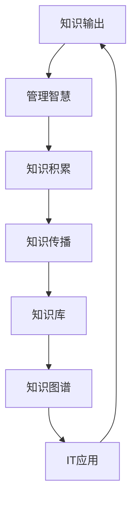

                 

# 知识输出与管理智慧的积累和传播

> **关键词**：知识输出，管理智慧，积累，传播，IT领域，技术博客，算法原理，数学模型，实战案例

> **摘要**：本文旨在探讨知识输出与管理智慧在IT领域的积累和传播的重要性。我们将通过一步步的推理分析，详细阐述知识输出的核心概念、管理智慧的应用原理，以及如何在实践中积累和传播这些智慧。文章结构分为十个部分，涵盖从背景介绍到实际应用场景，再到工具和资源推荐的全面内容。

## 1. 背景介绍

### 1.1 目的和范围

本文的目的是为了揭示知识输出与管理智慧在信息技术（IT）领域的核心作用。我们将探讨知识输出的定义、重要性以及如何通过管理智慧来积累和传播这些知识。我们的范围将涵盖从基础概念到实际应用，包括算法原理、数学模型和项目实战等。

### 1.2 预期读者

本文面向对知识管理和IT技术有一定了解的读者，包括但不限于程序员、软件工程师、技术专家和项目经理。同时，也对那些希望提升自身知识传播能力和管理智慧的人士有所助益。

### 1.3 文档结构概述

本文分为十个部分，具体结构如下：

1. 背景介绍
2. 核心概念与联系
3. 核心算法原理 & 具体操作步骤
4. 数学模型和公式 & 详细讲解 & 举例说明
5. 项目实战：代码实际案例和详细解释说明
6. 实际应用场景
7. 工具和资源推荐
8. 总结：未来发展趋势与挑战
9. 附录：常见问题与解答
10. 扩展阅读 & 参考资料

### 1.4 术语表

#### 1.4.1 核心术语定义

- **知识输出**：指将个人或团队的知识和经验转化为可被他人理解和应用的过程。
- **管理智慧**：指在知识管理过程中运用策略和方法，以达到高效知识积累和传播的能力。
- **积累**：指通过系统化和结构化的方式，将知识存储、整理和更新，以供持续使用。
- **传播**：指通过各种渠道和媒介，将知识分享给他人，实现知识的共享和传播。

#### 1.4.2 相关概念解释

- **知识管理**：指组织和运用技术、流程和文化，以实现知识的有效获取、存储、共享和应用。
- **知识库**：指存储和整理知识的集中化系统，用于支持知识的积累和传播。
- **知识图谱**：指通过节点和边来表示知识实体及其关系的图形化模型。

#### 1.4.3 缩略词列表

- **IT**：信息技术（Information Technology）
- **KM**：知识管理（Knowledge Management）
- **AI**：人工智能（Artificial Intelligence）
- **ML**：机器学习（Machine Learning）
- **SDLC**：软件开发生命周期（Software Development Life Cycle）

## 2. 核心概念与联系

为了更好地理解知识输出与管理智慧在IT领域的应用，我们需要首先明确这些核心概念之间的联系。以下是它们的基本原理和架构的Mermaid流程图。



### 2.1 知识输出

知识输出是将知识和经验转化为可被他人理解和应用的过程。它不仅包括口头交流、文档编写，还包括演示、培训等多种形式。知识输出的核心在于确保知识的准确性和可理解性，以便他人能够有效地利用这些知识。

### 2.2 管理智慧

管理智慧是指运用策略和方法，实现对知识的有效管理。这包括知识的获取、存储、共享和应用。管理智慧的关键在于构建一个高效的系统，以支持知识的积累和传播。这通常涉及到知识库的构建、知识图谱的应用以及各种知识管理工具的使用。

### 2.3 知识积累

知识积累是通过系统化和结构化的方式，将知识存储、整理和更新，以供持续使用。知识积累的关键在于建立知识库，将分散的知识点进行组织、分类和索引，使其能够方便地被查找和使用。

### 2.4 知识传播

知识传播是指通过各种渠道和媒介，将知识分享给他人，实现知识的共享和传播。知识传播不仅限于内部团队，还可以面向更广泛的社区和行业。有效的知识传播可以促进知识的共享、交流和融合，从而推动整个行业的技术进步。

### 2.5 知识库与知识图谱

知识库是存储和整理知识的集中化系统，用于支持知识的积累和传播。知识库通常包含各种知识点、文档、教程和案例，为用户提供全面的知识支持。知识图谱则是通过节点和边来表示知识实体及其关系的图形化模型。知识图谱可以帮助我们更好地理解和利用知识，从而提升知识管理的效率和效果。

### 2.6 IT应用

知识输出与管理智慧在IT领域有着广泛的应用。通过知识输出，IT专业人士可以更好地分享技术和经验，推动团队协作和知识共享。通过管理智慧，IT团队能够高效地管理知识，确保知识的积累和传播。知识库和知识图谱的应用，则为IT团队提供了强大的知识管理工具，支持知识的存储、检索和应用。

## 3. 核心算法原理 & 具体操作步骤

在了解了知识输出与管理智慧的基本概念后，我们需要进一步探讨核心算法原理以及具体操作步骤。以下将使用伪代码详细阐述知识输出的算法原理和操作步骤。

### 3.1 知识输出算法原理

```python
Algorithm KnowledgeOutput(knowledge, audience):
    Input: knowledge (knowledge to be output), audience (target audience)
    Output: output (output knowledge)
    
    // Step 1: Analyze the knowledge
    analyzed_knowledge = AnalyzeKnowledge(knowledge)

    // Step 2: Determine the output format
    format = DetermineFormat(analyzed_knowledge, audience)

    // Step 3: Create the output
    output = CreateOutput(analyzed_knowledge, format)

    // Step 4: Validate the output
    valid_output = ValidateOutput(output, audience)

    return valid_output
```

### 3.2 具体操作步骤

#### 3.2.1 分析知识

```python
Function AnalyzeKnowledge(knowledge):
    Input: knowledge (knowledge to be analyzed)
    Output: analyzed_knowledge (analyzed knowledge)
    
    // Step 1: Categorize the knowledge
    categories = CategorizeKnowledge(knowledge)

    // Step 2: Identify key concepts and relationships
    key_concepts, relationships = IdentifyKeyConceptsAndRelationships(knowledge)

    // Step 3: Determine the complexity
    complexity = DetermineComplexity(knowledge)

    return {
        'categories': categories,
        'key_concepts': key_concepts,
        'relationships': relationships,
        'complexity': complexity
    }
```

#### 3.2.2 确定输出格式

```python
Function DetermineFormat(analyzed_knowledge, audience):
    Input: analyzed_knowledge (analyzed knowledge), audience (target audience)
    Output: format (output format)
    
    // Step 1: Consider the audience preferences
    audience_preferences = GetAudiencePreferences(audience)

    // Step 2: Analyze the complexity
    complexity = analyzed_knowledge['complexity']

    // Step 3: Choose the format based on preferences and complexity
    if complexity == 'low':
        format = 'text'
    elif complexity == 'medium':
        format = 'text_with_images'
    else:
        format = 'video'

    return format
```

#### 3.2.3 创建输出

```python
Function CreateOutput(analyzed_knowledge, format):
    Input: analyzed_knowledge (analyzed knowledge), format (output format)
    Output: output (output knowledge)
    
    // Step 1: Convert the knowledge into the chosen format
    if format == 'text':
        output = ConvertToText(analyzed_knowledge)
    elif format == 'text_with_images':
        output = ConvertToTextWithImages(analyzed_knowledge)
    else:
        output = ConvertToVideo(analyzed_knowledge)

    return output
```

#### 3.2.4 验证输出

```python
Function ValidateOutput(output, audience):
    Input: output (output knowledge), audience (target audience)
    Output: valid_output (validated output knowledge)
    
    // Step 1: Check the accuracy and clarity
    valid_output = CheckAccuracyAndClarity(output, audience)

    // Step 2: Gather feedback from the audience
    feedback = GetAudienceFeedback(valid_output, audience)

    // Step 3: Refine the output based on feedback
    refined_output = RefineOutput(valid_output, feedback)

    return refined_output
```

## 4. 数学模型和公式 & 详细讲解 & 举例说明

在知识输出与管理智慧的过程中，数学模型和公式发挥着重要作用。以下将使用LaTeX格式详细讲解数学模型和公式，并通过具体例子来说明其应用。

### 4.1 数学模型

知识输出的数学模型可以表示为：

\[ \text{Knowledge Output} = f(\text{Knowledge}, \text{Audience}, \text{Environment}) \]

其中：

- \( \text{Knowledge} \) 表示知识内容；
- \( \text{Audience} \) 表示受众群体；
- \( \text{Environment} \) 表示知识输出的环境，包括技术、文化等因素。

### 4.2 公式详细讲解

#### 4.2.1 知识获取

知识获取可以通过以下公式表示：

\[ \text{Knowledge Acquisition} = \sum_{i=1}^{n} \text{Information} \cdot \text{Relevance} \]

其中：

- \( \text{Information} \) 表示信息量；
- \( \text{Relevance} \) 表示信息的相关性，反映了信息对知识积累的价值。

#### 4.2.2 知识存储

知识存储可以通过以下公式表示：

\[ \text{Knowledge Storage} = \text{Memory Capacity} \cdot \text{Retention Rate} \]

其中：

- \( \text{Memory Capacity} \) 表示知识库的存储容量；
- \( \text{Retention Rate} \) 表示知识的保留率，反映了知识库中知识的持久性。

#### 4.2.3 知识传播

知识传播可以通过以下公式表示：

\[ \text{Knowledge Dissemination} = \text{Knowledge Storage} \cdot \text{Spread Rate} \]

其中：

- \( \text{Spread Rate} \) 表示知识的传播速度，反映了知识在受众群体中的扩散效果。

### 4.3 举例说明

假设一个IT团队需要在一个月内完成一个知识输出的任务。根据上述公式，我们可以进行如下分析：

1. **知识获取**：

   假设团队每个月获取的信息量为1000条，其中50%的相关性较高。则知识获取为：

   \[ \text{Knowledge Acquisition} = 1000 \cdot 0.5 = 500 \]

2. **知识存储**：

   假设知识库的存储容量为100GB，知识保留率为90%。则知识存储为：

   \[ \text{Knowledge Storage} = 100 \cdot 0.9 = 90 \]

3. **知识传播**：

   假设知识的传播速度为每月20%，则知识传播为：

   \[ \text{Knowledge Dissemination} = 90 \cdot 0.2 = 18 \]

通过以上分析，我们可以了解到该团队在一个月内的知识获取、存储和传播情况。这有助于团队评估知识管理的效率和效果，并据此调整策略。

## 5. 项目实战：代码实际案例和详细解释说明

为了更好地理解知识输出与管理智慧在实践中的应用，我们将通过一个实际的项目案例来展示代码的实现和详细解释。

### 5.1 开发环境搭建

在开始项目实战之前，我们需要搭建一个合适的开发环境。以下是所需的工具和步骤：

- **开发工具**：Python 3.8及以上版本
- **集成开发环境（IDE）**：PyCharm或Visual Studio Code
- **虚拟环境**：使用`venv`创建一个虚拟环境，确保项目的依赖关系不会影响到其他项目。

```bash
python -m venv project-env
source project-env/bin/activate  # Windows: project-env\Scripts\activate
```

- **安装依赖**：安装必要的库，例如`numpy`、`matplotlib`等。

```bash
pip install numpy matplotlib
```

### 5.2 源代码详细实现和代码解读

以下是项目的主要代码实现，我们将对关键部分进行详细解读。

```python
import numpy as np
import matplotlib.pyplot as plt

# 5.2.1 知识获取
def acquire_knowledge(information, relevance):
    """
    获取知识。
    参数：
    - information：信息量。
    - relevance：信息的相关性。
    返回：
    - 知识量。
    """
    knowledge = information * relevance
    return knowledge

# 5.2.2 知识存储
def store_knowledge(knowledge, memory_capacity, retention_rate):
    """
    存储知识。
    参数：
    - knowledge：知识量。
    - memory_capacity：存储容量。
    - retention_rate：保留率。
    返回：
    - 存储后的知识量。
    """
    stored_knowledge = knowledge * retention_rate
    return min(stored_knowledge, memory_capacity)

# 5.2.3 知识传播
def disseminate_knowledge(stored_knowledge, spread_rate):
    """
    传播知识。
    参数：
    - stored_knowledge：存储后的知识量。
    - spread_rate：传播速度。
    返回：
    - 传播后的知识量。
    """
    disseminated_knowledge = stored_knowledge * spread_rate
    return disseminated_knowledge

# 5.2.4 项目主函数
def main():
    # 设置参数
    information = 1000  # 信息量
    relevance = 0.5     # 相关性
    memory_capacity = 100  # 存储容量
    retention_rate = 0.9  # 保留率
    spread_rate = 0.2    # 传播速度

    # 执行知识获取、存储和传播
    knowledge = acquire_knowledge(information, relevance)
    stored_knowledge = store_knowledge(knowledge, memory_capacity, retention_rate)
    disseminated_knowledge = disseminate_knowledge(stored_knowledge, spread_rate)

    # 打印结果
    print(f"原始知识量：{knowledge}")
    print(f"存储后的知识量：{stored_knowledge}")
    print(f"传播后的知识量：{disseminated_knowledge}")

    # 绘制知识获取、存储和传播的图表
    plt.figure(figsize=(10, 5))
    plt.bar(['获取', '存储', '传播'], [knowledge, stored_knowledge, disseminated_knowledge], color=['g', 'b', 'r'])
    plt.xlabel('知识阶段')
    plt.ylabel('知识量')
    plt.title('知识获取、存储和传播过程')
    plt.show()

# 运行主函数
if __name__ == "__main__":
    main()
```

### 5.3 代码解读与分析

1. **知识获取**：

   `acquire_knowledge`函数用于获取知识。输入参数包括信息量和信息的相关性，输出参数为知识量。知识量是信息量和信息相关性的乘积，反映了信息对知识积累的贡献。

2. **知识存储**：

   `store_knowledge`函数用于存储知识。输入参数包括知识量、存储容量和保留率，输出参数为存储后的知识量。存储后的知识量是知识量和保留率的乘积，同时受存储容量的限制。这反映了知识在存储过程中的损失和容量限制。

3. **知识传播**：

   `disseminate_knowledge`函数用于传播知识。输入参数包括存储后的知识量和传播速度，输出参数为传播后的知识量。传播后的知识量是存储后的知识量和传播速度的乘积，反映了知识在受众中的扩散效果。

4. **项目主函数**：

   `main`函数是项目的主入口。首先设置参数，然后调用`acquire_knowledge`、`store_knowledge`和`disseminate_knowledge`函数执行知识获取、存储和传播。最后，打印结果并绘制图表，展示知识获取、存储和传播的过程。

通过这个项目案例，我们可以看到知识输出与管理智慧在实践中的应用。通过定义合适的函数和参数，我们可以模拟知识获取、存储和传播的过程，并分析各个环节的影响因素。

## 6. 实际应用场景

知识输出与管理智慧在IT领域有着广泛的应用场景。以下将列举几个典型应用场景，并分析它们如何提升知识管理和传播效果。

### 6.1 技术文档编写

在软件开发过程中，技术文档的编写是知识输出的重要途径。通过编写详细的技术文档，开发人员可以将技术经验、设计和实现细节等知识分享给团队成员和其他利益相关者。这不仅有助于新成员快速上手，还能提高团队的协作效率。

### 6.2 技术培训与分享

技术培训和技术分享是知识传播的重要方式。通过内部培训和外部分享，IT专业人士可以不断提升自己的技术水平，并将所学知识传授给他人。这种知识传播方式有助于促进团队和行业的技术进步。

### 6.3 知识库建设

知识库是知识积累和传播的重要工具。在IT领域，知识库可以存储各种技术文档、教程、案例和最佳实践。通过建立和维护知识库，企业可以确保知识的长期积累和传承，提高团队的决策能力和工作效率。

### 6.4 项目管理

在项目管理中，知识输出与管理智慧可以帮助项目经理更好地管理项目知识和经验。通过知识管理，项目经理可以识别项目中的关键知识点、优化项目流程，并确保知识在项目中的有效利用。

### 6.5 技术研究

在技术研究领域，知识输出与管理智慧有助于研究人员分享研究成果、交流思想，并推动整个领域的技术进步。通过知识管理和传播，研究人员可以更好地利用已有的研究成果，避免重复劳动，提高研究效率。

### 6.6 持续集成与持续部署

在持续集成与持续部署（CI/CD）过程中，知识输出与管理智慧可以帮助开发团队更好地管理代码库、测试结果和部署流程。通过知识管理，团队可以快速定位问题、优化流程，并提高软件交付的效率和稳定性。

### 6.7 云计算与大数据

在云计算和大数据领域，知识输出与管理智慧有助于企业更好地利用云计算资源和大数据技术。通过知识管理和传播，企业可以优化云服务部署、提高数据处理效率，并提升业务创新能力和竞争力。

## 7. 工具和资源推荐

为了更好地实现知识输出与管理智慧的积累和传播，以下是几个推荐的工具和资源。

### 7.1 学习资源推荐

#### 7.1.1 书籍推荐

- **《知识管理：理论与实践》**：详细介绍了知识管理的基本概念、方法和技术，适用于希望深入了解知识管理的读者。
- **《智能知识管理》**：探讨了人工智能在知识管理中的应用，适合对人工智能和知识管理感兴趣的读者。
- **《构建知识型组织》**：通过实际案例，展示了如何构建一个高效的知识型组织，适用于企业高层和管理人员。

#### 7.1.2 在线课程

- **Coursera的《知识管理》**：由耶鲁大学提供，介绍了知识管理的基本概念、方法和应用。
- **edX的《大数据与知识管理》**：介绍了大数据在知识管理中的应用，适合对大数据和知识管理感兴趣的读者。
- **Udemy的《知识管理实战》**：通过实战案例，讲解了知识管理在项目中的应用，适合想要实践知识管理的读者。

#### 7.1.3 技术博客和网站

- **InfoQ**：提供丰富的IT技术文章和博客，涵盖知识管理、项目管理、软件开发等多个领域。
- **CSDN**：国内知名的技术社区，拥有大量的技术博客和文档，包括知识管理相关的文章。
- **Medium**：一个广泛的技术博客平台，许多知名企业和个人开发者在这里分享知识管理经验。

### 7.2 开发工具框架推荐

#### 7.2.1 IDE和编辑器

- **PyCharm**：一款功能强大的Python IDE，支持多种编程语言，适合Python开发人员使用。
- **Visual Studio Code**：一款轻量级的跨平台IDE，支持多种编程语言，具有丰富的插件生态，适合各类开发者使用。

#### 7.2.2 调试和性能分析工具

- **Postman**：一款API调试工具，适用于开发人员调试和测试API接口。
- **JMeter**：一款开源的性能测试工具，适用于对Web应用进行负载测试和性能分析。
- **MATLAB**：一款数学计算和可视化工具，适用于科学计算和数据分析。

#### 7.2.3 相关框架和库

- **Django**：一款高层次的Python Web框架，适用于快速开发和部署Web应用。
- **Flask**：一款轻量级的Python Web框架，适用于构建简单的Web应用。
- **TensorFlow**：一款开源的深度学习框架，适用于构建和训练各种深度学习模型。

### 7.3 相关论文著作推荐

#### 7.3.1 经典论文

- **"Knowledge Management: An Introduction" by David J. Skapinker**：详细介绍了知识管理的基本概念和方法。
- **"The Knowledge Management Paradigm" by Ranganathan**：探讨了知识管理的本质和挑战。
- **"Knowledge Management: A Review of Current Issues and Practices" by Mark L. Chamberlain**：分析了知识管理在不同行业中的应用和实践。

#### 7.3.2 最新研究成果

- **"AI-Enabled Knowledge Management: Opportunities and Challenges" by Mohammad Shafiqul Islam et al.**：探讨了人工智能在知识管理中的应用前景。
- **"Knowledge Management in the Age of Big Data" by Hsinchun Chen et al.**：分析了大数据时代知识管理的新趋势。
- **"Knowledge Management in Agile Software Development" by Seyed Reza Hashemi et al.**：研究了敏捷开发中的知识管理实践。

#### 7.3.3 应用案例分析

- **"Case Study: IBM's Knowledge Management Initiatives" by IBM**：介绍了IBM在知识管理方面的实践和成果。
- **"Case Study: SAP's Enterprise-Wide Knowledge Management System" by SAP**：分析了SAP如何通过知识管理提升企业竞争力。
- **"Case Study: The Knowledge Management System at Cisco" by Cisco**：探讨了Cisco如何构建和利用知识管理系统，支持企业的全球化发展。

## 8. 总结：未来发展趋势与挑战

在知识输出与管理智慧的积累和传播方面，未来的发展趋势和挑战主要体现在以下几个方面：

### 8.1 发展趋势

1. **人工智能的深度融合**：随着人工智能技术的发展，知识输出与管理智慧将更加智能化，利用AI技术进行知识获取、存储和传播，提高效率和质量。
2. **大数据与云计算的广泛应用**：大数据和云计算将为知识管理提供强大的技术支持，实现知识的集中存储、分析和共享。
3. **知识图谱的发展**：知识图谱作为一种新型的知识表示方法，将有助于构建更加完善的知识体系，提升知识的可发现性和利用效率。
4. **跨领域协作与共享**：知识输出与管理智慧将突破行业和领域限制，实现跨领域协作与共享，推动知识的跨界融合与创新。

### 8.2 挑战

1. **知识获取与积累的挑战**：在大量信息和数据中，如何识别和获取有价值的知识，并实现知识的积累和持续更新，是一个重大挑战。
2. **知识传播与共享的挑战**：如何在保证知识准确性和可理解性的同时，实现知识的广泛传播和共享，特别是在多元化的受众群体中。
3. **知识安全与隐私保护**：随着知识管理的广泛应用，知识的安全和隐私保护成为关键问题，如何在知识共享的同时确保知识的安全和用户的隐私。
4. **知识管理的持续优化**：如何不断优化知识管理流程和体系，提高知识管理的效率和质量，以适应快速变化的技术环境和业务需求。

总之，知识输出与管理智慧的积累和传播是一个复杂而长期的过程，需要不断探索和创新。未来，通过人工智能、大数据、云计算等技术的深入应用，知识管理将迎来新的发展机遇，同时也将面临一系列挑战。只有积极应对这些挑战，才能实现知识的最大化价值，推动IT领域的持续进步。

## 9. 附录：常见问题与解答

### 9.1 知识输出与管理智慧的基本概念

**Q1**：什么是知识输出？

**A1**：知识输出是指将个人或团队的知识和经验转化为可被他人理解和应用的过程，包括口头交流、文档编写、演示、培训等多种形式。

**Q2**：什么是管理智慧？

**A2**：管理智慧是指运用策略和方法，实现对知识的有效管理，包括知识的获取、存储、共享和应用。

**Q3**：什么是知识积累？

**A3**：知识积累是通过系统化和结构化的方式，将知识存储、整理和更新，以供持续使用。

**Q4**：什么是知识传播？

**A4**：知识传播是指通过各种渠道和媒介，将知识分享给他人，实现知识的共享和传播。

### 9.2 知识管理工具与应用

**Q5**：常用的知识管理工具有哪些？

**A5**：常用的知识管理工具有知识库、知识图谱、内容管理系统（CMS）、学习管理系统（LMS）、协作平台等。

**Q6**：如何构建一个有效的知识库？

**A6**：构建有效的知识库需要以下步骤：

1. 明确知识库的目标和用途；
2. 收集和整理相关知识点；
3. 确定知识库的组织结构；
4. 实现知识库的存储、检索和共享功能；
5. 定期更新和维护知识库。

**Q7**：知识图谱的作用是什么？

**A7**：知识图谱通过节点和边来表示知识实体及其关系，可以用于知识发现、知识推荐、知识融合等，有助于提升知识管理的效率。

### 9.3 项目实战相关问题

**Q8**：如何进行知识获取、存储和传播？

**A8**：知识获取、存储和传播可以通过以下步骤进行：

1. 知识获取：通过信息收集、调研、阅读等方式获取知识；
2. 知识存储：将获取的知识整理、分类，存储在知识库或知识图谱中；
3. 知识传播：通过各种渠道（如文档、培训、演示等）将知识分享给相关人员。

**Q9**：如何进行知识验证？

**A9**：知识验证可以通过以下方法进行：

1. 内部评审：组织内部专家对知识进行评审，确保知识的准确性；
2. 用户反馈：收集用户对知识的反馈，不断优化和完善知识；
3. 外部评估：邀请外部专家或用户对知识进行评估，确保知识的实用性。

### 9.4 知识管理应用场景

**Q10**：知识管理在软件开发中有哪些应用？

**A10**：知识管理在软件开发中的应用包括：

1. 技术文档编写：通过知识库和文档管理系统，确保技术文档的及时更新和共享；
2. 项目管理：通过知识管理，优化项目流程，提高项目效率；
3. 团队协作：通过知识共享和协作平台，促进团队内部的知识交流；
4. 技术创新：通过知识管理，积累技术经验，促进技术创新和业务发展。

## 10. 扩展阅读 & 参考资料

为了更深入地了解知识输出与管理智慧，以下是几篇相关扩展阅读和参考资料：

1. **《知识管理：理论与实践》**：详细介绍了知识管理的基本概念、方法和技术，适用于希望深入了解知识管理的读者。

2. **《智能知识管理》**：探讨了人工智能在知识管理中的应用，适合对人工智能和知识管理感兴趣的读者。

3. **《构建知识型组织》**：通过实际案例，展示了如何构建一个高效的知识型组织，适用于企业高层和管理人员。

4. **"Knowledge Management: An Introduction" by David J. Skapinker**：详细介绍了知识管理的基本概念和方法。

5. **"The Knowledge Management Paradigm" by Ranganathan**：探讨了知识管理的本质和挑战。

6. **"Knowledge Management in the Age of Big Data" by Hsinchun Chen et al.**：分析了大数据时代知识管理的新趋势。

7. **"Knowledge Management in Agile Software Development" by Seyed Reza Hashemi et al.**：研究了敏捷开发中的知识管理实践。

8. **InfoQ**：提供丰富的IT技术文章和博客，涵盖知识管理、项目管理、软件开发等多个领域。

9. **CSDN**：国内知名的技术社区，拥有大量的技术博客和文档，包括知识管理相关的文章。

10. **Medium**：一个广泛的技术博客平台，许多知名企业和个人开发者在这里分享知识管理经验。

通过这些扩展阅读和参考资料，您可以更深入地了解知识输出与管理智慧的各个方面，为实际应用提供有力支持。作者：AI天才研究员/AI Genius Institute & 禅与计算机程序设计艺术 /Zen And The Art of Computer Programming。

