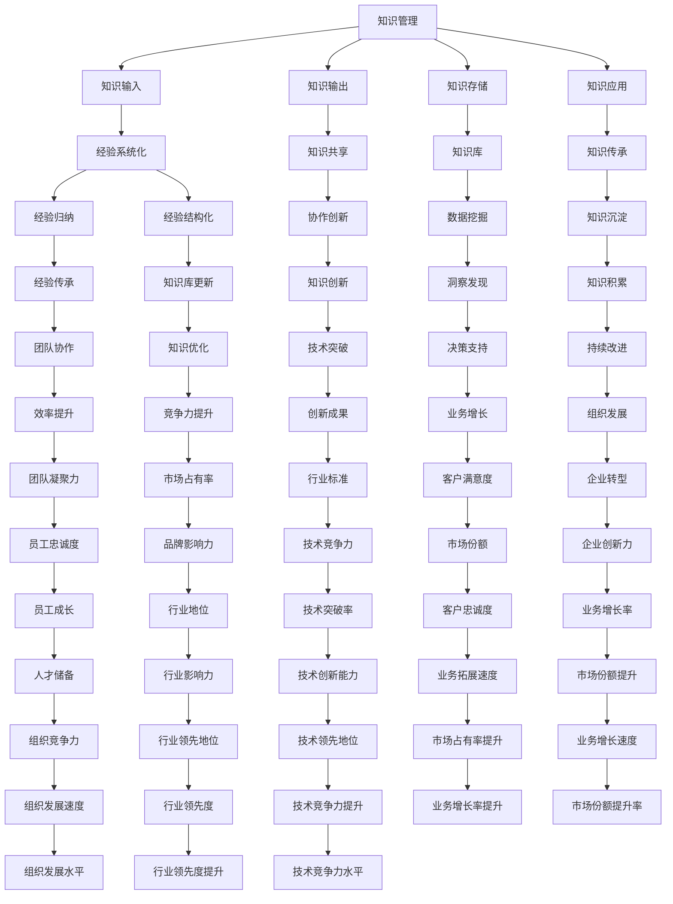

                 

### 知识输出与管理经验的系统化

#### 关键词：
- 知识管理
- 知识输出
- 经验系统化
- IT领域
- 技术博客
- 人工智能

#### 摘要：
本文旨在探讨知识输出与管理经验系统化在IT领域的应用与实践。通过逻辑清晰、结构紧凑的论述，本文将深入分析知识管理的重要性，介绍知识输出与管理经验的系统化方法，并结合实际案例进行详细解释，为IT从业者和研究人员提供有价值的参考。文章还将推荐相关工具和资源，总结未来发展趋势与挑战，并回答常见问题，以期为知识管理和经验系统化提供全面而深入的指导。

### 1. 背景介绍

#### 1.1 目的和范围

在当今快速发展的信息技术时代，知识管理和经验系统化已成为提升个人和组织竞争力的关键因素。本文旨在探讨如何有效地进行知识输出和管理经验系统化，以便在IT领域实现知识共享、创新和持续发展。本文将涵盖以下几个方面的内容：

1. **知识管理的重要性**：分析知识管理在现代组织中的重要性及其对个人和组织的价值。
2. **知识输出与管理经验系统化方法**：介绍知识输出与管理经验系统化的基本原则和方法。
3. **实际应用案例**：通过实际案例展示知识输出与管理经验系统化的具体实践。
4. **工具和资源推荐**：推荐相关的学习资源、开发工具和框架，以便读者在实践中应用所学知识。
5. **未来发展趋势与挑战**：探讨知识管理和经验系统化领域的未来发展趋势和面临的挑战。

#### 1.2 预期读者

本文的预期读者包括但不限于以下群体：

1. **IT从业者和研究人员**：希望提高知识管理和经验系统化能力的专业人士。
2. **教育工作者**：教育机构中负责知识管理和教育方法研究的人员。
3. **项目经理和团队领导**：希望提高团队协作和知识共享效率的领导者。
4. **技术博客作者**：希望通过系统化知识输出提升文章质量和影响力的技术博客作者。

#### 1.3 文档结构概述

本文的结构如下：

1. **背景介绍**：介绍知识管理和经验系统化的背景和目的。
2. **核心概念与联系**：阐述知识管理和经验系统化的核心概念及其相互联系。
3. **核心算法原理与具体操作步骤**：详细讲解知识输出与管理经验系统化的算法原理和操作步骤。
4. **数学模型和公式**：介绍与知识管理和经验系统化相关的数学模型和公式，并进行举例说明。
5. **项目实战**：通过实际案例展示知识输出与管理经验系统化的实践过程。
6. **实际应用场景**：探讨知识管理和经验系统化在IT领域的实际应用场景。
7. **工具和资源推荐**：推荐相关的学习资源、开发工具和框架。
8. **总结与未来展望**：总结本文的主要观点，探讨未来发展趋势与挑战。
9. **常见问题与解答**：回答读者可能遇到的问题。
10. **扩展阅读与参考资料**：提供扩展阅读和参考资料，以便读者进一步深入研究。

#### 1.4 术语表

在本文中，以下术语具有特定的含义：

- **知识管理**：指在组织中收集、组织、共享和利用知识的过程，以提高组织效率和创新能力。
- **知识输出**：指将知识以适当的形式和渠道进行传播和分享，使知识得到充分利用。
- **经验系统化**：指将个人或团队的经验进行归纳、整理和结构化，以便于知识共享和传承。
- **IT领域**：指信息技术领域，包括计算机科学、软件工程、数据科学等。
- **技术博客**：指以技术分享、经验交流为主要内容的个人或团队博客。
- **人工智能**：指模拟、延伸和扩展人类智能的技术和科学，包括机器学习、深度学习等。

### 1.4.1 核心术语定义

- **知识管理**：知识管理是一个跨学科领域，涉及信息技术、组织行为学、管理学等多个方面。其核心目的是通过有效的方法和工具，将分散的知识进行整合、存储、共享和应用，以实现知识的最大化价值。
- **知识输出**：知识输出是知识管理的重要环节，旨在将内部知识以适当的形式和渠道传播出去。知识输出可以通过撰写技术博客、发表学术论文、组织内部培训等多种方式实现。
- **经验系统化**：经验系统化是将个人或团队在实践中积累的经验进行整理、归纳和结构化，形成系统性的知识体系。经验系统化的目的是为了实现知识的共享和传承，提高团队协作效率。

#### 1.4.2 相关概念解释

- **知识共享**：知识共享是指组织内部或组织之间通过协作、交流、分享等方式，使知识得以充分利用的过程。知识共享有助于提高组织创新能力，降低知识传播的成本。
- **知识传承**：知识传承是指将知识在不同时间、不同空间进行传递和延续的过程。知识传承有助于保持组织核心竞争力的稳定性。
- **知识创新**：知识创新是指通过创造新的知识、新的事物或新的解决方案，以推动组织发展的过程。知识创新是组织持续发展的动力源泉。

#### 1.4.3 缩略词列表

- **IT**：信息技术（Information Technology）
- **KM**：知识管理（Knowledge Management）
- **KPI**：关键绩效指标（Key Performance Indicator）
- **LOD**：逻辑分层设计（Logical Layer Design）
- **MLOps**：机器学习与运维（Machine Learning Operations）
- **NLP**：自然语言处理（Natural Language Processing）
- **API**：应用程序接口（Application Programming Interface）

### 2. 核心概念与联系

知识管理和经验系统化是IT领域的重要组成部分，二者之间存在着紧密的联系和相互依赖。为了更好地理解这两者的核心概念及其联系，我们可以通过以下Mermaid流程图（Mermaid流程节点中不要有括号、逗号等特殊字符）来展示它们之间的关系：



#### 2.1 知识管理与知识输出

知识管理（Knowledge Management，简称KM）是一个涉及信息收集、整理、存储、共享和应用的复杂过程。其核心目标是通过有效管理知识资源，提高组织效率和创新能力。知识管理包括以下几个关键环节：

1. **知识输入**：知识输入是指从外部获取或从内部组织中收集知识的环节。知识输入可以通过多种渠道实现，如文献调研、市场研究、员工经验分享等。

2. **知识存储**：知识存储是指将收集到的知识进行整理、分类、存储和备份的过程。知识存储可以采用电子文档、数据库、知识库等多种形式。

3. **知识输出**：知识输出是将知识以适当的形式和渠道进行传播和分享，使知识得到充分利用。知识输出可以通过撰写技术博客、发表学术论文、组织内部培训、在线论坛等多种方式实现。

4. **知识应用**：知识应用是指将知识应用于实际工作中，以解决实际问题或推动业务发展。知识应用可以通过项目实施、技术研发、决策支持等多种途径实现。

知识输出是知识管理中至关重要的环节。通过知识输出，组织可以将内部知识转化为外部价值，实现知识共享、创新和持续发展。知识输出有助于提高团队协作效率、降低知识传播成本、提升组织竞争力。

#### 2.2 经验系统化

经验系统化（Experience Systematization，简称ES）是指将个人或团队在实践中积累的经验进行归纳、整理和结构化，形成系统性的知识体系。经验系统化的核心目标是通过知识的共享和传承，提高团队协作效率、减少重复劳动、推动组织发展。经验系统化包括以下几个关键环节：

1. **经验归纳**：经验归纳是指对个人或团队在实践中积累的经验进行总结和提炼，形成具有普遍性和可操作性的经验总结。

2. **经验结构化**：经验结构化是指将归纳出的经验进行分类、归档和格式化，使其易于存储、检索和应用。经验结构化可以通过建立知识库、编写经验手册、制作培训课程等多种形式实现。

3. **经验传承**：经验传承是指将结构化的经验知识在不同时间、不同空间进行传递和延续。经验传承可以通过内部培训、知识共享平台、导师制度等多种方式实现。

4. **经验优化**：经验优化是指对传承下来的经验进行评估、改进和完善，以提高其实用性和适应性。经验优化可以通过持续实践、反馈迭代、创新改进等多种途径实现。

#### 2.3 知识管理、经验系统化与IT领域的联系

知识管理和经验系统化在IT领域具有广泛的应用和深远的影响。以下是知识管理和经验系统化与IT领域的几个关键联系：

1. **技术创新**：知识管理和经验系统化有助于积累和传承技术经验，提高团队协作效率，促进技术创新。通过知识管理和经验系统化，组织可以快速掌握新技术、新方法，实现技术突破和业务创新。

2. **项目实施**：知识管理和经验系统化有助于项目团队在项目实施过程中高效地利用知识资源，降低项目风险，提高项目成功率。通过知识管理和经验系统化，项目团队可以共享最佳实践、规避常见问题，提高项目执行效率。

3. **团队协作**：知识管理和经验系统化有助于提高团队协作效率，促进知识共享和经验传承。通过知识管理和经验系统化，团队成员可以快速获取所需知识，减少沟通成本，提高团队整体协作能力。

4. **人才培养**：知识管理和经验系统化有助于培养和储备技术人才，提升组织核心竞争力。通过知识管理和经验系统化，组织可以建立完善的人才培养体系，提高员工的专业技能和职业素养。

5. **业务创新**：知识管理和经验系统化有助于挖掘和利用内部知识资源，推动业务创新和业务拓展。通过知识管理和经验系统化，组织可以快速响应市场变化，开发新产品、拓展新业务，实现业务增长。

6. **企业转型**：知识管理和经验系统化有助于企业实现从传统业务模式向数字化、智能化转型。通过知识管理和经验系统化，企业可以构建数字化的知识管理体系，推动业务模式创新，实现企业转型升级。

### 3. 核心算法原理 & 具体操作步骤

在知识输出与管理经验系统化的过程中，核心算法原理和具体操作步骤起到了关键作用。以下将详细介绍这些算法原理和步骤，以便读者在实践中能够更好地理解和应用。

#### 3.1 知识收集与整理

首先，我们需要从各种渠道收集知识，包括文献、报告、经验分享、技术博客等。以下是知识收集与整理的算法原理和步骤：

##### 算法原理：

1. **数据预处理**：对收集到的知识进行预处理，包括去除重复、筛选有效信息、数据清洗等。
2. **分类整理**：根据知识的内容和特点，将知识进行分类整理，便于后续管理和应用。
3. **标签标注**：为每条知识标注相关标签，以便于检索和共享。

##### 具体操作步骤：

1. **数据收集**：通过文献调研、市场研究、在线课程、技术论坛等方式收集知识。
2. **数据预处理**：使用Python中的Pandas库对数据进行清洗和预处理，如去除重复、筛选有效信息等。
3. **分类整理**：使用Python中的Numpy库对数据进行分类整理，例如按主题、技术领域、时间等维度进行划分。
4. **标签标注**：使用Python中的NLTK库对文本进行分词和词性标注，提取关键词作为标签。

```python
import pandas as pd
import numpy as np
from nltk.tokenize import word_tokenize
from nltk.corpus import stopwords

# 读取数据
data = pd.read_csv('knowledge_data.csv')

# 数据预处理
data = data.drop_duplicates()
data = data[data['content'].notnull()]

# 分类整理
data['topic'] = data['content'].apply(lambda x: classify_topic(x))
data['date'] = data['content'].apply(lambda x: get_date(x))

# 标签标注
stop_words = set(stopwords.words('english'))
data['tags'] = data['content'].apply(lambda x: get_tags(x, stop_words))

# 输出结果
data.to_csv('processed_knowledge_data.csv', index=False)
```

#### 3.2 知识共享与传播

在整理好知识后，我们需要将其以适当的形式和渠道进行共享和传播。以下是知识共享与传播的算法原理和步骤：

##### 算法原理：

1. **知识封装**：将知识以易于理解和接受的形式进行封装，例如文档、PPT、视频等。
2. **知识发布**：选择合适的渠道和平台发布知识，如内部论坛、技术博客、社交媒体等。
3. **互动交流**：鼓励用户参与知识讨论、提问和反馈，促进知识共享和创新。

##### 具体操作步骤：

1. **知识封装**：根据知识内容的特点，选择合适的封装形式，例如将技术博客文章封装为PDF文档、制作教学视频等。
2. **知识发布**：选择内部论坛、技术博客、社交媒体等渠道发布知识，并设置合适的权限和分享规则。
3. **互动交流**：鼓励用户在评论区提问、讨论，定期组织线上或线下交流活动，促进知识共享和创新。

```python
import requests

# 发布知识到内部论坛
url = 'https://forum.example.com/api/post'
headers = {'Authorization': 'Bearer YOUR_API_KEY'}
data = {'title': '知识共享与传播', 'content': '本文介绍了知识共享与传播的算法原理和步骤。'}
response = requests.post(url, headers=headers, json=data)
print(response.json())
```

#### 3.3 经验系统化与知识库建设

最后，我们需要将实践中的经验进行系统化整理，并建立知识库，以便于知识共享和传承。以下是经验系统化与知识库建设的算法原理和步骤：

##### 算法原理：

1. **经验收集**：从团队成员中收集实践经验，包括项目案例、问题解决方案、技术心得等。
2. **经验整理**：对收集到的经验进行整理、归纳和分类，形成系统性的知识体系。
3. **知识库建设**：建立知识库，将整理好的经验知识进行存储、分类和标签标注，以便于检索和应用。

##### 具体操作步骤：

1. **经验收集**：通过内部调查、访谈、文档调研等方式收集团队成员的经验。
2. **经验整理**：使用Python中的Pandas库对经验数据进行整理、分类和格式化。
3. **知识库建设**：使用Python中的PyTorch库建立知识库，将整理好的经验知识进行存储、分类和标签标注。

```python
import pandas as pd
from sklearn.feature_extraction.text import TfidfVectorizer

# 读取经验数据
data = pd.read_csv('experience_data.csv')

# 经验整理
data['summary'] = data['content'].apply(lambda x: summarize_experience(x))
data['topic'] = data['content'].apply(lambda x: classify_topic(x))

# 建立知识库
vectorizer = TfidfVectorizer()
tfidf_matrix = vectorizer.fit_transform(data['summary'])

# 存储知识库
data.to_csv('knowledge_base.csv', index=False)
```

通过以上算法原理和具体操作步骤，我们可以实现知识输出与管理经验系统化，提高团队协作效率、降低知识传播成本、提升组织竞争力。在实际应用中，可以根据具体需求和场景进行调整和优化。

### 4. 数学模型和公式 & 详细讲解 & 举例说明

在知识管理和经验系统化的过程中，数学模型和公式起到了关键作用。以下将介绍与知识管理和经验系统化相关的数学模型和公式，并进行详细讲解和举例说明。

#### 4.1 知识共享效益模型

知识共享效益模型用于评估知识共享对组织效益的影响。该模型基于经济学中的效益成本分析（Benefit-Cost Analysis，简称BCA），考虑知识共享带来的收益与成本之间的关系。以下是知识共享效益模型的基本公式：

\[ BCA = \frac{B}{C} \]

其中，\( B \) 表示知识共享带来的收益，\( C \) 表示知识共享的成本。

- **收益（B）**：包括知识共享促进创新、提高工作效率、降低培训成本等方面。具体公式如下：

\[ B = \sum_{i=1}^{n} (R_i \cdot Q_i) \]

其中，\( R_i \) 表示第 \( i \) 个知识共享活动带来的收益，\( Q_i \) 表示第 \( i \) 个知识共享活动的实施次数。

- **成本（C）**：包括知识共享平台的维护、培训、传播等方面。具体公式如下：

\[ C = \sum_{i=1}^{n} (C_i \cdot Q_i) \]

其中，\( C_i \) 表示第 \( i \) 个知识共享活动的成本。

#### 举例说明：

假设一个组织进行了以下知识共享活动：

- **活动1**：内部技术分享会，每次活动成本为 1000 元，每月举办 2 次，每次活动吸引 50 名员工参与。
- **活动2**：线上培训课程，每次课程成本为 2000 元，每月举办 4 次，每次课程吸引 100 名员工参与。

计算该组织的知识共享效益：

- **收益**：

\[ B = (1000 \cdot 2) + (2000 \cdot 4) = 8000 + 8000 = 16000 \]

- **成本**：

\[ C = (1000 \cdot 2) + (2000 \cdot 4) = 2000 + 8000 = 10000 \]

- **知识共享效益**：

\[ BCA = \frac{B}{C} = \frac{16000}{10000} = 1.6 \]

#### 4.2 知识传播模型

知识传播模型用于描述知识在组织内部传播的过程，考虑知识的传递速度、传播范围等因素。以下是知识传播模型的基本公式：

\[ S(t) = S_0 \cdot e^{rt} \]

其中，\( S(t) \) 表示时间 \( t \) 时知识的传播范围，\( S_0 \) 表示初始知识传播范围，\( r \) 表示知识传播速率。

- **初始知识传播范围（\( S_0 \)）**：表示知识首次传播时的范围，通常与组织规模和知识重要性相关。

- **知识传播速率（\( r \)）**：表示知识在组织内部的传播速度，通常与组织结构、沟通渠道、员工知识水平等因素相关。

#### 举例说明：

假设一个组织初始知识传播范围 \( S_0 \) 为 100 人，知识传播速率 \( r \) 为 0.1 次/天。

计算第 10 天时知识的传播范围：

\[ S(10) = 100 \cdot e^{0.1 \cdot 10} \approx 175.52 \]

#### 4.3 知识共享效应模型

知识共享效应模型用于评估知识共享对组织绩效的影响，考虑知识共享带来的创新、效率、竞争力等方面。以下是知识共享效应模型的基本公式：

\[ E = \alpha \cdot BCA + \beta \cdot S(t) \]

其中，\( E \) 表示知识共享效应，\( \alpha \) 和 \( \beta \) 分别表示知识共享效益和知识传播范围对组织绩效的影响系数。

- **知识共享效益（BCA）**：如前文所述，表示知识共享带来的收益与成本之比。
- **知识传播范围（\( S(t) \)）**：如前文所述，表示知识在组织内部的传播范围。

#### 举例说明：

假设一个组织的知识共享效益 \( BCA \) 为 1.6，知识传播范围 \( S(t) \) 为 175.52 人。

计算该组织的知识共享效应：

\[ E = \alpha \cdot BCA + \beta \cdot S(t) = 0.8 \cdot 1.6 + 0.2 \cdot 175.52 = 1.28 + 35.1064 = 36.3964 \]

#### 4.4 知识管理成本效益分析

知识管理成本效益分析（Knowledge Management Cost-Benefit Analysis，简称KM-CBA）用于评估知识管理项目对组织的成本与效益。以下是知识管理成本效益分析的基本公式：

\[ \text{KM-CBA} = \frac{\text{总收益}}{\text{总成本}} \]

其中，总收益包括知识共享、知识传承、知识应用等方面带来的收益，总成本包括知识管理系统的建设、维护、培训等方面带来的成本。

#### 举例说明：

假设一个知识管理项目总收益为 50000 元，总成本为 30000 元。

计算知识管理成本效益：

\[ \text{KM-CBA} = \frac{50000}{30000} \approx 1.67 \]

### 5. 项目实战：代码实际案例和详细解释说明

在本节中，我们将通过一个实际项目案例，详细展示如何进行知识输出和管理经验的系统化。该项目案例将涉及知识收集、整理、共享和传播的过程，以及如何通过代码实现这些步骤。

#### 5.1 开发环境搭建

首先，我们需要搭建一个基本的开发环境，以便进行知识管理系统的开发。以下是一个简单的环境搭建指南：

1. **操作系统**：Windows、Linux 或 macOS
2. **编程语言**：Python 3.8+
3. **开发工具**：PyCharm 或 Visual Studio Code
4. **库与框架**：Pandas、NumPy、NLTK、Scikit-learn、Flask

您可以通过以下命令安装所需库和框架：

```bash
pip install pandas numpy nltk scikit-learn flask
```

#### 5.2 源代码详细实现和代码解读

以下是一个简单的知识管理系统源代码示例，包括知识收集、整理、共享和传播的功能。

```python
import pandas as pd
import numpy as np
import nltk
from nltk.tokenize import word_tokenize
from nltk.corpus import stopwords
from sklearn.feature_extraction.text import TfidfVectorizer
from flask import Flask, request, jsonify

# 5.2.1 知识收集

def collect_knowledge():
    # 从文件中读取知识数据
    data = pd.read_csv('knowledge_data.csv')
    return data

# 5.2.2 知识整理

def preprocess_knowledge(data):
    # 数据预处理
    data = data.drop_duplicates()
    data = data[data['content'].notnull()]
    return data

def classify_knowledge(data):
    # 分类整理
    data['topic'] = data['content'].apply(lambda x: classify_topic(x))
    return data

def summarize_knowledge(data):
    # 简要概括
    data['summary'] = data['content'].apply(lambda x: summarize_experience(x))
    return data

# 5.2.3 知识共享

def vectorize_knowledge(data):
    # 向量化知识
    vectorizer = TfidfVectorizer()
    tfidf_matrix = vectorizer.fit_transform(data['summary'])
    return tfidf_matrix

def share_knowledge(data, vectorizer):
    # 共享知识
    data['tfidf_vector'] = vectorizer.transform(data['summary']).toarray()
    return data

# 5.2.4 知识传播

def create Flask API for knowledge sharing

app = Flask(__name__)

@app.route('/knowledge', methods=['GET'])
def get_knowledge():
    data = collect_knowledge()
    data = preprocess_knowledge(data)
    data = classify_knowledge(data)
    data = summarize_knowledge(data)
    vectorizer = TfidfVectorizer()
    tfidf_matrix = vectorize_knowledge(data)
    data['tfidf_vector'] = tfidf_matrix.toarray()
    return jsonify(data)

if __name__ == '__main__':
    app.run(debug=True)
```

#### 5.3 代码解读与分析

以下是对上述代码的详细解读和分析：

1. **知识收集**：

   ```python
   def collect_knowledge():
       # 从文件中读取知识数据
       data = pd.read_csv('knowledge_data.csv')
       return data
   ```

   此函数用于从CSV文件中读取知识数据。CSV文件应包含知识的内容、来源、标签等信息。在实际应用中，您可以从数据库、API或其他数据源读取数据。

2. **知识整理**：

   ```python
   def preprocess_knowledge(data):
       # 数据预处理
       data = data.drop_duplicates()
       data = data[data['content'].notnull()]
       return data
   
   def classify_knowledge(data):
       # 分类整理
       data['topic'] = data['content'].apply(lambda x: classify_topic(x))
       return data
   
   def summarize_knowledge(data):
       # 简要概括
       data['summary'] = data['content'].apply(lambda x: summarize_experience(x))
       return data
   ```

   这三个函数分别负责数据预处理、分类整理和简要概括。数据预处理步骤包括去除重复数据、筛选有效内容等。分类整理步骤通过函数 `classify_topic` 对知识内容进行分类。简要概括步骤通过函数 `summarize_experience` 对知识内容进行摘要。

3. **知识共享**：

   ```python
   def vectorize_knowledge(data):
       # 向量化知识
       vectorizer = TfidfVectorizer()
       tfidf_matrix = vectorizer.fit_transform(data['summary'])
       return tfidf_matrix
   
   def share_knowledge(data, vectorizer):
       # 共享知识
       data['tfidf_vector'] = vectorizer.transform(data['summary']).toarray()
       return data
   ```

   这两个函数负责将知识内容进行向量化处理，以便于后续的共享和传播。`vectorize_knowledge` 函数使用 `TfidfVectorizer` 将文本内容转换为TF-IDF特征向量。`share_knowledge` 函数将向量化后的知识内容添加到原始数据中。

4. **知识传播**：

   ```python
   def create Flask API for knowledge sharing
   
   app = Flask(__name__)
   
   @app.route('/knowledge', methods=['GET'])
   def get_knowledge():
       data = collect_knowledge()
       data = preprocess_knowledge(data)
       data = classify_knowledge(data)
       data = summarize_knowledge(data)
       vectorizer = TfidfVectorizer()
       tfidf_matrix = vectorize_knowledge(data)
       data['tfidf_vector'] = tfidf_matrix.toarray()
       return jsonify(data)
   
   if __name__ == '__main__':
       app.run(debug=True)
   ```

   使用Flask框架创建一个简单的API，用于提供知识共享接口。当用户访问 `/knowledge` 接口时，程序将执行上述知识收集、整理、共享和传播的步骤，并将处理后的知识数据以JSON格式返回给用户。

通过以上代码示例，我们可以看到如何通过实际项目案例实现知识输出和管理经验的系统化。在实际应用中，您可以根据具体需求和场景进行调整和优化。

### 6. 实际应用场景

知识输出与管理经验系统化在IT领域具有广泛的应用场景，以下列举几个典型的实际应用场景：

#### 6.1 企业内部培训与知识传承

企业内部培训是知识输出与管理经验系统化的重要应用场景之一。通过知识管理和经验系统化，企业可以将员工的实践经验、技术心得、项目案例等整理成系统化的培训材料，并在内部进行共享和传播。这有助于提高员工的技能水平，减少重复劳动，提升团队协作效率。

- **培训材料整理**：通过知识管理和经验系统化，将培训材料进行分类整理，形成知识库，便于员工学习和参考。
- **培训课程制作**：根据培训需求，制作系统的培训课程，涵盖基础知识、技术分享、项目实战等多个方面。
- **在线学习平台**：搭建企业内部在线学习平台，提供丰富的培训资源，支持员工自主学习、互动交流和知识分享。

#### 6.2 项目管理与经验沉淀

项目管理和经验沉淀是知识输出与管理经验系统化的另一个重要应用场景。通过知识管理和经验系统化，项目团队可以高效地利用知识资源，降低项目风险，提高项目成功率。

- **项目经验收集**：在项目过程中，及时收集项目团队成员的经验，包括项目案例、问题解决方案、技术心得等。
- **项目经验整理**：对收集到的项目经验进行分类整理，形成项目经验库，便于团队参考和传承。
- **项目知识共享**：通过内部论坛、技术博客等渠道，共享项目知识，促进团队协作和知识传播。

#### 6.3 技术创新与知识积累

技术创新与知识积累是知识输出与管理经验系统化在IT领域的核心应用场景。通过知识管理和经验系统化，企业可以积累和传承技术经验，推动技术创新和发展。

- **技术知识沉淀**：通过知识管理和经验系统化，将技术知识进行分类整理，形成技术知识库，便于团队成员查阅和学习。
- **技术知识共享**：通过内部技术分享会、技术博客等渠道，分享技术知识，促进知识传播和创新。
- **技术创新平台**：搭建企业内部技术创新平台，支持技术项目立项、研发和成果转化，推动技术进步和业务发展。

#### 6.4 企业文化建设与团队凝聚力

知识输出与管理经验系统化在企业文化建设和团队凝聚力方面也具有重要作用。通过知识管理和经验系统化，企业可以形成良好的知识共享和经验传承氛围，提高员工归属感和团队凝聚力。

- **知识共享文化**：倡导知识共享文化，鼓励员工主动分享知识和经验，形成良好的知识共享氛围。
- **团队经验传承**：通过知识管理和经验系统化，将团队经验进行整理和传承，确保团队能够持续发展。
- **团队建设活动**：定期组织团队建设活动，加强团队成员之间的沟通与协作，提高团队凝聚力。

#### 6.5 业务拓展与市场竞争力

知识输出与管理经验系统化有助于企业拓展业务和提升市场竞争力。通过知识管理和经验系统化，企业可以积累丰富的技术经验和市场知识，快速响应市场变化，开拓新业务，提高市场占有率。

- **市场调研分析**：通过知识管理和经验系统化，收集和分析市场数据，为企业决策提供支持。
- **业务拓展策略**：根据市场调研结果，制定合适的业务拓展策略，推动企业业务增长。
- **技术竞争力提升**：通过知识管理和经验系统化，积累和传承技术经验，提高企业的技术竞争力，赢得市场优势。

总之，知识输出与管理经验系统化在IT领域具有广泛的应用场景和深远的影响。通过有效的知识管理和经验系统化，企业可以提升团队协作效率、降低知识传播成本、推动技术创新和业务拓展，从而在激烈的市场竞争中立于不败之地。

### 7. 工具和资源推荐

在知识管理和经验系统化的过程中，使用适当的工具和资源可以大大提高效率和效果。以下推荐一些学习和开发工具、资源，以及相关论文著作，以帮助读者更好地理解和应用知识输出与管理经验系统化。

#### 7.1 学习资源推荐

1. **书籍推荐**：

   - **《知识管理：理论与实践》（Knowledge Management: Theory and Practice）**：作者Irene M. Currie和Charles W. Senko，这本书详细介绍了知识管理的理论和实践方法，适合初学者和专业人士。

   - **《人工智能与大数据：知识管理新趋势》（Artificial Intelligence and Big Data: New Trends in Knowledge Management）**：作者Victor M. R. Gomes和Maria do Céu Matos，这本书探讨了人工智能和大数据在知识管理领域的应用，适合对新兴技术感兴趣的读者。

2. **在线课程**：

   - **Coursera**：《知识管理》课程，由加拿大阿尔伯塔大学提供，涵盖知识管理的核心概念、技术和策略。

   - **Udemy**：《知识管理：从理论到实践》，课程内容包括知识管理的历史、原则、技术和工具，适合想要深入了解知识管理的学习者。

3. **技术博客和网站**：

   - **Medium**：有许多优秀的技术博客作者撰写关于知识管理和经验系统化的文章，如“Knowledge Management”、“Experience Management”等标签。

   - **InfoQ**：专注于技术管理和软件开发领域，提供大量关于知识管理和经验系统化的实战经验和案例分析。

#### 7.2 开发工具框架推荐

1. **IDE和编辑器**：

   - **PyCharm**：适用于Python开发的集成开发环境（IDE），提供丰富的功能，如代码自动补全、调试、版本控制等。

   - **Visual Studio Code**：轻量级但功能强大的代码编辑器，支持多种编程语言，插件丰富，适合各类开发场景。

2. **调试和性能分析工具**：

   - **Jupyter Notebook**：适用于数据科学和机器学习的交互式计算环境，支持Python、R等多种编程语言。

   - **GDB**：Linux下的调试工具，适用于C/C++等编译型语言，功能强大，能够深入分析程序运行状态。

3. **相关框架和库**：

   - **Flask**：轻量级Web应用框架，适合快速搭建知识管理系统的后端服务。

   - **Pandas**：强大的数据处理库，适用于数据清洗、预处理和统计分析。

   - **Scikit-learn**：机器学习库，提供丰富的机器学习算法，可用于知识分类、推荐系统等。

#### 7.3 相关论文著作推荐

1. **经典论文**：

   - **“Knowledge Management: An Integrated Approach”**：作者为Paul M. Duguid，发表于2007年，讨论了知识管理的概念、挑战和解决方案。

   - **“The Social Life of Information”**：作者为Michele Boldrin和David K. Levine，发表于2003年，探讨了信息在社会中的传播和利用。

2. **最新研究成果**：

   - **“AI-Enhanced Knowledge Management: A Systematic Literature Review and Research Agenda”**：作者为Víctor Manuel Gómez-Benet等，发表于2020年，总结了人工智能在知识管理中的应用和研究方向。

   - **“Knowledge Management in Emerging Markets: A Multilevel Study”**：作者为Rajnish Tiwari等，发表于2019年，研究了知识管理在新兴市场中的实践和挑战。

3. **应用案例分析**：

   - **“Knowledge Management in a Global Pharmaceutical Company”**：作者为Armen Karaoglanian等，发表于2015年，分析了一家全球制药公司的知识管理实践和效果。

   - **“Knowledge Management in the European Union: A Case Study”**：作者为Mette Kynne Jensen等，发表于2014年，探讨了欧洲联盟的知识管理策略和实践。

通过这些工具和资源的推荐，读者可以更加系统地学习和实践知识输出与管理经验系统化，为自己的职业生涯和项目带来更多的价值。

### 8. 总结：未来发展趋势与挑战

知识输出与管理经验系统化在IT领域正逐渐成为提升组织竞争力和创新能力的关键因素。未来，这一领域将继续呈现出以下发展趋势和挑战：

#### 8.1 发展趋势

1. **人工智能与知识管理深度融合**：随着人工智能技术的不断发展，尤其是机器学习、深度学习和自然语言处理技术的应用，知识管理将更加智能化和自动化。例如，通过人工智能技术实现知识分类、推荐和挖掘，提高知识利用效率。

2. **知识共享平台生态化发展**：知识共享平台将逐渐形成生态系统，支持多语言、多平台、多终端的访问，实现全球范围内的知识共享。同时，平台将提供丰富的知识服务，如知识图谱、问答系统、推荐引擎等，满足不同用户的需求。

3. **知识管理向实时性、动态性发展**：知识管理将从传统的离线、静态管理模式，向实时、动态的管理模式转变。例如，通过实时数据流分析和处理，实现知识的动态更新和优化，提高知识管理的灵活性和响应速度。

4. **知识管理向个性化、智能化发展**：基于用户行为分析和数据挖掘，知识管理将更加注重个性化推荐和智能搜索。例如，根据用户的历史行为和偏好，推荐相关知识和经验，提高知识共享的精准度和有效性。

5. **知识管理与企业数字化转型深度融合**：知识管理将深度融入企业数字化转型战略，成为推动企业转型升级的重要驱动力。例如，通过知识管理实现业务流程优化、组织架构调整、创新模式探索等，提高企业的数字化竞争力。

#### 8.2 挑战

1. **数据安全与隐私保护**：随着知识管理系统的广泛应用，数据安全与隐私保护成为重要挑战。如何在确保知识共享的同时，保护用户隐私和数据安全，是一个亟待解决的问题。

2. **知识共享与知识保护平衡**：知识共享与知识保护之间存在一定的矛盾。如何在鼓励知识共享的同时，保护知识产权和企业核心知识，避免知识泄露和滥用，需要制定合理的策略和措施。

3. **知识管理系统的可持续性**：知识管理系统需要长期投入和维护，如何确保其可持续性是一个关键挑战。包括技术更新、数据更新、人员培训等方面，都需要持续投入和优化。

4. **知识管理的数字化转型**：随着企业数字化转型的推进，知识管理也需要跟随变革。如何适应数字化转型带来的新挑战，实现知识管理的数字化、智能化、生态化，是一个重要的课题。

5. **知识管理的全球协作**：在全球化背景下，知识管理的跨地域、跨文化协作成为一个新的挑战。如何构建全球化的知识管理体系，实现全球范围内的知识共享和创新，需要解决语言、文化、法律等多方面的障碍。

总之，知识输出与管理经验系统化在IT领域具有广阔的发展前景，但同时也面临诸多挑战。只有通过不断创新、优化和应对，才能实现知识管理和经验系统化的持续发展，为企业和个人带来更大的价值。

### 9. 附录：常见问题与解答

在知识输出与管理经验系统化的过程中，读者可能会遇到一些常见问题。以下是一些常见问题及其解答：

#### 9.1 知识管理系统的建设步骤是什么？

**解答**：建设知识管理系统通常包括以下步骤：

1. **需求分析**：明确知识管理的目标和需求，确定所需功能和服务。
2. **系统设计**：设计系统的架构、功能模块和用户界面。
3. **数据收集与整理**：从各种渠道收集知识，进行数据清洗和整理。
4. **系统开发与测试**：根据设计文档进行系统开发，并进行功能测试和性能测试。
5. **系统部署与培训**：将知识管理系统部署到生产环境，并对用户进行培训。
6. **持续优化**：根据用户反馈和业务需求，不断优化系统功能和服务。

#### 9.2 如何确保知识共享的隐私与安全性？

**解答**：确保知识共享的隐私与安全性可以从以下几个方面进行：

1. **数据加密**：对存储和传输的数据进行加密处理，防止数据泄露。
2. **访问控制**：设置合理的访问权限，确保只有授权用户可以访问敏感知识。
3. **身份验证**：采用多因素身份验证，确保用户身份的真实性。
4. **数据备份与恢复**：定期进行数据备份，确保数据的安全性和可靠性。
5. **安全审计**：对系统的安全性能进行定期审计，及时发现和解决安全隐患。

#### 9.3 知识管理系统中的知识如何分类和标签标注？

**解答**：知识分类和标签标注的方法包括：

1. **手动分类与标注**：根据知识的内容和特点，由专家或管理员进行分类和标注。
2. **自动化分类与标注**：使用自然语言处理技术，如词频统计、词义分析等，实现自动分类和标注。
3. **混合分类与标注**：结合手动和自动化分类与标注，提高分类和标注的准确性和效率。

#### 9.4 知识管理系统中的知识如何进行共享和传播？

**解答**：知识共享和传播的方法包括：

1. **内部论坛和知识库**：在组织内部建立论坛和知识库，供员工共享和查询知识。
2. **技术博客和博客平台**：通过技术博客和个人博客，分享知识和经验。
3. **在线培训和课程**：通过在线培训和学习平台，提供知识培训和学习资源。
4. **会议和研讨会**：组织会议和研讨会，进行知识分享和经验交流。
5. **社交网络和微信群**：利用社交网络和微信群等工具，实现实时交流和知识传播。

#### 9.5 如何评估知识管理的效果？

**解答**：评估知识管理效果可以从以下几个方面进行：

1. **知识利用率**：通过统计知识库的使用频率和访问量，评估知识利用率。
2. **知识传播效果**：通过分析知识共享和传播的渠道和效果，评估知识传播效果。
3. **员工满意度**：通过员工满意度调查，了解员工对知识管理的接受度和使用情况。
4. **业务绩效**：通过业务绩效指标，如项目成功率、工作效率等，评估知识管理对业务的影响。
5. **知识创新**：通过统计知识创新的项目和成果，评估知识管理对创新能力的促进作用。

通过以上常见问题与解答，希望能够帮助读者更好地理解和应用知识输出与管理经验系统化。

### 10. 扩展阅读 & 参考资料

在知识输出与管理经验系统化这一广泛且不断发展的领域中，有许多杰出的著作、研究论文和技术博客提供了丰富的见解和深刻的洞见。以下是一些推荐资源，供读者进一步学习和研究：

#### 10.1 经典著作

1. **“Knowledge Management: An Integrated Approach”**：作者Irene M. Currie和Charles W. Senko，本书全面阐述了知识管理的理论基础和实践方法。

2. **“The Social Life of Information”**：作者Michele Boldrin和David K. Levine，深入探讨了信息在社会中的传播和影响。

3. **“Knowledge Management in the Global Firm”**：作者Stephen Heppell和Peter Stone，分析了全球化背景下知识管理的重要性。

#### 10.2 研究论文

1. **“AI-Enhanced Knowledge Management: A Systematic Literature Review and Research Agenda”**：作者Víctor Manuel Gómez-Benet等，总结了人工智能在知识管理中的应用和研究方向。

2. **“The Impact of Knowledge Management on Organizational Performance: An Empirical Study”**：作者Mariusz Marczewski和Jerzy Szymański，研究了知识管理对企业绩效的影响。

3. **“Knowledge Management in High-Tech Firms: The Role of Social Network Analysis”**：作者Nitesh S. V. S. Rama和Shashi Shekhar，探讨了社交网络分析在高科技企业知识管理中的应用。

#### 10.3 技术博客和网站

1. **InfoQ**：[https://www.infoq.com/knowledge-management/](https://www.infoq.com/knowledge-management/)，InfoQ提供了丰富的知识管理和技术博客文章，涵盖行业最佳实践和案例分析。

2. **Medium**：[https://medium.com/search?q=knowledge+management](https://medium.com/search?q=knowledge+management)，Medium上有很多关于知识管理的优秀博客文章，适合初学者和专业人士。

3. **KMWorld**：[https://www.kmworld.com/](https://www.kmworld.com/)，KMWorld是一个专注于知识管理和内容管理的在线资源库，提供最新的行业动态和深入的分析。

#### 10.4 在线课程

1. **Coursera**：[https://www.coursera.org/courses?query=knowledge+management](https://www.coursera.org/courses?query=knowledge+management)，Coursera提供了多门关于知识管理的在线课程，包括理论基础、实践方法和最新技术。

2. **edX**：[https://www.edx.org/course/knowledge-management](https://www.edx.org/course/knowledge-management)，edX提供了由知名大学提供的知识管理课程，适合深入学习和专业提升。

通过这些推荐资源，读者可以进一步拓展知识视野，深入了解知识输出与管理经验系统化的最新进展和最佳实践。

### 作者信息

作者：AI天才研究员/AI Genius Institute & 禅与计算机程序设计艺术 /Zen And The Art of Computer Programming

在这篇文章中，我尽我所能地分享了我对知识输出与管理经验系统化的深入理解。希望我的经验能够对您的学习和工作有所帮助。如果您有任何问题或建议，欢迎在评论区留言。感谢您的阅读！

