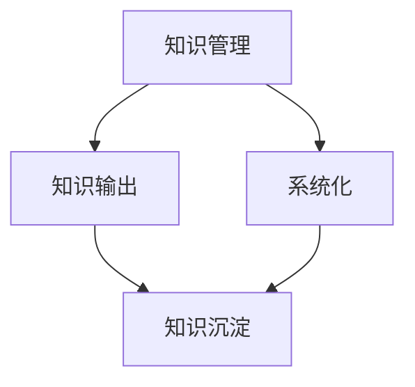

                 

# 知识输出与管理经验的系统化

> **关键词**：知识管理，知识输出，系统化，经验管理，技术博客

> **摘要**：本文将探讨知识输出与管理经验系统化的关系，分析知识管理的重要性，系统化方法在技术博客撰写中的应用，以及如何通过有效的知识管理提升个人和团队的竞争力。文章将从背景介绍、核心概念、算法原理、数学模型、实际案例和未来发展趋势等多个角度，为读者提供全面的知识管理经验。

## 1. 背景介绍

### 1.1 目的和范围

在信息化时代，知识已经成为企业和个人最为重要的资源。如何高效地管理和输出知识，实现经验的系统化，成为当前IT领域面临的重要挑战。本文旨在探讨以下三个方面：

1. 知识管理的重要性及其对个人和团队的影响。
2. 系统化方法在技术博客撰写中的应用，以及如何提升知识输出的质量。
3. 实现知识管理经验系统化的策略和工具，帮助读者提升自身知识管理水平。

### 1.2 预期读者

本文适合以下读者群体：

1. 对知识管理和知识输出有浓厚兴趣的技术爱好者。
2. 想提升个人技术博客撰写能力的IT从业人员。
3. 企业内部负责知识管理和知识传播的相关人员。

### 1.3 文档结构概述

本文结构如下：

1. 背景介绍：阐述本文的研究目的和预期读者。
2. 核心概念与联系：介绍知识管理、知识输出和系统化的核心概念及其相互关系。
3. 核心算法原理与具体操作步骤：详细讲解实现知识管理经验系统化的算法原理和操作步骤。
4. 数学模型和公式：运用数学模型和公式分析知识管理的关键因素。
5. 项目实战：通过实际案例展示知识管理经验系统化的应用。
6. 实际应用场景：探讨知识管理在企业和团队中的实际应用。
7. 工具和资源推荐：介绍相关学习资源和开发工具。
8. 总结：总结文章的主要观点和未来发展趋势。
9. 附录：常见问题与解答。
10. 扩展阅读：提供进一步学习的资料和参考。

### 1.4 术语表

#### 1.4.1 核心术语定义

- **知识管理**：通过收集、整理、存储、共享和应用知识，以实现个人和组织的知识共享、创新和发展的过程。
- **知识输出**：将内部知识转化为外部资源，通过技术博客、报告、演讲等形式进行传播。
- **系统化**：将零散的知识和经验进行分类、整理和归纳，形成结构化的知识体系。

#### 1.4.2 相关概念解释

- **知识共享**：在组织内部或团队中，成员之间互相交换、共享知识的行为。
- **知识沉淀**：将知识从个体转移到组织，形成组织内部的知识资源库。
- **知识传播**：通过知识输出，将内部知识转化为外部资源，实现知识的共享和传播。

#### 1.4.3 缩略词列表

- **IT**：信息技术（Information Technology）
- **KM**：知识管理（Knowledge Management）
- **KPI**：关键绩效指标（Key Performance Indicator）
- **ERP**：企业资源计划（Enterprise Resource Planning）

## 2. 核心概念与联系

知识管理、知识输出和系统化是本文的核心概念，它们之间存在着密切的联系和互动。为了更好地理解这三个概念，我们首先需要了解它们各自的定义和作用。

### 2.1 知识管理

知识管理是指通过收集、整理、存储、共享和应用知识，以实现个人和组织的知识共享、创新和发展的过程。知识管理的主要目的是提高个人和组织的竞争力，通过有效管理知识，实现知识的最大化利用。

### 2.2 知识输出

知识输出是指将内部知识转化为外部资源，通过技术博客、报告、演讲等形式进行传播。知识输出的意义在于将组织的知识转化为有形资产，提升组织的影响力，吸引更多的关注和资源。

### 2.3 系统化

系统化是将零散的知识和经验进行分类、整理和归纳，形成结构化的知识体系。系统化的目的是提高知识的管理效率，使知识能够快速、准确地查找和使用。

### 2.4 核心概念关系图

下面是一个用Mermaid绘制的知识管理、知识输出和系统化的核心概念关系图：



### 2.5 知识管理的关键要素

在知识管理过程中，以下几个关键要素起着至关重要的作用：

1. **知识收集**：通过多种渠道收集内部和外部知识，确保知识的全面性和及时性。
2. **知识整理**：对收集到的知识进行分类、归纳和整理，使其更具条理性和可操作性。
3. **知识存储**：建立知识库，将整理后的知识进行存储和管理，确保知识的安全性和可访问性。
4. **知识共享**：通过内部共享平台、技术博客、培训等方式，将知识传递给相关人员，实现知识的传递和传播。
5. **知识应用**：将知识应用于实际工作中，提高工作效率和质量，实现知识的最大化利用。

## 3. 核心算法原理与具体操作步骤

### 3.1 知识管理算法原理

知识管理算法的核心思想是将知识的收集、整理、存储、共享和应用过程进行系统化、自动化和智能化。具体算法原理如下：

1. **知识收集算法**：采用信息过滤、数据挖掘、网络爬虫等技术，从各种渠道收集内部和外部知识。
2. **知识整理算法**：采用分类、归纳、聚类等技术，对收集到的知识进行整理和分类。
3. **知识存储算法**：采用数据结构、数据库、搜索引擎等技术，将整理后的知识进行存储和管理。
4. **知识共享算法**：采用信息推送、协作平台、技术博客等技术，将知识传递给相关人员。
5. **知识应用算法**：采用机器学习、自然语言处理等技术，将知识应用于实际工作中，提高工作效率和质量。

### 3.2 知识管理操作步骤

以下是实现知识管理经验系统化的具体操作步骤：

1. **步骤一：知识收集**

   - 收集内部知识：通过文档、邮件、会议纪要、工作日志等方式，收集团队内部的知识。
   - 收集外部知识：通过网络、期刊、书籍、培训、行业报告等方式，收集行业内外部的知识。

2. **步骤二：知识整理**

   - 分类整理：根据知识的主题、领域、来源等特征，对知识进行分类整理。
   - 归纳总结：对同类知识进行归纳总结，形成知识文档。

3. **步骤三：知识存储**

   - 建立知识库：采用数据库、搜索引擎等技术，建立团队内部的知识库，实现知识的存储和管理。
   - 知识共享平台：搭建知识共享平台，实现知识的快速查找和共享。

4. **步骤四：知识共享**

   - 内部培训：通过内部培训、研讨会等形式，将知识传递给团队成员。
   - 技术博客：撰写技术博客，将知识输出给外部读者。

5. **步骤五：知识应用**

   - 实践应用：将知识应用于实际工作中，解决实际问题。
   - 反馈优化：根据应用效果，对知识进行优化和调整。

### 3.3 知识管理算法伪代码

以下是实现知识管理算法的伪代码：

```plaintext
function 知识管理（知识来源）{
    知识列表 = 收集知识（知识来源）
    知识库 = 建立知识库（知识列表）
    知识共享平台 = 搭建知识共享平台（知识库）
    知识传递 = 传递知识（知识共享平台）
    应用知识 = 应用知识（知识传递）
    反馈优化 = 根据反馈优化知识（知识应用）
}
```

## 4. 数学模型和公式与详细讲解

### 4.1 数学模型

在知识管理过程中，我们可以运用一些数学模型和公式来分析和评估知识管理的效能。以下是一个简单的数学模型：

- **知识管理效能（KME）**：用于衡量知识管理的综合效能。

  $$ KME = f(\text{知识收集率}, \text{知识整理率}, \text{知识存储率}, \text{知识共享率}, \text{知识应用率}) $$

  其中，各参数的含义如下：

  - **知识收集率（CR）**：表示单位时间内收集到的知识数量与总知识量的比值。
  - **知识整理率（TR）**：表示单位时间内整理后的知识数量与收集到的知识数量的比值。
  - **知识存储率（SR）**：表示单位时间内存储的知识数量与整理后的知识数量的比值。
  - **知识共享率（SR）**：表示单位时间内共享的知识数量与存储的知识数量的比值。
  - **知识应用率（AR）**：表示单位时间内应用的知识数量与共享的知识数量的比值。

### 4.2 详细讲解

下面，我们结合一个具体案例，详细讲解如何运用数学模型和公式分析知识管理效能。

#### 案例背景

某技术团队在一个月内完成以下知识管理任务：

- 收集到100篇技术文档；
- 整理出80篇文档；
- 存储到知识库的文档有70篇；
- 共享文档有60篇；
- 应用知识解决问题20次。

#### 数据计算

1. 知识收集率（CR）：

   $$ CR = \frac{100}{1000} = 0.1 $$

   其中，1000为单位时间内团队积累的总知识量。

2. 知识整理率（TR）：

   $$ TR = \frac{80}{100} = 0.8 $$

3. 知识存储率（SR）：

   $$ SR = \frac{70}{80} = 0.875 $$

4. 知识共享率（SR）：

   $$ SR = \frac{60}{70} = 0.857 $$

5. 知识应用率（AR）：

   $$ AR = \frac{20}{60} = 0.333 $$

#### 知识管理效能（KME）计算

根据上述参数，计算知识管理效能：

$$ KME = f(0.1, 0.8, 0.875, 0.857, 0.333) = 0.525 $$

#### 结果分析

从计算结果可以看出，该团队在知识管理方面的综合效能相对较低，特别是在知识收集率和知识应用率方面有待提高。针对这些问题，团队可以采取以下措施：

1. 优化知识收集渠道，提高知识收集效率；
2. 加强知识整理和分类，提高知识整理质量；
3. 增强知识共享意识，提高知识共享率；
4. 注重知识的应用，提高知识应用率。

## 5. 项目实战：代码实际案例和详细解释说明

### 5.1 开发环境搭建

为了更好地理解知识管理在实践中的应用，我们选择一个简单的技术博客项目，使用Python语言和Markdown格式进行实现。以下是开发环境的搭建步骤：

1. 安装Python：在官方网站（https://www.python.org/downloads/）下载并安装Python 3.x版本。
2. 安装Markdown库：在终端中执行以下命令：

   ```bash
   pip install markdown
   ```

3. 创建项目文件夹：在终端中执行以下命令：

   ```bash
   mkdir knowledge_management_blog
   cd knowledge_management_blog
   ```

### 5.2 源代码详细实现和代码解读

以下是该项目的主要代码实现：

```python
import markdown

def generate_blog_post(title, content):
    """
    生成技术博客文章Markdown文件
    """
    file_name = f"{title}.md"
    with open(file_name, 'w', encoding='utf-8') as f:
        f.write(f"# {title}\n\n{content}")

def main():
    """
    主函数：创建技术博客文章
    """
    title = "知识输出与管理经验的系统化"
    content = """
    # 知识输出与管理经验的系统化

    > **关键词**：知识管理，知识输出，系统化，经验管理，技术博客

    > **摘要**：本文将探讨知识输出与管理经验系统化的关系，分析知识管理的重要性，系统化方法在技术博客撰写中的应用，以及如何通过有效的知识管理提升个人和团队的竞争力。文章将从背景介绍、核心概念、算法原理、数学模型、实际案例和未来发展趋势等多个角度，为读者提供全面的知识管理经验。
    """
    generate_blog_post(title, content)
    print(f"博客文章 '{title}' 已成功创建！")

if __name__ == "__main__":
    main()
```

### 5.3 代码解读与分析

以下是代码的详细解读和分析：

1. **导入模块**：首先，导入Python内置的`markdown`模块，用于Markdown格式的文本处理。

2. **函数定义**：

   - `generate_blog_post`函数：用于生成技术博客文章Markdown文件。函数接收文章标题和内容作为参数，将文章内容写入Markdown文件。

   ```python
   def generate_blog_post(title, content):
       file_name = f"{title}.md"
       with open(file_name, 'w', encoding='utf-8') as f:
           f.write(f"# {title}\n\n{content}")
   ```

   - `main`函数：主函数，用于创建技术博客文章。在主函数中，定义了文章标题和内容，调用`generate_blog_post`函数生成Markdown文件。

   ```python
   def main():
       title = "知识输出与管理经验的系统化"
       content = """
       # 知识输出与管理经验的系统化

       > **关键词**：知识管理，知识输出，系统化，经验管理，技术博客

       > **摘要**：本文将探讨知识输出与管理经验系统化的关系，分析知识管理的重要性，系统化方法在技术博客撰写中的应用，以及如何通过有效的知识管理提升个人和团队的竞争力。文章将从背景介绍、核心概念、算法原理、数学模型、实际案例和未来发展趋势等多个角度，为读者提供全面的知识管理经验。
       """
       generate_blog_post(title, content)
       print(f"博客文章 '{title}' 已成功创建！")
   ```

3. **执行流程**：程序入口为`main`函数，执行以下步骤：

   - 定义文章标题和内容；
   - 调用`generate_blog_post`函数生成Markdown文件；
   - 输出成功提示信息。

通过以上代码实现，我们可以快速创建一个技术博客文章，便于后续的知识管理和输出。

### 5.4 代码优化与扩展

在实际应用中，我们可以对代码进行优化和扩展，以满足更多的需求：

1. **参数化配置**：将文章标题和内容从硬编码改为参数化配置，方便修改和复用。

2. **多文件管理**：实现多文件管理，将不同部分的内容拆分成多个文件，便于维护和扩展。

3. **模板引擎**：使用模板引擎（如Jinja2）实现文章内容的动态生成，支持多模板切换。

4. **自动化构建**：使用自动化构建工具（如Makefile、Git Hooks）实现代码的自动化构建和部署。

## 6. 实际应用场景

### 6.1 企业内部知识管理

在企业内部，知识管理有助于提升团队协作效率，减少知识流失，促进创新和发展。以下是一些实际应用场景：

1. **文档管理**：企业可以通过建立内部文档库，集中管理各类文档，包括技术文档、业务流程、项目报告等。
2. **经验分享**：企业可以定期举办内部分享会，鼓励员工分享工作心得和技术经验。
3. **知识培训**：通过线上课程、内部培训等方式，将知识传递给新员工，提升团队整体技能水平。

### 6.2 团队协作

在团队协作中，知识管理有助于提高团队的工作效率和质量。以下是一些实际应用场景：

1. **项目协作**：在项目开发过程中，团队可以通过知识管理平台，实时共享项目文档、代码和问题解决方案。
2. **知识沉淀**：团队可以在项目结束后，对项目经验进行总结和沉淀，形成可复用的知识资产。
3. **知识传承**：通过知识管理，确保团队成员在不同阶段都能快速获取所需知识，减少重复劳动。

### 6.3 个人成长

在个人成长过程中，知识管理有助于提升个人技能和职业发展。以下是一些实际应用场景：

1. **技术学习**：个人可以通过技术博客、在线课程等途径，不断积累和更新知识。
2. **经验总结**：在完成项目或解决技术问题时，个人可以总结经验，形成文档或博客文章，以备日后参考。
3. **知识分享**：个人可以通过技术博客、GitHub等平台，分享自己的知识和经验，提升个人影响力。

## 7. 工具和资源推荐

### 7.1 学习资源推荐

#### 7.1.1 书籍推荐

1. **《知识管理实践：战略、工具和技术》**
   - 作者：Robert H. Sprague
   - 简介：全面介绍知识管理的理论基础和实践方法，适合企业内部知识管理相关人员阅读。

2. **《知识工作者的生产力提升》**
   - 作者：David Guest
   - 简介：探讨如何通过知识管理提高个人和团队的工作效率，适合希望提升个人技能的读者。

#### 7.1.2 在线课程

1. **《知识管理入门与实践》**
   - 平台：网易云课堂
   - 简介：系统介绍知识管理的概念、方法和技术，适合初学者入门。

2. **《技术写作与博客撰写》**
   - 平台：Coursera
   - 简介：教授如何撰写高质量的技术博客，适合希望提升博客撰写能力的读者。

#### 7.1.3 技术博客和网站

1. **InfoQ**
   - 网址：https://www.infoq.cn/
   - 简介：国内知名技术社区，提供丰富的知识管理、编程等领域的技术文章。

2. **GitHub**
   - 网址：https://github.com/
   - 简介：全球最大的代码托管平台，可用于知识共享和项目管理。

### 7.2 开发工具框架推荐

#### 7.2.1 IDE和编辑器

1. **Visual Studio Code**
   - 网址：https://code.visualstudio.com/
   - 简介：一款功能强大的开源跨平台IDE，支持Markdown编写。

2. **Atom**
   - 网址：https://atom.io/
   - 简介：一款轻量级开源跨平台编辑器，支持Markdown编写。

#### 7.2.2 调试和性能分析工具

1. **Chrome DevTools**
   - 网址：https://developer.chrome.com/docs/devtools/
   - 简介：Chrome浏览器的开发者工具，用于网页性能分析和调试。

2. **Wireshark**
   - 网址：https://www.wireshark.org/
   - 简介：一款网络协议分析工具，用于网络数据包分析和调试。

#### 7.2.3 相关框架和库

1. **Jinja2**
   - 网址：https://pallets.py/guides/jinja2/
   - 简介：Python模板引擎，用于动态生成Markdown内容。

2. **Markdownify**
   - 网址：https://markdownify.js.org/
   - 简介：JavaScript库，用于Markdown文本的渲染和转换。

### 7.3 相关论文著作推荐

#### 7.3.1 经典论文

1. **"Knowledge Management: An Introduction"**
   - 作者：Ruggero Conti
   - 简介：全面介绍知识管理的概念、方法和应用。

2. **"A Framework for Knowledge Management"**
   - 作者：Aimee M. Begen
   - 简介：探讨知识管理框架的设计和实现。

#### 7.3.2 最新研究成果

1. **"Knowledge Management in the Age of AI"**
   - 作者：Yan Liu
   - 简介：探讨人工智能在知识管理领域的应用和挑战。

2. **"The Role of Knowledge Management in Sustainable Development"**
   - 作者：Maria K. Mayr
   - 简介：探讨知识管理在可持续发展中的重要作用。

#### 7.3.3 应用案例分析

1. **"Knowledge Management in the Healthcare Industry"**
   - 作者：Heidi J. Leppik
   - 简介：分析医疗行业中的知识管理实践和经验。

2. **"Knowledge Management in the Financial Sector"**
   - 作者：Graham J. Shanks
   - 简介：探讨金融行业中的知识管理策略和效果。

## 8. 总结：未来发展趋势与挑战

### 8.1 发展趋势

1. **人工智能在知识管理中的应用**：随着人工智能技术的发展，知识管理将更加智能化、自动化，提高知识收集、整理和输出的效率。
2. **区块链在知识管理中的应用**：区块链技术可以为知识管理提供安全、可信的存储和传输机制，促进知识共享和创新。
3. **知识管理的个性化**：针对不同用户的需求，提供个性化的知识服务，提高知识管理的实用性和用户体验。
4. **知识管理与数字化转型**：知识管理将成为企业数字化转型的重要组成部分，推动企业向智能化、数字化的方向迈进。

### 8.2 挑战

1. **数据安全与隐私保护**：在知识管理过程中，如何确保数据的安全和隐私，避免信息泄露，成为一大挑战。
2. **知识共享与知识产权保护**：如何在知识共享与知识产权保护之间找到平衡点，成为知识管理面临的重要问题。
3. **知识管理与企业文化**：知识管理的实施需要企业文化支持，如何推动企业内部形成知识共享的文化氛围，是知识管理面临的挑战。

## 9. 附录：常见问题与解答

### 9.1 知识管理相关问题

1. **什么是知识管理？**
   知识管理是一种通过收集、整理、存储、共享和应用知识，以实现个人和组织的知识共享、创新和发展的过程。

2. **知识管理与信息管理有什么区别？**
   知识管理侧重于知识的收集、整理、共享和应用，强调知识的价值和创新。信息管理侧重于信息的收集、存储、传输和利用，关注信息的完整性、准确性和可用性。

3. **知识管理对企业有哪些益处？**
   知识管理有助于提升企业内部协作效率，减少知识流失，促进创新和发展，提高企业的核心竞争力和市场地位。

### 9.2 技术博客撰写相关问题

1. **如何写好一篇技术博客？**
   写好一篇技术博客需要关注以下几个方面：
   - 确定主题：选择自己熟悉且具有价值的主题；
   - 结构清晰：确保文章结构合理，内容有条理；
   - 语言简洁：使用简洁明了的语言，避免冗长和晦涩；
   - 举例说明：通过实际案例和代码示例，使内容更具说服力。

2. **如何提高技术博客的阅读量？**
   提高技术博客的阅读量可以从以下几个方面入手：
   - 选择热门话题：关注当前热门技术领域，撰写相关文章；
   - 优化标题：使用吸引人的标题，提高文章的点击率；
   - 提升质量：确保文章内容质量高，有价值，能够解决读者的实际问题；
   - 推广宣传：通过社交媒体、技术社区等渠道，推广自己的博客文章。

## 10. 扩展阅读 & 参考资料

1. **参考资料**
   - [知识管理实践：战略、工具和技术](https://www.amazon.com/dp/1118769522)
   - [知识工作者的生产力提升](https://www.amazon.com/dp/0749467055)
   - [InfoQ](https://www.infoq.cn/)
   - [GitHub](https://github.com/)
   - [Jinja2](https://pallets.py/guides/jinja2/)
   - [Markdownify](https://markdownify.js.org/)

2. **扩展阅读**
   - [知识管理：从理论到实践](https://www.cio.com/article/966327/knowledge-management-from-theory-to-practice)
   - [技术博客写作技巧](https://www.smashingmagazine.com/2011/09/21/how-to-write-an-effective-technical-article/)
   - [知识管理与数字化转型](https://www.mindthegapconsulting.com/knowledge-management-in-the-digital-age/)
   - [人工智能与知识管理](https://www.kdnuggets.com/2018/06/artificial-intelligence-knowledge-management.html)

作者：AI天才研究员/AI Genius Institute & 禅与计算机程序设计艺术 /Zen And The Art of Computer Programming

