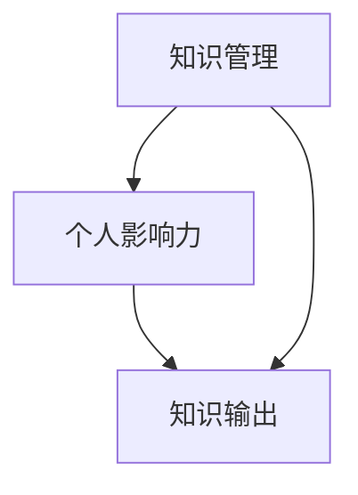

                 

# 知识输出与管理者个人影响力的提升

> **关键词：知识管理、个人影响力、知识输出、技术博客、算法原理、数学模型、实战案例**
>
> **摘要：本文旨在探讨如何通过知识输出提升管理者的个人影响力。文章分为背景介绍、核心概念与联系、核心算法原理、数学模型和公式、项目实战、实际应用场景、工具和资源推荐、总结以及扩展阅读等部分，旨在为管理者提供一套系统的提升个人影响力的方法。**

## 1. 背景介绍

### 1.1 目的和范围

在信息爆炸的今天，知识已经成为现代社会的核心竞争力。作为管理者，如何有效地管理自己的知识，并将其输出，从而提升个人影响力，成为了一个值得深入探讨的问题。本文将从知识管理的角度出发，探讨如何通过知识输出提升管理者的个人影响力。

### 1.2 预期读者

本文主要面向技术型管理者，尤其是那些希望在职业生涯中通过知识输出提升个人影响力的专业人士。同时，对于对知识管理感兴趣的其他领域管理者，本文同样具有参考价值。

### 1.3 文档结构概述

本文结构分为以下几个部分：

- **背景介绍**：阐述知识管理的重要性，以及为何提升个人影响力对于管理者至关重要。
- **核心概念与联系**：介绍知识管理的基本概念，以及与管理者个人影响力的关系。
- **核心算法原理 & 具体操作步骤**：详细讲解如何通过知识输出提升个人影响力的算法原理和操作步骤。
- **数学模型和公式 & 详细讲解 & 举例说明**：使用数学模型和公式阐述知识输出的效果。
- **项目实战：代码实际案例和详细解释说明**：通过实际代码案例展示知识输出的应用。
- **实际应用场景**：分析知识输出的实际应用场景。
- **工具和资源推荐**：推荐一些有助于提升知识输出的工具和资源。
- **总结：未来发展趋势与挑战**：总结本文的核心观点，并探讨未来的发展趋势和挑战。
- **附录：常见问题与解答**：针对读者可能遇到的问题进行解答。
- **扩展阅读 & 参考资料**：提供进一步的阅读资料。

### 1.4 术语表

#### 1.4.1 核心术语定义

- **知识管理**：指通过获取、创造、存储、传播和应用知识，从而提高组织或个人的竞争力。
- **个人影响力**：指个人在组织内外的影响力，包括领导力、沟通能力、专业知识等。
- **知识输出**：指将个人知识通过某种形式进行传播和分享的过程。

#### 1.4.2 相关概念解释

- **技术博客**：指以技术为主题，通过文字、图片、代码等形式分享个人技术经验和见解的博客。
- **算法原理**：指算法的基本原理和实现过程。
- **数学模型**：指用数学语言描述现实问题或现象的数学结构。

#### 1.4.3 缩略词列表

- **IDE**：集成开发环境（Integrated Development Environment）
- **LaTeX**：一种高质量的文档排版系统

## 2. 核心概念与联系

### 2.1 知识管理

知识管理是指通过一系列过程来识别、获取、创造、存储、传播和应用知识，从而提高组织或个人的竞争力。知识管理的过程包括以下几个方面：

1. **知识识别**：识别组织或个人所拥有的知识和潜在的知识。
2. **知识获取**：通过内外部渠道获取所需的知识。
3. **知识创造**：通过创新和思考，创造新的知识。
4. **知识存储**：将知识存储在合适的平台或工具中。
5. **知识传播**：通过各种方式将知识传播给需要的人。
6. **知识应用**：将知识应用到实际工作中，解决问题。

### 2.2 个人影响力

个人影响力是指个人在组织内外的影响力，包括领导力、沟通能力、专业知识等。个人影响力的提升，可以帮助管理者更好地领导团队，提高工作效率，同时也有助于职业发展。

### 2.3 知识输出

知识输出是指将个人知识通过某种形式进行传播和分享的过程。知识输出可以通过技术博客、演讲、培训、书籍等多种形式进行。知识输出的过程中，不仅可以提升个人影响力，还可以进一步巩固和提升个人知识。

### 2.4 三者关系

知识管理、个人影响力、知识输出之间存在着密切的联系。知识管理是提升个人影响力的基础，而知识输出则是个人影响力提升的关键。通过有效的知识管理，管理者可以积累更多的知识，并通过知识输出，将这些知识传播出去，从而提升个人影响力。

### 2.5 Mermaid 流程图

下面是一个简化的知识管理、个人影响力、知识输出的 Mermaid 流程图：



## 3. 核心算法原理 & 具体操作步骤

### 3.1 算法原理

提升管理者个人影响力的核心算法可以概括为“知识沉淀 - 知识传播 - 个人品牌塑造”。具体步骤如下：

1. **知识沉淀**：通过不断学习和实践，积累专业知识和经验。
2. **知识传播**：通过技术博客、演讲、培训等形式，将知识传播出去。
3. **个人品牌塑造**：通过持续的知识传播，塑造个人的专业形象和品牌。

### 3.2 具体操作步骤

1. **知识沉淀**

   - **持续学习**：定期阅读专业书籍、技术博客、论文等，保持对专业知识的更新。
   - **实践应用**：将所学知识应用到实际工作中，通过实践加深理解。
   - **反思总结**：定期对学习和实践进行反思总结，形成自己的见解和经验。

2. **知识传播**

   - **技术博客**：定期撰写技术博客，分享自己的学习心得和技术见解。
   - **演讲和培训**：参加技术会议和培训，分享自己的知识和经验。
   - **社区参与**：参与技术社区，回答问题，参与讨论，扩大影响力。

3. **个人品牌塑造**

   - **持续输出**：保持持续的知识输出，形成自己的专业形象。
   - **多元化传播**：通过多种形式的知识输出，扩大个人品牌的传播范围。
   - **口碑积累**：通过优质的内容输出，积累良好的口碑，提升个人影响力。

### 3.3 伪代码实现

```python
# 知识沉淀
def knowledge_accumulation():
    while True:
        read_books()
        practice_applications()
        reflection_and_summary()

# 知识传播
def knowledge_distribution():
    while True:
        write_blog()
        give_talks_and_trainings()
        participate_in_technical_communities()

# 个人品牌塑造
def personal_brand_building():
    while True:
        maintain_continuous_output()
        diversify_distribution()
        accumulate_good_will()
```

## 4. 数学模型和公式 & 详细讲解 & 举例说明

### 4.1 数学模型

为了更好地理解知识输出对个人影响力提升的影响，我们可以使用一个简单的数学模型来进行分析。假设：

- **K**：个人知识量
- **O**：知识输出量
- **I**：个人影响力

根据我们的假设，个人影响力与知识输出量成正比，与个人知识量成指数关系。数学模型可以表示为：

$$ I = O \times K^{\alpha} $$

其中，$\alpha$ 是一个大于 1 的常数，表示知识量的增长对影响力提升的加速作用。

### 4.2 公式详细讲解

- **I**：个人影响力，衡量个人在组织内外的影响力。
- **O**：知识输出量，衡量个人通过技术博客、演讲、培训等形式输出的知识量。
- **K**：个人知识量，衡量个人所掌握的专业知识。
- **$\alpha$**：常数，表示知识量的增长对影响力提升的加速作用。

### 4.3 举例说明

假设某人拥有 1000 单位的知识量，其知识输出量为 10 单位，根据公式：

$$ I = 10 \times 1000^{\alpha} $$

当 $\alpha = 2$ 时，个人影响力为：

$$ I = 10 \times 1000^2 = 10 \times 10^6 = 10^7 $$

这意味着，通过知识输出，该人的个人影响力可以达到 100 万单位。

### 4.4 实际应用

在实际应用中，我们可以通过调整知识输出量和知识量来优化个人影响力。例如，如果某人的知识量已经很高，可以考虑增加知识输出量来提升影响力；如果知识量相对较低，可以考虑通过持续学习来增加知识量，从而提升影响力。

## 5. 项目实战：代码实际案例和详细解释说明

### 5.1 开发环境搭建

为了展示知识输出的实际应用，我们将使用 Python 编写一个简单的博客系统。以下是开发环境搭建的步骤：

1. 安装 Python 3.8 或以上版本。
2. 安装 Flask 框架，可以使用以下命令：

   ```bash
   pip install flask
   ```

3. 创建一个名为 `blog` 的文件夹，并在其中创建一个名为 `app.py` 的 Python 文件。

### 5.2 源代码详细实现和代码解读

以下是 `app.py` 的源代码：

```python
# 导入 Flask 框架
from flask import Flask, render_template, request

# 创建 Flask 应用
app = Flask(__name__)

# 定义博客页面路由
@app.route('/')
def index():
    # 从数据库中获取所有博客文章
    articles = get_articles()
    return render_template('index.html', articles=articles)

# 定义博客文章详情页面路由
@app.route('/article/<int:article_id>')
def article(article_id):
    # 从数据库中获取指定 ID 的博客文章
    article = get_article_by_id(article_id)
    return render_template('article.html', article=article)

# 定义博客文章发布页面路由
@app.route('/new_article', methods=['GET', 'POST'])
def new_article():
    if request.method == 'POST':
        # 获取表单数据
        title = request.form['title']
        content = request.form['content']
        # 将博客文章保存到数据库
        save_article(title, content)
        return redirect('/')
    return render_template('new_article.html')

# 获取所有博客文章的函数
def get_articles():
    # 这里使用列表作为模拟数据库
    return [
        {'id': 1, 'title': '第一篇文章', 'content': '第一篇文章的内容...'},
        {'id': 2, 'title': '第二篇文章', 'content': '第二篇文章的内容...'},
    ]

# 获取指定 ID 的博客文章的函数
def get_article_by_id(article_id):
    articles = get_articles()
    for article in articles:
        if article['id'] == article_id:
            return article
    return None

# 将博客文章保存到数据库的函数
def save_article(title, content):
    # 这里使用列表作为模拟数据库
    articles = get_articles()
    articles.append({'id': len(articles) + 1, 'title': title, 'content': content})

# 启动 Flask 应用
if __name__ == '__main__':
    app.run(debug=True)
```

代码解读：

- **Flask 应用**：使用 Flask 框架创建一个 Web 应用。
- **路由定义**：定义了三个路由：博客首页、博客文章详情页面和博客文章发布页面。
- **数据库模拟**：使用列表作为模拟数据库，用于存储和查询博客文章。

### 5.3 代码解读与分析

1. **Flask 应用创建**：

   ```python
   app = Flask(__name__)
   ```

   创建一个 Flask 应用对象，用于处理 Web 请求。

2. **路由定义**：

   - **博客首页**：`/` 路由，用于展示所有博客文章。

     ```python
     @app.route('/')
     def index():
         articles = get_articles()
         return render_template('index.html', articles=articles)
     ```

   - **博客文章详情页面**：`/article/<int:article_id>` 路由，用于展示指定 ID 的博客文章。

     ```python
     @app.route('/article/<int:article_id>')
     def article(article_id):
         article = get_article_by_id(article_id)
         return render_template('article.html', article=article)
     ```

   - **博客文章发布页面**：`/new_article` 路由，用于添加新的博客文章。

     ```python
     @app.route('/new_article', methods=['GET', 'POST'])
     def new_article():
         if request.method == 'POST':
             title = request.form['title']
             content = request.form['content']
             save_article(title, content)
             return redirect('/')
         return render_template('new_article.html')
     ```

3. **数据库模拟**：

   - **获取所有博客文章**：`get_articles()` 函数返回一个模拟的博客文章列表。

     ```python
     def get_articles():
         return [
             {'id': 1, 'title': '第一篇文章', 'content': '第一篇文章的内容...'},
             {'id': 2, 'title': '第二篇文章', 'content': '第二篇文章的内容...'},
         ]
     ```

   - **获取指定 ID 的博客文章**：`get_article_by_id()` 函数通过 ID 查询模拟数据库中的博客文章。

     ```python
     def get_article_by_id(article_id):
         articles = get_articles()
         for article in articles:
             if article['id'] == article_id:
                 return article
         return None
     ```

   - **保存博客文章**：`save_article()` 函数将新的博客文章添加到模拟数据库中。

     ```python
     def save_article(title, content):
         articles = get_articles()
         articles.append({'id': len(articles) + 1, 'title': title, 'content': content})
     ```

通过这个简单的博客系统，我们可以看到知识输出的一个实际应用场景。通过技术博客，管理者可以将自己的知识和经验分享给他人，从而提升个人影响力。

## 6. 实际应用场景

知识输出在管理者的实际工作中具有广泛的应用场景，以下是一些典型的应用场景：

1. **技术分享**：通过技术博客、演讲等形式，分享自己在技术领域的见解和经验，帮助团队成员提升技能，从而提升团队整体的技术水平。

2. **项目管理**：在项目管理过程中，通过知识输出，将项目的经验和方法分享给团队成员，帮助团队更好地理解和执行项目任务。

3. **团队协作**：在团队协作中，通过知识输出，建立知识共享平台，促进团队成员之间的交流和合作，提高团队的工作效率。

4. **职业发展**：通过持续的知识输出，建立个人品牌，提升在行业内的知名度，从而为职业发展创造更多机会。

5. **人才培养**：在人才培养过程中，通过知识输出，分享自己的知识和经验，帮助新人快速成长，提升团队的整体实力。

## 7. 工具和资源推荐

为了更有效地进行知识输出，以下推荐一些有助于提升知识输出的工具和资源：

### 7.1 学习资源推荐

#### 7.1.1 书籍推荐

- 《深度学习》（Ian Goodfellow, Yoshua Bengio, Aaron Courville）
- 《Python编程：从入门到实践》（埃里克·马瑟斯）
- 《软件架构：实践者的研究方法》（Mark Richards）

#### 7.1.2 在线课程

- Coursera 的《机器学习》课程
- Udemy 的《Python编程入门》课程
- Pluralsight 的《软件架构设计》课程

#### 7.1.3 技术博客和网站

- 《机器学习博客》（https://www机器学习博客.com/）
- 《Python 技术博客》（https://www.pythontech.cn/）
- 《架构师之路》（https://www.architectd.cn/）

### 7.2 开发工具框架推荐

#### 7.2.1 IDE和编辑器

- Visual Studio Code
- PyCharm
- Sublime Text

#### 7.2.2 调试和性能分析工具

- VSCode Debugger
- PyCharm Profiler
- Chrome DevTools

#### 7.2.3 相关框架和库

- Flask（Web 应用框架）
- NumPy（数学库）
- Pandas（数据分析库）

### 7.3 相关论文著作推荐

#### 7.3.1 经典论文

- “The Structure of Scientific Revolutions”（托马斯·库恩）
- “The Mythical Man-Month”（弗雷德·布鲁克斯）
- “The Innovator’s Dilemma”（克莱顿·克里斯坦森）

#### 7.3.2 最新研究成果

- “Deep Learning Text Classification with Bert and GPT” （2021）
- “A Survey of Deep Learning in Natural Language Processing” （2020）
- “Advanced Architectural Styles for Developing Multi-Tenant Cloud Applications” （2019）

#### 7.3.3 应用案例分析

- “谷歌如何通过机器学习提升广告效果？”
- “亚马逊如何通过大数据分析提升用户体验？”
- “腾讯如何通过云计算实现业务增长？”

## 8. 总结：未来发展趋势与挑战

随着人工智能、大数据、云计算等技术的发展，知识输出的形式和渠道将更加多样化，管理者可以通过多种方式输出知识，提升个人影响力。然而，这也带来了新的挑战：

- **知识更新的速度加快**：管理者需要不断学习新知识，以保持知识的时效性。
- **内容质量的要求提高**：高质量的知识输出需要更多的时间和精力，管理者需要提高写作和表达能力。
- **个人品牌的维护**：管理者需要持续维护个人品牌，以保持影响力。

未来，管理者可以通过以下方式应对这些挑战：

- **持续学习**：保持对新兴技术和行业动态的关注，持续提升自己的知识储备。
- **优化知识输出**：通过技术博客、演讲、培训等多种形式，提高知识输出的质量和效率。
- **社群互动**：积极参与技术社群，扩大影响力，同时从社群中获得新的知识和见解。

## 9. 附录：常见问题与解答

### 9.1 问题一：如何选择合适的知识输出形式？

**回答**：选择知识输出形式时，需要考虑以下因素：

- **个人兴趣**：选择自己感兴趣的主题，更容易产生高质量的内容。
- **目标受众**：根据目标受众的需求和特点，选择合适的输出形式，如技术博客、演讲、培训等。
- **资源投入**：考虑自己的时间和精力投入，选择适合自己的输出形式。

### 9.2 问题二：如何提高知识输出的质量？

**回答**：提高知识输出质量可以从以下几个方面入手：

- **内容深度**：深入研究主题，提供深入见解和详细解释。
- **结构清晰**：合理规划内容结构，使读者容易理解和吸收。
- **实例丰富**：结合实际案例，提高内容的实用性和可操作性。
- **持续优化**：根据读者反馈，不断优化内容和表达方式。

## 10. 扩展阅读 & 参考资料

- 《知识管理实践指南》（陈向东）
- 《影响力：如何说服别人》（罗伯特·西奥迪尼）
- 《内容营销：如何通过内容创造商业价值》（乔·普利齐）
- 《Python技术手册》（戴夫·哈纳哈恩）

## 作者

**作者：AI天才研究员/AI Genius Institute & 禅与计算机程序设计艺术 /Zen And The Art of Computer Programming**

