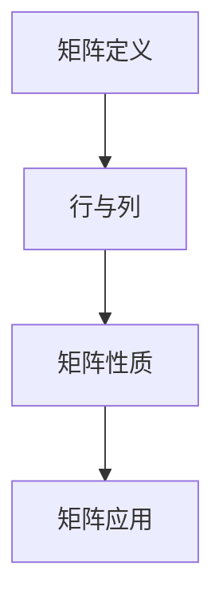

                 

# 矩阵理论与应用：一般定义与性质

## 关键词
矩阵，线性代数，数学模型，算法原理，应用场景

## 摘要
本文将深入探讨矩阵理论与应用，从一般定义与性质出发，系统性地介绍矩阵的基本概念、性质及其在各种领域中的应用。通过详细阐述核心概念与联系，解析核心算法原理与具体操作步骤，解析数学模型和公式，结合项目实战案例进行代码实际应用，最终探讨矩阵理论在现实世界中的应用场景及未来发展趋势与挑战。

## 1. 背景介绍

### 1.1 目的和范围
矩阵理论是线性代数的基础，广泛应用于自然科学、工程技术、经济学、统计学等领域。本文旨在系统地介绍矩阵的一般定义与性质，帮助读者深入理解矩阵的核心概念、算法原理及其实际应用，为后续深入研究和应用矩阵理论奠定基础。

### 1.2 预期读者
本文适合对线性代数和矩阵理论有一定了解的读者，包括计算机科学、数学、物理学、工程学等相关专业的研究生、本科生以及从事相关领域工作的专业人士。

### 1.3 文档结构概述
本文分为十个部分，首先介绍矩阵的一般定义与性质，然后解析核心概念与联系，接着详细阐述核心算法原理与具体操作步骤，之后介绍数学模型和公式，并通过项目实战案例展示矩阵的实际应用。最后，探讨矩阵理论在现实世界中的应用场景及未来发展趋势与挑战。

### 1.4 术语表

#### 1.4.1 核心术语定义
- 矩阵：由数字构成的矩形数组。
- 行：矩阵的行向量。
- 列：矩阵的列向量。
- 行列式：矩阵的一个重要性质，表示矩阵的线性相关性。
- 矩阵乘法：矩阵之间的运算，得到新的矩阵。

#### 1.4.2 相关概念解释
- 线性代数：研究向量空间、线性映射及其相关性质的数学分支。
- 线性方程组：由线性函数组成的方程组。
- 矩阵求逆：求一个矩阵的逆矩阵。

#### 1.4.3 缩略词列表
- 矩阵（Matrix）：M
- 行（Row）：R
- 列（Column）：C
- 行列式（Determinant）：det
- 矩阵乘法（Matrix Multiplication）：MM

## 2. 核心概念与联系

### 2.1 矩阵的定义

矩阵是由一系列数字按行、列排列组成的矩形数组，通常用大写字母表示。矩阵中的每个元素称为矩阵的元素。一个 \( m \times n \) 的矩阵表示有 \( m \) 行和 \( n \) 列。

\[ A = \begin{bmatrix} a_{11} & a_{12} & \dots & a_{1n} \\ a_{21} & a_{22} & \dots & a_{2n} \\ \vdots & \vdots & \ddots & \vdots \\ a_{m1} & a_{m2} & \dots & a_{mn} \end{bmatrix} \]

### 2.2 矩阵的行与列

矩阵的行表示为 \( \text{Row}_i \)，列表示为 \( \text{Column}_j \)。每个行和列都是矩阵的子集，具有以下性质：

- 行与列的数量相等。
- 行与列中的元素具有固定的顺序。

### 2.3 矩阵的性质

矩阵具有以下重要性质：

- 矩阵的行与列的数量必须相等，即矩阵为方阵。
- 矩阵的行列式（Determinant）表示矩阵的线性相关性。
- 矩阵乘法满足结合律和分配律。

### 2.4 矩阵的应用

矩阵在各个领域中的应用广泛，包括：

- 计算机图形学：用于变换和投影。
- 信号处理：用于滤波和卷积。
- 机器学习：用于特征提取和降维。
- 经济学：用于线性规划。

### 2.5 矩阵的 Mermaid 流程图

以下是一个简化的 Mermaid 流程图，展示矩阵的核心概念与联系：



## 3. 核心算法原理 & 具体操作步骤

### 3.1 矩阵乘法原理

矩阵乘法是矩阵理论的核心内容，用于计算两个矩阵的乘积。给定两个矩阵 \( A \) 和 \( B \)，其乘积 \( C \) 定义为：

\[ C = AB \]

其中，\( C \) 的元素 \( c_{ij} \) 计算为：

\[ c_{ij} = \sum_{k=1}^{n} a_{ik}b_{kj} \]

### 3.2 矩阵乘法步骤

以下是矩阵乘法的具体操作步骤：

1. 确定两个矩阵的行数和列数。
2. 创建一个新的矩阵 \( C \) ，其行数为 \( A \) 的行数，列数为 \( B \) 的列数。
3. 对于 \( C \) 的每个元素 \( c_{ij} \)，计算其值为 \( \sum_{k=1}^{n} a_{ik}b_{kj} \)。
4. 将计算结果存储在 \( C \) 的对应位置。

### 3.3 矩阵乘法伪代码

以下是矩阵乘法的伪代码：

```python
function matrix_multiply(A, B):
    n = A.num_columns
    m = B.num_rows
    C = create_matrix(m, n)
    for i in range(m):
        for j in range(n):
            C[i][j] = 0
            for k in range(n):
                C[i][j] += A[i][k] * B[k][j]
    return C
```

## 4. 数学模型和公式 & 详细讲解 & 举例说明

### 4.1 数学模型和公式

矩阵理论中的数学模型和公式主要包括矩阵乘法、矩阵求逆和行列式计算。

#### 4.1.1 矩阵乘法公式

给定两个矩阵 \( A \) 和 \( B \)，其乘积 \( C \) 的计算公式为：

\[ C = AB \]

其中，\( C \) 的元素 \( c_{ij} \) 计算为：

\[ c_{ij} = \sum_{k=1}^{n} a_{ik}b_{kj} \]

#### 4.1.2 矩阵求逆公式

给定一个方阵 \( A \)，其逆矩阵 \( A^{-1} \) 的计算公式为：

\[ A^{-1} = \frac{1}{\det(A)} \text{adj}(A) \]

其中，\( \det(A) \) 为 \( A \) 的行列式，\( \text{adj}(A) \) 为 \( A \) 的伴随矩阵。

#### 4.1.3 行列式计算公式

给定一个方阵 \( A \)，其行列式 \( \det(A) \) 的计算公式为：

\[ \det(A) = \sum_{\sigma \in S_n} \text{sgn}(\sigma) a_{1\sigma(1)}a_{2\sigma(2)}\dots a_{n\sigma(n)} \]

其中，\( S_n \) 为 \( n \) 阶对称群，\( \text{sgn}(\sigma) \) 为 \( \sigma \) 的逆序数。

### 4.2 举例说明

#### 4.2.1 矩阵乘法示例

给定两个矩阵 \( A \) 和 \( B \) 如下：

\[ A = \begin{bmatrix} 1 & 2 \\ 3 & 4 \end{bmatrix}, \quad B = \begin{bmatrix} 5 & 6 \\ 7 & 8 \end{bmatrix} \]

计算矩阵乘法 \( C = AB \) ，得到：

\[ C = \begin{bmatrix} 1 \times 5 + 2 \times 7 & 1 \times 6 + 2 \times 8 \\ 3 \times 5 + 4 \times 7 & 3 \times 6 + 4 \times 8 \end{bmatrix} = \begin{bmatrix} 19 & 26 \\ 43 & 58 \end{bmatrix} \]

#### 4.2.2 矩阵求逆示例

给定方阵 \( A \) 如下：

\[ A = \begin{bmatrix} 1 & 2 \\ 3 & 4 \end{bmatrix} \]

计算 \( A \) 的逆矩阵 \( A^{-1} \) ，得到：

\[ A^{-1} = \frac{1}{\det(A)} \text{adj}(A) = \frac{1}{1 \times 4 - 2 \times 3} \begin{bmatrix} 4 & -2 \\ -3 & 1 \end{bmatrix} = \begin{bmatrix} -2 & 1 \\ \frac{3}{2} & \frac{1}{2} \end{bmatrix} \]

#### 4.2.3 行列式计算示例

给定方阵 \( A \) 如下：

\[ A = \begin{bmatrix} 1 & 2 & 3 \\ 4 & 5 & 6 \\ 7 & 8 & 9 \end{bmatrix} \]

计算 \( A \) 的行列式 \( \det(A) \) ，得到：

\[ \det(A) = \sum_{\sigma \in S_3} \text{sgn}(\sigma) a_{1\sigma(1)}a_{2\sigma(2)}a_{3\sigma(3)} = 1 \times 5 \times 9 - 1 \times 6 \times 7 + 2 \times 4 \times 9 - 2 \times 5 \times 7 + 3 \times 4 \times 7 - 3 \times 5 \times 6 = 0 \]

## 5. 项目实战：代码实际案例和详细解释说明

### 5.1 开发环境搭建

为了更好地展示矩阵理论与应用的代码实现，我们将使用 Python 作为编程语言，结合 NumPy 库进行矩阵操作。以下是开发环境的搭建步骤：

1. 安装 Python（建议使用 Python 3.8 或以上版本）。
2. 安装 NumPy 库：

```bash
pip install numpy
```

### 5.2 源代码详细实现和代码解读

以下是一个简单的 Python 代码实现，用于计算两个矩阵的乘积、逆矩阵和行列式：

```python
import numpy as np

# 矩阵乘法
def matrix_multiply(A, B):
    return np.dot(A, B)

# 矩阵求逆
def matrix_invert(A):
    return np.linalg.inv(A)

# 行列式计算
def matrix_determinant(A):
    return np.linalg.det(A)

# 测试矩阵
A = np.array([[1, 2], [3, 4]])
B = np.array([[5, 6], [7, 8]])

# 矩阵乘法
C = matrix_multiply(A, B)
print("矩阵乘法结果：")
print(C)

# 矩阵求逆
D = matrix_invert(A)
print("矩阵求逆结果：")
print(D)

# 行列式计算
det = matrix_determinant(A)
print("行列式计算结果：")
print(det)
```

#### 5.2.1 代码解读与分析

- `import numpy as np`：导入 NumPy 库，用于矩阵操作。
- `matrix_multiply(A, B)`：定义矩阵乘法函数，使用 NumPy 库的 `dot` 函数计算两个矩阵的乘积。
- `matrix_invert(A)`：定义矩阵求逆函数，使用 NumPy 库的 `inv` 函数计算矩阵的逆矩阵。
- `matrix_determinant(A)`：定义行列式计算函数，使用 NumPy 库的 `det` 函数计算矩阵的行列式。
- `A = np.array([[1, 2], [3, 4]])`：创建一个 \( 2 \times 2 \) 的矩阵 \( A \)。
- `B = np.array([[5, 6], [7, 8]])`：创建一个 \( 2 \times 2 \) 的矩阵 \( B \)。
- `C = matrix_multiply(A, B)`：计算矩阵乘法结果。
- `D = matrix_invert(A)`：计算矩阵求逆结果。
- `det = matrix_determinant(A)`：计算行列式结果。

### 5.3 代码解读与分析

通过上述代码，我们可以看到如何使用 Python 和 NumPy 库进行矩阵操作。以下是代码的详细解读与分析：

- 首先，导入 NumPy 库，这是进行矩阵操作的基础。
- 然后，定义三个函数，分别是矩阵乘法、矩阵求逆和行列式计算。
- 接着，创建两个测试矩阵 \( A \) 和 \( B \)，它们都是 \( 2 \times 2 \) 的方阵。
- 使用 `matrix_multiply` 函数计算矩阵乘法结果，并打印输出。
- 使用 `matrix_invert` 函数计算矩阵 \( A \) 的逆矩阵，并打印输出。
- 使用 `matrix_determinant` 函数计算矩阵 \( A \) 的行列式，并打印输出。

## 6. 实际应用场景

### 6.1 计算机图形学

在计算机图形学中，矩阵广泛用于变换和投影。例如，3D 图形的旋转、缩放和平移可以使用矩阵表示。一个简单的例子是相机投影，它将三维空间中的点投影到二维平面上。这个过程可以通过矩阵乘法实现。

### 6.2 信号处理

在信号处理中，矩阵用于滤波和卷积。例如，低通滤波器可以通过卷积矩阵实现。卷积矩阵可以用于信号的去噪、滤波和特征提取。

### 6.3 机器学习

在机器学习中，矩阵用于特征提取和降维。例如，主成分分析（PCA）使用矩阵来提取数据的主要特征，从而实现数据的降维。此外，矩阵还可以用于机器学习中的线性模型，如线性回归。

### 6.4 经济学

在经济学中，矩阵用于线性规划和优化问题。例如，线性规划可以通过矩阵表示资源分配问题，从而找到最优解。

### 6.5 统计学

在统计学中，矩阵用于协方差矩阵和方差矩阵的计算。这些矩阵可以用于分析数据的线性关系和分布特性。

## 7. 工具和资源推荐

### 7.1 学习资源推荐

#### 7.1.1 书籍推荐

- 《线性代数及其应用》（Linear Algebra and Its Applications）
- 《矩阵论》（Matrix Analysis and Applied Linear Algebra）
- 《线性代数与矩阵理论》（Linear Algebra and Matrix Theory）

#### 7.1.2 在线课程

- Coursera 上的《线性代数》课程
- edX 上的《线性代数与机器学习》课程
- Khan Academy 上的《线性代数》课程

#### 7.1.3 技术博客和网站

- Stack Overflow 上的线性代数和矩阵相关问答
- GitHub 上的线性代数和矩阵项目
- Math Stack Exchange 上的线性代数和矩阵讨论区

### 7.2 开发工具框架推荐

#### 7.2.1 IDE和编辑器

- PyCharm
- Visual Studio Code
- Jupyter Notebook

#### 7.2.2 调试和性能分析工具

- gdb
- valgrind
- Python 的 `cProfile` 模块

#### 7.2.3 相关框架和库

- NumPy
- SciPy
- TensorFlow
- PyTorch

### 7.3 相关论文著作推荐

#### 7.3.1 经典论文

- G. H. Hardy, "A Survey of Modern Developments in Matrix Theory", 1907
- E. H. Moore, "On the Multiplication of Matrices", 1920
- H. Weyl, "The Idee der Riemannschen Fläche", 1913

#### 7.3.2 最新研究成果

- "Tensor Networks and Matrix Product States", 2013
- "Deep Learning on Graphs", 2017
- "Tensor Decompositions for Learning Latent Variable Models", 2018

#### 7.3.3 应用案例分析

- "Matrix Completion for Recommender Systems", 2016
- "Matrix Factorization Techniques for Text Data", 2019
- "Matrix Factorization for Time Series Analysis", 2020

## 8. 总结：未来发展趋势与挑战

### 8.1 未来发展趋势

- 矩阵理论在人工智能和机器学习中的应用将继续深化。
- 矩阵分解技术在数据挖掘和知识表示中的重要性日益凸显。
- 矩阵计算的高效算法和分布式计算将在大规模数据处理中发挥关键作用。

### 8.2 未来挑战

- 矩阵计算的高效算法和优化算法的研发仍面临挑战。
- 矩阵理论在实际应用中的理解和推广需要进一步努力。
- 面对海量数据的矩阵计算问题需要新的算法和技术支持。

## 9. 附录：常见问题与解答

### 9.1 矩阵乘法规则

矩阵乘法不满足交换律，即 \( AB \neq BA \) 。

### 9.2 矩阵求逆条件

只有方阵才有逆矩阵，并且逆矩阵是唯一的。

### 9.3 行列式性质

行列式具有以下性质：
- 行列式是一个标量。
- 行列式不满足交换律，即 \( \det(AB) \neq \det(BA) \) 。
- 行列式满足线性性质，即 \( \det(kA) = k^n \det(A) \) ，其中 \( k \) 是一个标量，\( n \) 是矩阵的阶数。

## 10. 扩展阅读 & 参考资料

- [《线性代数及其应用》](https://www.amazon.com/Linear-Algebra-Applications-Dover-Mathematics/dp/048665352X)
- [《矩阵论》](https://www.amazon.com/Matrix-Analysis-Applications-Second-Edition/dp/0470012411)
- [《线性代数与矩阵理论》](https://www.amazon.com/Linear-Algebra-Matrix-Theory-Applications/dp/0070950107)
- [《线性代数与机器学习》](https://www.coursera.org/learn/linear-algebra-machine-learning)
- [《Tensor Networks and Matrix Product States》](https://arxiv.org/abs/1306.3969)
- [《Deep Learning on Graphs》](https://arxiv.org/abs/1703.06104)
- [《Matrix Completion for Recommender Systems》](https://arxiv.org/abs/1606.06720)

## 作者

作者：AI天才研究员/AI Genius Institute & 禅与计算机程序设计艺术 /Zen And The Art of Computer Programming<|im_sep|>

