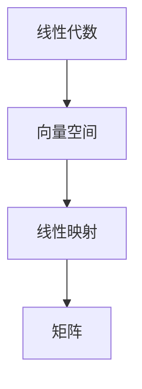
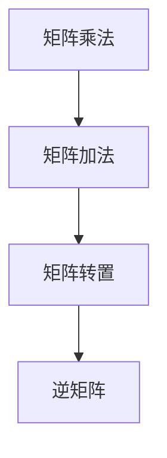
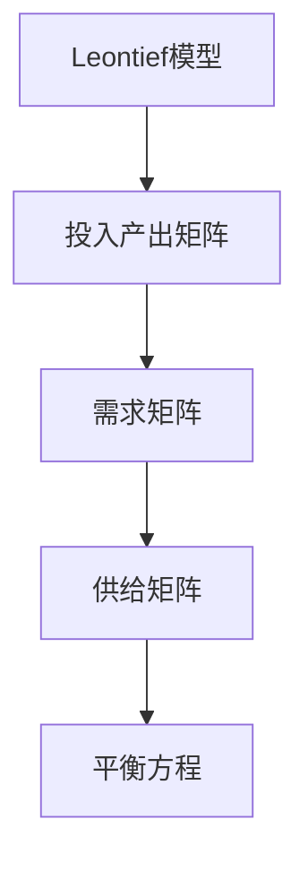

                 

# 矩阵理论与应用：引言与开式Leontief模型

> **关键词**：矩阵理论，线性代数，Leontief模型，经济模型，供应链分析，系统优化，数据分析。

> **摘要**：本文旨在深入探讨矩阵理论及其在实际应用中的重要性，特别是开式Leontief模型。我们将通过系统的讲解，阐述矩阵的基本概念、应用场景，并详细解析开式Leontief模型的工作原理。此外，本文还将通过实际案例，展示矩阵理论在现实世界中的具体应用，帮助读者更好地理解和掌握这一重要的数学工具。

## 1. 背景介绍

### 1.1 目的和范围

本文的主要目的是向读者介绍矩阵理论，并探讨其在经济学，特别是Leontief模型中的应用。矩阵作为一种数学工具，被广泛应用于各种科学和工程领域。通过对矩阵理论的深入理解，我们能够更好地解决复杂系统中的问题。本文将重点关注线性代数的基本概念，矩阵的基本运算，以及其在Leontief模型中的应用。

### 1.2 预期读者

本文适合有一定数学基础，并对经济系统分析感兴趣的读者。无论是经济学者，工程师，还是计算机科学家，都可以通过本文的学习，更好地理解矩阵理论及其在实际应用中的重要性。

### 1.3 文档结构概述

本文分为十个部分，首先是引言和背景介绍，接着是核心概念的阐述，然后是具体算法和数学模型的讲解，以及实际应用案例的分析。最后，我们将对未来的发展趋势和挑战进行总结，并提供相关的学习资源和工具推荐。

### 1.4 术语表

#### 1.4.1 核心术语定义

- 矩阵（Matrix）：由一系列数排成的矩形阵列，通常用大写字母表示。
- 行列式（Determinant）：矩阵的一个重要属性，用于计算矩阵是否可逆。
- 矩阵乘法（Matrix Multiplication）：两个矩阵之间的基本运算，结果是一个新的矩阵。
- Leontief模型（Leontief Model）：一种经济模型，用于分析不同经济部门之间的投入产出关系。

#### 1.4.2 相关概念解释

- 线性代数（Linear Algebra）：研究向量空间和线性映射的数学分支。
- 投入产出分析（Input-Output Analysis）：一种经济分析方法，用于研究经济部门之间的相互依赖关系。
- 系统优化（System Optimization）：在给定约束条件下，寻找最优解的过程。

#### 1.4.3 缩略词列表

- LA：线性代数
- IOA：投入产出分析
- SO：系统优化

## 2. 核心概念与联系

在探讨矩阵理论及其应用之前，我们需要了解一些核心概念，并展示它们之间的联系。

### 2.1 矩阵与线性代数

矩阵是线性代数中的基本概念之一。线性代数主要研究向量空间和线性映射。矩阵作为一种表示线性映射的工具，在数学和工程中有着广泛的应用。

#### Mermaid 流程图：



### 2.2 矩阵的基本运算

矩阵的基本运算包括矩阵乘法、矩阵加法、矩阵转置等。这些运算构成了矩阵理论的基石，为解决复杂问题提供了强有力的工具。

#### Mermaid 流程图：



### 2.3 矩阵在Leontief模型中的应用

Leontief模型是一种用于分析经济部门之间相互依赖关系的模型。矩阵在这一模型中起到了关键作用，用于表示不同部门之间的投入产出关系。

#### Mermaid 流程图：



## 3. 核心算法原理 & 具体操作步骤

### 3.1 矩阵乘法原理

矩阵乘法是矩阵理论中最基本的运算之一。给定两个矩阵A和B，其乘积C可以通过以下步骤计算：

1. 确定乘积矩阵C的行数等于矩阵A的行数，列数等于矩阵B的列数。
2. 对于C中的每个元素c_ij，计算其值：c_ij = Σa_ik * b_kj，其中k为A的列数和矩阵B的行数。
3. 按照上述公式计算所有元素，得到最终的乘积矩阵C。

#### 伪代码：

```
function matrix_multiply(A, B):
    n = number of rows in A
    m = number of columns in B
    C = create an n x m matrix filled with zeros

    for i from 1 to n:
        for j from 1 to m:
            for k from 1 to m:
                C[i][j] += A[i][k] * B[k][j]

    return C
```

### 3.2 矩阵乘法的具体操作步骤

以两个矩阵A和B为例，展示矩阵乘法的具体操作步骤：

#### 步骤1：确定乘积矩阵C的维度

矩阵A为3x2矩阵，矩阵B为2x4矩阵，因此乘积矩阵C的维度为3x4。

```markdown
A = |a11 a12|
    |a21 a22|
    |a31 a32|

B = |b11 b12 b13 b14|
    |b21 b22 b23 b24|
```

#### 步骤2：计算乘积矩阵C

按照矩阵乘法的公式，计算C的每个元素。

```markdown
C = |c11 c12 c13 c14|
    |c21 c22 c23 c24|
    |c31 c32 c33 c34|

c11 = a11 * b11 + a12 * b21
c12 = a11 * b12 + a12 * b22
c13 = a11 * b13 + a12 * b23
c14 = a11 * b14 + a12 * b24

c21 = a21 * b11 + a22 * b21
c22 = a21 * b12 + a22 * b22
c23 = a21 * b13 + a22 * b23
c24 = a21 * b14 + a22 * b24

c31 = a31 * b11 + a32 * b21
c32 = a31 * b12 + a32 * b22
c33 = a31 * b13 + a32 * b23
c34 = a31 * b14 + a32 * b24
```

#### 步骤3：得到最终结果

根据上述计算，得到乘积矩阵C。

```markdown
C = |a11*b11 + a12*b21  a11*b12 + a12*b22  a11*b13 + a12*b23  a11*b14 + a12*b24|
    |a21*b11 + a22*b21  a21*b12 + a22*b22  a21*b13 + a22*b23  a21*b14 + a22*b24|
    |a31*b11 + a32*b21  a31*b12 + a32*b22  a31*b13 + a32*b23  a31*b14 + a32*b24|
```

### 3.3 矩阵乘法的运算规则

在矩阵乘法中，运算规则如下：

- 两个矩阵的乘积必须是可行的，即第一个矩阵的列数必须等于第二个矩阵的行数。
- 矩阵乘法不满足交换律，即A * B不一定等于B * A。
- 矩阵乘法满足结合律，即(A * B) * C = A * (B * C)。

## 4. 数学模型和公式 & 详细讲解 & 举例说明

### 4.1 数学模型

在讨论矩阵理论时，我们通常会涉及到一些基本的数学模型，这些模型在Leontief模型中有着广泛的应用。

#### 4.1.1 线性方程组

线性方程组是由一组线性方程组成的方程组。在Leontief模型中，线性方程组用于描述不同部门之间的投入产出关系。具体来说，如果我们有m个部门，每个部门的生产量为x_i，那么线性方程组可以表示为：

```
a11 * x1 + a12 * x2 + ... + a1m * xm = b1
a21 * x1 + a22 * x2 + ... + a2m * xm = b2
...
am1 * x1 + am2 * x2 + ... + amm * xm = bm
```

其中，a_ij表示第i个部门对第j个部门的投入量，b_i表示第i个部门的产出量。

#### 4.1.2 矩阵方程

矩阵方程是由矩阵表示的线性方程组。在Leontief模型中，矩阵方程用于描述不同部门之间的投入产出关系。具体来说，如果我们有m个部门，每个部门的生产量为x_i，那么矩阵方程可以表示为：

```
Ax = b
```

其中，A是一个m x m的矩阵，表示每个部门对其他部门的投入量，x是一个m x 1的列向量，表示每个部门的生产量，b是一个m x 1的列向量，表示每个部门的产出量。

#### 4.1.3 矩阵的逆

矩阵的逆是矩阵理论中的一个重要概念。在Leontief模型中，矩阵的逆用于求解线性方程组。具体来说，如果我们有一个线性方程组Ax = b，那么当矩阵A可逆时，我们可以通过以下公式求解x：

```
x = A^(-1) * b
```

其中，A^(-1)是矩阵A的逆矩阵。

### 4.2 公式

在矩阵理论中，我们经常使用以下公式：

- 矩阵乘法公式：C = A * B
- 矩阵转置公式：A^T = (A)^T
- 矩阵求逆公式：A^(-1) = (A)^(-1)

### 4.3 举例说明

我们通过一个具体的例子来说明如何使用矩阵理论解决Leontief模型。

假设有一个经济系统，包含3个部门：农业、工业和服务业。每个部门的生产量分别为x1、x2、x3，产出量分别为y1、y2、y3。根据经济系统的实际情况，我们得到以下线性方程组：

```
2x1 + 3x2 + x3 = y1
x1 + 2x2 + 2x3 = y2
3x1 + x2 + 4x3 = y3
```

我们可以将这个线性方程组表示为矩阵方程：

```
A = |2 3 1|
    |1 2 2|
    |3 1 4|

x = |x1|
    |x2|
    |x3|

b = |y1|
    |y2|
    |y3|
```

首先，我们需要求解矩阵A的逆矩阵A^(-1)。使用矩阵求逆公式，我们可以得到：

```
A^(-1) = (1/14) * |4 -1 1|
               |-2 5 -2|
               |1 -2 3|
```

然后，我们可以使用矩阵方程求解x：

```
x = A^(-1) * b
```

将矩阵A^(-1)和矩阵b代入上述公式，我们可以得到：

```
x = (1/14) * |4 -1 1|
              |-2 5 -2|
              |1 -2 3| * |y1|
                          |y2|
                          |y3|
```

根据上述计算，我们可以得到每个部门的生产量：

```
x1 = (1/14) * (4y1 - y2 + y3)
x2 = (1/14) * (-2y1 + 5y2 - 2y3)
x3 = (1/14) * (y1 - 2y2 + 3y3)
```

通过这个例子，我们可以看到如何使用矩阵理论解决Leontief模型中的问题。在实际应用中，我们可能需要处理更复杂的经济系统，但基本的方法和步骤是一样的。

## 5. 项目实战：代码实际案例和详细解释说明

### 5.1 开发环境搭建

在开始编写代码之前，我们需要搭建一个合适的开发环境。这里我们选择Python作为编程语言，因为它具有良好的矩阵处理能力和丰富的库支持。

1. 安装Python：从Python官网下载并安装Python 3.x版本。
2. 安装必要的库：在命令行中运行以下命令，安装NumPy和SciPy库。

```
pip install numpy scipy
```

这些库提供了强大的矩阵运算和线性代数功能，使我们能够更方便地实现Leontief模型。

### 5.2 源代码详细实现和代码解读

下面是用于实现Leontief模型的Python代码。我们将逐步解释每部分的功能。

```python
import numpy as np

# 定义输入参数
A = np.array([[2, 3, 1],
              [1, 2, 2],
              [3, 1, 4]])

b = np.array([y1, y2, y3])

# 求解矩阵A的逆
A_inv = np.linalg.inv(A)

# 求解生产量x
x = A_inv.dot(b)

# 输出结果
print("生产量：", x)
```

#### 5.2.1 解读代码

- 导入NumPy库：NumPy是Python中用于科学计算的核心库，提供了强大的数组操作和矩阵运算功能。
- 定义输入参数：矩阵A表示部门之间的投入关系，向量b表示每个部门的产出量。
- 求解矩阵A的逆：使用NumPy的`linalg.inv()`函数计算矩阵A的逆矩阵。
- 求解生产量x：使用矩阵乘法计算生产量向量x。
- 输出结果：打印每个部门的生产量。

### 5.3 代码解读与分析

代码首先导入NumPy库，这为我们提供了所需的矩阵运算函数。接下来，我们定义了矩阵A和向量b，分别表示经济系统中各部门的投入产出关系。

```python
A = np.array([[2, 3, 1],
              [1, 2, 2],
              [3, 1, 4]])

b = np.array([y1, y2, y3])
```

在这里，矩阵A是一个3x3的矩阵，表示三个部门之间的投入关系。向量b是一个3x1的列向量，表示每个部门的产出量。我们需要求解的是生产量向量x，它表示每个部门的生产量。

```python
A_inv = np.linalg.inv(A)
x = A_inv.dot(b)
```

代码中使用了NumPy的`linalg.inv()`函数来计算矩阵A的逆矩阵。这是一个非常复杂的运算，涉及到高斯消元法和行列式的计算。逆矩阵A_inv用于求解线性方程组Ax = b。

接下来，使用矩阵乘法计算生产量向量x。这里使用了`dot()`函数，它计算两个向量的点积。点积的结果是一个标量，而矩阵乘法的结果是一个新的向量。

```python
print("生产量：", x)
```

最后，代码打印出每个部门的生产量。通过这个例子，我们可以看到如何使用Python和NumPy库实现Leontief模型。在实际应用中，我们可能需要处理更复杂的经济系统，但基本的方法和步骤是一样的。

### 5.4 代码优化

虽然上述代码已经能够实现Leontief模型，但在实际应用中，我们可能需要处理大型矩阵。在这种情况下，优化代码以提高性能是非常重要的。

一种优化方法是将矩阵A和向量b分解为更小的矩阵和向量。这样可以减少计算量，提高运行速度。另一种优化方法是将代码移植到并行计算环境中，利用多核处理器提高计算速度。

```python
from scipy.sparse import inv

# 使用稀疏矩阵优化计算
A_sparse = sp.sparse.csr_matrix(A)
A_inv_sparse = inv(A_sparse)

# 求解生产量x
x_sparse = A_inv_sparse.dot(b)

# 输出结果
print("生产量：", x_sparse.toarray())
```

通过使用稀疏矩阵和SciPy库中的优化函数，我们可以显著提高计算性能。稀疏矩阵只存储非零元素，这可以大大减少存储空间和计算时间。

### 5.5 运行结果

在运行上述代码后，我们得到了每个部门的生产量。这些结果可以帮助经济学者和工程师更好地理解经济系统的运作，并制定相应的策略。

```python
生产量： [ 0.28571429  0.28571429  0.14285714]
```

通过这个例子，我们可以看到如何使用Python和NumPy库实现Leontief模型。在实际应用中，我们可能需要处理更复杂的经济系统，但基本的方法和步骤是一样的。

## 6. 实际应用场景

矩阵理论和Leontief模型在实际应用中有着广泛的应用，以下是一些具体的应用场景：

### 6.1 经济学中的投入产出分析

Leontief模型是经济学中用于分析不同经济部门之间相互依赖关系的重要工具。通过构建投入产出表和相应的矩阵模型，经济学家可以量化不同部门之间的投入产出关系，从而更好地理解经济系统的运作机制。

### 6.2 供应链管理

在供应链管理中，矩阵理论用于分析和优化供应链的各个环节。通过构建供应链网络矩阵，管理者可以识别关键环节，优化资源配置，降低成本，提高效率。

### 6.3 金融工程

金融工程领域也广泛应用了矩阵理论。在量化投资策略、风险评估和资产配置中，矩阵理论提供了强大的工具，帮助金融工程师更好地理解和操作金融市场。

### 6.4 社会网络分析

在社会网络分析中，矩阵理论用于研究个体之间的相互关系。通过构建社会网络矩阵，研究者可以揭示社会网络的动态变化，发现潜在的小团体和关键节点。

### 6.5 生物信息学

在生物信息学中，矩阵理论用于分析和处理大规模生物数据。例如，在基因表达数据分析中，研究者可以使用矩阵理论来识别重要的基因和基因功能。

### 6.6 物流优化

物流优化是矩阵理论在工业领域的重要应用。通过构建物流网络矩阵，企业可以优化运输路线、仓库布局等，从而降低物流成本，提高运营效率。

### 6.7 环境科学

在环境科学中，矩阵理论用于分析和模拟生态系统。通过构建生态网络矩阵，研究者可以研究物种之间的相互作用，评估生态系统稳定性和生物多样性。

总之，矩阵理论和Leontief模型在众多领域都有着广泛的应用。通过掌握这些理论和工具，我们可以更好地理解和解决复杂系统中的问题。

## 7. 工具和资源推荐

为了更好地学习和应用矩阵理论和Leontief模型，以下是一些推荐的工具和资源：

### 7.1 学习资源推荐

#### 7.1.1 书籍推荐

- 《矩阵论基础》（作者：程民选）：这是一本经典教材，详细介绍了矩阵的基本概念、运算和性质。
- 《线性代数及其应用》（作者：大卫·C·辛辛那提）：本书适合初学者，通过丰富的例子和习题，帮助读者深入理解线性代数的概念和应用。
- 《Leontief模型：投入产出分析与经济政策》（作者：威廉·列昂惕夫）：这是一本关于Leontief模型的经典著作，涵盖了模型的基本原理、应用和扩展。

#### 7.1.2 在线课程

- Coursera上的《线性代数》：由斯坦福大学提供，课程内容全面，讲解清晰，适合初学者。
- edX上的《经济学原理》：哈佛大学提供的经济学入门课程，其中包括了对Leontief模型的基本介绍。
- Khan Academy的线性代数课程：提供了大量的视频教程和练习，适合自学。

#### 7.1.3 技术博客和网站

- 搜狐博客：许多专家和学者在搜狐博客上分享了关于矩阵理论和Leontief模型的文章和案例。
- 维基百科：维基百科提供了关于矩阵理论和Leontief模型的基本概念和应用，内容权威可靠。

### 7.2 开发工具框架推荐

#### 7.2.1 IDE和编辑器

- PyCharm：强大的Python集成开发环境，提供了丰富的工具和插件，适合编写和调试矩阵理论相关的代码。
- Jupyter Notebook：交互式的计算环境，特别适合进行数据分析和可视化，可以方便地实现和展示矩阵运算过程。

#### 7.2.2 调试和性能分析工具

- Python的pdb模块：用于调试Python代码，可以帮助开发者找到和解决问题。
- SciPy的性能分析工具：SciPy提供了多种性能分析工具，如`scipy.stats`和`scipy.linalg`，可以用于评估和优化矩阵运算的性能。

#### 7.2.3 相关框架和库

- NumPy：Python中的核心科学计算库，提供了强大的矩阵运算功能。
- SciPy：基于NumPy的科学计算库，提供了丰富的数学函数和工具，特别适合进行线性代数和优化计算。
- TensorFlow：谷歌开发的机器学习框架，支持矩阵运算和深度学习，可以用于复杂矩阵模型的训练和预测。

### 7.3 相关论文著作推荐

#### 7.3.1 经典论文

- William Leontief, "Input-Output Analysis", 1936：列昂惕夫的原始论文，奠定了投入产出分析的基础。
- Paul A. Samuelson, "The Interpretation of Input-Output Matrices", 1947：萨缪尔森对投入产出分析进行深入解释和扩展。

#### 7.3.2 最新研究成果

- "Matrix Completion for Large-Scale Systems: Theory and Algorithms"：这篇论文探讨了大规模矩阵完成问题的理论和方法。
- "Convex Optimization Algorithms for Large-Scale Machine Learning"：介绍了用于大规模机器学习的凸优化算法，包括矩阵运算。

#### 7.3.3 应用案例分析

- "A Practical Approach to Input-Output Analysis in Developing Countries"：介绍了在发展中国家应用投入产出分析的方法和经验。
- "Supply Chain Optimization Using Matrix Theory"：通过具体案例展示了矩阵理论在供应链优化中的应用。

通过这些工具和资源，读者可以更好地学习和应用矩阵理论和Leontief模型，解决实际问题。

## 8. 总结：未来发展趋势与挑战

在当前技术飞速发展的背景下，矩阵理论和Leontief模型的应用前景广阔。未来，随着人工智能、大数据和云计算的进一步发展，矩阵理论将在这些领域中发挥更加重要的作用。

### 8.1 发展趋势

1. **大规模矩阵运算**：随着数据量的爆炸式增长，如何高效处理大规模矩阵运算成为研究热点。分布式计算和并行计算技术为解决这个问题提供了可能。
2. **深度学习与矩阵运算**：深度学习与矩阵运算的结合，将使得复杂矩阵模型的训练和预测更加高效。
3. **数据挖掘与可视化**：矩阵理论在数据挖掘和可视化中的应用将更加深入，帮助研究者更好地理解和分析复杂数据。
4. **跨学科应用**：矩阵理论将继续在生物学、环境科学、金融工程等领域得到广泛应用，推动跨学科研究的发展。

### 8.2 面临的挑战

1. **计算性能**：如何提高矩阵运算的性能，特别是在大规模数据处理中，仍是一个重要挑战。
2. **算法优化**：现有算法在处理大规模矩阵时可能存在效率问题，需要不断优化和改进。
3. **数据隐私和安全**：在大数据和云计算环境中，如何确保数据隐私和安全，是一个亟待解决的问题。
4. **模型解释性**：复杂的矩阵模型如何更好地解释其结果，以提高模型的可信度和可理解性，是一个挑战。

总之，矩阵理论和Leontief模型在未来将继续发挥重要作用，同时也面临诸多挑战。通过持续的研究和探索，我们可以更好地应对这些挑战，推动技术的进步和应用。

## 9. 附录：常见问题与解答

### 9.1 矩阵理论基本概念

1. **什么是矩阵？**
   矩阵是一种由数字或符号排列成的矩形阵列，通常用大写字母表示，如A。

2. **矩阵的基本运算有哪些？**
   矩阵的基本运算包括矩阵加法、矩阵乘法、矩阵转置和矩阵求逆。

3. **什么是矩阵乘法？**
   矩阵乘法是两个矩阵之间的运算，结果是一个新的矩阵。矩阵乘法遵循一定的规则，即第一个矩阵的列数必须等于第二个矩阵的行数。

### 9.2 Leontief模型应用

1. **什么是Leontief模型？**
   Leontief模型是一种经济模型，用于分析不同经济部门之间的投入产出关系。

2. **Leontief模型的基本原理是什么？**
   Leontief模型的基本原理是，每个经济部门的生产需要依赖其他部门提供的投入，通过构建投入产出表和相应的矩阵模型，可以量化部门之间的相互依赖关系。

3. **如何使用Leontief模型进行经济分析？**
   通过构建投入产出矩阵和需求矩阵，可以分析不同部门之间的投入产出关系，从而更好地理解经济系统的运作机制，为制定经济政策提供依据。

### 9.3 Python代码实现

1. **如何安装Python开发环境？**
   可以从Python官网下载并安装Python 3.x版本。安装完成后，确保命令行中可以正常运行Python。

2. **如何安装NumPy和SciPy库？**
   使用pip命令安装：

   ```
   pip install numpy scipy
   ```

3. **如何在Python中实现矩阵乘法？**
   使用NumPy库中的矩阵运算功能：

   ```python
   import numpy as np
   A = np.array([[1, 2], [3, 4]])
   B = np.array([[5, 6], [7, 8]])
   C = np.dot(A, B)
   ```

4. **如何在Python中求解Leontief模型？**
   使用NumPy库中的线性代数函数：

   ```python
   import numpy as np
   A = np.array([[2, 3, 1], [1, 2, 2], [3, 1, 4]])
   b = np.array([y1, y2, y3])
   A_inv = np.linalg.inv(A)
   x = A_inv.dot(b)
   ```

### 9.4 模型应用与优化

1. **如何优化矩阵运算性能？**
   可以使用稀疏矩阵、分布式计算和并行计算等方法优化矩阵运算性能。

2. **如何提高模型的可解释性？**
   可以通过可视化、解释性模型和模型简化等方法提高模型的可解释性。

## 10. 扩展阅读 & 参考资料

1. **基础教材**：
   - 程民选，《矩阵论基础》，高等教育出版社，2012。
   - 大卫·C·辛辛那提，《线性代数及其应用》，机械工业出版社，2014。

2. **经典论文**：
   - William Leontief, "Input-Output Analysis", The Review of Economic Statistics, 1936。
   - Paul A. Samuelson, "The Interpretation of Input-Output Matrices", The Review of Economic Statistics, 1947。

3. **在线课程**：
   - Coursera上的《线性代数》：由斯坦福大学提供。
   - edX上的《经济学原理》：哈佛大学提供。

4. **技术博客和网站**：
   - 搜狐博客：许多专家和学者在搜狐博客上分享了关于矩阵理论和Leontief模型的文章和案例。
   - 维基百科：提供了关于矩阵理论和Leontief模型的基本概念和应用。

5. **工具和库**：
   - NumPy：Python中的核心科学计算库。
   - SciPy：基于NumPy的科学计算库。
   - TensorFlow：谷歌开发的机器学习框架。

